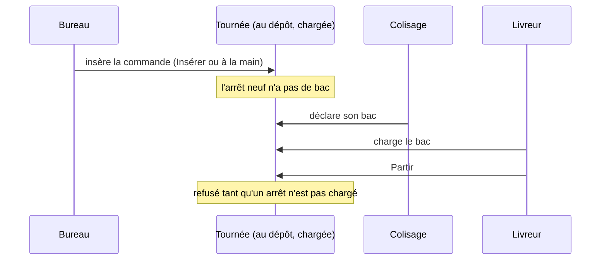

# Insérer une commande avant le départ

> **État : doc d'état, relue contre le code le 2026-10-07.** Les deux
> décisions de Hugo du même jour sont bâties (§ 2) ; il reste un point
> connu (§ 5). Née de la question Q1 de
> l'[audit du 2026-10-07](audit-2026-10-07.md).

## 1. La règle

**Une tournée reçoit des commandes jusqu'à son départ, chargée ou non.**
Ce qui limite, c'est **la place restante dans le véhicule**, pas le fait que
le chargement ait commencé (Hugo, 2026-10-07, après « non parties » le
2026-09-29).

Le départ, lui, est la porte qui ne bouge pas : une tournée **partie** ne se
compose plus, et on ne part pas avec un arrêt dont les bacs ne sont pas
chargés.

## 2. Les trois chemins, et ce que chacun contrôle

| Chemin                         | Tournée chargée admise     | Place du véhicule                                  | Où                                                 |
| ------------------------------ | -------------------------- | -------------------------------------------------- | -------------------------------------------------- |
| « Proposer » en mode Insérer   | oui                        | contrôlée : ce qui ne tient pas n'est pas placé    | `delivery-proposal-support.ts`, `insertableRounds` |
| Place suggérée, « Placer ici » | oui (depuis le 2026-10-07) | contrôlée : la suggestion ne vise qu'où ça tient   | `get-delivery-placement-suggestions.handler.ts`    |
| Affectation à la main          | oui                        | **jamais refusée, avertie** (depuis le 2026-10-07) | `assign-delivery-stop.handler.ts`                  |

**L'avertissement.** La lecture de la journée juge la place de chaque tournée
au dépôt avec la même garde que « Proposer » (`round-place.ts`) et la rend
dans `place` : `fits`, `over` (la part connue déborde déjà), `unverified`
(des commandes sans bac ni estimation) ou `unmeasured` (véhicule sans cotes).
La colonne de la tournée affiche « Place dépassée » ou « Véhicule sans
cotes » avec le geste de sortie. Une tournée partie n'est pas jugée.

Les trois refusent une tournée **partie**. Insérer écarte aussi une tournée
dont un arrêt n'est pas situé, et ne réordonne jamais ce qui est déjà placé.

La place se compte en bacs : les bacs déclarés, sinon l'estimation du
colisage, sinon le contenant par défaut des réglages ; une commande dont rien
ne dit la demande est placée sans contrôle, et sa tournée est dite « place
non vérifiée ».

## 3. Ce qui se passe ensuite

« Partir » refuse en nommant les références sans bac ou au bac non chargé
(`DeliveryRoundNotReadyError`) ; la sortie est de charger, ou de retirer
l'arrêt. Rien ne part donc à moitié, et aucune garde de plus n'est nécessaire
au moment de l'insertion.

## 4. D'où vient une commande tardive (relu le 2026-10-07)

- **L'heure limite de commande** (`OrderCutoff`, réglée au commerce) ferme la
  prise de commande, avec une grâce. Une **dérogation** (`OrderCutoffWaiver`)
  la lève pour un client et un jour, avec une raison obligatoire.
- **L'arrêt automatique du plan** ne peut pas précéder l'heure limite la plus
  tardive : le réglage du fournil le refuse.
- Une commande passée **après l'arrêt** reste au statut `placed` : la clôture
  ne confirme que les commandes de son instantané.
- **Le retirage** du fournil l'absorbe : il publie au colisage la liste à
  coliser de chaque commande absorbée, et à la livraison le fait
  `production.day_retaken`, avec leurs identifiants.
- Côté livraison, elle apparaît dans « à répartir » ; Insérer, la place
  suggérée ou l'affectation à la main la posent, chargée ou non.

Le système sait donc la gérer de bout en bout, à condition que quelqu'un
lance le retirage.

## 5. Ce qui reste

- **Un bac partagé entre deux arrêts.** Ni Insérer ni la place suggérée ne
  savent qu'un bac est partagé : poser un arrêt entre les deux fait refuser
  « Partir » (`SharedBinToRedoError`), et il faut refaire le bac. Rare,
  dit au départ, jamais silencieux.
