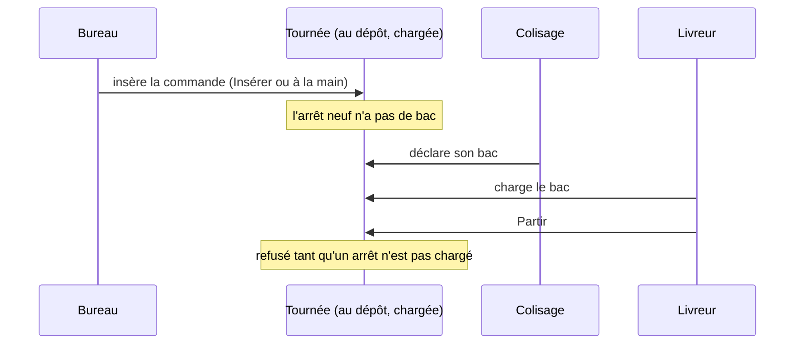

# Insérer une commande avant le départ

> **État : doc d'état, relue contre le code le 2026-10-07**, plus trois
> questions ouvertes (§ 4). Née de la question Q1 de
> l'[audit du 2026-10-07](audit-2026-10-07.md).

## 1. La règle

**Une tournée reçoit des commandes jusqu'à son départ, chargée ou non.**
Ce qui limite, c'est **la place restante dans le véhicule**, pas le fait que
le chargement ait commencé (Hugo, 2026-10-07, après « non parties » le
2026-09-29).

Le départ, lui, est la porte qui ne bouge pas : une tournée **partie** ne se
compose plus, et on ne part pas avec un arrêt dont les bacs ne sont pas
chargés.

## 2. Les trois chemins, et ce que chacun contrôle

| Chemin                         | Tournée chargée admise | Place du véhicule contrôlée                 | Où                                                 |
| ------------------------------ | ---------------------- | ------------------------------------------- | -------------------------------------------------- |
| « Proposer » en mode Insérer   | oui                    | oui (`ProposalCapacity`, garde de capacité) | `delivery-proposal-support.ts`, `insertableRounds` |
| Place suggérée, « Placer ici » | **non**                | oui                                         | `get-delivery-placement-suggestions.handler.ts`    |
| Affectation à la main          | oui                    | **non**                                     | `assign-delivery-stop.handler.ts`                  |

Les trois refusent une tournée **partie**. Insérer écarte aussi une tournée
dont un arrêt n'est pas situé, et ne réordonne jamais ce qui est déjà placé.

La place se compte en bacs : les bacs déclarés, sinon l'estimation du
colisage, sinon le contenant par défaut des réglages ; une commande dont rien
ne dit la demande est placée sans contrôle, et sa tournée est dite « place
non vérifiée ».

## 3. Ce qui se passe ensuite

« Partir » refuse en nommant les références sans bac ou au bac non chargé
(`DeliveryRoundNotReadyError`) ; la sortie est de charger, ou de retirer
l'arrêt. Rien ne part donc à moitié, et aucune garde de plus n'est nécessaire
au moment de l'insertion.

## 4. Questions ouvertes

1. **L'affectation à la main doit-elle avertir quand la place est dépassée ?**
   Proposition : avertir sans bloquer, comme « place non vérifiée ». Un geste
   humain peut savoir mieux que le calcul.
2. **La place suggérée écarte les tournées chargées**, alors que la règle les
   admet. Les lui ouvrir, ou garder la suggestion prudente ?
3. **Non vérifié** : jusqu'à quand le commerce accepte une commande livrée
   pour le jour même, et comment le poste de colisage reçoit une commande
   arrivée après l'arrêt du plan. Ces deux points décident si l'insertion
   tardive arrive vraiment en pratique.
