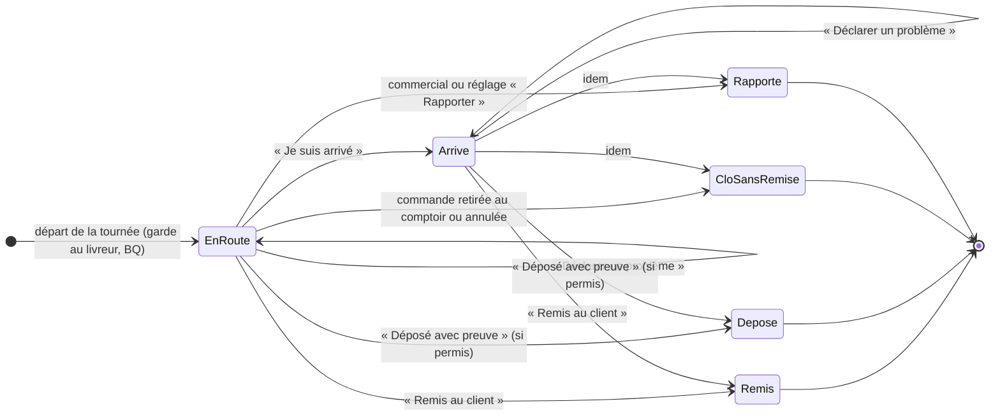

# À la porte — arriver, remettre ou déposer, signaler, décider

> ✅ **Doc d'état** depuis le 2026-10-06 (ménage documentaire, Hugo : « fais le
> ménage »). Ce fichier était le plan « plan à la porte » du lot 6 a ; il
> décrit désormais ce que fait le code, et finit par ce qui **reste à faire**
> (repris de l'ancien « TODO de la porte », supprimé le même jour). Les
> affirmations sur le code ont été rouvertes le 2026-10-06. L'historique du
> plan (versions, objections de `vitruve`, découpage — 23 commits, du
> 2026-10-01 à sa suppression comprise) se lit par `git log --follow` sur
> son **ancien chemin**, `plan-a-la-porte` dans ce même dossier, devenu ce
> document le 2026-10-06 (`f303e378f`) ; sa dernière version est celle de
> `f303e378f^`.
>
> Le code cite les repères du plan (**AP-D1…D10**, **AP-Q1…Q6**, **B0…B5**,
> **B3 bis**, **BQ**, **LB-Q1…Q6**, **RL1** — tous, sauf AP-D3, AP-D10, AP-Q3
> et LB-Q4, que seule la documentation nomme), et aussi les **numéros de
> section** de l'ancien plan (« § 10 ter », « § 10 bis »…), qui ne sont pas
> ceux de ce document. Le § 9 dit où chacun mène désormais.

Suit « Ma tournée » ([`app-coursier-ma-tournee.md`](app-coursier-ma-tournee.md)) : la page du
livreur, son mur « sa tournée ». La conception d'origine du lot 6 (L6-C1 à
L6-C14) est dans [`plan-preparation-de-tournee.md`](../tournees/plan-preparation-de-tournee.md),
« Plus tard » → Lot 6.

## 1. Les gestes, sur la carte d'un arrêt

Tournée partie, **sa** tournée (le livreur n'est jamais un paramètre d'URL :
une tournée d'un autre rend 404). Routes sous
`admin/livraison/ma-tournee/:roundId`, ressource `delivery_doorstep`
(`my-delivery-doorstep.controller.ts`, vérifié le 2026-10-06).

| Geste                         | Route (`POST`)                       | Ce qu'il exige, ce qu'il écrit                                                                                                                                                                                                                     |
| ----------------------------- | ------------------------------------ | -------------------------------------------------------------------------------------------------------------------------------------------------------------------------------------------------------------------------------------------------- |
| **Je suis arrivé**            | `arrets/:stopId/arrivee`             | l'instant d'arrivée dans `delivery_stop_execution` (AP-D6) ; 204 même rejoué. Facultatif : remettre sans l'avoir déclaré est permis, l'arrivée reste nulle                                                                                         |
| **Remis au client** (B1)      | `arrets/:stopId/remise` (multipart)  | **photo** obligatoire, **nom** de qui réceptionne (2 à 80, `HANDOVER_RECEIVER_NAME_MIN/MAX`), **signature au doigt** si `signatureRequired` figé au départ ; attestation `via = manual` chez `handover` + `closeStop`, une unité de travail        |
| **Déposé avec preuve** (B2)   | `arrets/:stopId/depot` (multipart)   | **photo** seule ; attestation `via = deposit`, mêmes effets qu'une remise (AP-Q5) ; refusé si `DoorstepStop.ensureDepositPermitted()` refuse (§ 4)                                                                                                 |
| **Déclarer un problème**      | `incidents` (multipart)              | un signalement (§ 3) ; **ne clôt rien**                                                                                                                                                                                                            |
| **Clore sans remise** (AP-D2) | `arrets/:stopId/cloture-sans-remise` | seulement si le commerce dit la commande retirée ou annulée — sinon 409 `StopStillToHandOverError` ; aucune attestation. Filet de sécurité « invisible » : le métier tient le cas pour impossible (Hugo, 2026-10-01)                               |
| **Tournée terminée** (B4)     | `retour`                             | `DeliveryRound.finish` (I9) : refus 409 tant qu'un arrêt est vivant, en nommant « Client (CMD-x) » ; un arrêt seulement signalé, en attente, ou autorisé au dépôt mais pas déposé est vivant. La rentrée **staff** (`returnToDepot`) reste permise |

Commun à la remise et au dépôt (`delivery/application/doorstep-handover.ts`) :
mur du livreur, version présentée, **rejeu idempotent** (un arrêt déjà remis
à la porte réannonce l'attestation existante, par un fait neuf ; clos
autrement, il est refusé en le nommant). L'attestation passe par le port
`delivery/channels/handover/` (`DoorstepHandoverAttestor`, implémenté par
`HandoverDoorstepAttestor` sur `HandoverAttestation.attestQuietly`) et
s'écrit **dans la transaction du livreur**, avec la ligne de ses pièces
(`order_handover_proof`), le `closeStop` et son fait durable
`handover.handed_over` dans la boîte d'envoi — depuis le lot E2 (2026-10-04,
`6a5beab26`) : tout est validé ensemble, ou rien. Un
`closeStop` qui échoue ne laisse donc ni attestation, ni fait, ni commande
`fulfilled`, ni point (AP-D1) ; le commerce n'apprend la remise qu'après la
validation, par son abonné durable `b2b.orders.mark-fulfilled`. Le port rend
encore une « publication » que la livraison inscrit après la validation
(`AfterCommit`, B0) : depuis E2, elle ne fait plus rien
(`ALREADY_IN_OUTBOX`, `handover-doorstep-attestor.ts`). Images rangées avant
la ligne, retirées si la ligne échoue. Faits
`delivery_round.stop_handed_over` / `stop_deposited`.

## 2. Le temps qu'on accumule

Par arrêt : `departed_at` (départ de la tournée) et `arrived_at` dans
`delivery_stop_execution`, la clôture dans `delivery_round_stop.closed_at`
(écrite par la tournée, `closeStop`). Rien n'est calculé à l'écriture : des
instants du `Clock`, les durées (trajet, sur place, écart à la fenêtre) se
liront. **Aucun écran de statistiques n'existe** ; la position relevée aux
gestes est bâtie depuis le 2026-10-06 (YA4, [`gps-y-aller-et-position.md`](gps-y-aller-et-position.md), AP-D10).

## 3. Déclarer un problème

Trois familles, un motif fermé par famille (`DELIVERY_INCIDENT_REASONS`,
`packages/contracts/src/delivery-doorstep.ts`, vérifié le 2026-10-06), une
note (≤ 500) et une photo facultatives. Table `delivery.delivery_incident`.

| Famille (`family`)       | Motifs                                                                                          | Porte sur                     |
| ------------------------ | ----------------------------------------------------------------------------------------------- | ----------------------------- |
| à la remise (`doorstep`) | `nobody_present`, `refused`, `address_not_found`, `access_impossible`, `goods_damaged`, `other` | l'arrêt (exigé)               |
| technique (`technical`)  | `vehicle_breakdown`, `cold_failure`, `phone_or_app`, `bin_damaged`, `other`                     | la tournée (l'arrêt si donné) |
| routier (`road`)         | `road_closed`, `accident`, `weather_conditions`, `traffic_jam`, `other`                         | la tournée (l'arrêt si donné) |

- Un signalement est un fait daté, auteur le livreur ; il ne touche pas la
  commande. Un problème technique ou routier **se signale seulement** : il
  n'arrête pas la tournée (AP-Q4).
- Côté admin, sous `delivery_rounds` (lecture) : `GET admin/livraison/incidents`,
  leur photo, et **« Non remis »** (`GET admin/livraison/non-remis`) — les
  arrêts encore ouverts d'une tournée partie qui est **rentrée**, ou, rentrée
  ou non, d'un jour antérieur à aujourd'hui (heure de Paris ;
  `PrismaUndeliveredStopsReader`). C'est une **vue** : elle ne débloque rien
  (AP-D7).
- `nobody_present`, `refused` et `access_impossible` **ouvrent une décision du
  commercial** (`opensDecision`, `delivery/domain/services/decision-opening.ts`) ;
  les autres non.

## 4. Qui décide du dépôt

`ensureDepositPermitted()` (`delivery/domain/entities/doorstep-stop.ts`,
vérifié le 2026-10-06) permet le dépôt si :

1. une **décision vivante « Autoriser le dépôt »** existe pour l'arrêt — elle
   l'emporte **même sur la signature exigée** (LB-Q5) ; sinon
2. l'adresse autorise le dépôt (`depositAllowed`, **figé au départ**, AP-D5)
   **et** la signature n'est pas exigée (AP-Q6 : la signature l'emporte pour le
   livreur seul).

Refus nommés : `DepositSignatureRequiredError`, puis `DepositNotAllowedError`.

**La décision du commercial (B3)** — table `delivery.stop_decision`, une par
arrêt, conditionnée par sa `version`, tracée (qui, quand, `source` = `staff` ou
`setting`). Routes `admin/livraison/a-decider` sous `delivery_decisions`
(`GET` la liste et la photo du signalement en lecture ; `POST
:stopId/autoriser-depot` et `:stopId/rapporter` en écriture), écran
`/livraison/a-decider`. « Autoriser » n'écrit pas la tournée ; « Rapporter »
**clôt** l'arrêt (LB-Q2) et écrit, dans sa transaction, le fait durable
`delivery.orders_brought_back` : le retrait en tire le retour
(`order_departure.returned_at`) — § 5. La carte du livreur porte la décision,
et le livreur n'attend pas.

**La dernière réponse l'emporte, pas la première** (`StopDecision`,
`delivery/domain/entities/stop-decision.ts`). C'est une règle métier : tant
que l'arrêt est ouvert, « Rapporter » peut remplacer « Autoriser », du même
commercial ou d'un autre, et le dépôt est alors refusé au livreur, en le
disant (`StopBroughtBackError` : « Un commercial a décidé de rapporter la
commande … »). L'inverse ne se peut pas : « Rapporter » clôt l'arrêt, et
toute réponse sur un arrêt clos — remis, déposé ou rapporté — ou sur une
tournée rentrée est refusée (`StopDecisionOnClosedStopError`,
`StopDecisionOnReturnedRoundError`). Répéter la réponse en vigueur ne change
rien : son premier auteur la garde. Le commercial prend le verrou de la
tournée, celui que prend le dépôt : une réponse et un dépôt ne se croisent
pas. Éprouvé par `stop-decision.spec.ts`, `stop-decision-handlers.spec.ts`
et `delivery-stop-decision.e2e-spec.ts`.

**La décision réglée d'avance (B3 bis, LB-Q6)** — `ask` | `deposit` |
`bring_back`. Un **global** (`delivery.delivery_doorstep_settings`,
`GET|PUT admin/livraison/a-la-porte` sous `delivery_procedures`, carte en tête
de « À décider »), que le commercial **redéfinit par adresse**
(`public.addresses.doorstep_rule`, nulle = hérite ;
`GET|PUT admin/companies/:c/delivery-addresses/:a/doorstep-rule` sous
`delivery_procedures`). Résolue et **figée au départ**
(`delivery_stop_execution.doorstep_rule`). Au signalement qui ouvre une
décision, une règle autre que `ask` s'applique aussitôt (`source = setting`,
sans auteur, **sans notification**). Défaut global : `ask`.

**« Dépôt autorisé » de l'adresse** — réglé par le client sur ses adresses
(`company-addresses.controller.ts`) et par le commercial
(`PUT admin/companies/…/deposit`, sous `delivery_procedures`).

**Prévenir (B5)** — une notice « Livraison à décider » par signalement qui
ouvre une décision, après validation, adressée par droit
(`staff_notifications.audience` = `delivery_decisions:write`) : cloche
« mes notifications » et poussée aux seuls appareils de qui tient le droit.

## 5. La garde au départ (BQ)

Au départ, `delivery` demande au retrait par `delivery/channels/handover/` :
`DepartureHoldsReader` — le départ **refuse** une commande retenue au contrôle
qualité, en nommant l'arrêt.

**La garde passe par la boîte d'envoi** depuis le 2026-10-06 (lot DD1,
`375f82225` ; la conception et les objections de `vitruve` sont dans
[`plan-depart-durable.md`](plan-depart-durable.md), gardé comme document de
décision). Le départ écrit, dans sa transaction et depuis `departAndFreeze`
(le chemin commun du poste de chargement et du livreur), le fait durable
`delivery.round_departed` ; une décision « Rapporter » — du commercial ou
réglée d'avance — écrit `delivery.orders_brought_back`. Les deux faits sont
déclarés dans `delivery/channels/handover/` : `DeliveryRoundDepartedFact` et
`DeliveryOrdersBroughtBackFact` — le suffixe `Fact` les distingue de
`DeliveryRoundDepartedEvent`, le fait de journal, qui reste. Le retrait s'y
abonne en `@DurableHandler` :

| Fait, sa clé, sa charge                                                                                                                                                      | Abonné du retrait                     | Ce qu'il fait                                                                                                      |
| ---------------------------------------------------------------------------------------------------------------------------------------------------------------------------- | ------------------------------------- | ------------------------------------------------------------------------------------------------------------------ |
| `delivery.round_departed`, clé `…:<roundId>` (une tournée ne part qu'une fois ; un second passage est une autre tournée) ; `roundId`, `serviceDay`, `departedAt`, `orderIds` | `handover.record-round-departed`      | lit `order_handover` (`HandedOverOrdersReader`) — une commande **déjà remise** est ignorée —, puis écrit le départ |
| `delivery.orders_brought_back`, clé `…:<roundId>:<orderIds>` (un arrêt rapporté est clos, il ne se rapporte plus) ; `roundId`, `orderIds`, `broughtBackAt`                   | `handover.record-orders-brought-back` | écrit le retour                                                                                                    |

`production.order_departure` est **monotone par instant**, pas par ordre
d'arrivée : la boîte d'envoi peut livrer un fait des heures après l'autre
(`PrismaOrderDepartureRepository`). Chaque écriture fait naître la ligne si
elle manque, puis ne l'avance que dans le `where` d'un `updateMany`, les deux
dans une transaction : un départ n'écrit que si le départ connu est nul ou
`<=` son instant **et** le retour nul ou `<` ; un retour, que si le départ
connu est nul ou `<=` et le retour nul ou `<`. Un fait plus ancien que l'état
ne fait rien.

Un retour livré **avant** son départ crée donc la ligne seul, `departed_at`
nul : la colonne l'accepte depuis la migration additive
`20261007180000_le_retour_avant_le_depart`. Sans elle, ce retour se perdait,
et le départ livré en retard remettait la commande « partie ». Le départ,
plus ancien, ne l'efface pas. Aucun lecteur ne lit `departed_at` pour décider
(vérifié le 2026-10-07) : le fournil, qui lit « partie » par
`OrderCustodyReader`, et la preuve de livraison lisent `returned_at` nul.

Les annonces en mémoire d'avant (`DepartedOrdersAnnouncer`,
`BroughtBackOrdersAnnouncer`, appelées après validation par `AfterCommit`)
perdaient la garde à un redémarrage : retirées. Le fournil lit « partie » par
`production/channels/handover/` (`OrderCustodyReader`) : un verdict qualité sur
une **commande** partie est refusé (« La commande est partie : le produit
n'est plus là. ») ; un verdict de **ligne** reste permis (LB-Q1). Une commande
rapportée repart dans n'importe quelle tournée d'un autre jour, au même prix
(RL1, [`decisions-par-defaut-2026-10-02.md`](../tournees/decisions-par-defaut-2026-10-02.md), § 4).

## 6. Les preuves

`production.order_handover_proof` : **une ligne par commande** remise à la
porte (photo, nom — nul pour un dépôt —, signature, livreur). Au back-office,
carte « Preuve de livraison » sur la fiche commande, sous
**`delivery_proofs:read`** : `GET admin/orders/:id/preuve-livraison`, `…/photo`,
`…/signature`, retrouvées par la commande et jamais par une clé, servies en
`private, no-store` (`HandoverProofReader`, `handover/channels/commerce/`).
Une attestation sans pièce se lit « Preuve effacée ».

## 7. Qui peut quoi

| Ressource              | Porte                                                                               |
| ---------------------- | ----------------------------------------------------------------------------------- |
| `delivery_doorstep`    | les gestes du livreur (§ 1, § 3), distincts de conduire sa tournée (AP-D9)          |
| `delivery_rounds:read` | signalements, photos, « Non remis » côté admin                                      |
| `delivery_decisions`   | « À décider » : lire (`read`), répondre (`write`) ; audience de la notice (`write`) |
| `delivery_procedures`  | dépôt autorisé et règle par adresse ; réglage global de la porte                    |
| `delivery_proofs:read` | la preuve de livraison d'une commande                                               |

Accordées à l'écran des rôles, jamais par migration :
[`tableau-droits-livraison.md`](../droits/tableau-droits-livraison.md) (droits scindés,
`e4e46b0f4`).

## 8. Décisions d'Hugo en vigueur

- **AP-Q1** « dépôt autorisé » est un réglage à part de « signature exigée ».
- **AP-Q2** « Remis au client » exige toujours le nom ; et **toute remise
  porte une photo** (2026-10-01).
- **AP-Q3** la position se relèvera (YA4) mais ne corrigera jamais le carnet
  seule. _(Décision citée telle quelle ; YA4 est bâti depuis : la position se
  relève, et le carnet ne bouge que par une suggestion que le bureau applique.)_
- **AP-Q4** un problème technique ou routier se signale seulement.
- **AP-Q5** un dépôt a les effets d'une remise (commande terminée, points,
  volume tarifaire, chiffre d'affaires).
- **AP-Q6** pour le livreur, la signature exigée interdit le dépôt.
- **LB-Q1** pas de contrôle qualité sur une commande partie (BQ).
- **LB-Q2** « Rapporter » clôt l'arrêt ; la commande repart un autre jour.
- **LB-Q3** les commerciaux sont prévenus par une notification adressée par
  droit.
- **LB-Q5** l'autorisation du commercial l'emporte sur la signature.
- **LB-Q6** décision réglée : globale, redéfinie par adresse.
- Personne, refus, accès impossible : **le commercial décide**, pas le livreur.
- Les pièces de remise sont conservées **sans limite** pour l'instant, purge
  câblée (§ 10).

## 9. Où vivent les repères du plan

| Repère                                               | Ici                 |
| ---------------------------------------------------- | ------------------- |
| AP-D1 (le commerce prévenu après validation), B0, B1 | § 1                 |
| AP-D2 (clore sans remise)                            | § 1                 |
| AP-D3, AP-Q5                                         | § 8                 |
| AP-D4, AP-D5, AP-Q1, AP-Q6, B2                       | § 4                 |
| AP-D6 (instants, rejeu)                              | § 1, § 2            |
| AP-D7 (« Non remis »)                                | § 3                 |
| AP-D8 (`deposit` dans `HandoverVia`)                 | § 1 — déployé       |
| AP-D9 (frontière, `delivery_doorstep`)               | § 7, `CLAUDE.md` §3 |
| AP-D10 (position)                                    | § 2                 |
| B3, B3 bis, B5, LB-Q2/Q3/Q5/Q6                       | § 4                 |
| B4                                                   | § 1                 |
| BQ, LB-Q1, RL1                                       | § 5                 |
| Voir les preuves                                     | § 6                 |

### Les numéros de section de l'ancien plan, cités par le code

Trente-neuf fichiers hors de `documentation/` renvoient à
« `a-la-porte.md`, § 10 ter » ou « § 10 bis » (compté le 2026-10-07) : ce
sont les sections du plan d'avant le 2026-10-06, pas celles de ce document.
Voici où elles mènent.

| Cité par le code                   | Dans l'ancien plan                                                                                                                                                                                                                                    | Ici                                                     |
| ---------------------------------- | ----------------------------------------------------------------------------------------------------------------------------------------------------------------------------------------------------------------------------------------------------- | ------------------------------------------------------- |
| « § 3 »                            | déclarer un problème                                                                                                                                                                                                                                  | § 3                                                     |
| « § 9 »                            | les décisions d'Hugo du 2026-10-01 : toute remise porte une photo, « Clore sans remise » reste un filet invisible, le commercial décide — sa phrase « le premier qui répond décide » a été renversée par le § 10 bis                                  | § 1, § 4, § 8 (AP-Q2)                                   |
| « § 10 », lot « voir les preuves » | la carte « Preuve de livraison »                                                                                                                                                                                                                      | § 6                                                     |
| « § 10 B3 »                        | le commercial décide — sa phrase « le premier qui décide l'emporte » a été renversée par le § 10 bis                                                                                                                                                  | § 4                                                     |
| « § 10 B4 »                        | « Tournée terminée » exige un sort pour chaque arrêt                                                                                                                                                                                                  | § 1                                                     |
| « § 10 bis »                       | la v2 après `vitruve` : B0 (après validation), le rejeu qui réannonce, la publication qui ne traverse pas la frontière, la décision qui a un propriétaire, SÉRIEUX 4 (la rentrée staff reste permise) ; les questions LB-Q1 à LB-Q4 et leurs réponses | § 1 ; § 4 pour la décision et LB-Q2/Q3 ; § 5 pour LB-Q1 |
| « § 10 ter »                       | BQ, la garde au départ (LB-Q1) ; LB-Q5 et LB-Q6, la décision réglée d'avance (B3 bis)                                                                                                                                                                 | § 5 ; § 4 pour LB-Q5/Q6                                 |
| « lot A », « lot B »               | A : arriver, signaler, clore sans remise, rentrer, « Non remis », dépôt autorisé ; B : B0…B5 et BQ                                                                                                                                                    | § 1 à § 5                                               |

## 10. Reste à faire

Repris de « TODO de la porte » (supprimé le 2026-10-06), relu ce jour-là.

### Non bâti, tranché — à ne pas redécider

- **Code de retrait par e-mail (L6-C12/C13).** Envoyé **au départ** au contact
  de livraison ; **jamais** sur le sac ; son scan à la porte **vaut
  signature** (sinon tracé au doigt et nom tapé, ce qui existe). Aujourd'hui
  `via = scan` n'est écrit que par le comptoir.
- **Le livreur sans compte (6 b).** Un lien à jeton par tournée — frontière de
  sécurité neuve (`vitruve` d'office). Aujourd'hui seul un membre staff
  conduit : `delivery_driving` pour voir sa tournée, la charger et partir,
  `delivery_doorstep` pour les gestes à la porte et « Tournée terminée » — et
  l'affectation exige **les deux** en écriture depuis le 2026-10-07 (audit,
  B8 : `DriverAccess`). Qui compose affecte le livreur ; le snapshot du départ
  se garde 90 jours.
- **La purge du snapshot du départ** (relevé par l'audit du 2026-10-07,
  § 3.3) : les 90 jours sont tranchés, mais **rien ne purge**. Non bâti.

- **Le double scan (question ouverte, reprise de la conception du
  2026-09-11, q. 8).** Aucune décision écrite : la conception du lot 6
  (L6-C3) ne prévoit qu'un scan, le code du client ; aucun scan n'existe à
  la porte aujourd'hui (photo, nom, signature).

### Bloquant

- 🔴 **Les livraisons ratées (6 c)** : relivrer, retrait au comptoir, annuler.
  Seul « Rapporter » existe (§ 4) ; aucun des trois gestes n'existe au
  commerce, et deux remboursent : ils supposent les **avenants**
  ([`../../order/architecture-commande-immuable-avenants.md`](../../order/architecture-commande-immuable-avenants.md),
  doc-first). Proposé et non tranché : un 6 c-1 « relivrer le jour X, sans
  nouveaux frais », les deux autres plus tard. En attendant, « Non remis »
  reste une vue (AP-D7).

### Éteint en attendant

- **L'alarme de retard en livraison** (`latenessOf`,
  `b2b/orders/domain/services/day-supervision.ts`) — elle ne juge que les
  créneaux **promis** ; la livraison n'en promet pas encore. Le **lot 5**
  (tranche horaire promise) la rallume, et devra recalibrer « prêt avant la
  fenêtre » sur le départ plutôt que sur le comptoir. _(Raison du silence
  reprise de l'audit du 2026-10-06, non rejouée sur une commande réelle.)_

### Les pièces de remise : conservées sans limite, purgeables

> Hugo, 2026-10-01 : « Pour l'instant infini, mais câbler la possibilité d'une
> purge, et noter en TODO que ça peut être purgeable. »

- **Aujourd'hui** : `production.order_handover_proof` et ses images sont
  gardées **sans limite**.
- **Câblé, non planifié** (vérifié le 2026-10-06 : enregistrés dans
  `handover.module.ts`, appelés seulement par leurs tests) :
  `PurgeHandoverProofsOlderThanCommand(retentionDays)` efface les pièces plus
  anciennes qu'une durée (horloge du backend) — ligne **et** images —, et
  `EraseHandoverProofsCommand(orderId)` celles d'une commande
  (`apps/lfd-api/src/handover/application/commands/`). Les images partent
  d'abord, puis la ligne et le fait `order_handover_proof.erased` dans une
  transaction : une image refusée garde la pièce entière, relancer la reprend.
  L'attestation de la remise n'est jamais effacée. **Aucune minuterie, aucune
  route.**
- **À décider** : la durée (90 jours proposés, plus si les litiges le
  demandent) et l'appel planifié ; pour l'effacement à la demande, **qui le
  déclenche** (ni route admin ni écran).
