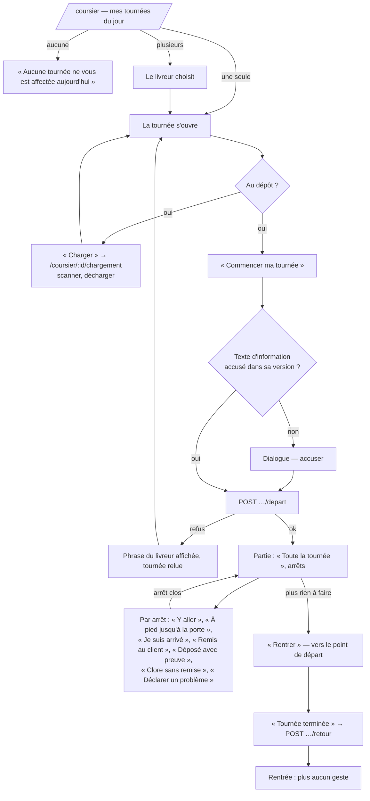

# « Ma tournée » — l'application du livreur (`/coursier`)

> ✅ **Doc d'état, vérifiée contre le code le 2026-10-08.** Chaque affirmation
> sur le code porte son fichier ; rien n'est repris du plan sans avoir été
> confronté au code.
>
> Elle **remplace [`plan-ma-tournee.md`](plan-ma-tournee.md) pour l'état**. Le
> plan reste le document de décision (MT-Q1 à MT-Q7, MT-D1 à MT-D7 et leur v2)
> — trois `migration.sql` le citent.

## 1. Ce que c'est, et pour qui

La page du livreur, dans le back-office (`apps/lfd-backoffice-frontend`),
pensée téléphone d'abord : une colonne, de grands boutons. Trois adresses
(`apps/lfd-backoffice-frontend/src/app/app.routes.ts`), toutes sous
`delivery_driving:read` :

| Adresse                         | Écran                                                     | Composant                                            |
| ------------------------------- | --------------------------------------------------------- | ---------------------------------------------------- |
| `/coursier`                     | Ma tournée — la liste du jour, puis la tournée            | `livraison/my-round-page/my-round-page.ts`           |
| `/coursier/mes-donnees`         | Mes données — le texte d'information RGPD du livreur      | `livraison/driver-notice-page/driver-notice-page.ts` |
| `/coursier/:roundId/chargement` | Charger ma tournée — l'écran de chargement du dépôt, muré | `livraison/my-round-loading/my-round-loading.ts`     |

Le Coursier est un espace de **premier niveau, sans rail secondaire**
(`app.routes.ts`, commentaire « LE COURSIER (2026-10-03) »). Les anciennes
adresses `/livraison/ma-tournee` et `/livraison/ma-tournee/:roundId/chargement`
y **redirigent** (même fichier, enfants de `livraison`).

### Les droits

- **`delivery_driving`** — « Conduire sa tournée » : lire sa tournée, la
  charger, la commencer, lire ses données
  (`packages/contracts/src/staff-access.ts`, doc de la ressource et libellé).
- **`delivery_doorstep`** — « Gestes à la porte » : arriver, signaler, clore
  sans remise, remettre, déposer, « Tournée terminée » (même fichier).
- L'**admin** tient les deux en `write` (`ROLE_GRANTS.admin`, même fichier) ;
  aucun autre rôle de `ROLE_GRANTS` ne les a.
- Le **rôle `livreur` n'a pas de valeur `StaffRole`** : il se crée **à
  l'écran** (Admin › Rôles) avec ces deux droits ; aucune migration ne
  l'accorde (doc de `delivery_driving`, `staff-access.ts` ;
  `lint:no-role-grants-in-migrations`).
- **Atterrissage** : `delivery_driving:read → /coursier` est la **première**
  entrée de `LANDINGS`
  (`apps/lfd-backoffice-frontend/src/app/auth/permission.guard.ts:17`). La
  racine `/` mène aux comptes clients, dont le garde renvoie le livreur à
  cette première porte ouverte (`app.routes.ts`, « LA RACINE »).

### L'affectation

Une tournée porte au plus un livreur, `delivery.delivery_round.driver_staff_id`,
nullable, sans clé étrangère vers l'annuaire. Qui **compose** l'affecte, depuis
l'écran Tournées (`livraison/round-driver/round-driver.ts`) :

| Méthode | Route                                                | Droit                   | Contrôleur                                       |
| ------- | ---------------------------------------------------- | ----------------------- | ------------------------------------------------ |
| `GET`   | `/admin/livraison/tournees/livreurs`                 | `delivery_rounds:read`  | `delivery/http/delivery-rounds.controller.ts:90` |
| `PUT`   | `/admin/livraison/tournees/:roundId/livreur`         | `delivery_rounds:write` | `delivery-rounds.controller.ts:97`               |
| `POST`  | `/admin/livraison/tournees/:roundId/livreur/retrait` | `delivery_rounds:write` | `delivery-rounds.controller.ts:108`              |

La règle « qui peut livrer » vit une fois, dans
`delivery/domain/value-objects/driver-access.ts` (`DriverAccess`) : une
personne peut livrer si elle tient **effectivement** (rôle + dérogations, fiche
non suspendue) `delivery_driving:write` **et** `delivery_doorstep:write`, lus
dans l'annuaire au moment du geste (`delivery/application/delivery-driver-support.ts`),
jamais par la clé du rôle. La liste proposée, le « sans accès » de l'écran
Tournées et le refus de l'agrégat la lisent tous trois.
`DeliveryRound.assignDriver` (`delivery/domain/entities/delivery-round.ts:255`)
refuse une tournée partie, puis qui ne peut pas livrer, et ne fait rien si
c'est déjà la même personne.

## 2. Le parcours

### 2.1 La liste du jour

La page lit les tournées du **jour de Paris** (`livraison/my-round-reader.ts:30`).
Une seule : elle s'ouvre d'office (`my-round-reader.ts:95`) ; plusieurs : le
livreur choisit, et peut revenir au choix ; aucune : « Aucune tournée ne vous
est affectée aujourd’hui » (`my-round-page.html:53`).

### 2.2 Le détail d'une tournée

En tête, « n arrêts prêts sur m » (avancement du colisage), puis les arrêts
dans l'ordre de passage (`my-round-stop/`). Si la tournée est partie avant que
le départ ne fige rang et point, l'écran le dit : « Ordre et position non
figés au départ : ils suivent la composition et le carnet »
(`my-round-page.html:185-187`, `freeze === 'not_frozen'`).

### 2.3 Charger

« Charger » n'est offert **qu'au dépôt** (`canOpenLoading`,
`my-round-page.ts`). Il ouvre `/coursier/:roundId/chargement` : le corps
`LoadingRound` du dépôt, branché sur les routes murées du livreur ; scanner et
décharger demandent `delivery_driving:write`. « Partir » n'y est pas offert
(`my-round-loading.ts`, JSDoc).

### 2.4 Partir — « Commencer ma tournée »

Le même geste que « Partir » du chargeur : la même méthode `depart` de
l'agrégat et la même suite figée (`departAndFreeze`), mais une **commande à
part**, `DepartMyRoundCommand`, dont le chargement porte le mur
(`delivery/application/commands/depart-my-round.handler.ts`). La page renvoie
la `version` lue ; une tournée modifiée entre-temps est refusée.

Avant le départ, `DriverNoticeGate` (`livraison/driver-notice-gate.ts`) relit
si la version courante du texte d'information est accusée ; sinon le
dialogue s'ouvre, et le départ attend l'accusé. Un échec de lecture ne démarre
pas.

La porte du chargeur, `POST /admin/livraison/tournees/:roundId/depart` sous
`delivery_loading` (`delivery/http/delivery-loading.controller.ts:90`), reste
en service et **n'exige pas** de livreur affecté (MT-Q5). La route du livreur,
elle, l'exige par construction : son verrou porte `driver_staff_id`.

### 2.5 En route : naviguer

Partie et non rentrée, la tournée offre « Toute la tournée » — des tronçons
Google Maps de **3 étapes + 1 destination** au plus (`MAX_WAYPOINTS = 3`,
liens bornés à `MAX_URL_LENGTH = 2048`,
`livraison/my-round-navigation.ts:18-21`) — et, par arrêt, « Y aller » vers
Google Maps, Waze ou Apple Plans, choix mémorisé **sur l'appareil**
(`NAVIGATION_APP_KEY`, `my-round-navigation.ts:38`). Le point de
**stationnement** passe d'abord quand il est connu (`driveTargetOf`), puis « À
pied jusqu’à la porte ». Les arrêts restants sont ceux sans `closedAt`
(`remainingStops`). Le détail : [`gps-y-aller-et-position.md`](gps-y-aller-et-position.md).

### 2.6 À la porte

Sous `delivery_doorstep:write` et seulement en route (`gestures`,
`my-round-page.ts`) : « Je suis arrivé », « Remis au client », « Déposé avec
preuve » (quand le serveur dit `canDeposit`), « Clore sans remise »,
« Déclarer un problème » (sur l'arrêt ou sur la tournée). Chaque geste relève
la position du téléphone une fois ; indisponible, il part sans elle. Le
détail, les règles et les refus : [`a-la-porte.md`](a-la-porte.md).

### 2.7 Rentrer

Quand il ne reste aucun arrêt ouvert et qu'un point de départ existe,
« Rentrer » y mène (`homeHref`, `my-round-page.ts`). « Tournée terminée »
(`POST …/retour`) nomme avant le clic les arrêts encore sans sort
(`withoutOutcome`). Rentrée, la page affiche « Tournée rentrée à … »
(`my-round-page.html:108`) et n'offre plus aucun geste.

### 2.8 Mes données

« Mes données » (lien en tête de `/coursier`, `my-round-page.html:11`) ouvre
`/coursier/mes-donnees` : le texte d'information du livreur
(`CURRENT_DRIVER_NOTICE`,
`delivery/domain/value-objects/driver-information-notice.ts`) et la date de
son accusé. L'accusé vaut pour **la version courante seule** : une nouvelle
version rouvre le dialogue une fois
(`delivery/application/queries/get-my-driver-notice.handler.ts`). Rejoué, il
garde la première date ; une version périmée est refusée
(`DriverNoticeOutdatedError`, `delivery/domain/errors/driver-notice-errors.ts`).
Le cadre : [`../../legal/rgpd-livreur.md`](../../legal/rgpd-livreur.md).

### 2.9 « Une nouvelle version est en ligne »

Depuis le 2026-10-08, les trois adresses portent
`data: { newVersion: NEW_VERSION_BANNER }` (`app.routes.ts`) : un livreur en
tournée n'a pas son écran rechargé d'autorité, il voit un bandeau
(`shared/new-version-banner/new-version-banner.ts`). Le mécanisme :
[`../../ci-cd/plan-nouvelle-version-des-fronts.md`](../../ci-cd/plan-nouvelle-version-des-fronts.md).

## 3. Le mur du livreur

Le livreur n'est **jamais** un paramètre d'URL : c'est la fiche de la requête
(`@StaffUserId`), et elle entre dans le `where` :

- liste et détail : **un seul** `where`, `driverWall(staffUserId)`
  (`delivery/infrastructure/prisma-driver-rounds.reader.ts:26`, utilisé l. 43
  et 64) — un 404 sur le détail ne contredit pas la liste ;
- départ : verrou `WHERE "id" = … AND "driver_staff_id" = …`
  (`delivery/infrastructure/prisma-delivery-round.repository.ts:99`,
  `loadForDriverDeparture`) ;
- chargement, photos, gestes : `DriverRoundWall`
  (`delivery/infrastructure/prisma-driver-round-wall.ts:19`) puis la commande
  du dépôt dans la même unité de travail (`load-my-bin.handler.ts`) ; les
  arrêts à la porte par `prisma-doorstep-stop.repository.ts:34`
  (`round: { driverStaffId }`).

Une tournée absente, à un autre ou sans livreur rend **404**,
`DriverRoundNotFoundError` — on ne confirme pas qu'elle existe. L'admin n'y
voit que les tournées où il est lui-même affecté : le mur n'a pas d'exception
de rôle (JSDoc de `my-delivery-round.controller.ts`).

### Deux écarts connus, tranchés par Hugo le 2026-10-07

1. **`GET …/ma-tournee/version` n'a pas de mur** : il rend la somme de deux
   numéros de journée (journal de la livraison + journal du commerce), toutes
   tournées confondues ; ni livreur ni tournée n'y entrent
   (`delivery/application/queries/get-my-round-version.handler.ts`). La page
   relit sous son mur quand il change. _Accepté (audit Q6)._
2. **Scanner le bac d'une autre tournée** nomme son véhicule, son jour et son
   passage : « Ce bac (…) part dans « … », le … (passage …) : ne le chargez pas
   ici, posez-le avec ce véhicule. » (`BinInOtherRoundError`,
   `delivery/domain/errors/delivery-loading-errors.ts:65`) ; un bac dont la
   commande n'est dans aucune tournée nomme la référence de la commande
   (`BinOrderNotComposedError`, l. 75). C'est le refus du chargement, repris
   tel quel. _Gardé (audit § 3.3)._

## 4. Les routes HTTP

Toutes sous `/admin/livraison/`. L'action se déduit du verbe : `GET` demande
`read`, le reste `write` (`platform/auth/admin-surface.decorator.ts`).

| Méthode | Chemin                                                       | Droit                     | Contrôleur (`apps/lfd-api/src/delivery/http/`) |
| ------- | ------------------------------------------------------------ | ------------------------- | ---------------------------------------------- |
| `GET`   | `ma-tournee?date=AAAA-MM-JJ`                                 | `delivery_driving:read`   | `my-delivery-round.controller.ts:65`           |
| `GET`   | `ma-tournee/version?date=`                                   | `delivery_driving:read`   | `my-delivery-round.controller.ts:80`           |
| `GET`   | `ma-tournee/:roundId`                                        | `delivery_driving:read`   | `my-delivery-round.controller.ts:89`           |
| `POST`  | `ma-tournee/:roundId/depart`                                 | `delivery_driving:write`  | `my-delivery-round.controller.ts:99`           |
| `GET`   | `ma-tournee/:roundId/arrets/:stopId/procedure/:stepId/photo` | `delivery_driving:read`   | `my-delivery-round.controller.ts:115`          |
| `GET`   | `ma-tournee/:roundId/chargement`                             | `delivery_driving:read`   | `my-delivery-loading.controller.ts:38`         |
| `GET`   | `ma-tournee/:roundId/chargement/plan`                        | `delivery_driving:read`   | `my-delivery-loading.controller.ts:48`         |
| `POST`  | `ma-tournee/:roundId/chargement/bacs`                        | `delivery_driving:write`  | `my-delivery-loading.controller.ts:58`         |
| `POST`  | `ma-tournee/:roundId/chargement/bacs/:binId/dechargement`    | `delivery_driving:write`  | `my-delivery-loading.controller.ts:70`         |
| `POST`  | `ma-tournee/:roundId/arrets/:stopId/arrivee`                 | `delivery_doorstep:write` | `my-delivery-doorstep.controller.ts:69`        |
| `POST`  | `ma-tournee/:roundId/incidents`                              | `delivery_doorstep:write` | `my-delivery-doorstep.controller.ts:83`        |
| `POST`  | `ma-tournee/:roundId/arrets/:stopId/cloture-sans-remise`     | `delivery_doorstep:write` | `my-delivery-doorstep.controller.ts:99`        |
| `POST`  | `ma-tournee/:roundId/arrets/:stopId/remise`                  | `delivery_doorstep:write` | `my-delivery-doorstep.controller.ts:117`       |
| `POST`  | `ma-tournee/:roundId/arrets/:stopId/depot`                   | `delivery_doorstep:write` | `my-delivery-doorstep.controller.ts:146`       |
| `POST`  | `ma-tournee/:roundId/retour`                                 | `delivery_doorstep:write` | `my-delivery-doorstep.controller.ts:165`       |
| `GET`   | `ma-tournee/:roundId/incidents/:incidentId/photo`            | `delivery_doorstep:read`  | `my-delivery-doorstep.controller.ts:177`       |
| `GET`   | `mes-donnees`                                                | `delivery_driving:read`   | `my-driver-notice.controller.ts:32`            |
| `POST`  | `mes-donnees/accuse`                                         | `delivery_driving:write`  | `my-driver-notice.controller.ts:39`            |

Les e2e : `apps/lfd-api/test/delivery-my-round.e2e-spec.ts` (le mur, 404),
`delivery-my-round-photo.e2e-spec.ts`, `delivery-driver-role.e2e-spec.ts` (le
livreur prend 403 hors de sa surface).

## 5. Ce que le livreur voit, et ce qu'il ne voit pas

Le contrat est `MyDeliveryRoundView` / `MyDeliveryStopView`
(`packages/contracts/src/delivery-my-round.ts`). Par arrêt : rang, référence,
enseigne (ou nom), adresse, fenêtre convenue, contact, « signature exigée »,
note de la commande, note livreurs de l'adresse, point GPS et point de
stationnement, **procédure** (étapes et photos), bacs et bacs froids, clos le,
arrivé le, dépôt permis, décision du commercial, état de la commande,
avancement du colisage, et la **fiche** : les lignes (SKU, nom figé, quantité,
« froid »). Pour la tournée : véhicule, passage, version, parti/rentré le,
point de départ, signalements, « prêts sur ».

**Aucun montant** : ni prix, ni total, ni TVA — le contrat n'a pas de champ
pour, et la vue serveur **projette** champ par champ (liste blanche,
`delivery/application/my-delivery-round-view.ts`, `doorFactsOf` et `sheetLineView`). Ni le carnet
clients, ni les autres adresses du client, ni les autres tournées.

**Figé ou vivant.** Avant le départ, tout se lit au commerce. Après, adresse,
contact, fenêtre, signature, notes, rang et points sont ceux de l'instantané du
départ ; la **procédure** et l'état des commandes restent lus vivants — une
consigne corrigée atteint le livreur (`get-my-delivery-round.handler.ts`,
`liveSheetsOf`, `carnetPointsOf`).

## 6. Les refus du livreur, mot pour mot

`delivery/domain/errors/delivery-driver-errors.ts` :

| Erreur                         | Code HTTP | Phrase                                                                                                                              |
| ------------------------------ | --------- | ----------------------------------------------------------------------------------------------------------------------------------- |
| `DriverRoundNotFoundError`     | 404       | « Cette tournée ne vous est pas affectée : revenez à « Ma tournée » pour voir les vôtres, ou appelez le dépôt. »                    |
| `DriverStepPhotoNotFoundError` | 404       | « Cette photo n'est plus dans la procédure de cet arrêt : rechargez la page de votre tournée, ou appelez le dépôt. »                |
| `DriverRoundNotReadyError`     | 409       | « Vous ne pouvez pas partir : 2 arrêts ne sont pas chargés (…) — appelez le dépôt. » (au singulier : « un arrêt n'est pas chargé ») |
| `DriverSharedBinToRedoError`   | 409       | « Vous ne pouvez pas partir : le bac partagé … est à refaire au dépôt — appelez le dépôt. »                                         |
| `DriverRoundStaleError`        | 409       | « La tournée a été modifiée au dépôt depuis que vous l'avez ouverte — rechargez la page. »                                          |
| `DriverRoundDepartedError`     | 409       | « Votre tournée est déjà partie — rechargez la page pour suivre vos arrêts. »                                                       |
| `DriverRoundBlockedError`      | 409       | « Vous ne pouvez pas partir : … — appelez le dépôt. » (tournée vide, commande annulée ou introuvable)                               |

Côté affectation (même fichier), lus par qui compose :
`DriverWithoutAccessError` (« Cette personne ne peut pas conduire « … » : elle
n'a pas le droit « Conduire sa tournée », ou sa fiche est suspendue. … ») et
`DriverWithoutDoorstepError` (« Cette personne tient le droit « Conduire sa
tournée » mais pas « Gestes à la porte » : … »).

La page affiche le refus **tel quel** et relit la tournée
(`my-round-page.ts`, JSDoc ; signal `refusal`).

## 7. La fraîcheur

La page suit le colisage et le fournil sans relire à vide :
`DayVersionWatcher` (`shared/day-version/day-version-watcher.ts`) interroge
`ma-tournee/version` toutes les 15 s (`REFRESH_INTERVAL_MS`,
`shared/periodic-refresh.ts:22`) quand l'onglet est visible, et ne relit la
tournée que si le numéro a bougé ; un filet relit quoi qu'il arrive toutes les
5 min (`SAFETY_NET_MS`, l. 12). Le journal `my-round` est le seul qui mêle
deux numéros (`shared/day-version/day-version.service.ts:41`).

## 8. Les décisions d'Hugo en vigueur

Tranchées le 2026-10-01 et le 2026-10-07, texte dans
[`plan-ma-tournee.md`](plan-ma-tournee.md) :

- **MT-Q1** — « Commencer ma tournée » est « Partir » : le même geste
  (`DeliveryRound.depart`).
- **MT-Q2** — le livreur est un rôle, créé à l'écran (MT-D1 v2 : sans valeur
  d'enum, sans cloche).
- **MT-Q3** — « il faut que ça marche partout » : 3 étapes par lien Google
  Maps ; « Y aller » au choix Google Maps, Waze, Apple Plans.
- **MT-Q4** — un livreur est affecté à la tournée par qui compose.
- **MT-Q5** — la route du chargeur ne change pas ; seule celle du livreur
  exige l'affectation.
- **MT-Q6** — plusieurs tournées le même jour : la page les liste ; elle
  n'ouvre d'office que s'il n'y en a qu'une.
- **MT-Q7** — le livreur se connecte comme tout staff (invitation, compte
  Auth0).
- **Audit Q6** et **audit § 3.3** (2026-10-07) — les deux écarts au mur du § 3,
  acceptés.

## 9. Ce qui reste

- **Le livreur sans réseau** (file locale des gestes, instant déclaré) :
  [`plan-hors-ligne-eta-et-livraisons-ratees.md`](plan-hors-ligne-eta-et-livraisons-ratees.md),
  rien de bâti.
- **Le livreur sans compte** (lien à jeton, 6 b) :
  [`plan-livreur-par-lien.md`](plan-livreur-par-lien.md), rien de bâti.
- **Le geste « raté »** et l'état de la porte : [`a-la-porte.md`](a-la-porte.md).
- Le parcours étape par étape, avec ce qui manque :
  [`parcours-du-livreur.md`](parcours-du-livreur.md).
