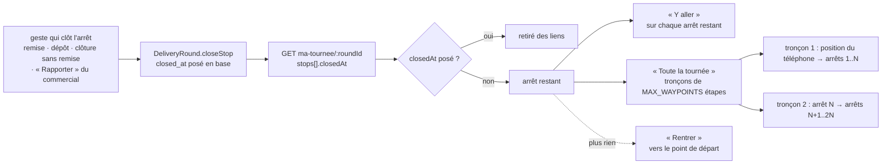
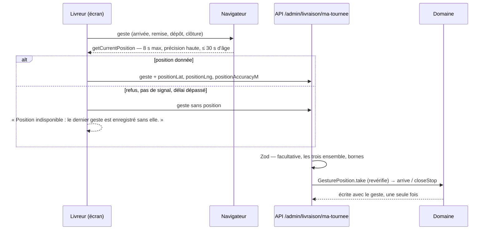
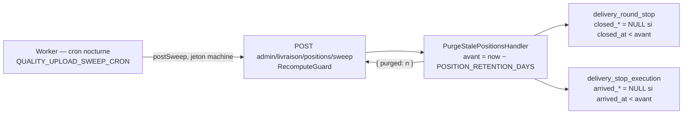
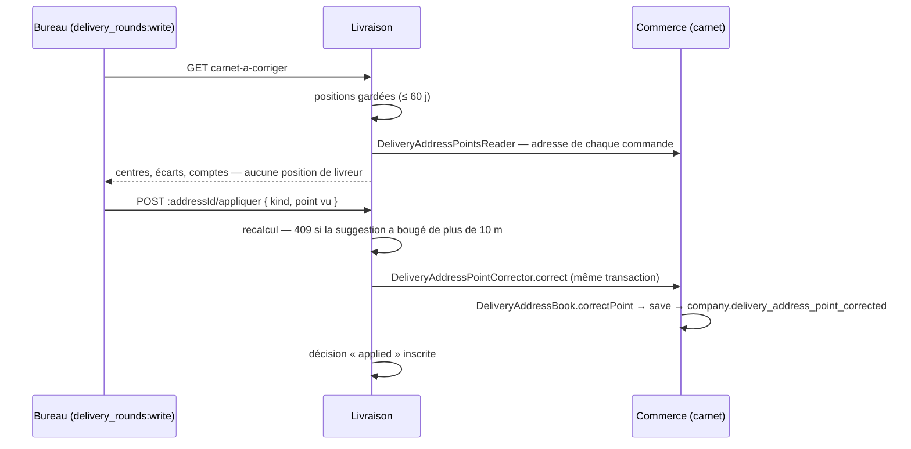

# « Y aller » et la position au geste

> ✅ **Doc technique, état au 2026-10-06.** Ce document décrit ce qui est bâti.
> C'était le plan « Y aller et la position » (2026-09-30) ; son historique —
> quatre commits, sa suppression comprise — se lit par `git log --follow` sur
> son **ancien chemin**, `plan-y-aller-et-position` dans ce même dossier,
> devenu ce document le 2026-10-06 (`16d367e3a`) ; sa dernière version est
> celle de `16d367e3a^`.
> Ce qui n'est pas bâti est dans **Reste à faire**, à la fin. Les corrections
> du carnet suggérées au bureau (§6) sont bâties depuis le 2026-10-06.

Trois choses — deux sur l'écran « Ma tournée » du livreur (`/coursier`), une
au bureau :

1. **« Y aller »** : ouvrir l'application de navigation vers un arrêt restant
   — chaque carte d'arrêt a le sien —, ou vers toute la tournée découpée en
   tronçons, **sans les arrêts déjà clos**.
2. **La position au geste** : la position du téléphone relevée une fois, au
   moment d'un geste à la porte, jamais en continu, et effacée au bout de
   60 jours.
3. **Les corrections du carnet suggérées au bureau** (§6) : quand plusieurs
   gestes concordent loin du point du carnet, le bureau reçoit une suggestion
   de porte ou de stationnement, qu'il applique ou ignore — jamais
   automatique.

---

## 1. Les liens de navigation

### Un calcul, deux boutons (YA-D1)

Tout part de la même liste : **les arrêts de la tournée, dans l'ordre de
passage, sans ceux dont `closedAt` est posé** (`remainingStops`,
`apps/lfd-backoffice-frontend/src/app/livraison/my-round-navigation.ts`). Le
téléphone ne mémorise rien : relancer « Y aller » après avoir quitté
l'application de navigation relit la tournée, et ce qui est clos a disparu.



« Y aller » est sur la carte de **chaque** arrêt restant tant que la tournée
est en route (`my-round-stop.html`) ; seul « Je suis arrivé » est réservé au
suivant — le premier restant —, tant que son arrivée n'est pas déclarée.

La chaîne est éprouvée de bout en bout (YA3, 2026-10-06) :

- côté serveur, `apps/lfd-api/test/delivery-gesture-position.e2e-spec.ts` : la
  remise du premier arrêt d'une tournée à deux arrêts → « Ma tournée » le rend
  clos, le second est le seul restant ;
- côté écran, `my-round-page.spec.ts` (« YA3 ») : le geste part, la tournée est
  relue, « Y aller » vise l'arrêt suivant et aucun tronçon ne porte plus
  l'arrêt clos.

Une livraison ratée puis rapportée par un commercial (B3) est close : elle sort
des liens (YA-Q2). Un arrêt seulement signalé reste ouvert.

### Les trois applications (YA-D3)

Un réglage **par appareil**, dans le navigateur (`lfd.livraison.navigation-app`),
pas en base.

| Application | « Y aller » | « Toute la tournée »                                    |
| ----------- | ----------- | ------------------------------------------------------- |
| Google Maps | ✅          | ✅ en tronçons                                          |
| Apple Plans | ✅          | liens Google Maps quand même (une destination par lien) |
| Waze        | ✅          | liens Google Maps quand même (une destination par lien) |

⚠️ Le plan voulait **cacher** « Toute la tournée » hors Google ; le code
(`routeLegs`, `my-round-page.html`, relus le 2026-10-06) l'affiche toujours, en
liens Google, quel que soit le choix.

Chaque étape est donnée par son **point de stationnement** quand le carnet en
a un, sinon par son **point GPS** (la porte), sinon par l'adresse en texte —
les deux points figés au départ (`delivery_stop_execution.parking_*`,
`gps_*`). Le stationnement passe devant (§6, `driveTargetOf`) : une
application de navigation guide une voiture, et la viser sur une porte au fond
d'une cour fait tourner autour du pâté ; la carte d'arrêt offre ensuite
« À pied jusqu'à la porte ». Un arrêt sans l'un ni l'autre n'entre dans aucun lien, et l'écran le
compte.

### La découpe en tronçons (YA-D2)

Lien Google `maps/dir/?api=1`, sans compte ni clé. Google suit l'ordre donné et
ne réordonne pas les étapes : c'est notre ordre qui tient les créneaux.

- Un tronçon = au plus `MAX_WAYPOINTS` étapes + la destination.
  **`MAX_WAYPOINTS = 3`** : la documentation Google (relue le 2026-10-01) annonce
  trois étapes sur navigateur mobile, neuf ailleurs, et le lien doit marcher
  partout.
- Le premier tronçon n'a pas de départ (Google part du téléphone) ; le suivant
  part du dernier arrêt du précédent.
- Un lien de plus de 2 048 caractères n'est pas garanti par Google
  (`MAX_URL_LENGTH`).
- Le retour n'est pas une étape : « Rentrer » apparaît quand plus rien ne reste.

Aucune donnée ne part vers Google, Apple ou Waze depuis le serveur : c'est un
lien que le livreur ouvre.

---

## 2. La position au geste (YA-D4)

### Ce qui est relevé, et quand

La position du téléphone (latitude, longitude, précision en mètres) est lue
**une fois, au geste**, par `navigator.geolocation.getCurrentPosition` — jamais
`watchPosition`, jamais en arrière-plan, rien entre deux gestes.

| Geste                  | Où elle s'écrit                                                                     |
| ---------------------- | ----------------------------------------------------------------------------------- |
| « Je suis arrivé »     | `delivery.delivery_stop_execution.arrived_lat`, `arrived_lng`, `arrived_accuracy_m` |
| « Remis au client »    | `delivery.delivery_round_stop.closed_lat`, `closed_lng`, `closed_accuracy_m`        |
| « Déposé avec preuve » | idem                                                                                |
| « Clore sans remise »  | idem                                                                                |

L'arrivée est relevée **en plus** de la clôture (Hugo, 2026-10-06) : l'écart
entre l'adresse prévue, l'endroit où le livreur arrive (où il se gare) et
l'endroit où il remet (la porte) est ce qui précise une adresse.

Une clôture décidée au bureau (« Rapporter », clôture par réglage) n'a pas de
position : personne n'est à la porte.



### Les règles

- **Facultative, jamais bloquante.** Une position indisponible laisse les
  colonnes nulles ; le geste s'enregistre. L'écran le dit, sans plus.
- **Les trois champs ensemble, ou aucun** — refusé par le contrat
  (`@lfd/contracts`, `delivery-doorstep.ts`), par le domaine
  (`GesturePosition`, `GesturePositionInvalidError` → 400) et par la base
  (CHECK `delivery_round_stop_closed_position_check`,
  `delivery_stop_execution_arrived_position_check`). Une position impossible
  refuse le geste : le livreur le refait, l'écran envoie une position valide ou
  rien.
- **La base ne le tient que depuis le 2026-10-07** (audit du 2026-10-07, B3).
  Les CHECK d'origine — ces deux-là (`20261007160000_la_position_au_geste`)
  et les trois points du carnet (`20261007170000_les_corrections_du_carnet`,
  §6) — n'avaient que des bornes dans leur branche « ensemble », jamais
  `IS NOT NULL`. Une comparaison avec NULL vaut NULL, un CHECK qui vaut NULL
  laisse passer : une ligne `lat` posée, `lng` nulle entrait. Aucun chemin
  applicatif n'en écrit — `GesturePosition` et `GeoPoint` portent leurs
  champs ensemble —, mais la base ne l'aurait pas refusée. La migration
  `20261007200000_les_positions_entieres_ou_nulles` repose les cinq sous le
  même nom, avec `IS NOT NULL` sur chaque colonne de la branche « ensemble »
  (la forme de `delivery_round_planned_all_or_none`), et revalide les lignes
  existantes. L'e2e apps/lfd-api/test/position-checks.e2e-spec.ts éprouve
  qu'une position partielle est refusée, en nommant la contrainte.
- **Écrite une fois.** L'arrivée garde la première position (comme son heure).
  La clôture n'écrit la position que dans le `save` du geste qui clôt : un
  arrêt réhydraté ne la porte pas, donc aucun `save` plus tardif ne peut la
  réécrire après la purge (`DeliveryStopState.closedPosition`, présent
  seulement dans cette écriture).
- **Les champs sont à plat** (`positionLat`, `positionLng`, `positionAccuracyM`)
  parce que la remise et le dépôt sont en multipart.
- « Je suis arrivé » garde un corps **facultatif** : un appel sans corps vaut
  « sans position ».

### La finalité (Hugo, 2026-10-06)

D'abord **faciliter les tournées suivantes** du livreur : des adresses justes,
l'endroit où se garer, la bonne porte, les consignes d'accès — pour lui et le
prochain livreur. Puis **prouver la livraison** en cas de litige.
**Jamais** suivre ses déplacements, ni mesurer sa vitesse ou son temps de
travail.

### L'information du livreur

On **prévient**, on ne demande pas (Hugo, 2026-10-06). La **version 2** du texte
d'information
(`apps/lfd-api/src/delivery/domain/value-objects/driver-information-notice.ts`)
l'annonce ; le registre (`documentation/legal/rgpd-registre.json`) porte les six
colonnes en catégorie `position`, conservation 60 jours, et l'empreinte que la
v2 a vue. Trois liens tiennent le texte, le registre et le code ensemble :

- `pnpm lint:rgpd-staff` échoue si une colonne du livreur ou sa catégorie
  change sans nouvelle version du texte : son empreinte porte
  `colonne|catégorie`, **pas la durée** ;
- `driver-notice-registry.spec.ts` lie la version du texte à celle du
  registre ;
- un test unitaire lie `POSITION_RETENTION_DAYS`, que lisent la purge et le
  texte, au `conservation.jours` des entrées `position` du registre (audit du
  2026-10-07, F3, bâti le jour même) : jusque-là, la durée du code et celle
  du registre pouvaient diverger, porte verte.

Un livreur qui avait accusé la version 1 revoit le dialogue une fois, au
prochain « Commencer ma tournée ».

### La purge à 60 jours



- **Une constante** : `POSITION_RETENTION_DAYS = 60`
  (`apps/lfd-api/src/delivery/domain/services/position-retention.ts`), lue par
  la purge et par le texte d'information.
- **Des colonnes, pas des lignes** : l'arrêt reste clos, à la même heure ;
  l'arrivée reste datée.
- Par lots de 500, idempotente ; une nuit manquée est rattrapée la suivante.
  Le cron enchaîne chaque balayage indépendamment : un échec ne saute pas les
  suivants, il s'écrit dans les logs du Worker.
- Aucun log ne contient de coordonnée : le compte rendu est un nombre.
- Chaque lot réveille le déclencheur `day_change` de lignes vieilles de deux
  mois : une version de journée que personne ne relit.

**Contrôle pour Hugo** (doit rendre `0` et `0`) :

```sql
SELECT count(*) AS clotures_trop_vieilles
  FROM delivery.delivery_round_stop
 WHERE closed_lat IS NOT NULL
   AND closed_at < now() - interval '60 days';

SELECT count(*) AS arrivees_trop_vieilles
  FROM delivery.delivery_stop_execution
 WHERE arrived_lat IS NOT NULL
   AND arrived_at < now() - interval '60 days';
```

Les deux requêtes, comme la purge (`clearBatchClosedBefore`,
`clearBatchArrivedBefore`), ne choisissent que `*_lat IS NOT NULL`. C'est juste
maintenant que la base refuse une ligne partielle (2026-10-07, ci-dessus) :
avant, une ligne sans `lat` mais avec `lng` leur aurait échappé, et sa
coordonnée ne se serait jamais effacée.

Un résultat non nul d'un jour sur l'autre se lit en une nuit de retard au plus ;
au-delà, la purge ne tourne pas (`RECOMPUTE_TOKEN` absent du Worker, ou route en
erreur dans ses logs).

---

## 3. Ce que voit qui

| Qui                                                  | Ce qu'il voit                                                                                      |
| ---------------------------------------------------- | -------------------------------------------------------------------------------------------------- |
| Le livreur (`delivery_driving`, `delivery_doorstep`) | ses tournées, ses liens, la mention « position indisponible » — jamais une coordonnée relevée      |
| Le bureau (`delivery_rounds:read`)                   | **aucune position**                                                                                |
| Qui organise les tournées (`delivery_rounds:write`)  | « Carnet à corriger » (§6) : des CENTRES de gestes concordants, jamais un geste, un nom, une heure |
| Google, Apple, Waze                                  | ce que contient le lien que le livreur ouvre ; rien n'est envoyé par le serveur                    |
| La base                                              | les six colonnes, 60 jours au plus                                                                 |

---

## 4. Les trois applis du dépôt concernées

- **`apps/lfd-api`** (bloc `delivery/`) : migration
  `20261007160000_la_position_au_geste` (additive), ses CHECK reposés par
  `20261007200000_les_positions_entieres_ou_nulles` (2026-10-07, §2) ;
  `GesturePosition`, `GesturePositionInvalidError`, `POSITION_RETENTION_DAYS` ;
  `closeStop(…, position)`,
  `DoorstepStop.arrive(…, position)` ; `gesturePositionOf` dans
  `doorstep-support.ts` ; la purge (`purge-stale-positions.*`,
  `GesturePositionPruner`, `PrismaGesturePositionPruner`,
  `PositionPurgeSweepController`, `POSITION_PURGE_PROVIDERS`) ;
  `container/worker.ts` appelle la route chaque nuit.
- **`packages/contracts`** : `delivery-doorstep.ts` — les champs de position
  sur les trois gestes de clôture et `declareStopArrivalPayloadSchema` ;
  `packages/contracts/src/delivery-address-suggestions.ts` (§6) ; `MyDeliveryStopView.parking` ; le
  fait `company.delivery_address_point_corrected`.
- **`apps/lfd-backoffice-frontend`** : `apps/lfd-backoffice-frontend/src/app/livraison/gesture-position.ts`
  (`GesturePositionReader`, `appendPosition`), branché dans `my-round-page`,
  `handover-form`, `deposit-form` et `my-delivery-round.service.ts` ;
  `my-round-navigation.ts` pour les liens.

---

## 5. Décisions en vigueur

| #          | Décision                                                                                                                                                                           |
| ---------- | ---------------------------------------------------------------------------------------------------------------------------------------------------------------------------------- |
| YA-D1      | Deux boutons, un calcul : les arrêts restants, sans les clos, relus à chaque fois.                                                                                                 |
| YA-D2      | Tronçons de `MAX_WAYPOINTS` (3) étapes ; « Rentrer » à part.                                                                                                                       |
| YA-D3      | Application choisie par appareil pour « Y aller » ; « Toute la tournée » toujours en liens Google (le code, relu le 2026-10-06).                                                   |
| YA-D4      | Position au geste seulement — arrivée, remise, dépôt, clôture sans remise (arrivée ajoutée par Hugo le 2026-10-06) ; jamais exigée.                                                |
| YA-Q1      | Pas de « Je suis passé » sans preuve : un arrêt sort par un geste qui le clôt.                                                                                                     |
| YA-Q2      | Un arrêt raté puis rapporté est clos : il sort des liens.                                                                                                                          |
| YA-Q3      | 60 jours (`POSITION_RETENTION_DAYS`), à faire valider.                                                                                                                             |
| YA-Q4      | Proposé au plan (2026-09-30) : annoncer la navigation tierce et la position au geste avant la mise en service. La position l'est au livreur (§2) ; la navigation, pas encore (§7). |
| 2026-10-06 | On prévient, on ne demande pas : le texte énonce un fait.                                                                                                                          |
| 2026-10-06 | Finalité : faciliter les tournées suivantes, puis prouver la livraison ; jamais suivre les déplacements.                                                                           |
| CC-D1      | Suggestion : ≥ 3 gestes à 30 m au plus d'un même geste (le groupe le plus dense, §6), centre à plus de 50 m du point de comparaison. Jamais appliquée seule.                       |
| CC-D2      | La livraison calcule, le commerce écrit : `DeliveryAddressPointCorrector` déclaré par la livraison, implémenté par le carnet.                                                      |
| CC-D3      | Le stationnement est une colonne du carnet ; la porte reste le point GPS des consignes.                                                                                            |
| CC-D4      | « Y aller » conduit au stationnement s'il existe ; la porte se rejoint à pied.                                                                                                     |
| CC-D5      | La liste se lit sous `delivery_rounds:write`, lecture comprise.                                                                                                                    |

---

## 6. Les corrections du carnet suggérées au bureau

Règle validée par Hugo le 2026-10-06 ; bâti le même jour. Écran
`/livraison/carnet-a-corriger` (« Carnet à corriger »), route
`admin/livraison/carnet-a-corriger`.

### La règle (CC-D1)

`apps/lfd-api/src/delivery/domain/services/address-point-suggestions.ts`, pur :

- **Deux genres.** `door` (la porte) part des positions de **clôture**
  (`closed_*` : remise, dépôt, clôture sans remise — la base ne distingue pas
  les trois, et la règle tient le livreur pour être à la porte dans les
  trois ; rien ne le vérifie pour la clôture sans remise, question ouverte
  au §7) ; `parking` (le stationnement) part des positions d'**arrivée**
  (`arrived_*`).
- **Rattachées à l'adresse du carnet** de la commande, par le commerce
  (`DeliveryAddressPointsReader`, sous le mur `(adresse, société)`, adresses
  archivées exclues). Une commande sans adresse reliée ne compte pas.
- **Une position annoncée à plus de 50 m près est écartée** (`MAX_ACCURACY_M`).
- **Une position relevée à moins de 200 m du dépôt est écartée** (`DEPOT_RADIUS_M`,
  Hugo, 2026-10-07, audit § 3.3) : trois clôtures « sans remise » faites au
  retour suggéraient le dépôt comme porte. Dépôt non situé : rien n'est écarté.
- **Le groupe le plus dense** (`densestCluster`) : pour chaque position,
  celles à `CLUSTER_RADIUS_M` (30 m) au plus d'elle — deux positions d'un même
  groupe peuvent donc être à 60 m l'une de l'autre ; on garde le plus grand,
  s'il en compte au moins `MIN_CONCORDANT` (3) — deux peuvent être un hasard.
  Son centre est la moyenne.
- **Le point de comparaison** : pour la porte, le point du carnet, sinon le
  géocodage de l'adresse (le cache que la tournée lit), sinon rien ; pour le
  stationnement, celui du carnet, sinon la porte — un livreur qui se gare
  devant la porte n'a pas besoin de stationnement.
- **Une suggestion naît** quand le centre est à plus de `MIN_GAP_M` (50 m) de
  ce point, ou quand il n'y a aucun point (distance inconnue).
- **Ignorée, elle ne revient pas** tant que le centre reste à 30 m du point
  ignoré, et tant que ce point tient : il s'efface à 60 jours (question
  ouverte au §7) ; un groupe ailleurs, né de nouvelles livraisons, la
  repropose.
  **Appliquée, elle s'éteint d'elle-même** : le carnet porte le point.

### Le chemin à travers la frontière (CC-D2)



`delivery → b2b` est interdit : un port déclaré par le commerce et implémenté
par la livraison n'est pas exprimable. La livraison DÉCLARE donc les deux ports
dans `delivery/channels/commerce/` — une lecture et une **demande** de
correction — et le commerce les implémente
(`apps/lfd-api/src/b2b/orders/infrastructure/prisma-delivery-address-points.reader.ts`,
`apps/lfd-api/src/b2b/account/application/services/commerce-delivery-address-point-corrector.ts`),
relié dans `appBootstrap/delivery-feed.module.ts`. C'est le carnet qui décide,
écrit et journalise ; la livraison n'importe rien du commerce.

### Ce qui est écrit (CC-D3)

- **La porte** → `DeliverySpecs.gps` (le point GPS des consignes, qui passe
  déjà avant le géocodage : `locateFromCache`, `departAndFreeze`).
- **Le stationnement** → `public.addresses.parking_lat/parking_lng`, une
  COLONNE pour la raison de `deposit_allowed` : le `jsonb` des consignes se
  réécrit d'un bloc. Seul `correctPoint` l'écrit ; une modification de
  l'adresse ne l'efface pas.
- **Le départ fige les deux** : `delivery_stop_execution.gps_*` (déjà) et
  `parking_*` (lu dans la feuille, `DepartureSheet.parking`). « Ma tournée »
  sert `parking` : figé après le départ, lu au carnet au dépôt.
- **La décision** → `delivery.delivery_address_suggestion_decision` (une ligne
  par geste, `ignored` ou `applied`, signée et datée). Son point s'efface à
  60 jours avec les positions (`clearBatchDecidedBefore`).
- **Le journal** : `company.delivery_address_point_corrected` (`point`:
  `door`/`parking`, l'adresse par son lieu, jamais de coordonnées) — un fait
  du commerce, rangé avec les comptes par son préfixe. Ignorer ne journalise
  pas (`@sans-journal`) : rien ne change, la ligne de décision est la trace.

Migration `20261007170000_les_corrections_du_carnet` (additive, aucun droit) ;
ses trois CHECK de point sont reposés sous leur forme vraie le 2026-10-07
(§2).

### Qui le voit (CC-D5)

`delivery_rounds:write`, **lecture comprise** (`@RequirePermission`) : la
liste est tirée des positions des livreurs, et seul qui organise les tournées
la voit. Le livreur, et qui ne fait que lire les tournées, reçoivent 403
(prouvé : `apps/lfd-api/test/delivery-address-suggestions.e2e-spec.ts`). Rien d'individuel n'en
sort : un centre de trois gestes au moins, ni auteur, ni tournée, ni heure.

### Le livreur (CC-D4)

À la tournée suivante, la carte d'arrêt porte l'épingle corrigée et un « P »
de stationnement ; « Y aller » et « Toute la tournée » visent le stationnement
(`driveTargetOf`), puis « À pied jusqu'à la porte » (`walkToDoorHref`) finit
le trajet.

---

## 7. Reste à faire

- **L'écart arrêt par arrêt** (arrivée ↔ adresse prévue, remise ↔ adresse
  prévue, sur la tournée du jour) : non bâti. Le bureau voit les corrections
  CONCLUES (§6), pas chaque geste — et c'est voulu tant que personne n'a dit
  qu'il en avait besoin.
- **Une vraie carte** dans « Carnet à corriger » : l'écran donne les
  coordonnées et un lien Google Maps (itinéraire à pied du point enregistré au
  point suggéré) ; le fond de carte de la Livraison (`delivery-map`) n'y est
  pas branché.
- **Le stationnement au carnet côté commercial** : il n'est ni affiché ni
  modifiable sur la fiche client ; seul « Appliquer » le pose.
- **Les seuils** (3 gestes, 30 m, 50 m, précision 50 m) viennent de la règle
  dite par Hugo, pas d'une mesure sur le terrain.
- **« Livré à 9 h 42 », le prochain arrêt, l'heure estimée des suivants** sur
  « Planifier » : non bâti, même raison.
- **Faire valider** par un juriste ou un DPO : finalité, proportionnalité,
  60 jours, information des représentants du personnel
  ([`../../legal/rgpd-livreur.md`](../../legal/rgpd-livreur.md) §5).
- **Annoncer la navigation tierce** dans la politique de confidentialité avant
  la mise en service (YA-Q4).
- **Mesurer `MAX_WAYPOINTS`** sur l'iPhone du livreur (application Google Maps
  installée et non installée) : la valeur 3 vient de la documentation, pas
  d'une mesure.
- Le contact pour exercer ses droits manque toujours au texte d'information
  (« [À COMPLÉTER : contact] »).

### Questions ouvertes, non tranchées (relevées le 2026-10-07)

- **Une suggestion ignorée peut revenir.** Le point d'une décision
  « ignorée » s'efface à 60 jours avec les positions
  (`clearBatchDecidedBefore`), et seules les décisions dont le point tient
  écartent une suggestion (`PrismaIgnoredAddressPointsReader`) : si les
  livraisons des 60 derniers jours forment encore le même groupe, la
  suggestion réapparaît. Voulu ou non : à trancher.
- **« Clore sans remise » n'a aucune condition de lieu.** Le geste n'exige
  que la réponse du commerce (commande retirée ou annulée), relève la
  position où qu'elle soit, et la règle compte toute clôture comme un geste à
  la porte (§6, « Deux genres ») : trois clôtures sans remise faites au dépôt
  pour une même adresse y suggéreraient la porte. Voulu ou non : à trancher.
