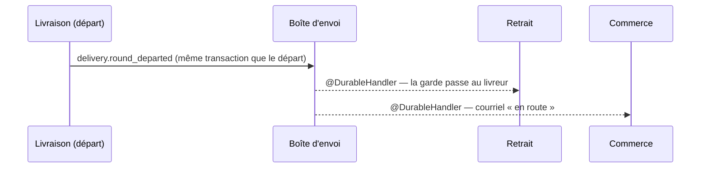

# Le départ d'une tournée devient un fait durable

> ✅ **DD1 bâti le 2026-10-06** (`375f82225`), **déployé en production le
> 2026-10-07** — écarts et décisions au §6. Le courriel « en route » est décrit
> dans sa doc d'état, [`en-route.md`](en-route.md) ; la garde, dans
> [`a-la-porte.md`](a-la-porte.md) § 5.
>
> 📜 **Relu contre le code le 2026-10-07** ([audit](../audit-2026-10-07.md)). Ce
> document est la **décision de conception**, pas l'état du code : il reste
> parce que la migration `20261007180000_le_retour_avant_le_depart` et
> vingt-quatre fichiers de code le citent par son nom, et qu'un
> `migration.sql` appliqué ne se réécrit pas. Ce qui s'y lit au présent et
> n'est plus vrai : le **§ 1** décrit l'avant-DD1 (les deux abonnés en mémoire
> et les ports d'annonce **n'existent plus**, la dette de la porte est passée
> de 4 à 2) ; le lot **DD2 du § 4 n'existe pas**, tout est dans DD1 (§ 5.1).
> Le § 6 porte une correction du 2026-10-07 (B1).
>
> 📐 **Plan** (2026-10-06). ⚠️ Contredit par `vitruve` le même jour : le §5 fait foi. Hugo : « pourquoi on a encore
> des messages en bus mémoire plutôt qu'en durables ? » puis « lance ».
>
> 🔴 Il touche une **frontière entre trois blocs** (livraison, retrait,
> commerce) : `vitruve` avant de bâtir.

## 1. Ce qui existait avant DD1 (relu le 2026-10-06 — périmé par le lot)

- Au départ, la livraison publie `DeliveryRoundDepartedEvent`
  (`apps/lfd-api/src/delivery/domain/events/delivery-loading.events.ts`) sur
  le **bus en mémoire**.
- Deux `@EventsHandler` **de la livraison** l'écoutent, et chacun appelle,
  **après la validation** (`AfterCommit`) et **en arrière-plan**
  (`BackgroundWork`), un port qu'un autre bloc implémente :
  - `HandDepartedOrdersOver` → `DepartedOrdersAnnouncer.ordersDeparted`
    (`delivery/channels/handover/`), implémenté par le retrait : **la garde
    passe au livreur** (BQ, `a-la-porte.md` § 5) ;
  - `AnnounceDeliveryDeparture` → `DeliveryDepartureAnnouncer`
    (`delivery/channels/commerce/`), implémenté par le commerce : le
    courriel « en route » (`en-route.md`, PL3).
- **Le défaut** : si le processus s'arrête entre la validation du départ et
  ces appels, ils sont perdus, sans reprise. La tournée est partie, mais le
  retrait croit encore les commandes au fournil, et aucun courriel ne part.
- La porte `lint:durable-cross-block` ne le voyait pas : l'abonné vit dans
  son bloc, c'est l'appel de port qui traverse (élargie le 2026-10-06 ; ces
  deux abonnés y **étaient** en dette comptée — depuis DD1, la dette ne tient
  plus que `on-product-media-changed`, et celui de la commande passée, basculé
  le 2026-10-07).
- Le modèle à suivre existe : `production.day_closed`
  (`apps/lfd-api/src/production/channels/commerce/production-day-closed.event.ts`),
  publié par la boîte d'envoi dans la transaction de l'arrêt, écouté en
  `@DurableHandler` par la livraison et le commerce.

## 2. La proposition

1. **Un fait durable `delivery.round_departed`**, déclaré par la livraison
   dans ses canaux (exporté par `delivery/channels/handover/` et
   `delivery/channels/commerce/`), charge : `roundId`, `serviceDay`,
   `departedAt`, `orderIds`. Clé d'idempotence : `delivery.round_departed:<roundId>:<departedAt>`.
2. **Publié par la boîte d'envoi dans la transaction du départ** : si le
   départ est annulé, le fait l'est ; s'il est validé, le fait sera livré au
   moins une fois.
3. **Le retrait s'abonne** en `@DurableHandler` et fait ce que fait
   aujourd'hui `ordersDeparted`. **Le commerce s'abonne** et fait ce que fait
   aujourd'hui l'annonceur du départ (le courriel garde sa clé par commande).
4. **Les deux abonnés en mémoire et les deux ports d'annonce disparaissent**
   (`HandDepartedOrdersOver`, `AnnounceDeliveryDeparture`,
   `DepartedOrdersAnnouncer`, `DeliveryDepartureAnnouncer`) ; la dette de la
   porte baisse de deux.
5. **Idempotence à vérifier avant de bâtir** : `ordersDeparted` rejoué
   (même tournée, même instant) ne doit rien dupliquer ni refuser — lire son
   implémentation au retrait (`order_departure`). Un départ **après un
   retour** (second passage, nouvelle tournée) doit rester un fait distinct.
6. **Ordre** : aucun ordre n'est supposé entre ce fait et ceux du retrait
   (`handover.handed_over` — `order.handed_over` est un type d'événement de
   croissance, pas le fait durable) ; un abonné qui reçoit le départ d'une
   commande déjà remise ne la « repart » pas.

## 3. Questions

- **DD-Q1** — Faut-il conserver un abonné en mémoire pour l'effet
  immédiat (le courriel part dans la seconde) ? La boîte d'envoi a un chemin
  rapide après validation : le délai réel est à mesurer, pas à supposer.
- **DD-Q2** — Le journal de la livraison lit-il aujourd'hui
  `DeliveryRoundDepartedEvent` (`JournaledEvent`) ? Le fait durable ne doit
  pas le doubler.

## 4. Lots

> ⚠️ Découpage d'avant `vitruve`. Le lot unique du § 5.1 l'a remplacé : **DD2
> n'a jamais existé**, son contenu est dans DD1.

| Lot     | Contenu                                                                                    |
| ------- | ------------------------------------------------------------------------------------------ |
| **DD0** | `vitruve`, puis les réponses                                                               |
| **DD1** | le fait, sa publication dans la transaction du départ, l'abonné du retrait, e2e de reprise |
| **DD2** | l'abonné du commerce (courriel), retrait des abonnés en mémoire et des ports d'annonce     |

## 5. Contradiction de `vitruve` (2026-10-06) et v2

Trois BLOQUANTS, cinq SÉRIEUX. Le §1 est exact. Ce qui suit corrige le §2 ;
là où ils divergent, le §5 fait foi.

**B1 — un départ livré en retard efface un retour.**
`recordDeparted` (`apps/lfd-api/src/handover/infrastructure/prisma-order-departure.repository.ts`)
fait un `upsert` sans garde (`returnedAt: null`), alors que `recordReturned`
est gardé par `departedAt <= at`. Sous reprise (jusqu'à 2 h 08 de délai par
rejeu automatique — dix essais, `retry-policy.ts` ; le plafond de 6 h n'est
jamais atteint, et un rejeu manuel peut venir bien plus tard), un départ
rejoué après un retour remet la commande « partie ».
→ **La ligne `order_departure` devient monotone par instant, pas par ordre
d'arrivée** : `recordDeparted(at)` n'écrit que si `departedAt` est nul ou
`<= at` **et** si `returnedAt` est nul ou `< at`. Un fait plus ancien que
l'état ne fait rien. Test : départ puis retour puis départ rejoué → la
commande reste revenue.

**B2 — le retour reste en mémoire alors qu'il écrit la même ligne.**
`ordersBroughtBack` est appelé en différé, perdable, depuis
`bring-stop-back.handler.ts` et `stop-decision-by-setting.ts`.
→ **Le retour devient aussi un fait durable**, `delivery.orders_brought_back`
(c'est ce que prévoyait E3, `documentation/journalisation/plan-evenements-durables.md`).
Les deux faits portent leur instant, et la règle de B1 les ordonne sans
supposer d'ordre de livraison.

**B3 — « ne repart pas une commande déjà remise » sans mécanisme.**
→ L'abonné du retrait lit `order_handover` avant d'écrire : une commande
déjà remise est ignorée. Test dédié.

**Sérieux, tranchés :**

- **Deux portes de départ** (`depart-my-round.handler.ts`, livreur ;
  `depart-delivery-round.handler.ts`, chargeur) → la publication durable se
  fait **dans `departAndFreeze`**, le seul chemin commun, pour qu'aucune
  porte ne l'oublie.
- **Le journal** : `DeliveryRoundDepartedEvent` (`JournaledEvent`) **reste**
  et écrit le journal ; le fait durable **s'ajoute**, classe distincte dans
  le canal, comme `ProductionDayClosedJournalEvent` et
  `ProductionDayClosedEvent`.
- **Le courriel sous reprise** : l'abonné du commerce envoie commande par
  commande, journalise un échec **sans le relancer** (un courriel « en
  route » n'est pas critique ; ce qu'on gagne, c'est qu'un redémarrage ne
  le perd plus). Clé d'idempotence **par commande et par tournée**
  (`delivery.en_route:<orderId>:<roundId>`) : un second passage a son
  courriel, une reprise n'en fait pas un second.
- **Latence** : pas d'abonné en mémoire en plus (il reconstruirait le double
  envoi). Critère du lot : en e2e, le courriel part au premier réveil du
  relais après la validation ; mesure du délai notée dans le rapport.
- **Transition** : **un seul lot** remplace les deux abonnés en mémoire et
  pose les deux abonnés durables (pas de période à deux écrivains). Noms
  d'abonnés stables dès le premier déploiement
  (`handover.record-round-departed`, `handover.record-orders-brought-back`,
  `b2b.mail-delivery-en-route`). Un départ validé pendant le déploiement
  reste perdu, comme aujourd'hui.

**Mineurs** : la clé du fait est `delivery.round_departed:<roundId>` (un
second passage est une nouvelle tournée) ; le §1 renvoie à `a-la-porte.md`
§ 10 ter ; la porte ne voit pas les appels `ordersBroughtBack` (command
handlers) — ce lot les retire, la question ne se pose plus.

### 5.1 Lot unique

| Lot     | Contenu                                                                                                                                                                                                                  |
| ------- | ------------------------------------------------------------------------------------------------------------------------------------------------------------------------------------------------------------------------ |
| **DD1** | `order_departure` monotone ; faits durables départ et retour (publiés dans `departAndFreeze` et au retour) ; trois abonnés durables ; retrait des abonnés en mémoire et des ports d'annonce ; e2e de reprise et de rejeu |

## 6. Bâti le 2026-10-06 — décisions prises en bâtissant, et écarts

Carte blanche d'Hugo le 2026-10-06 (« fais tout sans interruption, si un
problème arrive corrige »). Ce que le §5 laissait ouvert, tranché :

- **Migration additive `20261007180000_le_retour_avant_le_depart`** :
  `order_departure.departed_at` accepte NUL. La règle de B1 (« `departedAt`
  nul ou `<= at` ») n'avait de sens qu'avec une colonne nullable, et sans
  elle un retour livré AVANT son départ (abonné du départ en reprise) se
  perdait — `recordReturned` ne touchait que les lignes existantes —, puis le
  départ en retard remettait la commande « partie ». `recordReturned` crée
  donc la ligne (`departed_at` nul) et devient monotone lui aussi (`returned_at`
  nul ou `< at`). Aucun lecteur ne lit `departed_at` pour décider (la garde et
  la pièce de remise lisent `returned_at IS NULL`).
- **Monotonie en Prisma, sans SQL écrit** : `createMany({ skipDuplicates })`
  puis `updateMany` gardé dans le `where`, dans un `$transaction`.
- **Noms** : `DeliveryRoundDepartedFact`, `DeliveryOrdersBroughtBackFact`
  (suffixe `Fact`, pour ne pas confondre avec `DeliveryRoundDepartedEvent`,
  le fait de journal qui reste). Déclarés dans `delivery/channels/handover/`,
  le départ réexporté par `delivery/channels/commerce/`.
- **Clé du retour** : `delivery.orders_brought_back:<roundId>:<orderIds>`
  (un arrêt rapporté est clos et ne se rapporte plus). Charge `roundId`,
  `orderIds`, `broughtBackAt`.
- **B3** : nouveau port de lecture `HandedOverOrdersReader` au retrait (ISP :
  l'abonné ne grave rien), une requête sur `order_handover`.
- **Courriel** : l'abonné construit `DeliveryEnRouteMailFailedError` et la
  journalise (`Logger`), sans lever.
- **Délai mesuré** (e2e, trois passages, à la main) : courriel envoyé 15 à
  23 ms après la réponse HTTP du départ, au premier réveil du relais, sans
  balayage. ⚠️ Le e2e (`delivery-departure-durable.e2e-spec.ts`) n'asserte
  que `< 2 000 ms`, et son mailer est un enregistreur sans réseau : ces
  chiffres mesurent le réveil du relais, pas un envoi réel.

### 6.1 Corrigé le 2026-10-07 (audit, B1)

L'abonné du courriel tournait **dans la transaction** que la garde durable
ouvre pour poser le reçu (`DurableDeliveryGuard.deliver` enveloppe
`handle()` dans `unitOfWork.run`), ce que `unit-of-work.ts` interdit : délai
Prisma de 5 s, une connexion du pool tenue le temps de N appels à Resend. Une
tournée de vingt commandes dépassait le délai, la transaction tombait avec le
reçu, et le fait était relivré. **Depuis le 2026-10-07, les envois partent
après la validation** (`deferUntilCommit`) : le reçu est validé, les
courriels partent hors transaction, un échec est journalisé sans relance. La
fenêtre de perte à un redémarrage est entre la validation et l'envoi, quelques
millisecondes — contre tout le trajet avant DD1. Même correction pour l'envoi
du dossier de production (`send-dossier-on-day-closed`, `-retaken`).
