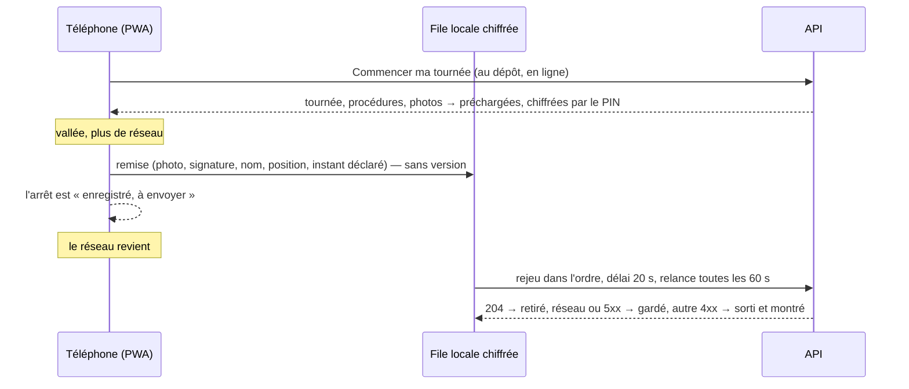
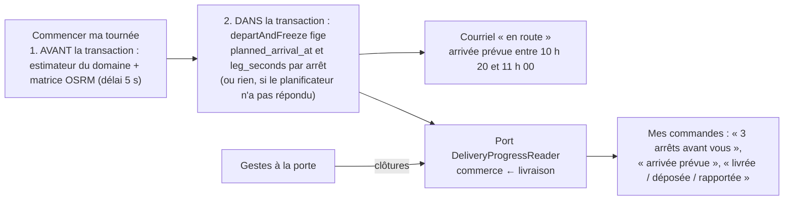
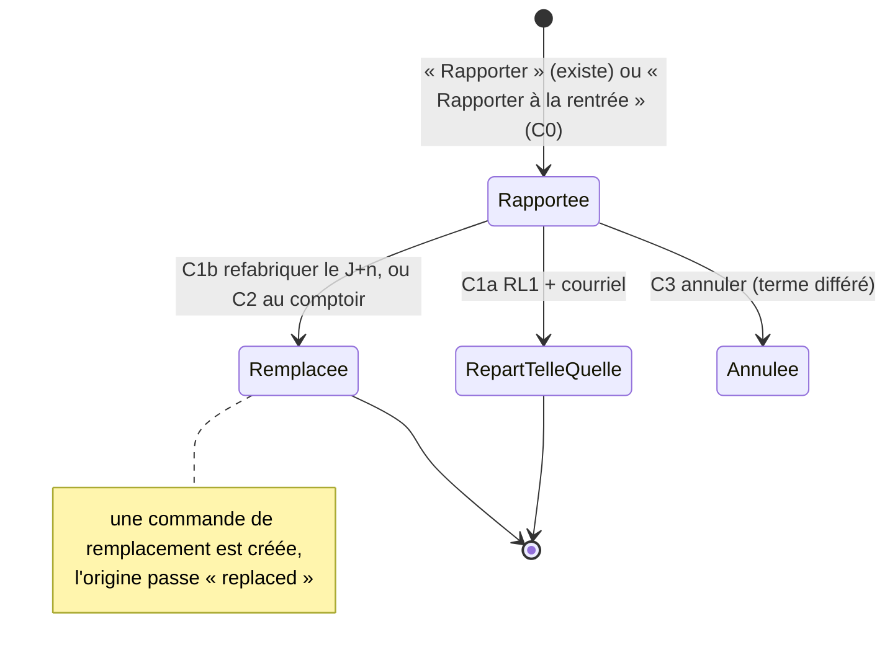

# Plan — le livreur sans réseau, l'heure prévue au client, les livraisons ratées (6 c)

> 📐 **Plan, v2** (2026-10-07) — **rien n'est bâti.** Hugo, après l'audit du
> dossier : « écris-moi un plan pour le hors-ligne, l'ETA client et le 6 c ».
> Trois chantiers, un ordre proposé au § D.
>
> ⚠️ **La v1 a été contredite par `vitruve` le même jour** : six BLOQUANT,
> treize SÉRIEUX, et **dix affirmations fausses sur l'existant** — elle avait
> été écrite sur trois explorations déléguées, sans que les fichiers soient
> rouverts. La v2 les a rouverts. Le § F dit chaque objection et ce que la v2
> en fait ; là où la v1 et la v2 divergent, la v2 fait foi. Ce qui est encore
> dit « (vitruve) » a été lu par lui et pas rouvert ici.
>
> 🔴 `vitruve` d'office avant Hugo, et il est passé : le 6 c touche
> **l'argent** ; le hors-ligne déplace une **frontière** (un instant déclaré
> par le téléphone, des preuves et des coordonnées de tiers retenues sur un
> téléphone, un cache de la coquille qui change la règle de déploiement) et
> rouvre une décision prise (L6-Q5).

## A. Le livreur sans réseau

### A.1 Ce qui existe (rouvert le 2026-10-07)

- La page du livreur (`/coursier`, `app.routes.ts:302-306`) est une web app
  Angular. Il existe **déjà un service worker**,
  `apps/lfd-backoffice-frontend/public/sw.js`, enregistré à la portée `/` pour
  Web Push et **rien d'autre** (« aucun cache, aucune interception de
  requête », `sw.js:5`) : la cloche du back-office en dépend. Il existe aussi
  **une coque Capacitor iOS**, `apps/lfd-backoffice-frontend/capacitor.config.ts`,
  en mode distant (elle charge le site), avec cette phrase : « contrepartie
  assumée : aucun mode hors-ligne. Sans réseau, écran blanc » (`:32`), et la
  recette du mode embarqué (`:36-48` : `capacitor://localhost` à déclarer chez
  Auth0 et dans le CORS — une frontière de sécurité).
- La tournée est **figée au départ** (`DeliveryStopExecution`,
  `delivery.prisma:320-378`) ; un veilleur la relit toutes les 15 s, et un filet
  toutes les 5 min, **onglet visible seulement**
  (`shared/day-version/day-version-watcher.ts:84-88`). Une requête qui échoue
  met l'écran en `error` (`livraison/my-round-reader.ts:116`), elle
  ne garde pas le dernier état. La route est sous `permissionGuard`, qui
  appelle `GET /admin/me` et vaut `denied` sur un échec réseau
  (`auth/permissions.store.ts:76-90`) : **après un redémarrage sans réseau, la
  page ne s'ouvre pas.**
- Les gestes à la porte (`delivery/http/my-delivery-doorstep.controller.ts`)
  sont des `POST` idempotents, mais **remise, dépôt et clôture exigent la
  version de la tournée lue**, et **toute clôture fait avancer cette version**
  (`closeStop` → `touch`, `delivery/domain/entities/delivery-round.ts:436-453`).
  Deux gestes faits sans réseau avec la même version : le premier passe, le
  second reçoit `DoorstepRoundStaleError` (409, « rechargez la page, puis
  refaites le geste »). Le signalement (`POST incidents`) n'est pas idempotent.
  Un dépôt ou une remise sur un arrêt déjà clos (« Rapporter » du commercial)
  tombe sur `hasClosed` puis `StopBroughtBackError`
  (`delivery/application/doorstep-handover.ts:129-131,170-173`) : **un arrêt
  clos ne se rouvre pas** (I4).
- L'instant d'un geste vient du serveur (`Clock`) ; un temps propagé n'écrit
  jamais du métier (`CLAUDE.md` § 3.2). `delivery_incident.reported_at` existe
  déjà et désigne l'instant **serveur** du signalement (`delivery.prisma:409`).
- Les preuves partent en multipart avec le geste (photo JPEG, PNG, WebP ou
  HEIC, `doorstep-receipt.ts:107-112`, sans compression côté client ;
  signature PNG ; nom 2–80), écrites dans R2 avant la transaction et retirées
  si elle échoue. La position est un relevé au geste
  (`livraison/gesture-position.ts:32-58`) ; le GPS marche sans réseau.
- **La leçon écrite d'une file hors-ligne** : celle du fournil a bloqué
  « au premier vrai usage » (une ligne refusée retenait toutes les suivantes),
  et sa règle est consignée
  (`todos/todo-file-hors-ligne-bloquee-par-un-refus.md:9-25`) : réseau, 5xx,
  401, 408, 425, 429 → on garde ; tout autre 4xx → refus définitif qui **sort
  de la file**, exposé avec le message du serveur, et le vidage continue ; une
  erreur qu'on ne sait pas lire est gardée.
- **Décision à rouvrir** : L6-Q5, « pas de hors-ligne pour l'instant » (Hugo,
  2026-09-29, `plan-preparation-de-tournee.md:2880`). Le dépôt a du réseau ; la
  vallée, pas toujours — **A-Q4 : les routes réelles ont-elles des trous ?**
  C'est ce qui fixe l'ordre du § D.
- Le scan du code de retrait à la porte est tranché mais pas bâti
  (`a-la-porte.md:309-312`) : il entrera un jour dans ce qui doit marcher sans
  réseau ; `BarcodeDetector` n'existe pas sur iOS.

### A.2 Le besoin, précisément

1. **Voir** sa tournée sans réseau, y compris après un redémarrage du
   téléphone : arrêts, adresses, procédures et leurs photos, fenêtres,
   contacts, règle de dépôt.
2. **Faire** les gestes sans réseau — arrivée, remise avec photo et
   signature, dépôt, signalement, clôture sans remise — et qu'ils partent
   quand le réseau revient, **sans se bloquer les uns les autres**.
3. **Ne perdre aucune preuve**, et n'en montrer aucune à qui n'est pas ce
   livreur.
4. Naviguer : Google, Apple et Waze ont leurs cartes hors-ligne. Rien à faire.

### A.3 La proposition

- **HL1 — la coquille, le push et la porte.** Un service worker Angular
  (`@angular/service-worker`) qui met en cache **la coquille et ses ressources
  seulement** — jamais une réponse de l'API, sauf ce que HL2 précharge
  explicitement — et qui **absorbe le push** : le worker Web Push actuel est
  remplacé (une portée n'a qu'un worker), la cloche passe par `SwPush`, et un
  test prouve qu'une poussée s'affiche encore. `SwUpdate` recharge la page à
  chaque ouverture quand une version est disponible : la règle de pré-release
  (« un contrat cassé dans le même déploiement ») tient pour qui ouvre l'app,
  et un livreur **en tournée pendant un déploiement garde l'ancienne coquille
  jusqu'à sa prochaine ouverture** — assumé, et dit. Le `permissionGuard`
  garde la dernière réponse de `GET /admin/me` sur le téléphone, avec la date
  d'expiration du jeton, et l'utilise sur un échec réseau : la page s'ouvre.
- **HL2 — la tournée sur le téléphone, protégée par un PIN.** Au geste
  « Commencer ma tournée » (au dépôt, en ligne), la tournée, chaque arrêt,
  chaque procédure et ses photos sont écrits dans IndexedDB, et le bouton ne
  rend la main qu'une fois tout enregistré (_A-D1 : préchargement, pas cache
  opportuniste_). Ces données sont **celles des clients et des
  réceptionnaires**, et IndexedDB est attaché à l'origine, pas à la personne :
  tout est **chiffré** avec une clé dérivée d'un **PIN** à quatre chiffres que
  le livreur choisit à son premier départ et saisit à chaque ouverture
  hors-ligne (_A-D4_) — c'est ce que font les applications de livraison, et
  c'est ce qui permet le besoin 1 après un redémarrage sans réseau. La clé ne
  quitte jamais la mémoire de session ; le cache et la file sont **purgés à la
  déconnexion et à « Tournée terminée »**. Un autre utilisateur du même
  téléphone ne voit rien sans le PIN.
- **HL3 — la file des gestes, selon la leçon du fournil.** Chaque geste est
  d'abord écrit dans la file (identifiant client ULID, arrêt, type, instant
  déclaré, position, nom, blobs), **puis** envoyé. Le rejoueur envoie dans
  l'ordre, un à la fois, avec un **délai de 20 s** par requête, sur `online`, à
  l'ouverture, **et toutes les 60 s** tant que la file n'est pas vide (un
  réseau présent sans données ne déclenche aucun `online`). Réseau, 5xx, 401,
  408, 425, 429 : gardé. Tout autre 4xx : **sort de la file**, exposé avec le
  message du serveur, et le vidage continue ; la preuve d'un geste refusé est
  gardée jusqu'à « Compris » du livreur **et** sa remontée au bureau (HL4).
  Les preuves envoyées (2xx) sont effacées aussitôt. **Aucune purge par âge
  n'efface une preuve non envoyée ni non acquittée** ; une file non vide
  depuis sept jours fait une alerte à l'ouverture, pas un effacement.
- **HL4 — ce que l'API accepte d'un geste différé.** Un geste différé **ne
  porte pas la version** de la tournée (il ne peut pas) : à sa place, le
  serveur applique une **garde de cohérence** — l'arrêt est vivant et non
  clos, la tournée est partie et non rentrée, le livreur est celui de la
  tournée (le mur, inchangé) — et la version n'est exigée que des gestes en
  ligne. Le corps gagne `declaredAt`, l'instant du téléphone, **présent
  seulement sur un geste différé** : rangé dans deux colonnes nullables
  neuves, `delivery_stop_execution.arrived_declared_at` et
  `delivery_round_stop.closed_declared_at` (migration additive), avec une
  garde de plausibilité (`departedAt ≤ declaredAt ≤ now + 2 min`) qui ne
  touche aucun geste en ligne. _A-D2 : c'est une dérogation à `CLAUDE.md`
  § 3.2, soumise à Hugo comme telle — l'instant déclaré n'écrit **aucune**
  décision ; il s'imprime sur la pièce de remise quand il s'écarte de plus de
  5 min de l'instant serveur (« déclarée à 10 h 42, reçue à 11 h 15 »), par le
  contrat `DoorstepHandoverAttestor` étendu d'un champ optionnel._ Le
  signalement devient idempotent par une `client_key` (ULID, unique par
  livreur, migration additive) : même clé et même contenu → 200 avec l'id
  existant ; même clé et contenu différent → 409. Un geste différé refusé
  parce que l'arrêt a été clos entre-temps (le commercial a dit
  « Rapporter ») est un **conflit**, pas un fait accompli : le serveur ne
  rouvre rien (I4), écrit un fait de journal `delivery_round.offline_conflict`
  avec le geste, son instant déclaré et la clé de sa preuve retenue, et sonne
  le bureau (`delivery_decisions:write`) : la marchandise est peut-être chez
  le client alors que le système la dit revenue — c'est au bureau de régler,
  avec la preuve.
- **HL5 — la règle du dépôt sans réseau.** _A-D3 v2 : hors-ligne, la seule
  autorité est la règle de l'adresse **figée au départ**
  (`depositAllowed && !signatureRequired`) ; aucune autorisation du commercial
  ne compte, même reçue avant la coupure, parce qu'il peut la retirer et qu'un
  arrêt clos ne se rouvre pas._ L'écran le dit en clair quand il est
  hors-ligne : « sans réseau, pas de décision du bureau : remettez en main
  propre, déposez si l'adresse le permet, sinon rapportez ». Un signalement
  fait sans réseau part dans la file ; le livreur sait que le commercial ne
  le lira qu'au rejeu, et qu'il doit appeler le dépôt si c'est urgent.
  « Commencer ma tournée » et « Tournée terminée » restent en ligne, au
  dépôt ; « Tournée terminée » est refusée localement tant que la file n'est
  pas vide.
- **Où ça tourne.** _A-Q1 reformulée_ : la PWA dans Safari, installée sur
  l'écran d'accueil (rien à déclarer chez Auth0), ou la coque Capacitor
  passée en **mode embarqué** (`capacitor://localhost` chez Auth0 et dans le
  CORS, un service worker dans un WKWebView — non éprouvé, vitruve). Le plan
  propose **la PWA d'abord** ; la coque reste en mode distant, donc sans
  hors-ligne, tant que Hugo ne tranche pas. À vérifier avant HL1 : le
  téléphone et la coque qu'utilisent vraiment les livreurs.
- **RGPD.** Les coordonnées et procédures des **clients** et les preuves des
  **réceptionnaires** séjournent sur un téléphone : la politique de
  confidentialité publiée gagne une phrase (« les coordonnées de livraison et
  les preuves de remise sont conservées, chiffrées, sur le téléphone du
  livreur jusqu'à leur envoi, et effacées en fin de tournée »), le texte
  d'information du livreur (v3) aussi, le registre gagne les deux colonnes
  `*_declared_at` (instant d'un geste, même finalité que l'instant serveur,
  **même durée que `closed_at`**, pas celle des positions).

### A.4 Tests

- Specs front : réseau coupé → le geste va en file ; deux remises d'affilée
  sans réseau → **les deux** passent au rejeu ; un 409 sort de la file, se lit
  et ne bloque pas le suivant ; un 503 reste ; la relance à 60 s ; le PIN
  déchiffre après un redémarrage, un mauvais PIN ne montre rien ; purge à la
  déconnexion.
- e2e API : un geste différé sans version passe la garde de cohérence ; avec
  `declaredAt` hors des bornes, refusé ; sur un arrêt clos entre-temps,
  refusé **et** le conflit est journalisé et sonne ; un signalement rejoué
  avec la même `client_key` ne crée rien, avec un autre contenu rend 409 ; une
  poussée s'affiche encore avec le nouveau worker.
- Une procédure manuelle dans la doc d'état : mode avion, trois gestes,
  redémarrage, PIN, retour du réseau, pièce de remise relue.

### A.5 Lots

| Lot     | Contenu                                                                                                                   |
| ------- | ------------------------------------------------------------------------------------------------------------------------- |
| **HL1** | le service worker Angular : coquille, `SwPush` à la place de `sw.js`, `SwUpdate`, le guard en cache (front)               |
| **HL2** | le préchargement au départ, le PIN, le chiffrement, la purge (front)                                                      |
| **HL3** | la file, le rejoueur, les refus exposés, la rétention des preuves (front)                                                 |
| **HL4** | la garde de cohérence des gestes différés, `declared_at`, `client_key`, le conflit journalisé (API, migrations additives) |
| **HL5** | la règle du dépôt sans réseau à l'écran, la doc d'état, la politique publiée, le texte v3, le registre                    |

## B. L'heure prévue au client

### B.1 Ce qui existe (rouvert le 2026-10-07)

- Par tournée, `plannedDepartureAt`, `plannedReturnAt`, `plannedMeters`,
  figés à « Appliquer » et effacés au premier geste manuel
  (`delivery.prisma:158-164`, `delivery-round.ts:225` `planTiming`). Par
  arrêt, **rien** : `DeliveryStopExecution` a le rang, la fenêtre convenue, le
  contact — pas d'heure. Le chronométrage ne persiste rien.
- Le domaine sait estimer : `round-timing-estimator` compte le temps d'arrêt
  **propre à chaque adresse** (`delivery-routing-support.ts:140`) et l'attente
  à l'ouverture d'une fenêtre (`route-timing.ts:216`), et rend `null` pour un
  arrêt sans point (`round-timing-estimator.ts:101-105`, vitruve). La matrice
  OSRM coûte un appel réseau : 20 s de délai et un nouvel essai
  (`osrm-distance-matrix.ts:14-20`), démarrage à froid non mesuré.
- `departAndFreeze` s'appelle **dans** l'unité de travail, la tournée
  verrouillée (`delivery-departure-support.ts:52`, `depart-my-round.handler.ts:52-58`) ;
  un appel réseau n'y a pas sa place (`unit-of-work.ts:17-23`). Le précédent
  à suivre : « Appliquer » rechronomètre **avant** la transaction
  (`apply-delivery-proposal.handler.ts:35-37`).
- Le courriel « en route » part au départ, au compte, avec la référence,
  l'adresse et un lien, sans heure (`delivery-en-route-mail.service.ts:50-63`) ;
  le fait `delivery.round_departed` porte `roundId`, `serviceDay`,
  `departedAt`, `orderIds`. Le commerce ne lit rien de l'état d'une
  livraison : le seul port du canal dans le sens commerce → livraison est
  le fait durable `commerce.order_placed` (`CommerceOrderPlacedFact`, qui a
  remplacé `DeliveryOrderPlacedListener` le 2026-10-07). `CustomerOrderView` n'a ni suivi ni heure ; le détail de
  commande de la boutique n'a pas de section suivi. La nature d'une remise
  (`handedOverVia`) est **au commerce** ; le nom du réceptionnaire et la photo
  sont **au retrait**, et `delivery → handover` est interdit.
- Le contact de livraison a un téléphone, pas d'e-mail ; aucun fournisseur
  SMS dans le dépôt. `delivery_routing_settings` porte déjà
  `safetyMarginMinutes` (20, `delivery.prisma:492`).

### B.2 La proposition

- **ETA1 — l'heure prévue par arrêt, calculée avant, figée dans la
  transaction.** Le handler du départ fait **deux temps** : (1) hors
  transaction, charger la tournée, demander la matrice et faire estimer les
  heures d'arrivée par **l'estimateur du domaine** (le même que
  « Chronométrer » : temps d'arrêt par adresse, attente à l'ouverture, `null`
  sans point) avec un délai propre de **5 s** ; (2) dans la transaction,
  `departAndFreeze(…, arrivals)` fige `planned_arrival_at` et `leg_seconds`
  (deux colonnes nullables neuves sur `delivery_stop_execution`, migration
  additive), **la version de la tournée protégeant les deux temps** (changée
  entre les deux : refus, et le livreur recommence). **Le départ n'attend
  jamais le planificateur** : absent ou lent, pas d'heures, le départ passe,
  le courriel part comme aujourd'hui. Le fait `delivery.round_departed` gagne
  un champ **optionnel** `arrivals`, rétro-compatible.
- **ETA2 — une fourchette, jamais une heure sèche.** Un réglage
  `arrivalWindowMinutes` (défaut 40, la largeur totale) — nommé ainsi pour ne
  pas se confondre avec `safetyMarginMinutes` qui vit dans la même table. Le
  courriel dit « arrivée prévue entre 10 h 20 et 11 h 00 » ; le gabarit
  `customer.delivery-en-route` gagne `arrivalFrom` / `arrivalTo` optionnels.
  Le retard par rapport à la fenêtre convenue est le sujet du lot 5, pas de ce
  plan.
- **ETA3 — le suivi dans « Mes commandes ».** Un port neuf du canal
  `delivery/channels/commerce/`, `DeliveryProgressReader.ofOrders(orderIds)`,
  déclaré et implémenté par la livraison, appelé par le commerce (le sens de
  la matrice ; la JSDoc « seul port dans ce sens » est corrigée) :
  `{ orderId, plannedArrivalAt, stopsBefore, arrivedAt, closedAt, outcome }`
  avec `outcome` ∈ `en_route | arrived | closed | closed_without_handover |
brought_back`. **La nature de la remise vient du commerce lui-même**
  (`handedOverVia`, déjà sur la commande) ; le nom du réceptionnaire et la
  photo, qui sont au retrait, **ne sont pas dans cette v1** (un port du retrait
  et une route client de plus, en v2). `CustomerOrderView` gagne `delivery?`,
  le détail de commande une carte « Votre livraison » (« en route, arrivée
  prévue entre … », « 3 arrêts avant vous », « le livreur est arrivé »,
  « livrée à 10 h 42 », « déposée », « rapportée — nous vous recontactons »),
  relue toutes les 60 s onglet visible. **Pas de position** : « 3 arrêts
  avant vous » vient des clôtures. Le registre dit que `closed_at` et
  `arrived_at` sont **communiqués au client** de la commande (finalité
  étendue, B-Q2).
- **ETA4 — recalé au geste** (v2) : à chaque clôture, les arrêts suivants
  sont décalés de l'écart entre `closedAt` réel et `planned_arrival_at +
temps d'arrêt de l'adresse`, sans nouvel appel ; après ETA3 seulement.
- **ETA5 — SMS** (option, B-Q3) : fournisseur, coût, registre. Hors des lots
  tant que Hugo ne l'a pas voulu.

### B.3 Tests

- Unitaire : l'estimateur du domaine est celui qu'on appelle (une seule
  implémentation) ; sans planificateur, sans point, ou au-delà de 5 s →
  `null` partout et le départ passe.
- e2e : le départ passe avec le planificateur éteint ; les heures sont
  figées ; le courriel les dit ; un autre client ne voit rien ; `stopsBefore`
  décroît à chaque clôture ; une rapportée dit `brought_back`.

### B.4 Lots

| Lot      | Contenu                                                                               |
| -------- | ------------------------------------------------------------------------------------- |
| **ETA1** | les deux temps du départ, les deux colonnes, le fait étendu (API, migration additive) |
| **ETA2** | le réglage, le courriel (API)                                                         |
| **ETA3** | le port, la vue client, la carte « Votre livraison », le registre (API + boutique)    |
| **ETA4** | recalage au geste (v2)                                                                |
| **ETA5** | SMS (option)                                                                          |

## C. Les livraisons ratées (6 c)

### C.1 Ce qui existe (rouvert le 2026-10-07)

- **« Rapporter »** clôt l'arrêt et écrit le fait durable
  `delivery.orders_brought_back` (sans le motif,
  `delivery-orders-brought-back.fact.ts:35-39`) ; le retrait pose
  `order_departure.returned_at`. Ce lecteur **répond au fournil** (« où est la
  commande ? »), pas au comptoir : **le comptoir ne regarde pas le départ** —
  depuis le 2026-09-07, « le mode d'acheminement ne bloque pas ; en livraison
  le coursier scanne avec sa session staff, même jeton, même porte »
  (`handover/domain/services/handover.ts:63-67`). Le jeton est émis pour les
  deux acheminements (`issuesHandoverToken()` rend `true`,
  `handover.ts:45`) et part dans le courriel de passation ; le contrat client
  qui dit « `null` en coursier » (`packages/contracts/src/order.ts:710-712`)
  est périmé. La file du comptoir est « les commandes du jour, tous modes »
  (`handover-order.query.ts:113-118`).
- **RL1** (décision par défaut du 2026-10-02, **non validée**) : une commande
  rapportée réapparaît dans « à placer » avec un badge, **close dans sa
  tournée d'origine**, se place dans une tournée de n'importe quel jour, même
  prix, aucun frais, **date demandée inchangée, mêmes bacs rechargés** (e2e
  `delivery-brought-back-replace.e2e-spec.ts:117,127`). Rien n'est refabriqué,
  rien n'est recolisé, et le client ne sait rien : aucun gabarit
  `customer.delivery-*` d'échec n'existe.
- « **Non remis** » liste les arrêts **non clos** d'une tournée rentrée
  (`prisma-undelivered-stops.reader.ts:27-30`) : une vue, pas un déblocage.
  Ces arrêts-là sont **coincés** — I8 interdit tout geste sur une tournée
  rentrée, I6 de retirer l'arrêt, I3 de placer la commande ailleurs
  (`OrderAlreadyInRoundError`). Une rapportée n'y est pas : elle est close.
- Côté commerce, une commande passée est un **fait clos** et le dépôt le
  tient structurellement : **les états ne reculent jamais**
  (`prisma-order.repository.ts:297`), le prévisionnel et la clôture du fournil
  ne lisent que **`placed`** (`production-plan.ts:27`,
  `prisma-expected-production.reader.ts:21`), `markReady` exige `readyAt`
  nul (`:328-336`). Une rapportée est `ready` : **aucune réécriture de la
  commande ne la fera refabriquer**. Un jour déjà arrêté ne reprend rien tout
  seul ; « la reprise a un auteur » (`production.prisma:43-45`, vitruve).
- Il n'existe **aucun `CancelOrder`** de bureau ; `cancelled` a deux
  écrivains, tous deux au sens de « règlement mort »
  (`prisma-order.repository.ts:266,289`, vitruve), l'assiette du prélèvement
  l'exclut (`b2b/accounting/infrastructure/billable-order-criterion.ts:43`,
  vitruve), et un webhook Stripe rejoué sur une annulée sonne « à rembourser »
  (`confirm-order-payment.handler.ts:63-67`, vitruve). Les **avenants** sont
  conçus et pas codés (`order/architecture-commande-immuable-avenants.md`),
  avec une règle : « un avoir ne se crée pas avant livraison », et trois états
  de règlement (dont « indécis » ≠ « sans règlement »). Un retrait **n'a pas
  de frais** (`orders.prisma:209-210`) ; les frais de livraison sont figés
  (`deliveryFeeCents`, `:203`).
- `a-la-porte.md` § 10 : « seul Rapporter existe ; deux des trois gestes
  remboursent ; proposé et non tranché : un 6 c-1 relivrer le jour X sans
  nouveaux frais ».

### C.2 Le besoin, et l'idée qui porte la v2

À la rentrée du livreur, pour chaque commande rapportée, le bureau choisit
**un sort** et le client **est prévenu** : repartir un autre jour, le client
vient la chercher, ou annuler.

🔴 **C-D1 v2 : on ne réécrit rien du fait clos. Un sort qui remet de la
marchandise en route est une commande de remplacement.** « Relivrer le 8 » ou
« le client la prendra au comptoir » créent une **nouvelle commande**,
`placed`, pour le jour choisi, avec les mêmes lignes aux mêmes prix figés,
liée à l'origine (`replaces_order_id`), **sans frais de livraison** ; l'origine
prend un statut neuf, **`replaced`** (valeur d'enum, migration additive) :
hors de l'assiette du prélèvement comme `cancelled`, mais qui ne sonne pas
« à rembourser » et que les deux écrivains de « règlement mort » ne touchent
pas. Tout le reste **existe déjà et lit `placed`** : le prévisionnel du jour
`to` la compte, le fournil la fait, le colisage la colise, elle est « à
placer » dans les tournées du jour `to`, la file du comptoir la voit, le
courriel de passation part avec son jeton. **Aucune table d'avenants** : les
avenants restent au chantier `order/`, pour l'argent.

🔴 **Ce que la v2 limite, et pourquoi.** Le règlement d'une commande payée
par **carte** est attaché à l'origine ; le transférer au remplacement, c'est
un avenant. **En v1, les sorts C1 et C2 ne s'offrent qu'aux commandes à terme
différé** (le B2B, l'immense majorité) ; une commande payée par carte dit
« attend les avenants » sur le bouton. Et **refabriquer coûte une seconde
fabrication à la maison**, pour le même prix au client (RL1, non validée) :
**C-Q2** le demande en clair.

🔴 **C-Q1 — repartir telle quelle, ou refabriquer ?** Du pain rapporté le
soir ne se livre pas le lendemain ; une conserve, si. La v2 garde **les
deux** : « Repartir avec la même marchandise le J+n » est RL1 tel qu'il
existe (date inchangée, mêmes bacs) **plus** le courriel au client ;
« Refabriquer pour le J+n » est la commande de remplacement. Le bureau
choisit par commande, et le défaut proposé est « refabriquer » sauf si Hugo
dit l'inverse.

### C.3 La proposition

- **C0 — le socle.** (a) Le fait `delivery.orders_brought_back` gagne le
  **motif** (champ optionnel) et un abonné durable du commerce envoie
  `customer.delivery-brought-back` : « n'a pas pu être remise le 7 (absent) ;
  nous vous recontactons ». (b) « Mes commandes » dit « rapportée » (ETA3).
  (c) Les sorts vivent **sur l'écran où vit la rapportée, « à placer »**, pas
  sur « Non remis » ; chacun grisé tant que son lot n'est pas là, avec le
  texte qui le dit. (d) Le contrat client dit vrai sur le jeton ; un e2e
  prouve qu'une rapportée se remet au comptoir le jour même, par le jeton.
  (e) **« Rapporter à la rentrée »** : les vrais « non remis » sont coincés ;
  un geste de bureau (`delivery_decisions:write`) clôt un arrêt non clos d'une
  tournée rentrée et écrit `delivery.orders_brought_back` — **une dérogation
  à I8 réservée au bureau** (C-Q6), avec l'avertissement « le livreur peut
  avoir un geste non envoyé : vérifiez avec lui » (le croisement avec le
  hors-ligne : un geste différé rejoué ensuite devient un conflit HL4, pas un
  écrasement). Rien dans C0 ne touche aux bacs : RL1 les recharge tels quels.
- **C1 — repartir.** **C1a**, « Repartir avec la même marchandise le J+n » :
  RL1 existant + le courriel `customer.delivery-rescheduled` — un seul ajout,
  le client sait. **C1b**, « Refabriquer pour le J+n » : la commande de
  remplacement (C-D1), à terme différé seulement ; les bacs de l'origine
  passent `voided` et le contenant du colisage qui les porte est prévenu par
  `BinDesk` (à vérifier au lot) ; si le jour `to` est **déjà arrêté**, refus
  nommé : « le plan du 8 est arrêté : reprenez-le, ou choisissez le 9 ». Un
  fait de journal `order.replaced` sur l'origine, `order.placed` (existant)
  sur la nouvelle.
- **C2 — le client viendra la chercher.** Une commande de remplacement en
  `pickup` (point de retrait, date `to`) : un retrait n'a pas de frais par
  règle, l'origine `replaced` n'est pas facturée, donc **les frais de livraison
  disparaissent sans avoir** ; le courriel de passation part avec le QR. À
  terme différé seulement en v1 ; carte : avenants.
- **C3 — annuler.** À terme différé : `cancelled` + courriel
  `customer.order-cancelled` + reprise des points de fidélité ; l'assiette
  l'exclut, rien à rembourser. Par carte : avenant `credit` et remboursement
  Stripe, **après** le chantier des avenants. **C-Q4** : une commande ferme
  d'un pro absent, annulée, est-elle facturée quand même ? Si oui, ce n'est
  pas `cancelled` mais un sort « non livrée, facturée » à écrire comme terme
  commercial avant tout code.
- **C-Q5 — sans décision** : rien d'automatique ; la cloche « Livraison à
  décider » sonne chaque matin tant qu'une rapportée de la veille n'a pas de
  sort.
- **Les sorts exigent que la tournée d'origine soit rentrée** : pas de
  croisement avec un livreur encore dehors ni avec un geste en file.

### C.4 Tests

- e2e C0 : « Rapporter » envoie le courriel au client une fois, avec le
  motif ; une rapportée se remet au comptoir le jour même ; « Rapporter à la
  rentrée » clôt un arrêt coincé et un geste différé rejoué ensuite est un
  conflit.
- e2e C1b : refabriquer le 8 → une commande `placed` du 8 liée à l'origine,
  dans le prévisionnel du 8 (`placed` lu tel quel), dans « à placer » du 8 ;
  l'origine `replaced`, hors de l'assiette, ses bacs annulés ; le client
  reçoit le courriel ; une commande par carte est refusée avec le message ;
  un jour arrêté est refusé avec le geste de sortie ; un client d'une autre
  société ne voit rien.
- e2e C2, C3 : la nouvelle commande en `pickup` sans frais ; l'annulée hors
  de l'assiette et le webhook Stripe rejoué ne sonne pas (`replaced`).

### C.5 Lots

| Lot    | Contenu                                                                                                                           |
| ------ | --------------------------------------------------------------------------------------------------------------------------------- |
| **C0** | motif dans le fait, courriel « rapportée », « Mes commandes », les sorts sur « à placer », le contrat, « Rapporter à la rentrée » |
| **C1** | C1a (RL1 + courriel) ; C1b la commande de remplacement, `replaced`, les bacs, le jour arrêté                                      |
| **C2** | le remplacement en `pickup`                                                                                                       |
| **C3** | annuler à terme différé                                                                                                           |
| —      | _chantier `order/` : les avenants d'argent — `vitruve`, Hugo_                                                                     |
| **C4** | C1b, C2, C3 pour les commandes payées par carte                                                                                   |

## D. L'ordre proposé

1. **ETA1 → ETA3** : trois lots, sans argent ni frontière ; ETA3 donne à C0
   son « rapportée ».
2. **C0 → C1 → C2 → C3** à terme différé : le client prévenu, les trois
   sorts, sans avenant.
3. **HL1 → HL5** : le plus gros, qui rouvre L6-Q5 et change la règle de
   déploiement de la coquille.
4. **C4** quand les avenants d'argent existent.

Hugo a dit : « hors-ligne d'abord si la Savoie a des trous de réseau ». Si
A-Q4 est oui, HL passe en premier et le reste ne bouge pas.

## E. Les questions à Hugo

| #    | Question                                                                                                                              | Proposé                                     |
| ---- | ------------------------------------------------------------------------------------------------------------------------------------- | ------------------------------------------- |
| A-Q1 | La PWA dans Safari, ou la coque Capacitor passée en mode embarqué (`capacitor://localhost` chez Auth0 et le CORS) ?                   | PWA d'abord, la coque reste en mode distant |
| A-Q2 | L'instant du téléphone sur un geste différé : une dérogation à « un temps propagé n'écrit jamais du métier », informative seulement ? | oui (A-D2), elle ne décide de rien          |
| A-Q3 | Un PIN à quatre chiffres pour chiffrer la tournée et les preuves sur le téléphone ?                                                   | oui (A-D4)                                  |
| A-Q4 | Les routes réelles ont-elles des trous de réseau ? (fixe l'ordre du § D)                                                              | à dire                                      |
| A-Q5 | Un livreur en tournée pendant un déploiement garde l'ancienne coquille jusqu'à sa prochaine ouverture : acceptable ?                  | oui                                         |
| B-Q1 | La largeur de la fourchette                                                                                                           | 40 min                                      |
| B-Q2 | « 3 arrêts avant vous » et l'heure de clôture communiqués au client (finalité au registre) ?                                          | oui                                         |
| B-Q3 | SMS au contact de livraison                                                                                                           | non pour l'instant                          |
| C-Q1 | Repartir telle quelle (RL1) ou refabriquer : les deux, choix par commande, défaut « refabriquer » ?                                   | oui                                         |
| C-Q2 | Refabriquer coûte une seconde fabrication à la maison, même prix au client : c'est la règle ?                                         | à trancher                                  |
| C-Q3 | Un statut `replaced`, hors de l'assiette, distinct de `cancelled` ?                                                                   | oui                                         |
| C-Q4 | Une commande ferme d'un pro absent, annulée : facturée quand même ?                                                                   | terme commercial à écrire avant tout code   |
| C-Q5 | Une rapportée sans sort : cloche chaque matin ?                                                                                       | oui                                         |
| C-Q6 | « Rapporter à la rentrée » par le bureau : une dérogation à I8 réservée à `delivery_decisions:write` ?                                | oui                                         |

## F. Contradiction de `vitruve` (2026-10-07) — ce que la v2 en fait

**BLOQUANT, six — tous corrigés :**

1. _La file se bloque au deuxième geste (version de tournée) ; un 4xx en tête
   bloque tout ; la purge à 48 h efface des preuves._ → HL3 suit la leçon du
   fournil (un 4xx sort, exposé, le vidage continue) ; HL4 : un geste différé
   ne porte pas de version, une garde de cohérence la remplace ; aucune purge
   n'efface une preuve non envoyée ou non acquittée.
2. _Le « fait accompli » n'a pas de mécanisme et viole I4 ; décider sur
   `reportedAt`, c'est décider sur le temps du téléphone ; antidatage possible._
   → A-D3 v2 : la règle figée au départ est la seule autorité hors-ligne ; un
   geste différé sur un arrêt clos est un **conflit** journalisé et sonné,
   jamais accepté ; l'instant déclaré ne décide de rien.
3. _Un service worker (Web Push) et une coque Capacitor existent ; un worker
   Angular remplacerait le push ; le cache change la règle de déploiement._ →
   A.1 corrigé ; HL1 absorbe le push par `SwPush` et le prouve ; `SwUpdate` ;
   A-Q1 et A-Q5 posées ; la coque reste en mode distant.
4. _Un appel OSRM dans la transaction du départ._ → ETA1 en deux temps, hors
   puis dans la transaction, la version entre les deux, délai 5 s, le départ
   n'attend jamais le planificateur.
5. _C1 ne refabrique pas (le prévisionnel ne lit que `placed`, les états ne
   reculent pas, `markReady` exige `readyAt` nul, un jour arrêté ne reprend
   rien) ; C-D1 faux ; l'argent non posé._ → C-D1 v2 : **commande de
   remplacement**, aucune réécriture du fait clos ; `replaced` ; terme
   différé d'abord ; jour arrêté refusé avec le geste de sortie ; C-Q2.
6. _Les boutons sur le mauvais écran ; les vrais « non remis » sont coincés
   (I8, I6, I3)._ → les sorts vivent sur « à placer » ; « Rapporter à la
   rentrée » (C0 e, C-Q6).

**SÉRIEUX, treize — corrigés sauf deux assumés :**

- _Données de tiers sur le téléphone, sans mur, IndexedDB par origine, rien à
  la déconnexion._ → PIN et chiffrement (A-D4), purge à la déconnexion et à
  « Tournée terminée », politique de confidentialité publiée.
- _Après un redémarrage hors-ligne, la page ne s'ouvre pas (`permissionGuard`)._
  → le guard en cache (HL1).
- _`reported_at` : garde pour tous les gestes (régression), nom déjà pris,
  tables non nommées, dérogation non dite._ → `declared_at` sur les seuls
  gestes différés, deux colonnes nommées, contrat de l'attestor étendu,
  **dérogation soumise (A-Q2)** — assumée.
- _Le rejoueur sans délai ni relance._ → 20 s et 60 s (HL3).
- _ETA1 calculait une autre heure que le domaine._ → l'estimateur du domaine,
  une seule implémentation.
- _ETA3 promettait le nom et la photo, qui sont au retrait._ → hors v1.
- _`order.rescheduled` sans abonné permis ; RL1 reste armé._ → plus de fait
  `rescheduled` ; RL1 devient C1a, explicitement.
- _`order_amendments` figeait le chantier d'argent contre son propre
  document._ → plus de table d'avenants dans ce plan.
- _L'argent de C1 n'était pas posé ; RL1 « Hugo » alors que non validée._ →
  C-Q2 ; RL1 dite non validée.
- _C0 (d) défaisait RL1 (mêmes bacs rechargés)._ → rien sur les bacs en C0 ;
  C1b seul les annule.
- _C3 tranchait C-Q4 ; `cancelled` a deux écrivains ; le webhook sonne._ →
  C3 limité au terme différé ; `replaced` pour le remplacement ; C-Q4 posée.
- _A et C se croisent (geste en file, boutons sur une commande livrée)._ →
  les sorts exigent la tournée rentrée ; le conflit HL4 ; l'avertissement de
  C0 (e).
- _C2a contredisait « un retrait n'a pas de frais » et réécrivait une commande
  colisée._ → C2 est une commande de remplacement en `pickup`.
- **Assumé** : la coquille en cache pendant un déploiement (A-Q5) ; la
  dérogation d'instant (A-Q2).

**MINEUR** — intégrés : le format des photos et l'absence de compression
(dite, pas dans un lot) ; l'écran en `error` ; le filet onglet visible ; la
garde du comptoir réattribuée au fournil ; le scan à la porte ; HL4/HL5
renumérotés ; `arrivalWindowMinutes` ; ETA4 sur `planned_arrival_at` ;
`closed_without_handover` ; `declared_at` purgé comme `closed_at` ; B-Q2 au
registre ; le motif dans le fait ; `client_key` à contenu différent → 409 ;
les faits de journal nommés ; la JSDoc « seul port dans ce sens » ; les deux
index disaient « treize questions » avant le § F — il y en a quatorze
maintenant.

**Non vérifié par la v2 non plus** : l'appareil et la coque réels des
livreurs ; un service worker dans un WKWebView ; le délai Prisma d'une
transaction interactive et le démarrage à froid d'OSRM ; iOS (premier relevé
GPS sans réseau, appareil photo, sauvegarde iCloud d'IndexedDB) ; la durée du
jeton Auth0 ; ce que `BinDesk` fait d'un bac annulé.
