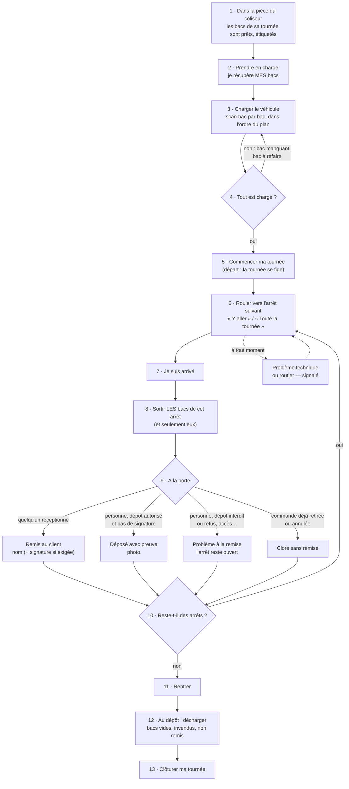

# Le parcours du livreur — de la pièce du coliseur au retour

> 🗒️ **Document de travail** (2026-10-01), pour réfléchir ensemble aux étapes
> qui composent le travail du livreur. Hugo : « en commençant par : il est dans
> la pièce du coliseur ».
>
> Chaque étape dit **ce qui existe déjà** dans l'application (✅), **ce qui est
> en cours** (🟡) et **ce qui n'existe pas** (❌), puis les **questions** à
> trancher. Rien ici n'est une décision tant qu'une question reste ouverte.

## Le parcours

## Le rôle « Livreur » (relevé dans le code le 2026-10-01)

| Droit               | Niveau | Ce qu'il ouvre                                                                                                   |
| ------------------- | ------ | ---------------------------------------------------------------------------------------------------------------- |
| `delivery_driving`  | read   | « Ma tournée » : ses tournées, fiches, avancement, version, plan et état du chargement, procédures de ses arrêts |
| `delivery_driving`  | write  | scanner / décharger un bac de sa tournée, « Commencer ma tournée »                                               |
| `delivery_doorstep` | read   | revoir la photo d'un signalement                                                                                 |
| `delivery_doorstep` | write  | « Je suis arrivé », signaler, clore sans remise, « Tournée terminée » (lot B : remis, déposé)                    |

Rien d'autre : ni `delivery_loading`, ni `delivery_rounds`, ni
`delivery_procedures`, ni `delivery_run_sheet`, ni `staff_notifications`.
Chaque route est en plus **murée sur SES tournées** (`driver_staff_id`) : le
droit ouvre la surface, le mur choisit les lignes. Les routes sont
`admin/livraison/ma-tournee/*` (`my-delivery-round`, `my-delivery-loading`
sous `delivery_driving` ; `my-delivery-doorstep` sous `delivery_doorstep`) ;
un GET demande `read`, un POST `write`.

Le rôle se crée **à l'écran** (`/admin/staff-roles`) avec ces deux droits en
écriture — une migration n'accorde jamais un droit à un rôle.

## Les étapes

### 1 · Dans la pièce du coliseur

🔑 `delivery_driving:read` — voir « Ma tournée », sa fiche, son avancement et sa version.

- ✅ Le coliseur a **déclaré les bacs** de chaque commande au poste de colisage
  (panneau « Bacs »), chacun avec son **étiquette QR** ; un demi-bac peut être
  partagé entre deux arrêts consécutifs.
- ✅ La tournée a été **composée** et un **livreur affecté** (Tournées).
- ✅ **Comment le livreur sait que c'est prêt** : il regarde « Ma tournée »
  (PL4, bâti le 2026-10-01) — « n arrêts prêts sur m » en tête, l'avancement
  et les bacs déclarés sur chaque arrêt, la page se met à jour d'elle-même.
- ⏸️ **Il est prévenu** (mis de côté le 2026-10-01) quand toute sa tournée est prête (Hugo, 2026-10-01) :
  lot PL5, voir [`plan-tournee-prete.md`](plan-tournee-prete.md).
- ✅ **Où sont rangés les bacs** : par tournée, puis par arrêt (Hugo,
  2026-10-01) — « Ma tournée » suit le même rangement.

### 2 · Prendre en charge

🔑 aucun — pas de geste (tranché : le scan au chargement suffit).

- ❌ Rien n'existe. Aujourd'hui, le livreur passe directement au chargement.
- ❓ **Faut-il un geste « je prends en charge »** (transfert de garde du
  coliseur au livreur) ? Utile si un bac disparaît entre la pièce et le
  véhicule : on saura qui l'avait.
- ❓ **Contrôle du froid** : le livreur vérifie-t-il que les bacs isothermes
  sont bien froids au moment de les prendre ?

### 3 · Charger le véhicule

🔑 `delivery_driving:read` pour le plan et l'état du chargement ; `delivery_driving:write` pour scanner et décharger un bac. Jamais `delivery_loading` (l'écran du dépôt, toutes tournées : admin seul).

- ✅ **Plan de chargement** de la tournée : l'ordre (le dernier arrêt au fond),
  les piles, le volume sec et froid.
- ✅ **Scan bac par bac** sur l'écran de chargement (droit `delivery_loading`).
- 🟡 Le livreur doit **charger sa tournée** lui-même (décidé), cloisonné à
  **sa** tournée — pas encore bâti : aujourd'hui l'écran de chargement voit
  toutes les tournées.
- 🟡 La **géométrie du plancher** (où poser chaque pile) : lot G5, pas bâti.
- ❓ Le scan se fait **depuis « Ma tournée »** (un bouton « Charger ») ou sur
  l'écran de chargement actuel ?

### 4 · Tout est chargé ?

🔑 `delivery_driving:read` — l'état du chargement le dit ; le refus vient au départ.

- ✅ « Commencer ma tournée » **refuse** tant qu'un bac n'est pas chargé ou
  qu'un demi-bac partagé est « à refaire », et nomme les arrêts en cause.
- ❓ **Partir sans un arrêt** : si un bac manque, le livreur peut-il retirer
  l'arrêt lui-même, ou doit-il appeler ? (Aujourd'hui : seul qui compose retire
  un arrêt.)

### 5 · Commencer ma tournée

🔑 `delivery_driving:write` — « Commencer ma tournée ».

- ✅ Le départ fige la tournée, l'ordre et le point GPS de chaque arrêt.
- 🟡 Le **code de retrait envoyé au client au départ** (lot 6, L6-C12) : pas
  bâti.
- ❓ Le client reçoit-il **« votre livraison est en route »** à ce moment ?

### 6 · Rouler

🔑 `delivery_driving:read` — liens « Y aller » / « Toute la tournée », et la procédure de SES arrêts (texte et photos) par sa route murée. Pas besoin de `delivery_procedures`, qui est le droit d'éditer côté staff.

- ✅ « Y aller » (Google Maps, Waze, Plans), « Toute la tournée » en tronçons de
  trois étapes.
- 🟡 Les arrêts livrés disparaissent des liens : dès que la remise clôt l'arrêt
  (lot B d'« À la porte »).

### 7 · Je suis arrivé

🔑 `delivery_doorstep:write` — « Je suis arrivé ».

- 🟡 Lot A d'« À la porte » : l'heure d'arrivée ; la position suivra (YA4).

### 8 · Sortir les bacs de cet arrêt

🔑 aucun — pas de geste (tranché : pas de scan à la sortie).

- ❌ Rien n'existe. Le plan de chargement sait quels bacs sont à quel arrêt.
- ❓ **Scanner les bacs à la sortie du véhicule** pour être sûr de laisser les
  bons (et tous) ? C'est la preuve que l'arrêt a reçu ses bacs — et le
  demi-bac partagé ne sort qu'au premier des deux arrêts.
- ❓ Les **bacs restent-ils chez le client** (consigne, échange plein/vide) ou
  le livreur vide-t-il les bacs sur place et les reprend ?

### 9 · À la porte

🔑 `delivery_doorstep:write` — signaler un problème, clore sans remise ; lot B : « Remis au client », « Déposé avec preuve ». `delivery_doorstep:read` pour revoir la photo d'un signalement.

- 🟡 Lot A : « Déclarer un problème », « Clore sans remise ».
- 🟡 Lot B : « Remis au client » (nom, signature si exigée), « Déposé avec
  preuve » (photo, seulement si autorisé et sans signature exigée).
- ❓ La **procédure** de l'adresse (étapes, photos) : affichée avant d'arriver
  (en roulant) ou à l'arrivée ?

### 10 · Reste-t-il des arrêts ?

🔑 `delivery_driving:read`.

- ✅ La page montre les arrêts restants dans l'ordre.
- ❓ **Changer l'ordre en route** (un client absent qu'on repasse voir plus
  tard) : permis au livreur, ou jamais ?

### 11 · Rentrer

🔑 `delivery_driving:read` — le lien « Rentrer ».

- ✅ « Rentrer » mène au point de départ quand il ne reste rien.
- ❓ Un arrêt resté ouvert (problème) : le livreur **rapporte** la marchandise.
  Comment le dépôt le sait-il ?

### 12 · Au dépôt : décharger

🔑 aucun geste propre : « Tournée terminée » (13) signifie le retour des bacs.

- ❌ Rien n'existe : ni **retour des bacs vides**, ni **marchandise rapportée**
  (non remise), ni **invendus**.
- ❓ **Scanner les bacs au retour** (ceux qui reviennent vides, ceux qui
  reviennent pleins) ? C'est ce qui permettrait un jour le **parc de bacs**
  (combien on en a, où ils sont).

### 13 · Clôturer ma tournée

🔑 `delivery_doorstep:write` — « Tournée terminée ».

- ❌ Une tournée n'a **aucun état « rentrée »** : elle part, et c'est tout.
- ❓ Faut-il un geste « **Tournée terminée** » (heure de retour, kilométrage,
  remarques) ? Il fermerait la mesure du temps (départ → retour) et la liste
  des « Non remis » du jour.

## Ce qu'on mesure tout du long

| Instant                   | Étape | Existe         |
| ------------------------- | ----- | -------------- |
| prise en charge           | 2     | ❌             |
| départ                    | 5     | ✅             |
| arrivée sur chaque arrêt  | 7     | 🟡 lot A       |
| remise / dépôt / problème | 9     | 🟡 lots A et B |
| retour au dépôt           | 12-13 | ❌             |

Avec ces instants : temps de chargement, temps de trajet par arrêt, temps sur
place, temps de tournée complet — de quoi régler la durée de livraison du
calculateur sur la réalité.

## Tranché par Hugo le 2026-10-01

| Étape                             | Décision                                                                                                                                                                                        |
| --------------------------------- | ----------------------------------------------------------------------------------------------------------------------------------------------------------------------------------------------- |
| **8 · Sortir les bacs**           | **Les bacs repartent avec le livreur** : la marchandise est laissée chez le client, le bac revient. **Pas de scan** à la sortie du véhicule.                                                    |
| **10 · Changer l'ordre en route** | **En attente.**                                                                                                                                                                                 |
| **12-13 · Retour et clôture**     | Un geste **« Tournée terminée »** : il **signifie le retour des bacs vides** (et ferme la mesure du temps de tournée). **Pas de scan** des bacs au retour — « un peu excessif pour le moment ». |
| **Bacs abîmés ou perdus**         | **Mis de côté** : on part du principe que **rien ne s'abîme et rien ne se perd**. Plus tard, le **logisticien** devra pouvoir dire « bac abîmé », etc. (la piste du parc de bacs).              |

Conséquence pour le modèle : un bac déclaré est un objet **de la commande le
temps d'une tournée** ; « Tournée terminée » le rend disponible, sans qu'on
suive son état. La tournée gagne un état **rentrée** (instant de retour,
auteur), que « Non remis » peut lire.

Questions encore ouvertes : la prise en charge (2), où le livreur scanne au
chargement (3), « votre livraison est en route » au départ (5), la procédure
affichée en roulant ou à l'arrivée (9), changer l'ordre (10).

**Suite, tranché par Hugo le 2026-10-01 :**

| Étape                      | Décision                                            | Ce que ça demande                                                                                                                                                                                                                                                          |
| -------------------------- | --------------------------------------------------- | -------------------------------------------------------------------------------------------------------------------------------------------------------------------------------------------------------------------------------------------------------------------------- |
| **2 · Prise en charge**    | **Non** — le scan au chargement suffit              | rien                                                                                                                                                                                                                                                                       |
| **3 · Charger**            | **Oui, dans « Ma tournée »**                        | un bouton « Charger » qui ouvre le scan et le plan de chargement de **sa** tournée, murés comme le reste (droit du livreur) ; l'écran de chargement actuel reste celui de l'admin                                                                                          |
| **5 · Prévenir le client** | **Oui, « votre livraison est en route » au départ** | le départ publie un fait par le canal du commerce ; le **commerce** envoie le courriel (L6-C12 : un message au client vit au commerce). ⚠️ Le contact de livraison n'a pas d'e-mail (L6-C13) : le message part au **compte qui a commandé** tant que ce champ n'existe pas |
| **9 · La procédure**       | **En roulant**                                      | déjà le cas : la carte de chaque arrêt la porte, dépliable, dès la liste (lot MT4)                                                                                                                                                                                         |

### Les lots qui en sortent

> 🟡 **PL1 et PL4 : partie serveur bâtie le 2026-10-01** (non commitée à
> l'écriture) — routes `admin/livraison/ma-tournee/:roundId/chargement…`
> (PL1), fiche et avancement dans `MyDeliveryStopView`, route
> `ma-tournee/version`, trois déclencheurs sur `delivery_bin`
> (`20261001150000_le_bac_fait_bouger_la_journee`) (PL4). **Écran bâti le
> 2026-10-01** (non commité à l'écriture) : compteur, avancement et fiche sur
> « Ma tournée », veilleur de version `my-round`, « Charger » qui ouvre le
> corps de l'écran de chargement (`LoadingRound`) par la porte du livreur
> (`LoadingGateway` → `MyDeliveryLoadingService`).

| Lot                                     | Contenu                                                                                               |
| --------------------------------------- | ----------------------------------------------------------------------------------------------------- |
| **PL1 — Charger depuis « Ma tournée »** | scan et plan de chargement de **sa** tournée, sous le droit du livreur, avec le mur `driver_staff_id` |
| **PL2 — « Tournée terminée »**          | un état **rentrée** de la tournée (instant, auteur) ; « Non remis » le lit ; les bacs sont libérés    |
| **PL3 — « En route »**                  | le courriel au client au départ, envoyé par le commerce                                               |

## Étape 1 revue — « Ma tournée » suit le colisage (Hugo, 2026-10-01)

> « Ma tournée doit s'actualiser en fonction de l'avancement du coliseur » ;
> « organisé par tournée, par arrêt, fiche en évidence » ; « le bon de commande
> atelier contient déjà tout ça, peut-être qu'un seul document suffit » —
> réponse **(a)**.

**Lot PL4** :

- **Une seule fiche** : sur chaque arrêt, le contenu de la **feuille d'atelier**
  (client, produits et quantités, froid — sans montant, comme le papier qui
  voyage dans le bac), lu par le **port du commerce** (les lignes de la
  commande, `DeliveryOrderLinesReader`) — **pas** de PDF, **pas** de port vers
  le fournil (la case `delivery → production` reste fermée).
- **L'avancement du colisage** par arrêt : « en préparation », « n bacs sur m
  déclarés », « prête » — l'état « prête » vient du commerce (la commande
  `ready`, qu'il apprend du fournil par événement), les bacs viennent de la
  livraison.
- **Par tournée puis par arrêt**, un compteur en tête (« 4 arrêts prêts sur 6 »).
- **Rafraîchissement** : une **version de « ma tournée »** côté serveur, qui
  bouge quand la livraison bouge **ou** quand le commerce bouge (par son port) ;
  la déclaration d'un bac fait désormais bouger le journal de la livraison
  (aujourd'hui, un bac n'a pas de jour : seul son chargement en a un). L'écran
  interroge cette version et ne relit que si elle a changé, comme les postes
  du fournil.

## Note — « Tournée terminée » exige un sort pour chaque arrêt (Hugo, 2026-10-01)

> 📌 **Décidé, pas bâti.** « On ne peut pas faire tournée terminée si [ni]
> une livraison effectuée, [ni] une décision actée » pour chaque point de la
> tournée.

« Tournée terminée » (PL2) **refuse** tant qu'un arrêt n'a ni :

- **une livraison effectuée** — remis au client ou déposé avec preuve (lot B) ;
- **une décision actée** — clos sans remise, ou la décision d'un commercial
  (dépôt autorisé une fois, ou « Rapporter ») sur un problème à la remise
  (lot B).

Un arrêt seulement **signalé** ne suffit pas. Le refus nomme les arrêts en
cause, comme « Commencer ma tournée ». Aujourd'hui (lot A), « Tournée terminée »
ne vérifie pas cette condition : elle se bâtit avec le lot B, qui crée la
remise et la décision du commercial.
