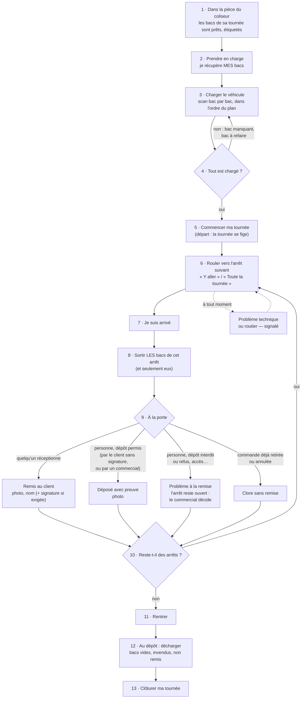

# Le parcours du livreur — de la pièce du coliseur au retour

> 🗒️ **Document de travail** (2026-10-01), pour réfléchir ensemble aux étapes
> qui composent le travail du livreur. Hugo : « en commençant par : il est dans
> la pièce du coliseur ».
>
> 📜 **Statuts relus contre le code le 2026-10-07** (audit du dossier
> `livraisons/` du même jour). Sur treize étapes, **dix sont bâties**, **deux
> sont absentes par décision** (2, 8) et **une est partielle** : décharger au
> dépôt (12) n'a aucun geste propre. Deux questions restent ouvertes :
> **réordonner en route** (10), « en attente » depuis le 2026-10-01, et le
> **contrôle du froid** à la prise en charge (2), qui n'a jamais reçu de
> réponse. Les décisions du 2026-10-01, plus bas, sont gardées telles qu'elles
> ont été prises ; ce qui a changé depuis y est annoté et daté.
>
> Chaque étape dit ce qui est **bâti** (✅), **partiel** (🟡), **absent** (❌ —
> « par décision » quand c'est tranché), **mis de côté** (⏸️), et les
> **questions** encore ouvertes (❓).

## Le parcours

## Le rôle « Livreur » (relevé dans le code le 2026-10-01, relu le 2026-10-07)

| Droit               | Niveau | Ce qu'il ouvre                                                                                                                                           |
| ------------------- | ------ | -------------------------------------------------------------------------------------------------------------------------------------------------------- |
| `delivery_driving`  | read   | « Ma tournée » : ses tournées, fiches, avancement, version, plan et état du chargement, procédures de ses arrêts ; « Mes données » (texte d'information) |
| `delivery_driving`  | write  | scanner / décharger un bac de sa tournée, « Commencer ma tournée », « J'ai compris » (l'accusé du texte d'information)                                   |
| `delivery_doorstep` | read   | revoir la photo d'un signalement                                                                                                                         |
| `delivery_doorstep` | write  | « Je suis arrivé », « Remis au client », « Déposé avec preuve », signaler, clore sans remise, « Tournée terminée »                                       |

Rien d'autre : ni `delivery_loading`, ni `delivery_rounds`, ni
`delivery_procedures`, ni `delivery_run_sheet`, ni `staff_notifications`.
Chaque route d'une tournée est en plus **murée sur SES tournées**
(`driver_staff_id`) : le droit ouvre la surface, le mur choisit les lignes. Les
routes sont `admin/livraison/ma-tournee/*` (`my-delivery-round`,
`my-delivery-loading` sous `delivery_driving` ; `my-delivery-doorstep` sous
`delivery_doorstep`) et `admin/livraison/mes-donnees` (`my-driver-notice`, sous
`delivery_driving`) ; un GET demande `read`, un POST `write`.

**Une exception au mur, voulue** : `GET ma-tournee/version` rend un numéro de
journée, toutes tournées confondues, sans livreur ni tournée
(`get-my-round-version.handler.ts`) ; la page relit ensuite sous son mur. Qu'un
livreur lise ainsi le rythme d'activité de la journée est une question ouverte
à Hugo (Q6 de l'audit du 2026-10-07).

Le rôle se crée **à l'écran des rôles** (`/admin/roles`) avec ces deux droits
en écriture — une migration n'accorde jamais un droit à un rôle. Depuis le
2026-10-07 (audit, B8), **l'affectation exige les deux droits** (`DriverAccess`,
`driverAccessNow` dans `delivery-driver-support.ts`) : une fiche qui conduit
sans `delivery_doorstep` n'est pas proposée, et l'affecter est refusé par un
409 qui nomme le droit manquant — avant, elle s'affectait, partait, puis ne
pouvait ni remettre ni clore un seul arrêt. Reste : un livreur affecté qui
PERD les gestes à la porte peut encore partir (la route de départ est sous
`delivery_driving`) ; l'écran Tournées le dit « sans accès », rien ne bloque.

## Les étapes

### 1 · Dans la pièce du coliseur

🔑 `delivery_driving:read` — voir « Ma tournée », sa fiche, son avancement et sa version.

🖥️ **Écran** « Ma tournée » (`/coursier` depuis le 2026-10-03 ; l'ancienne adresse `/livraison/ma-tournee` y redirige) — ✅ bâti : liste de ses tournées, compteur « n arrêts prêts sur m », avancement et fiche sur chaque arrêt, mise à jour d'elle-même. Aucun bouton à cette étape.

- ✅ Le coliseur a **déclaré les bacs** de chaque commande au poste de colisage
  (panneau « Contenants »), chacun avec son **étiquette QR** ; un demi-bac peut
  être partagé entre deux arrêts consécutifs.
- ✅ La tournée a été **composée** et un **livreur affecté** (Tournées).
- ✅ **Comment le livreur sait que c'est prêt** : il regarde « Ma tournée »
  (PL4, bâti le 2026-10-01) — « n arrêts prêts sur m » en tête, l'avancement
  et les bacs déclarés sur chaque arrêt, la page se met à jour d'elle-même.
- ⏸️ **Il est prévenu** (mis de côté le 2026-10-01) quand toute sa tournée est prête (Hugo, 2026-10-01) :
  lot PL5, voir [`plan-tournee-prete.md`](plan-tournee-prete.md). Rien n'en
  est bâti (relu le 2026-10-07).
- ✅ **Où sont rangés les bacs** : par tournée, puis par arrêt (Hugo,
  2026-10-01) — « Ma tournée » suit le même rangement.

### 2 · Prendre en charge

🔑 aucun — pas de geste (tranché : le scan au chargement suffit).

🖥️ Ni écran ni bouton.

- ❌ **Absente par décision** (Hugo, 2026-10-01 : « Non — le scan au
  chargement suffit ») : le livreur passe directement au chargement, et c'est
  le scan qui dit qui a chargé quel bac (`delivery_bin_load.loaded_by`).
- ❓ **Contrôle du froid** : le livreur vérifie-t-il que les bacs isothermes
  sont bien froids au moment de les prendre ? _Jamais tranché (relu le
  2026-10-07) : la décision du 2026-10-01 porte sur le geste de prise en
  charge, pas sur le froid._

### 3 · Charger le véhicule

🔑 `delivery_driving:read` pour le plan et l'état du chargement ; `delivery_driving:write` pour scanner et décharger un bac. Jamais `delivery_loading` (l'écran du dépôt, toutes tournées : admin et comptoir dans la graine `ROLE_GRANTS`).

🖥️ **Bouton** « Charger » sur la tournée encore au dépôt → page `/coursier/:roundId/chargement`, le même corps que l'écran du dépôt (`LoadingRound`) par la porte du livreur : plan (plancher vu de dessus, piles), scan à la caméra ou « Code du bac », « Décharger » par bac — ✅ bâti.

- ✅ **Plan de chargement** de la tournée : l'ordre (le dernier arrêt au fond),
  les piles, le volume sec et froid.
- ✅ **Scan bac par bac** sur l'écran de chargement du dépôt (droit
  `delivery_loading`).
- ✅ Le livreur **charge sa tournée** lui-même, cloisonné à **sa** tournée —
  bâti (relevé le 2026-10-01, `my-delivery-loading.controller.ts`, PL1) ;
  l'écran de chargement du staff, lui, voit toutes les tournées.
- ✅ La **géométrie du plancher** (où poser chaque pile) : G5, bâti le
  2026-10-02 (`19fece6b1`) ; une pile qui ne trouve pas de place au sol lève
  l'alerte `floor_over` (`loading-warnings.ts`).
- ✅ **Où le livreur scanne** : dans « Ma tournée » (tranché le 2026-10-01,
  bâti par PL1).

### 4 · Tout est chargé ?

🔑 `delivery_driving:read` — l'état du chargement le dit ; le refus vient au départ.

🖥️ Pas de bouton : la vue de chargement montre « Ce qui manque » (ou « Tout est chargé ») — ✅ bâti.

- ✅ « Commencer ma tournée » **refuse** tant qu'un bac n'est pas chargé ou
  qu'un demi-bac partagé est « à refaire », et nomme les arrêts en cause :
  « Vous ne pouvez pas partir : 2 arrêts ne sont pas chargés (Refuge 1950
  (CMD-…), Brasserie des Marmottes (CMD-…)) — appelez le dépôt. »
  (`delivery-driver-errors.ts`).
- ✅ **Partir sans un arrêt** : le livreur ne retire pas d'arrêt — seul qui
  compose le fait — et le refus lui dit d'appeler le dépôt (bâti ainsi, plan
  « Ma tournée », MT-D3 v2).

### 5 · Commencer ma tournée

🔑 `delivery_driving:write` — « Commencer ma tournée ».

🖥️ **Bouton** « Commencer ma tournée » — ✅ bâti ; il refuse en nommant les arrêts en cause. Tant que le livreur n'a pas accusé la version courante de son texte d'information, l'écran l'ouvre d'abord (`driver-notice-gate.ts`, 2026-10-06) ; le serveur, lui, ne l'exige pas.

- ✅ Le départ fige la tournée, l'ordre et le point GPS de chaque arrêt, et
  la décision réglée d'avance à la porte (B3 bis) ; il refuse une commande
  retenue au contrôle qualité (BQ).
- ✅ **« Votre livraison est en route »** (tranché le 2026-10-01, PL3) : le
  départ écrit le fait durable `delivery.round_departed` dans sa transaction
  (`departAndFreeze`), et le commerce envoie un courriel par commande
  (`mail-delivery-en-route.handler.ts`) — voir [`en-route.md`](en-route.md).
  Le même fait fait passer la garde au livreur ([`a-la-porte.md`](a-la-porte.md) § 5).
- ❌ Le **code de retrait envoyé au client au départ** (lot 6, L6-C12) : non
  bâti, tranché ([`a-la-porte.md`](a-la-porte.md) § 10).

### 6 · Rouler

🔑 `delivery_driving:read` — liens « Y aller » / « Toute la tournée », et la procédure de SES arrêts (texte et photos) par sa route murée. Pas besoin de `delivery_procedures`, qui est le droit d'éditer côté staff.

🖥️ **Boutons**, une fois partie : « Y aller » sur chaque arrêt restant (Google Maps, Waze, Plans) et « Toute la tournée » (tronçons) — ✅ bâtis. Procédure dépliable sur la carte de l'arrêt. « Déclarer un problème » de la tournée (technique ou routier), en route — ✅ bâti.

- ✅ « Y aller » vise le **stationnement** du carnet quand il est connu, sinon
  la porte (point GPS), sinon l'adresse (`driveTargetOf`) ; « Toute la
  tournée » en tronçons de trois étapes et une destination.
- ✅ Les arrêts clos disparaissent des liens (`remainingStops`,
  `my-round-navigation.ts:53`) : une remise, un dépôt, une clôture sans remise
  ou un « Rapporter » clôt l'arrêt. YA3, éprouvé de bout en bout le 2026-10-06
  (`delivery-gesture-position.e2e-spec.ts`, `my-round-page.spec.ts`).

### 7 · Je suis arrivé

🔑 `delivery_doorstep:write` — « Je suis arrivé ».

🖥️ **Bouton** « Je suis arrivé » sur l'arrêt suivant seulement — ✅ bâti. Facultatif : remettre sans l'avoir déclaré est permis.

- ✅ Lot A d'« À la porte » (2026-10-01) : l'heure d'arrivée
  (`delivery_stop_execution.arrived_at`), écrite une seule fois.
- ✅ La position du téléphone, quand il la donne, écrite avec l'arrivée (YA4,
  bâti le 2026-10-06 : `declare-stop-arrival.handler.ts`,
  `prisma-doorstep-stop.repository.ts`).

### 8 · Sortir les bacs de cet arrêt

🔑 aucun — pas de geste (tranché : pas de scan à la sortie).

🖥️ Ni écran ni bouton.

- ❌ **Absente par décision** (Hugo, 2026-10-01) : les bacs **repartent avec
  le livreur** — la marchandise est laissée chez le client, le bac revient —
  et **pas de scan** à la sortie du véhicule. Le plan de chargement sait quels
  bacs sont à quel arrêt.

### 9 · À la porte

🔑 `delivery_doorstep:write` — « Remis au client », « Déposé avec preuve », signaler un problème, clore sans remise. `delivery_doorstep:read` pour revoir la photo d'un signalement.

🖥️ **Boutons** sur l'arrêt — ✅ bâtis : « Remis au client » (photo et nom, signature si exigée), « Déposé avec preuve » (photo, quand le dépôt est permis), « Déclarer un problème » (formulaire avec photo), « Clore sans remise » (avec confirmation, quand la commande est déjà retirée ou annulée).

- ✅ Lot A (2026-10-01) : « Déclarer un problème », « Clore sans remise ».
- ✅ Lot B (2026-10-01) : « Remis au client » (B1), « Déposé avec preuve »
  (B2), la décision du commercial (B3) et la décision réglée d'avance (B3 bis).
- ✅ **Le dépôt est permis** quand un commercial l'a autorisé pour cet arrêt,
  **ou** quand le client l'autorise à l'adresse et qu'aucune signature n'est
  exigée : `depositAuthorized || (depositAllowed && !signatureRequired)`
  (`deposit-rule.ts:23`). L'autorisation du commercial l'emporte sur la
  signature (LB-Q5).
- ✅ **Un problème à la remise** (personne, refus, accès impossible) laisse
  l'arrêt ouvert : le commercial décide — « Autoriser le dépôt » rend le dépôt
  possible, « Rapporter » clôt l'arrêt —, ou la décision réglée d'avance
  s'applique ([`a-la-porte.md`](a-la-porte.md) § 4).
- ✅ La **procédure** de l'adresse : en roulant (tranché le 2026-10-01) — la
  carte de chaque arrêt la porte, dépliable, dès la liste.

### 10 · Reste-t-il des arrêts ?

🔑 `delivery_driving:read`.

🖥️ Pas de bouton : la liste des arrêts restants — ✅.

- ✅ Une fois partie, la page ne montre que les arrêts **restants**, dans
  l'ordre de passage figé au départ.
- ❓ **Changer l'ordre en route** (un client absent qu'on repasse voir plus
  tard) : **en attente** (Hugo, 2026-10-01). Aujourd'hui personne ne
  réordonne une tournée partie (I6, `DeliveryRound.reorder`).

### 11 · Rentrer

🔑 `delivery_driving:read` — le lien « Rentrer ».

🖥️ **Bouton** « Rentrer » quand il ne reste plus d'arrêt — ✅ bâti.

- ✅ « Rentrer » mène au point de départ des tournées quand il ne reste rien.
- ✅ **Un arrêt resté ouvert** (problème) : le commercial décide (9).
  « Rapporter » clôt l'arrêt et écrit le fait durable
  `delivery.orders_brought_back`, que le retrait enregistre ; tant qu'un arrêt
  est ouvert, « Tournée terminée » est refusé au livreur (13).

### 12 · Au dépôt : décharger

🔑 aucun geste propre : « Tournée terminée » (13) signifie le retour des bacs.

🖥️ Ni écran ni bouton pour le livreur (« Tournée terminée » en tient lieu) ; « Non remis » est un écran du staff (`/livraison/non-remis`, sous `delivery_rounds:read`).

- 🟡 **Partielle** (relu le 2026-10-07) :
  - ✅ **marchandise rapportée** : « Rapporter » (commercial, ou réglage
    d'avance) écrit `delivery.orders_brought_back` ; « Non remis » liste les
    arrêts sans sort des tournées rentrées, et ceux des tournées parties un
    jour antérieur sans jamais rentrer ;
  - ✅ **retour des bacs vides** : signifié par « Tournée terminée » (tranché
    le 2026-10-01), sans suivi — le retour n'écrit que la tournée
    (`returned_at` et son auteur), aucun état de bac ne change ;
  - ❌ **invendus** : rien ;
  - ❌ **scan des bacs au retour** : absent par décision (2026-10-01, « un peu
    excessif pour le moment »). C'est lui qui permettrait un jour le **parc de
    bacs** (combien on en a, où ils sont), mis de côté.

### 13 · Clôturer ma tournée

🔑 `delivery_doorstep:write` — « Tournée terminée ».

🖥️ **Bouton** « Tournée terminée » — ✅ bâti : il écrit l'état « rentrée » (`returned_at`, `returned_by`, `returned_by_name`) et ferme la mesure du temps de tournée. Il est **refusé** (409) tant qu'un arrêt n'a pas de sort — B4, `DeliveryRound.finish` (`delivery-round.ts:493-503`) — et la page nomme d'avance les arrêts qui restent. Les « Non remis » sont un écran du **staff**, pas du livreur.

- ✅ Le geste « **Tournée terminée** » existe : tranché et bâti le 2026-10-01
  (PL2), un sort exigé par arrêt depuis le 2026-10-02 (B4). Ni kilométrage ni
  remarques : la décision du 2026-10-01 ne les retient pas, et rien ne les
  écrit.
- ✅ La **rentrée par le staff** (Tournées, `delivery_rounds`) reste permise
  sans cette règle : c'est la sortie d'un livreur bloqué, et ses arrêts sans
  sort passent dans « Non remis ».

## Ce qu'on mesure tout du long

| Instant                   | Étape | Existe (relu le 2026-10-07)                                                            |
| ------------------------- | ----- | -------------------------------------------------------------------------------------- |
| prise en charge           | 2     | ❌ par décision                                                                        |
| chargement de chaque bac  | 3     | ✅ `delivery_bin_load.loaded_at`                                                       |
| départ                    | 5     | ✅ `delivery_round.departed_at`                                                        |
| arrivée sur chaque arrêt  | 7     | ✅ `delivery_stop_execution.arrived_at`, avec la position (YA4)                        |
| remise / dépôt / problème | 9     | ✅ `delivery_round_stop.closed_at`, avec la position ; `delivery_incident.reported_at` |
| retour au dépôt           | 12-13 | ✅ `delivery_round.returned_at`                                                        |

Avec ces instants : temps de chargement, temps de trajet par arrêt, temps sur
place, temps de tournée complet — de quoi régler la durée de livraison du
calculateur sur la réalité. Ils s'accumulent ; aucun écran ne les exploite
encore ([`a-la-porte.md`](a-la-porte.md) § 2).

## Tranché par Hugo le 2026-10-01

| Étape                             | Décision                                                                                                                                                                                        |
| --------------------------------- | ----------------------------------------------------------------------------------------------------------------------------------------------------------------------------------------------- |
| **8 · Sortir les bacs**           | **Les bacs repartent avec le livreur** : la marchandise est laissée chez le client, le bac revient. **Pas de scan** à la sortie du véhicule.                                                    |
| **10 · Changer l'ordre en route** | **En attente.**                                                                                                                                                                                 |
| **12-13 · Retour et clôture**     | Un geste **« Tournée terminée »** : il **signifie le retour des bacs vides** (et ferme la mesure du temps de tournée). **Pas de scan** des bacs au retour — « un peu excessif pour le moment ». |
| **Bacs abîmés ou perdus**         | **Mis de côté** : on part du principe que **rien ne s'abîme et rien ne se perd**. Plus tard, le **logisticien** devra pouvoir dire « bac abîmé », etc. (la piste du parc de bacs).              |

Conséquence pour le modèle : un bac déclaré est un objet **de la commande le
temps d'une tournée** ; « Tournée terminée » le rend disponible, sans qu'on
suive son état. La tournée gagne un état **rentrée** (instant de retour,
auteur), que « Non remis » peut lire.

_Relu le 2026-10-07 : l'état rentrée existe (`returned_at`, `returned_by`,
`returned_by_name`) et « Non remis » le lit. Rien ne « rend disponible » un
bac : le retour n'écrit que la tournée, et aucun état de bac ne bouge._

Questions encore ouvertes : la prise en charge (2), où le livreur scanne au
chargement (3), « votre livraison est en route » au départ (5), la procédure
affichée en roulant ou à l'arrivée (9), changer l'ordre (10).

_Relu le 2026-10-07 : 2, 3, 5 et 9 sont tranchées juste en dessous, et
bâties ; seule 10 reste ouverte (« en attente »). Le contrôle du froid de
l'étape 2 n'est pas tranché non plus._

**Suite, tranché par Hugo le 2026-10-01 :**

| Étape                      | Décision                                            | Ce que ça demande                                                                                                                                                                                                                                                          |
| -------------------------- | --------------------------------------------------- | -------------------------------------------------------------------------------------------------------------------------------------------------------------------------------------------------------------------------------------------------------------------------- |
| **2 · Prise en charge**    | **Non** — le scan au chargement suffit              | rien                                                                                                                                                                                                                                                                       |
| **3 · Charger**            | **Oui, dans « Ma tournée »**                        | un bouton « Charger » qui ouvre le scan et le plan de chargement de **sa** tournée, murés comme le reste (droit du livreur) ; l'écran de chargement actuel reste celui de l'admin                                                                                          |
| **5 · Prévenir le client** | **Oui, « votre livraison est en route » au départ** | le départ publie un fait par le canal du commerce ; le **commerce** envoie le courriel (L6-C12 : un message au client vit au commerce). ⚠️ Le contact de livraison n'a pas d'e-mail (L6-C13) : le message part au **compte qui a commandé** tant que ce champ n'existe pas |
| **9 · La procédure**       | **En roulant**                                      | déjà le cas : la carte de chaque arrêt la porte, dépliable, dès la liste (lot MT4)                                                                                                                                                                                         |

### Les lots qui en sortent

> ✅ **PL1 et PL4 bâtis le 2026-10-01** — serveur (`06522cdac`) : routes
> `admin/livraison/ma-tournee/:roundId/chargement…` (PL1), fiche et
> avancement dans `MyDeliveryStopView`, route `ma-tournee/version`, trois
> déclencheurs sur `delivery_bin`
> (`20261001150000_le_bac_fait_bouger_la_journee`) (PL4) ; écran
> (`7a96fba28`) : compteur, avancement et fiche sur « Ma tournée », veilleur
> de version `my-round`, « Charger » qui ouvre le corps de l'écran de
> chargement (`LoadingRound`) par la porte du livreur (`LoadingGateway` →
> `MyDeliveryLoadingService`).

La table dit aussi où en sont les lots d'autres plans dont le parcours
dépend (relu le 2026-10-07) :

| Lot                                             | Contenu                                                                                               | État                                                                                                                                                           |
| ----------------------------------------------- | ----------------------------------------------------------------------------------------------------- | -------------------------------------------------------------------------------------------------------------------------------------------------------------- |
| **PL1 — Charger depuis « Ma tournée »**         | scan et plan de chargement de **sa** tournée, sous le droit du livreur, avec le mur `driver_staff_id` | ✅ bâti le 2026-10-01 (`06522cdac`, `7a96fba28`)                                                                                                               |
| **PL2 — « Tournée terminée »**                  | un état **rentrée** de la tournée (instant, auteur) ; « Non remis » le lit ; les bacs sont libérés    | ✅ bâti le 2026-10-01 (`5ebc47e6f`, écran `a93bb3a88`) ; un sort exigé par arrêt depuis le 2026-10-02 (B4, `2bd02b143`). Aucun état de bac ne change au retour |
| **PL3 — « En route »**                          | le courriel au client au départ, envoyé par le commerce                                               | ✅ bâti le 2026-10-01 (`2932bb364`) ; fait durable depuis le 2026-10-06 (DD1, `375f82225`) — [`en-route.md`](en-route.md)                                      |
| **PL4 — « Ma tournée » suit le colisage**       | une seule fiche, l'avancement du colisage, une version de « ma tournée » (§ « Étape 1 revue »)        | ✅ bâti le 2026-10-01 (`06522cdac`, `7a96fba28`)                                                                                                               |
| **PL5 — Le livreur est prévenu**                | [`plan-tournee-prete.md`](plan-tournee-prete.md)                                                      | ⏸️ mis de côté le 2026-10-01 ; rien n'est bâti                                                                                                                 |
| **G5 — La géométrie du plancher** (3)           | où poser chaque pile — [`plan-geometrie-du-plancher.md`](plan-geometrie-du-plancher.md)               | ✅ bâti le 2026-10-02 (`19fece6b1`)                                                                                                                            |
| **YA3 — Les arrêts clos sortent des liens** (6) | [`gps-y-aller-et-position.md`](gps-y-aller-et-position.md) § 1                                        | ✅ bâti, éprouvé de bout en bout le 2026-10-06 (`16d367e3a`)                                                                                                   |
| **YA4 — La position au geste** (7, 9)           | [`gps-y-aller-et-position.md`](gps-y-aller-et-position.md) § 2                                        | ✅ bâti le 2026-10-06 (`16d367e3a`) ; reste l'écart arrêt par arrêt ([`gps-y-aller-et-position.md`](gps-y-aller-et-position.md) § 7)                           |

## Étape 1 revue — « Ma tournée » suit le colisage (Hugo, 2026-10-01)

> « Ma tournée doit s'actualiser en fonction de l'avancement du coliseur » ;
> « organisé par tournée, par arrêt, fiche en évidence » ; « le bon de commande
> atelier contient déjà tout ça, peut-être qu'un seul document suffit » —
> réponse **(a)**.

**Lot PL4** :

- **Une seule fiche** : sur chaque arrêt, le contenu de la **feuille d'atelier**
  (client, produits et quantités, froid — sans montant, comme le papier qui
  voyage dans le bac), lu par le **port du commerce** (les lignes de la
  commande, `DeliveryOrderLinesReader`) — **pas** de PDF, **pas** de port vers
  le fournil (la case `delivery → production` reste fermée).
  _Relu le 2026-10-07 : la fiche ne lit toujours pas le fournil
  (`stop-sheets.ts`). Mais la case `delivery → production` n'est plus fermée :
  depuis le 2026-10-04, la livraison écoute la clôture du fournil par le canal
  `production/channels/delivery/` (`learn-arrested-plan.handler.ts`)._
- **L'avancement du colisage** par arrêt : « en préparation », « n bacs sur m
  déclarés », « prête » — l'état « prête » vient du commerce (la commande
  `ready`, qu'il apprend du fournil par événement), les bacs viennent de la
  livraison.
- **Par tournée puis par arrêt**, un compteur en tête (« 4 arrêts prêts sur 6 »).
- **Rafraîchissement** : une **version de « ma tournée »** côté serveur, qui
  bouge quand la livraison bouge **ou** quand le commerce bouge (par son port) ;
  la déclaration d'un bac fait désormais bouger le journal de la livraison
  (aujourd'hui, un bac n'a pas de jour : seul son chargement en a un). L'écran
  interroge cette version et ne relit que si elle a changé, comme les postes
  du fournil.

## Note — « Tournée terminée » exige un sort pour chaque arrêt (Hugo, 2026-10-01)

> 🔨 **Bâti le 2026-10-02** (`2bd02b143`, B4 — [`a-la-porte.md`](a-la-porte.md)
> § 1) : le livreur est refusé (409 nommé) ; la rentrée staff reste permise, et
> ses arrêts sans sort passent dans « Non remis ».
>
> 📌 **Décidé par Hugo.** « On ne peut pas faire tournée terminée si [ni]
> une livraison effectuée, [ni] une décision actée » pour chaque point de la
> tournée.

« Tournée terminée » (PL2) **refuse** tant qu'un arrêt n'a ni :

- **une livraison effectuée** — remis au client ou déposé avec preuve (lot B) ;
- **une décision actée** — clos sans remise, ou « Rapporter » décidé par un
  commercial (ou réglé d'avance) sur un problème à la remise (lot B).

Un arrêt seulement **signalé** ne suffit pas. Le refus nomme les arrêts en
cause, comme « Commencer ma tournée ».

⚠️ _Relu le 2026-10-07 : la première version de cette liste comptait « dépôt
autorisé une fois » parmi les décisions actées ; le code est plus strict._
« Autoriser le dépôt » n'est pas une décision qui clôt. Il rend le dépôt
possible, et l'arrêt reste ouvert jusqu'à ce que le livreur dépose
(`authorize-stop-deposit.handler.ts` n'écrit pas la tournée ;
`stop-decision-by-setting.ts` ne clôt que sur « Rapporter »). Seuls la remise,
le dépôt, la clôture sans remise et « Rapporter » clôturent, et `finish`
refuse tant qu'un arrêt est ouvert.
