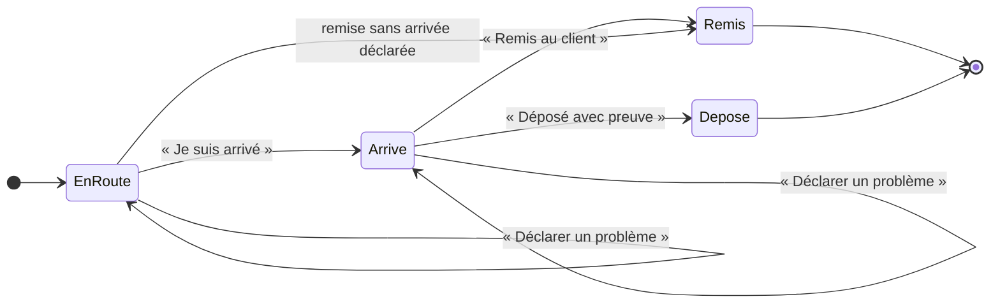

# À la porte — arriver, remettre ou déposer, signaler un problème

> 📐 **Plan, rien n'est bâti** (2026-10-01). Hugo : « sur la carte d'une
> livraison, signaler si aucune personne n'est là pour réceptionner — le client
> a explicitement notifié sans signature — donc le bouton remise doit être soit
> “remise au client” soit “déposer avec preuve” ; il faut un bouton “je suis
> arrivé”, j'ai besoin d'accumuler de la donnée sur combien de temps on met à
> livrer ; ensuite déclarer un problème : problème à la remise, problème
> technique, problème routier ».
>
> C'est le **lot 6 a** (« la porte »), conçu et contredit le 2026-09-29
> (`plan-preparation-de-tournee.md`, L6-C1 à L6-C14 ; [`todo-la-porte.md`](todo-la-porte.md)),
> **réduit** : sans le code de retrait par e-mail (L6-C12/C13), et sans
> clore une livraison ratée (L6-C14 : elle suppose le 6 c et les avenants).
> Ce qui est repris tel quel est cité ; ce qui change est dit.
>
> Suit « Ma tournée » ([`plan-ma-tournee.md`](plan-ma-tournee.md)) : la page,
> le rôle, le mur « sa tournée ». Frontière d'accès et preuve de remise :
> **`vitruve` avant de bâtir**.

## 1. Les gestes, sur la carte d'un arrêt (tournée partie, SA tournée)

| Geste                    | Quand                                                                   | Ce qu'il écrit                                                                                                                                                                        |
| ------------------------ | ----------------------------------------------------------------------- | ------------------------------------------------------------------------------------------------------------------------------------------------------------------------------------- |
| **Je suis arrivé**       | une fois par arrêt, avant la remise                                     | l'instant d'arrivée sur l'arrêt (`arrived_at`)                                                                                                                                        |
| **Remis au client**      | toujours                                                                | une remise chez `handover` (`via = manual`, auteur = le livreur), **signature au doigt + nom tapé** si l'adresse exige une signature ; puis `closeStop` — **une transaction** (L6-C7) |
| **Déposé avec preuve**   | **seulement si l'adresse n'exige pas de signature** (le client l'a dit) | une remise `via = deposit` (L6-C8), **photo obligatoire** (L6-Q8), jointe comme pièce du retrait (L6-C9) ; puis `closeStop`                                                           |
| **Déclarer un problème** | à tout moment, avant ou après l'arrivée                                 | un **signalement** (§ 3) ; l'arrêt **reste ouvert**                                                                                                                                   |

« Remise sans arrivée déclarée » est permise : un livreur qui oublie
« Je suis arrivé » doit pouvoir remettre ; la donnée manque, elle n'est pas
inventée (l'arrivée reste nulle, la durée sur place est « inconnue »).

## 2. Le temps : ce qu'on accumule

Par arrêt : `departed_at` (le départ de la tournée), `arrived_at`,
`closed_at` (remise ou dépôt). Par différence :

| Mesure                 | Calcul                                              | Sert à                                                                                                                           |
| ---------------------- | --------------------------------------------------- | -------------------------------------------------------------------------------------------------------------------------------- |
| **Trajet**             | arrivée − (clôture de l'arrêt précédent, ou départ) | comparer au trajet prévu par OSRM                                                                                                |
| **Sur place**          | clôture − arrivée                                   | régler la **durée de livraison** du calculateur (le réglage « temps pour décharger, signer », lot 7) par adresse puis en moyenne |
| **Écart à la fenêtre** | arrivée − début ou fin de la fenêtre promise        | la ponctualité                                                                                                                   |

Rien n'est calculé à l'écriture : on stocke des **instants** (`Clock`), les
durées se lisent. Un écran de statistiques viendra quand il y aura de la
donnée ; ce plan ne l'écrit pas.

## 3. Déclarer un problème

Trois familles, puis un motif, puis un texte et une photo facultatifs :

| Famille                  | Motifs proposés                                                                                          | Porte sur                                                 |
| ------------------------ | -------------------------------------------------------------------------------------------------------- | --------------------------------------------------------- |
| **Problème à la remise** | personne pour réceptionner · refus · adresse introuvable · accès impossible · marchandise abîmée · autre | **l'arrêt**                                               |
| **Problème technique**   | panne du véhicule · froid défaillant · téléphone ou application · bac endommagé · autre                  | **la tournée** (l'arrêt en cours est noté s'il y en a un) |
| **Problème routier**     | route fermée · accident · conditions (neige, verglas) · bouchon · autre                                  | **la tournée** (idem)                                     |

- Un signalement est un **fait daté**, auteur = le livreur. Il **ne clôt rien**
  et ne touche pas la commande : clore une livraison ratée (relivrer, basculer
  au comptoir, annuler) est le 6 c, qui suppose les avenants du commerce.
- Il est **visible** tout de suite sur l'écran Tournées (un pictogramme sur la
  tournée et l'arrêt, le détail au survol ou au clic) et part au **journal**.
- **À la fin de la tournée**, un arrêt resté ouvert apparaît dans une liste
  « Non remis » côté admin, avec ses signalements : c'est l'**écran provisoire**
  que L6-C14 demandait pour livrer le 6 a sans le 6 c.

## 4. Où ça vit

- **Dans `delivery`** (schéma `delivery`) : `arrived_at` sur l'arrêt ;
  une table `delivery_incident` (tournée, arrêt facultatif, famille, motif,
  note, clé de photo facultative, instant, auteur).
- **Dans `handover`** (L6-C7 à C9, inchangés) : la remise, sa valeur `deposit`,
  ses preuves (`order_handover_proof` : signature, photo), par un port que
  `delivery` déclare (`delivery/channels/handover/`) et que `handover`
  implémente. Le geste du livreur fait **une** unité de travail : vérifier le
  mur, attester, clore.
- **Photos** (dépôt, problème) : le bucket privé des pièces, servies par des
  routes murées du livreur (comme la photo de procédure) et sous
  `delivery_rounds` pour l'admin.
- **Droit** : `delivery_driving` porte aussi ces gestes. Le lot 6 prévoyait une
  ressource `delivery_doorstep` à part ; avec les rôles réglés à l'écran, la
  scinder plus tard ne coûte qu'une ressource. _(À contredire.)_

## 5. Ce que ce plan ne fait pas

- Le **code de retrait** envoyé au contact au départ et scanné à la porte
  (L6-C12/C13) : un lot suivant. « Remis au client » repose ici sur la
  signature quand elle est exigée, et sur l'attestation du livreur sinon.
- **Clore une livraison ratée** (6 c).
- La **position** relevée aux gestes (YA4 de
  [`plan-y-aller-et-position.md`](plan-y-aller-et-position.md)) : voir Q3.

## 6. Questions

| #         | Question                                                                                                                                                                                     | Proposé                                                                                                                                                                                          |
| --------- | -------------------------------------------------------------------------------------------------------------------------------------------------------------------------------------------- | ------------------------------------------------------------------------------------------------------------------------------------------------------------------------------------------------ |
| **AP-Q1** | « Le client a explicitement notifié sans signature » : c'est le champ **« signature exigée »** de l'adresse (existe déjà, carnet du client), ou un réglage **« dépôt autorisé »** distinct ? | Distinct : « pas de signature » (on peut remettre sans signer) n'est pas « vous pouvez laisser sans personne ». Un champ `depositAllowed` sur l'adresse, que le client et le commercial règlent. |
| **AP-Q2** | « Remis au client » sans signature exigée : un simple appui, ou toujours le nom de qui a réceptionné ?                                                                                       | Le **nom tapé**, toujours : sans lui, une remise contestée n'a aucune trace.                                                                                                                     |
| **AP-Q3** | Relever la **position** au moment de « Je suis arrivé » et de la remise ?                                                                                                                    | Oui, aux deux gestes seulement (YA4) : elle valide l'arrivée et corrige le point du carnet. Cadre CNIL de YA4.                                                                                   |
| **AP-Q4** | Un problème **technique ou routier** peut-il **arrêter** la tournée (rentrer avec des arrêts non faits) ?                                                                                    | Oui, par « Rentrer » : les arrêts ouverts passent dans « Non remis » avec le signalement.                                                                                                        |

## 7. Tranché par Hugo le 2026-10-01

| #         | Réponse                                                                      | Ce que ça change                                                                                                                                                                                                                                                                                                                              |
| --------- | ---------------------------------------------------------------------------- | --------------------------------------------------------------------------------------------------------------------------------------------------------------------------------------------------------------------------------------------------------------------------------------------------------------------------------------------- |
| **AP-Q1** | **Un réglage « dépôt autorisé » à part**                                     | Un champ `depositAllowed` sur l'adresse de livraison (carnet), distinct de « signature exigée », réglable par le client et par le commercial (droit `delivery_procedures:write` côté staff, comme la procédure — à confirmer au bâti). « Déposé avec preuve » n'apparaît **que** si l'adresse l'autorise. Migration additive, défaut `false`. |
| **AP-Q2** | **Toujours le nom tapé**                                                     | « Remis au client » exige le nom de qui réceptionne ; signature au doigt en plus quand l'adresse l'exige.                                                                                                                                                                                                                                     |
| **AP-Q3** | **On relève la position, mais elle ne corrige jamais le carnet toute seule** | Position du téléphone relevée à « Je suis arrivé » et à la remise (YA4) ; l'écart au point du carnet est **affiché** à l'admin (« relevé à 480 m du point du carnet »), et c'est un humain qui corrige — aucun geste automatique sur le carnet. Purge à 60 jours, cadre CNIL de YA4.                                                          |
| **AP-Q4** | **Non : un problème technique ou routier se signale seulement**              | Pas de « Rentrer » avec des arrêts ouverts déclenché par un problème ; la tournée continue, l'admin décide hors application. Un arrêt resté ouvert en fin de journée apparaît quand même dans « Non remis » (§ 3).                                                                                                                            |

## 8. v2 après `vitruve` (2026-10-01) — ce qui remplace §§ 1-5

Trois `BLOQUANT`, neuf `SÉRIEUX`. Là où cette section contredit ce qui
précède, **elle l'emporte**.

### AP-D1 — Le commerce est prévenu APRÈS la validation (BLOQUANT 1)

`HandoverAttestation.attest` publie `OrderHandedOverEvent` aussitôt
(`handover-attestation.service.ts:99`), et `PrismaUnitOfWork` ne diffère
aucune publication. Si `closeStop` échouait ensuite, la remise serait annulée
mais la commande déjà `fulfilled`, les points crédités. Décision : le port que
`delivery` appelle **atteste sans publier** et **rend** l'événement ; le
handler du livreur le publie **après** que l'unité de travail a validé. Un
test le prouve : `closeStop` qui échoue → aucune commande `fulfilled`, aucun
point. _(À établir au bâti : si `BackgroundWork` hérite de la transaction
ambiante.)_

### AP-D2 — « Déjà retirée » clôt sans attester (BLOQUANT 2)

L6-C11 est **réintroduit** : une commande déjà remise au comptoir, annulée, ou
retenue au contrôle qualité pendant la tournée s'affiche comme telle sur la
carte, et le livreur **clôt l'arrêt sans attester** (« Déjà retirée au
comptoir », « Annulée »). Sans ce geste, `attest` refuse, l'arrêt ne se ferme
jamais, et l'index `delivery_round_stop_live_order_key` garde la commande pour
toujours.

### AP-D3 — Ce qu'une remise déclenche, et le dépôt (BLOQUANT 3 — question à Hugo)

Une remise passe la commande `fulfilled` (`prisma-order.repository.ts:335`),
et ce statut nourrit : les **points de fidélité**
(`credit-points-on-handover.handler.ts`), le **volume tarifaire** du client
(`prisma-customer-volume.reader.ts:21`, `prisma-sku-volume.reader.ts`), le
**chiffre d'affaires** de `growth` (`revenue-scope.ts:13`), les **commandes
terminées** (`prisma-completed-order.reader.ts:13`). Un **dépôt** sans
personne déclencherait les mêmes effets, sans retour possible si le client
conteste (le 6 c est exclu). → **AP-Q5**.

### AP-D4 — La signature se lit sur l'arrêt figé, et l'emporte sur le dépôt

La signature se décide à trois niveaux (société, adresse qui peut la
redéfinir, commande — `account.prisma:201-209`) ; la valeur qui compte est
celle **figée au départ** : `DeliveryStopExecution.signatureRequired`
(`delivery.prisma:303`). → **AP-Q6** pour le cas « dépôt autorisé » et
« signature exigée » à la fois.

### AP-D5 — `depositAllowed` : une colonne, figée au départ

- Une **colonne** de l'adresse (`delivery_address_book`), pas une clé du
  `jsonb` `delivery_specs` : le client et le staff réécrivent ce `jsonb`
  d'un bloc (`address.ts:109`), et un front en ligne qui ne connaît pas la clé
  la remettrait à `false` en silence.
- **Figée au départ** dans `delivery_stop_execution` (comme la signature) :
  ce que le client a autorisé au moment où la tournée part. Une commande sans
  adresse reliée au carnet : `false`, écrit.
- **Qui l'écrit** : le client sur ses adresses ; côté staff, une **route à
  part** sous `delivery_procedures:write` (le commercial). La route d'édition
  de l'adresse (`admin-company-pieces.controller.ts:77`) reste sous
  `b2b_companies` et ne la touche pas.

### AP-D6 — Les instants dans la table d'exécution

`delivery_round_stop` n'a qu'un écrivain, la tournée ; son schéma annonce que
l'exécution vivra « dans une AUTRE table, écrite par l'arrêt seul »
(`delivery.prisma:162-166`). `arrived_at` et la position vont dans
**`delivery_stop_execution`** (qui porte déjà `departed_at`). `closeStop`
passe par l'agrégat et sa version : le livreur présente la version lue ; un
nouvel essai après perte de réseau est **idempotent** (un arrêt déjà clos par
la même remise répond « déjà fait », pas une erreur).

### AP-D7 — « Non remis » est une vue, pas un déblocage

Critère : tournée partie, arrêt non clos, `service_day` antérieur à
aujourd'hui. La liste **ne débloque rien** : faute du 6 c, ces commandes
restent dans l'index des arrêts vivants et ne peuvent être affectées à aucune
autre tournée. C'est dit à l'écran (« à traiter hors application, en
attendant les reports »).

### AP-D8 — `deposit` dans `HandoverVia` : les lecteurs d'abord

Les copies du type, complètes : `packages/contracts/src/order-handover.ts:37`
(utilisée l. 98 et 185), le journal en **deux** énumérations
(`journal-facts/orders-production.ts:214` et `:297`), les deux mappers qui
ramènent toute valeur inconnue à `manual`
(`prisma-order-handover.repository.ts:81`,
`prisma-handover-attestations.reader.ts:40`), la copie du commerce
(`b2b/orders/domain/services/handover.ts:57`). **Deux déploiements** : les
lecteurs (qui comprennent `deposit`) partent d'abord ; l'écrivain ensuite.
Irréversible au premier dépôt écrit.

### AP-D9 — Les frontières et le droit

- Le canal `delivery/channels/handover/` ouvre la case `handover → delivery`
  de la matrice du `CLAUDE.md` (✗ → « port uniquement »), et
  `lint:context-boundaries` l'arme.
- Une ressource **`delivery_doorstep`** à part (L6-C10, et la logique des
  droits par geste) : conduire sa tournée et attester une remise sont deux
  gestes. Le commentaire `staff-access.ts:356` reste vrai.

### AP-D10 — La position sort de ce plan

Elle demande une table, une purge à 60 jours et la page de confidentialité
**avant** la mise en service (YA-Q4) : c'est le lot **YA4**, qui se bâtit
juste après, avec la réponse d'Hugo (AP-Q3 : relevée, jamais de correction
automatique du carnet).

### Mineurs

Le dépôt sans arrivée déclarée est permis comme la remise (le diagramme du
§ 1 était asymétrique) ; le nom tapé fait 2 à 80 caractères ; `departed_at`
existe déjà (`DeliveryStopExecution.departedAt`).

### Questions nouvelles

| #         | Question                                                                                                               | Proposé                                                                                                                   |
| --------- | ---------------------------------------------------------------------------------------------------------------------- | ------------------------------------------------------------------------------------------------------------------------- |
| **AP-Q5** | Un **dépôt** a-t-il les mêmes effets qu'une remise (commande terminée, points, volume tarifaire, chiffre d'affaires) ? | Oui : c'est une livraison faite, avec preuve, que le client a autorisée. Une contestation passera par les avenants (6 c). |
| **AP-Q6** | Une adresse « dépôt autorisé » dont la commande exige une **signature** : dépôt possible ?                             | **Non** : la signature exigée l'emporte (elle est plus précise — elle peut venir de la commande elle-même).               |

**Tranché par Hugo le 2026-10-01 :**

- **AP-Q5 — oui** : un dépôt a les effets d'une remise (commande terminée,
  points, volume tarifaire, chiffre d'affaires).
- **AP-Q6 — la signature l'emporte** : « dépôt veut vraiment dire je ne pose
  pas de signature ». Une commande dont la signature est exigée (figée au
  départ) ne propose **jamais** « Déposé avec preuve », même si l'adresse
  autorise le dépôt.

## 9. Suite des décisions d'Hugo (2026-10-01)

- **Toute remise porte une photo**, même le cas nominal : « même le happy path
  signé remis doit avoir des photos ». « Remis au client » exige donc **la
  photo + le nom** (+ la signature au doigt quand elle est exigée) ; « Déposé
  avec preuve » exige la photo. Une remise sans photo n'existe pas (lot B).
- **« Clore sans remise »** : une commande en livraison ne passe pas au
  comptoir, et une commande produite est facturée donc livrée — le cas est
  « impossible » dans le métier. Le geste reste un **filet de sécurité
  invisible** : il n'apparaît que si le commerce dit la commande retirée ou
  annulée (une donnée incohérente bloquerait sinon l'arrêt pour toujours,
  BLOQUANT 2 de `vitruve`).
- **Personne, dépôt interdit, refus, accès impossible** = le client ne
  respecte pas les conditions convenues → c'est **le commercial qui décide**
  (laisser quand même, ou rapporter), pas le livreur. Proposé, en attente des
  réponses d'Hugo : le signalement prévient le commercial ; il répond
  « Autoriser le dépôt cette fois » (la carte propose alors « Déposé avec
  preuve », photo obligatoire, décision tracée) ou « Rapporter » (l'arrêt
  reste ouvert → « Non remis ») ; le livreur continue sans attendre.
  Questions : quel commercial (attitré ou tous) ; délai d'attente sur place ;
  « laisser en vrac » toujours avec photo (proposé : oui).

**Tranché par Hugo le 2026-10-01 (lot B) :**

- **Qui est prévenu** : **tous les commerciaux** — tout staff qui a le droit de
  décider (proposé : `b2b_companies:write`, à confirmer au bâti), par la cloche
  du back-office. Aucun commercial attitré n'existe dans le code (relevé le
  2026-10-01) ; le premier qui répond décide, la décision est tracée (qui,
  quand). ⚠️ La cloche ne filtre aucun destinataire (`plan-ma-tournee.md`,
  § 6) : une notification ciblée par droit est à concevoir au bâti.
- **Le livreur continue** sa tournée sans attendre ; si l'autorisation arrive
  pendant qu'il est encore sur place, sa carte propose « Déposé avec preuve ».
- **« Laisser en vrac » = un dépôt avec photo**, comme les autres : la
  décision du commercial ouvre « Déposé avec preuve » pour **cet** arrêt, pour
  **cette** fois.

## 10. Lot B — découpage (2026-10-01)

> 📐 **Plan, rien n'est bâti.** Touche l'argent (une remise rend la commande
> `fulfilled` : points, volume tarifaire, chiffre d'affaires) et une frontière
> (`handover → delivery`) : `vitruve` avant Hugo.

🔴 **Ordre de déploiement, pas de bâti** : le lot A apprend `deposit` à tous
les lecteurs (AP-D8) ; le lot B l'**écrit**. Les deux ne partent **jamais**
dans le même déploiement. Le lot B se bâtit maintenant ; il ne se déploie
qu'**après** un déploiement qui porte le lot A.

### B0 — `afterCommit` dans l'unité de travail (socle)

Aucune publication n'est différée aujourd'hui (`PrismaUnitOfWork`, relu le
2026-10-01) ; PL3 s'en est sorti en sortant de la transaction
(`outsideTransaction()`), ce qui laisse partir un courriel pour un départ
dont la validation échouerait. B0 ajoute « exécuter après la validation »
(rien si l'unité échoue), et s'en sert pour : la remise (AP-D1), le départ
(PL3). Test : une unité qui échoue après l'inscription n'exécute rien.

### B1 — « Remis au client » : photo + nom (+ signature)

- `delivery` déclare `delivery/channels/handover/` (attester sans publier,
  rendre l'événement) ; `handover` l'implémente. La matrice ouvre
  `handover → delivery` (port uniquement), `lint:context-boundaries` l'arme.
- Pièces du retrait (L6-C9) : photo **obligatoire**, nom tapé (2 à 80),
  signature au doigt **si** `signatureRequired` (figée au départ). Photos
  déposées d'abord, rattachées ensuite (même mécanique que les signalements).
- `closeStop` par l'agrégat, version présentée, idempotent au rejeu (AP-D6).
- `OrderHandedOverEvent` publié **après commit** (B0) ; un `closeStop` qui
  échoue ne laisse ni commande `fulfilled` ni point (test).
- La retenue qualité (`plan-controle-qualite.md` D4) lue par ce même canal :
  une commande retenue ne se remet pas, la carte le dit.
- Écran : bouton « Remis au client » sur l'arrêt (photo, nom, signature).

> 🔨 **B1 bâti le 2026-10-01 (non commité à l'écriture de cette ligne).**
> Route `POST admin/livraison/ma-tournee/:roundId/arrets/:stopId/remise`
> (multipart, sous `delivery_doorstep:write`), `HandOverStopHandler`, port
> `DoorstepHandoverAttestor` dans `delivery/channels/handover/` (ranger les
> images, attester sans publier, republier au rejeu, retirer), implémenté par
> `HandoverDoorstepAttestor` sur `HandoverAttestation.attestQuietly` — la règle
> du comptoir, sans copie. `via = manual` (L6-C9). Table
> `production.order_handover_proof` (migration `20261001170000_les_pieces_de_la_remise`),
> **une ligne par commande** et non une par pièce : sa présence dit « remise à
> la porte », et c'est ce que lit le rejeu. Fait `delivery_round.stop_handed_over`.
> ⚠️ Les photos ne sont **pas** « déposées d'abord, rattachées ensuite » : les
> signalements ne le font pas non plus (un seul multipart, le stockage avant la
> ligne, l'objet retiré si la ligne échoue) — B1 suit cette mécanique-là ; aucun
> balayage n'existe donc, ni pour l'un ni pour l'autre.

### B2 — « Déposé avec preuve »

- Proposé seulement si `canDeposit` (dépôt autorisé figé **et** pas de
  signature exigée) **ou** si un commercial l'a autorisé pour cet arrêt (B3).
- Photo obligatoire ; `HandoverVia = deposit` ; mêmes effets qu'une remise
  (AP-Q5).

> 🔨 **B2 bâti le 2026-10-01 (non commité à l'écriture de cette ligne).**
> Route `POST admin/livraison/ma-tournee/:roundId/arrets/:stopId/depot`
> (multipart, `photo` seule, sous `delivery_doorstep:write`),
> `DepositStopHandler`. Le geste commun à B1 et B2 (mur, rejeu qui republie,
> version, attestation sans publier, `closeStop`, `AfterCommit`) est sorti de
> `HandOverStopHandler` dans `apps/lfd-api/src/delivery/application/doorstep-handover.ts` ;
> chaque handler n'apporte que ses pièces, sa règle et son fait. Le canal ne
> change que d'un type : `receiverName: null` = personne, que le retrait
> atteste `deposit` (même ligne `order_handover_proof`, nom nul). La
> permission vit dans `DoorstepStop.ensureDepositPermitted` (figée au départ ;
> la signature l'emporte, refusée en premier) — **le point d'extension de
> B3**. Fait `delivery_round.stop_deposited`. Aucune migration.

### B3 — Le commercial décide

- Un signalement « à la remise » (personne, dépôt interdit, refus, accès)
  ouvre une **décision** sur l'arrêt : « Autoriser le dépôt cette fois » ou
  « Rapporter ». Le premier qui décide l'emporte (conditionné en base),
  tracé (qui, quand). Droit : `b2b_companies:write` (à confirmer).
- « Autoriser » ouvre B2 pour cet arrêt ; « Rapporter » laisse l'arrêt ouvert
  → « Non remis », et compte comme **décision actée** pour « Tournée
  terminée ».
- Écran staff : une liste « À décider » (signalements de remise ouverts, du
  jour). **Prévenir** les commerciaux : voir B5.

> 🔨 **B3 bâti le 2026-10-01 (non commité à l'écriture de cette ligne)**, avec
> LB-Q2 et LB-Q5. Table `delivery.stop_decision` (migration
> `20261001190000_la_decision_du_commercial`, trois déclencheurs `day_change` :
> « Ma tournée » relit) : une ligne par arrêt, ouverte par un signalement
> `doorstep` « personne », « refus » ou « accès impossible » (`opensDecision` ;
> « dépôt interdit » n'est pas un motif du contrat, il qualifie « personne »).
> Routes `admin/livraison/a-decider` (`GET`, `POST /:stopId/autoriser-depot`,
> `POST /:stopId/rapporter`), sous `b2b_companies:write` lecture comprise
> (`STOP_DECISION_PERMISSION` : commercial et admin dans la graine). La réponse
> lit la tournée sous son verrou (`loadForDecision`, celui que prend le dépôt),
> relit la décision, l'écrit conditionnée par sa `version` ; « Autoriser »
> n'écrit pas la tournée. « Rapporter » la CLÔT par `closeStop` (la version du
> livreur avance) et annonce au retrait, après validation,
> `BroughtBackOrdersAnnouncer` → `order_departure.returned_at` : le contrôle
> qualité reprend la commande. `DoorstepStop.ensureDepositPermitted` lit la
> décision vivante (l'autorisation l'emporte sur la signature) ; un rejeu sur
> un arrêt rapporté est refusé (`StopBroughtBackError`). Colonne `source`
> (`staff` | `setting`) posée pour B3 bis, que rien n'écrit encore. Faits
> `delivery_round.stop_deposit_authorized` / `stop_brought_back`. Écran
> `/livraison/a-decider` ; la carte du livreur porte la décision.

### B4 — « Tournée terminée » exige un sort pour chaque arrêt

Refus tant qu'un arrêt n'a ni livraison (remis, déposé), ni décision actée
(clos sans remise, « Rapporter ») — nommé, comme au départ.

### B5 — Prévenir les commerciaux

Demande une notification adressée par droit : c'est le chantier mis de côté
avec PL5 ([`plan-tournee-prete.md`](plan-tournee-prete.md)). Sans lui, la
liste « À décider » (B3) est la seule entrée.

> 🔨 **B5 bâti le 2026-10-01 (non commité à l'écriture de cette ligne)**, rouvert
> par LB-Q3. Colonne `staff_notifications.audience` (migration
> `20261001190100_les_notifications_par_droit`) : nulle, le fil partagé ;
> renseignée, un droit `resource:action`. Le fil partagé porte
> `audience IS NULL` dans ses quatre requêtes ; « mes notifications »
> (`admin/me/notifications`, authentification seule) porte
> `audience IN (mes droits)`. La poussée résout À L'ENVOI qui tient
> `staff_notifications:read` (notice partagée) ou le droit visé
> (`StaffPermissionHolders`), et n'écrit qu'à leurs appareils
> (`StaffPushSubscriptions.ofStaff`) ; route d'abonnement
> `admin/me/notifications/push`. Notice « Livraison à décider », une par
> signalement, émise après validation. La cloche du front est celle de tout
> staff, et n'appelle le fil partagé qu'avec `staff_notifications:read`.

### 10 bis. Après `vitruve` (2026-10-01) — 3 BLOQUANT, 7 SÉRIEUX

Là où cette section contredit le § 10, **elle l'emporte**.

**Repris dans le plan (technique) :**

- **B0 tient l'imbrication.** `PrismaUnitOfWork.run` rejoint une transaction
  en cours (`unit-of-work.ts:45-48`) : la file des rappels vit dans le store
  de transaction, s'accroche à l'unité **la plus externe**, et s'exécute après
  sa validation **hors** du contexte de transaction (`storage.exit`). Un
  rappel qui échoue est journalisé ; la réparation est le **rejeu** du geste
  (ci-dessous). `BackgroundWork.track` reçoit une promesse déjà lancée : un
  abonné lancé dans une transaction en hérite aujourd'hui — B0 le corrige pour
  la remise **et** pour le départ (PL3), avec un test pour chacun.
- **Le rejeu republie.** Comme `attest` au comptoir (qui republie sur chaque
  refus, `handover-attestation.service.ts:84-97`) : « Remis » rejoué sur un
  arrêt **remis** republie l'attestation existante — c'est ce qui répare un
  `MarkOrderFulfilled` en échec. Rejoué sur un arrêt clos **autrement**
  (sans remise, rapporté), il est **refusé** en le nommant : le livreur ne
  croit pas avoir remis.
- **L'événement ne traverse pas la frontière.** Le port `delivery/channels/
handover/` rend une **fonction de publication opaque** (`() => void`), pas
  `OrderHandedOverEvent` (déclaré par `handover/channels/commerce/`, que
  `delivery` ne peut pas importer). Seule la case `handover → delivery` s'ouvre.
- **La décision a un propriétaire.** Une table `delivery.stop_decision`
  (un arrêt, une décision vivante, auteur, instant) écrite par le commercial ;
  elle ne touche **pas** la version de l'exécution que présente le livreur.
  Courses : décision refusée sur un arrêt clos ou une tournée rentrée ;
  « Autoriser » puis « Rapporter » permis tant que le livreur n'a pas déposé
  (la dernière l'emporte, tout est tracé) ; dépôt refusé si la décision
  vivante n'est plus « Autoriser ».
- `canDeposit` vit dans l'exécution de l'arrêt (déjà figée au départ) ; une
  photo déposée jamais rattachée est balayée comme celles des signalements.

**À trancher par Hugo :**

| #         | Question                                                                                                                                    | Proposé                                                                                                                                                                                                                                                    |
| --------- | ------------------------------------------------------------------------------------------------------------------------------------------- | ---------------------------------------------------------------------------------------------------------------------------------------------------------------------------------------------------------------------------------------------------------- |
| **LB-Q1** | Une commande **retenue au contrôle qualité** pendant la tournée : comment l'arrêt se ferme-t-il ?                                           | La carte dit « Retenue — ne pas remettre », et le livreur clôt l'arrêt **« Rapporté »** (comme un « Rapporter » du commercial, sans attendre de décision).                                                                                                 |
| **LB-Q2** | « **Rapporter** » : l'arrêt reste ouvert pour toujours (la commande ne peut plus aller dans une autre tournée, AP-D7).                      | « Rapporter » **clôt** l'arrêt (« rapporté ») : la commande reste prête, non livrée, sort de l'index des arrêts vivants, et peut être remise dans une **autre tournée** un autre jour, sans changer le prix. Les remboursements (6 c) restent hors du lot. |
| **LB-Q3** | B4 bloque « Tournée terminée » tant qu'un signalement n'est pas décidé ; sans notification, le livreur peut attendre au dépôt.              | Garder le blocage, **et** rouvrir la notification (B5) pour les seuls commerciaux. Sinon : le livreur peut terminer, et les arrêts non décidés passent « Non remis ».                                                                                      |
| **LB-Q4** | **L'ordre A puis B** : merger dans `main` déploie tout `dev`. Si B est bâti sur `dev` avant que A soit en production, ils partent ensemble. | **Déployer le lot A d'abord** (relu par `lecteur-de-migrations`), puis bâtir B sur `dev`.                                                                                                                                                                  |

**LB-Q1 tranché par Hugo le 2026-10-01** : « on ne peut pas faire de
contrôle qualité sur les commandes d'une tournée partie, car nous ne sommes
plus en présence du produit ». Une retenue **pendant** la tournée n'existe
donc pas ; la question du § 10 bis disparaît, et deux règles la remplacent :

- **Le départ refuse une commande retenue** — aujourd'hui il ne lit pas la
  retenue (relevé le 2026-10-01 : seul `handover` la lit). Le refus nomme
  l'arrêt, comme pour une commande annulée ; la sortie est de lever la retenue
  ou de retirer l'arrêt.
- **Un verdict sur une commande partie est refusé** au contrôle qualité. Le
  fournil ne connaît pas la livraison (`production → delivery` ✗) : le
  chemin par lequel il apprend « partie » est **à concevoir** (par le
  commerce, qui connaît les deux par leurs ports), et se décide avant B1.
- B1 n'a donc plus de cas « retenue » à la porte.

**LB-Q2 à Q4 tranchés par Hugo le 2026-10-01 :**

- **LB-Q2 — oui** : « Rapporter » **clôt** l'arrêt (« rapporté ») ; la
  commande reste prête, non livrée, sort de l'index des arrêts vivants et peut
  repartir dans une autre tournée, au même prix.
- **LB-Q3 — la notification, pour les commerciaux** : B5 se rouvre, réduit à
  une notification **adressée par droit** (`b2b_companies:write`) dans la
  cloche, murée en lecture **et** en poussée — la mécanique de PL5-D1/D2
  ([`plan-tournee-prete.md`](plan-tournee-prete.md)), avec une audience par
  droit au lieu d'un destinataire unique. Le reste de PL5 (prévenir le
  livreur) reste de côté.
- **LB-Q4 — oui** : le lot A part en production **avant** que B soit bâti
  sur `dev`.

### 10 ter. Le chemin de LB-Q1, et l'ordre de bâti (2026-10-01)

**BQ — la garde passe au livreur au départ.** C'est le geste de `handover`
(le transfert de garde, sa clé est la commande) :

- `delivery` ouvre son canal `delivery/channels/handover/` (déclaré par
  `delivery`, implémenté par `handover` — la case `handover → delivery` que
  B1 ouvre de toute façon), avec deux questions/annonces :
  `heldOrders(orderIds)` (lu par `handover` sur `QualityHoldsReader`, comme
  `attest`) et `ordersDeparted(orderIds, at)`.
- **Le départ refuse** une commande retenue (`heldOrders`), en nommant
  l'arrêt ; puis, après validation (B0), **annonce** ses commandes parties.
- `handover` garde « partie en livraison » par commande, et l'offre au
  fournil par `production/channels/handover/` (qu'il implémente déjà) : **le
  contrôle qualité refuse un verdict** sur une commande partie ou déjà
  retirée, avec la phrase « La commande est partie : le produit n'est plus
  là. »

> 🔨 **BQ bâti le 2026-10-01 (non commité à l'écriture de cette ligne).**
> Canal `delivery/channels/handover/` (`DepartureHoldsReader`,
> `DepartedOrdersAnnouncer`), table `production.order_departure`
> (migration `20261001160000_la_garde_au_depart`), port
> `OrderCustodyReader` dans `production/channels/handover/`. Seul un verdict
> sur une cible **commande** est refusé : un verdict de **ligne** juge un lot
> encore au fournil (D6 du plan qualité). Une commande « rapportée » (B3,
> LB-Q2) qui repartira un autre jour reste « partie » entre-temps : B3 devra
> le dire au retrait.

**Ordre de bâti** : B0 → BQ → B1 → B2 → B3 + B5 → B4. Un lot à la fois sur
la base de test partagée.

**LB-Q5 tranché par Hugo le 2026-10-01** : « le commercial l'emporte ». Une
autorisation de dépôt donnée par un commercial (B3) ouvre « Déposé avec
preuve » **même si la signature est exigée** — AP-Q6 vaut pour le livreur
seul, pas pour une décision tracée du commercial. Point d'extension :
`DoorstepStop.ensureDepositPermitted()` (B2). Hugo ajoute : « le commercial
doit pouvoir le définir de manière automatique en réglage de livraison » —
forme à préciser (LB-Q6).

**LB-Q6 tranché par Hugo le 2026-10-01** : « global, overridable ». Lu ainsi
(forme A proposée) : **une décision réglée d'avance** sur un problème à la
porte (« Absent : déposer avec photo, même si la signature est exigée » /
« Absent : rapporter » / « Me demander »), posée en **réglage de livraison
global**, que le commercial **redéfinit par adresse** (Hugo : « par adresse »
— pas de niveau société). Quand le livreur signale, la décision réglée
s'applique aussitôt, **tracée comme venant du réglage** ; « Me demander »
ouvre la décision manuelle (B3). Défaut global : « Me demander ».

Découpage : **B3** décision manuelle + **B5** notification des commerciaux ;
**B3 bis** la décision réglée (global → adresse) ; **B4** ensuite.
