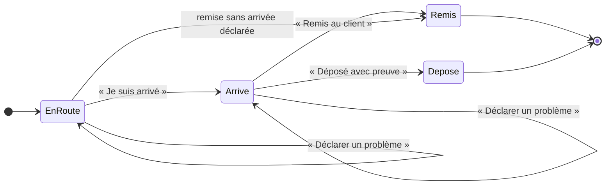

# À la porte — arriver, remettre ou déposer, signaler un problème

> 📐 **Plan, rien n'est bâti** (2026-10-01). Hugo : « sur la carte d'une
> livraison, signaler si aucune personne n'est là pour réceptionner — le client
> a explicitement notifié sans signature — donc le bouton remise doit être soit
> “remise au client” soit “déposer avec preuve” ; il faut un bouton “je suis
> arrivé”, j'ai besoin d'accumuler de la donnée sur combien de temps on met à
> livrer ; ensuite déclarer un problème : problème à la remise, problème
> technique, problème routier ».
>
> C'est le **lot 6 a** (« la porte »), conçu et contredit le 2026-09-29
> (`plan-preparation-de-tournee.md`, L6-C1 à L6-C14 ; [`todo-la-porte.md`](todo-la-porte.md)),
> **réduit** : sans le code de retrait par e-mail (L6-C12/C13), et sans
> clore une livraison ratée (L6-C14 : elle suppose le 6 c et les avenants).
> Ce qui est repris tel quel est cité ; ce qui change est dit.
>
> Suit « Ma tournée » ([`plan-ma-tournee.md`](plan-ma-tournee.md)) : la page,
> le rôle, le mur « sa tournée ». Frontière d'accès et preuve de remise :
> **`vitruve` avant de bâtir**.

## 1. Les gestes, sur la carte d'un arrêt (tournée partie, SA tournée)

| Geste                    | Quand                                                                   | Ce qu'il écrit                                                                                                                                                                        |
| ------------------------ | ----------------------------------------------------------------------- | ------------------------------------------------------------------------------------------------------------------------------------------------------------------------------------- |
| **Je suis arrivé**       | une fois par arrêt, avant la remise                                     | l'instant d'arrivée sur l'arrêt (`arrived_at`)                                                                                                                                        |
| **Remis au client**      | toujours                                                                | une remise chez `handover` (`via = manual`, auteur = le livreur), **signature au doigt + nom tapé** si l'adresse exige une signature ; puis `closeStop` — **une transaction** (L6-C7) |
| **Déposé avec preuve**   | **seulement si l'adresse n'exige pas de signature** (le client l'a dit) | une remise `via = deposit` (L6-C8), **photo obligatoire** (L6-Q8), jointe comme pièce du retrait (L6-C9) ; puis `closeStop`                                                           |
| **Déclarer un problème** | à tout moment, avant ou après l'arrivée                                 | un **signalement** (§ 3) ; l'arrêt **reste ouvert**                                                                                                                                   |

« Remise sans arrivée déclarée » est permise : un livreur qui oublie
« Je suis arrivé » doit pouvoir remettre ; la donnée manque, elle n'est pas
inventée (l'arrivée reste nulle, la durée sur place est « inconnue »).

## 2. Le temps : ce qu'on accumule

Par arrêt : `departed_at` (le départ de la tournée), `arrived_at`,
`closed_at` (remise ou dépôt). Par différence :

| Mesure                 | Calcul                                              | Sert à                                                                                                                           |
| ---------------------- | --------------------------------------------------- | -------------------------------------------------------------------------------------------------------------------------------- |
| **Trajet**             | arrivée − (clôture de l'arrêt précédent, ou départ) | comparer au trajet prévu par OSRM                                                                                                |
| **Sur place**          | clôture − arrivée                                   | régler la **durée de livraison** du calculateur (le réglage « temps pour décharger, signer », lot 7) par adresse puis en moyenne |
| **Écart à la fenêtre** | arrivée − début ou fin de la fenêtre promise        | la ponctualité                                                                                                                   |

Rien n'est calculé à l'écriture : on stocke des **instants** (`Clock`), les
durées se lisent. Un écran de statistiques viendra quand il y aura de la
donnée ; ce plan ne l'écrit pas.

## 3. Déclarer un problème

Trois familles, puis un motif, puis un texte et une photo facultatifs :

| Famille                  | Motifs proposés                                                                                          | Porte sur                                                 |
| ------------------------ | -------------------------------------------------------------------------------------------------------- | --------------------------------------------------------- |
| **Problème à la remise** | personne pour réceptionner · refus · adresse introuvable · accès impossible · marchandise abîmée · autre | **l'arrêt**                                               |
| **Problème technique**   | panne du véhicule · froid défaillant · téléphone ou application · bac endommagé · autre                  | **la tournée** (l'arrêt en cours est noté s'il y en a un) |
| **Problème routier**     | route fermée · accident · conditions (neige, verglas) · bouchon · autre                                  | **la tournée** (idem)                                     |

- Un signalement est un **fait daté**, auteur = le livreur. Il **ne clôt rien**
  et ne touche pas la commande : clore une livraison ratée (relivrer, basculer
  au comptoir, annuler) est le 6 c, qui suppose les avenants du commerce.
- Il est **visible** tout de suite sur l'écran Tournées (un pictogramme sur la
  tournée et l'arrêt, le détail au survol ou au clic) et part au **journal**.
- **À la fin de la tournée**, un arrêt resté ouvert apparaît dans une liste
  « Non remis » côté admin, avec ses signalements : c'est l'**écran provisoire**
  que L6-C14 demandait pour livrer le 6 a sans le 6 c.

## 4. Où ça vit

- **Dans `delivery`** (schéma `delivery`) : `arrived_at` sur l'arrêt ;
  une table `delivery_incident` (tournée, arrêt facultatif, famille, motif,
  note, clé de photo facultative, instant, auteur).
- **Dans `handover`** (L6-C7 à C9, inchangés) : la remise, sa valeur `deposit`,
  ses preuves (`order_handover_proof` : signature, photo), par un port que
  `delivery` déclare (`delivery/channels/handover/`) et que `handover`
  implémente. Le geste du livreur fait **une** unité de travail : vérifier le
  mur, attester, clore.
- **Photos** (dépôt, problème) : le bucket privé des pièces, servies par des
  routes murées du livreur (comme la photo de procédure) et sous
  `delivery_rounds` pour l'admin.
- **Droit** : `delivery_driving` porte aussi ces gestes. Le lot 6 prévoyait une
  ressource `delivery_doorstep` à part ; avec les rôles réglés à l'écran, la
  scinder plus tard ne coûte qu'une ressource. _(À contredire.)_

## 5. Ce que ce plan ne fait pas

- Le **code de retrait** envoyé au contact au départ et scanné à la porte
  (L6-C12/C13) : un lot suivant. « Remis au client » repose ici sur la
  signature quand elle est exigée, et sur l'attestation du livreur sinon.
- **Clore une livraison ratée** (6 c).
- La **position** relevée aux gestes (YA4 de
  [`plan-y-aller-et-position.md`](plan-y-aller-et-position.md)) : voir Q3.

## 6. Questions

| #         | Question                                                                                                                                                                                     | Proposé                                                                                                                                                                                          |
| --------- | -------------------------------------------------------------------------------------------------------------------------------------------------------------------------------------------- | ------------------------------------------------------------------------------------------------------------------------------------------------------------------------------------------------ |
| **AP-Q1** | « Le client a explicitement notifié sans signature » : c'est le champ **« signature exigée »** de l'adresse (existe déjà, carnet du client), ou un réglage **« dépôt autorisé »** distinct ? | Distinct : « pas de signature » (on peut remettre sans signer) n'est pas « vous pouvez laisser sans personne ». Un champ `depositAllowed` sur l'adresse, que le client et le commercial règlent. |
| **AP-Q2** | « Remis au client » sans signature exigée : un simple appui, ou toujours le nom de qui a réceptionné ?                                                                                       | Le **nom tapé**, toujours : sans lui, une remise contestée n'a aucune trace.                                                                                                                     |
| **AP-Q3** | Relever la **position** au moment de « Je suis arrivé » et de la remise ?                                                                                                                    | Oui, aux deux gestes seulement (YA4) : elle valide l'arrivée et corrige le point du carnet. Cadre CNIL de YA4.                                                                                   |
| **AP-Q4** | Un problème **technique ou routier** peut-il **arrêter** la tournée (rentrer avec des arrêts non faits) ?                                                                                    | Oui, par « Rentrer » : les arrêts ouverts passent dans « Non remis » avec le signalement.                                                                                                        |

## 7. Tranché par Hugo le 2026-10-01

| #         | Réponse                                                                      | Ce que ça change                                                                                                                                                                                                                                                                                                                              |
| --------- | ---------------------------------------------------------------------------- | --------------------------------------------------------------------------------------------------------------------------------------------------------------------------------------------------------------------------------------------------------------------------------------------------------------------------------------------- |
| **AP-Q1** | **Un réglage « dépôt autorisé » à part**                                     | Un champ `depositAllowed` sur l'adresse de livraison (carnet), distinct de « signature exigée », réglable par le client et par le commercial (droit `delivery_procedures:write` côté staff, comme la procédure — à confirmer au bâti). « Déposé avec preuve » n'apparaît **que** si l'adresse l'autorise. Migration additive, défaut `false`. |
| **AP-Q2** | **Toujours le nom tapé**                                                     | « Remis au client » exige le nom de qui réceptionne ; signature au doigt en plus quand l'adresse l'exige.                                                                                                                                                                                                                                     |
| **AP-Q3** | **On relève la position, mais elle ne corrige jamais le carnet toute seule** | Position du téléphone relevée à « Je suis arrivé » et à la remise (YA4) ; l'écart au point du carnet est **affiché** à l'admin (« relevé à 480 m du point du carnet »), et c'est un humain qui corrige — aucun geste automatique sur le carnet. Purge à 60 jours, cadre CNIL de YA4.                                                          |
| **AP-Q4** | **Non : un problème technique ou routier se signale seulement**              | Pas de « Rentrer » avec des arrêts ouverts déclenché par un problème ; la tournée continue, l'admin décide hors application. Un arrêt resté ouvert en fin de journée apparaît quand même dans « Non remis » (§ 3).                                                                                                                            |

## 8. v2 après `vitruve` (2026-10-01) — ce qui remplace §§ 1-5

Trois `BLOQUANT`, neuf `SÉRIEUX`. Là où cette section contredit ce qui
précède, **elle l'emporte**.

### AP-D1 — Le commerce est prévenu APRÈS la validation (BLOQUANT 1)

`HandoverAttestation.attest` publie `OrderHandedOverEvent` aussitôt
(`handover-attestation.service.ts:99`), et `PrismaUnitOfWork` ne diffère
aucune publication. Si `closeStop` échouait ensuite, la remise serait annulée
mais la commande déjà `fulfilled`, les points crédités. Décision : le port que
`delivery` appelle **atteste sans publier** et **rend** l'événement ; le
handler du livreur le publie **après** que l'unité de travail a validé. Un
test le prouve : `closeStop` qui échoue → aucune commande `fulfilled`, aucun
point. _(À établir au bâti : si `BackgroundWork` hérite de la transaction
ambiante.)_

### AP-D2 — « Déjà retirée » clôt sans attester (BLOQUANT 2)

L6-C11 est **réintroduit** : une commande déjà remise au comptoir, annulée, ou
retenue au contrôle qualité pendant la tournée s'affiche comme telle sur la
carte, et le livreur **clôt l'arrêt sans attester** (« Déjà retirée au
comptoir », « Annulée »). Sans ce geste, `attest` refuse, l'arrêt ne se ferme
jamais, et l'index `delivery_round_stop_live_order_key` garde la commande pour
toujours.

### AP-D3 — Ce qu'une remise déclenche, et le dépôt (BLOQUANT 3 — question à Hugo)

Une remise passe la commande `fulfilled` (`prisma-order.repository.ts:335`),
et ce statut nourrit : les **points de fidélité**
(`credit-points-on-handover.handler.ts`), le **volume tarifaire** du client
(`prisma-customer-volume.reader.ts:21`, `prisma-sku-volume.reader.ts`), le
**chiffre d'affaires** de `growth` (`revenue-scope.ts:13`), les **commandes
terminées** (`prisma-completed-order.reader.ts:13`). Un **dépôt** sans
personne déclencherait les mêmes effets, sans retour possible si le client
conteste (le 6 c est exclu). → **AP-Q5**.

### AP-D4 — La signature se lit sur l'arrêt figé, et l'emporte sur le dépôt

La signature se décide à trois niveaux (société, adresse qui peut la
redéfinir, commande — `account.prisma:201-209`) ; la valeur qui compte est
celle **figée au départ** : `DeliveryStopExecution.signatureRequired`
(`delivery.prisma:303`). → **AP-Q6** pour le cas « dépôt autorisé » et
« signature exigée » à la fois.

### AP-D5 — `depositAllowed` : une colonne, figée au départ

- Une **colonne** de l'adresse (`delivery_address_book`), pas une clé du
  `jsonb` `delivery_specs` : le client et le staff réécrivent ce `jsonb`
  d'un bloc (`address.ts:109`), et un front en ligne qui ne connaît pas la clé
  la remettrait à `false` en silence.
- **Figée au départ** dans `delivery_stop_execution` (comme la signature) :
  ce que le client a autorisé au moment où la tournée part. Une commande sans
  adresse reliée au carnet : `false`, écrit.
- **Qui l'écrit** : le client sur ses adresses ; côté staff, une **route à
  part** sous `delivery_procedures:write` (le commercial). La route d'édition
  de l'adresse (`admin-company-pieces.controller.ts:77`) reste sous
  `b2b_companies` et ne la touche pas.

### AP-D6 — Les instants dans la table d'exécution

`delivery_round_stop` n'a qu'un écrivain, la tournée ; son schéma annonce que
l'exécution vivra « dans une AUTRE table, écrite par l'arrêt seul »
(`delivery.prisma:162-166`). `arrived_at` et la position vont dans
**`delivery_stop_execution`** (qui porte déjà `departed_at`). `closeStop`
passe par l'agrégat et sa version : le livreur présente la version lue ; un
nouvel essai après perte de réseau est **idempotent** (un arrêt déjà clos par
la même remise répond « déjà fait », pas une erreur).

### AP-D7 — « Non remis » est une vue, pas un déblocage

Critère : tournée partie, arrêt non clos, `service_day` antérieur à
aujourd'hui. La liste **ne débloque rien** : faute du 6 c, ces commandes
restent dans l'index des arrêts vivants et ne peuvent être affectées à aucune
autre tournée. C'est dit à l'écran (« à traiter hors application, en
attendant les reports »).

### AP-D8 — `deposit` dans `HandoverVia` : les lecteurs d'abord

Les copies du type, complètes : `packages/contracts/src/order-handover.ts:37`
(utilisée l. 98 et 185), le journal en **deux** énumérations
(`journal-facts/orders-production.ts:214` et `:297`), les deux mappers qui
ramènent toute valeur inconnue à `manual`
(`prisma-order-handover.repository.ts:81`,
`prisma-handover-attestations.reader.ts:40`), la copie du commerce
(`b2b/orders/domain/services/handover.ts:57`). **Deux déploiements** : les
lecteurs (qui comprennent `deposit`) partent d'abord ; l'écrivain ensuite.
Irréversible au premier dépôt écrit.

### AP-D9 — Les frontières et le droit

- Le canal `delivery/channels/handover/` ouvre la case `handover → delivery`
  de la matrice du `CLAUDE.md` (✗ → « port uniquement »), et
  `lint:context-boundaries` l'arme.
- Une ressource **`delivery_doorstep`** à part (L6-C10, et la logique des
  droits par geste) : conduire sa tournée et attester une remise sont deux
  gestes. Le commentaire `staff-access.ts:356` reste vrai.

### AP-D10 — La position sort de ce plan

Elle demande une table, une purge à 60 jours et la page de confidentialité
**avant** la mise en service (YA-Q4) : c'est le lot **YA4**, qui se bâtit
juste après, avec la réponse d'Hugo (AP-Q3 : relevée, jamais de correction
automatique du carnet).

### Mineurs

Le dépôt sans arrivée déclarée est permis comme la remise (le diagramme du
§ 1 était asymétrique) ; le nom tapé fait 2 à 80 caractères ; `departed_at`
existe déjà (`DeliveryStopExecution.departedAt`).

### Questions nouvelles

| #         | Question                                                                                                               | Proposé                                                                                                                   |
| --------- | ---------------------------------------------------------------------------------------------------------------------- | ------------------------------------------------------------------------------------------------------------------------- |
| **AP-Q5** | Un **dépôt** a-t-il les mêmes effets qu'une remise (commande terminée, points, volume tarifaire, chiffre d'affaires) ? | Oui : c'est une livraison faite, avec preuve, que le client a autorisée. Une contestation passera par les avenants (6 c). |
| **AP-Q6** | Une adresse « dépôt autorisé » dont la commande exige une **signature** : dépôt possible ?                             | **Non** : la signature exigée l'emporte (elle est plus précise — elle peut venir de la commande elle-même).               |

**Tranché par Hugo le 2026-10-01 :**

- **AP-Q5 — oui** : un dépôt a les effets d'une remise (commande terminée,
  points, volume tarifaire, chiffre d'affaires).
- **AP-Q6 — la signature l'emporte** : « dépôt veut vraiment dire je ne pose
  pas de signature ». Une commande dont la signature est exigée (figée au
  départ) ne propose **jamais** « Déposé avec preuve », même si l'adresse
  autorise le dépôt.

## 9. Suite des décisions d'Hugo (2026-10-01)

- **Toute remise porte une photo**, même le cas nominal : « même le happy path
  signé remis doit avoir des photos ». « Remis au client » exige donc **la
  photo + le nom** (+ la signature au doigt quand elle est exigée) ; « Déposé
  avec preuve » exige la photo. Une remise sans photo n'existe pas (lot B).
- **« Clore sans remise »** : une commande en livraison ne passe pas au
  comptoir, et une commande produite est facturée donc livrée — le cas est
  « impossible » dans le métier. Le geste reste un **filet de sécurité
  invisible** : il n'apparaît que si le commerce dit la commande retirée ou
  annulée (une donnée incohérente bloquerait sinon l'arrêt pour toujours,
  BLOQUANT 2 de `vitruve`).
- **Personne, dépôt interdit, refus, accès impossible** = le client ne
  respecte pas les conditions convenues → c'est **le commercial qui décide**
  (laisser quand même, ou rapporter), pas le livreur. Proposé, en attente des
  réponses d'Hugo : le signalement prévient le commercial ; il répond
  « Autoriser le dépôt cette fois » (la carte propose alors « Déposé avec
  preuve », photo obligatoire, décision tracée) ou « Rapporter » (l'arrêt
  reste ouvert → « Non remis ») ; le livreur continue sans attendre.
  Questions : quel commercial (attitré ou tous) ; délai d'attente sur place ;
  « laisser en vrac » toujours avec photo (proposé : oui).
