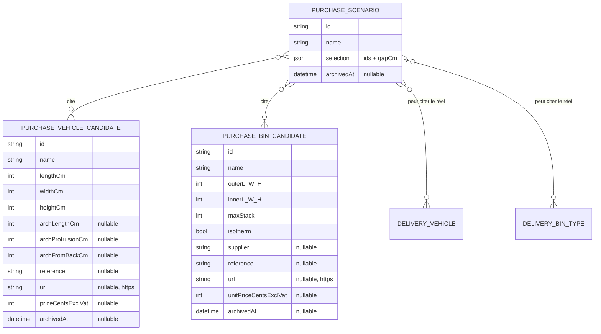
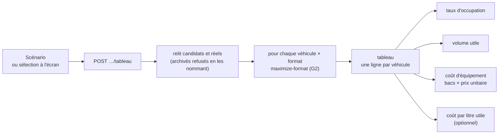

# La bibliothèque d'achat — véhicules et bacs candidats, scénarios, tableau croisé

> 🟡 **Plan, partiellement bâti** (2026-09-30) : B1 et B2 côté serveur, aucun écran. Suite de
> [`plan-geometrie-du-plancher.md`](plan-geometrie-du-plancher.md) : l'assistant
> d'achat (G1-G3) calcule, mais tout se ressaisit à chaque ouverture.
>
> Hugo : « il faudrait que je puisse avoir une librairie de véhicules fictifs,
> de boîtes fictives, avec éventuellement références, lien d'achat, prix… on a
> de quoi faire tourner des scénarios différents, même en fonction des
> véhicules choisis, demander quelles boîtes ont le meilleur ratio
> d'occupation ».
>
> Tranché le même jour : **droit du simulateur** (Q1), **prix HT** (Q2), le
> **véhicule a un prix aussi**, et le **coût par litre est optionnel** (Q3).

## 1. Décisions

### B-D1 — Des candidats, jamais mêlés au réel

Deux tables neuves, **séparées** de la flotte (`delivery_vehicle`) et des types
de bacs (`delivery_bin_type`) :

- un **véhicule candidat** n'apparaît jamais dans « Planifier », les tournées ou
  le chargement ;
- un **format candidat** n'apparaît jamais au colisage ni dans les contenances.

Un statut « fictif » sur les tables réelles obligerait **chaque** lecture de la
flotte et des bacs à filtrer — cinq adaptateurs de `delivery/infrastructure/`
les lisent aujourd'hui (compté le 2026-09-30). Le jour où
une seule l'oublie, le calculateur propose une tournée à une camionnette qui
n'existe pas. Des tables distinctes rendent l'erreur **inexprimable** plutôt
qu'interdite.

Tables dans le schéma `production`, comme tout le bloc `delivery` (Q10 du plan
de tournée). Jamais supprimées : **archivées**, comme les types de bacs.
Les dimensions passent par les value objects déjà écrits : `CargoFloor`,
`WheelArches`, `BinDimensions`, `BinFormat`. Aucune règle n'est redoublée.

### B-D2 — Un candidat acheté devient réel en un geste

« **Ajouter à la flotte** » (véhicule) et « **Mettre en service** » (format)
recopient les dimensions dans une création ordinaire du réel : les commandes
existantes `AddVehicleCommand` / `AddBinTypeCommand`, avec leurs refus et leur journal.
Le candidat reste dans la bibliothèque, marqué « acheté le … » : c'est
l'historique de la décision.

Une **copie**, pas un lien : si le vrai véhicule mesuré diffère du catalogue, on
corrige la flotte ; le candidat garde ce qu'on croyait en l'achetant.

### B-D3 — Le prix : des centimes HT, indicatifs

- `…CentsExclVat` : entier ≥ 0, facultatif. Jamais de flottant, jamais de TVA
  calculée. Un prix de catalogue n'est pas une facture.
- Aucun prix ne quitte cette bibliothèque : ni commande, ni comptabilité, ni
  journal de l'argent ne le lisent.
- Le lien d'achat est une URL **https** : c'est un lien qu'on ouvre depuis le
  back-office ; un `javascript:` ou un `http:` se refuse au domaine.

### B-D4 — Le tableau croisé

Une **lecture** : `POST admin/livraison/assistant-achat/tableau`, corps =
une sélection (véhicules et formats, candidats ou réels, jeu entre bacs).
Chaque case appelle la stratégie A de G2 (`maximize-format`) : 10 véhicules
× 10 formats = 100 calculs purs, sans base. Bornes : 10 × 10.

Par case : bacs (au sol × étages), volume utile, **taux d'occupation**
(volume utile ÷ volume du véhicule), et si les prix sont connus :

- **coût d'équipement** = nombre de bacs × prix unitaire HT du format ;
- **coût total** = prix du véhicule + coût d'équipement ;
- **coût par litre utile** = coût total ÷ litres utiles — **affiché seulement si
  on le demande** (Q3), et seulement quand les deux prix sont connus. Un prix
  manquant rend la case « prix inconnu », jamais zéro.

L'écran choisit le critère (occupation, volume, coût par litre) et met en avant
la meilleure case **de chaque ligne** : « pour ce véhicule, quel bac ? ». Une
seconde lecture, la meilleure **ligne**, répond à « quel véhicule ? ».

Le prix d'un véhicule entre dans le coût par litre (Q3) : c'est ce qui compare
deux camionnettes entre elles, pas seulement deux bacs.

### B-D5 — Les scénarios enregistrés

Même forme que les scénarios du simulateur de tournée
(`delivery_simulation_scenario`) : un nom, une sélection en JSON **revalidée à
chaque relecture**, l'auteur figé, archivable. Un scénario **cite** des
identifiants, il ne copie pas les cotes : on le relance sur les valeurs
d'aujourd'hui. Un candidat archivé depuis se nomme dans le refus
(« le format « Caisse Dupont 50 » a été archivé — retirez-le du scénario »),
jamais en 500.

### B-D6 — Les droits

Ceux du simulateur (Q1), sans droit neuf :

| Geste                                                    | Droit                                                                                                                   |
| -------------------------------------------------------- | ----------------------------------------------------------------------------------------------------------------------- |
| Lire la bibliothèque, les scénarios, calculer le tableau | `delivery_rounds:read`                                                                                                  |
| Créer, modifier, archiver un candidat ou un scénario     | `delivery_rounds:write`                                                                                                 |
| « Ajouter à la flotte », « Mettre en service »           | **en plus**, le droit de la commande réelle (véhicules, types de bacs) — un droit de simulateur ne crée pas un véhicule |

## 2. Les lots

| Lot                                | Contenu                                                                                                                                                                                                                                        | Qui                   |
| ---------------------------------- | ---------------------------------------------------------------------------------------------------------------------------------------------------------------------------------------------------------------------------------------------- | --------------------- |
| **B1** ✅ 2026-09-30 (`19a1eb59e`) | Candidats : migration additive (2 tables), agrégats, CRUD + archivage, contrats, e2e (mur de droits, refus d'URL, prix négatif)                                                                                                                | `batisseur`           |
| **B2** ✅ 2026-09-30               | Tableau croisé : query, bornes 10 × 10, coûts, e2e — coût par litre arrondi au centime le plus proche (moitié vers le haut), meilleures cases calculées au serveur, un véhicule retiré de la flotte refusé comme un archivé ; 10 × 10 en 35 ms | `batisseur`           |
| **B3**                             | Scénarios : table, enregistrer / relire / archiver, e2e                                                                                                                                                                                        | `batisseur`           |
| **B4**                             | Écran « Bibliothèque » (onglet de l'assistant) : listes, fiches, lien d'achat, prix HT                                                                                                                                                         | `pablo`               |
| **B5**                             | Écran « Tableau » : sélection, critère, mise en avant, coût par litre à la demande ; enregistrer un scénario                                                                                                                                   | `pablo`               |
| **B6**                             | « Ajouter à la flotte », « Mettre en service »                                                                                                                                                                                                 | `batisseur` + `pablo` |

B1 → B2 → B5 donnent le tableau ; B3 et B6 viennent ensuite.

## 3. Questions ouvertes

| #        | Question                                                                                              | Proposé                                                                               |
| -------- | ----------------------------------------------------------------------------------------------------- | ------------------------------------------------------------------------------------- |
| **B-Q1** | La **charge utile** (kg) du véhicule candidat : on la saisit dès maintenant ?                         | Saisie et affichée, lue par aucun calcul — aucun poids par produit n'existe.          |
| **B-Q2** | Un format **conditionné par lot** (vendu par 10) : prix du lot ou prix unitaire ?                     | Prix unitaire seulement ; le lot est une note.                                        |
| **B-Q3** | Le **tableau** sur les véhicules réels : afficher ce que coûterait de ré-équiper la flotte actuelle ? | Oui : un réel sans prix donne « prix inconnu », son équipement se calcule quand même. |

## 4. Ce que ce plan n'a pas vérifié

- Le coût de 100 calculs par requête : la programmation dynamique de G2 est
  en O(longueur en cm × 2) par case, soit ~600 pas pour une camionnette — à
  mesurer en e2e, pas à supposer.
- Le rendu du tableau 10 × 10 sur téléphone : à regarder à l'écran.
