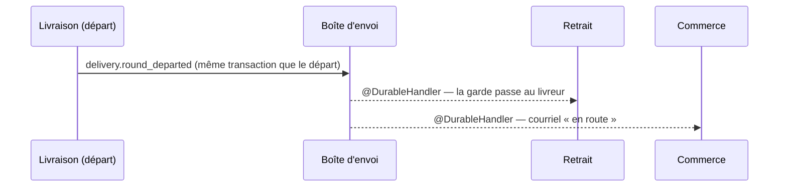

# Le départ d'une tournée devient un fait durable

> 📐 **Plan** (2026-10-06) — **rien n'est bâti.** ⚠️ Contredit par `vitruve` le même jour : le §5 fait foi. Hugo : « pourquoi on a encore
> des messages en bus mémoire plutôt qu'en durables ? » puis « lance ».
>
> 🔴 Il touche une **frontière entre trois blocs** (livraison, retrait,
> commerce) : `vitruve` avant de bâtir.

## 1. Ce qui existe (relu le 2026-10-06)

- Au départ, la livraison publie `DeliveryRoundDepartedEvent`
  (`apps/lfd-api/src/delivery/domain/events/delivery-loading.events.ts`) sur
  le **bus en mémoire**.
- Deux `@EventsHandler` **de la livraison** l'écoutent, et chacun appelle,
  **après la validation** (`AfterCommit`) et **en arrière-plan**
  (`BackgroundWork`), un port qu'un autre bloc implémente :
  - `HandDepartedOrdersOver` → `DepartedOrdersAnnouncer.ordersDeparted`
    (`delivery/channels/handover/`), implémenté par le retrait : **la garde
    passe au livreur** (BQ, `a-la-porte.md` § 5) ;
  - `AnnounceDeliveryDeparture` → `DeliveryDepartureAnnouncer`
    (`delivery/channels/commerce/`), implémenté par le commerce : le
    courriel « en route » (`plan-en-route.md`, PL3).
- **Le défaut** : si le processus s'arrête entre la validation du départ et
  ces appels, ils sont perdus, sans reprise. La tournée est partie, mais le
  retrait croit encore les commandes au fournil, et aucun courriel ne part.
- La porte `lint:durable-cross-block` ne le voyait pas : l'abonné vit dans
  son bloc, c'est l'appel de port qui traverse (élargie le 2026-10-06 ; ces
  deux abonnés y sont en dette comptée).
- Le modèle à suivre existe : `production.day_closed`
  (`apps/lfd-api/src/production/channels/commerce/production-day-closed.event.ts`),
  publié par la boîte d'envoi dans la transaction de l'arrêt, écouté en
  `@DurableHandler` par la livraison et le commerce.

## 2. La proposition

1. **Un fait durable `delivery.round_departed`**, déclaré par la livraison
   dans ses canaux (exporté par `delivery/channels/handover/` et
   `delivery/channels/commerce/`), charge : `roundId`, `serviceDay`,
   `departedAt`, `orderIds`. Clé d'idempotence : `delivery.round_departed:<roundId>:<departedAt>`.
2. **Publié par la boîte d'envoi dans la transaction du départ** : si le
   départ est annulé, le fait l'est ; s'il est validé, le fait sera livré au
   moins une fois.
3. **Le retrait s'abonne** en `@DurableHandler` et fait ce que fait
   aujourd'hui `ordersDeparted`. **Le commerce s'abonne** et fait ce que fait
   aujourd'hui l'annonceur du départ (le courriel garde sa clé par commande).
4. **Les deux abonnés en mémoire et les deux ports d'annonce disparaissent**
   (`HandDepartedOrdersOver`, `AnnounceDeliveryDeparture`,
   `DepartedOrdersAnnouncer`, `DeliveryDepartureAnnouncer`) ; la dette de la
   porte baisse de deux.
5. **Idempotence à vérifier avant de bâtir** : `ordersDeparted` rejoué
   (même tournée, même instant) ne doit rien dupliquer ni refuser — lire son
   implémentation au retrait (`order_departure`). Un départ **après un
   retour** (second passage, nouvelle tournée) doit rester un fait distinct.
6. **Ordre** : aucun ordre n'est supposé entre ce fait et ceux du retrait
   (`order.handed_over`) ; un abonné qui reçoit le départ d'une commande déjà
   remise ne la « repart » pas.

## 3. Questions

- **DD-Q1** — Faut-il conserver un abonné en mémoire pour l'effet
  immédiat (le courriel part dans la seconde) ? La boîte d'envoi a un chemin
  rapide après validation : le délai réel est à mesurer, pas à supposer.
- **DD-Q2** — Le journal de la livraison lit-il aujourd'hui
  `DeliveryRoundDepartedEvent` (`JournaledEvent`) ? Le fait durable ne doit
  pas le doubler.

## 4. Lots

| Lot     | Contenu                                                                                    |
| ------- | ------------------------------------------------------------------------------------------ |
| **DD0** | `vitruve`, puis les réponses                                                               |
| **DD1** | le fait, sa publication dans la transaction du départ, l'abonné du retrait, e2e de reprise |
| **DD2** | l'abonné du commerce (courriel), retrait des abonnés en mémoire et des ports d'annonce     |

## 5. Contradiction de `vitruve` (2026-10-06) et v2

Trois BLOQUANTS, cinq SÉRIEUX. Le §1 est exact. Ce qui suit corrige le §2 ;
là où ils divergent, le §5 fait foi.

**B1 — un départ livré en retard efface un retour.**
`recordDeparted` (`apps/lfd-api/src/handover/infrastructure/prisma-order-departure.repository.ts`)
fait un `upsert` sans garde (`returnedAt: null`), alors que `recordReturned`
est gardé par `departedAt <= at`. Sous reprise (jusqu'à 6 h de délai), un
départ rejoué après un retour remet la commande « partie ».
→ **La ligne `order_departure` devient monotone par instant, pas par ordre
d'arrivée** : `recordDeparted(at)` n'écrit que si `departedAt` est nul ou
`<= at` **et** si `returnedAt` est nul ou `< at`. Un fait plus ancien que
l'état ne fait rien. Test : départ puis retour puis départ rejoué → la
commande reste revenue.

**B2 — le retour reste en mémoire alors qu'il écrit la même ligne.**
`ordersBroughtBack` est appelé en différé, perdable, depuis
`bring-stop-back.handler.ts` et `stop-decision-by-setting.ts`.
→ **Le retour devient aussi un fait durable**, `delivery.orders_brought_back`
(c'est ce que prévoyait E3, `documentation/journalisation/plan-evenements-durables.md`).
Les deux faits portent leur instant, et la règle de B1 les ordonne sans
supposer d'ordre de livraison.

**B3 — « ne repart pas une commande déjà remise » sans mécanisme.**
→ L'abonné du retrait lit `order_handover` avant d'écrire : une commande
déjà remise est ignorée. Test dédié.

**Sérieux, tranchés :**

- **Deux portes de départ** (`depart-my-round.handler.ts`, livreur ;
  `depart-delivery-round.handler.ts`, chargeur) → la publication durable se
  fait **dans `departAndFreeze`**, le seul chemin commun, pour qu'aucune
  porte ne l'oublie.
- **Le journal** : `DeliveryRoundDepartedEvent` (`JournaledEvent`) **reste**
  et écrit le journal ; le fait durable **s'ajoute**, classe distincte dans
  le canal, comme `ProductionDayClosedJournalEvent` et
  `ProductionDayClosedEvent`.
- **Le courriel sous reprise** : l'abonné du commerce envoie commande par
  commande, journalise un échec **sans le relancer** (un courriel « en
  route » n'est pas critique ; ce qu'on gagne, c'est qu'un redémarrage ne
  le perd plus). Clé d'idempotence **par commande et par tournée**
  (`delivery.en_route:<orderId>:<roundId>`) : un second passage a son
  courriel, une reprise n'en fait pas un second.
- **Latence** : pas d'abonné en mémoire en plus (il reconstruirait le double
  envoi). Critère du lot : en e2e, le courriel part au premier réveil du
  relais après la validation ; mesure du délai notée dans le rapport.
- **Transition** : **un seul lot** remplace les deux abonnés en mémoire et
  pose les deux abonnés durables (pas de période à deux écrivains). Noms
  d'abonnés stables dès le premier déploiement
  (`handover.record-round-departed`, `handover.record-orders-brought-back`,
  `b2b.mail-delivery-en-route`). Un départ validé pendant le déploiement
  reste perdu, comme aujourd'hui.

**Mineurs** : la clé du fait est `delivery.round_departed:<roundId>` (un
second passage est une nouvelle tournée) ; le §1 renvoie à `a-la-porte.md`
§ 10 ter ; la porte ne voit pas les appels `ordersBroughtBack` (command
handlers) — ce lot les retire, la question ne se pose plus.

### 5.1 Lot unique

| Lot     | Contenu                                                                                                                                                                                                                  |
| ------- | ------------------------------------------------------------------------------------------------------------------------------------------------------------------------------------------------------------------------ |
| **DD1** | `order_departure` monotone ; faits durables départ et retour (publiés dans `departAndFreeze` et au retour) ; trois abonnés durables ; retrait des abonnés en mémoire et des ports d'annonce ; e2e de reprise et de rejeu |
