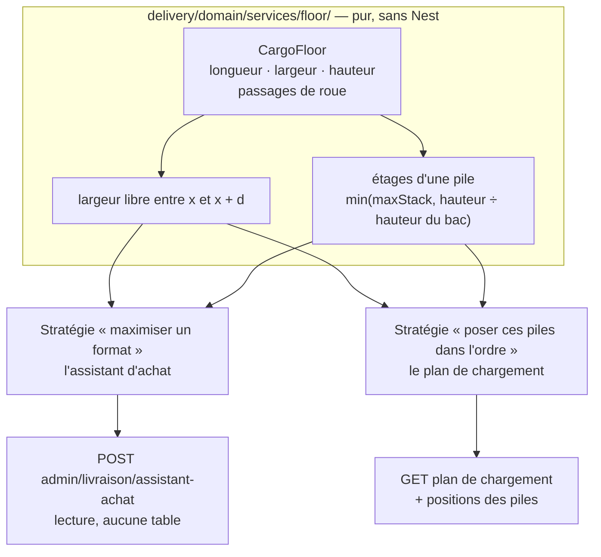
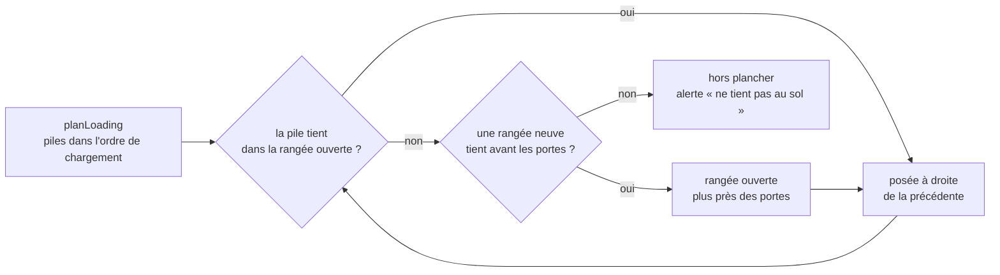

# La géométrie du plancher — l'assistant d'achat et le chargement

> 📐 **Plan, rien n'est bâti** (2026-09-30). Hugo : « un assistant achat
> logistique, qui permet de simuler une dimension utile et des dimensions de
> boite », puis « est-ce que le même algo pourra servir à la résolution du
> chargement ? » — et, sur la réponse : « écris le plan avec la géométrie
> commune ».
>
> Maquette interactive (hors dépôt) :
> <https://claude.ai/artifact/66XrmXV9cG42JeDBjgc2ti>. Référence de ce qui
> existe : [`chargement-les-bacs.md`](chargement-les-bacs.md), qui liste en
> premier manque « pas de géométrie du plancher » (§ 9).

## 1. Ce qui existe, relevé dans le code le 2026-09-30

| Élément                    | Où                                                           | Ce qu'il sait                                                                                                                | Ce qu'il ne sait pas                               |
| -------------------------- | ------------------------------------------------------------ | ---------------------------------------------------------------------------------------------------------------------------- | -------------------------------------------------- |
| Espace utile d'un véhicule | `delivery/domain/value-objects/cargo-space.ts`               | longueur, largeur, hauteur en cm, volume en litres                                                                           | les **passages de roue**                           |
| Caisse réfrigérée          | `refrigerated-compartment.ts`                                | un **volume** en litres et une plage de température                                                                          | ses **dimensions** : on ne peut pas y poser un bac |
| Type de bac                | `bin-type.ts`                                                | dimensions extérieures et intérieures, `maxStack`, isotherme, cloisonnable                                                   | —                                                  |
| Plan de chargement v1      | `delivery/domain/services/loading-plan.ts` (206 lignes, pur) | l'**ordre** (inverse de la tournée), les **piles** (un type par pile, plusieurs arrêts par pile), le **volume** sec et froid | **où** poser une pile                              |
| Alertes du plan            | `DeliveryLoadingPlanWarningKind`                             | `dry_over`, `cold_over`, `cold_bins_without_refrigeration`, `unknown_cargo`, `bin_to_redo`                                   | « ça tient en litres mais pas en forme »           |

## 2. Décisions

### G-D1 — Une géométrie, deux stratégies

La même brique pure répond aux deux questions, et **seulement** à ce qu'elles
ont en commun : un plancher, ses obstacles, la place qu'une empreinte y prend,
la hauteur qu'une pile y atteint. Au-dessus, deux stratégies qui ne se
ressemblent pas et ne doivent pas se forcer à se ressembler.



**Pourquoi pas un seul algorithme.** L'assistant cherche le **maximum** de bacs
**identiques** ; le chargement doit poser **des** piles **données**, de types
mélangés, dans un **ordre imposé** (le premier arrêt près des portes). Le
second a plus de contraintes, pas moins, et un maximum ne lui sert à rien :
une disposition qui fait tout tenir mais oblige à tout vider au premier arrêt
est fausse.

**Pourquoi pas l'optimum.** Le rangement 3D de boîtes mélangées sous
contrainte d'ordre est un problème difficile dans le cas général. Pour
quelques dizaines de bacs, une règle **par rangées** donne une réponse
lisible, qu'on explique au chauffeur en une phrase. C'est ce qui est retenu.

### G-D2 — La brique commune : `CargoFloor`

Un value object, dans `delivery/domain/value-objects/` :

- `lengthCm`, `widthCm`, `heightCm` — ceux de `CargoSpace`, qu'il **étend**
  plutôt que de le doubler ;
- `wheelArches: WheelArches | null` — **une** paire symétrique : longueur,
  saillie de chaque côté, distance depuis le fond. Une camionnette n'en a
  qu'une ; deux paires seraient une question le jour d'un porteur.

Et deux fonctions pures, testées seules (`sonic-unit-tester`) :

- `freeWidthCm(floor, fromCm, depthCm)` — la largeur posable sur la tranche
  `[x, x + d)` : toute la largeur, ou `largeur − 2 × saillie` si la tranche
  touche un passage de roue. **Aucun bac n'est posé sur un passage de roue** :
  plus haut, la largeur est pleine, mais un bac ne vole pas.
- `stackLevels(floor, binType)` — `min(maxStack, ⌊hauteur ÷ hauteur extérieure⌋)`.

Le **jeu entre bacs** (défaut 1 cm) s'ajoute à l'empreinte, en longueur et en
largeur : un bac serré contre son voisin ne se sort pas.

Le bac reste **debout** : seules deux orientations au sol (dans la longueur,
tourné). Coucher un bac n'est pas modélisé, et c'est voulu.

**Tranché le 2026-09-30 (Hugo) : on ne couche jamais un bac.** « Si on a des
ratios proportionnels entre les containers, ça finit par redevenir des cubes
si on se projette assez loin. » Les formats sont **modulaires** : deux bacs
S (40 × 30) couvrent exactement l'empreinte d'un M ou d'un L (60 × 40). Des
formats qui s'emboîtent au sol remplissent le plancher sans qu'on ait besoin de
les coucher ; c'est le choix des formats, pas leur orientation, qui gagne la
place. Ni case « peut voyager couché » sur le type, ni interdiction sur le
produit.

### G-D3 — Stratégie A, l'assistant : des rangées, le meilleur sens pour chacune

Le calcul de la maquette, porté au domaine :

```
f(x) = nombre de bacs au sol posables à partir de x (en cm, depuis le fond)
f(L) = 0
f(x) = max( f(x + 1),                                   — laisser 1 cm vide
            pour chaque sens o :  ⌊freeWidth(x, d_o) ÷ w_o⌋ + f(x + d_o) )
total = f(0) × stackLevels
```

Exact **parmi les rangements par rangées** transversales, passages de roue
compris ; pas parmi tous les rangements (un rangement « en moulinet » peut
battre une rangée sur certains planchers). Le rendu le dit.

Rendu par format : bacs au sol, étages, total, volume **intérieur** utile, part
du volume du véhicule, ce qui limite la hauteur (la pile ou le plafond), et
les rangées (position, sens, nombre) pour dessiner le plancher.

**Surface** : une **lecture**, comme le simulateur de tournée (lot 9) —
`POST admin/livraison/assistant-achat` parce que le scénario est un corps. Ni
table, ni journal. Droit : `delivery_rounds:read`, celui du simulateur ; pas
de droit neuf. Bornes : 10 formats, dimensions dans les bornes de
`CargoSpace` et de `BinDimensions`.

### G-D4 — Stratégie B, le chargement : remplir des rangées depuis le fond

Elle part de ce que `planLoading` rend **déjà** — les piles, dans l'ordre où
on les charge (dernier arrêt d'abord) — et leur donne une **place** :



- Une rangée a la **profondeur** de sa pile la plus profonde ; chaque pile y
  prend le sens qui laisse le plus de largeur (à égalité, dans la longueur).
- L'ordre n'est **jamais** réordonné pour gagner de la place : une pile chargée
  plus tard est toujours plus près des portes ou dans la même rangée. C'est la
  contrainte que l'assistant n'a pas, et la raison de G-D1.
- Une pile qui ne trouve pas de place sort en **alerte neuve**
  `floor_over` : « 3 piles ne tiennent pas au sol (arrêts 5 et 6) — retirer un
  arrêt ou changer de véhicule ». Elle **s'ajoute** à `dry_over` (litres), elle
  ne le remplace pas : les deux peuvent être vrais séparément.
- Sans `cargo` sur le véhicule, rien ne change : `unknown_cargo` existe déjà.

**Le froid reste en litres** tant que la caisse réfrigérée n'a pas de
dimensions (G-Q3). Les bacs isothermes n'entrent pas dans le plancher sec.

### G-D5 — Les données : ce qu'il faut ajouter

| Champ                                                                                       | Table                                  | Migration                                                             |
| ------------------------------------------------------------------------------------------- | -------------------------------------- | --------------------------------------------------------------------- |
| passages de roue : longueur, saillie, distance depuis le fond (cm, tous nuls ou tous posés) | `production.delivery_vehicle`          | **additive**, trois colonnes nullables + un `CHECK` « tous ou aucun » |
| jeu entre bacs (cm)                                                                         | `production.delivery_routing_settings` | additive, défaut 1                                                    |

Aucune donnée existante n'est convertie. Un véhicule sans passages de roue se
lit comme aujourd'hui : un rectangle. Le journal des véhicules déclare les
nouvelles clés (`onVehicle`, comme `cargo` le 2026-09-30).

## 3. Les lots

| Lot    | Contenu                                                                                                                                                            | Qui                               |
| ------ | ------------------------------------------------------------------------------------------------------------------------------------------------------------------ | --------------------------------- |
| **G1** | `CargoFloor`, `WheelArches`, `freeWidthCm`, `stackLevels` — pur, tests aux bords (saillie ≥ demi-largeur, passage au ras du fond, tranche qui effleure le passage) | `batisseur` + `sonic-unit-tester` |
| **G2** | Stratégie A + `POST admin/livraison/assistant-achat` + contrat + e2e (200 sans écriture, 400 bornes, 403)                                                          | `batisseur`                       |
| **G3** | Onglet **« Assistant d'achat »** de l'espace Livraison : la maquette, reliée à l'API, pré-remplie par les véhicules et les types en service                        | `pablo`                           |
| **G4** | Passages de roue sur le véhicule : migration additive, écran Véhicules, journal                                                                                    | `batisseur` + `pablo`             |
| **G5** | Stratégie B dans `planLoading` : positions des piles, alerte `floor_over`                                                                                          | `batisseur`                       |
| **G6** | Le plancher vu de dessus sur l'écran du plan de chargement, couleur par arrêt                                                                                      | `pablo`                           |

G1 → G2 → G3 donnent l'assistant **sans migration**, sur des dimensions saisies.
G4 est le seul lot qui touche au schéma. G5 attend G1, pas G4 : sans passages
de roue, le plancher est un rectangle.

## 4. Questions ouvertes

| #        | Question                                                                                                     | Proposé                                                          |
| -------- | ------------------------------------------------------------------------------------------------------------ | ---------------------------------------------------------------- |
| **G-Q1** | Les **portes latérales** : un bac posé près d'elle est accessible sans vider l'arrière. On en tient compte ? | **Pas en v1** : on charge et on décharge par l'arrière.          |
| **G-Q2** | Le **jeu entre bacs** : 1 cm par défaut, réglable ?                                                          | Oui, dans les réglages de tournée (`delivery_routing_settings`). |
| **G-Q3** | La **caisse réfrigérée** : lui donner des dimensions pour y poser les isothermes ?                           | Plus tard : en v1, le froid reste en litres.                     |
| **G-Q4** | Le **poids** : la charge utile d'une camionnette s'atteint parfois avant son volume.                         | Hors plan : aucun poids par produit n'existe aujourd'hui.        |
| **G-Q5** | L'assistant compare-t-il des **mélanges** (des L, puis des S dans les trous) ?                               | Pas en v1 : un format à la fois, côte à côte.                    |

## 5. Ce que ce plan n'a pas vérifié

- **Les cotes réelles de ta flotte** : la maquette part d'ordres de grandeur.
  Le premier usage de l'assistant est de les mesurer.
- **Le calcul de la stratégie A contre des cas faits à la main** : à écrire en
  tête de G1-G2, avec au moins un plancher où tourner une rangée gagne et un où
  le passage de roue coûte une rangée entière.
- **La lisibilité du plancher sur un téléphone** (G6) : à regarder à l'écran.
