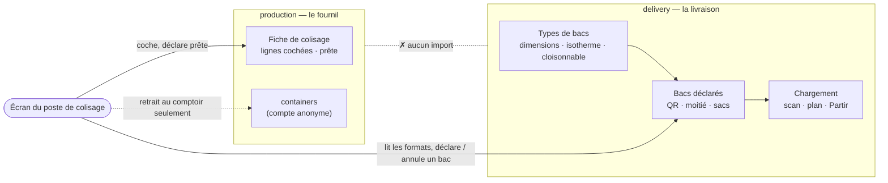
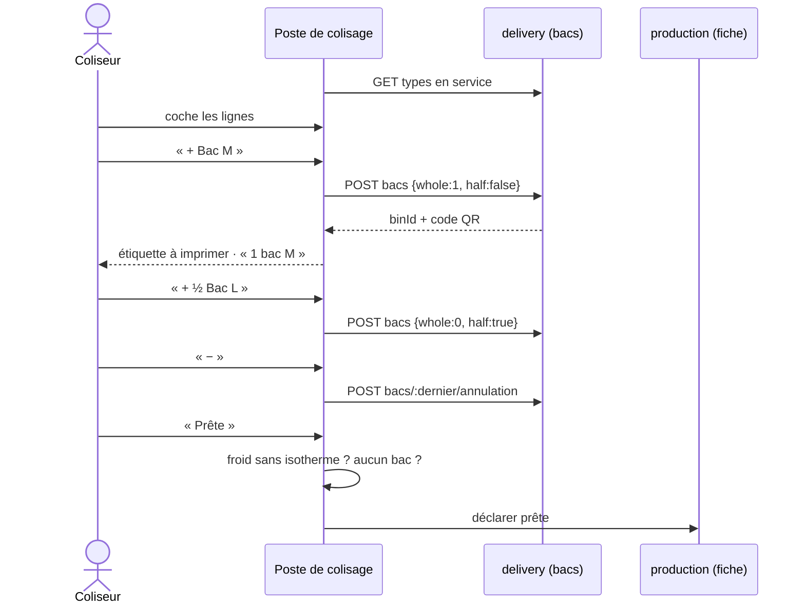
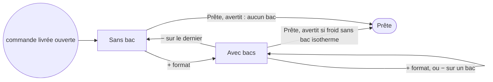

# Le « + » choisit un bac — un seul contenant par commande livrée

> 🟢 **Lot A bâti le 2026-10-02, Q2 à Q4 par défaut** — non commité à
> l'écriture de ce bandeau. Q2 : le format proposé est **en couleur** dans la
> rangée, rien n'est déclaré d'office ; Q3 : le demi-bac partagé reste au
> poste ; Q4 : « − » puis « + ». Décisions **à revoir avec Hugo**
> ([`decisions-par-defaut-2026-10-02.md`](decisions-par-defaut-2026-10-02.md),
> lot PC1). Le lot B (retirer la saisie libre) n'est pas fait ; le lot C
> (`chargement-les-bacs.md` § 5) l'est. Ce qui existe :
> [`chargement-les-bacs.md`](chargement-les-bacs.md) § 5.0.
>
> 📐 **Plan, rien n'est bâti** (2026-09-30) — phrase d'origine, périmée par le
> bandeau ci-dessus. Ouvert sur la remarque de Hugo :
> « sans algo, c'est la responsabilité du coliseur de préparer de manière
> optimisée ses bacs clients, donc au niveau du plus / moins on doit désormais
> choisir une taille de container ».
>
> Référence de ce qui existe : [`chargement-les-bacs.md`](chargement-les-bacs.md).

## 1. Le problème : deux comptes pour un même objet

Au poste de colisage, une commande **en livraison** porte aujourd'hui deux
gestes qui décrivent la même chose (vérifié dans le code le 2026-09-30) :

|                | Le « + / − » containers                                            | Le panneau « Bacs »                        |
| -------------- | ------------------------------------------------------------------ | ------------------------------------------ |
| Bloc           | `production` — `production_orders.containers`                      | `delivery` — les bacs du lot 4 bis         |
| Ce qu'il dit   | un **nombre** anonyme                                              | des bacs **typés**, étiquetés d'un QR      |
| Commandes      | toutes, retrait compris                                            | livraison seulement                        |
| Lu ensuite par | **personne** : la fiche de colisage l'affiche, rien ne le consomme | le scan, le plan de chargement, « Partir » |

Un coliseur peut compter 3 au « + » et déclarer 2 bacs : le chauffeur charge 2,
et le 3 ne sert à rien. Le schéma l'avait prévu (`production.prisma`, champ
`containers`) : « le jour où chaque produit ira dans un container nommé, ce
nombre deviendra la longueur de cette liste ». Ce jour est venu.

## 2. Décisions

### D1 — Les formats appartiennent à la livraison ; le colisage s'y conforme

Tout ce qui définit un bac vient de la livraison : ses **dimensions** (il tient
et s'empile dans un véhicule), **isotherme ou non** (le froid se joue sur le
trajet), son **QR** (scanné au chargement), le **demi-bac partagé** (deux arrêts
consécutifs), **« à refaire »** (l'ordre de la tournée). Le coliseur remplit le
bac ; il n'en décide ni la forme ni le contrôle.

**Pas de bloc « contenant » transverse.** Il serait vide : le retrait au comptoir
n'a besoin ni de dimensions, ni de QR, ni de froid, et le « contenant » du
fournil (`ProductionContainer`) est du matériel de four, sans rapport.



Le fournil **n'importe pas** la livraison (matrice du `CLAUDE.md`,
`production → delivery` = ✗) : c'est **l'écran** qui parle aux deux, comme le
panneau « Bacs » le fait déjà.

**Ce qui ferait changer D1** : le bac devient un objet géré pour lui-même — un
**parc** (combien, où, chez quel client), une **consigne**, un **lavage**, ou le
comptoir qui rend lui aussi des bacs réutilisables. On sortirait alors un bloc
« parc de bacs », que la livraison emprunterait et que le fournil remplirait.

### D2 — Pour une commande livrée, le « + » déclare un bac d'un format

Une rangée de boutons, un par type **en service** :
`+ Bac S ❄` · `+ Bac M` · `+ Bac L` · `+ ½ Bac L` (types cloisonnables).

- Un « + » déclare **un** bac tout de suite : `POST admin/livraison/colisage/bacs`
  avec `whole: 1, half: false` (ou `whole: 0, half: true`). **La route existe**,
  aucune route neuve.
- Le « − » annule le **dernier** bac non chargé :
  `POST …/bacs/:binId/annulation` — existe aussi. Un bac chargé refuse, comme
  aujourd'hui (« on décharge d'abord »).
- Le compte affiché **est** le nombre de bacs déclarés. Le « + / − » anonyme
  n'apparaît plus pour une livraison.



### D3 — Pas d'algorithme sur le chemin ; deux avertissements, pas de calcul

La proposition calculée sort du chemin principal (cf. Q2 pour ce qu'il en
reste). Deux avertissements à l'écran, au moment de « Prête » :

- **du froid sans bac isotherme** — l'écran lit le froid des lignes que la
  proposition lit déjà ;
- **aucun bac** sur une commande livrée.

⚠️ **Ce sont des avertissements d'écran, pas des refus serveur.** Déclarer une
commande prête ne demande aujourd'hui **aucun** container (vérifié le
2026-09-30 : `production-day.packing.ts` ne lit `containers` qu'au pas « + / − »),
et un refus serveur demanderait au fournil de lire les bacs de la livraison —
l'import que D1 interdit. « Partir » refuse déjà une tournée incomplète : le
filet dur est là, au chargement.

### D4 — Le comptoir garde son compte anonyme, pour l'instant — porte ouverte

Une commande en retrait garde le « + / − » anonyme, inchangé.
`production_orders.containers` n'est **plus écrit** pour une livraison. Aucune
colonne supprimée, aucune migration.

Hugo (2026-09-30) : « on doit pouvoir aussi, j'imagine ». Rien dans ce plan ne
ferme la porte, et c'est voulu : la rangée « + format » est un composant qui
reçoit une commande et une liste de formats, **sans condition sur le mode
d'acheminement**. Le jour où le comptoir passe en bacs typés, c'est le choix
de l'afficher qui change, pas le composant. Ce qui manquerait alors côté
serveur est dit en Q1.

## 3. L'écran



```
┌ Commande C-4F2K · Le Refuge 1950 · livraison ───────────────┐
│ Bacs                                               2 bacs  │
│   [+ Bac S ❄]  [+ Bac M]  [+ Bac L]  [+ ½ Bac L]           │
│   • Bac M        K7P2QX   ⎙                          [−]   │
│   • ½ Bac L (g.) 9HD4RA   ⎙                          [−]   │
│   Sacs dans le dernier bac : [ 2 ]                         │
│ ⚠ La commande contient du froid, aucun bac isotherme.      │
└────────────────────────────────────────────────────────────┘
```

## 4. Lots

| Lot   | Contenu                                                                                                                                                   | Bloc            |
| ----- | --------------------------------------------------------------------------------------------------------------------------------------------------------- | --------------- |
| **A** | Poste de colisage : rangée « + format », « − » sur le dernier bac, compte = bacs ; masquer le « + / − » anonyme pour une livraison ; avertissements de D3 | front (`pablo`) |
| **B** | ⏸ attend Q2 — retirer du panneau « Bacs » la saisie libre devenue doublon                                                                                 | front           |
| **C** | Mettre à jour `chargement-les-bacs.md` §5 et l'index                                                                                                      | doc             |

Aucun lot backend si Q4 reste « − puis + ». Le serveur a déjà tout.

## 5. Questions ouvertes — aucune tranchée (2026-09-30)

Hugo : Q1 « je ne sais pas pour l'instant, on doit pouvoir aussi j'imagine » ;
Q2 à Q4 « je ne sais pas encore ».

**Le lot A se bâtit sans elles**, en gardant pour chacune le comportement
d'aujourd'hui — le seul qui n'engage rien :

| #      | Question                                                                                                    | En attendant, le lot A…                                                              | Ce que coûterait chaque réponse                                                                                                                                                                                |
| ------ | ----------------------------------------------------------------------------------------------------------- | ------------------------------------------------------------------------------------ | -------------------------------------------------------------------------------------------------------------------------------------------------------------------------------------------------------------- |
| **Q1** | Le retrait au comptoir passe-t-il aussi en bacs typés ?                                                     | garde le compte anonyme au comptoir (D4)                                             | **Oui** : un lot serveur — `delivery.bins_not_declarable` (409) refuse aujourd'hui une commande en retrait ; le bac est à la livraison, il faudrait lui dire qu'un bac peut ne jamais monter dans un véhicule. |
| **Q2** | La proposition calculée : retirée, ou elle **met en avant** un format (bouton en couleur, rien déclaré) ?   | la laisse **où elle est**, dans le panneau « Bacs », avec « Déclarer comme proposé » | Retirée : un lot front. Mise en avant : un lot front, la proposition est déjà servie.                                                                                                                          |
| **Q3** | Le demi-bac **partagé** entre deux commandes : au poste, ou réservé au chargement ?                         | le laisse **au poste**, inchangé                                                     | Réservé au chargement : un geste neuf à l'écran de chargement, la route `partage` existe.                                                                                                                      |
| **Q4** | Changer M en L : « − » puis « + » (nouvelle étiquette), ou un geste « changer la taille » qui garde le QR ? | fait « − » puis « + » — c'est ce que les routes permettent déjà                      | Garder le QR : une commande serveur neuve, et un fait de journal.                                                                                                                                              |

Le lot B (retirer la saisie libre) **attend Q2** : il n'a de sens qu'une fois
la place de la proposition décidée.

## 6. Ce que ce plan n'a pas vérifié

- ~~Que l'API accepte une seconde déclaration~~ — **vérifié le 2026-09-30** :
  le handler de `DeclareDeliveryBinsCommand` ne connaît aucun refus « déjà
  déclaré » ; seul l'écran bloque « Déclarer comme proposé ». Un e2e le dira
  quand même en tête du lot A.
- Le poste sur **téléphone** : cinq boutons de format tiennent-ils sur une
  ligne ? À regarder à l'écran, pas à supposer.
