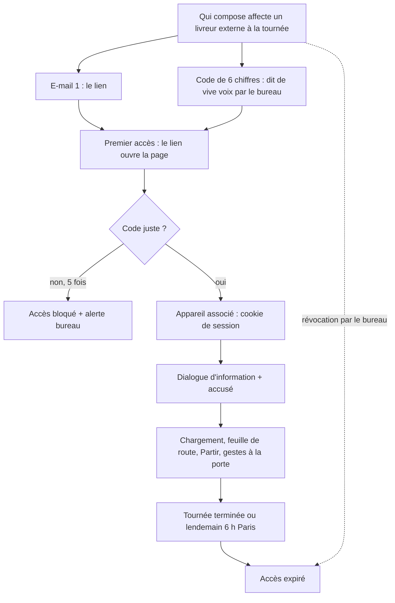

# Le livreur par lien (6 b) — une tournée, un lien, un code

> 📐 **Plan** (2026-10-06) — **rien n'est bâti.** Hugo : « écris en plan, ça
> serait un complément de la méthode avec compte staff ».
>
> ⚠️ **v1 contredite par `vitruve` le 2026-10-06 (4 bloquants) : la v2 du §9
> fait foi là où elles divergent** — le livreur externe devient une fiche
> staff sans compte Auth0.
>
> 🔴 **Frontière de sécurité neuve : `vitruve` avant Hugo** (CLAUDE.md § 9 bis).
> Une clé d'accès qui ne passe pas par Auth0 ouvre des routes du back-office.
>
> 📜 **Relu contre le code le 2026-10-07** (audit du dossier `livraisons/` du
> même jour) : toujours rien de bâti. Corrigés en place et datés : les routes
> du livreur relèvent de **deux** droits, pas d'un (§ 0, § 9.1) ; le dialogue
> d'information est commité ; l'adresse de la page et une ligne citée. Deux
> exigences que la v2 décrivait comme acquises sont au **§ 9.4**.
>
> **Complément, pas remplacement.** Le livreur avec compte staff
> (`delivery_driving` pour conduire, `delivery_doorstep` pour les gestes à la
> porte ; page `/coursier`, [`plan-ma-tournee.md`](plan-ma-tournee.md)) reste
> la voie principale et ne change pas. Conception tranchée en amont :
> [`a-la-porte.md`](a-la-porte.md) § 10 (« un lien à jeton par tournée ; qui
> compose affecte le livreur ; le snapshot du départ se garde 90 jours ») et
> L6-C5 de [`plan-preparation-de-tournee.md`](plan-preparation-de-tournee.md).

## 0. Relevé de l'existant (vérifié dans le code le 2026-10-06)

- **Les routes du livreur** vivent sous `admin/livraison/ma-tournee` dans trois
  contrôleurs : `my-delivery-round.controller.ts` (liste, version, détail,
  `depart`, photo d'étape), `my-delivery-loading.controller.ts` (chargement,
  plan, `bacs`, `dechargement`), `my-delivery-doorstep.controller.ts` (gestes à
  la porte, « Tournée terminée », photo d'un signalement). Les deux premiers
  sont `@AdminSurface("delivery_driving")` ; le troisième est
  `@AdminSurface("delivery_doorstep")` (`my-delivery-doorstep.controller.ts:61`,
  AP-D9). _Corrigé le 2026-10-07 : ce paragraphe les disait tous sous
  `delivery_driving`._ S'y ajoute `admin/livraison/mes-donnees`
  (`my-driver-notice.controller.ts`, sous `delivery_driving`). Chaque route
  d'une tournée prend le livreur par `@StaffUserId()` — sauf `GET version`,
  sans mur (voulu, `get-my-round-version.handler.ts`). Il n'est jamais un
  paramètre d'URL.
- **Le mur est dans la requête** : `round: { driverStaffId: staffUserId }`
  (`prisma-doorstep-stop.repository.ts:34`), et les commandes « à moi »
  (`LoadMyBinCommand`, `DepartMyRoundCommand`…) portent `staffUserId`. Une
  tournée d'un autre rend 404.
- **L'affectation** : `AssignDeliveryDriverHandler` refuse quiconque n'est pas
  détenteur de `delivery_driving` (`driversNow(this.holders)`) — de
  `delivery_driving:write` **seulement** (`DRIVING_PERMISSION`,
  `delivery-driver-support.ts:15`) : `delivery_doorstep` n'est pas vérifié
  (relu le 2026-10-07, § 9.4).
  `delivery_round.driver_staff_id` est un `String?` sans clé étrangère
  (`prisma/schema/delivery.prisma:148`).
- **L'identité staff** est résolue en base à chaque requête (`StaffAccess`,
  `platform/auth/staff-principal.ts`) depuis un jeton Auth0
  (`admin-auth.guard.ts`). Aucun autre chemin ne produit un `staffUserId`.
- **Le chargement** écrit `delivery_bin_load.loaded_by` (`String?`,
  `delivery.prisma:299`), qui reçoit aujourd'hui un `staffUserId`.
- **Aucun envoi SMS** dans le dépôt (aucune occurrence de
  sms/twilio/vonage/brevo dans `apps/lfd-api/src`, `packages/mailer`,
  `gateway`). Le mailer (`packages/mailer`) envoie par Resend, avec un mode
  à blanc (`dry-run-mailer.ts`).
- **La passerelle** (`gateway/src/index.ts`) transmet tout, y compris les
  en-têtes, et réécrit `x-lfc-client-ip` et `traceparent`. Son trafic
  (`traffic.ts`, `TrafficPoint`) compte des nœuds et des statuts. Elle ne
  journalise pas l'URL dans ce que j'ai lu. **Cloudflare, lui, peut garder
  l'URL complète** dans ses journaux : non vérifié, à supposer vrai.
- **RGPD** : `documentation/legal/rgpd-registre.json` est tenu par
  `lint:rgpd-staff`, qui n'admet que `personne ∈ {livreur, staff,
receptionnaire}` (`rgpd-staff.mjs:51`). Son point 4 lie l'empreinte des
  entrées `livreur` à la version du texte d'information.
- **Le dialogue d'information du livreur** est **commité** (`188858264`,
  2026-10-06 ; _ce paragraphe le disait « en cours, non commité », corrigé le
  2026-10-07_) : `my-driver-notice.controller.ts`
  (`admin/livraison/mes-donnees`, `GET` + `POST accuse`),
  `DriverNoticeAcknowledgement`, migration
  `20261007150000_l_accuse_du_texte_du_livreur`. L'accusé est rattaché à un
  `staffUserId`.

## 1. Le concept

**Même écran, mêmes gestes, autre clé.** Le livreur externe voit la page « Ma
tournée » réduite à **une** tournée. Ses gestes sont les mêmes handlers,
avec les mêmes règles. Seule change la façon de dire « c'est lui ».



## 2. Modèle

### 2.1 Le livreur externe

Une ligne `delivery.external_driver` : `id` (ULID), `first_name`,
`last_name`, `email` (**obligatoire**, cf. 2.3), `phone` (facultatif, pour
l'appeler), `created_at`, `archived_at`. Elle vit dans le **schéma
`delivery`** : c'est la livraison qui en a besoin, et le staff ne doit pas la
connaître (sinon un externe devient un compte staff qui ne dit pas son nom).

La tournée gagne `driver_external_id String?`. Un **CHECK** interdit d'avoir
`driver_staff_id` et `driver_external_id` remplis en même temps : une
tournée a au plus un livreur. C'est une interdiction structurelle, pas une
vérification.

Persistance d'une tournée à l'autre : **question ouverte LL-Q2**. Le plan
suppose « oui, carnet archivable » (moins de saisie, un e-mail vérifié une
fois).

### 2.2 L'accès

Une ligne `delivery.driver_link_access` par affectation :

| Colonne                                    | Rôle                                                                    |
| ------------------------------------------ | ----------------------------------------------------------------------- |
| `id`, `round_id`, `external_driver_id`     | portée : **une** tournée                                                |
| `token_hash`                               | SHA-256 d'un jeton aléatoire de 32 octets (base64url). Jamais le jeton. |
| `code_hash`                                | empreinte du code à 6 chiffres (HMAC avec un secret d'`AppConfig`)      |
| `failed_attempts`, `locked_at`             | 5 essais, puis blocage                                                  |
| `device_session_hash`, `device_bound_at`   | l'appareil associé (empreinte du cookie de session courant)             |
| `expires_at`                               | `min(retour de la tournée, lendemain 06:00 Europe/Paris)`               |
| `revoked_at`, `revoked_by`                 | révocation par le bureau                                                |
| `notice_version`, `notice_acknowledged_at` | l'accusé du dialogue, rattaché à l'**accès**                            |

**Les règles portées par l'agrégat `DriverLinkAccess`** : `verifyCode()`
refuse s'il est expiré, révoqué ou bloqué. `bindDevice()` ne réussit qu'une
fois. Le lien seul ne suffit **jamais** : sans cookie d'appareil valide, chaque
route du livreur rend 401.

Le cookie : `HttpOnly; Secure; SameSite=Strict`, chemin borné aux routes du
livreur, valeur aléatoire **tournée à chaque échange** (rotation : l'ancienne
empreinte est remplacée). Réaffecter l'accès à un autre appareil passe par le
bureau : il révoque, puis renvoie.

### 2.3 Envoi : tranché par Hugo le 2026-10-06 : **e-mail, pas de SMS**

- **Décision** : le lien part par le mailer existant (Resend). Aucun
  fournisseur SMS n'est ajouté.
- **L'e-mail du livreur externe devient obligatoire.** Sans e-mail, l'écran
  d'affectation refuse en nommant le cas (« Renseignez l'e-mail de Prénom Nom
  pour lui envoyer le lien »).
- **Le code n'est pas envoyé par e-mail : le bureau le dit de vive voix**
  (affiché une seule fois à l'écran d'affectation, au téléphone ou au
  comptoir). Deux e-mails séparés arriveraient dans **la même boîte** : qui
  lit l'un lit l'autre (boîte partagée, transfert, téléphone volé), et le
  second facteur ne protégerait plus rien. Un canal différent (la voix) est la
  seule séparation réelle sans SMS. Coût : un appel, une phrase. Le code se
  régénère au même écran s'il est perdu, ce qui invalide l'ancien.
- `mailSent: true` atteste seulement que Resend a accepté le message
  (CLAUDE.md § 0). L'écran le dit tel quel, et propose de **copier le lien**
  pour le transmettre autrement.

## 3. Le mur

### 3.1 Un `DriverIdentity`, pas un faux staff

Un guard neuf `DriverLinkGuard` (dans `delivery/http/`, pas dans `platform/`,
qui ne doit rien savoir de la livraison) lit le cookie, en calcule l'empreinte,
charge l'accès et vérifie : non expiré, non révoqué, appareil associé, accusé
du dialogue posé (sauf pour les routes du dialogue). Il pose sur la requête :

```ts
type DriverIdentity =
  | { readonly kind: "staff"; readonly staffUserId: string }
  | {
      readonly kind: "link";
      readonly accessId: string;
      readonly roundId: string;
      readonly externalDriverId: string;
    };
```

Les routes du lien sont **un préfixe à part** (`livraison/lien/…`), public pour
Auth0 (`@Public()`) et gardé par `DriverLinkGuard`. Elles reprennent seulement
les routes de `my-delivery-*` (feuille de route, version, Partir, gestes à la
porte, chargement selon LL-Q1, photo d'étape, dialogue), **jamais** la liste
des tournées du jour : le `roundId` vient de l'accès, pas de l'URL.

### 3.2 Les handlers existants, sans duplication

Les commandes « à moi » passent de `staffUserId: string` à
`driver: DriverIdentity`. Le mur devient un seul prédicat, écrit **une** fois
dans l'infrastructure :

- `staff` → `round: { driverStaffId }` (inchangé) ;
- `link` → `round: { id: roundId, driverExternalId }`.

Les règles métier (`depart`, gestes à la porte, chargement) ne bougent pas : on
change qui passe la porte, pas ce qu'on fait derrière. Les contrôleurs staff
construisent `{ kind: "staff" }`, ceux du lien `{ kind: "link" }`. Les deux
n'injectent que des bus.

### 3.3 L'auteur des gestes

Les colonnes `*_by` reçoivent aujourd'hui un `staffUserId` sans clé
étrangère. Pour un externe, elles reçoivent **`ext:<external_driver_id>`**.
Le préfixe interdit toute confusion avec un ULID staff, et
`StaffAuthorDirectory` (ou son voisin) rend « Prénom Nom (lien) ». On n'ajoute
pas de colonne `*_by_kind` : ce serait doubler chaque colonne d'auteur pour une
information que la valeur porte déjà. Chaque lecteur d'auteur doit savoir
résoudre `ext:` ; un auteur non résolu s'affiche « livreur par lien (inconnu) »,
jamais vide.

## 4. Sécurité

| Menace                                 | Réponse                                                                                                                                                                                                                                                                                                                                              |
| -------------------------------------- | ---------------------------------------------------------------------------------------------------------------------------------------------------------------------------------------------------------------------------------------------------------------------------------------------------------------------------------------------------- |
| Lien transféré, capturé, en historique | Le lien seul n'ouvre rien : il faut le code, puis l'appareil est lié. Après liaison, le lien ne sert plus (il rend « déjà associé, appelez le bureau »).                                                                                                                                                                                             |
| Jeton dans les journaux / `Referer`    | Le jeton est dans le **fragment** (`…/livraison/lien#t=…`) : un navigateur ne l'envoie jamais au serveur, ni en `Referer`. Le front le lit puis le **POSTe** avec le code, et nettoie l'URL (`history.replaceState`). Ni Cloudflare, ni la passerelle, ni l'API ne voient le jeton dans une URL. Ajouter `Referrer-Policy: no-referrer` sur la page. |
| Jeton en base                          | Empreinte seulement : une fuite de la base ne donne aucun lien utilisable.                                                                                                                                                                                                                                                                           |
| Force brute sur le code                | 5 essais par accès, puis `locked_at` + notification au bureau (la cloche). Plus le throttler NestJS par IP. 10⁶ codes contre 5 essais : une chance sur 200 000.                                                                                                                                                                                      |
| Force brute sur le jeton               | 256 bits : hors de portée.                                                                                                                                                                                                                                                                                                                           |
| CSRF                                   | Cookie `SameSite=Strict`, et tous les gestes en `POST` avec corps JSON. Pas de geste en `GET`.                                                                                                                                                                                                                                                       |
| Messages d'erreur                      | Jeton inconnu, expiré ou révoqué : **même** réponse (401 « lien invalide ou expiré »), pour ne rien confirmer. L'écran du bureau, lui, nomme le vrai cas.                                                                                                                                                                                            |
| Au pire                                | Un attaquant qui a le lien, le code **et** devance le livreur voit une tournée d'un jour : adresses, noms et consignes des clients de cette tournée, et peut poser de faux gestes. Le livreur légitime est alors refusé et appelle : c'est ce refus qui donne l'alerte.                                                                              |
| Révocation                             | Un bouton au bureau : `revoked_at`, effet à la requête suivante (l'accès est relu en base à chaque requête, comme le staff).                                                                                                                                                                                                                         |

**Non couvert** : un téléphone déverrouillé volé pendant la tournée (comme pour
le staff) ; un livreur qui recopie ou photographie la feuille de route ; un
e-mail intercepté **et** un code obtenu par ingénierie sociale auprès du
bureau (la consigne : ne dire le code qu'au livreur affecté, au numéro connu).

## 5. RGPD

- **Nouvelle personne concernée** : `livreur-externe`. Ses colonnes
  (`external_driver.*`, les `*_by` qui valent `ext:…`, l'accès) entrent dans
  `rgpd-registre.json`, et `rgpd-staff.mjs` gagne la valeur dans `PERSONS` et
  ses motifs dans le schéma `delivery`. Le texte d'information a son entrée
  dans [`../legal/rgpd-livreur.md`](../legal/rgpd-livreur.md).
- **Information au premier accès** : le **même** dialogue que le livreur staff
  (commité le 2026-10-06, `188858264`), avec un paragraphe sur l'e-mail
  et le cookie d'appareil. L'accusé se rattache à l'**accès**
  (`driver_link_access.notice_*`), pas à un `staffUserId`. Le point 4 de la
  porte (empreinte liée à la version du texte) couvre les deux personnes.
- **Conservation** : l'accès expire le lendemain et se purge à **90 jours**,
  comme le snapshot du départ. La fiche `external_driver` sans tournée depuis
  12 mois s'archive puis se purge (durée à confirmer, LL-Q5). Les `*_by` qui
  citent `ext:` suivent la durée de la pièce qui les porte.

## 6. Le chargement

**Question ouverte LL-Q1** : le livreur externe scanne-t-il ?

- **Consulter seulement** : il voit le plan et les bacs ; un chargeur staff
  scanne. Rien ne change pour `loaded_by`. Mais `depart` refuse tant qu'un bac
  n'est pas chargé : un externe seul au dépôt ne peut pas partir.
- **Scanner** : `LoadMyBinCommand` accepte un `DriverIdentity`, `loaded_by`
  vaut `ext:…`, et l'externe est autonome. Il faut alors ouvrir la caméra sur
  une page hors compte. Le risque reste borné aux bacs de **sa** tournée, déjà
  tenu par le mur.

Recommandation : **scanner**. Sans cela, le 6 b ne sert pas le cas qui le
justifie, un remplaçant seul au petit matin.

## 7. Questions ouvertes pour Hugo

1. **LL-Q1** — L'externe scanne-t-il le chargement (§ 6) ? Recommandé : oui.
2. **LL-Q2** — Garde-t-on son identité d'une tournée à l'autre (carnet
   d'externes) ou la ressaisit-on à chaque fois ? Recommandé : carnet.
3. **LL-Q3** — Le code dit de vive voix vous convient-il, ou préférez-vous un
   second e-mail malgré la boîte commune (§ 2.3) ?
4. **LL-Q4** — Expiration : « au retour ou au plus tard 6 h le lendemain »,
   d'accord sur 6 h ?
5. **LL-Q5** — Durée de conservation de la fiche d'un externe inactif
   (12 mois proposés).
6. **LL-Q6** — Qui affecte un externe : le même droit que l'affectation
   actuelle, ou un droit à part (ouvrir un accès hors Auth0 n'est pas anodin) ?

_SMS ou e-mail : tranché le 2026-10-06, e-mail (§ 2.3). Aucun envoi SMS
n'existe dans le dépôt._

## 8. Lots proposés (chacun bâtissable seul)

0. **`vitruve`** sur ce plan, puis réponses de Hugo.
1. **LL1 — Le livreur externe** : table, CHECK « un seul livreur », carnet à
   l'écran, affectation (`assignDriver` accepte un externe), registre RGPD et
   porte. Visible seul : une tournée affichée avec « Prénom Nom (lien) ».
2. **LL2 — `DriverIdentity`** : les commandes « à moi » prennent l'union, mur
   factorisé, résolution `ext:` dans les lecteurs d'auteur. Aucune route neuve :
   le staff passe par `{ kind: "staff" }`, tests de non-régression du mur.
3. **LL3 — L'accès** : agrégat `DriverLinkAccess`, émission (jeton + code),
   e-mail du lien, révocation, expiration, blocage + cloche. Écran bureau.
4. **LL4 — La porte du lien** : `DriverLinkGuard`, échange jeton + code →
   cookie, routes `livraison/lien/…`, dialogue d'information rattaché à
   l'accès. E2E : lien seul refusé, autre tournée 404, révoqué 401, 6ᵉ essai
   bloqué.
5. **LL5 — Le front** : page hors compte qui lit le fragment, demande le code,
   puis réutilise les composants de « Ma tournée ». Chargement selon LL-Q1.
6. **LL6 — La purge** à 90 jours des accès, avec celle du snapshot.

## 9. Contradiction de `vitruve` (2026-10-06) et v2 proposée

Quatre BLOQUANTS, neuf SÉRIEUX. Les quatre bloquants ont **une racine
commune** : la v1 invente une seconde identité de livreur (`DriverIdentity`,
`ext:<id>`) à côté du staff. Cette identité doit alors traverser tout ce qui
lit un auteur : `StaffAuthorDirectory` vit dans `staff/`, qui n'a pas le
droit de lire `delivery` (B1) ; `ext:` sort de la livraison par le geste de
remise jusqu'au retrait et au commerce (B2) ; le mur est recopié dans
quatorze fichiers qui lisent `driverStaffId`, et un `staffUserId` indéfini
dans un `where` Prisma ouvre toutes les tournées en silence (B3) ;
l'accusé du dialogue d'information, déjà commité (`188858264`), est
rattaché à un `staffUserId` (B4, le §0 le disait à tort « non commité »).
Ce garde-fou ne protège que contre un problème que la découpe crée : c'est
la découpe qu'on change.

### 9.1 La v2 : un livreur externe EST une fiche staff, sans compte Auth0

- **Le livreur externe est une ligne de `staff_users`**, de nature
  `external` : prénom, nom, e-mail (obligatoire), **sans `auth0_id`**, avec
  un rôle qui porte `delivery_driving` **et** `delivery_doorstep` — accordés
  à l'écran des rôles, jamais par migration. Son id est un id staff comme un
  autre. _Corrigé le 2026-10-07 : la v2 ne citait que `delivery_driving`, qui
  ne donne aucun geste à la porte (§ 9.4)._
- **Tout le reste ne change pas** : `driver_staff_id` le désigne, le mur
  (`driverStaffId` dans chaque `where`) le tient tel quel, les colonnes
  `*_by` reçoivent un id staff, `StaffAuthorDirectory` et `deliveryAuthorOf`
  le nomment, l'accusé du dialogue lui est rattaché. B1, B2, B3 et B4
  disparaissent, et le format `ext:` n'entre jamais en base (le SÉRIEUX
  « irréversibilité » aussi).
- **Seule l'AUTHENTIFICATION diffère** : au lieu d'un jeton Auth0, le
  `Principal` de cette fiche est résolu depuis la session ouverte par le lien
  et le code. Le reste du chemin (droits lus en base, statut, mur) est celui
  de tout staff. Une fiche `external` ne peut **jamais** se connecter par
  Auth0, et une fiche Auth0 jamais par lien. _Exigence à construire, pas un
  état : aujourd'hui le résolveur d'accès lierait une telle fiche au premier
  compte Auth0 qui présente son adresse (§ 9.4)._
- **L'affectation** (`AssignDeliveryDriverHandler`, `driversNow`) les voit
  comme les autres détenteurs de `delivery_driving` : la question LL-Q6
  (« qui peut affecter un externe ») se ramène au droit d'affectation
  existant. Elle ne vérifie que `delivery_driving:write` (§ 9.4).
- **RGPD** : la porte `lint:rgpd-staff` n'a pas de nouvelle personne à
  apprendre pour l'identité (c'est une fiche staff) ; seule la table d'accès
  par lien entre au registre. Le départ d'un externe = la procédure de
  départ d'un staff, qui reste à écrire (`rgpd-livreur.md` §7).

### 9.2 Ce qui reste à concevoir avant de bâtir (SÉRIEUX)

1. **Cookie et CSRF.** L'API n'a aucune lecture de cookie (pas de
   `cookie-parser`, tout passe par un jeton porteur). Deux voies : (a) la
   session du lien devient un **jeton porteur** court, gardé par le front en
   mémoire de session, rafraîchi par un endpoint dédié — même mécanisme que
   le reste de l'app, pas de CSRF par construction ; (b) un cookie
   `SameSite=Strict`, qui suppose de vérifier que le front et l'API sont sur
   le même site derrière la passerelle et qu'elle relaie `Set-Cookie`.
   **Proposition : (a).**
2. **Rotation.** Pas de rotation à chaque requête (deux requêtes
   concurrentes se déconnectent l'une l'autre en pleine tournée). Un jeton
   de session à durée bornée, rafraîchi tant que l'accès vit.
3. **Régénérer le code** remet le compteur d'essais à zéro **et** révoque
   l'accès précédent (nouveau lien). Possible avant comme après la liaison
   à un appareil : c'est le geste « je lui renvoie un lien ».
4. **Expiration.** `expires_at` se calcule sur le **jour de service** de la
   tournée (pas le jour d'affectation) : fin à J+1 06:00 Paris ; le retour
   de la tournée (`returned_at`, écrit par « Tournée terminée » — _la v2
   disait « Rentrer », qui n'est qu'un lien de navigation ; corrigé le
   2026-10-07_) révoque l'accès dans la même transaction. Une affectation la veille pour un départ à 4 h tient
   donc jusqu'au lendemain du service.
5. **Deux tournées pour un même externe** : un accès par **externe et jour
   de service**, qui ouvre toutes ses tournées du jour — son espace Coursier
   les liste déjà par jour.
6. **Blocage après 5 essais** : quiconque détient le lien peut bloquer le
   livreur (déni de service). Assumé et écrit : le bureau régénère (point 3).
   La limite par IP du throttler est par processus ; seuls les essais en
   base tiennent.
7. **Resend** : vérifier que le suivi des clics est **désactivé** sur cet
   e-mail (la réécriture du lien peut perdre ou journaliser le fragment).
   Garder `Referrer-Policy: no-referrer` et effacer le fragment
   (`history.replaceState`) dès la lecture.
8. **Caméra** sur la page hors compte (scan au chargement, LL-Q1) : la
   permission et la CSP de la page sont à écrire dans le lot front.

### 9.3 Effet sur les lots

LL1 devient « la fiche staff `external` (sans Auth0) et son affectation »,
qui exige `delivery_driving` **et** `delivery_doorstep` (§ 9.4) ; LL2
(« `DriverIdentity` sur les handlers ») **disparaît** ; LL3 « l'accès par
lien : jeton, code, e-mail, régénération, expiration au jour de service,
révocation au retour », refusé à une fiche qui ne tient pas les deux
droits ; LL4 « la résolution du `Principal` depuis la session du lien » ;
LL5 le front ; LL6 la purge. La v2 est à recontredire
par `vitruve` avant de bâtir.

### 9.4 Relu contre le code le 2026-10-07 — deux exigences à construire

Rien de ce plan n'est bâti (relu le 2026-10-07 : ni nature `external` dans
`staff_users`, ni table d'accès par lien, ni garde du lien). Deux phrases de
la v2 décrivaient pourtant comme acquis ce que le code ne tient pas.

1. **Deux droits, pas un.** Conduire (`delivery_driving`) ne donne aucun geste
   à la porte : « Je suis arrivé », remettre, déposer, signaler, clore sans
   remise et « Tournée terminée » sont sous `delivery_doorstep`
   (`my-delivery-doorstep.controller.ts:61`, AP-D9). Or l'affectation ne
   vérifie que `delivery_driving:write` (`DRIVING_PERMISSION`,
   `delivery-driver-support.ts:15` ; `assign-delivery-driver.handler.ts:44`) :
   une fiche sans `delivery_doorstep` s'affecte et part, puis prend 403 à la
   porte, et ne peut pas terminer sa tournée. **LL1** (l'affectation d'un
   externe) et **LL3** (l'émission d'un accès) doivent exiger les deux. Le
   même trou vaut aujourd'hui pour un livreur staff dont le rôle n'a que
   `delivery_driving`.
2. ❓ **« Jamais par Auth0 » est à construire — question pour Hugo.** Le
   résolveur d'accès cherche une fiche par son `sub`, puis, faute de mieux,
   par l'adresse e-mail **vérifiée** du jeton, et rend **toute** fiche dont
   `auth0_id` est nul (`findStaff`, `prisma-staff-access.resolver.ts:156-172`) ;
   il la lie ensuite à ce `sub` (`link`, mise à jour conditionnée à
   `auth0_id` nul, lignes 218-219). Une fiche `external` — sans `auth0_id` par
   construction — serait donc liée au premier compte Auth0 qui présente son
   adresse vérifiée, et ouvrirait le back-office par Auth0 comme tout staff.
   Rien ne l'interdit aujourd'hui. Quel refus écrit-on (le résolveur qui lit
   la nature de la fiche, ou autre chose), et quel lot le porte ?
