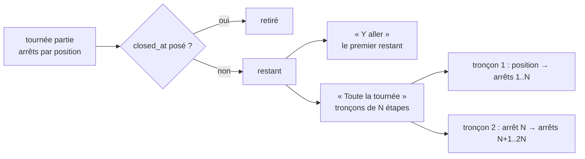

# « Y aller » et la position à la livraison

> 🟡 **État relevé le 2026-10-01** : **YA1 et YA2 sont bâtis**
> (`livraison/my-round-navigation.ts`, l'écran « Ma tournée »). Le texte
> d'origine (2026-09-30) disait « rien n'est bâti », « `closed_at` : rien ne
> l'écrit » et « pas de rôle `livreur` » ; c'est périmé : `closed_at` s'écrit
> (`close-stop-without-handover`, `DeliveryRound.closeStop`) et le rôle
> `livreur` existe, créé à l'écran avec `delivery_driving`
> ([`plan-ma-tournee.md`](plan-ma-tournee.md)). **YA3** (les arrêts clos
> disparaissent des liens) n'est pas déclaré bâti : `remainingStops` filtre déjà
> `closedAt`, mais la chaîne n'a pas été relue de bout en bout. **YA4** (la
> position au geste) : aucun code ne lit la position du téléphone — non bâti.
> Les tableaux ci-dessous restent le relevé du 2026-09-30.

> 📐 **Plan** (2026-09-30) — _en partie bâti, voir le bandeau ci-dessous_. Hugo : « ajoute le niveau 1 GPS et
> Y aller aux plans, pense à la découpe du parcours en étapes ; idéalement, si
> on relance le Y aller après avoir quitté l'app de nav, ça enlève les étapes
> déjà faites (se baser sur livraisons effectuées) ».

## 1. Ce qui existe, relevé le 2026-09-30

| Élément                        | Où                                                                                   | État                                                                          |
| ------------------------------ | ------------------------------------------------------------------------------------ | ----------------------------------------------------------------------------- |
| Lien carte par arrêt           | `livraison/run-sheet.ts` `mapHrefOf` : `google.com/maps/search/?api=1&query=lat,lng` | ✅ une **recherche** (un point), pas un itinéraire                            |
| Point GPS d'un arrêt           | carnet d'adresses (`deliverySpecs.gps`), lu par la feuille de route                  | ✅ seulement si la commande est reliée au carnet                              |
| Ordre des arrêts d'une tournée | `delivery_round_stop.position`                                                       | ✅                                                                            |
| **Arrêt livré**                | `delivery_round_stop.closed_at`                                                      | 🔴 **la colonne existe, rien ne l'écrit** : « posé au lot 6 par `closeStop` » |
| Lot 6 — la porte               | [`todo-la-porte.md`](todo-la-porte.md)                                               | ⏸ **en dette** depuis le 2026-09-29, conception tranchée                      |
| Position du téléphone          | —                                                                                    | ❌ aucun code ne la lit                                                       |
| Rôle livreur                   | —                                                                                    | ❌ pas de rôle `livreur` (tranché au lot 6)                                   |

**Conséquence directe** : « enlever les étapes déjà faites en se basant sur les
livraisons effectuées » et « la position à la livraison » s'accrochent **tous
les deux** au geste de livraison du lot 6. Ce plan ne l'invente pas : il
s'appuie sur `closed_at`, et dit ce qui se bâtit avant et après.

## 2. Décisions

### YA-D1 — Deux boutons, un calcul

Sur l'écran du chauffeur, pour une tournée **partie** :

- **« Y aller »** sur la carte de l'arrêt **suivant** : la navigation vers ce
  seul arrêt. Un arrêt à la fois, c'est ce que suivent les chauffeurs, et c'est
  le seul format que Waze accepte.
- **« Toute la tournée »** en tête : l'itinéraire des arrêts **restants**, dans
  **notre** ordre, découpé en **tronçons**.

Les deux partent de la même liste : **les arrêts vivants de la tournée, dans
l'ordre de passage, sans ceux dont `closed_at` est posé**. Relancer après avoir
quitté l'application de navigation relit cette liste : ce qui est livré a
disparu, sans rien mémoriser dans le téléphone.

### YA-D2 — La découpe en tronçons

Le lien d'itinéraire Google (Maps URLs, `maps/dir/?api=1`, sans compte ni clé)
prend une **destination** et des **étapes** (`waypoints`), dans l'ordre donné —
Google ne les réordonne pas, et c'est voulu : notre ordre tient les créneaux.

- Un tronçon = au plus `MAX_WAYPOINTS` étapes + la destination.
- **Départ** : absent (Google part de la position du téléphone). Le tronçon
  suivant part du dernier arrêt du précédent.
- Le **retour au labo** n'est pas une étape : c'est un tronçon à part,
  « Rentrer », proposé quand plus rien ne reste.
- Chaque étape par son **point GPS** quand il est connu ; sinon par l'adresse
  en texte. Un point GPS est plus sûr en montagne ; une adresse texte se
  signale sur la carte (« position approximative »).

⚠️ **`MAX_WAYPOINTS` n'est pas vérifié.** La limite des étapes dans un lien
Google varie selon qu'il s'ouvre dans l'application, dans un navigateur mobile
ou sur ordinateur, et la documentation publique la situe autour de 9 dans le
meilleur cas, moins sur navigateur mobile. **À mesurer en tête de lot** sur
l'iPhone du livreur (appli Google Maps installée et non installée) ; la valeur
retenue est une constante nommée, avec la date de la mesure.

### YA-D3 — Le choix de l'application

Un réglage **par appareil** (stocké dans le navigateur, pas en base) :
Google Maps (défaut), Apple Plans, Waze.

| Application | « Y aller » | « Toute la tournée »                              |
| ----------- | ----------- | ------------------------------------------------- |
| Google Maps | ✅          | ✅ tronçons                                       |
| Apple Plans | ✅          | ⚠️ une destination par lien — le bouton se cache  |
| Waze        | ✅          | ❌ une destination seulement — le bouton se cache |

### YA-D4 — La position à la livraison (« niveau 1 »)

**Une** position par arrêt, prise **au geste de livraison** du lot 6
(`closeStop`), jamais en continu :

- trois colonnes nullables sur `delivery_round_stop` : `closed_lat`,
  `closed_lng`, `closed_accuracy_m` — **migration additive** ;
- lue par l'API de géolocalisation du navigateur **au moment du geste** ; un
  refus ou une absence de signal **n'empêche pas** de livrer : la position reste
  nulle et l'écran le dit (« position non relevée ») ;
- **aucun relevé hors du geste** : ni pendant le trajet, ni pendant les pauses,
  ni après le retour.

Ce qu'elle apporte :

- sur « Planifier » et la feuille de route, pour le jour : « livré au Refuge
  1950 à 9 h 42 », le prochain arrêt, et l'heure estimée des suivants (le
  calculateur a déjà les temps de trajet) ;
- l'écart entre la position relevée et le point GPS du carnet : un point
  faux se voit à la première livraison (« relevé à 480 m du point du carnet —
  corriger le carnet ? »).

**Cadre (géolocalisation de salariés, CNIL)** — à faire valider, pas tranché
ici : finalité écrite (suivre l'avancement d'une tournée, corriger les points
du carnet) ; livreurs informés avant la mise en service ; **purge des positions
au-delà de `POSITION_RETENTION_DAYS`** (proposé : 60) ; position jamais
utilisée pour mesurer une vitesse ou un temps de travail. La purge est un
**effacement de colonnes**, pas de lignes : l'arrêt livré reste.

## 3. Les lots

| Lot     | Contenu                                                                                                                                                                                    | Dépend de               |
| ------- | ------------------------------------------------------------------------------------------------------------------------------------------------------------------------------------------ | ----------------------- |
| **YA1** | Mesure de `MAX_WAYPOINTS` sur l'iPhone ; fonctions pures « arrêts restants » et « tronçons » + liens Google / Apple / Waze, testées ; le réglage d'application                             | rien                    |
| **YA2** | Écran chauffeur : « Y aller » sur l'arrêt suivant, « Toute la tournée », « Rentrer ». **Avant le lot 6**, rien n'est `closed_at` : les boutons partent du premier arrêt, et l'écran le dit | YA1                     |
| **YA3** | Les arrêts livrés disparaissent des liens                                                                                                                                                  | **lot 6** (`closeStop`) |
| **YA4** | Position au geste : migration additive, relevé, affichage, écart au carnet, purge                                                                                                          | **lot 6**               |

YA1 et YA2 se bâtissent tout de suite. YA3 est une ligne de filtre qui attend
que quelqu'un écrive `closed_at`. YA4 se bâtit **avec** le lot 6, dans le même
geste.

## 4. Questions ouvertes

| #         | Question                                                                                                            | Proposé                                                                                                                      |
| --------- | ------------------------------------------------------------------------------------------------------------------- | ---------------------------------------------------------------------------------------------------------------------------- |
| **YA-Q1** | Avant le lot 6, un bouton « **Je suis passé** » (sans preuve) pour faire avancer les liens ?                        | **Non** : ce serait un second « livré », sans preuve, que le lot 6 devrait ensuite réconcilier. Le lot 6 se débloque plutôt. |
| **YA-Q2** | Une livraison **ratée** (lot 6 c) : l'arrêt sort-il des liens ?                                                     | Oui : il est clos, raté. La relivraison est une autre tournée.                                                               |
| **YA-Q3** | Durée de conservation des positions                                                                                 | 60 jours, à faire valider.                                                                                                   |
| **YA-Q4** | Page de confidentialité : annoncer la navigation par un service tiers (Google, Apple, Waze) et la position au geste | Oui, **avant** la mise en service, comme pour le géocodage.                                                                  |
