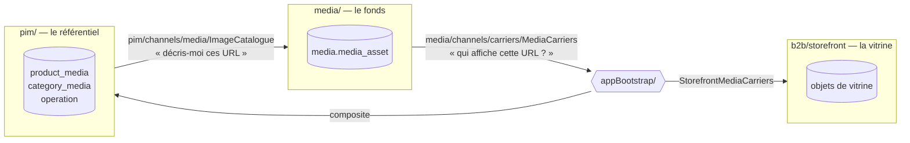
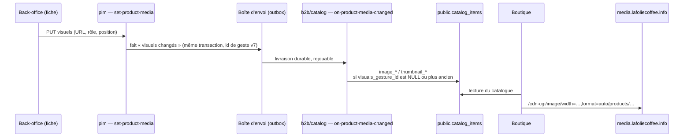

# La médiathèque — état des lieux

> **Doc technique, écrite le 2026-10-10 contre le code** (`dev` = `8560a5be1`).
> Chaque affirmation sur l'existant a été ouverte dans le dépôt ce jour-là.
>
> Elle **remplace** neuf documents, retirés le même jour : l'ancienne doc
> d'architecture et son TODO, le versant référentiel des images, la note
> d'infrastructure du stockage des images, le TODO du poids des images, et les
> quatre plans exécutés. Des migrations appliquées citent encore ces plans
> par leur nom : elles ne se retouchent pas, et leur texte se retrouve dans
> l'historique git (ce document les remplace tous).
>
> Ce qui reste à faire est au §11, et **nulle part ailleurs**.

---

## 1. Ce que c'est

Le **fonds d'images de la maison**. Il n'appartient à aucun de ceux qui
l'affichent : les fiches produit, les familles, les opérations datées et les
objets de la vitrine du commerce y **choisissent** des images. Aucun d'eux
n'en dépose.

| Couche       | Où                                                                               |
| ------------ | -------------------------------------------------------------------------------- |
| Bloc backend | `apps/lfd-api/src/media/`, monté par `MediaModule`                               |
| Schéma       | Postgres `media` : `media_asset`, `media_upload_failure`                         |
| Routes       | `/media` (staff), `/admin/media/sweep` (cron)                                    |
| Droit        | `media_library` (`read` pour `GET`, `write` pour le reste)                       |
| Écran        | back-office `/mediatheque` (`apps/lfd-backoffice-frontend/src/app/mediatheque/`) |
| Octets       | bucket R2 `lfc-media`, servi par `https://media.lafoliecoffee.info`              |
| Contrats     | `@lfd/pim-contracts` (`media.ts` : vues, limites, payloads)                      |

---

## 2. L'identité d'une image est son URL

`products/{SHA-256}.{ext}` : la clé de stockage **est** le hachage du contenu
(`DepositImageHandler`, préfixe `products` en dur, le nom est historique).
`media_asset.url` est `@unique`.

Il en découle trois propriétés :

- **la déduplication est gratuite** : les mêmes octets tombent sur la même
  ligne ;
- **un redépôt est idempotent** : reprendre un lot à moitié échoué ne
  duplique rien — le dépôt répond `alreadyInLibrary` et n'écrit rien (vrai
  depuis le 2026-10-10 seulement : avant, un `create` sur l'URL unique
  rendait un 409) ;
- **l'identité est stable** : tous les porteurs désignent l'image par son URL,
  jamais par l'identifiant de ligne.

⚠️ **La contrepartie : on ne peut pas « remplacer » une image.** Retoucher une
photo donne d'autres octets, donc une autre URL. Les porteurs restent sur
l'ancienne (§11).

⚠️ **Ce qu'un redépôt ne rend pas** : l'étiquette, les mots-clés,
l'alternative et le point focal. Ils décrivent l'image, pas ses octets. **Et
il ne change pas sa série** : une image garde celle de son premier dépôt (D2).

---

## 3. Les frontières



**Deux canaux, un par sens**, et aucun bloc ne lit la table de l'autre
(`lint:prisma-model-ownership`) :

| Canal                      | Déclaré par    | Implémenté par                                                                                                                            |
| -------------------------- | -------------- | ----------------------------------------------------------------------------------------------------------------------------------------- |
| `pim/channels/media/`      | le référentiel | la médiathèque (`PrismaImageCatalogue`)                                                                                                   |
| `media/channels/carriers/` | la médiathèque | le référentiel (`PrismaMediaCarriers` : fiches, familles, opérations) **et** la vitrine (`StorefrontMediaCarriers`, dans `appBootstrap/`) |

`appBootstrap/composite-media-carriers.ts` interroge **tous** les porteurs et
additionne leurs réponses. 🔴 **Il échoue dès qu'un seul échoue.** Un porteur
muet ne vaut pas « zéro emploi » : sans cette règle, une panne de port
deviendrait un effacement de masse.

La surface Prisma du bloc (`MediaPrismaService`) ne déclare que ses deux
modèles.

### Ce que le bloc prend ailleurs

**Rien au référentiel, hors de son canal** : `lint:context-boundaries` borne
`media→pim` à `pim/channels/media/` depuis le 2026-10-10. Les briques
techniques viennent de `platform/` :

| Brique                                     | Où                                   |
| ------------------------------------------ | ------------------------------------ |
| le laissez-passer d'écriture du journal    | `platform/journal/scoped-journal.ts` |
| les identifiants UUID v7 (`UuidGenerator`) | `platform/id/uuid-generator.ts`      |
| la mécanique du texte en plusieurs langues | `platform/i18n/localized-text.ts`    |
| la lecture des colonnes `jsonb`            | `platform/database/json-columns.ts`  |

La **liste** des langues, elle, reste au contrat (`LOCALES`, `SOURCE_LOCALE`
de `@lfd/pim-contracts`) : `platform/` n'importe aucun contrat métier, et
chaque bloc lui passe ses langues en donnée (`MEDIA_LANGUAGES`,
`media/domain/value-objects/alt-text.ts`).

---

## 4. Le modèle

```
media.media_asset
  id            uuid v7
  url           UNIQUE — l'identité
  name          l'étiquette, "" par défaut
  alt           jsonb { fr: …, en: … } — UNE alternative par image
  tags          text[] — index GIN media_asset_tags_idx, déclaré au schéma
  focal_x/_y    fractions 0..1 depuis le coin haut-gauche, NULL = « personne ne s'est prononcé »
  series_id     → media_series, NULL = sans série (ON DELETE RESTRICT)
  storage_key, content_type, width, height, bytes
  created_at

media.media_series              d'où viennent les images
  id, title (≤ 120), shot_on (jour, jamais futur), note (≤ 2000), created_at

media.media_upload_failure      les dépôts refusés, 90 jours
  file_name, reason (français), code, bytes?, content_type?, actor_name?, occurred_at
```

### Ce qui appartient à l'image, et ce qui appartient à l'emploi

C'est la règle de partage, et elle décide de tout le reste :

| À l'IMAGE (`media_asset`)                                      | À l'EMPLOI (la table du porteur) |
| -------------------------------------------------------------- | -------------------------------- |
| étiquette, mots-clés, **alternative**, point focal, dimensions | URL, **rôle**, **position**      |

🔴 **L'alternative est sur l'image** (Hugo, 2026-09-23 : « un seul point dans
la médiathèque »). La corriger change ce que toutes les fiches en disent, et
c'est voulu. Le panneau Visuels de la fiche n'en porte donc plus.

Une image a **une** ligne : la lecture ne regroupe rien, la page est un
`findMany` trié par date de dépôt (départagé par l'URL), le total un `count()`.

---

## 5. Les gestes

| Geste                            | Route                                                          | Où, à l'écran                      | Ce qu'il tient                                                                                                                                                                                                                                                                                                              |
| -------------------------------- | -------------------------------------------------------------- | ---------------------------------- | --------------------------------------------------------------------------------------------------------------------------------------------------------------------------------------------------------------------------------------------------------------------------------------------------------------------------- |
| Parcourir, trier, filtrer        | `GET /media?after=&sort=&q=&tags=&from=&to=&untagged=&unused=` | médiathèque (le fil), sélecteur    | par **curseur** (`next`), jamais par décalage : un dépôt pendant qu'on défile ne crée ni doublon ni saut. Tris : dépôt, étiquette (vides en dernier), emplois. `tags` filtre par `hasEvery`. Les emplois venant des porteurs, le tri par emplois et « inutilisées » classent en mémoire, bornés à 5000 images (409 au-delà) |
| Déposer                          | `POST /media` (multipart)                                      | **médiathèque seulement**          | PNG, JPEG ou WebP, lu dans les octets ; 10 Mo ; 200 px de côté au moins ; garde de transport à 25 Mo                                                                                                                                                                                                                        |
| Voir les refus                   | `GET /media/failures`                                          | médiathèque                        | l'historique survit au rechargement ; il ne **rejoue** pas, puisque l'octet n'a pas été stocké                                                                                                                                                                                                                              |
| Nommer, taguer, décrire, pointer | `PUT /media`                                                   | médiathèque                        | les tags sont découpés, mis en minuscules et dédoublonnés (`mediaTags`)                                                                                                                                                                                                                                                     |
| Le vocabulaire                   | `GET /media/tags`                                              | la bande de tags                   | chaque mot du fonds ENTIER et son nombre d'images — jamais la page chargée                                                                                                                                                                                                                                                  |
| Renommer, fusionner un mot       | `PUT /media/tags/rename`                                       | menu de la pastille                | partout, en une unité ; la fusion avec un mot existant est annoncée avant de valider                                                                                                                                                                                                                                        |
| Retirer un mot partout           | `DELETE /media/tags?tag=`                                      | menu de la pastille                | confirmation avec le compte ; les images restent                                                                                                                                                                                                                                                                            |
| Qui l'affiche ?                  | `GET /media/carriers?url=`                                     | médiathèque                        | les porteurs, nommés et cliquables, pas un simple compte                                                                                                                                                                                                                                                                    |
| Retirer du fonds                 | `DELETE /media?url=`                                           | médiathèque                        | **409 dès qu'un porteur l'affiche**, avec leur nombre                                                                                                                                                                                                                                                                       |
| Choisir, donner un usage         | `PUT` du porteur                                               | fiche, famille, opération, vitrine | le porteur écrit sa propre table de rattachement ; il ne touche jamais le fonds                                                                                                                                                                                                                                             |

🔴 **On ne dépose qu'à la médiathèque**, et c'est un choix de métier. Celui qui
alimente et tague le fonds n'est pas celui qui rédige les fiches. Un dépôt
offert au rédacteur remplirait le fonds d'images non taguées, donc
introuvables. Les clients HTTP du référentiel n'ont plus de méthode de dépôt :
le geste y est inexprimable.

### Le fil à l'écran

Une barre d'outils (recherche, tri, période, « Non taguées », « Inutilisées »,
mots-clés filtrés, compte) au-dessus d'une grille qui charge la page suivante
en approchant du bas. Sous le tri par dépôt, des intercalaires de mois à
l'heure de Paris — jamais par tag, une image y paraîtrait plusieurs fois (D4).
L'adresse porte la vue, sans le curseur.

### Les séries

Une série dit l'**origine** d'un lot d'images : « Shooting carte 2026 », sa
date de prise de vue, sa note d'intention. Facultative au dépôt (D3) ; une
image en a au plus une, celle de son premier dépôt (D2).

| Geste                  | Route                        | Ce qu'il tient                                                              |
| ---------------------- | ---------------------------- | --------------------------------------------------------------------------- |
| Lister                 | `GET /media/series`          | avec le nombre d'images, prise de vue décroissante                          |
| Ouvrir, corriger       | `POST` / `PUT /media/series` | prise de vue future refusée — faute de frappe, et tête du tri pour toujours |
| Déposer dans une série | `POST /media` (`seriesId`)   | vérifiée AVANT d'écrire au bucket ; un redépôt garde sa série               |
| Rattacher, détacher    | `PUT /media` (`seriesId`)    | un id rattache, `null` détache, l'absence ne change rien                    |

À l'écran : la série du lot se choisit au-dessus de la zone de dépôt, le
compte rendu dit « déjà au fonds — série X » sans alarme, une pastille de
série paraît sur les tuiles et dans le panneau, et le fil se filtre par
série et se trie par prise de vue (intercalaires par série). Le poste vérifie
type, poids et dimensions avant d'envoyer, avec les phrases du serveur, qui
reste l'autorité. Pas de suppression de série.

### Les tags à l'écran

Une **pastille unique** (`tag-chip`) sert partout : bande (mot et compte,
menu intégré), tuile (×), filtre, panneau de l'image (mots portés et
suggestions). Retirer un mot d'une tuile est immédiat et s'annule pendant six
secondes (D1 du plan). Chaque geste de tags renvoie l'alternative de l'image
telle qu'elle est : le serveur lit une alternative **absente** comme effacée
(c'est ainsi que le panneau la vide), et ces gestes l'ont effacée jusqu'au
2026-10-10.

⚠️ Renommer n'est pas verrouillé ligne à ligne (pas de SQL brut sur le fonds) :
un enregistrement de tags concurrent peut écraser le renommage. La fenêtre est
celle d'une transaction courte, et elle est écrite dans le handler.

Le dépôt en lot (`batch-upload.ts`) est **séquentiel**. Il ne s'arrête jamais
sur un refus et garde les `File` refusés pour qu'on puisse les rejouer. Il est
séquentiel parce que le serveur tient les octets en mémoire pour les mesurer.

L'URL passe en paramètre de requête plutôt que dans le chemin, parce qu'elle
contient des `/`.

### Le droit

`media_library` ne vient **pas** de `pim_catalog`. Depuis la migration
`20260923200000`, seuls `admin` et `communication` l'ont, en écriture. Pour
`commercial`, `comptabilite` et `dev`, le bouton « Choisir dans la
médiathèque » d'une fiche rend 403. Le rôle `communication` a aussi
`pim_catalog:read` : sans lui, les liens vers les porteurs mèneraient à un 403.

---

## 6. Les usages d'un visuel sur une fiche

`MediaRole` : `hero`, `thumbnail`, `gallery`, `lifestyle`, `print`.

| Rôle        | Cardinalité | Ratio annoncé | Traverse vers le commerce | Lu par                                       |
| ----------- | ----------- | ------------- | ------------------------- | -------------------------------------------- |
| `hero`      | un seul     | 4/3           | ✅ `image`                | ouverture de fiche ; tuile de rayon en repli |
| `thumbnail` | un seul     | 4/3           | ✅ `thumbnail` (fil v10)  | tuile de rayon                               |
| `gallery`   | plusieurs   | —             | ❌                        | personne                                     |
| `lifestyle` | plusieurs   | 16/9          | ❌                        | personne                                     |
| `print`     | plusieurs   | 1/1           | ❌                        | personne                                     |

- **L'unicité appartient au verbe.** `setMediaRole` déloge en une seule mise à
  jour celui qui portait le même rôle unique, et seulement lui.
- **La fourche `hero` / `thumbnail` est tranchée.** Les deux traversent, et la
  boutique retombe sur `hero` quand la fiche n'a pas de vignette
  (`thumbnailOf` dans `prisma-catalog.reader.ts`).
- 🔴 **Le rôle par défaut ne voyage nulle part, et l'écran le dit.** Une
  image choisie sans rôle prend `gallery` (`DEFAULT_MEDIA_ROLE`), qui ne
  traverse pas. Rien n'est décidé à la place de qui photographie (Hugo,
  2026-10-10, option B), mais depuis ce jour :
  - une tuile en usage non publié porte la pastille « Non publié » (jamais
    sur un visuel de famille, qui n'a pas d'usage) ;
  - le panneau d'usage le dit au moment du choix ;
  - une fiche qui a des visuels et aucun publié affiche un avertissement
    au-dessus de la grille.

  La liste des usages publiés est `PUBLISHED_MEDIA_ROLES`
  (`apps/lfd-backoffice-frontend/src/app/pim/catalogue/media-roles.ts`) : elle
  recopie ce que `showcase.ts` fait traverser, et doit le suivre.

- **Les formats se signalent, ils ne se refusent jamais** (L5, 2026-10-10).
  Une seule table, `pim/catalogue/media-formats.ts` du back-office, recopiée
  des feuilles de style de la boutique : ouverture et vignette 4/3 (l'ancien
  libellé « 3/2 » était faux), mise en situation 16/9, tirage 1/1 ; cadres
  d'aperçu 4/3, 1/1, 16/9, 21/9. Au-delà de 8 % d'écart entre l'image et son
  usage, le panneau d'usage le dit et la tuile porte « Format ». ⚠️ Cette
  table recopie la boutique : changer un `aspect-ratio` là-bas demande de la
  suivre ici.

---

## 7. Le trajet d'une image jusqu'à la boutique



- **Changer une photo ne demande plus de republier.** La projection vive passe
  par un abonné **durable** (`ProductMediaChanged`, lot E5 du 2026-10-10).
  L'ordre est tenu par `visuals_gesture_id` (migration
  `20261010120000_l_ordre_des_visuels`) : un fait plus ancien rejoué après un
  plus récent ne l'écrase pas.
- **Deux écrivains, et c'est voulu.** Un push (ingestion d'un instantané)
  réécrit aussi `image_*` et `thumbnail_*`. Les deux lisent la même source :
  la projection fait la fraîcheur, le push fait la réparation. Une image qui
  « revient » après une publication n'est pas un défaut.
- **Le point focal voyage** (L4, 2026-10-10). `ImageCatalogue` le rend ; le
  fait des visuels et le fil (`syncMediaSchema.focal`, facultatif, sans
  changer de version) le portent ; `catalog_items` le range en
  `image_focal_x/y` et `thumbnail_focal_x/y` (migration
  `20261010200000_le_point_focal_voyage`) ; la boutique pose
  `object-position` sur la tuile et l'ouverture de fiche — au centre quand il
  est absent.
- **Redécrire une image fait suivre la boutique.** Quand l'alternative ou le
  point focal changent, `SaveMediaDetailsHandler` écrit le fait durable
  `media.asset_described` (`media/channels/carriers/`) dans sa transaction ;
  le référentiel l'écoute (`on-media-asset-described.ts`, `@DurableHandler`)
  et réannonce `pim.product_media_changed` pour chaque fiche qui porte l'URL
  en `hero` ou `thumbnail`. Ni familles, ni opérations, ni vitrine : elles
  n'ont pas de copie projetée.
- **La boutique garde une copie de l'URL** : le snapshot vaut aussi pour
  l'image. Repointer le référentiel ne repointe la boutique que par l'un de
  ces deux chemins.
- **Le poids.** La boutique ne sert jamais l'original : `media-source.ts`
  demande une transformation Cloudflare à la largeur affichée, avec un
  `srcset`. Mesures, réglages et repli silencieux :
  [`../ops/cloudflare-images.md`](../ops/cloudflare-images.md) §3.

---

## 8. Stockage et service

Les octets vivent dans le bucket R2 `lfc-media`, servis par
`media.lafoliecoffee.info` ; l'API dépose, la lecture ne passe jamais par
nous. Tout ce qui se règle chez Cloudflare — bucket, domaine, TLS, jeton et
variables, transformations, cache immuable, coût, vérifications — est
rassemblé dans [`../ops/cloudflare-images.md`](../ops/cloudflare-images.md).

---

## 9. Le ramassage des orphelines

Un cron Cloudflare (`apps/lfd-api/wrangler.jsonc`, `30 3`, via
`container/worker.ts`) poste sur `/admin/media/sweep`, derrière le
`RecomputeGuard` :

- **candidates** : les images de plus de **7 jours** sans aucun porteur, au
  plus **200** par passage. Le rapport porte `capped` quand le plafond a mordu ;
- **juste avant chaque suppression, il recompte.** La fenêtre de course n'est
  pas fermée pour autant : elle tombe à quelques millisecondes ;
- **il supprime l'objet R2 d'abord, la ligne ensuite.** Dans l'ordre inverse,
  un échec sur R2 effacerait la seule trace de ce qu'il reste à supprimer ;
- **il purge l'historique des refus** au-delà de **90 jours**.

---

## 10. Ce qui est journalisé

Trois faits, avec l'URL pour sujet :

- `media_asset.deposited` ;
- `media_asset.described` ;
- `media_asset.discarded`.

Ils se lisent sous le module **Médiathèque** du journal d'activité.

Les deux ports d'écriture (`MediaLibrary`, `MediaLibraryWriter`) exigent un
ticket de `platform/journal/scoped-journal.ts`. On n'obtient ce ticket qu'en
traçant, ou en nommant pourquoi on ne trace pas (`untraced`). Écrire sans
affirmer ne compile pas. `lint:journal-tracked` reconnaît un port d'écriture
à ce ticket, pas à son nom : un port neuf qui l'exige est audité d'office.

Le ramassage ne journalise rien, et c'est déclaré : une passe automatique n'a
pas d'auteur. Il présente le ticket `untraced("ramassage automatique, sans
auteur")`, et son rapport tient lieu de trace.

Les **refus de dépôt ne sont pas le journal** : leur sujet n'existe pas. Ils
s'inscrivent dans leur propre unité de travail, sinon le rollback du dépôt les
emporterait.

---

## 11. Les points à faire

La **dette** a été soldée le 2026-10-10 (encadré ci-dessous). Ce qui reste
est de l'**amélioration** : des capacités que le fonds n'a pas encore. Les
lignes marquées 🔵 attendent une décision ou un constat de Hugo. Leur plan, avec les décisions de
Hugo : [`plan-la-mediatheque-amelioree.md`](plan-la-mediatheque-amelioree.md).

> **Soldé le 2026-10-10**
>
> - la lecture ne regroupe plus par URL, le total est un `count()` (`22b143e94`) ;
> - les justifications qui invoquaient une clé étrangère disparue (`22b143e94`) ;
> - le module « Médiathèque » du journal d'activité (`6ce533307`) ;
> - un seul générateur UUID v7, en `platform/id/` (`d00deda08`) ;
> - le texte localisé et les colonnes `jsonb` en `platform/`, `media→pim`
>   resserré sur le canal (`eb4d6e1ee`) ;
> - `lint:journal-tracked` reconnaît un port d'écriture à son ticket ;
>   `MediaLibrary` exige le sien (`eacb27232`) ;
> - l'index GIN déclaré au schéma, le doublon sur `url` retiré (`158bf9273`) ;
> - l'écran dit qu'un visuel en usage non publié n'apparaît nulle part (§6).

1. **Les visuels de l'accueil vivent hors du fonds.**
   - L'accueil public lit encore `MOCK_EVENT`, avec une URL Unsplash en dur
     (`apps/lfc-ecommerce-frontend/src/app/client/mock-event.ts`).
   - La porte « fournil » est une URL tierce dans `accueil-public.scss`
     (`$fournil`).

   Les opérations datées et la vitrine sont pourtant déjà porteuses : il reste
   à brancher l'écran.

2. **Le point focal n'a aucun lecteur.** Il se saisit, se range et voyage
   dans les contrats de la médiathèque, mais pas sur le fil du catalogue, et
   la boutique recadre au centre.
   - Le brancher : l'ajouter à la projection des visuels (le fait durable
     d'abord, le push ensuite), puis poser un `object-position` côté boutique.
   - C'est ce qu'attendent les cartes sans forme fixe de l'accueil.
   - ⚠️ Un `focal` **requis** sur le fil rendrait illisible une livraison en
     attente qui porte une image : il doit être optionnel.
3. **Remplacer une image sur place.** Concrètement : déposer (octets **hors**
   transaction), puis repointer tous les porteurs dans **une** unité.
   - Le repointage fusionne : un porteur qui affiche déjà les deux images
     produirait deux lignes identiques.
   - Il journalise : le port de repointage exigera un `WriteTicket`, et la
     porte l'auditera d'office.
   - Il laisse la projection faire suivre la boutique.
4. **La fenêtre du retrait.** `DiscardMediaHandler` compte les porteurs puis
   supprime : un porteur qui attrape l'image entre les deux afficherait une
   image disparue. La fenêtre est celle d'un aller-retour au bucket ; rien ne
   la ferme.
5. **Les ratios.** La décision est prise : signaler **à l'affectation**, pas
   refuser au dépôt. Le point focal existe justement pour que recadrer soit
   correct. `describe(urls)` rend déjà les dimensions.
6. **La pré-validation à l'écran.** Le type, le poids et les dimensions sont
   connus du navigateur avant l'envoi. Aujourd'hui, l'erreur revient du
   serveur, loin du geste.
7. **Le préfixe de clé s'appelle `products`** alors que le fonds sert tout
   porteur. C'est une valeur, pas un nom : il ne se renomme pas sans migrer
   les URL, et rien ne l'exige.
8. **🔵 Non vérifié depuis le dépôt** : la transformation d'images est-elle
   activée sur la zone ? (`onerror=redirect` masquerait qu'elle ne l'est
   pas.) Le ramassage a-t-il tourné en production, et `capped` a-t-il déjà
   mordu ? Un coup d'œil au tableau de bord et aux journaux du cron répond
   aux deux.
