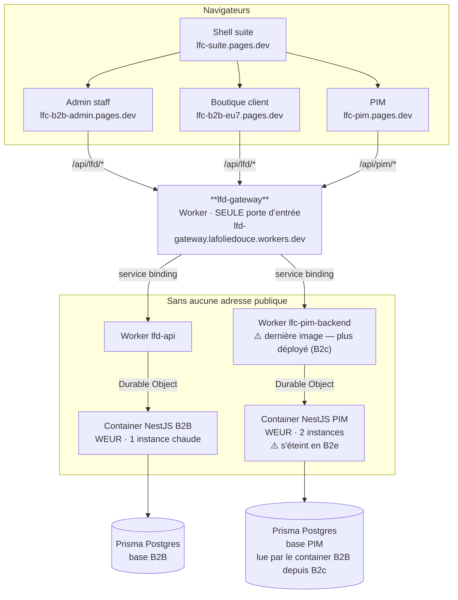
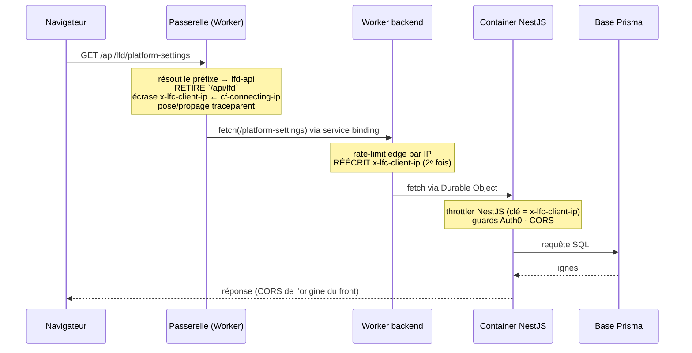
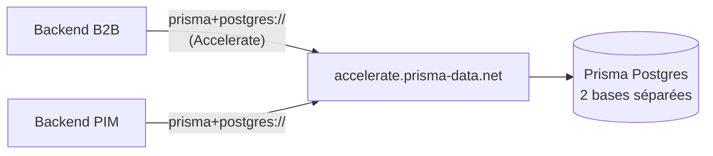

# Architecture de déploiement — ce qui tourne, et où

✅ **Décrit l'état réel au 2026-08-13**, chaque affirmation vérifiée contre la
plateforme (API Cloudflare, journaux de déploiement, requêtes réelles) et non
contre l'intention. Les points non vérifiés sont signalés comme tels.

## 1. La carte

Sept choses sont déployées : trois Workers Cloudflare et quatre projets Pages.

**Le point important est le cadre « sans adresse publique ».** Les deux Workers
de backend ont `"workers_dev": false` : ils ne répondent à personne sur
Internet. Seul le _service binding_ de la passerelle les atteint, et un binding
est un appel interne au compte Cloudflare, qui ne sort jamais sur le réseau.

> **2026-08-20** — le Worker a été renommé `lfc-b2b-backend` → `lfd-api` : il
> ne sert plus la seule surface B2B mais quatre. Les constats datés ci-dessous
> gardent l'ancien nom, qui était le vrai ce jour-là.

Vérifié le 2026-08-13 : `lfc-b2b-backend.lafoliedouce.workers.dev` → **404**,
la même route par la passerelle → **200**.

C'est ce qui fait de la passerelle une frontière et non une décoration. Tant
que les backends répondaient au monde, la contourner suffisait à ignorer tout
ce qu'elle applique.

## 2. Le chemin d'une requête

**Le préfixe est retiré avant transmission** : le backend ne sait pas qu'une
passerelle existe, et le jour où un domaine permettra de router par
sous-domaine, rien ne changera de son côté.

**L'en-tête d'IP est écrit deux fois, et ce n'est pas une redondance.** La
passerelle le pose parce qu'elle est la première à voir le client ; le Worker
backend le réécrit parce qu'il reste la frontière de confiance de son propre
périmètre. Si demain la passerelle disparaissait du chemin, le Worker
tiendrait toujours. Cf. [`securite-frontiere-de-confiance.md`](securite-frontiere-de-confiance.md).

## 3. Où tournent les containers, et pourquoi c'est écrit

Les deux containers sont **contraints à l'Europe de l'Ouest** :

| Réglage                              | Où                    | Nature                                    |
| ------------------------------------ | --------------------- | ----------------------------------------- |
| `constraints: { regions: ["WEUR"] }` | `wrangler.jsonc`      | **contrainte** d'ordonnancement           |
| `locationHint: "weur"`               | `container/worker.ts` | **indice** de placement du Durable Object |

Les deux sont nécessaires : le chemin a deux sauts (Worker → Durable Object →
container), et n'en corriger qu'un laisse l'autre où Cloudflare veut.

Sans ces réglages, l'instance vivait à **Dallas-Fort Worth** — un aller-retour
transatlantique sur chaque appel, pour une clientèle française. Ce n'était pas
un incident : le défaut Cloudflare place le container au plus près de _la
requête qui le démarre_, et ce qui le démarre est le cron de rafraîchissement,
qui s'exécute où Cloudflare veut.

Emplacement réel constaté après correction : **`lhr20`, Londres**. WEUR est la
maille la plus fine qui existe — il n'y a pas de « Paris ». Note que Londres est
**hors UE** : si une garantie de résidence des données devient nécessaire, le
levier est `jurisdiction: "eu"`, décision de conformité restée ouverte.

⚠️ **Un Durable Object ne change jamais d'emplacement après sa création**, et
l'indice n'est lu qu'au tout premier `get()` d'un id. Déplacer les instances a
donc exigé de les **renommer** (`primary` → `primary-weur`, `instance-N` →
`weur-N`). Gratuit ici parce que ces DO ne stockent rien ; sur un DO porteur
d'état, ce serait une migration.

## 4. Chauffage et capacité

|                 | B2B                       | PIM     |
| --------------- | ------------------------- | ------- |
| Instances max   | **1**                     | 2       |
| Instance        | `basic` (¼ vCPU, 1 Gio)   | `basic` |
| `sleepAfter`    | 1 h                       | 1 h     |
| Cron de chauffe | `*/5 * * * *` → `/health` | aucun   |

**Une seule instance côté B2B est un choix de routage, pas un plafond de
capacité.** Cloudflare n'offre aujourd'hui aucun routage sensible à la charge —
seulement `getRandom`, un tirage au sort. À trafic faible, deux instances
tirées aux dés donnent deux machines tièdes et une requête sur deux qui démarre
à froid ; une seule instance chaude fait strictement mieux.

`sleepAfter` est un **délai d'inactivité**, pas un maintien en éveil. C'est le
cron `*/5` qui empêche l'endormissement, en sollicitant l'instance plus souvent
qu'elle ne peut s'endormir.

L'ordre des leviers quand ça serrera, chacun sur une **mesure** et non par
anticipation : grossir l'instance (`standard-1`) avant de la multiplier ; et ne
passer à plusieurs instances qu'avec un vrai routage par charge.

## 5. Les bases

Les deux bases vivent dans le **même espace Prisma « La Folie Coffee »**, sous
le compte `dev@lafoliedouce.com`.

**Le schéma de l'URL choisit le transport**, et les deux backends branchent
dessus :

- `prisma+postgres://…` → **Accelerate** (pooling + cache) ;
- `postgres://…` → **adapter `pg`** (TCP direct), utilisé par les tests e2e.

⚠️ Ce branchement a coûté une panne. Le PIM montait `adapter-pg`
inconditionnellement : lui présenter une chaîne Accelerate donnait un
déploiement **vert**, une migration **réussie** (`prisma migrate` accepte les
deux formes) et un **500 à la première requête** — la connexion Prisma étant
paresseuse, le démarrage ne dit rien. Les deux services branchent désormais de
la même façon.

## 6. Ce qui n'existe pas, et qu'il faut savoir

|                                       | État                                                         |
| ------------------------------------- | ------------------------------------------------------------ |
| Zone Cloudflare                       | **aucune** — le compte n'héberge aucun domaine               |
| Domaine personnalisé                  | aucun ; tout est en `*.workers.dev` / `*.pages.dev`          |
| `lafoliecoffee.xyz`                   | **n'existe pas en DNS**                                      |
| `api-b2b` / `api-pim.lafoliedouce.eu` | **ne résolvent pas** ; `lafoliedouce.eu` est chez Proximedia |
| WAF, règles de rate limiting          | indisponibles — ce sont des produits **de zone**             |

Conséquence directe : le webhook Stripe déclaré sur `api-b2b.lafoliedouce.eu`
est **déjà mort**, indépendamment de nos changements. Et les audiences Auth0
qui portent ces noms sont des **identifiants**, pas des adresses : elles n'ont
pas besoin de résoudre, et les « corriger » invaliderait les jetons existants.

Amener un domaine sur Cloudflare est le prochain levier structurant : il
débloque le WAF, les règles de rate limiting, et des URL qui ne soient pas
`lafoliedouce.workers.dev`. Le jour venu, on repasse des préfixes de chemin aux
sous-domaines **sans toucher aux backends**.

## 7. À lire ensuite

- [`pipelines.md`](pipelines.md) — qui déclenche quoi, et dans quel ordre
- [`secrets-et-variables.md`](secrets-et-variables.md) — où vit chaque valeur
- [`securite-frontiere-de-confiance.md`](securite-frontiere-de-confiance.md) — le mur, ce qu'il tient et ce qu'il ne tient pas
- [`runbook.md`](runbook.md) — déployer, revenir en arrière, rouvrir une porte

## Le front client sous `lafoliecoffee.info/pro`

`/pro` est un **chemin**, pas un sous-domaine. Le choix a un coût qu'il vaut
mieux connaître :

|              | Sous-domaine `pro.`                         | Chemin `/pro`                                            |
| ------------ | ------------------------------------------- | -------------------------------------------------------- |
| Cloudflare   | un domaine personnalisé sur le projet Pages | une route de zone + la passerelle qui porte le préfixe   |
| L'app        | rien à changer                              | `baseHref: "/pro/"` dans la config de build `cloudflare` |
| Coque native | rien à changer                              | une build jumelle `capacitor`, `base href` à `/`         |

Les deux moitiés — le préfixe retiré par la passerelle, le `base href` porté par
l'app — doivent rester d'accord. L'une sans l'autre, ce sont des 404 sur tous
les assets.

### Ce qui est fait, et ce qui ne l'est pas

✅ Côté dépôt, tout est en place : `FRONT_PREFIXES` dans `gateway/src/routes.ts`,
la variable `PRO_FRONT_ORIGIN`, et la build de l'app sous `/pro`. Quatre tests
couvrent le routage, dont le cas `/production` qui ne doit PAS être capté.

✅ Côté compte, fait le 2026-08-27 :

1. **Le token pouvait déjà.** `LFD_GATEWAY` porte « Account · Workers Scripts ·
   Edit » **et** « All zones · Workers Routes · Edit » — vérifié dans le résumé
   du token. L'en-tête de `deploy_lfd_gateway.yml` n'annonçait que la première ;
   la note était incomplète, pas le token. Corrigée.
2. **La zone a un apex.** `AAAA lafoliecoffee.info → 100::`, **proxifié**.
   L'adresse appartient au bloc de rebut IPv6 : elle ne mène nulle part et n'a
   pas à mener quelque part, puisque c'est le Worker qui répond. Sans elle, une
   route de zone ne reçoit jamais de trafic.
3. **La route est déclarée** dans `gateway/wrangler.toml`.

⚠️ Elle ne s'attache qu'au **déploiement** de la passerelle : tant que le
dépôt n'est pas poussé, `lafoliecoffee.info/pro` ne répond pas.

### Deux pièges désamorcés en écrivant ceci

**L'adresse du projet Pages.** Le nom est `lfc-b2b`, mais Cloudflare a suffixé
son sous-domaine en silence : c'est `lfc-b2b-eu7.pages.dev` qui sert, et
`lfc-b2b.pages.dev` rend une build **plus ancienne** qu'aucun déploiement ne met
à jour. Vérifié le 2026-08-27 — les deux répondent 200, avec des `main-*.js`
différents. La passerelle ne réécrit donc pas l'adresse : elle lit
`PROD_FRONT_ORIGINS.b2bFront`, **la même constante que la liste CORS**. Le dépôt
a déjà payé ce piège une fois par une panne CORS complète et silencieuse ; deux
endroits qui écrivent l'adresse à la main le paieraient une deuxième.

**L'origine vue par le navigateur.** Servie sous `lafoliecoffee.info/pro`, l'app
présente `https://lafoliecoffee.info` — une origine n'a pas de chemin. Cette
entrée est ajoutée à `PROD_CORS_ORIGINS`.

🔴 **Auth0 a le même besoin, et il n'est pas dans ce dépôt.** `redirect_uri` vaut
`window.location.origin` : `https://lafoliecoffee.info` doit figurer dans les URL
de rappel autorisées de l'application Auth0. Oubliée, la connexion échoue **au
retour**, après avoir semblé partir — le genre de panne qu'on diagnostique une
heure.

### Ce qui bouge le jour où ça répond

Une seule ligne côté app : `server.url` dans
`apps/lfc-B2B-platform-frontend/capacitor.config.ts`, qui pointe encore sur
`https://lfc-b2b.pages.dev`. La note l'attend déjà sur place.
