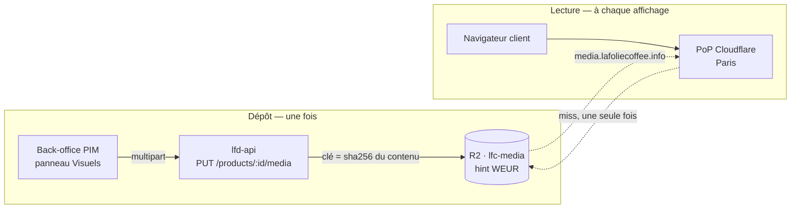

# Stockage et diffusion des médias — R2 derrière le cache Cloudflare

🟡 **Le code est écrit ; le bucket n'existe pas encore.** Tout ce qui relève du
dépôt — validation, adressage par contenu, route, écran — est en place et
testé. Ce qui manque est la création du bucket et de son domaine (§6), sans
quoi le dépôt refuse explicitement. Ce qui est vérifié l'est contre la
plateforme (DNS public, docs Cloudflare) et non contre l'intention.

Les visuels d'un produit étaient des **URL saisies à la main** dans le panneau
Visuels du PIM : rien n'était hébergé par nous, rien n'était validé, et une URL
qui tombe emportait l'image du catalogue. Cette note dit comment on héberge, et
ce que ça coûte.

---

## 1. Ce que le mot « CDN » recouvre ici

Le mot désigne trois choses différentes qu'on peut acheter séparément, et la
confusion coûte cher parce qu'on croit avoir à en installer un.

| Ce qu'on appelle « CDN »         | Ce que c'est vraiment                                       | Chez nous                                                  |
| -------------------------------- | ----------------------------------------------------------- | ---------------------------------------------------------- |
| **La copie près du visiteur**    | Le PoP qui garde l'octet en cache après la première demande | Automatique dès qu'on passe par la zone. Rien à installer. |
| **L'origine qui garde l'octet**  | Le stockage durable, un seul exemplaire                     | R2                                                         |
| **La transformation à la volée** | Redimensionnement, `webp`/`avif`, qualité                   | Cloudflare Images, à activer **par zone**, facturé         |

Ce qu'il faut retenir : **on n'installe pas un CDN « en France »**. On sert
depuis un domaine posé sur une zone Cloudflare, et le cache français existe tout
seul — le premier client parisien qui charge la photo la laisse à Paris pour les
suivants. Il n'y a aucun réglage géographique à faire pour ça.

La seule vraie question géographique est **où vit l'original**, et elle ne joue
que sur la latence du _miss_ et sur la conformité. Voir §4.

---

## 2. Le prérequis est déjà là — et deux docs disent le contraire

La diffusion publique de R2 se fait par un **domaine personnalisé**, ce qui
suppose une zone Cloudflare. Deux docs affirment qu'il n'y en a aucune :

- [`ops/README.md`](README.md) — « Aucune zone Cloudflare » et « Amener un
  domaine sur Cloudflare » en travaux ouverts ;
- [`gateway/wrangler.toml`](../../gateway/wrangler.toml) — tout le routage par
  préfixe de chemin est justifié par « le compte Cloudflare n'a aucune zone ».

**C'est périmé.** [`ops/mailer-resend.md`](mailer-resend.md) acte le 2026-08-16
le domaine `lafoliecoffee.info` sur une zone Cloudflare, et le DNS public le
confirme au 2026-08-21 :

```
$ dig +short NS lafoliecoffee.info
clint.ns.cloudflare.com.
haley.ns.cloudflare.com.
```

Aucun `MX` n'est encore posé (le mailer n'est pas fini) et `media` est libre.
Les deux affirmations ci-dessus sont corrigées dans le même commit que cette
note.

### Pourquoi il n'y a pas de solution sans domaine

Les deux contournements apparents échouent, et il faut savoir pourquoi pour ne
pas les retenter :

| Chemin                                    | Pourquoi il ne marche pas                                                                                                              |
| ----------------------------------------- | -------------------------------------------------------------------------------------------------------------------------------------- |
| Bucket public sur `…r2.dev`               | _Rate-limited_, « à usage de développement » selon Cloudflare. **Ni cache**, ni règles de cache, ni WAF.                               |
| Servir depuis un Worker sur `workers.dev` | La **Cache API est inerte** sur `*.workers.dev` : `cache.put()` réussit et ne stocke rien. Le Worker refetch l'objet à chaque requête. |

Le second est le piège dangereux : il _a l'air_ de marcher. Rien n'échoue, rien
n'avertit — seule la facture d'opérations R2 et la latence le disent.

---

## 3. Le chemin d'un octet



Le dépôt passe par l'API — parce qu'il faut un droit, une validation du contenu
et une écriture en base. La **lecture ne passe jamais par nous** : le domaine
média pointe directement sur le bucket. C'est ce qui rend le coût de service
indépendant de notre trafic backend, et l'égress R2 est facturé zéro.

---

## 4. Les quatre décisions

### 4.1 Un bucket distinct des KBIS, avec son propre jeton

Le commentaire de
[`env-readers.ts`](../../apps/lfd-api/src/platform/config/env-readers.ts)
anticipait exactement ce moment :

> « Le jour où un autre bucket sert à des assets publics, un jeton fuité depuis
> là ne doit pas ouvrir les papiers des clients. »

Ce jour est arrivé. `R2StorageUsage` passe de `"kbis"` à `"kbis" | "media"`, et
le jeton média n'ouvre que `lfc-media`. Un KBIS est une pièce d'identité
d'entreprise ; une photo de viennoiserie est publique par construction. Les
mettre dans le même bucket ferait porter au même secret deux niveaux de
sensibilité sans rapport.

**Ce qui se réutilise, et ce qui ne se réutilise pas.** Le transport se partage
en entier : `S3StorageService`, `sniffContentType` (type déduit des **octets**,
jamais de l'annonce du client), `sanitiseFileName`. Le service, lui, est
l'inverse point par point — et aucune ligne de la chaîne KBIS ne survit en aval
du dépôt :

|                   | KBIS                        | Média produit           |
| ----------------- | --------------------------- | ----------------------- |
| Accès             | privé, URL signée expirante | public, URL stable      |
| Disposition       | `attachment` **forcé**      | `inline`                |
| Cache             | jamais                      | pour toujours           |
| Chemin de lecture | à travers l'API             | direct depuis le bucket |

### 4.2 La clé est le hash du contenu

`products/{sha256}.{ext}`. Trois conséquences, dans cet ordre d'importance :

1. **Le cache devient honnête.** On peut poser
   `Cache-Control: public, max-age=31536000, immutable` sans mentir : un contenu
   différent produit une clé différente. Il n'y a **jamais** de purge à
   déclencher, et donc jamais de bug « j'ai remplacé l'image et l'ancienne
   s'affiche encore » — celui qu'on découvre toujours en production, chez un
   seul client, un vendredi.
2. **La déduplication est gratuite.** Le même visuel déposé sur douze produits
   occupe un objet.
3. Le nom du fichier d'origine ne va jamais dans la clé, donc rien de ce que
   tape un utilisateur ne devient une adresse publique.

Le prix à payer est qu'un objet ne se supprime que lorsque **plus aucun**
produit ne le référence — le comptage remplace la suppression en cascade. C'est
le vrai correctif de la dette actuelle : `replaceMedia` détache déjà sans
supprimer, et laisse des `MediaAsset` orphelins s'accumuler.

### 4.3 Le hint `WEUR`, pas la juridiction `eu`

> **Conséquence non anticipée, découverte à la création (2026-08-22).** Deux
> buckets de juridictions différentes n'ont pas le même **endpoint S3** :
> `…{compte}.eu.r2.cloudflarestorage.com` pour le KBIS, `…{compte}.r2.cloudflarestorage.com`
> pour les médias. Le code n'avait qu'un `R2_ENDPOINT`, documenté comme « un
> fait du COMPTE » — c'était faux, et le premier dépôt aurait échoué sur une
> erreur S3 opaque. L'endpoint est désormais **par usage** (`R2_KBIS_ENDPOINT`,
> `R2_MEDIA_ENDPOINT`), avec repli sur la valeur commune.

Les deux sont **irréversibles à la création** du bucket, ce qui justifie de
trancher ici plutôt qu'au moment du clic.

|                  | Ce que ça garantit                                        | Coût                                |
| ---------------- | --------------------------------------------------------- | ----------------------------------- |
| Hint `WEUR`      | _Best-effort_ : l'original est placé en Europe de l'Ouest | aucun                               |
| Juridiction `eu` | Garantie de résidence, endpoint dédié                     | contrainte permanente, bucket isolé |

**On prend le hint, pas la juridiction.** Des photos de produits ne sont pas des
données personnelles : la juridiction poserait une contrainte définitive pour un
bénéfice nul. Elle aurait du sens sur le bucket **KBIS** — qui a été créé sans,
et qu'on ne peut donc plus y basculer sans recréer et recopier. À traiter
séparément si la question se pose.

Le hint ne joue de toute façon que sur le _miss_ : une fois l'objet en cache à
Paris, l'emplacement de l'original ne se voit plus.

### 4.4 Les dérivés viennent après

Servir l'original de 4 Mo dans une vignette de tableau est le défaut évident du
plan minimal. Cloudflare Images le corrige — mais c'est un service **à activer
par zone** et **facturé à la transformation unique par mois**.

On le branche dans un second temps, une fois de vraies images en base et un
volume observable. Décider maintenant du format et des tailles reviendrait à
choisir sans données ; et le plan reste ouvert parce que la transformation ne
touche ni le stockage, ni les clés, ni le modèle — seulement l'URL construite à
l'affichage.

---

## 5. Le modèle de données

`MediaAsset` porte aujourd'hui `id`, `url`, `alt`, `focalX/Y`. Il ne sait **pas
ce qu'il stocke** : ni le type, ni les dimensions, ni la taille, ni si l'octet
est chez nous ou chez un tiers.

| Champ à ajouter         | Ce que ça débloque                                                                                        |
| ----------------------- | --------------------------------------------------------------------------------------------------------- |
| `storageKey` (nullable) | Distinguer notre objet d'une URL externe. `null` ⇒ URL saisie, héritée.                                   |
| `contentType`           | Servir juste, et refuser à la relecture ce qu'on a refusé au dépôt                                        |
| `width` / `height`      | Le front **réserve le ratio** avant chargement — sans ça, la fiche produit saute au chargement des images |
| `bytes`                 | Mesurer, et décider des dérivés sur des chiffres                                                          |

`url` **reste** : elle est ce que consomment le front et les canaux, et sa
valeur devient dérivée (`https://media.lafoliecoffee.info/{storageKey}`) au lieu
d'être saisie. Les URL externes déjà en base continuent de fonctionner sans
migration de contenu — c'est ce que le `storageKey` nullable achète.

---

## 5 bis. Le ramassage des orphelins

Rien ne supprime un objet au fil de l'eau, et c'est **délibéré** : `replaceMedia`
détache sans supprimer, parce que des octets identiques tombent sur la même clé
et peuvent donc servir une fiche voisine. Seul un comptage global sait qu'un
objet n'a plus aucun lecteur. Sans ce passage, un visuel retiré d'une fiche — ou
déposé et jamais enregistré — resterait dans le bucket pour toujours : le seul
poste de coût qui croît tout seul.

Un Cron Trigger (`30 3 * * *`) réveille le container et frappe
`POST /admin/media/sweep`, derrière la porte machine-à-machine du recompute.

### Trois règles, et ce qu'elles coûteraient si on les enlevait

**1. Un délai de grâce de 7 jours.** Déposer crée une inscription **sans fiche** —
rien dans sa forme ne la distingue d'un orphelin. Sans ce recul, le ramassage
effacerait l'image que quelqu'un vient de déposer et n'a pas encore enregistrée.
Sept jours couvrent une session de travail interrompue ; le raccourcir
n'accélérerait rien, un objet ne coûte que son octet.

**2. L'objet d'abord, les lignes ensuite.** L'ordre inverse est tentant — la base
est plus rapide — et il est faux : oublier les lignes puis échouer sur R2
effacerait la seule trace de ce qu'il reste à supprimer. L'octet resterait dans
le bucket et **plus rien au monde ne pourrait le désigner**. Une fuite
définitive, et silencieuse. À l'endroit, l'échec laisse des lignes pointant un
objet disparu, qu'aucune fiche n'affiche : invisible, et ramassé au passage
suivant.

**3. Un re-contrôle juste avant chaque suppression.** Entre le recensement et la
suppression, quelqu'un peut redéposer la même image — mêmes octets, donc **même
clé** — et l'attacher. Le re-contrôle ramène la fenêtre de plusieurs minutes à
quelques millisecondes sans la fermer ; seul un verrou la fermerait, pour un
risque qui ne le mérite pas. Le pire cas est un visuel cassé, réparable en
redéposant le même fichier : l'adressage par contenu rend le remède identique à
la cause.

**Et un plafond de 200 objets par passage**, annoncé dans le journal quand il est
atteint. Un ramassage qui tronque en silence se lit comme un ramassage complet —
c'est ainsi qu'on croit un bucket propre pendant des mois.

## 6. Le partage des gestes

**Au tableau de bord — 1 et 2 faits le 2026-08-22.**

1. ✅ Bucket `lfc-media`, **Western Europe (WEUR)**, classe Standard, **sans**
   juridiction. Endpoint : `https://{compte}.r2.cloudflarestorage.com`.
2. ✅ Domaine `media.lafoliecoffee.info` rattaché (CNAME `media` → `lfc-media`).
   Le DNS résout ; le certificat s'émet en quelques minutes. L'URL de
   développement `r2.dev` est restée **désactivée**, comme il se doit dès qu'un
   domaine sert.
3. ⬜ **Le jeton reste à créer** — et il ne se crée pas depuis une session
   assistée : sa valeur s'afficherait à l'écran, alors qu'un secret va du
   tableau de bord d'origine aux secrets GitHub, directement, sans passer par un
   terminal ni par un fil de conversation. Le jeton doit être **restreint au
   seul bucket `lfc-media`**, en lecture-écriture.

Les Variables à poser, elles, ne sont pas des secrets :

| Nom                        | Valeur                                         |
| -------------------------- | ---------------------------------------------- |
| `R2_MEDIA_BUCKET`          | `lfc-media`                                    |
| `R2_MEDIA_PUBLIC_BASE_URL` | `https://media.lafoliecoffee.info`             |
| `R2_MEDIA_ENDPOINT`        | `https://{compte}.r2.cloudflarestorage.com`    |
| `R2_KBIS_ENDPOINT`         | `https://{compte}.eu.r2.cloudflarestorage.com` |

**Dans le code — fait.** Rien de tout cela n'était un prérequis : le stockage
est derrière un port, et l'absence de configuration donne un refus explicite
(`MediaStorageUnavailableError`) au lieu d'un échec obscur.

1. ✅ L'usage `media` dans `R2StorageUsage`, le port `MediaStore` et son
   adaptateur R2 ; les quatre noms ajoutés à `RUNTIME_KEYS` **et** au workflow
   (la porte `runtime-keys` a refusé le commit tant que le second manquait).
2. ✅ `POST catalogue/media` — multipart, adressage par contenu, validation par
   les octets (`productImage`).
3. ✅ La migration du modèle (§5).
4. ✅ Le panneau Visuels : dépôt de fichier, aperçu au bon ratio, texte
   alternatif enfin saisissable.

**Une configuration à moitié posée n'est plus fatale.** Poser les Variables puis
le secret est une séquence de déploiement ordinaire ; jusqu'au 2026-08-22 elle
faisait **échouer le démarrage de toute l'API**, parce que le lecteur levait sur
un bucket sans ses clés. C'était contraire à ce que `capability-audit` énonce
lui-même — seules trois variables ont le droit de tuer le boot. Désormais
l'usage s'éteint, le bulletin de démarrage **nomme les variables manquantes**,
et le reste de la plateforme sert.

⚠️ **Un déploiement ne suffira pas à mettre ça en service.** Les variables ne
sont lues qu'au démarrage du container, et poser un secret ne déclenche aucun
rollout : il faut une image neuve après avoir posé les quatre valeurs.

---

## 6 bis. Ce que ça coûte

R2 facture trois choses, et **l'égress n'en fait pas partie** — c'est tout
l'écart avec S3, et c'est ce qui rend le calcul ennuyeux :

| Poste                   | Prix (2026-08)  | Gratuit chaque mois |
| ----------------------- | --------------- | ------------------- |
| Stockage                | 0,015 $/Go-mois | 10 Go-mois          |
| Opérations A (écriture) | 4,50 $/million  | 1 million           |
| Opérations B (lecture)  | 0,36 $/million  | 10 millions         |
| Sortie vers Internet    | **0 $**         | —                   |

Ce que ça donne ici : le catalogue est de l'ordre de la centaine de produits,
disons cinq visuels chacun à 500 Ko — **250 Mo**, soit 2,5 % du palier gratuit.
Les écritures sont des dépôts faits à la main par le staff : quelques centaines
par mois contre un million offert. Les lectures ne comptent presque pas, parce
que le cache absorbe tout : après le premier client parisien, les suivants sont
servis par le PoP et R2 ne voit rien passer.

**Le catalogue tient donc entièrement dans le palier gratuit**, et il faudrait
multiplier les visuels par quarante pour en sortir — auquel cas la facture
serait de l'ordre de quelques centimes.

Deux postes ne sont PAS gratuits, et il faut les nommer pour ne pas les
découvrir :

- **Le domaine**, ~10 €/an — déjà payé, il sert le courrier.
- **Les transformations d'images** (§4.4), facturées à la transformation unique
  par mois. C'est le seul poste qui grandit avec le trafic, et c'est pour ça
  qu'il est différé jusqu'à ce qu'un volume réel existe.

Le vrai coût de ce chantier n'est donc pas la facture : c'est le stockage qui ne
se nettoie pas tout seul (§7).

## 7. Ce qui reste ouvert

- **Le premier passage du ramassage n'a jamais tourné** : le cron est posé, le
  code est testé, mais aucun objet n'a encore été supprimé pour de vrai — il
  attend un déploiement sur `main`.
- **Les dérivés** (§4.4), délibérément différés.
- **La boutique client n'a toujours aucun point d'entrée catalogue** : les
  visuels, comme la TVA et les allergènes, n'atteignent pas l'acheteur. Héberger
  les images ne referme pas cette boucle-là.
- **Le plafond de taille** est tranché (10 Mo côté domaine, 25 Mo en garde-fou
  DoS du multipart) mais jamais éprouvé sur de vraies photos d'appareil.

## 8. À lire ensuite

- [`architecture-deploiement.md`](architecture-deploiement.md) — la carte, et le
  placement WEUR des containers, décidé pour les mêmes raisons de latence.
- [`secrets-et-variables.md`](secrets-et-variables.md) — où vit une valeur, et
  laquelle doit résoudre.
- [`mailer-resend.md`](mailer-resend.md) — l'autre usage de la zone
  `lafoliecoffee.info`, et pourquoi elle a été prise.

## Sources

- [Cache API — Cloudflare Workers](https://developers.cloudflare.com/workers/runtime-apis/cache/) (inerte sur `workers.dev`)
- [Public buckets — Cloudflare R2](https://developers.cloudflare.com/r2/buckets/public-buckets/) (`r2.dev` limité au développement)
- [Data location — Cloudflare R2](https://developers.cloudflare.com/r2/reference/data-location/) (hints et juridictions, irréversibles)
- [Transform images — Cloudflare Images](https://developers.cloudflare.com/images/transform-images/) (activation par zone)
