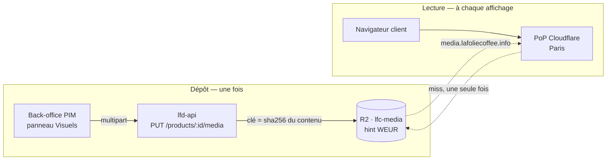

# Stockage et diffusion des médias — R2 derrière le cache Cloudflare

📐 **Doc-first : décidé, rien n'est codé.** Aucun bucket média n'existe, aucune
route d'upload n'est écrite. Ce qui est vérifié l'est contre la plateforme (DNS
public, docs Cloudflare) et non contre l'intention ; ce qui reste à confirmer
est signalé.

Les visuels d'un produit sont aujourd'hui des **URL saisies à la main** dans le
panneau Visuels du PIM. Rien n'est hébergé par nous, rien n'est validé, et une
URL qui tombe emporte l'image du catalogue. Cette note pose comment on héberge.

---

## 1. Ce que le mot « CDN » recouvre ici

Le mot désigne trois choses différentes qu'on peut acheter séparément, et la
confusion coûte cher parce qu'on croit avoir à en installer un.

| Ce qu'on appelle « CDN »         | Ce que c'est vraiment                                       | Chez nous                                                  |
| -------------------------------- | ----------------------------------------------------------- | ---------------------------------------------------------- |
| **La copie près du visiteur**    | Le PoP qui garde l'octet en cache après la première demande | Automatique dès qu'on passe par la zone. Rien à installer. |
| **L'origine qui garde l'octet**  | Le stockage durable, un seul exemplaire                     | R2                                                         |
| **La transformation à la volée** | Redimensionnement, `webp`/`avif`, qualité                   | Cloudflare Images, à activer **par zone**, facturé         |

Ce qu'il faut retenir : **on n'installe pas un CDN « en France »**. On sert
depuis un domaine posé sur une zone Cloudflare, et le cache français existe tout
seul — le premier client parisien qui charge la photo la laisse à Paris pour les
suivants. Il n'y a aucun réglage géographique à faire pour ça.

La seule vraie question géographique est **où vit l'original**, et elle ne joue
que sur la latence du _miss_ et sur la conformité. Voir §4.

---

## 2. Le prérequis est déjà là — et deux docs disent le contraire

La diffusion publique de R2 se fait par un **domaine personnalisé**, ce qui
suppose une zone Cloudflare. Deux docs affirment qu'il n'y en a aucune :

- [`ops/README.md`](README.md) — « Aucune zone Cloudflare » et « Amener un
  domaine sur Cloudflare » en travaux ouverts ;
- [`gateway/wrangler.toml`](../../gateway/wrangler.toml) — tout le routage par
  préfixe de chemin est justifié par « le compte Cloudflare n'a aucune zone ».

**C'est périmé.** [`ops/mailer-resend.md`](mailer-resend.md) acte le 2026-08-16
le domaine `lafoliecoffee.info` sur une zone Cloudflare, et le DNS public le
confirme au 2026-08-21 :

```
$ dig +short NS lafoliecoffee.info
clint.ns.cloudflare.com.
haley.ns.cloudflare.com.
```

Aucun `MX` n'est encore posé (le mailer n'est pas fini) et `media` est libre.
Les deux affirmations ci-dessus sont corrigées dans le même commit que cette
note.

### Pourquoi il n'y a pas de solution sans domaine

Les deux contournements apparents échouent, et il faut savoir pourquoi pour ne
pas les retenter :

| Chemin                                    | Pourquoi il ne marche pas                                                                                                              |
| ----------------------------------------- | -------------------------------------------------------------------------------------------------------------------------------------- |
| Bucket public sur `…r2.dev`               | _Rate-limited_, « à usage de développement » selon Cloudflare. **Ni cache**, ni règles de cache, ni WAF.                               |
| Servir depuis un Worker sur `workers.dev` | La **Cache API est inerte** sur `*.workers.dev` : `cache.put()` réussit et ne stocke rien. Le Worker refetch l'objet à chaque requête. |

Le second est le piège dangereux : il _a l'air_ de marcher. Rien n'échoue, rien
n'avertit — seule la facture d'opérations R2 et la latence le disent.

---

## 3. Le chemin d'un octet



Le dépôt passe par l'API — parce qu'il faut un droit, une validation du contenu
et une écriture en base. La **lecture ne passe jamais par nous** : le domaine
média pointe directement sur le bucket. C'est ce qui rend le coût de service
indépendant de notre trafic backend, et l'égress R2 est facturé zéro.

---

## 4. Les quatre décisions

### 4.1 Un bucket distinct des KBIS, avec son propre jeton

Le commentaire de
[`env-readers.ts`](../../apps/lfd-api/src/platform/config/env-readers.ts)
anticipait exactement ce moment :

> « Le jour où un autre bucket sert à des assets publics, un jeton fuité depuis
> là ne doit pas ouvrir les papiers des clients. »

Ce jour est arrivé. `R2StorageUsage` passe de `"kbis"` à `"kbis" | "media"`, et
le jeton média n'ouvre que `lfc-media`. Un KBIS est une pièce d'identité
d'entreprise ; une photo de viennoiserie est publique par construction. Les
mettre dans le même bucket ferait porter au même secret deux niveaux de
sensibilité sans rapport.

**Ce qui se réutilise, et ce qui ne se réutilise pas.** Le transport se partage
en entier : `S3StorageService`, `sniffContentType` (type déduit des **octets**,
jamais de l'annonce du client), `sanitiseFileName`. Le service, lui, est
l'inverse point par point — et aucune ligne de la chaîne KBIS ne survit en aval
du dépôt :

|                   | KBIS                        | Média produit           |
| ----------------- | --------------------------- | ----------------------- |
| Accès             | privé, URL signée expirante | public, URL stable      |
| Disposition       | `attachment` **forcé**      | `inline`                |
| Cache             | jamais                      | pour toujours           |
| Chemin de lecture | à travers l'API             | direct depuis le bucket |

### 4.2 La clé est le hash du contenu

`products/{sha256}.{ext}`. Trois conséquences, dans cet ordre d'importance :

1. **Le cache devient honnête.** On peut poser
   `Cache-Control: public, max-age=31536000, immutable` sans mentir : un contenu
   différent produit une clé différente. Il n'y a **jamais** de purge à
   déclencher, et donc jamais de bug « j'ai remplacé l'image et l'ancienne
   s'affiche encore » — celui qu'on découvre toujours en production, chez un
   seul client, un vendredi.
2. **La déduplication est gratuite.** Le même visuel déposé sur douze produits
   occupe un objet.
3. Le nom du fichier d'origine ne va jamais dans la clé, donc rien de ce que
   tape un utilisateur ne devient une adresse publique.

Le prix à payer est qu'un objet ne se supprime que lorsque **plus aucun**
produit ne le référence — le comptage remplace la suppression en cascade. C'est
le vrai correctif de la dette actuelle : `replaceMedia` détache déjà sans
supprimer, et laisse des `MediaAsset` orphelins s'accumuler.

### 4.3 Le hint `WEUR`, pas la juridiction `eu`

Les deux sont **irréversibles à la création** du bucket, ce qui justifie de
trancher ici plutôt qu'au moment du clic.

|                  | Ce que ça garantit                                        | Coût                                |
| ---------------- | --------------------------------------------------------- | ----------------------------------- |
| Hint `WEUR`      | _Best-effort_ : l'original est placé en Europe de l'Ouest | aucun                               |
| Juridiction `eu` | Garantie de résidence, endpoint dédié                     | contrainte permanente, bucket isolé |

**On prend le hint, pas la juridiction.** Des photos de produits ne sont pas des
données personnelles : la juridiction poserait une contrainte définitive pour un
bénéfice nul. Elle aurait du sens sur le bucket **KBIS** — qui a été créé sans,
et qu'on ne peut donc plus y basculer sans recréer et recopier. À traiter
séparément si la question se pose.

Le hint ne joue de toute façon que sur le _miss_ : une fois l'objet en cache à
Paris, l'emplacement de l'original ne se voit plus.

### 4.4 Les dérivés viennent après

Servir l'original de 4 Mo dans une vignette de tableau est le défaut évident du
plan minimal. Cloudflare Images le corrige — mais c'est un service **à activer
par zone** et **facturé à la transformation unique par mois**.

On le branche dans un second temps, une fois de vraies images en base et un
volume observable. Décider maintenant du format et des tailles reviendrait à
choisir sans données ; et le plan reste ouvert parce que la transformation ne
touche ni le stockage, ni les clés, ni le modèle — seulement l'URL construite à
l'affichage.

---

## 5. Le modèle de données

`MediaAsset` porte aujourd'hui `id`, `url`, `alt`, `focalX/Y`. Il ne sait **pas
ce qu'il stocke** : ni le type, ni les dimensions, ni la taille, ni si l'octet
est chez nous ou chez un tiers.

| Champ à ajouter         | Ce que ça débloque                                                                                        |
| ----------------------- | --------------------------------------------------------------------------------------------------------- |
| `storageKey` (nullable) | Distinguer notre objet d'une URL externe. `null` ⇒ URL saisie, héritée.                                   |
| `contentType`           | Servir juste, et refuser à la relecture ce qu'on a refusé au dépôt                                        |
| `width` / `height`      | Le front **réserve le ratio** avant chargement — sans ça, la fiche produit saute au chargement des images |
| `bytes`                 | Mesurer, et décider des dérivés sur des chiffres                                                          |

`url` **reste** : elle est ce que consomment le front et les canaux, et sa
valeur devient dérivée (`https://media.lafoliecoffee.info/{storageKey}`) au lieu
d'être saisie. Les URL externes déjà en base continuent de fonctionner sans
migration de contenu — c'est ce que le `storageKey` nullable achète.

---

## 6. Le partage des gestes

**Chez l'humain, au tableau de bord.** Les valeurs de jeton ne transitent ni par
un terminal, ni par un fil de conversation, ni par un fichier du dépôt — elles
vont du tableau de bord d'origine aux secrets GitHub, directement.

1. Créer le bucket `lfc-media`, hint **WEUR**, **sans** juridiction.
2. Lui attacher le domaine `media.lafoliecoffee.info`.
3. Créer un jeton R2 **restreint à ce seul bucket**, en lecture-écriture, et le
   poser en secrets : `R2_MEDIA_BUCKET`, `R2_MEDIA_ACCESS_KEY_ID`,
   `R2_MEDIA_SECRET_ACCESS_KEY` (cf. [`secrets-et-variables.md`](secrets-et-variables.md)).

**Dans le code.** Rien de tout cela n'est un prérequis pour écrire et tester :
le stockage est déjà derrière un port, et l'absence de configuration donne un
refus explicite au lieu d'un échec obscur (`DocumentStorageUnavailableError`).

1. L'usage `media` dans `R2StorageUsage` + le port de dépôt public.
2. La route d'upload multipart, adressage par contenu, validation par les
   octets.
3. La migration du modèle (§5) et le comptage des références.
4. Le panneau Visuels : un vrai dépôt de fichier à la place du champ « URL ».

---

## 7. Ce qui reste ouvert

- **Le nettoyage des orphelins.** Le comptage de références dit _quand_ un objet
  devient supprimable ; il reste à décider _qui_ le supprime — au détachement,
  ou par une passe périodique. Rien ne presse tant que le volume est nul.
- **Les dérivés** (§4.4), délibérément différés.
- **La boutique client n'a toujours aucun point d'entrée catalogue** : les
  visuels, comme la TVA et les allergènes, n'atteignent pas l'acheteur. Héberger
  les images ne referme pas cette boucle-là.
- **Le plafond de taille au dépôt** n'est pas tranché. Le KBIS coupe à 10 Mo
  côté domaine, avec un garde-fou DoS à 20 Mo côté multipart ; une photo produit
  n'a pas les mêmes ordres de grandeur.

## 8. À lire ensuite

- [`architecture-deploiement.md`](architecture-deploiement.md) — la carte, et le
  placement WEUR des containers, décidé pour les mêmes raisons de latence.
- [`secrets-et-variables.md`](secrets-et-variables.md) — où vit une valeur, et
  laquelle doit résoudre.
- [`mailer-resend.md`](mailer-resend.md) — l'autre usage de la zone
  `lafoliecoffee.info`, et pourquoi elle a été prise.

## Sources

- [Cache API — Cloudflare Workers](https://developers.cloudflare.com/workers/runtime-apis/cache/) (inerte sur `workers.dev`)
- [Public buckets — Cloudflare R2](https://developers.cloudflare.com/r2/buckets/public-buckets/) (`r2.dev` limité au développement)
- [Data location — Cloudflare R2](https://developers.cloudflare.com/r2/reference/data-location/) (hints et juridictions, irréversibles)
- [Transform images — Cloudflare Images](https://developers.cloudflare.com/images/transform-images/) (activation par zone)
