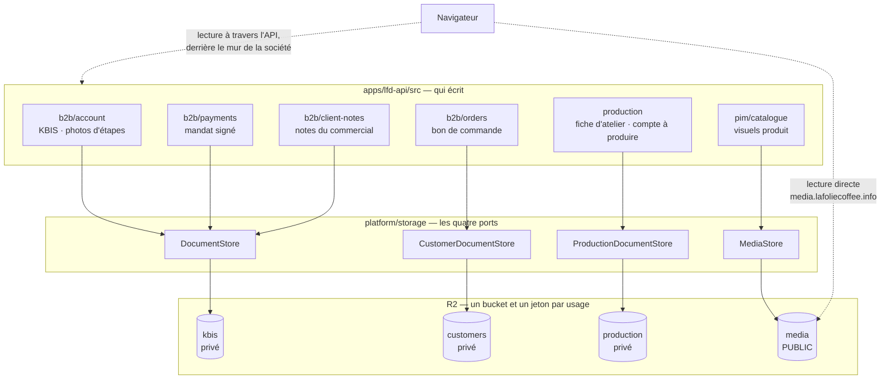

# L'organisation du stockage R2 — quatre buckets, quatre ports, et où tombe chaque octet

**Écrit le 2026-09-16.** Il décrit l'état du code à cette date, et chaque ligne
a été ouverte dans le dépôt avant d'être écrite ici.

Ce document répond à une seule question : **quand l'API range un fichier, dans
quel bucket va-t-il, sous quelle clé, et qui peut le relire ?** Les décisions
qui ont mené à ce découpage vivent ailleurs, et ne sont pas réécrites ici :

- pourquoi les pièces d'un client sont coupées en deux buckets —
  [`../order/architecture-pieces-en-r2.md`](../order/architecture-pieces-en-r2.md) ;
- pourquoi les images du catalogue sont publiques et servies par un domaine —
  [`architecture-stockage-media.md`](architecture-stockage-media.md).

---

## 1. La carte



Les trois buckets privés **ne sont jamais servis par un domaine** : leurs octets
repassent par l'API, qui vérifie d'abord le mur. Le quatrième l'est, et c'est
toute sa raison d'être — la lecture d'une photo de viennoiserie ne nous traverse
pas.

---

## 2. Les quatre usages, et ce qui les sépare

| Usage        | Ce qu'il contient                                                 | Ce qu'il est                                                 | Public                  | Écrivains dans `src/` |
| ------------ | ----------------------------------------------------------------- | ------------------------------------------------------------ | ----------------------- | --------------------- |
| `kbis`       | extrait de greffe, mandat signé, photos d'étapes, photos de notes | ce que le client nous donne, et ce que le staff photographie | non                     | 3 blocs               |
| `customers`  | bon de commande (et, demain, les factures du comptable)           | ce qu'un client peut nous opposer                            | non                     | 1                     |
| `production` | fiche d'atelier, compte à produire                                | ce qui documente notre travail                               | non                     | 1                     |
| `media`      | visuels du catalogue                                              | la vitrine                                                   | **oui**, par un domaine | 1                     |

La règle qui gouverne tout le reste est écrite dans
[`app-config.ts`](../../apps/lfd-api/src/platform/config/app-config.ts) :

> « Chaque usage porte son bucket **et ses clés** : un jeton n'ouvre que le
> sien. »

C'est ce qui interdit de ranger le bon de commande chez les KBIS : un jeton
donné pour lire un extrait de greffe lirait aussi les papiers de commande.

⚠️ **Le bucket `kbis` ne contient plus seulement des KBIS.** Il a gagné le
mandat signé, puis les photos des étapes de livraison, puis celles des notes du
commercial et leurs vignettes. Le nom est resté parce que le renommer serait une
**migration de fichiers**, pas un renommage — il y a des données dedans. Ce qu'il
contient vraiment, c'est **toute pièce privée attachée à une société qui n'est
pas un document de commande**.

---

## 3. Le rangement, bucket par bucket

```
kbis/                                                         ✅ écrit
└── companies/{companyId}/
    ├── kbis                                                  sans extension — le type est en base
    ├── mandates/{mandateId}/mandat-signe-{horodatage}
    ├── delivery-procedures/{addressId}/{stepId}-{revision}
    └── client-notes/
        ├── {noteId}-{revision}                               la photo lisible
        └── thumbs/{noteId}-{revision}                        la vignette, même nom

customers/                                                    ✅ écrit
├── orders/{orderId}/bon-de-commande-r{revision}.pdf
└── companies/{companyId}/invoices/{AAAA-MM}/facture-{n}.pdf  ⛔ prévu, pas écrit

production/                                                   ✅ écrit
├── {AAAA-MM-JJ}/compte-a-produire.pdf
└── orders/{orderId}/fiche-atelier.pdf

media/                                                        ✅ écrit
└── products/{sha256}.{png|jpg|webp|gif}
```

### Les trois formes de clé, et ce que chacune garantit

| Forme                      | Où                        | Ce qu'elle tient                                                                |
| -------------------------- | ------------------------- | ------------------------------------------------------------------------------- |
| **Ancrée sur la société**  | `kbis`                    | le mur de tenancy est **dans le chemin** — `companies/{id}/…`                   |
| **Ancrée sur la commande** | `customers`, `production` | les papiers d'une commande se retrouvent sous son identifiant, où qu'ils vivent |
| **Dérivée du contenu**     | `media`                   | la clé **est** le sha256 des octets — le cache immuable ne peut pas mentir      |

**La clé ne vient jamais du client.** Elle se compose à partir d'identifiants
déjà vérifiés, après le mur. C'est ce que le port impose, et c'est le seul mur
que le stockage lui-même possède : R2 ne connaît ni société ni commande.

### Remplacer : deux mécaniques opposées, et c'est voulu

- **À la même clé** (`companies/{id}/kbis`) : un dépôt neuf **écrase**. Un
  remplacement reste un remplacement, il n'y a rien à ramasser.
- **À une clé neuve** (`{stepId}-{revision}`, `{noteId}-{revision}`,
  `bon-de-commande-r{n}.pdf`) : l'ancien objet survit jusqu'à ce que la base
  pointe vers le nouveau. C'est ce qui rend un dépôt interrompu inoffensif — et
  ce qui fait qu'un objet peut rester **orphelin**, d'où le journal
  `OrphanPhotoLog` des cartes à photo et le ramassage du catalogue (§6).

⚠️ `orders/{orderId}/fiche-atelier.pdf` **n'a pas de révision**, contrairement au
bon de commande. C'est cohérent avec ce que la fiche est — un papier
opérationnel, refabricable — mais ça veut dire qu'un avenant écrasera la feuille
partie au fournil le matin. Le tableau de
[`../order/architecture-pieces-en-r2.md`](../order/architecture-pieces-en-r2.md)
annonçait `fiche-atelier-r{n}.pdf` ; il est corrigé dans le même commit que cette
page, et la question de la révision reste ouverte.

---

## 4. Les ports — un appelant ne choisit pas son bucket

Quatre classes abstraites dans
[`platform/storage/`](../../apps/lfd-api/src/platform/storage/), reliées à leur
usage **une seule fois**, dans
[`context.module.ts`](../../apps/lfd-api/src/platform/context/context.module.ts) :

| Port                      | Usage        | Adaptateur        |
| ------------------------- | ------------ | ----------------- |
| `DocumentStore`           | `kbis`       | `S3DocumentStore` |
| `CustomerDocumentStore`   | `customers`  | `S3DocumentStore` |
| `ProductionDocumentStore` | `production` | `S3DocumentStore` |
| `MediaStore`              | `media`      | `R2MediaStore`    |

Les trois premiers sont **le même adaptateur avec un paramètre d'usage
différent**, et les trois ports existent quand même. La raison est écrite dans
`customer-document-store.ts` et vaut d'être répétée : un `save(usage, key, …)`
aurait rendu possible d'écrire un bon de commande chez les KBIS **par une faute
de frappe**. Un appelant déclare de quel stockage il dépend ; la racine de
composition lui donne le bon.

`MediaStore` est un port différent, pas une variante : sa méthode ne prend pas
de clé mais un **préfixe**, et calcule la clé à partir des octets. Un mur de
tenancy y serait impossible — le même contenu donne la même clé pour tout le
monde, ce qui est exactement ce qu'on veut d'un catalogue et jamais d'une pièce
privée.

### Les trois verbes de lecture, et pourquoi il en faut trois

| Verbe           | L'objet manque                   | Pour qui                                                                  |
| --------------- | -------------------------------- | ------------------------------------------------------------------------- |
| `read`          | **panne** (lève)                 | la base a promis le fichier — une absence est une incohérence base/bucket |
| `readIfPresent` | **réponse** (`null`, sans bruit) | l'archive écrite au premier téléchargement — l'absence est le cas courant |
| `delete`        | **succès**                       | une suppression rejouée ne doit pas échouer                               |

Cette distinction a coûté cher avant d'exister : un `try/catch` qui rendait
`null` transformait **toute panne** — bucket mal nommé, clé refusée, signature
invalide — en « pas encore archivé », et l'API refabriquait en silence pour
toujours. Le symptôme d'un stockage cassé était l'absence de symptôme.

---

## 5. La configuration — trois variables par usage, et une absence qui ne couche personne

Chaque usage lit son propre triplet, dans une table **écrite en toutes lettres**
(`env-readers.ts`) plutôt que calculée : un nom construit à la volée
(`R2_${usage}_BUCKET`) est invisible à une recherche plein texte, et c'est
précisément ce qu'on cherche quand on se demande d'où vient un bucket.

| Usage        | Variables                                                                |
| ------------ | ------------------------------------------------------------------------ |
| `kbis`       | `R2_KBIS_BUCKET` · `R2_KBIS_ACCESS_KEY_ID` · `R2_KBIS_SECRET_ACCESS_KEY` |
| `media`      | `R2_MEDIA_*` + **`R2_MEDIA_PUBLIC_BASE_URL`**                            |
| `customers`  | `R2_CUSTOMERS_*`                                                         |
| `production` | `R2_PRODUCTION_*`                                                        |

Deux réglages communs, et une exception qui compte :

- **La région est un fait du compte** (`auto` partout) — `R2_REGION`.
- **L'endpoint ne l'est PAS** : il dépend de la **juridiction** du bucket, qui se
  choisit à sa création. `lfc-b2b-kbis` est en juridiction EU
  (`…eu.r2.cloudflarestorage.com`), `lfc-media` n'en a aucune. Chaque usage a
  donc son `R2_*_ENDPOINT`, avec repli sur `R2_ENDPOINT` — une seule variable
  tant que tout partage une juridiction, correcte dès que ça diverge.
- **`R2_MEDIA_PUBLIC_BASE_URL` n'est pas un secret** : elle finit dans le HTML de
  chaque fiche. Sans elle, le dépôt d'image est **refusé** plutôt que d'écrire en
  base des URL mortes — une image sur une adresse morte ne se voit qu'à
  l'affichage, longtemps après.

### Les trois états d'un stockage

Un usage mal configuré **n'empêche pas l'API de démarrer**, et c'est une décision :

| `config` | `missing` | Ce que ça veut dire                                                           |
| -------- | --------- | ----------------------------------------------------------------------------- |
| posée    | vide      | utilisable                                                                    |
| `null`   | vide      | délibérément absent (dev, CI) — normal                                        |
| `null`   | peuplé    | **à moitié posé** — presque sûrement une faute de frappe, nommée au démarrage |

Poser les variables puis le secret est une séquence de déploiement ordinaire ;
elle ne doit pas coûter une panne totale. Le refus est donc une **donnée** :
l'usage s'éteint, le bulletin de démarrage nomme ce qui manque, le reste sert.

⚠️ Le bulletin de démarrage ne rapporte que **trois** usages — `kbis`, `media`,
`customers`. L'exclusion de `production` était juste quand rien ne l'écrivait ;
elle ne l'est plus depuis `985d21bf` (les deux papiers du fournil sont archivés).
Aujourd'hui, un `R2_PRODUCTION_*` mal posé se découvre au premier tirage, pas au
démarrage. C'est noté dans
[`../todos/todo-etrangetes-procedure-de-livraison.md`](../todos/todo-etrangetes-procedure-de-livraison.md).

---

## 6. Ce qui est ramassé, et ce qui ne l'est pas

| Bucket       | Objets orphelins possibles                       | Ramassage                                                        |
| ------------ | ------------------------------------------------ | ---------------------------------------------------------------- |
| `media`      | un visuel que plus aucune fiche ne porte         | ✅ `SweepOrphanMediaCommand` — délai de grâce 7 j, 200/passage   |
| `kbis`       | une photo remplacée dont la suppression a échoué | ⚠️ **journalisée seulement** (`OrphanPhotoLog`), rien ne repasse |
| `customers`  | aucun — les révisions sont voulues               | —                                                                |
| `production` | aucun — clé fixe, écrasement volontaire          | —                                                                |

Le ramassage du catalogue ne peut pas supprimer sur-le-champ, et c'est une
conséquence directe de l'adressage par contenu : **le même objet peut servir une
autre fiche**, puisque des octets identiques tombent sur la même clé. Seul un
comptage global sait qu'un objet n'a plus aucun lecteur.

Côté `kbis`, une suppression ratée laisse un objet payant que personne ne
retrouvera sans lire les journaux. C'est tenable à notre échelle — une photo par
étape, cinquante notes par client — et ça ne le restera pas indéfiniment.

---

## 7. En développement et en test : MinIO, pas un double en mémoire

`docker-compose.dev.yml` monte un MinIO et crée **les quatre mêmes buckets**,
avec la même asymétrie qu'en production :

```
lfc-b2b-dev · lfc-customers-dev · lfc-production-dev    privés
lfc-media-dev                                           mc anonymous set download
```

Les e2e écrivent dedans par le **vrai** `S3StorageService` — seul l'endpoint
change. Les trois suites qui déposent une pièce doublaient autrefois le port par
une `Map` : c'était commode et ça ne prouvait rien, ni que le SDK est bien
configuré, ni qu'une clé avec un `/` range vraiment sous ce préfixe. Le seul bout
de la chaîne jamais exécuté était exactement celui qui casse en ligne.

`test/storage.ts` sait vider **un bucket à la fois** : `storageKeys("customers")`
ne voit pas ce que `storageKeys()` voit. C'est ce qui fait qu'un e2e ne peut pas
passer sur un montage où les deux se confondraient.

---

## 8. Ce que ce document ne dit pas

- **Ce que contient chaque pièce**, audience par audience :
  [`../order/architecture-bon-de-commande.md`](../order/architecture-bon-de-commande.md).
- **Combien de temps on garde les bons de commande** — sans limite : un bon
  émis à juste titre ne se supprime pas (Hugo, 2026-09-17) ; aucune règle de
  cycle de vie ne doit viser `orders/` :
  [`../order/todo-conservation-des-bons-en-r2.md`](../order/todo-conservation-des-bons-en-r2.md).
- **Le cache, le domaine et ce que « CDN » recouvre** :
  [`architecture-stockage-media.md`](architecture-stockage-media.md).
- **Ce qui est vérifié à chaque déploiement** :
  [`runbook.md`](runbook.md).
