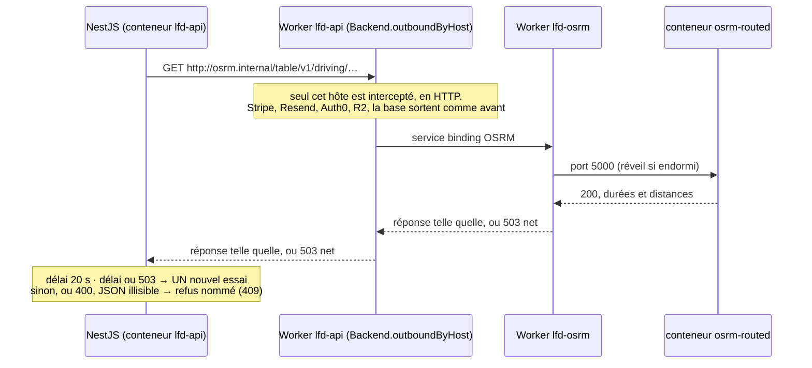

# La carte routière — `lfd-osrm`

> **État au 2026-09-29 : 🟡 bâti, jamais déployé.** Étapes 1 à 3 du lot 8 du
> [plan de tournée](../livraisons/plan-preparation-de-tournee.md) (forme B-ter,
> L8-C10/C11) : le service `lfd-osrm`, le binding et l'interception dans le
> Worker de `lfd-api`, l'adaptateur `OsrmDistanceMatrix`. **Rien n'est
> déployé** : l'ordre de mise en service est plus bas, et aucune de ses étapes
> n'a encore été jouée.
>
> 🔴 **Depuis le lot 10 bis (serveur bâti le 2026-09-29, non déployé) : plus
> de vol d'oiseau** (L10b-C5). Sans OSRM, « Proposer », « Chronométrer » et le
> simulateur **refusent** (409, « Le calcul routier ne répond pas : réessayez
> dans une minute. Les tournées existantes ne sont pas touchées. »).
> **Mettre OSRM en service — les trois étapes ci-dessous — AVANT de déployer le
> lot 10 bis** : dans l'autre ordre, « Proposer » refuse en production dès le
> déploiement (personne ne s'en sert encore, mais c'est le geste qu'on
> teste en premier).

`lfd-osrm` calcule des durées **par la route** entre des points de la Savoie
(`/table`, `/route`). C'est un Worker Cloudflare à part, avec son conteneur
`osrm-routed`, **sans adresse publique** (`workers_dev: false`, aucune route,
aucun cron). Son seul appelant est `lfd-api`, par un service binding.

## Comment `lfd-api` le joint



| Pièce                                                              | Rôle                                                                             |
| ------------------------------------------------------------------ | -------------------------------------------------------------------------------- |
| `apps/lfd-api/wrangler.jsonc`                                      | `services: OSRM → lfd-osrm` ; drapeau `enable_ctx_exports`                       |
| `apps/lfd-api/container/worker.ts`                                 | `export { ContainerProxy }` ; `Backend.outboundByHost` pour `osrm.internal` seul |
| `apps/lfd-api/container/osrm-bridge.ts`                            | passe au binding, 503 net si binding absent ou coupure                           |
| `apps/lfd-api/src/delivery/infrastructure/osrm-distance-matrix.ts` | un `/table` par calcul ; au-delà de 200 points, blocs 100 × 100 ; échec : refus  |
| `apps/lfd-api/src/delivery/infrastructure/osrm-route-geometry.ts`  | un `/route` par tournée, en parallèle ; échec : tournée sans tracé, jamais refus |
| `OSRM_URL` (variable GitHub → secret du Worker → conteneur)        | `http://osrm.internal` ; absente, le calcul refuse                               |

## Ce qu'il y a où

| Fichier                                 | Rôle                                                                                  |
| --------------------------------------- | ------------------------------------------------------------------------------------- |
| `apps/lfd-osrm/osrm-version.env`        | **La** version d'OSRM, par digest amd64 — lue par la préparation ET par le Dockerfile |
| `apps/lfd-osrm/scripts/build-graph.sh`  | Extrait Geofabrik → découpe Savoie → extract/partition/customize → vérification       |
| `apps/lfd-osrm/Dockerfile`              | Image officielle + graphe ; contexte = dossier du graphe, jamais le dépôt             |
| `apps/lfd-osrm/src/worker.ts`           | N'admet que `GET /table/…` et `GET /route/…` ; 503 net si le conteneur ne répond pas  |
| `apps/lfd-osrm/wrangler.jsonc`          | Classe `Osrm`, `lite`, une instance, `WEUR`, `sleepAfter` 10 min, port 5000           |
| `.github/workflows/deploy_lfd_osrm.yml` | Mensuel (le 3, 02:17 UTC) + manuel + push `main` filtré sur `apps/lfd-osrm/**`        |

**L'image est la carte.** Son tag, `savoie-AAAAMMJJ-osrm5.27.1`, dit de quel
jour date l'extrait OpenStreetMap et quelle version d'OSRM l'a préparé.

## Mettre en service — l'ordre, une étape à la fois

🔴 **Trois déploiements séparés, chacun vérifié avant le suivant.** L'ordre
n'est pas une préférence : l'étape 2 échoue si l'étape 1 manque, et l'étape 3
ne sert à rien sans l'étape 2.

### 1. Déployer `lfd-osrm`

GitHub → Actions → `deploy_lfd_osrm` → **Run workflow** sur `main` (ou le push
qui touche `apps/lfd-osrm/**`). Personne ne l'appelle encore : rien ne change
pour personne.

**Contrôle** : l'étape « Préparer et vérifier le graphe » affiche
`✅ Graphe chargé — Val d'Isère → Arc 1800 : …`, et
`pnpm --filter lfd-osrm exec wrangler deployments list` montre une version
datée d'aujourd'hui. Le Worker n'a pas d'adresse publique : on ne peut pas le
`curl` d'ici, et c'est voulu.

### 2. Déployer `lfd-api` avec le binding et l'interception

Une promotion ordinaire (runbook, « Déployer ») qui porte le commit du lot 8,
**hors des heures d'usage du back-office**. Sans `OSRM_URL`, le NestJS
n'appelle jamais `osrm.internal` — et, si le lot 10 bis est déjà déployé,
« Proposer » refuse (voir le bandeau) —, mais ce déploiement n'est **pas** neutre pour autant : il change le démarrage
du conteneur de toute l'API (voir 🔴 plus bas).

⚠️ **`wrangler` résout chaque service binding au moment de publier** : si
`lfd-osrm` n'existe pas encore, l'étape « Déployer » du workflow de l'API
**échoue** (et rien n'est remplacé — l'ancienne version sert toujours).
C'est l'étape 1 qu'il manque.

🔴 **Ce déploiement touche le démarrage de TOUTE l'API.** L'interception est
installée par la bibliothèque juste avant de démarrer le conteneur ; si
`ctx.exports.ContainerProxy` manquait (export oublié, drapeau
`enable_ctx_exports` non pris), elle lève, et **le conteneur ne démarre pas**.
Deux tests (`apps/lfd-api/container/__tests__/outbound-interception.spec.ts`) tiennent
l'export et le drapeau, mais l'interception elle-même n'a jamais tourné sur
Cloudflare.

**Contrôle** :

- l'étape « Attendre que l'image neuve serve » est verte, et
  `curl -s https://<api>/health` répond avec la révision du commit ;
- **un second démarrage à froid** passe aussi : attendre que le conteneur
  s'endorme (`sleepAfter`), puis rappeler `/health`. C'est ce démarrage-là que
  l'interception peut casser — la première réponse ne le prouve pas.

(Vérifier qu'un courriel part encore ne prouve rien ici : en mode « par hôte »,
seul `osrm.internal` est intercepté, le reste ne passe jamais par le pont.)

**Retour arrière — immédiat, sans attendre la CI** : `wrangler deploy` a déjà
publié la version neuve quand l'attente de `/health` passe au rouge. Revenir à
la version précédente du Worker :

```bash
pnpm --filter lfd-api exec wrangler rollback
```

⚠️ Non éprouvé sur ce Worker à conteneur au 2026-09-29 : à essayer une fois à
froid, avant d'en avoir besoin.

Contrôle : `pnpm --filter lfd-api exec wrangler deployments list` montre la
version précédente active, et `/health` répond avec l'ancienne révision.
Redéployer le commit précédent par une promotion (runbook, « Revenir en
arrière ») repasse par la CI — des dizaines de minutes d'API tombée : c'est le
geste de **suite**, pas le premier. L'état de `lfd-osrm` n'y change rien.

### 3. Poser `OSRM_URL`

GitHub → Settings → Variables → `OSRM_URL` = `http://osrm.internal` (exact :
`http`, pas `https` — seul l'hôte HTTP est intercepté). Puis relancer le
déploiement de l'API, qui la pousse sur le Worker :

```bash
gh workflow run deploy_lfd_api.yml --ref main
```

**Contrôle** :

- `/admin/ops/capabilities` ne liste plus « Calcul routier des tournées » ;
- dans le back-office, Livraison → Proposer rend des tournées, tracées sur la
  carte. Le premier « Proposer » du matin réveille `lfd-osrm` ; s'il est
  refusé (« Le calcul routier ne répond pas ») et que le suivant passe, c'est
  le démarrage à froid qui dépasse deux fois le délai (20 s,
  `OSRM_TIMEOUT_MS`, puis un nouvel essai) — à mesurer, puis à régler ;
- le journal de l'API (`wrangler tail lfd-api`) ne porte pas
  `OSRM ne répond pas (…)`.

### Quand OSRM tombe — il n'y a plus de vol d'oiseau

« Revenir au vol d'oiseau » n'existe plus depuis le lot 10 bis (L10b-C5 :
« le vol d'oiseau doit disparaître, c'est trop faux en montagne »).

**Ce qui se passe** : un délai dépassé (20 s) ou un 503 — le réveil — a droit
à UN nouvel essai. Au-delà, ou sur tout autre échec (refus 400, réponse
illisible, trajet introuvable, un seul bloc manquant au-delà de 200 points),
« Proposer », « Chronométrer » et le simulateur refusent en 409 : « Le calcul
routier ne répond pas : réessayez dans une minute. Les tournées existantes ne
sont pas touchées. » **Rien n'est écrit** — ce sont des lectures. Le journal
de l'API porte `OSRM ne répond pas (…) : proposition refusée.`, sans aucune
coordonnée.

**Ce qui continue** : composer à la main (Livraison → Tournées : placer,
déplacer, réordonner), charger, partir. Seul le calcul manque. Un tracé
qu'OSRM ne rend pas n'est jamais un refus : la carte montre les repères sans
ligne.

**Le geste** : lire pourquoi `lfd-osrm` ne répond pas (`wrangler tail
lfd-osrm`, puis les déploiements), et le remettre en service — redéployer
l'image de la carte en cours, ou revenir à la précédente (plus bas).
Retirer `OSRM_URL` ne rend **rien** : sans elle, le calcul refuse aussi.

Si OSRM **répond faux** (une carte mal préparée) : revenir à la carte
précédente, plus bas — c'est le seul retour arrière.

## Redéployer une carte (la refaire aujourd'hui)

GitHub → Actions → `deploy_lfd_osrm` → **Run workflow** sur `main`. Le
workflow télécharge l'extrait du jour, prépare et vérifie le graphe, pousse
l'image `lfd-osrm:savoie-<date du jour>-osrm<version>` et déploie. Le tag
déployé est écrit dans le résumé de l'exécution.

**Contrôle** : l'étape « Préparer et vérifier le graphe » affiche
`✅ Graphe chargé — Val d'Isère → Arc 1800 : …` (≈ 51 min, 41,9 km au
2026-09-29). Une valeur très différente est une carte à ne pas garder.

## Revenir à la carte précédente

L'ancienne image reste dans le registre Cloudflare. On redéploie son tag,
**sans** reconstruire :

```bash
# lister les tags disponibles
pnpm --filter lfd-osrm exec wrangler containers images list

# depuis apps/lfd-osrm, sur une copie de travail propre
sed -i '' "s/__CF_ACCOUNT_ID__/<account id>/; s/__IMAGE_TAG__/savoie-AAAAMMJJ-osrm5.27.1/" wrangler.jsonc
pnpm exec wrangler deploy
git checkout wrangler.jsonc   # ne jamais committer l'account id
```

⚠️ Non vérifié au 2026-09-29 : la durée de rétention des images dans le
registre Cloudflare. Si le tag précédent n'y est plus, le repli est de
relancer le workflow (la carte du jour).

⚠️ Changer la **version d'OSRM** (`osrm-version.env`) rend les anciennes cartes
inutilisables par la nouvelle image et inversement : un graphe préparé par une
version se charge mal dans une autre. C'est pourquoi la version est dans le tag.

## Si le mensuel échoue

- **La carte en service ne bouge pas.** Rien n'est déployé tant que le graphe
  n'a pas été vérifié et l'image poussée : l'échec laisse la carte du mois
  précédent servir. Elle vieillit, elle ne disparaît pas.
- **L'échec est visible** : l'exécution est rouge (aucun `continue-on-error`),
  et GitHub prévient par courriel. ⚠️ Pour un workflow planifié, GitHub
  prévient **l'auteur du dernier commit du fichier du workflow** — pas
  forcément la personne de garde.
- **Causes probables**, par ordre : Geofabrik ou `polygons.openstreetmap.fr`
  indisponible (relancer plus tard, à la main) ; `osrm-routed` ne charge pas le
  graphe ou ne trouve pas d'itinéraire (lire les journaux de l'étape : un
  extrait tronqué ou un polygone vide) ; jeton Cloudflare expiré (étape
  « Pousser l'image »).
- Tant qu'OSRM ne répond pas du tout, « Proposer » **refuse** (L10b-C5, plus
  de vol d'oiseau) et le journal de l'API porte `OSRM ne répond pas (…)` à
  chaque essai. L'échec du mensuel, lui, ne coupe rien : l'ancienne carte sert.

## Préparer une carte en local

```bash
apps/lfd-osrm/scripts/build-graph.sh /tmp/osrm-graph   # HORS du dépôt
source apps/lfd-osrm/osrm-version.env
docker build --platform linux/amd64 --build-arg OSRM_IMAGE="$OSRM_IMAGE" \
  -f apps/lfd-osrm/Dockerfile -t lfd-osrm:local /tmp/osrm-graph
docker run --rm -p 5000:5000 lfd-osrm:local
```

🔴 Une carte préparée sur un poste **n'est jamais publiée** : seule celle de la
CI part au registre.

**ODbL** : les données OpenStreetMap exigent une attribution dès qu'on
**affiche** un tracé sur une carte (`/route`) — à écrire le jour où un écran
le fera.

## Les tuiles de la carte des tournées (lot 10) — ⚠️ fabriquées, pas encore servies

Même extrait, second usage : `apps/lfd-osrm/scripts/build-tiles.sh` fabrique
les deux fichiers PMTiles de la carte du back-office à partir du
`savoie.osm.pbf` que `build-graph.sh` laisse dans son dossier de sortie.

```bash
apps/lfd-osrm/scripts/build-tiles.sh <sortie-du-graphe>/savoie.osm.pbf <dossier-hors-du-dépôt>
```

| Fichier                 | Contenu                                 | Taille (2026-09-29) |
| ----------------------- | --------------------------------------- | ------------------- |
| `savoie.pmtiles`        | rues, eau, couverture du sol — z0–14    | 36 Mo               |
| `savoie-relief.pmtiles` | altitude Mapterhorn (terrarium) — z0–12 | 60 Mo               |

**État au 2026-09-29** : fabriqués et contrôlés en local (une maquette les
lit), **mais ni bucket R2, ni workflow, ni écran** : le mensuel ne les
refait pas encore. Le bâti attend la validation de la maquette
(`documentation/livraisons/plan-preparation-de-tournee.md`, lot 10, L10-C4).
