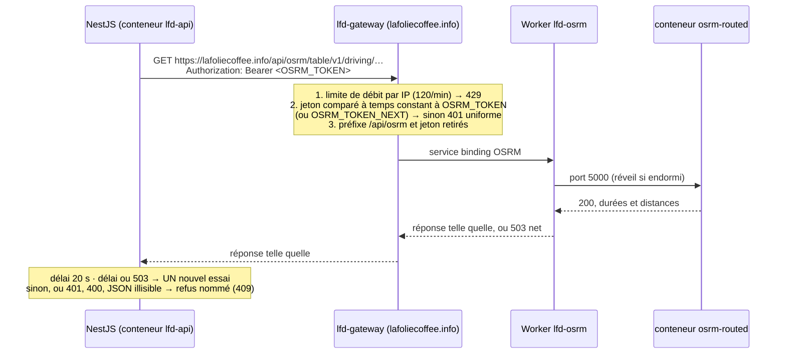

# La carte routière — `lfd-osrm`

> **État au 2026-09-29 : 🟡 bâti, jamais déployé.** Lot 8 bis du
> [plan de tournée](../livraisons/plan-preparation-de-tournee.md) (L8b-C1 à
> C7) : l'API joint `lfd-osrm` **par la passerelle**, en HTTPS, avec un jeton
> que la passerelle vérifie. Cette forme remplace l'interception
> `outboundByHost` du lot 8 (forme B-ter), **jamais déployée et retirée du
> code** le 2026-09-29. **Rien n'est déployé** : l'ordre de mise en service
> est plus bas, et aucune de ses étapes n'a encore été jouée.
>
> 🔴 **Depuis le lot 10 bis (serveur bâti le 2026-09-29, non déployé) : plus
> de vol d'oiseau** (L10b-C5). Sans OSRM, « Proposer », « Chronométrer » et le
> simulateur **refusent** (409, « Le calcul routier ne répond pas : réessayez
> dans une minute. Les tournées existantes ne sont pas touchées. »).
> **Mettre OSRM en service — les trois étapes ci-dessous — AVANT de déployer le
> lot 10 bis** : dans l'autre ordre, « Proposer » refuse en production dès le
> déploiement (personne ne s'en sert encore, mais c'est le geste qu'on
> teste en premier).

`lfd-osrm` calcule des durées **par la route** entre des points de la Savoie
(`/table`, `/route`). C'est un Worker Cloudflare à part, avec son conteneur
`osrm-routed`, **sans adresse publique** (`workers_dev: false`, aucune route,
aucun cron). Son seul chemin d'entrée est le service binding `OSRM` de la
passerelle, sous `/api/osrm`, derrière un jeton.

## Comment `lfd-api` le joint



C'est un appel HTTPS ordinaire, comme ceux que l'API fait déjà vers Stripe,
Resend et Auth0. S'il rate, seul « Proposer » refuse : le démarrage de l'API
n'en dépend pas — c'est ce que l'interception retirée ne garantissait pas.

| Pièce                                                                 | Rôle                                                                                             |
| --------------------------------------------------------------------- | ------------------------------------------------------------------------------------------------ |
| `gateway/src/routes.ts`                                               | préfixe `/api/osrm` → backend `osrm`, retiré avant transmission                                  |
| `gateway/src/osrm-guard.ts`                                           | limite de débit, puis jeton fermé par défaut (secret absent, vide ou < 32 caractères : tout 401) |
| `gateway/wrangler.toml`                                               | `[[services]] OSRM → lfd-osrm` ; `[[ratelimits]] OSRM_RATE_LIMITER` (120/min, `1004`)            |
| `.github/workflows/deploy_lfd_gateway.yml`                            | pose `OSRM_TOKEN` et `OSRM_TOKEN_NEXT` s'ils sont non vides — ne supprime jamais                 |
| `apps/lfd-api/src/platform/config/osrm-endpoint.ts`                   | en production : `https://` ET jeton exigés, sinon calcul éteint et dit                           |
| `apps/lfd-api/src/delivery/infrastructure/osrm-fetch.ts`              | `withBearer` : le jeton en `Authorization`, jamais dans l'URL                                    |
| `apps/lfd-api/src/delivery/infrastructure/osrm-distance-matrix.ts`    | un `/table` par calcul ; au-delà de 200 points, blocs 100 × 100 ; échec : refus                  |
| `apps/lfd-api/src/delivery/infrastructure/osrm-route-geometry.ts`     | un `/route` par tournée, en parallèle ; échec : tournée sans tracé, jamais refus                 |
| `OSRM_URL` (variable GitHub → secret du Worker `lfd-api` → conteneur) | `https://lafoliecoffee.info/api/osrm` en production ; `http://localhost:5055` en dev             |
| `OSRM_TOKEN` (secret GitHub **unique** → passerelle ET `lfd-api`)     | le même secret GitHub lu par les deux workflows : une seule source, jamais deux valeurs à égaler |
| `OSRM_TOKEN_NEXT` (secret GitHub facultatif → passerelle seule)       | absent hors d'une rotation                                                                       |

## Ce qu'il y a où

| Fichier                                 | Rôle                                                                                  |
| --------------------------------------- | ------------------------------------------------------------------------------------- |
| `apps/lfd-osrm/osrm-version.env`        | **La** version d'OSRM, par digest amd64 — lue par la préparation ET par le Dockerfile |
| `apps/lfd-osrm/scripts/build-graph.sh`  | Extrait Geofabrik → découpe Savoie → extract/partition/customize → vérification       |
| `apps/lfd-osrm/Dockerfile`              | Image officielle + graphe ; contexte = dossier du graphe, jamais le dépôt             |
| `apps/lfd-osrm/src/worker.ts`           | N'admet que `GET /table/…` et `GET /route/…` ; 503 net si le conteneur ne répond pas  |
| `apps/lfd-osrm/wrangler.jsonc`          | Classe `Osrm`, `lite`, une instance, `WEUR`, `sleepAfter` 10 min, port 5000           |
| `.github/workflows/deploy_lfd_osrm.yml` | Mensuel (le 3, 02:17 UTC) + manuel + push `main` filtré sur `apps/lfd-osrm/**`        |

**L'image est la carte.** Son tag, `savoie-AAAAMMJJ-osrm5.27.1`, dit de quel
jour date l'extrait OpenStreetMap et quelle version d'OSRM l'a préparé.

## Mettre en service — l'ordre, une étape à la fois

🔴 **Trois déploiements séparés, chacun vérifié avant le suivant.** L'ordre
n'est pas une préférence : l'étape 2 échoue si l'étape 1 manque, et l'étape 3
ne sert à rien sans l'étape 2.

**Préalable (Hugo, L8b-C7)** : le secret GitHub `OSRM_TOKEN`, généré en local
et rangé sans jamais l'afficher, lu sur l'entrée standard :

```bash
openssl rand -base64 48 | tr -d '\n' | gh secret set OSRM_TOKEN
```

✅ Posé le 2026-09-29 (un seul secret, au niveau du dépôt). `OSRM_TOKEN_NEXT`
n'existe pas, et n'existe que pendant une rotation.

### 1. Déployer `lfd-osrm`

GitHub → Actions → `deploy_lfd_osrm` → **Run workflow** sur `main` (ou le push
qui touche `apps/lfd-osrm/**`). Personne ne l'appelle encore : rien ne change
pour personne.

**Contrôle** : l'étape « Préparer et vérifier le graphe » affiche
`✅ Graphe chargé — Val d'Isère → Arc 1800 : …`, et
`pnpm --filter lfd-osrm exec wrangler deployments list` montre une version
datée d'aujourd'hui. Le Worker n'a pas d'adresse publique : on ne peut pas le
`curl` d'ici, et c'est voulu.

### 2. Déployer la passerelle, avec le jeton

Un push sur `main` qui touche `gateway/**` (ou GitHub → Actions →
`deploy_lfd_gateway` → **Run workflow**). Le workflow pose `OSRM_TOKEN` sur
le Worker `lfd-gateway` AVANT de le déployer.

⚠️ **`wrangler` résout chaque service binding au moment de publier** : si
`lfd-osrm` n'existe pas encore, l'étape « Deploy Worker » **échoue** (et rien
n'est remplacé — l'ancienne passerelle sert toujours). C'est l'étape 1 qu'il
manque.

Ce déploiement ne touche ni `/api/lfd` ni le front : la garde ne s'applique
qu'à `/api/osrm` (test `gateway/src/__tests__/osrm-guard.spec.ts`, « ne
touche pas `/api/lfd` »).

**Contrôle** — le jeton lu depuis un fichier local, jamais tapé en clair dans
l'historique du shell :

```bash
T='https://lafoliecoffee.info/api/osrm/route/v1/driving/6.9797,45.4486;6.7713,45.5724?overview=false'

# sans jeton : 401, corps « Gateway LFC : accès refusé. »
curl -s -o /dev/null -w '%{http_code}\n' "$T"

# mauvais jeton : 401, même corps
curl -s -o /dev/null -w '%{http_code}\n' -H "Authorization: Bearer $(openssl rand -hex 32)" "$T"

# bon jeton : 200 (le premier appel réveille lfd-osrm — le rejouer s'il rend 503)
curl -s -o /dev/null -w '%{http_code}\n' -H "Authorization: Bearer $(cat ~/.lfd-osrm-token)" "$T"
```

⚠️ Le secret GitHub ne se relit pas : pour le troisième contrôle, il faut la
valeur. Soit la garder au moment de la générer
(`openssl rand -base64 48 | tr -d '\n' | tee ~/.lfd-osrm-token | gh secret set OSRM_TOKEN`,
puis `chmod 600`, et `rm` une fois la mise en service faite), soit sauter ce
contrôle et laisser l'étape 3 le faire.

**Retour arrière** : `pnpm --filter lfd-gateway exec wrangler rollback`. La
passerelle est un Worker sans conteneur : le geste est immédiat. `/api/osrm`
redevient 404, rien d'autre ne bouge.

### 3. Poser `OSRM_URL` pour l'API, et la déployer

GitHub → Settings → Variables → `OSRM_URL` =
`https://lafoliecoffee.info/api/osrm` (exact : `https`, sans `/` final). Le
secret `OSRM_TOKEN` est déjà là (préalable) : le workflow de l'API lit **le
même**. Puis :

```bash
gh workflow run deploy_lfd_api.yml --ref main
```

⚠️ **Une ancienne `OSRM_URL=http://osrm.internal` persiste sur le Worker
`lfd-api` si elle y a été posée** (forme B-ter) : un secret n'en sort que par
`wrangler secret delete`. Le déploiement ci-dessus la **remplace** par la
nouvelle valeur. En production, une adresse en `http://` éteint le calcul
(« Calcul routier des tournées » dans la carte de santé) : jamais un Bearer
envoyé en clair. À vérifier par Hugo : `pnpm --filter lfd-api exec wrangler
secret list` montre `OSRM_URL` et `OSRM_TOKEN` (les valeurs ne s'affichent
pas).

Ce déploiement ne change **pas** le démarrage du conteneur de l'API : le
Worker `lfd-api` est revenu à son état d'avant le lot 8 (plus d'export
`ContainerProxy`, plus de drapeau `enable_ctx_exports`, plus de binding
`OSRM`).

**Contrôle** :

- `/admin/ops/capabilities` ne liste plus « Calcul routier des tournées » ;
- dans le back-office, Livraison → Proposer rend des tournées, tracées sur la
  carte. Le premier « Proposer » du matin réveille `lfd-osrm` ; s'il est
  refusé (« Le calcul routier ne répond pas ») et que le suivant passe, c'est
  le démarrage à froid qui dépasse deux fois le délai (20 s,
  `OSRM_TIMEOUT_MS`, puis un nouvel essai) — à mesurer, puis à régler ;
- le journal de l'API (`wrangler tail lfd-api`) ne porte pas
  `OSRM ne répond pas (statut 401)` — un 401 dit que les deux côtés n'ont pas
  le même jeton.

⚠️ Non vérifié au 2026-09-29 : qu'un appel sortant du conteneur `lfd-api` vers
la zone `lafoliecoffee.info` atteigne bien la passerelle (il sort sur
Internet puis rentre par la route de zone). C'est le contrôle ci-dessus qui le
dira ; s'il rend une erreur réseau plutôt qu'un 401 ou un 200, c'est ce
chemin-là.

**Retour arrière** : l'API ne dépend plus de la passerelle pour démarrer ;
revenir en arrière, c'est **éteindre le calcul**, pas redéployer :

```bash
pnpm --filter lfd-api exec wrangler secret delete OSRM_URL
```

(et retirer la variable GitHub, sans quoi le prochain déploiement la
reposerait). « Proposer » refuse alors en le disant, comme sans OSRM.

## Tourner le jeton

Sans coupure, et **fermé à la fin** (L8b-C3). Les workflows ne font que
`put` : ils ne suppriment jamais un secret. Un secret vidé dans GitHub **reste
sur le Worker** — la dernière étape est donc un geste à la main.

1. **Ouvrir le second jeton sur la passerelle** : générer la nouvelle valeur
   dans le secret GitHub `OSRM_TOKEN_NEXT`
   (`openssl rand -base64 48 | tr -d '\n' | gh secret set OSRM_TOKEN_NEXT`),
   puis relancer `deploy_lfd_gateway`. La passerelle accepte désormais
   l'ancien ET le nouveau.
   _Contrôle_ : `curl` avec l'ancien jeton → 200 ; avec le nouveau → 200.
2. **Basculer l'API** : poser la **même** nouvelle valeur dans le secret
   GitHub `OSRM_TOKEN` (l'API ne lit que lui), puis relancer
   `deploy_lfd_api`.
   _Contrôle_ : Livraison → Proposer rend des tournées ; le journal de l'API
   ne porte pas `statut 401`.
3. **Basculer la passerelle et refermer** : `OSRM_TOKEN` porte déjà la
   nouvelle valeur (étape 2) — relancer `deploy_lfd_gateway`, qui la pose sur
   la passerelle ; puis supprimer le secret GitHub `OSRM_TOKEN_NEXT` **et**
   celui du Worker :

   ```bash
   gh secret delete OSRM_TOKEN_NEXT
   pnpm --filter lfd-gateway exec wrangler secret delete OSRM_TOKEN_NEXT
   ```

   _Contrôle_ : `curl` avec l'ancien jeton → **401** ; avec le nouveau → 200 ;
   `wrangler secret list` sur la passerelle ne montre plus `OSRM_TOKEN_NEXT`.

⚠️ Entre la pose du nouveau `OSRM_TOKEN` dans GitHub (étape 2) et la fin du
déploiement de l'API, **ne pas déployer la passerelle** : elle prendrait la
nouvelle valeur pour `OSRM_TOKEN`, n'accepterait plus l'ancienne que l'API
présente encore, et « Proposer » rendrait 401 jusqu'à la fin du déploiement
de l'API. Une fois l'API basculée, l'ordre ne coûte plus rien.

Jeton **compromis** : même geste, sans attendre ; l'étape 3 est ce qui ferme
l'ancien, elle ne se remet pas au lendemain.

### Quand OSRM tombe — il n'y a plus de vol d'oiseau

« Revenir au vol d'oiseau » n'existe plus depuis le lot 10 bis (L10b-C5 :
« le vol d'oiseau doit disparaître, c'est trop faux en montagne »).

**Ce qui se passe** : un délai dépassé (20 s) ou un 503 — le réveil — a droit
à UN nouvel essai. Au-delà, ou sur tout autre échec (401 de la passerelle,
refus 400, réponse illisible, trajet introuvable, un seul bloc manquant
au-delà de 200 points), « Proposer », « Chronométrer » et le simulateur
refusent en 409 : « Le calcul routier ne répond pas : réessayez dans une
minute. Les tournées existantes ne sont pas touchées. » **Rien n'est écrit** —
ce sont des lectures. Le journal de l'API porte `OSRM ne répond pas (…) :
proposition refusée.`, sans aucune coordonnée ni aucun jeton.

**Ce qui continue** : composer à la main (Livraison → Tournées : placer,
déplacer, réordonner), charger, partir. Seul le calcul manque. Un tracé
qu'OSRM ne rend pas n'est jamais un refus : la carte montre les repères sans
ligne.

**Le geste** : lire pourquoi `lfd-osrm` ne répond pas (`wrangler tail
lfd-osrm`, `wrangler tail lfd-gateway`, puis les déploiements), et le remettre
en service — redéployer l'image de la carte en cours, ou revenir à la
précédente (plus bas). `statut 401` dans le journal de l'API : les deux côtés
n'ont pas le même jeton — voir « Tourner le jeton ». Retirer `OSRM_URL` ne
rend **rien** : sans elle, le calcul refuse aussi.

Si OSRM **répond faux** (une carte mal préparée) : revenir à la carte
précédente, plus bas — c'est le seul retour arrière.

## Redéployer une carte (la refaire aujourd'hui)

GitHub → Actions → `deploy_lfd_osrm` → **Run workflow** sur `main`. Le
workflow télécharge l'extrait du jour, prépare et vérifie le graphe, pousse
l'image `lfd-osrm:savoie-<date du jour>-osrm<version>` et déploie. Le tag
déployé est écrit dans le résumé de l'exécution.

**Contrôle** : l'étape « Préparer et vérifier le graphe » affiche
`✅ Graphe chargé — Val d'Isère → Arc 1800 : …` (≈ 51 min, 41,9 km au
2026-09-29). Une valeur très différente est une carte à ne pas garder.

## Revenir à la carte précédente

L'ancienne image reste dans le registre Cloudflare. On redéploie son tag,
**sans** reconstruire :

```bash
# lister les tags disponibles
pnpm --filter lfd-osrm exec wrangler containers images list

# depuis apps/lfd-osrm, sur une copie de travail propre
sed -i '' "s/__CF_ACCOUNT_ID__/<account id>/; s/__IMAGE_TAG__/savoie-AAAAMMJJ-osrm5.27.1/" wrangler.jsonc
pnpm exec wrangler deploy
git checkout wrangler.jsonc   # ne jamais committer l'account id
```

⚠️ Non vérifié au 2026-09-29 : la durée de rétention des images dans le
registre Cloudflare. Si le tag précédent n'y est plus, le repli est de
relancer le workflow (la carte du jour).

⚠️ Changer la **version d'OSRM** (`osrm-version.env`) rend les anciennes cartes
inutilisables par la nouvelle image et inversement : un graphe préparé par une
version se charge mal dans une autre. C'est pourquoi la version est dans le tag.

## Si le mensuel échoue

- **La carte en service ne bouge pas.** Rien n'est déployé tant que le graphe
  n'a pas été vérifié et l'image poussée : l'échec laisse la carte du mois
  précédent servir. Elle vieillit, elle ne disparaît pas.
- **L'échec est visible** : l'exécution est rouge (aucun `continue-on-error`),
  et GitHub prévient par courriel. ⚠️ Pour un workflow planifié, GitHub
  prévient **l'auteur du dernier commit du fichier du workflow** — pas
  forcément la personne de garde.
- **Causes probables**, par ordre : Geofabrik ou `polygons.openstreetmap.fr`
  indisponible (relancer plus tard, à la main) ; `osrm-routed` ne charge pas le
  graphe ou ne trouve pas d'itinéraire (lire les journaux de l'étape : un
  extrait tronqué ou un polygone vide) ; jeton Cloudflare expiré (étape
  « Pousser l'image »).
- Tant qu'OSRM ne répond pas du tout, « Proposer » **refuse** (L10b-C5, plus
  de vol d'oiseau) et le journal de l'API porte `OSRM ne répond pas (…)` à
  chaque essai. L'échec du mensuel, lui, ne coupe rien : l'ancienne carte sert.

## Préparer une carte en local — c'est automatique

`pnpm dev:infra` s'en charge, sans geste à la main, y compris sur un poste neuf
(2026-09-29). Avant `docker compose up`, `dev-toolbox/ensure-map-data.mjs` :

1. fabrique le **graphe** s'il manque, par `build-graph.sh`, dans
   `~/.cache/lfd-map/graph/` (hors du dépôt) — l'extrait se télécharge une
   fois, 2 à 5 minutes, et le script le dit ;
2. fabrique les **tuiles de dev** si `apps/lfd-backoffice-frontend/map-tiles/`
   ne les a pas : `build-tiles.sh` sur le `savoie.osm.pbf` du cache
   (`~/.cache/lfd-map/tiles/`), puis `pmtiles extract` au cadre de la
   Haute-Tarentaise (`6.62,45.40,7.06,45.67`, rues z14, relief z11 →
   `rues.pmtiles` + `relief.pmtiles`, ~10 Mo : le front les lit en entier en
   mémoire).

Rien n'est refait si tout est là. Sans réseau ou sans Docker, il avertit et
rend la main : Postgres et MinIO montent quoi qu'il arrive.

Le service `osrm` de `docker-compose.dev.yml` (`lfd-dev-osrm`, port **5055**)
sert ce graphe avec l'image de `osrm-version.env` (même digest, amd64 — en
émulation sur Mac) ; l'API le lit par `OSRM_URL=http://localhost:5055`
(`apps/lfd-api/.env.example`), **sans jeton** : hors production, ni `https://`
ni `OSRM_TOKEN` ne sont exigés. Graphe absent : le conteneur sort en le disant
et redémarre de lui-même dès qu'il apparaît.

```bash
pnpm dev:map:refresh   # refabrique graphe + tuiles (ou LFD_MAP_REFRESH=1 pnpm dev:infra)
curl 'http://localhost:5055/route/v1/driving/6.988,45.4481;6.7713,45.5724?overview=false'
```

Pour éprouver l'**image** de production elle-même :

```bash
source apps/lfd-osrm/osrm-version.env
docker build --platform linux/amd64 --build-arg OSRM_IMAGE="$OSRM_IMAGE" \
  -f apps/lfd-osrm/Dockerfile -t lfd-osrm:local ~/.cache/lfd-map/graph
docker run --rm -p 5000:5000 lfd-osrm:local
```

🔴 Une carte préparée sur un poste **n'est jamais publiée** : seule celle de la
CI part au registre.

**ODbL** : les données OpenStreetMap exigent une attribution dès qu'on
**affiche** un tracé sur une carte (`/route`) — à écrire le jour où un écran
le fera.

## Les tuiles de la carte des tournées (lot 10) — ⚠️ fabriquées, pas encore servies

Même extrait, second usage : `apps/lfd-osrm/scripts/build-tiles.sh` fabrique
les deux fichiers PMTiles de la carte du back-office à partir du
`savoie.osm.pbf` que `build-graph.sh` laisse dans son dossier de sortie.

```bash
apps/lfd-osrm/scripts/build-tiles.sh <sortie-du-graphe>/savoie.osm.pbf <dossier-hors-du-dépôt>
```

| Fichier                 | Contenu                                 | Taille (2026-09-29) |
| ----------------------- | --------------------------------------- | ------------------- |
| `savoie.pmtiles`        | rues, eau, couverture du sol — z0–14    | 36 Mo               |
| `savoie-relief.pmtiles` | altitude Mapterhorn (terrarium) — z0–12 | 60 Mo               |

**État au 2026-09-29** : fabriqués et contrôlés en local (une maquette les
lit), **mais ni bucket R2, ni workflow, ni écran** : le mensuel ne les
refait pas encore. Le bâti attend la validation de la maquette
(`documentation/livraisons/plan-preparation-de-tournee.md`, lot 10, L10-C4).
