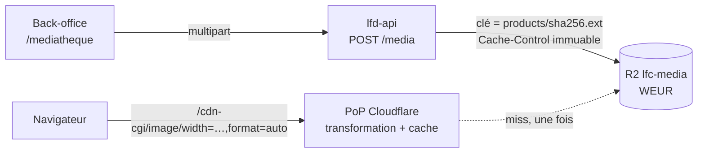

# Cloudflare et les images

> **Doc d'exploitation**, écrite le 2026-10-10 **contre le tableau de bord**
> (compte « Dev@lafoliedouce.com ») et contre une image de production. Elle
> dit ce qui est réglé chez Cloudflare pour servir les images du fonds, et
> comment le vérifier.
>
> Le **métier** des images — le fonds, ses gestes, ses porteurs — vit dans
> [`../mediatheque/mediatheque.md`](../mediatheque/mediatheque.md). L'ensemble
> des buckets R2 (pièces, bons, KBIS) vit dans
> [`architecture-stockage-r2.md`](architecture-stockage-r2.md).

---

## 1. Le chemin d'un octet

- **Le dépôt passe par l'API** : un droit, une validation des octets, une
  ligne en base.
- **La lecture ne passe jamais par nous** : le domaine média pointe sur le
  bucket. La sortie R2 est gratuite, et le coût de service ne dépend pas du
  trafic du backend.
- **La boutique ne demande jamais l'original** : `media-source.ts` réécrit
  l'URL en transformation (`width`, `format=auto`, `fit=scale-down`,
  `onerror=redirect`) et pose un `srcset`.

---

## 2. Ce qui est réglé, et où

Relevé le 2026-10-10 :

| Réglage                     | Où dans le tableau de bord                                    | Valeur                                                         |
| --------------------------- | ------------------------------------------------------------- | -------------------------------------------------------------- |
| Bucket                      | R2 Object Storage → `lfc-media`                               | région **Western Europe (WEUR)**, créé le 2026-08-22           |
| Domaine public              | `lfc-media` → Settings → Custom Domains                       | `media.lafoliecoffee.info`, **Active**, accès **Enabled**      |
| TLS minimum du domaine      | même ligne, « … » → Configure options                         | **1.2** (était 1.0, relevé le 2026-10-10 sur décision de Hugo) |
| URL de développement r2.dev | `lfc-media` → Settings → Public Development URL               | **désactivée** — un domaine sert                               |
| Transformations d'images    | Images & Stream → Transformations (zone `lafoliecoffee.info`) | **actives** (cf. §3)                                           |
| Offre Images & Stream       | Images & Stream → Plans                                       | **non souscrite** : palier gratuit (cf. §5)                    |
| Ramassage des orphelines    | Workers → `lfd-api` → Settings → Trigger events               | cron `30 3 * * *` (UTC)                                        |

**Un bucket à part, avec son propre jeton.** Le KBIS est privé (URL signée,
`attachment` forcé, aucun cache) ; l'image est publique (URL stable, `inline`,
cache permanent). Un jeton fuité côté images n'ouvre pas les papiers des
clients.

**Configuration de l'API** (`.github/workflows/deploy_lfd_api.yml`) :

| Nom                          | Nature   |
| ---------------------------- | -------- |
| `R2_MEDIA_ENDPOINT`          | variable |
| `R2_MEDIA_BUCKET`            | variable |
| `R2_MEDIA_PUBLIC_BASE_URL`   | variable |
| `R2_MEDIA_ACCESS_KEY_ID`     | secret   |
| `R2_MEDIA_SECRET_ACCESS_KEY` | secret   |

Sans elles, la plateforme démarre quand même : l'usage s'éteint, le bulletin
de démarrage nomme ce qui manque, et le dépôt répond
`MediaStorageUnavailableError`. ⚠️ Un secret posé ne relance rien : il faut
une image neuve du conteneur.

---

## 3. Ce que la transformation rend — mesuré

Le 2026-10-10, sur `products/069d2447….jpg` :

| Demande                                     | Réponse                                                   |
| ------------------------------------------- | --------------------------------------------------------- |
| l'original                                  | `image/jpeg`, **2 471 258 octets**                        |
| `width=360,format=auto` (navigateur récent) | `image/avif`, **8 452 octets**, `cf-resized: internal=ok` |

Le 2026-09-23, sur une autre image : 3,64 Mo → 21,5 Ko en tuile de 720 px
(AVIF), 123 Ko en ouverture de fiche à 1800 px.

- **On ne convertit rien au dépôt** et on ne stocke aucune dérivée : R2 garde
  **un** fichier par image, les dérivées vivent dans le cache de périphérie.
- ⚠️ **Le repli est silencieux.** `onerror=redirect` renvoie l'original si la
  transformation échoue — quota épuisé, réglage défait, panne. La boutique
  redevient lourde, elle ne casse pas, et **rien ne le signale** : seul le
  poids servi le dit (§6).
- ⚠️ Le serveur d'images rétrécit, il n'invente pas de pixels : un original de
  400 px reste flou à 1800.

---

## 4. Le cache

**Depuis le 2026-10-10, une image se dépose avec
`Cache-Control: public, max-age=31536000, immutable`** (`R2MediaStore`).
C'est l'adressage par le contenu qui le permet : une clé ne désigne jamais
deux contenus, donc rien n'est à purger.

⚠️ Avant cette date, aucun dépôt ne posait l'en-tête — alors que
`content-address.ts` justifiait l'adressage par lui. Le domaine servait le
défaut du bucket, `max-age=14400` (4 h). **Les objets déposés avant le
2026-10-10 gardent cet en-tête** : sans conséquence grave (le PoP revient au
bucket toutes les 4 h), et un redépôt du même fichier ne change pas l'objet
existant.

---

## 5. Ce que ça coûte

| Poste                      | Prix                                               | Gratuit chaque mois |
| -------------------------- | -------------------------------------------------- | ------------------- |
| Stockage R2                | 0,015 $/Go-mois (2026-08)                          | 10 Go-mois          |
| Opérations R2 A (écriture) | 4,50 $/million                                     | 1 million           |
| Opérations R2 B (lecture)  | 0,36 $/million                                     | 10 millions         |
| Sortie R2 vers Internet    | **0 $**                                            | —                   |
| Transformations uniques    | 1 $ par 2 000 supplémentaires (relu le 2026-10-10) | **5 000**           |

Le fonds tient dans les paliers gratuits : deux images au bucket le
2026-10-10. Le seul poste qui croît avec le trafic est la transformation —
à peu près quatre uniques par image (deux largeurs × deux rôles), soit le
plafond gratuit vers 1 250 images.

🔵 **Non tranché : que se passe-t-il au-delà de 5 000 ?** L'offre
« Images & Stream » (« à partir de 0 $/mois ») n'est **pas souscrite**. Si le
dépassement exige l'offre, les transformations **s'arrêtent** au lieu de se
facturer — et le repli silencieux du §3 prend le relais. Trois façons de
lever le doute, du moins cher au plus tardif : cliquer « Purchase » sur
l'offre à 0 $ (on verra si une carte est demandée), demander au support, ou
surveiller le poids servi en approchant des 1 250 images.

---

## 6. Vérifier

| Question                              | Geste                                                                                                         | Ce qui est attendu                                                        |
| ------------------------------------- | ------------------------------------------------------------------------------------------------------------- | ------------------------------------------------------------------------- |
| La transformation marche-t-elle ?     | `curl -sI -H 'Accept: image/avif' https://media.lafoliecoffee.info/cdn-cgi/image/width=360,format=auto/<clé>` | `cf-resized: internal=ok`, `content-type: image/avif`, quelques Ko        |
| Une image neuve est-elle immuable ?   | `curl -sI https://media.lafoliecoffee.info/<clé>`                                                             | `cache-control: public, max-age=31536000, immutable`                      |
| Le ramassage tourne-t-il ?            | Workers → `lfd-api` → Observability, recherche `media/sweep`, 7 jours                                         | des succès quotidiens, 0 erreur (10 succès sur les 7 jours au 2026-10-10) |
| A-t-il plafonné ?                     | le rapport du passage (`capped`) dans le même journal                                                         | `false` ; `true` dit qu'il reste du travail                               |
| Le domaine refuse-t-il le vieux TLS ? | R2 → `lfc-media` → Settings → Custom Domains                                                                  | Minimum TLS **1.2**                                                       |

Une clé se lit dans R2 → `lfc-media` → Objects → `products/`.
