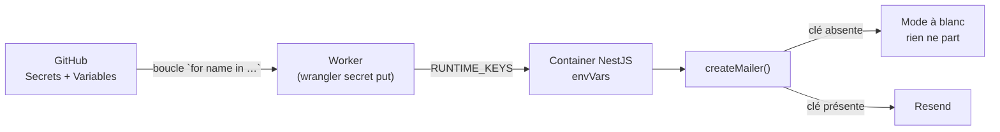

# Mailer Resend — la mise en service

> **Ce que ce document est** : la procédure pour que les e-mails partent
> réellement en production. Le code est fait et testé ; ce qui reste est de la
> configuration, dont une partie a un **délai externe** (la propagation DNS).
>
> **Ce qu'il n'est pas** : une description du paquet. Pour ça,
> [`@lfd/mailer`](../../packages/mailer/src/index.ts) porte sa propre doc.

## 0. La règle qui rend cette page dangereuse à mal lire

Le mailer **ne tombe jamais en panne visible**. Sans clé, il rend les gabarits,
les journalise, et rend la main comme si tout allait bien
([`create-mailer.ts`](../../packages/mailer/src/create-mailer.ts)). C'est le bon
comportement — un fournisseur d'e-mail en panne ne doit pas refuser une
réservation — mais ça veut dire qu'**un mailer mal configuré ressemble
exactement à un mailer qui marche**, vu de l'écran.

La seule preuve est un e-mail reçu. Pas un déploiement vert, pas un 200.

## 1. Le domaine — décidé le 2026-08-16

**`lafoliecoffee.info`**, zone **Cloudflare** (`haley` / `clint.ns.cloudflare.com`),
**vide** au moment de la décision : aucun `MX`, aucun `A`, aucun `TXT`.

Les autres domaines du dépôt ne conviennent pas, et il faut savoir pourquoi pour
ne pas y revenir :

| Domaine            | Ce qu'il est                                                               |
| ------------------ | -------------------------------------------------------------------------- |
| `lafoliedouce.eu`  | le tenant Auth0, et les **audiences** — des identifiants, pas des adresses |
| `lafoliedouce.fr`  | l'ancien défaut du code — **personne ne le possède**                       |
| `lafoliecoffee.fr` | l'adresse de contact affichée côté client — placeholder, `.fr` ≠ `.info`   |

**Ce qui compte n'est pas l'esthétique : c'est le DNS.** Un domaine non vérifié
chez Resend fait **refuser l'envoi côté fournisseur** — l'e-mail ne part pas, et
le seul endroit où ça se voit est le journal (`Envoi Resend refusé`).

### Une seule adresse pour tout le transactionnel : `no-reply@lafoliecoffee.info`

Sur l'**apex**, et c'est ce que voit la personne qui reçoit. Elle porte les trois
démarches, qui partent toutes du **même** mailer :

| Démarche                     | Gabarit                  | Déclencheur                    |
| ---------------------------- | ------------------------ | ------------------------------ |
| Ouverture d'accès **client** | `customer.access-opened` | un commercial ouvre un compte  |
| Invitation **staff**         | `staff.invited`          | un admin invite un collègue    |
| Alertes internes             | `staff.*`                | RDV, demande de contact, seuil |

**Auth0 n'envoie aucun de ces e-mails.** Il fabrique seulement le lien à usage
unique (`passwordSetupUrl`, un ticket de la Management API) ; c'est notre backend
qui le met en page et l'expédie
([`grant-account-access.service.ts`](../../apps/lfc-B2B-platform-backend/src/account/application/services/grant-account-access.service.ts),
[`invite-staff-user.handler.ts`](../../apps/lfc-B2B-platform-backend/src/staff-users/application/invite-staff-user.handler.ts)).
Une seule adresse d'expédition couvre donc réellement les deux mondes — il n'y a
pas de fournisseur d'e-mail à configurer côté Auth0.

### Envoi sur l'apex, réception sur l'apex — sans collision

|                         | Enregistrements                                  | Qui les sert             |
| ----------------------- | ------------------------------------------------ | ------------------------ |
| **Envoi** (sortant)     | `TXT resend._domainkey` · `MX send` · `TXT send` | Resend                   |
| **Réception** (entrant) | `MX @` · `TXT @` (SPF)                           | Cloudflare Email Routing |

**Resend pose son `MX` et son SPF sur `send.<domaine>`, jamais sur l'apex**,
même quand on enregistre l'apex chez lui ([doc Resend / Cloudflare](https://resend.com/docs/dashboard/domains/cloudflare)).
Seul le DKIM, un `TXT`, atterrit à la racine de la zone. Il n'y a donc **aucun
conflit** avec le `MX` que pose Email Routing : les deux services cohabitent sur
le même domaine.

> Une version antérieure de cette page affirmait le contraire et rendait le
> sous-domaine d'envoi obligatoire. C'était faux, et ça coûtait une adresse
> d'expédition plus laide sans rien acheter.

⚠️ **Un seul enregistrement SPF par nom.** Email Routing pose le sien sur l'apex,
Resend le sien sur `send` : deux noms, donc pas de fusion à faire. Mais si un
jour un `TXT v=spf1…` doit être ajouté à l'apex, il faut **fusionner** avec celui
de Cloudflare — deux SPF sur le même nom invalident les deux.

⚠️ **La zone n'a aucun `MX`, donc aucune adresse `@lafoliecoffee.info` ne reçoit
quoi que ce soit.** C'est l'état voulu aujourd'hui (§2.5), et c'est ce qui
interdit de poser `MAILER_REPLY_TO` et `MAILER_STAFF_INBOX` : elles
désigneraient des boîtes qui n'existent pas, et un e-mail envoyé à une adresse
inexistante ne produit aucun symptôme visible de notre côté.

### Deux adresses sur le même domaine, et le risque qu'on accepte

**Décision du 2026-08-16** : `no-reply@` (transactionnel) et `news@` (commercial)
partagent `lafoliecoffee.info`. Une fois l'apex vérifié, **n'importe quelle
adresse du domaine peut expédier** — `news@` n'a donc demandé aucun
enregistrement de plus.

Le risque assumé : un e-mail de promotion récolte des plaintes « indésirable » ;
un lien de mot de passe doit arriver. Sur le même domaine, les premières
dégradent la réputation du second, et le symptôme est le pire de tous — des
clients qui ne reçoivent plus leur accès, sans erreur nulle part.

**Le signal qui doit faire changer d'avis** : dès que l'envoi commercial devient
régulier ou volumineux, ou au premier taux de plainte visible dans les métriques
Resend, il déménage sur `news.lafoliecoffee.info`, enregistré comme un **second**
domaine avec sa réputation à lui. `MAILER_FROM_ADDRESS` ne bouge pas ce jour-là :
c'est un ajout, pas une migration.

## 2. Chez Resend (tableau de bord, à la main)

> ✅ **Fait le 2026-08-16** — domaine `lafoliecoffee.info` créé sur le compte
> `lafoliedouce`, région Ireland (eu-west-1), les 4 enregistrements posés dans
> Cloudflare par import BIND et résolvant publiquement. Ce qui suit est la
> procédure, gardée pour la refaire (second domaine, autre environnement).

1. **Domains → Add Domain** — `lafoliecoffee.info`, région **EU** (cohérent avec
   l'ancrage WEUR des containers ; les données d'envoi restent dans la même
   juridiction).

   **Manual setup, pas « Auto configure »** : la configuration automatique
   demande un accès OAuth en écriture sur toute la zone Cloudflare. Poser quatre
   enregistrements à la main ne coûte rien et n'accorde aucun droit permanent à
   un tiers.

   Le plus rapide est l'**import BIND** (DNS → Records → Import), qui pose les
   quatre d'un coup et évite quatre saisies à recopier :

   ```
   resend._domainkey.<domaine>. 1 IN TXT "p=…"
   send.<domaine>.              1 IN MX 10 feedback-smtp.eu-west-1.amazonses.com.
   send.<domaine>.              1 IN TXT "v=spf1 include:amazonses.com ~all"
   _dmarc.<domaine>.            1 IN TXT "v=DMARC1; p=none;"
   ```

   Laisser **« Proxy imported DNS records » décoché** — un `TXT` ou un `MX` ne
   se proxifie pas.

2. Resend affiche les enregistrements à poser. Ils sont de trois familles, et
   les trois comptent :
   - **DKIM** (`TXT`, sur `resend._domainkey`) — la signature. Sans elle, rien
     ne part.
   - **SPF** (`TXT` + `MX` sur `send`) — l'autorisation, et le retour des
     rebonds. Posés par Resend sur ce sous-domaine, pas sur l'apex.
   - **DMARC** (`TXT` sur `_dmarc`) — la politique. Facultatif chez Resend,
     **pas** pour Gmail et Outlook, qui l'exigent de tout expéditeur en volume.
     Commencer à `p=none` : on observe avant de rejeter.
3. **Poser ces enregistrements dans la zone Cloudflare**, en **DNS only**
   (nuage gris — un `TXT` ou un `MX` ne se proxifie pas), puis **Verify**. C'est
   le délai externe : de quelques minutes à quelques heures. À lancer en premier.

   ⚠️ Cloudflare ajoute le suffixe de zone tout seul. Le nom à saisir est
   `resend._domainkey`, **pas** `resend._domainkey.lafoliecoffee.info` — sinon
   l'enregistrement atterrit sur `…lafoliecoffee.info.lafoliecoffee.info` et la
   vérification échoue sans dire pourquoi.

4. **API Keys → Create** — permission **Sending access** seulement, et
   **restreinte au domaine** vérifié. Une clé d'envoi qui ne sait pas lire les
   journaux ni gérer les domaines ne peut pas grand-chose si elle fuit.

### 2.5 — La réception, volontairement PAS ouverte

**Décision du 2026-08-16 : on n'ouvre aucune adresse de réception pour l'instant.**
Ni `contact@`, ni `commercial@`, ni le `MX` d'Email Routing sur l'apex.

Ce que ça coûte, en clair, pour que ce soit un choix et pas un oubli :

- **`MAILER_REPLY_TO` reste vide** → une personne qui répond à son invitation
  écrit à `no-reply@`, qui ne reçoit rien. Sa réponse est perdue, et personne ne
  saura qu'elle a répondu.
- **`MAILER_STAFF_INBOX` reste vide** → aucune alerte interne ne part (RDV pris,
  demande de contact, seuil franchi). Le code s'en abstient délibérément plutôt
  que d'envoyer au hasard, donc ça ne casse rien — ça reste éteint, en silence.

L'ouverture d'accès client, elle, fonctionne : elle ne dépend que de l'envoi.

**Pour ouvrir la réception le jour venu** : Cloudflare, zone
`lafoliecoffee.info` → **Email → Email Routing** → activer (Cloudflare pose les
`MX` de l'apex), puis créer les adresses de destination — chacune demande une
confirmation dans la boîte cible. Elles peuvent pointer vers la même boîte au
départ ; ce qui compte est que les **adresses** soient distinctes, pour que la
séparation future soit un changement de routage et pas un redéploiement.

⚠️ Ne pas activer « **Enable Receiving** » côté Resend à la place : celui-là pose
un `MX` **sur l'apex** (`inbound-smtp…`), et là le conflit avec Email Routing est
réel. L'envoi n'en a pas besoin.

## 3. Dans GitHub

La valeur se copie **du tableau de bord Resend vers GitHub, directement** :
jamais par un terminal, jamais dans une conversation, jamais dans un fichier du
dépôt (cf. [`secrets-et-variables.md §5`](secrets-et-variables.md)).

| Nom                         | Où              | Valeur                                          |
| --------------------------- | --------------- | ----------------------------------------------- |
| `RESEND_MAILER_B2B_API_KEY` | 🔒 **Secret**   | la clé créée en §2.4                            |
| `MAILER_FROM_ADDRESS`       | 📢 **Variable** | `no-reply@lafoliecoffee.info`                   |
| `MAILER_REPLY_TO`           | —               | **à ne PAS poser** tant que §2.5 n'est pas fait |
| `MAILER_STAFF_INBOX`        | —               | idem                                            |

- **`MAILER_FROM_ADDRESS`** — c'est aussi le défaut du code
  ([`env-readers.ts`](../../apps/lfc-B2B-platform-backend/src/infra/config/env-readers.ts)) :
  poser la Variable rend le réglage explicite, ne pas la poser ne casse rien.
- **Les deux autres restent vides**, et c'est le bon état tant qu'aucune adresse
  n'est routée. **Une adresse non routée est pire qu'une variable vide** : le
  code croit le canal ouvert, et l'e-mail part vers un serveur qui n'existe pas.
  Vide, il s'abstient — ce que le bulletin de démarrage dira à voix haute.

⚠️ Le bulletin de démarrage annoncera donc `Démarré en mode dégradé`, en nommant
les canaux éteints. **C'est attendu**, pas une panne : seul le canal d'envoi
devait être ouvert aujourd'hui.

## 4. Déployer — et pourquoi un simple « save » ne suffit pas



⚠️ **Une variable qui change ne redémarre pas le container.** Les `envVars` ne
sont lues qu'à son démarrage, et poser un secret ne déclenche **aucun** rollout
— seule une **image neuve** le fait. Poser les quatre valeurs puis attendre ne
change donc rien : il faut relancer le workflow
[`deploy_b2b_backend.yml`](../../.github/workflows/deploy_b2b_backend.yml).

Les trois maillons de ce schéma sont tenus par
[`container/__tests__/runtime-keys.spec.ts`](../../apps/lfc-B2B-platform-backend/container/__tests__/runtime-keys.spec.ts),
qui compare les trois listes de noms **dans les deux sens**. Ajouter un réglage
sans l'ajouter partout casse la CI, ce qui est le but : la version précédente de
cette chaîne a laissé `MAILER_REPLY_TO` branché sur du vide pendant des semaines,
sans un mot.

## 5. Vérifier — dans cet ordre

1. **Le bulletin de démarrage.** Le backend dit à voix haute ce qu'il ne sait
   pas faire ([`startup-report.service.ts`](../../apps/lfc-B2B-platform-backend/src/infra/startup/startup-report.service.ts)).
   Attendu dans les logs du container :

   ```
   [Démarrage] Tous les canaux sont configurés.
   ```

   Aujourd'hui on lira `Démarré en mode dégradé`, en nommant le courrier
   entrant : c'est le §2.5 non fait, et c'est voulu. Ce qui compte est que le
   **Courrier transactionnel** ne figure PAS dans la liste des canaux éteints —
   sinon la clé n'est pas arrivée jusqu'au container. C'est le contrôle le moins
   cher, et il précède tous les autres.

2. **Un vrai envoi.** Ouvrir un compte client depuis le back-office, sur une
   adresse qu'on relève. L'e-mail attendu est `customer.access-opened`, objet
   « Votre accès à l'espace pro … », avec un bouton « Choisir mon mot de passe ».
   C'est le seul contrôle qui prouve la chaîne entière — clé, domaine, DKIM,
   délivrabilité.

3. **La boîte de réception, pas seulement l'envoi.** Un e-mail accepté par
   Resend peut finir en indésirable. Vérifier sur au moins une adresse Gmail et
   une adresse Outlook, et regarder l'en-tête d'authentification (`spf=pass`,
   `dkim=pass`, `dmarc=pass`).

4. **Répondre à l'e-mail reçu** — le jour où §2.5 sera fait. C'est le seul moyen
   de constater que `MAILER_REPLY_TO` est juste ; un `no-reply` qui rebondit ne
   se voit pas autrement. Aujourd'hui, la réponse se perd, et c'est assumé.

## 6. Ce qui reste ouvert après cette page

- Les deux **points d'appel** manquants (RDV pris, demande de contact déposée)
  — cf. [`todo-notifications.md`](../todos/todo-notifications.md) §1. Le
  transport marchera avant que ces deux e-mails existent.
- Les **e-mails au client** au-delà de l'ouverture d'accès (accusé de réception,
  rappel J-1, confirmation de commande) supposent une décision produit sur le
  désabonnement, pas seulement un domaine vérifié.
