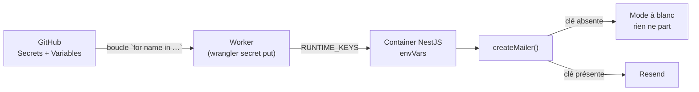

# Mailer Resend — la mise en service

> **Ce que ce document est** : la procédure pour que les e-mails partent
> réellement en production. Le code est fait et testé ; ce qui reste est de la
> configuration, dont une partie a un **délai externe** (la propagation DNS).
>
> **Ce qu'il n'est pas** : une description du paquet. Pour ça,
> [`@lfd/mailer`](../../packages/mailer/src/index.ts) porte sa propre doc.

## 0. La règle qui rend cette page dangereuse à mal lire

Le mailer **ne tombe jamais en panne visible**. Sans clé, il rend les gabarits,
les journalise, et rend la main comme si tout allait bien
([`create-mailer.ts`](../../packages/mailer/src/create-mailer.ts)). C'est le bon
comportement — un fournisseur d'e-mail en panne ne doit pas refuser une
réservation — mais ça veut dire qu'**un mailer mal configuré ressemble
exactement à un mailer qui marche**, vu de l'écran.

La seule preuve est un e-mail reçu. Pas un déploiement vert, pas un 200.

## 1. La décision à prendre en premier : le domaine d'expédition

Trois domaines circulent dans le dépôt, et ils ne désignent pas la même chose :

| Domaine            | Ce qu'il est aujourd'hui                                                   |
| ------------------ | -------------------------------------------------------------------------- |
| `lafoliedouce.fr`  | le **défaut du code** (`DEFAULT_FROM_ADDRESS`) — jamais vérifié            |
| `lafoliedouce.eu`  | le tenant Auth0, et les **audiences** — des identifiants, pas des adresses |
| `lafoliecoffee.fr` | l'adresse de contact affichée côté client (placeholder assumé)             |

**Ce qui compte n'est pas l'esthétique : c'est le DNS.** Le domaine choisi doit
être une zone dont on tient les enregistrements. Un domaine non vérifié chez
Resend fait **refuser l'envoi côté fournisseur** — l'e-mail ne part pas, et le
seul endroit où ça se voit est le journal (`Envoi Resend refusé`).

Recommandation : expédier depuis un **sous-domaine dédié** (`mail.<domaine>` ou
`send.<domaine>`). La réputation d'expédition de la plateforme reste alors
séparée de celle du domaine principal — un incident sur les e-mails
transactionnels n'emporte pas le courrier de l'entreprise.

## 2. Chez Resend (tableau de bord, à la main)

1. **Domains → Add Domain** — le sous-domaine choisi en §1, région **EU**
   (cohérent avec l'ancrage WEUR des containers ; les données d'envoi restent
   dans la même juridiction).
2. Resend affiche les enregistrements à poser. Ils sont de trois familles, et
   les trois comptent :
   - **DKIM** (`TXT`, sur `resend._domainkey.<sous-domaine>`) — la signature.
     Sans elle, rien ne part.
   - **SPF** (`TXT` + `MX` sur le sous-domaine d'envoi) — l'autorisation.
   - **DMARC** (`TXT` sur `_dmarc.<domaine>`) — la politique. Facultatif chez
     Resend, **pas** pour Gmail et Outlook, qui l'exigent de tout expéditeur en
     volume. Commencer à `p=none` : on observe avant de rejeter.
3. **Poser ces enregistrements dans la zone DNS**, puis **Verify**. C'est le
   délai externe : de quelques minutes à quelques heures. À lancer en premier.
4. **API Keys → Create** — permission **Sending access** seulement, et
   **restreinte au domaine** vérifié. Une clé d'envoi qui ne sait pas lire les
   journaux ni gérer les domaines ne peut pas grand-chose si elle fuit.

## 3. Dans GitHub

La valeur se copie **du tableau de bord Resend vers GitHub, directement** :
jamais par un terminal, jamais dans une conversation, jamais dans un fichier du
dépôt (cf. [`secrets-et-variables.md §5`](secrets-et-variables.md)).

| Nom                         | Où              | Valeur                                                                   |
| --------------------------- | --------------- | ------------------------------------------------------------------------ |
| `RESEND_MAILER_B2B_API_KEY` | 🔒 **Secret**   | la clé créée en §2.4                                                     |
| `MAILER_FROM_ADDRESS`       | 📢 **Variable** | `no-reply@<sous-domaine vérifié>` — **doit** être sur le domaine vérifié |
| `MAILER_REPLY_TO`           | 📢 **Variable** | l'adresse où atterrit une réponse humaine                                |
| `MAILER_STAFF_INBOX`        | 📢 **Variable** | la boîte de l'équipe commerciale (alertes internes)                      |

Sur les deux dernières :

- **`MAILER_REPLY_TO`** — l'expéditeur est un `no-reply`. Sans cette variable,
  une personne qui répond à son invitation écrit dans le vide, et personne ne
  saura jamais qu'elle a répondu. C'est le défaut le moins visible des trois.
- **`MAILER_STAFF_INBOX`** — absente, aucune alerte interne ne part, et c'est
  **délibéré** : on n'envoie pas plutôt que d'envoyer au hasard.

## 4. Déployer — et pourquoi un simple « save » ne suffit pas



⚠️ **Une variable qui change ne redémarre pas le container.** Les `envVars` ne
sont lues qu'à son démarrage, et poser un secret ne déclenche **aucun** rollout
— seule une **image neuve** le fait. Poser les quatre valeurs puis attendre ne
change donc rien : il faut relancer le workflow
[`deploy_b2b_backend.yml`](../../.github/workflows/deploy_b2b_backend.yml).

Les trois maillons de ce schéma sont tenus par
[`container/__tests__/runtime-keys.spec.ts`](../../apps/lfc-B2B-platform-backend/container/__tests__/runtime-keys.spec.ts),
qui compare les trois listes de noms **dans les deux sens**. Ajouter un réglage
sans l'ajouter partout casse la CI, ce qui est le but : la version précédente de
cette chaîne a laissé `MAILER_REPLY_TO` branché sur du vide pendant des semaines,
sans un mot.

## 5. Vérifier — dans cet ordre

1. **Le bulletin de démarrage.** Le backend dit à voix haute ce qu'il ne sait
   pas faire ([`startup-report.service.ts`](../../apps/lfc-B2B-platform-backend/src/infra/startup/startup-report.service.ts)).
   Attendu dans les logs du container :

   ```
   [Démarrage] Tous les canaux sont configurés.
   ```

   Si à la place on lit `Démarré en mode dégradé`, la ligne qui suit nomme la
   variable à poser. C'est le contrôle le moins cher, et il précède tous les
   autres.

2. **Un vrai envoi.** Ouvrir un compte client depuis le back-office, sur une
   adresse qu'on relève. L'e-mail attendu est `customer.access-opened`, objet
   « Votre accès à l'espace pro … », avec un bouton « Choisir mon mot de passe ».
   C'est le seul contrôle qui prouve la chaîne entière — clé, domaine, DKIM,
   délivrabilité.

3. **La boîte de réception, pas seulement l'envoi.** Un e-mail accepté par
   Resend peut finir en indésirable. Vérifier sur au moins une adresse Gmail et
   une adresse Outlook, et regarder l'en-tête d'authentification (`spf=pass`,
   `dkim=pass`, `dmarc=pass`).

4. **Répondre à l'e-mail reçu.** C'est le seul moyen de constater que
   `MAILER_REPLY_TO` est juste. Un `no-reply` qui rebondit ne se voit pas
   autrement.

## 6. Ce qui reste ouvert après cette page

- Les deux **points d'appel** manquants (RDV pris, demande de contact déposée)
  — cf. [`todo-notifications.md`](../todos/todo-notifications.md) §1. Le
  transport marchera avant que ces deux e-mails existent.
- Les **e-mails au client** au-delà de l'ouverture d'accès (accusé de réception,
  rappel J-1, confirmation de commande) supposent une décision produit sur le
  désabonnement, pas seulement un domaine vérifié.
