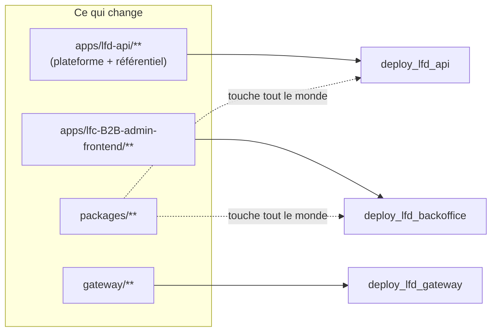
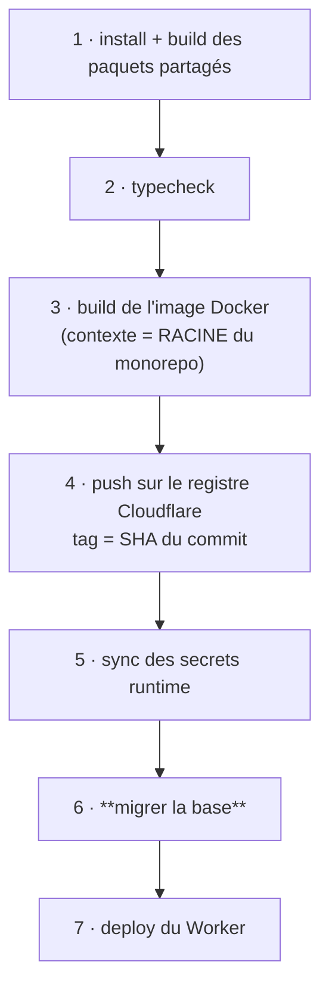

# Pipelines — qui déclenche quoi, et dans quel ordre

✅ **État réel au 2026-08-13.** Huit workflows : un de contrôle, sept de
déploiement.

## 1. Le déclenchement

Tout part de `main`, par **filtres de chemins** : un commit qui ne touche qu'un
front ne redéploie pas l'API.

Depuis **B2c**, le référentiel produit vit dans `apps/lfd-api/src/pim/` : il n'a
plus de workflow à lui, et un changement du catalogue redéploie l'API unique.
Le Worker `lfc-pim-backend` **tourne encore**, sur sa dernière image — plus rien
ne le met à jour, et il s'éteindra en B2e quand la passerelle routera `/api/pim`
vers le Worker de l'API.

⚠️ **`packages/**` déclenche presque tout.** C'est voulu : `@lfd/endpoints` et
`@lfd/contracts` sont des contrats partagés, un changement s'y propage partout.
C'est aussi pourquoi un commit sur `packages/` coûte cher en temps de CI.

⚠️ **Une variable GitHub qui change ne déclenche RIEN.** Elle n'est lue qu'au
build. Après avoir modifié une variable, il faut relancer le workflow à la main
(`workflow_dispatch`) — sinon la valeur reste celle du dernier déploiement, et
tout paraît vert.

## 2. L'ordre à l'intérieur d'un déploiement de backend

C'est la partie qui compte, et elle n'est pas négociable.

**Pourquoi la migration en 6 et pas en 1.** Le schéma doit précéder le code —
mais le plus tard possible avant lui. Migrer en tête intercalerait le build et
le push de l'image entre le nouveau schéma et le nouveau code : plusieurs
minutes pendant lesquelles l'**ancien** container servirait le trafic contre le
**nouveau** schéma. Ici la fenêtre se réduit au `wrangler deploy`.

⚠️ **Elle ne disparaît pas.** Un déplacement de données sur une base vivante se
fait en **trois déploiements** — étendre, basculer, resserrer — jamais en une
migration qui `DROP` ce que le code en ligne lit encore.

**Pourquoi les secrets avant la migration.** `wrangler secret put` alimente le
container ; la migration, elle, lit le secret GitHub directement. L'ordre
protège surtout du cas « premier déploiement » : un Worker déployé avant que ses
secrets existent meurt au boot.

`prisma migrate deploy` n'applique **que** les migrations existantes : il n'en
génère aucune et ne réinitialise jamais. Il échoue plutôt que de forcer, ce qui
bloque le déploiement — c'est voulu. Mieux vaut l'ancienne version en ligne
qu'une nouvelle sur un schéma à moitié migré.

## 3. Ce que la CI couvre — et ce qu'elle ne couvre pas

`ci.yml` a huit jobs plus une barrière — et **cinq ne tournent que si le commit les concerne** :

| Job              | Périmètre                                                         |
| ---------------- | ----------------------------------------------------------------- |
| `changes`        | calcule le PÉRIMÈTRE via le graphe turbo — toujours               |
| `gates`          | les 14 portes qui balaient tout le dépôt — toujours               |
| `packages`       | les paquets partagés, en premier et à part                        |
| `b2b-checks`     | typechecks, lint et les 207 suites unitaires du backend           |
| `b2b-backend`    | les 51 suites e2e, **4 shards × 2 workers** (une base par worker) |
| `front-admin`    | l'admin staff (PIM compris) — lint, typecheck, tests, build AOT   |
| `front-platform` | la boutique client — typecheck, tests, build AOT                  |
| `gateway`        | typecheck, lint et 8 tests de routage du Worker d'entrée          |
| `ci-gate`        | échoue si l'un d'eux est rouge — **le seul statut requis**        |

### Le périmètre — n'exécuter que ce que le commit concerne

turborepo était dans le dépôt depuis toujours et la CI ne s'en servait pas : les
quatre chantiers repartaient à chaque push. La promotion du 2026-08-29 portait
**369 fichiers de front pour 14 de backend**, et les e2e backend — le chemin
critique — ont tourné pour rien.

Le job `changes` demande à turbo la seule chose que `git diff` ignore : le
**graphe**. Toucher `packages/contracts` concerne les trois apps qui le
consomment, et lui seul le sait. Les autres jobs portent alors un
`if: needs.changes.outputs.<zone> == 'true'`.

**Règle de sûreté, écrite dans `dev-toolbox/ci/affected.mjs` : dans le doute, on
lance tout.** Base introuvable (premier push, force-push, historique tronqué),
sortie illisible, turbo absent — chacun rend « tout ». Un job lancé pour rien
coûte des minutes ; un job sauté à tort laisse passer une régression, et la
porte ne vaut plus rien. Les deux erreurs ne se paient pas dans la même monnaie.

Deux conséquences à connaître :

- Le paquet racine `//` vaut « tout », et il absorbe ce qui n'appartient à aucun
  paquet : `documentation/`, la CI, le lockfile. Un commit de documentation
  relance donc l'ensemble. Gâchis assumé, du bon côté.
- `changes` n'a **pas** droit au sauté dans la barrière : c'est lui qui décide
  des autres. S'il échoue, personne n'a été mesuré.

⚠️ Le filtrage a créé un trou qu'il a fallu boucher dans le même geste : **dix
des douze gates balaient tout le dépôt**, et elles vivaient réparties entre le
job backend et celui des fronts. Tant que ces deux-là tournaient toujours, la
répartition ne se voyait pas. Rendus conditionnels, un commit backend seul
sautait les jobs de front — et avec eux la porte des cycles d'import, qui lit
pourtant `apps/**` en entier. D'où le job `gates`, global et inconditionnel :
**une porte globale appartient à un job global.**

### Pourquoi `b2b-checks` existe

Le backend tenait à lui seul le chemin critique : **10 min 12 sur une CI de
10 min 25** (run vert du 2026-08-27), dont **8 minutes** pour une seule étape,
« Tests (unitaires + e2e) ».

La cause n'était pas la lenteur des tests mais une **file d'attente**. Les e2e
partagent une base jetable qu'elles tronquent entre les cas ; elles imposent donc
`maxWorkers: 1`. Ce worker unique tenait aussi les 207 suites unitaires, qui ne
touchent aucune base et n'avaient aucune raison d'attendre. Mesuré le
2026-08-29 : **7 secondes** pour ces 207 suites (1 704 tests) lancées seules, à
sept cœurs.

Trois configurations Jest portent désormais la séparation, et le mur qui la rend
vraie est écrit dans `jest.unit.cjs` : une spec qui a besoin d'une vraie base
n'est pas une unitaire, elle prend le suffixe `.e2e-spec.ts` et descend dans
`test/`.

### Le découpage des shards, par durée

Jest sait sharder (`--shard=3/4`) mais il **trie les chemins** : il n'a aucune
notion de durée. D'où l'écart mesuré en CI — 1 min 46 pour le shard 1, 4 min 05
pour le shard 3, à nombre de suites égal. Le plus lent tient la CI ; les trois
autres attendent.

`dev-toolbox/ci/e2e-shard.mjs` lui retire la décision : il imprime la liste des
suites d'un shard, que Jest reçoit par `--runTestsByPath`. L'algorithme est le
glouton par durée décroissante (le plus long d'abord, chacun au shard le moins
chargé) — quinze lignes, et il ne dépasse jamais 4/3 de l'optimal.

Mesuré : **55 s · 55 s · 55 s · 57 s**, contre 33/39/54/39 auparavant. L'écart
passe de 1,6× à 1,04×. Les shards n'ont plus le même nombre de suites
(11/13/13/14) — c'est le but.

**Les durées sont VERSIONNÉES** (`apps/lfd-api/test/e2e-durations.json`),
régénérées à la main par `pnpm --filter lfd-api e2e:rebalance`, et non tirées
d'un cache réécrit à chaque run. Un cache enregistrerait surtout le **bruit** :
les runners varient du simple au triple (mesuré : les mêmes 51 suites en 6 min 40
puis 16 min 45). Le découpage danserait sans que rien de réel n'ait changé, et
deux runs du même commit ne feraient pas le même travail. Un fichier committé se
relit en diff, donc s'accuse.

🔴 **Une suite ne peut pas ne pas tourner.** La partition porte sur les fichiers
présents **sur le disque**, jamais sur les clés du JSON : une suite ajoutée sans
mesure prend un poids par défaut (la moyenne des connues) et part dans un shard
comme les autres. Le fichier ne décide que de l'**équilibre**, jamais du
périmètre. Le gate `lint:e2e-durations` veille sur l'entretien, pas sur la
correction.

### Les deux fronts, un job chacun

Ils vivaient dans un seul job, donc **en série** : tests puis tests, build puis
build. Sur le run vert du 2026-08-29, la seule étape « Tests des fronts » pesait
**2 min 16** d'un job de 3 min 53 (admin 745 tests, boutique 184).

Séparés, ils tournent sur deux machines — et surtout ils ont **chacun leur
périmètre**. Un commit qui ne touche que la boutique ne relance plus les 745
tests de l'admin ni sa compilation AOT.

⚠️ Piège rencontré en le faisant : le job `changes` déclare ses sorties une par
une. Renommer une zone dans `affected.mjs` sans toucher ce bloc laisse un
`if: needs.changes.outputs.<zone>` pointer une sortie **inexistante** — qui vaut
la chaîne vide, donc `false`. Les deux jobs auraient été sautés **en silence**,
et la CI verte pour le dire.

### Le sharding des e2e

Sorties de la file, les e2e sont devenues **tout** le chemin critique — et elles
sont violemment variables : les mêmes 51 suites ont pris **6 min 40** puis
**16 min 45** sur deux runs consécutifs, à code identique.

Le chronomètre par suite (`apps/lfd-api/test/slow-suites.reporter.cjs`) a tranché
la question « quelle suite explose ? » : **aucune**. La distribution est plate,
~5 s par suite, et le temps ne suit pas le nombre de tests — `resend-webhook`
met 6,5 s pour 6 tests quand `staff-roles` met 11,9 s pour 40. Le coût est
l'**amorçage de l'application Nest**, payé 51 fois.

D'où quatre shards. Mesuré en local, `--shard=i/4` donne 33 s / 39 s / 54 s /
39 s là où le run entier prend 264 s : le pire shard vaut **un cinquième** du
tout. Le découpage par chemin suffit précisément parce que la distribution est
plate.

Le `maxWorkers: 1` reste vrai **à l'intérieur** d'un shard. Ce qui change, c'est
que les quatre tournent chacun sur SA machine, donc chacun avec sa base et son
stockage : deux suites ne partagent plus rien du tout.

### La fin du worker unique

Les e2e tournaient en `--runInBand` pour une raison écrite noir sur blanc dans
leur configuration : elles tronquent la base entre chaque cas, donc deux suites
en parallèle s'effacent leurs fixtures. Un staff semé par l'une n'existe plus
quand l'autre l'interroge, le mur refuse, et **le 403 est parfaitement
légitime** — c'est ce qui rendait la panne illisible.

La raison reste vraie ; c'est la réponse qui a changé. Chaque worker a
désormais **sa base** (`lfc_b2b_test_w1`, `_w2`, …) et **son bucket**
(`lfc-b2b-test-w1`, …). Deux suites ne partagent plus rien, donc elles peuvent
tourner ensemble.

Mesuré en local sur les 51 suites : **264 s → 61 s** à 4 workers, 689 tests
verts, trois runs de suite sans un seul échec.

Le nombre vient d'une **source unique**, `E2E_WORKERS` : `jest.e2e.cjs` la lit
pour `maxWorkers`, `setup-test-database.ts` pour savoir combien de bases créer.
Deux réglages séparés se désaccorderaient un jour, et ce jour-là un worker
tournerait sans base — exactement le partage qu'on vient de fermer.

⚠️ **Ne pas remettre `maxWorkers: 1` en croyant réparer un flake.** Un test qui
échoue en parallèle et passe seul accuse un état PARTAGÉ qu'on a manqué ;
sérialiser le masque au lieu de le lire.

🔴 Deux gardes protègent la base, parce que le harnais TRONQUE. `DATABASE_LFD_URL`
n'était protégée que par un défaut (`??=`, donc une valeur existante gagne) et
`assertDatabaseReady` ne vérifiait que le schéma — condition qu'une base de
**production** remplit parfaitement. Désormais le harnais demande à Postgres
`current_database()` et n'accepte qu'un nom en `_test` / `_test_w<n>`, à
l'amorçage **et** dans `truncateAll`. Falsifiée : pointée sur `lfc_b2b_dev`,
elle refuse en nommant la base.

🟡 **Le vrai gisement reste devant.** Quatre shards divisent le symptôme, ils ne
touchent pas la cause : 51 amorçages. Un harnais qui partagerait l'application
entre les suites ferait mieux que n'importe quel orchestrateur.

⚠️ Le motif des unitaires dit « tout sauf e2e », **pas** « tout ce qui est sous
`src/` ». Écrit à l'envers lors du découpage, il laissait `container/__tests__/`
hors des deux configurations : deux specs qui ne tournaient plus nulle part, et
une CI verte pour l'affirmer. Une partition se définit par ce qu'elle exclut.

La barrière a été **falsifiée** avant d'être crue : sa condition rougit bien
quand `gateway` échoue. Une barrière qu'on n'a pas vue refuser n'est pas une
barrière.

🟡 **`container/` échappe à ESLint et Prettier** dans les deux backends : leurs
globs (`{src,apps,libs,test}/**`) ne l'incluent pas. C'est pourtant du code de
routage en production, et il porte la réécriture de l'IP cliente.

## 3bis. Les hooks — ce qui est attrapé avant le push

| Hook                | Ce qu'il fait                              | Coût     |
| ------------------- | ------------------------------------------ | -------- |
| `pre-commit`        | Prettier sur ce qui est indexé             | ~1 s     |
| `pre-push`          | les 14 portes du dépôt (`pnpm lint:gates`) | **~5 s** |
| `pre-push` → `main` | + le verdict de la CI sur le commit promu  | ~1 s     |

Le partage n'est pas arbitraire. Un commit est cent fois plus fréquent qu'un
push : y mettre autre chose que du formatage ferait contourner le hook au
`--no-verify`. Un **push**, lui, engage — et sur `main` il déclenche les
déploiements. C'est là que les portes valent leur seconde.

Les quatorze gates lisent des fichiers, elles ne compilent rien : cinq secondes
à elles toutes. Le typecheck et l'ESLint type-aware de `lfd-api` (près d'une
minute) restent en CI, exactement pour la raison qui garde le `pre-commit`
minuscule.

**Deux niveaux, parce qu'il y a deux gestes.** `dev` ne déploie rien : la CI y
tourne et c'est elle qui juge, le hook n'y fait donc que les portes. **`main`
déploie** — une promotion (`git push origin dev:main`) est la seule occasion de
regarder ce que la CI a dit du commit promu, et le hook refuse un verdict rouge.

C'est exactement la surprise du 2026-08-29 : promotion, puis CI rouge, puis deux
déploiements morts en attendant. Et plus tôt le même jour, `lint:fold-tokens`
rouge sur 21 variables inexistantes — un cycle complet pour s'en apercevoir.

Le hook lit **la ref distante**, jamais la locale : pousser `dev:main` promeut,
pousser `dev` ne promeut pas. Une CI encore en cours ou absente **avertit sans
bloquer** — refuser là interdirait une promotion légitime pour une raison de
calendrier.

⚠️ `git push --no-verify` reste possible, et c'est voulu : un garde-fou qu'on ne
peut pas franchir devient un obstacle qu'on démonte.

## 4. Aléas connus

**Docker Hub.** L'image MinIO des tests e2e est tirée à chaque run ; un `500` de
Docker Hub fait rougir la CI sans que rien du code n'ait changé. Vu le
2026-08-13. Une relance suffit. Si ça se reproduit, un miroir d'image devient
justifié.

**Démarrage à froid.** Après un déploiement, la première requête peut rendre
`500 Container suddenly disconnected` ou `502` : c'est le container qui démarre,
pas une panne. Réessayer avant de diagnostiquer.

**Propagation.** Un changement de route Cloudflare (par exemple l'extinction de
`workers.dev`) met plusieurs dizaines de secondes à se propager. Mesurer trop
tôt fait conclure à un échec — vu le 2026-08-13.

## 5. Versions, une seule source chacune

| Quoi              | Source unique                        | Lue par                                                   |
| ----------------- | ------------------------------------ | --------------------------------------------------------- |
| Node (dev + CI)   | `.nvmrc`                             | `nvm use`, et les 10 `setup-node` via `node-version-file` |
| Node (production) | `node:22-slim` dans les Dockerfiles  | l'image du container                                      |
| pnpm              | `packageManager` dans `package.json` | `pnpm/action-setup`                                       |

`engines` dans le `package.json` racine documente la contrainte pour qui lit.

⚠️ La version Node de **production** est volontairement à part : c'est le moteur
qui exécute l'API. Elle se change délibérément — tests verts, image
reconstruite, démarrage du container vérifié — pas dans un commit d'outillage.
