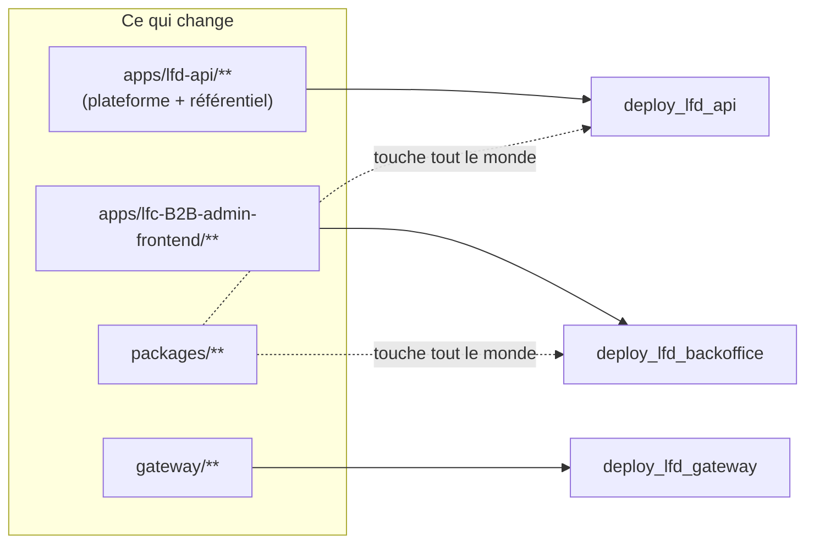
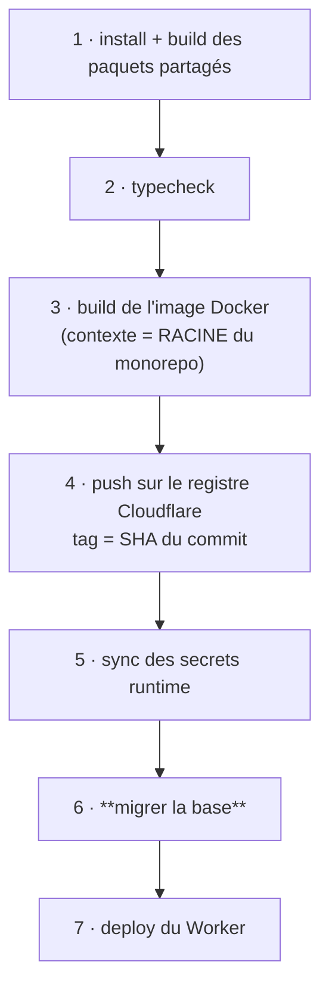

# Pipelines — qui déclenche quoi, et dans quel ordre

✅ **État réel au 2026-08-13.** Huit workflows : un de contrôle, sept de
déploiement.

## 1. Le déclenchement

Tout part de `main`, par **filtres de chemins** : un commit qui ne touche qu'un
front ne redéploie pas l'API.

Depuis **B2c**, le référentiel produit vit dans `apps/lfd-api/src/pim/` : il n'a
plus de workflow à lui, et un changement du catalogue redéploie l'API unique.
Le Worker `lfc-pim-backend` **tourne encore**, sur sa dernière image — plus rien
ne le met à jour, et il s'éteindra en B2e quand la passerelle routera `/api/pim`
vers le Worker de l'API.

⚠️ **`packages/**` déclenche presque tout.** C'est voulu : `@lfd/endpoints` et
`@lfd/contracts` sont des contrats partagés, un changement s'y propage partout.
C'est aussi pourquoi un commit sur `packages/` coûte cher en temps de CI.

⚠️ **Une variable GitHub qui change ne déclenche RIEN.** Elle n'est lue qu'au
build. Après avoir modifié une variable, il faut relancer le workflow à la main
(`workflow_dispatch`) — sinon la valeur reste celle du dernier déploiement, et
tout paraît vert.

## 2. L'ordre à l'intérieur d'un déploiement de backend

C'est la partie qui compte, et elle n'est pas négociable.

**Pourquoi la migration en 6 et pas en 1.** Le schéma doit précéder le code —
mais le plus tard possible avant lui. Migrer en tête intercalerait le build et
le push de l'image entre le nouveau schéma et le nouveau code : plusieurs
minutes pendant lesquelles l'**ancien** container servirait le trafic contre le
**nouveau** schéma. Ici la fenêtre se réduit au `wrangler deploy`.

⚠️ **Elle ne disparaît pas.** Un déplacement de données sur une base vivante se
fait en **trois déploiements** — étendre, basculer, resserrer — jamais en une
migration qui `DROP` ce que le code en ligne lit encore.

**Pourquoi les secrets avant la migration.** `wrangler secret put` alimente le
container ; la migration, elle, lit le secret GitHub directement. L'ordre
protège surtout du cas « premier déploiement » : un Worker déployé avant que ses
secrets existent meurt au boot.

`prisma migrate deploy` n'applique **que** les migrations existantes : il n'en
génère aucune et ne réinitialise jamais. Il échoue plutôt que de forcer, ce qui
bloque le déploiement — c'est voulu. Mieux vaut l'ancienne version en ligne
qu'une nouvelle sur un schéma à moitié migré.

## 3. Ce que la CI couvre — et ce qu'elle ne couvre pas

`ci.yml` a cinq jobs plus une barrière :

| Job             | Périmètre                                                               |
| --------------- | ----------------------------------------------------------------------- |
| `packages`      | les paquets partagés, en premier et à part                              |
| `b2b-checks`    | typechecks, lint, les 5 gates et les 207 suites unitaires du backend    |
| `b2b-backend`   | les 51 suites e2e, **shardées sur 4 runners** (Postgres + MinIO chacun) |
| `fronts-et-pim` | les quatre fronts et le backend PIM                                     |
| `gateway`       | typecheck, lint et 8 tests de routage du Worker d'entrée                |
| `ci-gate`       | échoue si l'un des cinq n'est pas vert — **le seul statut requis**      |

### Pourquoi `b2b-checks` existe

Le backend tenait à lui seul le chemin critique : **10 min 12 sur une CI de
10 min 25** (run vert du 2026-08-27), dont **8 minutes** pour une seule étape,
« Tests (unitaires + e2e) ».

La cause n'était pas la lenteur des tests mais une **file d'attente**. Les e2e
partagent une base jetable qu'elles tronquent entre les cas ; elles imposent donc
`maxWorkers: 1`. Ce worker unique tenait aussi les 207 suites unitaires, qui ne
touchent aucune base et n'avaient aucune raison d'attendre. Mesuré le
2026-08-29 : **7 secondes** pour ces 207 suites (1 704 tests) lancées seules, à
sept cœurs.

Trois configurations Jest portent désormais la séparation, et le mur qui la rend
vraie est écrit dans `jest.unit.cjs` : une spec qui a besoin d'une vraie base
n'est pas une unitaire, elle prend le suffixe `.e2e-spec.ts` et descend dans
`test/`.

### Le sharding des e2e

Sorties de la file, les e2e sont devenues **tout** le chemin critique — et elles
sont violemment variables : les mêmes 51 suites ont pris **6 min 40** puis
**16 min 45** sur deux runs consécutifs, à code identique.

Le chronomètre par suite (`apps/lfd-api/test/slow-suites.reporter.cjs`) a tranché
la question « quelle suite explose ? » : **aucune**. La distribution est plate,
~5 s par suite, et le temps ne suit pas le nombre de tests — `resend-webhook`
met 6,5 s pour 6 tests quand `staff-roles` met 11,9 s pour 40. Le coût est
l'**amorçage de l'application Nest**, payé 51 fois.

D'où quatre shards. Mesuré en local, `--shard=i/4` donne 33 s / 39 s / 54 s /
39 s là où le run entier prend 264 s : le pire shard vaut **un cinquième** du
tout. Le découpage par chemin suffit précisément parce que la distribution est
plate.

Le `maxWorkers: 1` reste vrai **à l'intérieur** d'un shard. Ce qui change, c'est
que les quatre tournent chacun sur SA machine, donc chacun avec sa base et son
stockage : deux suites ne partagent plus rien du tout.

🟡 **Le vrai gisement reste devant.** Quatre shards divisent le symptôme, ils ne
touchent pas la cause : 51 amorçages. Un harnais qui partagerait l'application
entre les suites ferait mieux que n'importe quel orchestrateur.

⚠️ Le motif des unitaires dit « tout sauf e2e », **pas** « tout ce qui est sous
`src/` ». Écrit à l'envers lors du découpage, il laissait `container/__tests__/`
hors des deux configurations : deux specs qui ne tournaient plus nulle part, et
une CI verte pour l'affirmer. Une partition se définit par ce qu'elle exclut.

La barrière a été **falsifiée** avant d'être crue : sa condition rougit bien
quand `gateway` échoue. Une barrière qu'on n'a pas vue refuser n'est pas une
barrière.

🟡 **`container/` échappe à ESLint et Prettier** dans les deux backends : leurs
globs (`{src,apps,libs,test}/**`) ne l'incluent pas. C'est pourtant du code de
routage en production, et il porte la réécriture de l'IP cliente.

## 4. Aléas connus

**Docker Hub.** L'image MinIO des tests e2e est tirée à chaque run ; un `500` de
Docker Hub fait rougir la CI sans que rien du code n'ait changé. Vu le
2026-08-13. Une relance suffit. Si ça se reproduit, un miroir d'image devient
justifié.

**Démarrage à froid.** Après un déploiement, la première requête peut rendre
`500 Container suddenly disconnected` ou `502` : c'est le container qui démarre,
pas une panne. Réessayer avant de diagnostiquer.

**Propagation.** Un changement de route Cloudflare (par exemple l'extinction de
`workers.dev`) met plusieurs dizaines de secondes à se propager. Mesurer trop
tôt fait conclure à un échec — vu le 2026-08-13.

## 5. Versions, une seule source chacune

| Quoi              | Source unique                        | Lue par                                                   |
| ----------------- | ------------------------------------ | --------------------------------------------------------- |
| Node (dev + CI)   | `.nvmrc`                             | `nvm use`, et les 10 `setup-node` via `node-version-file` |
| Node (production) | `node:22-slim` dans les Dockerfiles  | l'image du container                                      |
| pnpm              | `packageManager` dans `package.json` | `pnpm/action-setup`                                       |

`engines` dans le `package.json` racine documente la contrainte pour qui lit.

⚠️ La version Node de **production** est volontairement à part : c'est le moteur
qui exécute l'API. Elle se change délibérément — tests verts, image
reconstruite, démarrage du container vérifié — pas dans un commit d'outillage.
