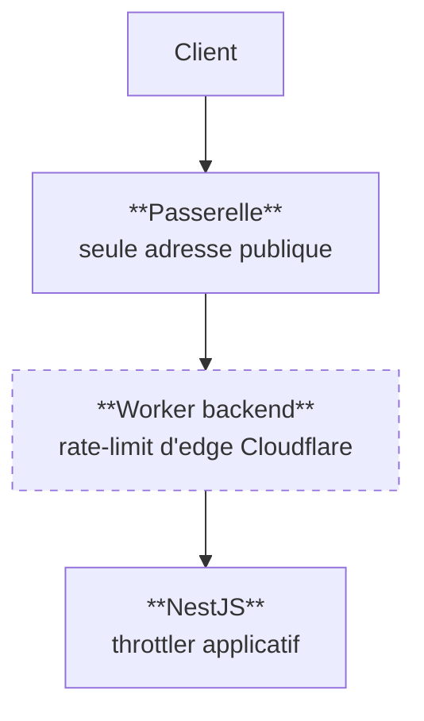

# La frontière de confiance — ce que le mur tient, et ce qu'il ne tient pas

✅ **État au 2026-08-13.** Chaque affirmation ci-dessous a été mesurée en
production. Celles qui ne l'ont pas été sont dites telles quelles.

## 1. Les trois couches, et laquelle protège vraiment

| Couche                       | État                                                        |
| ---------------------------- | ----------------------------------------------------------- |
| Passerelle                   | ✅ seule porte ; les backends n'ont plus d'adresse publique |
| Rate-limit d'edge Cloudflare | ❌ **inerte** — ne se déclenche jamais                      |
| Throttler NestJS             | ✅ **la seule limite réelle**, et elle est incontournable   |

**Le rate-limiter d'edge ne fonctionne pas.** Le binding est déclaré au premier
niveau (`ratelimits`, pas `unsafe.bindings`), visible dans la version déployée
(`env.RATE_LIMITER (300 requests/60s)`) — et pourtant `limit()` rend toujours
`success: true`. Prouvé deux fois, dont une à un seuil de **5 requêtes / 10 s**
avec 30 requêtes séquentielles : **zéro 429**.

⚠️ **Ne pas re-diagnostiquer côté configuration.** Elle est exonérée. C'est un
comportement de plateforme, à porter chez Cloudflare si le besoin revient. Le
code est laissé en place parce qu'il est correct et coûte zéro.

## 2. L'IP cliente : le trou qui a été bouché

Le throttler NestJS clé sur `x-lfc-client-ip`. Jusqu'au 2026-08-13, **le client
écrivait cet en-tête lui-même** : personne ne l'écrasait, malgré un commentaire
affirmant le contraire (« recopié et écrasé par la gateway, non spoofable ») —
alors qu'aucune passerelle n'était sur le chemin.

Mesure sur `/platform-settings` (limite 60/min), 75 requêtes :

|                      | Avant                | Après                |
| -------------------- | -------------------- | -------------------- |
| En-tête **fixe**     | 60 passent, 15 × 429 | idem                 |
| En-tête **tournant** | **0 × 429**          | 61 passent, 14 × 429 |

Il suffisait d'incrémenter un en-tête à chaque requête pour n'être jamais
limité. **La seule protection qui marchait était grande ouverte.**

Le correctif est dans le Worker, pas dans le backend : c'est lui la frontière de
confiance — dernier point qui connaît la vraie IP (`cf-connecting-ip`, posée par
Cloudflare et infalsifiable) et premier que la requête franchit. Il réécrit
l'en-tête systématiquement, et le **supprime** quand il n'y a pas d'IP, plutôt
que de laisser filer une valeur cliente.

C'est verrouillé par 12 tests par backend (`container/__tests__/edge-guard.spec.ts`),
eux-mêmes vérifiés par mutation : transmettre la requête originale fait tomber
2 tests, relire l'en-tête client en fait tomber 7.

**La règle qui en sort** : un commentaire qui écrit « non spoofable » doit
nommer **qui** écrase la valeur et **sur quel chemin**. Sans sujet, c'est un
vœu, et personne ne le revérifie.

## 3. CORS

Liste **fermée**, définie dans `packages/endpoints` (`PROD_CORS_ORIGINS`).
Vérifiée en production, préflight par préflight :

| Origine                   | Verdict                            |
| ------------------------- | ---------------------------------- |
| `lfc-b2b-eu7.pages.dev`   | autorisée — la boutique vivante    |
| `lfc-b2b-admin.pages.dev` | autorisée                          |
| `lfc-b2b.pages.dev`       | autorisée — **héritée, à retirer** |
| `evil.example`            | refusée                            |

La dernière ligne compte autant que les autres : élargir une liste blanche sans
vérifier qu'elle refuse toujours le reste, c'est se contenter d'un test qui ne
peut pas échouer.

**Le CORS n'a pas eu à déménager** quand la passerelle s'est intercalée :
l'`Origin` reste celle du front, le backend décide, la passerelle relaie.

## 4. Ce que le mur ne tient pas

- **Pas de WAF, pas de règles de rate limiting Cloudflare** : produits de zone,
  et le compte n'a aucune zone.
- **La passerelle est un point unique de défaillance.** Elle est triviale et
  sans état, mais elle n'a **aucune couverture CI** aujourd'hui.
- **Aucun secret partagé entre passerelle et backends.** Le lien de confiance
  repose entièrement sur le fait que les backends n'ont pas d'adresse publique.
  Le jour où l'un d'eux en retrouve une, l'invariant tombe **en silence** — c'est
  exactement le mode de panne dont on sort.
- **Le parcours utilisateur complet, connexion Auth0 comprise, n'a jamais été
  vérifié de bout en bout.** Les contrôles ci-dessus prouvent le transport, le
  CORS et les limites — pas qu'un humain passe.
