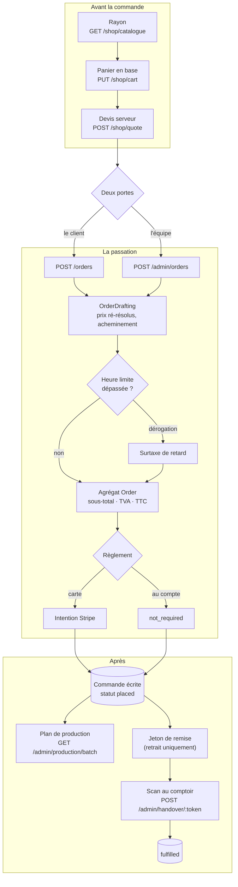

# La commande — du rayon à la remise

**Ouvert le 2026-09-07.** L'entrée du dossier. Onze documents décrivent la vie
d'une commande ; celui-ci dit **de quoi elle est faite** et **par quelle porte
entrer**. Il ne remplace aucun d'eux.

> **Pourquoi un dossier `order/` et pas `b2b/`.** La commande traversait `b2b/`
> mêlée à l'identité, au SEPA, au catalogue et aux tournées, plus un lot dans
> `todos/`. Rangée ainsi, elle se lisait en sept morceaux dont aucun ne disait
> le tout — exactement ce qui rendait le sujet illisible. Le prix a fait la même
> sortie une semaine plus tôt ([`../pricing/`](../pricing/README.md)).

---

## 1. La chaîne, en un schéma

**Une phrase par étape, et c'est tout ce qu'il faut retenir :**

| Étape            | Ce qu'elle décide                                                               | Où c'est écrit                                                                                 |
| ---------------- | ------------------------------------------------------------------------------- | ---------------------------------------------------------------------------------------------- |
| **Deux portes**  | le client pour lui-même, ou l'équipe pour lui — jamais deux natures de commande | [`architecture-commande-saisie-par-l-equipe.md`](architecture-commande-saisie-par-l-equipe.md) |
| **Le mur**       | sans société la commande n'est qu'à son auteur ; avec, il faut en être membre   | [`architecture-flux-commande-zero-friction.md`](architecture-flux-commande-zero-friction.md)   |
| **L'heure**      | jusqu'à quand on prend commande, la grâce, la dérogation et la surtaxe          | [`architecture-heure-limite-de-commande.md`](architecture-heure-limite-de-commande.md)         |
| **Le clos**      | une commande passée est un fait ; ce qui bouge après est un **avenant**         | [`architecture-commande-immuable-avenants.md`](architecture-commande-immuable-avenants.md)     |
| **L'avancement** | les états, les transitions, et qui a le droit de les écrire                     | [`architecture-cycle-de-vie-commande.md`](architecture-cycle-de-vie-commande.md)               |

---

## 2. Le vocabulaire, en sept lignes

| Mot                 | Ce qu'il désigne ici                                                                                                  |
| ------------------- | --------------------------------------------------------------------------------------------------------------------- |
| **Zéro friction**   | commander sans société. `companyId = null` : le mur est l'auteur, le règlement est la carte.                          |
| **Provenance**      | `placedByStaffId` + `fromSubscriptionId`. Un **attribut**, jamais un `kind` : self-service, back-office ou récurrent. |
| **Acheminement**    | coursier (zone + adresse figée) **ou** retrait (point figé). Jamais les deux, jamais ni l'un ni l'autre.              |
| **Convenu**         | la tranche, le contact, la signature — figés **avec leur provenance** (défaut du réglage, ou choix).                  |
| **Dérogation**      | l'autorisation, à usage unique, de passer après l'heure limite. Se **consomme** après persistance.                    |
| **Surtaxe**         | ce que le retard coûte. Terme de panier, jamais un prix d'article. Ne s'applique qu'avec une dérogation.              |
| **Jeton de remise** | un secret aléatoire, pas le numéro de commande. Émis pour le **retrait seul**, c'est la clé du scan.                  |

---

## 3. Par quelle porte entrer

**Je veux COMPRENDRE.**

| La question                                                  | Le document                                                                                         |
| ------------------------------------------------------------ | --------------------------------------------------------------------------------------------------- |
| Comment on commande sans avoir d'entreprise ?                | [`architecture-flux-commande-zero-friction.md`](architecture-flux-commande-zero-friction.md)        |
| Comment un commercial commande **pour** un client ?          | [`architecture-commande-saisie-par-l-equipe.md`](architecture-commande-saisie-par-l-equipe.md)      |
| Jusqu'à quand on prend commande, et que coûte le retard ?    | [`architecture-heure-limite-de-commande.md`](architecture-heure-limite-de-commande.md)              |
| Que se passe-t-il quand un client veut changer sa commande ? | [`architecture-commande-immuable-avenants.md`](architecture-commande-immuable-avenants.md)          |
| Quels états une commande traverse, et qui les écrit ?        | [`architecture-cycle-de-vie-commande.md`](architecture-cycle-de-vie-commande.md)                    |
| Comment la commande alimente le plan de production ?         | [`architecture-flux-commande-prod.md`](architecture-flux-commande-prod.md) — **topologie obsolète** |
| Quels écrans le client traverse, et avec quels mots ?        | [`parcours-client-compte-actif.md`](parcours-client-compte-actif.md)                                |
| De quoi est faite la pièce qu'on imprime, envoie, affiche ?  | [`architecture-bon-de-commande.md`](architecture-bon-de-commande.md)                                |

**Je veux IMPLÉMENTER.**

| Ce que je m'apprête à faire                      | Le document                                                                                                                                       |
| ------------------------------------------------ | ------------------------------------------------------------------------------------------------------------------------------------------------- |
| Ajouter une remise, un frais, une taxe au panier | [`../pricing/ajouter-un-terme-au-panier.md`](../pricing/ajouter-un-terme-au-panier.md)                                                            |
| Toucher au calcul d'un prix de ligne             | [`../pricing/README.md`](../pricing/README.md)                                                                                                    |
| Retirer `OrderCutoff`                            | [`demontage-order-cutoff.md`](demontage-order-cutoff.md)                                                                                          |
| Rendre le bon de commande dans un format de plus | [`architecture-bon-de-commande.md`](architecture-bon-de-commande.md)                                                                              |
| Écrire le gabarit du courriel de confirmation    | [`architecture-bon-de-commande.md`](architecture-bon-de-commande.md) §4 + [`parcours-client-compte-actif.md`](parcours-client-compte-actif.md) §2 |
| Émettre un document comptable                    | [`../b2b/architecture-facturation.md`](../b2b/architecture-facturation.md) — doc-first                                                            |

**Je veux savoir CE QUI CLOCHE.**

|                                          |                                                                                                                                                                            |
| ---------------------------------------- | -------------------------------------------------------------------------------------------------------------------------------------------------------------------------- |
| L'état du flux, de bout en bout          | [`audit-flux-de-commande.md`](audit-flux-de-commande.md) — **douze défauts** relevés le 2026-09-07, **quatre fermés** le jour même (§6). Lire le §6 avant d'agir sur un T. |
| Le calcul du prix et du panier           | [`../pricing/audit-fable.md`](../pricing/audit-fable.md)                                                                                                                   |
| Ce que la plateforme laisse sans réponse | [`../b2b/audit-flux-plateforme-admin.md`](../b2b/audit-flux-plateforme-admin.md)                                                                                           |

---

## 4. Les quatre règles qui ne se négocient pas

1. **Le front n'envoie jamais un montant.** Il envoie des **identités** — un
   SKU, un point de retrait, un code postal, une date — et le serveur résout.
   Un prix qui monte depuis le navigateur est un prix qu'on ne peut pas opposer.
2. **Une commande passée est un fait clos.** Prix, TVA, nom, allergènes,
   acheminement convenu : tout est figé avec sa provenance. Ce qui bouge après
   est un **avenant**, jamais une correction en place.
3. **Une seule façon de composer un panier.** `OrderDrafting` sert les deux
   portes. Une seconde implémentation finirait par appliquer une autre remise —
   sur le chemin qu'on teste le moins.
4. **Ce qui n'est pas su s'écrit `NULL`, pas `0` ni `[]`.** Une version de
   catalogue absente, une trace de prix absente, des allergènes absents : `NULL`
   avoue une ignorance, un défaut fabrique une affirmation.

---

## 5. Ce que ce dossier ne couvre pas

- **Le prix** — étages, plancher, TVA, ventilation :
  [`../pricing/README.md`](../pricing/README.md).
- **La facturation** — l'émission des documents comptables :
  [`../b2b/architecture-facturation.md`](../b2b/architecture-facturation.md).
- **Le paiement** — Stripe, mandats SEPA, termes négociés : `../b2b/`.
- **La livraison** — l'application de tournées :
  [`../b2b/architecture-road-livraison-tournees.md`](../b2b/architecture-road-livraison-tournees.md).
