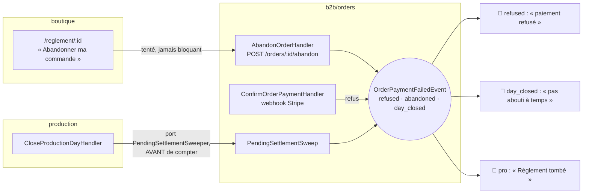
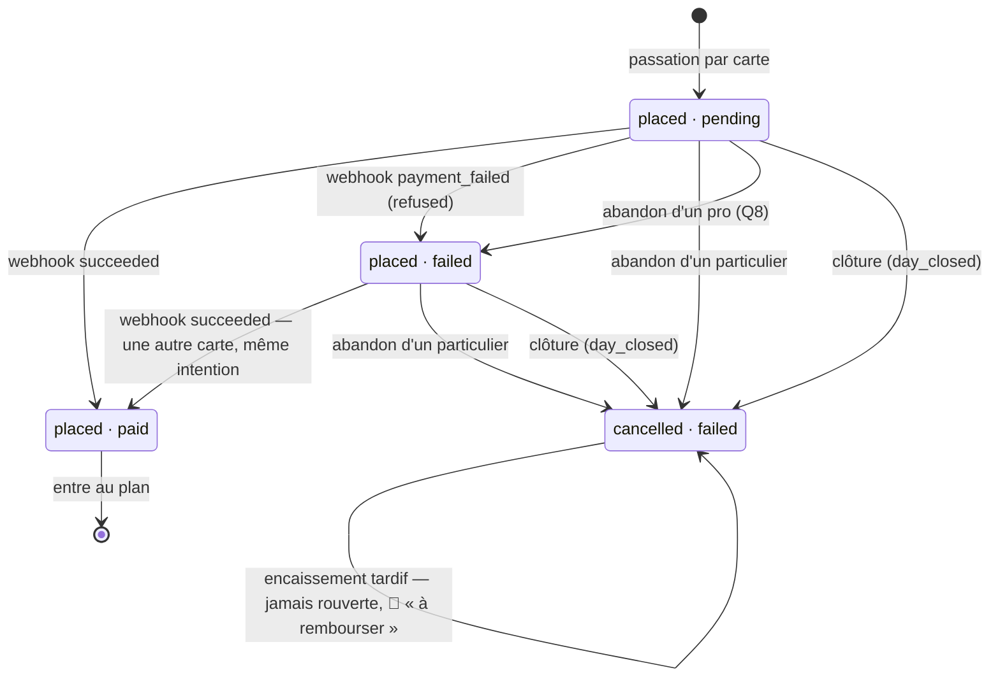

# L'abandon du règlement

> État : **implémenté** au 2026-09-26, à un lot près (§9 : le lot 10, qui
> prévient le commercial à l'heure limite, est en cours). Écrit à l'affirmative
> le 2026-09-26. Chaque phrase a été confrontée ce jour-là au code de `dev`
> (`d987090d7`).
>
> Commits : `09128f9aa` (la règle de production), `12857ae6c` (`cancelIntent`,
> la page qui relit l'intention), `2b61559ad` (l'abandon, la cause, la cloche,
> les mails), `19214c4c2` (une carte refusée se règle encore), `7a62d220f` (la
> clôture balaie), `8ceed327b` (un encaissement part aussi d'un refus),
> `6c9b47c32` et `d987090d7` (l'écran).
>
> L'histoire est dans [`plan-abandon-du-reglement.md`](plan-abandon-du-reglement.md) :
> le constat, les deux contradictions de `vitruve`, les réponses de Hugo
> (D1–D4, Q1–Q8). Ce document décrit ce que le code **fait**, et c'est lui
> qui fait foi.

## 1. En une phrase

**Un règlement par carte non encaissé ne produit rien, pour personne.** Il meurt
de trois façons : la banque refuse la carte, le client abandonne l'écran de
règlement, ou la clôture de la journée le coupe. Chaque mort publie
`OrderPaymentFailedEvent` avec sa **cause**, et ses abonnés choisissent sur
elle : le mail au client, la cloche du back-office pour un pro.

## 2. La règle de production — un règlement en attente ne produit pas

[`production-plan.ts:96-124`](../../apps/lfd-api/src/b2b/orders/domain/services/production-plan.ts) :
`settlementAllowsProduction` refuse `PAYMENTS_REFUSED` (`failed`, `refunded`)
**et** `PAYMENTS_AWAITING` (`pending`). La clientèle n'entre plus dans la
règle : jusqu'au 2026-09-22, le `pending` d'un pro ou d'une clientèle `NULL`
restait produit (D2).

La traduction Prisma est
[`plan-filter.ts:64-68`](../../apps/lfd-api/src/b2b/orders/infrastructure/plan-filter.ts) :
`paymentStatus notIn [failed, refunded, pending]`, sans plus aucun `OR` sur la
clientèle. `planWhere()` y ajoute `status: placed`. Les lecteurs qui l'épandent
n'ont pas changé.

| `paymentStatus`        | Produit ? |
| ---------------------- | --------- |
| `paid`, `not_required` | ✅        |
| `pending`              | ❌        |
| `failed`, `refunded`   | ❌        |

Ce qui ferme le cas du `pending` qui ne meurt jamais, c'est la clôture (§5) :
sans elle, une carte simplement abandonnée n'émet rien chez Stripe.

## 3. Les états d'un règlement, et ce qui les fait bouger

Deux colonnes, `status` (fabrication) et `paymentStatus` (argent). Toutes les
écritures ci-dessous sont des `updateMany` conditionnés en base
([`prisma-order.repository.ts`](../../apps/lfd-api/src/b2b/orders/infrastructure/prisma-order.repository.ts)) :
une bascule qui ne trouve pas sa ligne ne publie rien, et un second passage est
sans effet.

| Écriture                    | Depuis                                             | Vers                   | Où                                       |
| --------------------------- | -------------------------------------------------- | ---------------------- | ---------------------------------------- |
| `markPaid` (webhook)        | `pending` ou `failed`, **et** `status ≠ cancelled` | `paid` + `paidAt`      | `settle`, l. 212-243 ; `PAID_FROM` l. 30 |
| `markPaymentFailed`         | `pending` seulement, `status ≠ cancelled`          | `failed`               | `FAILED_FROM` l. 31                      |
| `markAbandoned`, public     | `placed`, `pending` ou `failed`                    | `cancelled` + `failed` | l. 245-259                               |
| `markAbandoned`, pro/`NULL` | `placed`, `pending` seulement                      | `failed`               | l. 263-273                               |
| `failAtClosing`             | `placed`, `pending` ou `failed`, toutes clientèles | `cancelled` + `failed` | l. 276-282                               |

- **Un encaissement part aussi d'un refus** (`8ceed327b`) : un refus rend
  l'intention à `requires_payment_method`, et le client peut saisir une autre
  carte sur la même page. Ne partir que de `pending` laissait un client débité
  devant une commande `failed`, jamais produite.
- **Une commande annulée ne se rouvre jamais** : `settle` exclut
  `status = cancelled`. Quand un `succeeded` ne franchit rien et que l'intention
  appartient à une commande annulée,
  [`ConfirmOrderPaymentHandler`](../../apps/lfd-api/src/b2b/orders/application/commands/confirm-order-payment.handler.ts)
  publie `OrderPaidAfterCancellationEvent`, et
  [`RingRefundDue`](../../apps/lfd-api/src/b2b/orders/application/handlers/ring-refund-due.handler.ts)
  sonne « Encaissé sur une commande annulée — à rembourser », pour toutes les
  clientèles. Le remboursement lui-même n'existe pas dans ce système.
- **Les écritures nues sont voulues.** `Order` est un agrégat de passation qui
  ne se recharge pas, et la condition en base donne l'atomicité face au
  webhook. C'est la même justification que pour `markPaid`
  (`CLAUDE.md` §3.1).

## 4. L'abandon

### La route et le mur

`POST /orders/:id/abandon`, `204` y compris au second clic
([`orders.controller.ts:231`](../../apps/lfd-api/src/b2b/orders/http/orders.controller.ts)).
[`AbandonOrderHandler`](../../apps/lfd-api/src/b2b/orders/application/commands/abandon-order.handler.ts)
pose deux murs, dans cet ordre :

1. le mur de lecture (`ensureOrderVisible`) : `404` à qui ne voit pas la
   commande ;
2. **le mur de l'auteur** (`ensureOrderAuthor`,
   [`order-abandon.ts:44`](../../apps/lfd-api/src/b2b/orders/domain/services/order-abandon.ts)) :
   seul `placedByUserId` abandonne (Q2). Un collègue qui voit la commande reçoit
   `403 orders.abandon.not_author`. Pour une commande saisie par l'équipe,
   l'auteur est le client pour qui elle a été saisie.

`abandonStanding` lit ensuite l'état : une commande déjà `cancelled` rend la
main sans rien faire (second clic). `paid`/`refunded`, `not_required` et un
statut autre que `placed` donnent un `409 orders.abandon.not_abandonable` nommé
(`already_paid`, `nothing_to_settle`, `already_in_production`).

### Particulier et pro (Q8)

| Clientèle        | Appel à Stripe                                            | Écriture                 | Payable ensuite ?            |
| ---------------- | --------------------------------------------------------- | ------------------------ | ---------------------------- |
| `public`         | `cancelIntent` **avant** d'écrire, s'il y a une intention | `cancelled` + `failed`   | non                          |
| `pro`, ou `NULL` | **aucun** : l'intention reste vivante                     | `failed`, reste `placed` | oui, jusqu'à la clôture (Q7) |

Pour un particulier, on n'écrit que si Stripe confirme que l'intention est
morte : annuler chez nous une commande qu'une carte peut encore payer ferait
encaisser une annulée. Pour un pro, annuler l'intention l'aurait rendue
impayable (la page refuse une intention morte, et aucune nouvelle n'est jamais
créée) ; D4 tient donc tel quel. Un second abandon pro trouve `failed` et
n'écrit rien.

### Les cinq issues de `cancelIntent`

Le port
([`payment-gateway.ts:50-55`](../../apps/lfd-api/src/b2b/payments/domain/payment-gateway.ts))
ne lève jamais pour un cas métier. L'adaptateur traduit les erreurs du SDK
`stripe` 22.4.0
([`stripe-intent-translation.ts`](../../apps/lfd-api/src/b2b/payments/infrastructure/stripe-intent-translation.ts)).

| Issue               | Ce qui la produit chez Stripe                                             | L'abandon (particulier)                               | La clôture                   |
| ------------------- | ------------------------------------------------------------------------- | ----------------------------------------------------- | ---------------------------- |
| `cancelled`         | l'annulation a réussi — y compris sur `requires_action` (3-D Secure tuée) | écrit, `204`                                          | écrit                        |
| `already_cancelled` | `payment_intent_unexpected_state`, statut `canceled`                      | écrit, `204` : c'est le second clic                   | écrit                        |
| `already_paid`      | même code, statut `succeeded`                                             | `409 orders.abandon.already_paid`, rien écrit         | **épargne** la commande      |
| `in_progress`       | même code, statut `processing`                                            | `409 orders.abandon.payment_in_progress`              | **épargne** la commande      |
| `unavailable`       | réseau, 5xx, clé absente, intention inconnue, statut inattendu            | `409 orders.abandon.provider_unavailable`, journalisé | écrit quand même, journalisé |

⚠️ Le SDK déclare `error.payment_intent` **facultatif**. Quand le refus « état
inattendu » ne le joint pas, l'adaptateur relit l'intention avant de conclure
(`refusedWithoutState`) ; sinon un second clic passerait pour une panne. Ce
chemin n'a pas été éprouvé contre le mode test de Stripe.

### Ce que l'abandon publie

Sur une écriture qui a franchi, et sur elle seule :

- `OrderPaymentFailedEvent(orderId, "abandoned")` : la cloche d'un pro (§7) ;
  aucun mail, le client vient de cliquer ;
- `OrderAbandonedEvent`, que
  [`OnOrderAbandoned`](../../apps/lfd-api/src/b2b/growth/application/handlers/on-order-abandoned.handler.ts)
  inscrit au journal en `order.abandoned`, sujet l'auteur, avec
  `outcome: cancelled | failed`.

## 5. La clôture balaie avant de compter

### Le port

La clôture refuse une journée sans producible (`ProductionDayEmptyError`). Sans
balayage préalable, une journée où personne n'a payé ne se fermait jamais, et
ses règlements en vol ne mouraient jamais. `production → b2b` étant interdit,
le fournil **déclare** un port synchrone et le commerce l'implémente :

| Pièce                                                                                                                          | Bloc                                     |
| ------------------------------------------------------------------------------------------------------------------------------ | ---------------------------------------- |
| [`PendingSettlementSweeper`](../../apps/lfd-api/src/production/channels/commerce/pending-settlement.sweeper.ts) (`sweep(day)`) | `production`, déclaré                    |
| [`PendingSettlementSweep`](../../apps/lfd-api/src/b2b/orders/application/services/pending-settlement-sweep.service.ts)         | `b2b/orders`, implémenté                 |
| `{ provide: PendingSettlementSweeper, useExisting: PendingSettlementSweep }`                                                   | `appBootstrap/production-feed.module.ts` |

[`CloseProductionDayHandler`](../../apps/lfd-api/src/production/application/commands/close-production-day.handler.ts)
appelle `sweep(day)` en **première** ligne (l. 94) : avant de charger la
journée, et donc aussi sur une réannonce d'une journée déjà close (S4). Le
comptage `producibleFor` vient après.

### La fenêtre du jour (Q5)

[`PrismaUnsettledSettlementReader`](../../apps/lfd-api/src/b2b/orders/infrastructure/prisma-unsettled-settlement.reader.ts)
prend les commandes `placed`, règlement `pending` **ou** `failed`, qui :

- ont `requestedDeliveryDate` = le jour clos ;
- **ou** n'ont pas de jour de retrait, et ont été passées ce jour-là, de minuit
  à minuit **à l'heure de Paris**
  ([`settlement-sweep.ts`](../../apps/lfd-api/src/b2b/orders/domain/services/settlement-sweep.ts),
  `localToInstant` ; 23 ou 25 heures les jours de bascule).

Aucun mur `company_id` : c'est une passe d'exploitation sur toute la journée.

### Ce que le balayage fait de chaque commande

1. S'il y a une intention, il **tente** `cancelIntent`.
2. `already_paid` ou `in_progress` : **l'argent est pris ou en route**, la
   commande est **épargnée**. Le webhook la soldera, hors du plan arrêté, et
   l'équipe décide. L'annuler ferait rembourser une vente réelle et écrirait au
   client « rien n'a été débité ».
3. Sinon — annulée, déjà annulée, ou **Stripe injoignable** —,
   `failAtClosing` écrit `cancelled` + `failed`, pour toutes les clientèles
   (Q7), et publie `OrderPaymentFailedEvent(orderId, "day_closed")` sur le seul
   franchissement.

**Stripe injoignable n'arrête rien** : `cancelIntent` ne lève pas, et une panne
ne fait que partir au journal applicatif. Une intention restée vivante peut
encore être payée ; ce cas tombe sur « à rembourser » (§3). Une authentification
3-D Secure en cours à l'heure de la clôture est tuée, et c'est assumé : elle
paierait une commande qui ne sera pas produite.

Le balayage est idempotent par ses conditions : un second passage ne trouve plus
que ce qui a été passé entre-temps.

⚠️ **Une journée où personne n'a payé reste inarrêtable.** Elle est balayée
(annulations, mails), puis toujours refusée « vide » : le refus ne dit plus que
la vérité, mais le colisage et le dossier du jour restent bloqués ce jour-là
s'il n'y a rien d'autre.

## 6. La page de règlement

### Ce que le serveur sert

[`GetOrderPaymentHandler`](../../apps/lfd-api/src/b2b/orders/application/queries/get-order-payment.handler.ts),
`GET /orders/:id/payment`, même mur que la lecture de la commande :

| Cas                                                       | Réponse                                        |
| --------------------------------------------------------- | ---------------------------------------------- |
| commande `cancelled`                                      | `409 orders.payment.order_cancelled` (l. 67)   |
| règlement ni `pending` ni `failed`, ou sans intention     | `409 orders.payment.not_payable` (l. 75-80)    |
| intention relue **chez Stripe** `canceled` ou `succeeded` | `409 orders.payment.intent_closed` (l. 83)     |
| intention `awaiting_payment` ou `processing`              | le `clientSecret`, la clé publique, le montant |

`failed` est donc payable **tant que son intention vit** : une carte refusée,
ou l'abandon d'un pro. Aucune nouvelle intention n'est jamais créée. Relire
l'intention chez Stripe ferme le trou d'une annulation réussie chez Stripe dont
l'écriture se serait perdue chez nous. `processing` reste servi : un paiement
en cours n'est pas refusé à qui recharge la page.

### Ce que l'écran en fait

[`reglement-page.ts`](../../apps/lfc-ecommerce-frontend/src/app/client/commande/reglement-page/reglement-page.ts) :

- **Un refus du serveur mène à l'état `closed`**, pas à la confirmation
  (l. 186-192) : « Cette commande n'attend plus de paiement en ligne », et un
  seul bouton, « Voir mes commandes ». Avant `d987090d7`, l'écran renvoyait à la
  confirmation, qui reproposait « Régler maintenant » depuis l'état gardé dans
  le navigateur : une boucle sans sortie.
- **La sortie s'appelle « Abandonner ma commande »** et dit sa conséquence
  avant d'agir (`fold-inline-confirm`). Elle est offerte aussi quand Stripe ne
  s'est pas chargé ; elle disparaît pendant une confirmation de carte et en état
  `closed`.
- **L'appel est tenté, jamais bloquant**
  ([`client-order-abandon.service.ts`](../../apps/lfc-ecommerce-frontend/src/app/client/client-order-abandon.service.ts)).
  Trois issues, et l'écran navigue toujours :

| Issue       | Quand                                                            | Annonce                                                                                    | Destination     |
| ----------- | ---------------------------------------------------------------- | ------------------------------------------------------------------------------------------ | --------------- |
| `abandoned` | `204`                                                            | particulier : « Commande annulée. Rien n'a été débité. » ; pro : le message « pas réglée » | `/boutique`     |
| `settled`   | `409` `already_paid`, `payment_in_progress` ou `not_abandonable` | « Votre paiement a été reçu »                                                              | la confirmation |
| `unsettled` | tout autre échec, ou visiteur non authentifié                    | « pas réglée… annulée si pas réglée avant la fournée »                                     | `/boutique`     |

- Le texte pro/particulier est choisi par **l'espace courant** (l. 122), pas
  par le contrat (§9).

⚠️ Deux nuances lues dans le code, non corrigées :

- `ClientOrders.paymentFor` sert d'abord l'intention **gardée en mémoire** depuis
  la passation, sans interroger le serveur ; seul un retour sur la page hors de
  cette session passe par les refus ci-dessus ;
- toute erreur de `GET /orders/:id/payment`, panne réseau comprise, mène à
  l'état `closed` et non à `unavailable`.

## 7. Les causes et leurs effets

`OrderPaymentFailedEvent` porte `cause: "refused" | "abandoned" | "day_closed"`
([`order-payment-failed.event.ts`](../../apps/lfd-api/src/b2b/orders/domain/events/order-payment-failed.event.ts)).
Les abonnés s'accrochent à l'événement, pas aux appelants : tout ce qui écrit un
règlement mort les déclenche.

| Cause        | Publiée par                     | 📧 Client                                                             | 🔔 Cloche (pro seulement)                                         | 📓 Journal                     |
| ------------ | ------------------------------- | --------------------------------------------------------------------- | ----------------------------------------------------------------- | ------------------------------ |
| `refused`    | le webhook, `markPaymentFailed` | `customer.payment-failed` (`send-payment-failed-mail`)                | « la banque a refusé la carte… reste en attente »                 | —                              |
| `abandoned`  | `AbandonOrderHandler`           | aucun                                                                 | « le client a quitté l'écran… encore payable jusqu'à la clôture » | `order.abandoned` (autre fait) |
| `day_closed` | `PendingSettlementSweep`        | `customer.payment-expired` (`send-payment-expired-mail`), sans bouton | « n'a pas abouti avant la clôture… annulée, à ressaisir »         | —                              |

La cloche
([`ring-failed-pro-settlement.handler.ts`](../../apps/lfd-api/src/b2b/orders/application/handlers/ring-failed-pro-settlement.handler.ts))
sonne `order.payment_failed`, « Règlement tombé — {société} », lien vers la
commande, sans destinataire nommé : « le commercial » est un rôle, et la cloche
est visible de tout le back-office. Clé d'idempotence par commande **et** par
cause : un refus puis la clôture de la même commande font deux nouvelles. Une
clientèle `public` ou `NULL` ne sonne pas.

## 8. Où c'est éprouvé

| Niveau      | Fichiers                                                                                                                                                                                                                                                                                                                                                                                    |
| ----------- | ------------------------------------------------------------------------------------------------------------------------------------------------------------------------------------------------------------------------------------------------------------------------------------------------------------------------------------------------------------------------------------------- |
| domaine     | `production-plan.spec.ts`, `order-abandon.spec.ts`, `settlement-sweep.spec.ts`, `stripe-intent-translation.spec.ts`                                                                                                                                                                                                                                                                         |
| application | `abandon-order.handler.spec.ts`, `pending-settlement-sweep.service.spec.ts`, `close-production-day.handler.spec.ts`, `get-order-payment.handler.spec.ts`, `confirm-order-payment.handler.spec.ts`, `ring-failed-pro-settlement.handler.spec.ts`, `ring-refund-due.handler.spec.ts`, `payment-failure-mails.spec.ts`, `on-order-abandoned.handler.spec.ts`, `stripe-payment-gateway.spec.ts` |
| e2e         | `test/order-abandon.e2e-spec.ts`, `test/production-closing-sweep.e2e-spec.ts`, `test/order-payment-retry.e2e-spec.ts`, `test/order-payment-reprise.e2e-spec.ts`                                                                                                                                                                                                                             |
| front       | `client-order-abandon.service.spec.ts`, `reglement-page.spec.ts`, `orders-phrases.spec.ts` (back-office)                                                                                                                                                                                                                                                                                    |

Stripe n'est jamais atteint : `order-abandon` et `production-closing-sweep`
substituent un faux `PaymentGateway`.

## 9. Ce qui n'est pas bâti

- **Le lot 10 — prévenir le commercial à l'heure limite** (Q6) : une commande
  saisie par l'équipe avec lien de paiement, toujours pas réglée à l'heure
  limite du jour, ne sonne pas encore. **En cours** au 2026-09-26 ; rien dans
  `src/` au moment de l'écriture.
- **La colonne « Carte » de « Mes commandes »** n'a pas changé : une commande
  `pending` ou annulée l'affiche toujours
  (`apps/lfc-ecommerce-frontend/src/app/client/mes-commandes/order-rows.ts`).
  Hugo refuse un état « à régler » (2026-09-22) ; ce que la colonne affiche pour
  une annulée n'est pas tranché.
- **La clientèle n'est pas dans le contrat du règlement.** L'écran la déduit de
  l'espace courant : rouverte depuis un autre espace, la phrase d'abandon serait
  fausse. Exposer `clientele` dans `GET /orders/:id/payment` le fermerait.
- **Une journée sans aucun paiement reste non arrêtée** (§5), et bloque ce
  jour-là le colisage et le dossier du jour.
- **Le remboursement** : « à rembourser » sonne, le geste se fait à la main
  depuis Stripe. Il relève du
  [chantier d'annulation général](plan-annulation-de-commande.md), comme
  l'annulation d'une commande payée.
- **La croissance** (S11) : `order.placed` reste compté après un abandon.
- **Des JSDoc périmés par ce chantier**, dans le code et non corrigés ici
  (vérifié le 2026-09-26) : `PAYMENTS_AWAITING` dit les lots 3 à 6 « non bâtis »
  (`production-plan.ts:120-122`), `absorbedByPlan` dit qu'un webhook tardif « se
  surveille au back-office » (l. 59-63), et `ClientOrders.paymentFor` dit que la
  page « mène à la confirmation » après un refus.
