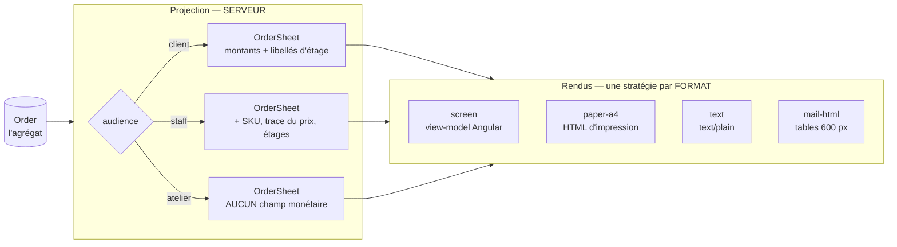

# Le bon de commande — un objet, plusieurs formats

**Ouvert le 2026-09-07. Doc-first : rien de ce qui suit n'est codé.**

Ce document décrit **une pièce et une seule** — le bon de commande — et la façon
dont elle se rend en six endroits sans être réécrite six fois. Il remplace la
notion de « bon de livraison », qui n'a jamais désigné ce que le code produit.

> **Pourquoi maintenant.** Six vues du même objet existent en maquette, trois
> existent en code (l'écran client, l'écran staff, la fiche d'atelier), et le
> quatrième — le fichier texte — s'appelle `renderDeliveryNote`. Chacune a été
> écrite séparément. Tant qu'elles le restent, la règle « l'atelier ne voit
> aucun montant » est une consigne qu'on applique à la main, six fois.

---

## 1. Le constat qui ouvre le dossier : il n'y a pas de bon de livraison

`packages/b2b-ui/src/order/order-documents.ts` produit un document dont
l'en-tête est **toujours** `BON DE LIVRAISON`, et dont la quatrième ligne est :

```
Acheminement  : Retrait au laboratoire
```

Un bon de livraison pour une commande que personne ne livre. Ce n'est pas une
faute de frappe : c'est le symptôme d'un modèle où **le document tire son nom du
mode d'acheminement**, alors que l'acheminement n'est qu'un de ses champs.

Le même glissement est ailleurs. `orderDocuments()` propose « Bon de livraison »
dans la liste des pièces d'une commande à retirer ; le legacy
`legacy/commandes/download-bon.ts` produit, lui, un « BON DE COMMANDE » — de
neuf lignes, avec un **Total TTC**, hors de la plateforme. Deux fonctions, deux
noms, deux vérités sur la même commande.

**La correction est un renommage de concept, pas de fichier :**

> Il existe **un bon de commande**. Il porte un **mode d'acheminement** — retrait
> ou coursier — au même titre qu'il porte une date, des lignes et un
> destinataire. Il n'existe pas de pièce « de livraison » : celui qui réceptionne
> et celui qui retire cochent la même feuille.

Ce que ça supprime, immédiatement : la question « quel document imprimer pour un
retrait ? », le champ `label: 'Bon de livraison'` posé en dur, et l'idée qu'un
mode d'acheminement mérite une seconde fonction de rendu.

---

## 2. Deux axes, et il ne faut surtout pas les confondre

Une pièce imprimée se décrit par deux questions **indépendantes** :

|              | La question           | Les valeurs                               | Ce qu'elle décide       |
| ------------ | --------------------- | ----------------------------------------- | ----------------------- |
| **Audience** | qui lit ?             | `client` · `staff` · `atelier`            | **ce qu'il y a dedans** |
| **Format**   | sur quoi ça se pose ? | écran · papier A4 · texte · courriel HTML | **comment c'est rendu** |

Six vues en maquette, ce sont six **couples**, pas six documents. Les traiter
comme six documents produit ce qu'on a déjà : la règle des montants réécrite
partout où on la répète.

🔴 **Le piège que ce document existe pour fermer.** La spec papier
(fiche 05 du dossier de reprise « bon de commande », hors dépôt) propose :

```ts
renderDeliveryNote(order, { withPrices?: boolean })   // ← non
```

`withPrices` est **une option de rendu pour une règle d'audience**. Elle ne
protège rien : le jour où quelqu'un imprime pour le quai de livraison, il passe
`true` et les prix négociés partent sur le quai. La spec le dit elle-même
(« l'option suit le destinataire, pas l'utilisateur ») puis propose la signature
qui trahit la phrase.

**La forme juste** : l'audience se choisit **avant** le rendu, et la projection
`atelier` ne porte **aucun champ monétaire**. Aucun rendu ne peut alors imprimer
un prix au fournil — pas parce qu'il s'en souvient, parce qu'il n'a rien à
imprimer. C'est la hiérarchie du dépôt appliquée à la lettre : _inexprimable >
refusé_.

---

## 3. La forme : projeter, puis rendre



**La règle des montants vit à un seul endroit** — la projection — et **le
strategy pattern porte sur le format**, jamais sur l'audience. Un cinquième
format (PDF, EDI, CSV pour un client qui réconcilie) est un rendu de plus. Une
quatrième audience (le comptable du client) est une projection de plus. Les deux
s'ajoutent sans se croiser : c'est tout l'intérêt de séparer les axes.

### Le modèle, neutre de format

`OrderSheet` — un objet **plat, sans comportement, sans dépendance**. Il ne sait
ni ce qu'est une balise ni ce qu'est un `<td>`.

```ts
/** Ce qu'un bon de commande dit, quel que soit le papier sur lequel il tombe. */
export interface OrderSheet {
  readonly audience: SheetAudience;
  readonly reference: string; // CMD-4812
  readonly placedAt: string; // ISO
  readonly requestedFor: string | null;
  readonly fulfillment: SheetFulfillment; // mode + adresse + tranche + contact
  readonly lines: readonly SheetLine[];
  readonly note: string;
  /** ABSENT sur l'audience atelier — pas `null`, pas à zéro : absent. */
  readonly money?: SheetMoney;
  readonly issuedAt: string; // §5
  readonly revision: number; // §5
}
```

Deux choses à ne pas rater dans cette forme.

**`money` est optionnel, pas nullable.** Avec `exactOptionalPropertyTypes` (actif
dans tout le dépôt), `{money?: SheetMoney}` n'est pas
`{money: SheetMoney | undefined}` : un rendu qui écrit `sheet.money.totalCents`
ne compile pas sans avoir prouvé la présence. Un `money: null` se serait
contourné d'un `?? 0`, et un total à zéro sur un bon d'atelier est exactement le
genre de faux qu'on ne voit pas.

**`SheetLine` diffère par audience, et c'est la même mécanique** : `sku`,
`entryPriceMillicents` et `steps` (les étages) n'existent que sur la projection
staff. La première règle d'audience du dossier de reprise — « le client ne lit jamais le nom des
étages » — cesse d'être une règle d'écran pour devenir une **absence de champ**.

### Le registre des rendus

Le paquet `@lfd/mailer` a déjà résolu ce problème et sa solution se recopie :

```ts
/** Sortie attendue par format — c'est elle qui rend le registre exhaustif. */
interface SheetOutput {
  readonly screen: OrderSheetViewModel;
  readonly "paper-a4": string; // HTML d'impression
  readonly text: string;
  readonly "mail-html": string;
}

export type SheetRenderers = {
  readonly [F in keyof SheetOutput]: (sheet: OrderSheet) => SheetOutput[F];
};
```

Un format déclaré sans rendu **ne compile pas**. C'est ce qui remplace le `switch`
exhaustif qu'on oublie d'étendre — même raison qu'écrite dans
`packages/mailer/src/types.ts` pour `TemplateRegistry`.

---

## 4. Où chaque morceau vit — et pourquoi la projection est côté serveur

| Morceau                         | Emplacement                                        | Raison                                                                |
| ------------------------------- | -------------------------------------------------- | --------------------------------------------------------------------- |
| `OrderSheet` + schéma Zod       | un module `order-sheet` dans `packages/contracts/` | il traverse le réseau, il se relit ; c'est la définition d'un contrat |
| Projection `Order → OrderSheet` | `apps/lfd-api/src/b2b/orders/domain/services/`     | **c'est une règle de sécurité**, cf. ci-dessous                       |
| Rendu `screen`                  | l'app Angular qui l'affiche                        | un view-model n'a de sens que devant son gabarit                      |
| Rendus `text` et `paper-a4`     | `packages/b2b-ui/src/order/`                       | les deux fronts les téléchargent et les impriment                     |
| Rendu `mail-html`               | `apps/lfd-api/src/platform/mailer/`                | le courriel part du serveur ; le registre de gabarits y est déjà      |

🔴 **La projection ne peut pas vivre dans le navigateur.** Le dossier de reprise
le dit dans les termes exacts : « c'est une règle d'API avant d'être une règle
d'écran. Si le nom de l'étage arrive dans la charge utile du client et n'est que
masqué au rendu, il est dans le réseau. » Une projection front laisserait
`OrderView` complet descendre chez le client — SKU, tarif d'entrée,
`priceSteps` — et un client qui empile trois commandes reconstitue la grille
tarifaire. Le masquer au rendu ne le retire pas de l'onglet réseau.

C'est aussi ce qui ferme la **quatrième contradiction** du dossier de reprise, et elle se ferme
**par construction** : ce que le serveur ne projette pas, l'écran ne peut pas
fuiter.

⚠️ **Une frontière à surveiller au passage.** `mail-templates.ts` vit dans
`platform/`, qui selon la matrice du `CLAUDE.md` racine « ne connaît **aucun**
contexte ». Il porte déjà `customer.access-opened` et
`staff.appointment-booked` : la dérive est antérieure à ce chantier. Y ajouter un
gabarit qui parle de lignes de commande et de TVA l'aggrave. La sortie propre est
que le gabarit reçoive un `OrderSheet` **déjà projeté** et n'en connaisse que la
forme — le paquet `@lfd/mailer` est conçu exactement pour ça (« la carte des
gabarits appartient à l'app »). À trancher avant d'écrire le gabarit, pas après.

---

## 5. Ce que le modèle rend obligatoire, et qui manque partout aujourd'hui

Troisième contradiction du dossier de reprise : aucun document ne porte son heure
de génération, et la fiche 04 le redit pour la fiche d'atelier. Les deux se
retéléchargent et se réimpriment à volonté, y compris après un avenant, et rien
ne distingue deux tirages.

`issuedAt` et `revision` sont **des champs du modèle**, pas une consigne de pied
de page. Conséquence directe : un rendu qui ne les affiche pas est un rendu
incomplet qu'une revue voit, au lieu d'un oubli que personne ne voit. Et la
question « ce papier est-il à jour ? » a une réponse lisible sur le papier :

```
Tiré le 7 sept. à 4 h 05 · révision 2
```

`revision` compte les **avenants** appliqués depuis la passation. Le mécanisme
n'existe pas encore ([`architecture-commande-immuable-avenants.md`](architecture-commande-immuable-avenants.md)),
et c'est précisément pour ça que le champ doit exister **maintenant** : le jour
où l'avenant arrive, aucun document en circulation ne saurait dire s'il précède
ou suit. Un `revision: 0` sur toutes les commandes actuelles est vrai — aucune
n'a d'avenant.

---

## 6. La facture reste hors du dossier, et ça ne change pas

`order-documents.ts` déclare la facture **indisponible**, faute de série de
numérotation serveur, et la raison qu'il en écrit est la bonne :

> « en fabriquer une dans le navigateur produirait un document sans valeur que
> quelqu'un finirait par envoyer à son comptable. »

Un `OrderSheet` d'audience `client` porte des montants. **Il n'est pas une
facture**, et son pied doit le dire en toutes lettres — pas par pudeur, parce
que le seul écart entre les deux pièces est un numéro de série que la plateforme
n'a pas. Un document chiffré et muet sur ce point sera classé comme une facture
par le premier comptable qui le reçoit.

C'est le chantier comptable, il est ailleurs :
[`../b2b/architecture-facturation.md`](../b2b/architecture-facturation.md).

---

## 7. Le découpage

| Lot   | Ce qu'il fait                                                                                 | Ce qui devient impossible ensuite                        |
| ----- | --------------------------------------------------------------------------------------------- | -------------------------------------------------------- |
| **1** | `OrderSheet` + schéma dans `contracts`, avec `money` optionnel et `SheetLine` par audience    | écrire un montant dans une projection atelier            |
| **2** | La projection serveur, ses tests aux trois audiences, la route qui la sert                    | qu'un nom d'étage descende chez le client                |
| **3** | Rendu `text` — remplace `renderDeliveryNote`, en-tête « BON DE COMMANDE », `issuedAt` au pied | qu'un bon de retrait s'annonce « de livraison »          |
| **4** | Rendu `paper-a4` atelier — la fiche existante rebranchée sur la projection                    | qu'une fiche d'atelier soit tirée sans heure ni révision |
| **5** | Rendu `mail-html` + gabarit `customer.order-placed`                                           | (rien — c'est un ajout ; voir T3 de l'audit)             |
| **6** | Décommissionner `legacy/commandes/download-bon.ts`                                            | qu'il existe deux « bons » avec deux totaux différents   |

**L'ordre n'est pas négociable.** Les lots 3 à 5 sont des rendus : ils n'ont rien
à consommer tant que 1 et 2 n'existent pas, et les écrire d'abord recrée
exactement les six documents séparés que ce dossier vient défaire.

---

## 8. Ce qui reste à trancher

- **Le nom en code.** Le lexique du dépôt (`documentation/langue-du-code.md`)
  n'a pas d'entrée pour « bon de commande ». `purchaseOrder` est faux — c'est la
  pièce qu'un **acheteur** émet, et ici c'est le vendeur qui l'écrit. Ce document
  retient **`OrderSheet`** : la feuille d'une commande, quel que soit son papier.
  L'alternative est de garder `bonDeCommande` sous le précédent `mercuriale`
  (« le traduire par approximation ferait perdre ce que le mot dit »). Le choix
  se fait maintenant : après le lot 1, c'est un renommage de contrat.
- **`vitruve` n'a pas tourné sur ce document, et le `CLAUDE.md` l'exige** — ce
  plan touche l'argent (les montants sur le bon) **et** déplace une frontière de
  sécurité (la projection par audience). Deux des quatre critères. Toutes les
  affirmations faites ici de l'existant ont été rouvertes dans le dépôt ; ça ne
  remplace pas un contradicteur sur ces deux critères-là.

---

## 9. Ce que ce document ne dit pas

- **Le parcours client** qui mène au bon :
  [`parcours-client-compte-actif.md`](parcours-client-compte-actif.md).
- **Le contenu de l'avenant** — qui l'émet, qui le signe, ce qu'il corrige. Le
  handoff le nomme « le point ouvert du système entier », et il a raison. Ce
  document n'en prend qu'un compteur.
- **La mise en page** de chaque vue : cotes, couleurs, grilles. Elles sont dans
  le dossier de reprise et dans les maquettes — un modèle ne les remplace pas.
