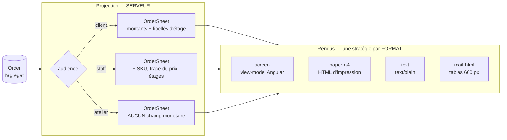

# Le bon de commande — un objet, plusieurs formats

**Ouvert le 2026-09-07. Doc-first : rien de ce qui suit n'est codé.**

Ce document décrit **une pièce et une seule** — le bon de commande — et la façon
dont elle se rend en six endroits sans être réécrite six fois. Il remplace la
notion de « bon de livraison », qui n'a jamais désigné ce que le code produit.

> **Pourquoi maintenant.** Six vues du même objet existent en maquette, trois
> existent en code (l'écran client, l'écran staff, la fiche d'atelier), et le
> quatrième — le fichier texte — s'appelle `renderDeliveryNote`. Chacune a été
> écrite séparément. Tant qu'elles le restent, la règle « l'atelier ne voit
> aucun montant » est une consigne qu'on applique à la main, six fois.

---

## 1. Le constat qui ouvre le dossier : il n'y a pas de bon de livraison

`packages/b2b-ui/src/order/order-documents.ts` produit un document dont
l'en-tête est **toujours** `BON DE LIVRAISON`, et dont la quatrième ligne est :

```
Acheminement  : Retrait au laboratoire
```

Un bon de livraison pour une commande que personne ne livre. Ce n'est pas une
faute de frappe : c'est le symptôme d'un modèle où **le document tire son nom du
mode d'acheminement**, alors que l'acheminement n'est qu'un de ses champs.

Le même glissement est ailleurs. `orderDocuments()` propose « Bon de livraison »
dans la liste des pièces d'une commande à retirer ; le legacy
`legacy/commandes/download-bon.ts` produit, lui, un « BON DE COMMANDE » — de
neuf lignes, avec un **Total TTC**, hors de la plateforme. Deux fonctions, deux
noms, deux vérités sur la même commande.

**La correction est un renommage de concept, pas de fichier :**

> Il existe **un bon de commande**. Il porte un **mode d'acheminement** — retrait
> ou coursier — au même titre qu'il porte une date, des lignes et un
> destinataire. Il n'existe pas de pièce « de livraison » : celui qui réceptionne
> et celui qui retire cochent la même feuille.

Ce que ça supprime, immédiatement : la question « quel document imprimer pour un
retrait ? », le champ `label: 'Bon de livraison'` posé en dur, et l'idée qu'un
mode d'acheminement mérite une seconde fonction de rendu.

---

## 2. Deux axes, et il ne faut surtout pas les confondre

Une pièce imprimée se décrit par deux questions **indépendantes** :

|              | La question           | Les valeurs                               | Ce qu'elle décide       |
| ------------ | --------------------- | ----------------------------------------- | ----------------------- |
| **Audience** | qui lit ?             | `client` · `staff` · `atelier`            | **ce qu'il y a dedans** |
| **Format**   | sur quoi ça se pose ? | écran · papier A4 · texte · courriel HTML | **comment c'est rendu** |

Six vues en maquette, ce sont six **couples**, pas six documents. Les traiter
comme six documents produit ce qu'on a déjà : la règle des montants réécrite
partout où on la répète.

🔴 **Le piège que ce document existe pour fermer.** La spec papier
(fiche 05 du dossier de reprise « bon de commande », hors dépôt) propose :

```ts
renderDeliveryNote(order, { withPrices?: boolean })   // ← non
```

`withPrices` est **une option de rendu pour une règle d'audience**. Elle ne
protège rien : le jour où quelqu'un imprime pour le quai de livraison, il passe
`true` et les prix négociés partent sur le quai. La spec le dit elle-même
(« l'option suit le destinataire, pas l'utilisateur ») puis propose la signature
qui trahit la phrase.

**La forme juste** : l'audience se choisit **avant** le rendu, et la projection
`atelier` ne porte **aucun champ monétaire**. Aucun rendu ne peut alors imprimer
un prix au fournil — pas parce qu'il s'en souvient, parce qu'il n'a rien à
imprimer. C'est la hiérarchie du dépôt appliquée à la lettre : _inexprimable >
refusé_.

---

## 3. La forme : projeter, puis rendre



**La règle des montants vit à un seul endroit** — la projection — et **le
strategy pattern porte sur le format**, jamais sur l'audience. Un cinquième
format (PDF, EDI, CSV pour un client qui réconcilie) est un rendu de plus. Une
quatrième audience (le comptable du client) est une projection de plus. Les deux
s'ajoutent sans se croiser : c'est tout l'intérêt de séparer les axes.

### Le modèle, neutre de format

`OrderSheet` — un objet **plat, sans comportement, sans dépendance**. Il ne sait
ni ce qu'est une balise ni ce qu'est un `<td>`.

```ts
/** Ce qu'un bon de commande dit, quel que soit le papier sur lequel il tombe. */
export interface OrderSheet {
  readonly audience: SheetAudience;
  readonly reference: string; // CMD-4812
  readonly placedAt: string; // ISO
  readonly requestedFor: string | null;
  readonly fulfillment: SheetFulfillment; // mode + adresse + tranche + contact
  readonly lines: readonly SheetLine[];
  readonly note: string;
  /** ABSENT sur l'audience atelier — pas `null`, pas à zéro : absent. */
  readonly money?: SheetMoney;
  /** Le jeton que le comptoir ou le coursier scanne. `null` : rien à présenter. */
  readonly handoverToken: string | null;
  readonly issuedAt: string; // §5
  readonly revision: number; // §5
}
```

Deux choses à ne pas rater dans cette forme.

**`money` est optionnel, pas nullable.** Avec `exactOptionalPropertyTypes` (actif
dans tout le dépôt), `{money?: SheetMoney}` n'est pas
`{money: SheetMoney | undefined}` : un rendu qui écrit `sheet.money.totalCents`
ne compile pas sans avoir prouvé la présence. Un `money: null` se serait
contourné d'un `?? 0`, et un total à zéro sur un bon d'atelier est exactement le
genre de faux qu'on ne voit pas.

**`SheetLine` diffère par audience, et c'est la même mécanique** : `sku`,
`entryPriceMillicents` et `steps` (les étages) n'existent que sur la projection
staff. La première règle d'audience du dossier de reprise — « le client ne lit jamais le nom des
étages » — cesse d'être une règle d'écran pour devenir une **absence de champ**.

### Le registre des rendus

Le paquet `@lfd/mailer` a déjà résolu ce problème et sa solution se recopie :

```ts
/** Sortie attendue par format — c'est elle qui rend le registre exhaustif. */
interface SheetOutput {
  readonly screen: OrderSheetViewModel;
  readonly "paper-a4": string; // HTML d'impression
  readonly text: string;
  readonly "mail-html": string;
}

export type SheetRenderers = {
  readonly [F in keyof SheetOutput]: (sheet: OrderSheet) => SheetOutput[F];
};
```

Un format déclaré sans rendu **ne compile pas**. C'est ce qui remplace le `switch`
exhaustif qu'on oublie d'étendre — même raison qu'écrite dans
`packages/mailer/src/types.ts` pour `TemplateRegistry`.

### Le QR est un champ du modèle, pas une décoration du courriel

Le courriel de confirmation **affiche le QR dans son corps**, à la place du
bouton « Voir mon QR de retrait » que porte l'écran. Ce n'est pas un choix de
mise en page : c'est retirer un aller-retour authentifié **au pire moment**.

Le bouton demande d'ouvrir l'app, d'être encore connecté, et de retrouver la
commande — debout devant un comptoir, le téléphone déjà à la main, la file
derrière. Le courriel, lui, est déjà ouvert : c'est ce qu'on a sous les yeux
quand on cherche son code. Le dossier de reprise le dit pour la pièce jointe
(« un PDF à ouvrir sur un téléphone, la main sur la porte, ne se scanne pas ») ;
l'argument vaut mot pour mot pour un bouton.

Le jeton est donc un **champ de l'`OrderSheet`**, pas une donnée que le gabarit
irait chercher.

🔴 **Et un seul rendu le lit : `mail-html`. Aucun autre, jamais.** Ce n'est pas
une commodité de mise en page, c'est la règle qui empêche l'**autoscan**.

En livraison, le papier voyage **avec la marchandise** : il est dans le carton,
dans la camionnette, entre les mains du coursier bien avant que le destinataire
ne le voie. Un QR imprimé dessus, c'est un coursier qui scanne son propre colis
et une attestation qui dit « remis » sans que personne n'ait reçu.

**Tout l'intérêt du scan est qu'il exige DEUX parties** : l'un présente, l'autre
scanne. Imprimer le code sur le colis fait s'effondrer les deux en une seule, et
ce qui reste n'atteste plus rien — c'est une signature qu'on se donne à soi-même.

Le courriel, lui, part vers la boîte du destinataire : c'est un canal **qu'il
contrôle**, et que le porteur du colis n'a pas. C'est ce qui fait de lui le seul
véhicule légitime du jeton.

D'où **une règle sans branche** : le QR ne s'imprime jamais — ni sur le bon
texte, ni sur la feuille d'atelier, ni sur le PDF rangé en R2, et **pas
davantage en retrait qu'en livraison**. Un cas particulier « sauf au retrait,
où c'est inoffensif » serait vrai, et serait précisément la porte par laquelle
la version livraison reviendrait un jour, « pour faire pareil ». Une règle sans
exception ne se négocie pas à 6 h du matin devant une imprimante.

⚠️ **Le cas qui poussera à enfreindre la règle, et il faut le traiter avant qu'il
se présente** : le destinataire n'a pas toujours le courriel sous les yeux — un
magasinier, quelqu'un d'autre à l'accueil, un téléphone déchargé. Ce jour-là, la
livraison ne peut pas être attestée par scan, et quelqu'un proposera d'imprimer
le code « juste pour les livraisons difficiles ». La sortie est de prévoir dès le
lot 6 **ce qui se passe quand le scan est impossible** — une remise saisie à la
main par le coursier, tracée comme telle et distinguable d'un scan, plutôt qu'un
scan que le coursier se fait à lui-même en croyant bien faire. Une attestation
faible et honnête vaut mieux qu'une attestation forte et fausse.

🔴 **Faire voyager le jeton par courriel n'ouvre rien**, et la raison est déjà
écrite sur le champ dans `contracts` : « le jeton n'ouvre qu'une porte **staff**,
qui exige une session admin. Le connaître ne permet pas d'attester sa propre
remise. » Un courriel transféré, une boîte partagée, une capture d'écran : le
porteur du code ne peut toujours rien en faire seul. C'est la première question
qu'on posera à ce paragraphe — elle a sa réponse, et elle est antérieure.

### La livraison a besoin du même jeton, et ne l'a pas

En retrait, le client montre son code et **l'équipe scanne**. En livraison, la
symétrie est exacte : le destinataire montre le code de son courriel, et **le
coursier scanne** avec sa session staff. Même jeton, même porte, même geste.

Rien de tout ça n'existe. `handover.ts` en émet **pour le retrait seul** —
`issuesHandoverToken()` rend `method === "pickup"` — et `handoverBlocker()`
refuse d'emblée toute commande en coursier (« elle ne se remet pas au
comptoir »).

⚠️ **La raison écrite au-dessus de cette fonction va devenir fausse**, et il faut
le dire plutôt que la contredire en silence :

> « En émettre un pour une livraison créerait une porte inutilisable dont
> personne ne saurait, au moment de l'auditer, si elle est morte ou oubliée. »

Elle était vraie quand elle a été écrite : aucune remise en livraison n'existait,
donc le jeton n'aurait ouvert sur rien. Le jour où le coursier scanne, la porte
est utilisée — la raison tombe **avec son motif**, et c'est la façon propre de la
retirer. La réécrire sans le dire laisserait croire qu'elle n'a jamais été vraie.

**Scanner n'est pas signer.** Le scan atteste une remise ;
`fulfillment.signatureRequired` dit si une signature est **en plus** exigée.
Recueillir une signature manuscrite ou électronique est un autre chantier, et il
ne se cache pas derrière un QR.

### Ce qui rend l'attestation infalsifiable

Le scan ne doit pas poser un drapeau : il doit produire une **attestation** — qui
a remis, à quel instant, sur quelle commande — et une seule fois. Le mot est déjà
celui du code (`confirm-handover.handler.ts` : « lire, juger, graver — et rendre
l'attestation obtenue »), et le mécanisme y est presque en entier. Ce qui le rend
infalsifiable tient en quatre traits, dont **aucun n'est cryptographique** :

1. **L'auteur n'est jamais dans la charge utile.** `handedOverBy` vient du
   `Principal` de la session staff, résolu **en base** à chaque requête. Le
   porteur du QR ne peut pas se désigner lui-même : il ne fournit qu'un jeton.
2. **L'instant vient du `Clock` du serveur**, pas de l'appareil qui scanne. Une
   tablette à l'heure fausse ne datera pas une remise à hier.
3. **Usage unique, refusé EN BASE.** L'écriture est conditionnée
   (`where: { handoverToken, handedOverAt: null }`), et le handler dit déjà quoi
   faire du perdant : « on ne réécrit rien — on renvoie l'attestation de l'autre,
   seule vraie, plutôt que d'inventer la nôtre ». Deux comptoirs qui scannent le
   même code ne produisent pas deux remises.
4. **Le jeton est un secret aléatoire**, pas le numéro de commande : on ne
   fabrique pas le code d'une commande voisine en incrémentant.

**Ce que ça couvre, et ce que ça ne couvre pas.** Ces quatre traits rendent
l'attestation infalsifiable **par un tiers** — client, porteur du courriel,
appareil de scan. Ils ne la rendent pas opposable **contre nous** : c'est notre
serveur qui l'écrit, et rien ne permet à un client de vérifier qu'elle n'a pas été
retouchée après coup.

Si c'est ce niveau qu'on veut — « signé par », au sens où le client peut vérifier
la signature sans nous croire — il faut autre chose : un condensé de
l'attestation signé par une clé du serveur, remis au client avec elle, et une
clé publique qu'il puisse consulter. **C'est un chantier à part**, et il ne se
justifie que si le litige attendu est _nous contre le client_, pas _le client
contre un tiers_. Pour ce dernier, l'autorité de la base suffit et c'est ce que
le code fait déjà.

🔴 **Vérifié le 2026-09-07 : la remise n'est PAS journalisée.** L'attestation
vit sur **une ligne mutable, et nulle part ailleurs**. Quatre constats, chacun
lisible en ouvrant un fichier :

| Ce qu'on cherche                      | Ce qu'on trouve                                                                                       |
| ------------------------------------- | ----------------------------------------------------------------------------------------------------- |
| un type d'événement de remise         | `ACTIVITY_TYPES` en compte dix-neuf — `order.placed` y est, **rien** sur la remise ni sur `fulfilled` |
| un fait de domaine côté `orders`      | `orders/domain/events/` ne contient **qu'un** fichier : `order-placed.event.ts`                       |
| une publication dans le handler       | `ConfirmHandoverHandler` injecte `OrderReader`, `OrderRepository`, `Clock`. **Pas d'`EventBus`.**     |
| une écriture annexe dans l'adaptateur | `markHandedOver` fait **un** `updateMany` sur `order` — `handedOverAt`, `handedOverBy`, `status`      |

**L'asymétrie est le vrai problème.** La _naissance_ d'une commande entre au
journal (`OnOrderPlaced` écrit `order.placed`), sa _délivrance_ n'y entre pas. Le
journal peut donc dire « ce client a commandé » et **jamais** « ce client a
reçu » — exactement la moitié qu'on voudrait produire en cas de litige.

Et c'est aussi vrai de la seule transition de statut du système : le handler
écrit lui-même que c'est « la première transition de statut du système », et elle
passe sans témoin.

Or le journal a précisément la propriété qui manque. Son propre commentaire de
schéma la nomme : « Journal **append-only** […] un seul invariant :
l'immuabilité (jamais d'UPDATE/DELETE) ». La ligne de commande, elle, s'`UPDATE`
— et rien n'enregistre qu'elle l'a été. Un futur avenant, un correctif, un script
de rattrapage : `handedOverBy` se réécrit sans laisser de trace.

**Ce que le lot 6 doit donc ajouter** : un fait `order.handed_over` publié après
persistance, journalisé comme `order.placed` l'est déjà — même mécanisme, même
abonné de fond, rien à inventer. Le témoin immuable se pose **à côté** de la
ligne ; il ne la remplace pas, et le schéma est clair là-dessus : « la vérité
métier reste transactionnelle […] on ne reconstruit JAMAIS l'état depuis ce
journal ».

⚠️ **Une réserve, à trancher au lot 6.** Le journal est celui du module
**croissance** : ses sujets sont `user | company | lead`, et il est décrit comme
une projection analytique. Une attestation de remise n'est pas un signal de
croissance. Le cycle de vie des rendez-vous y vit déjà (`appointment.honored`,
`appointment.no_show`), donc le précédent existe — mais y ranger une pièce
destinée à faire foi étire sa raison d'être. Soit on l'assume et on l'écrit dans
son en-tête, soit l'attestation demande son propre journal. Ne pas glisser l'un
pour l'autre sans le dire.

---

## 4. Où chaque morceau vit — et pourquoi la projection est côté serveur

| Morceau                         | Emplacement                                        | Raison                                                                |
| ------------------------------- | -------------------------------------------------- | --------------------------------------------------------------------- |
| `OrderSheet` + schéma Zod       | un module `order-sheet` dans `packages/contracts/` | il traverse le réseau, il se relit ; c'est la définition d'un contrat |
| Projection `Order → OrderSheet` | `apps/lfd-api/src/b2b/orders/domain/services/`     | **c'est une règle de sécurité**, cf. ci-dessous                       |
| Rendu `screen`                  | l'app Angular qui l'affiche                        | un view-model n'a de sens que devant son gabarit                      |
| Rendus `text` et `paper-a4`     | `packages/b2b-ui/src/order/`                       | les deux fronts les téléchargent et les impriment                     |
| Rendu `mail-html`               | `apps/lfd-api/src/platform/mailer/`                | le courriel part du serveur ; le registre de gabarits y est déjà      |

🔴 **La projection ne peut pas vivre dans le navigateur.** Le dossier de reprise
le dit dans les termes exacts : « c'est une règle d'API avant d'être une règle
d'écran. Si le nom de l'étage arrive dans la charge utile du client et n'est que
masqué au rendu, il est dans le réseau. » Une projection front laisserait
`OrderView` complet descendre chez le client — SKU, tarif d'entrée,
`priceSteps` — et un client qui empile trois commandes reconstitue la grille
tarifaire. Le masquer au rendu ne le retire pas de l'onglet réseau.

C'est aussi ce qui ferme la **quatrième contradiction** du dossier de reprise, et elle se ferme
**par construction** : ce que le serveur ne projette pas, l'écran ne peut pas
fuiter.

⚠️ **Une frontière à surveiller au passage.** `mail-templates.ts` vit dans
`platform/`, qui selon la matrice du `CLAUDE.md` racine « ne connaît **aucun**
contexte ». Il porte déjà `customer.access-opened` et
`staff.appointment-booked` : la dérive est antérieure à ce chantier. Y ajouter un
gabarit qui parle de lignes de commande et de TVA l'aggrave. La sortie propre est
que le gabarit reçoive un `OrderSheet` **déjà projeté** et n'en connaisse que la
forme — le paquet `@lfd/mailer` est conçu exactement pour ça (« la carte des
gabarits appartient à l'app »). À trancher avant d'écrire le gabarit, pas après.

---

## 5. Ce que le modèle rend obligatoire, et qui manque partout aujourd'hui

Troisième contradiction du dossier de reprise : aucun document ne porte son heure
de génération, et la fiche 04 le redit pour la fiche d'atelier. Les deux se
retéléchargent et se réimpriment à volonté, y compris après un avenant, et rien
ne distingue deux tirages.

`issuedAt` et `revision` sont **des champs du modèle**, pas une consigne de pied
de page. Conséquence directe : un rendu qui ne les affiche pas est un rendu
incomplet qu'une revue voit, au lieu d'un oubli que personne ne voit. Et la
question « ce papier est-il à jour ? » a une réponse lisible sur le papier :

```
Arrêté le 7 sept. à 4 h 05 · révision 2
```

🔴 **« Arrêté », pas « tiré », et le mot compte.** `issuedAt` est l'instant où
**la révision est devenue vraie** — la passation pour `revision: 0`, l'avenant
ensuite — et non l'instant où l'on a fabriqué le papier. Deux tirages de la même
révision portent donc la même date, ce qui est exactement ce qu'on veut : ils
disent la même commande. La sous-section « écrit au premier téléchargement »
montre que sans ça, le rangement en R2 ne tient pas.

`revision` compte les **avenants** appliqués depuis la passation. Le mécanisme
n'existe pas encore ([`architecture-commande-immuable-avenants.md`](architecture-commande-immuable-avenants.md)),
et c'est précisément pour ça que le champ doit exister **maintenant** : le jour
où l'avenant arrive, aucun document en circulation ne saurait dire s'il précède
ou suit. Un `revision: 0` sur toutes les commandes actuelles est vrai — aucune
n'a d'avenant.

### Le tirage de remise est un ARTEFACT, pas un rendu

Le bon de commande **papier remis au client** — celui qu'on lui tend au
comptoir avec ses pièces, et qu'il doit pouvoir retélécharger — est d'une autre
nature que les quatre formats du §3. Ceux-là sont des **fonctions pures** :
on les recalcule à la demande, et c'est très bien tant que la commande n'a pas
bougé.

Celui-ci ne peut pas être recalculé. **Le papier qui est parti du comptoir est un
fait**, au même titre que le prix figé sur une ligne. Un avenant appliqué le
lendemain, un libellé corrigé, un taux de TVA rectifié : recalculer donnerait un
PDF qui ne ressemble plus à celui que le client a dans la poche, et c'est
exactement la situation où il appelle.

Il est donc **écrit une fois et rangé**, en PDF, dans le stockage objet (R2) —
et le retéléchargement rend **ces octets-là**, jamais un nouveau tirage.

Le port existe déjà et dit la règle qu'il faut suivre :
`platform/storage/document-store.ts` — « Aucun fichier ne vit en base : seules sa
**clé** et ses métadonnées y sont gardées », et « **La clé ne vient jamais du
client.** Chaque appelant la dérive d'identifiants qu'il a vérifiés ». C'est le
même port que le KBIS et le mandat signé ; il n'y a rien à inventer, seulement
une clé à composer :

```
orders/{orderId}/bon-de-commande-r{revision}.pdf
```

🔴 **La révision est DANS la clé, et ce n'est pas décoratif.** Le port écrit
noir sur blanc qu'« une même clé écrase : c'est ce qui fait qu'un remplacement
reste un remplacement ». Un chemin sans révision ferait donc disparaître, au
premier avenant, le PDF qui circule déjà — le seul document que le client peut
opposer. Chaque révision garde le sien ; l'écran propose la dernière et
l'historique reste lisible.

### Écrit au PREMIER TÉLÉCHARGEMENT — et ce que ça exige

**Décidé le 2026-09-07.** L'alternative était de fabriquer le PDF à la
passation ; elle produit un document pour chaque commande, dont l'immense
majorité ne sera jamais téléchargée. On écrit donc à la demande : le handler
regarde si la clé existe, la rend si elle manque, et sert les octets.

Ce que ça déplace, c'est la question de la **course**. Deux onglets qui
téléchargent en même temps entrent tous les deux dans la branche « elle
manque » et écrivent tous les deux — et le port dit qu'« une même clé écrase ».

**La course est inoffensive à une condition : que le rendu soit déterministe.**
Deux rendus de la même révision doivent produire les mêmes octets ; le second
`save` écrase alors le premier par un objet identique, et peu importe qui gagne.
C'est là que le §5 se referme sur lui-même :

- `issuedAt` est l'instant de la **révision**, pas du rendu. S'il valait
  `clock.now()` au moment de fabriquer, les deux PDF différeraient d'une seconde
  et le client aurait pu recevoir celui que le stockage ne garde pas.
- Le rendu ne lit donc **ni horloge, ni aléa** : il ne prend que l'`OrderSheet`.
  C'est la même exigence de pureté que les quatre autres formats, et elle rend
  la porte `lint:clock-port` opposable sur ce chemin.
- Le `save` devient **idempotent par construction**, sans verrou, sans
  transaction, sans réservation. C'est la version qui n'a rien à coordonner.

⚠️ Un moteur PDF qui date le document lui-même (métadonnée `CreationDate`) casse
cette propriété sans rien afficher de faux. C'est un critère de choix du moteur,
pas un détail — cf. §8.

Deux conséquences sur le modèle :

- `issuedAt` et `revision` cessent d'être **déclaratifs**. Ils ne disent plus
  « ce tirage a été fait à telle heure », ils **identifient** l'objet rangé. Deux
  PDF de la même commande ne peuvent plus être confondus, et la question « lequel
  le client a-t-il ? » a une réponse.
- Le PDF est le **seul** format qui produise un effet de bord. Les autres rendus
  restent purs et testables sans stockage ; celui-ci s'écrit derrière un port,
  et son handler est le seul à connaître `DocumentStore`.

---

## 6. La facture reste hors du dossier, et ça ne change pas

`order-documents.ts` déclare la facture **indisponible**, faute de série de
numérotation serveur, et la raison qu'il en écrit est la bonne :

> « en fabriquer une dans le navigateur produirait un document sans valeur que
> quelqu'un finirait par envoyer à son comptable. »

Un `OrderSheet` d'audience `client` porte des montants. **Il n'est pas une
facture**, et son pied doit le dire en toutes lettres — pas par pudeur, parce
que le seul écart entre les deux pièces est un numéro de série que la plateforme
n'a pas. Un document chiffré et muet sur ce point sera classé comme une facture
par le premier comptable qui le reçoit.

C'est le chantier comptable, il est ailleurs :
[`../b2b/architecture-facturation.md`](../b2b/architecture-facturation.md).

---

## 7. Le découpage

| Lot   | Ce qu'il fait                                                                                                 | Ce qui devient impossible ensuite                           |
| ----- | ------------------------------------------------------------------------------------------------------------- | ----------------------------------------------------------- |
| **1** | `OrderSheet` + schéma dans `contracts`, avec `money` optionnel et `SheetLine` par audience                    | écrire un montant dans une projection atelier               |
| **2** | La projection serveur, ses tests aux trois audiences, la route qui la sert                                    | qu'un nom d'étage descende chez le client                   |
| **3** | Rendu `text` — remplace `renderDeliveryNote`, en-tête « BON DE COMMANDE », `issuedAt` au pied                 | qu'un bon de retrait s'annonce « de livraison »             |
| **4** | Rendu `paper-a4` atelier — la fiche existante rebranchée sur la projection                                    | qu'une fiche d'atelier soit tirée sans heure ni révision    |
| **5** | Rendu `mail-html` + gabarit `customer.order-placed`, **QR dans le corps** — pas un bouton                     | qu'on demande une session à qui est déjà devant le comptoir |
| **6** | Jeton de remise émis **aussi en livraison**, `handoverBlocker` ouvert au coursier, journal d'événements       | qu'une livraison remise ne laisse aucune trace              |
| **7** | Décommissionner `legacy/commandes/download-bon.ts`                                                            | qu'il existe deux « bons » avec deux totaux différents      |
| **8** | Rendu `pdf` **déterministe**, écrit au premier téléchargement, rangé en R2 sous une clé qui porte la révision | qu'un avenant écrase le papier que le client a en main      |

**L'ordre n'est pas négociable.** Les lots 3 à 5 sont des rendus : ils n'ont rien
à consommer tant que 1 et 2 n'existent pas, et les écrire d'abord recrée
exactement les six documents séparés que ce dossier vient défaire.

---

## 8. Ce qui reste à trancher

- **Le nom en code.** Le lexique du dépôt (`documentation/langue-du-code.md`)
  n'a pas d'entrée pour « bon de commande ». `purchaseOrder` est faux — c'est la
  pièce qu'un **acheteur** émet, et ici c'est le vendeur qui l'écrit. Ce document
  retient **`OrderSheet`** : la feuille d'une commande, quel que soit son papier.
  L'alternative est de garder `bonDeCommande` sous le précédent `mercuriale`
  (« le traduire par approximation ferait perdre ce que le mot dit »). Le choix
  se fait maintenant : après le lot 1, c'est un renommage de contrat.
- **Comment fabriquer le PDF.** C'est le seul format qui ajoute une
  dépendance : les quatre autres rendent une chaîne, celui-là veut un moteur —
  navigateur sans tête, bibliothèque de composition, ou service tiers. Le
  choix n'est pas neutre pour un container Cloudflare, et il conditionne le
  lot 8. Le rendu `paper-a4` (HTML d'impression, lot 4) est **le même
  document** : si le moteur retenu part d'un HTML, le PDF est un
  post-traitement et non un cinquième gabarit à tenir à jour.
  🔴 **Critère éliminatoire** : le moteur doit rendre les **mêmes octets** pour
  la même entrée. Un moteur qui écrit sa propre `CreationDate` dans les
  métadonnées, ou qui sème un identifiant de document, brise l'idempotence sur
  laquelle repose l'écriture au premier téléchargement — sans que rien
  n'apparaisse de faux à l'écran. À vérifier avant d'adopter, pas après.
- **La durée de conservation — REPORTÉ, sciemment.** Un PDF rangé sous une clé
  qui porte la révision ne s'écrase jamais : le stockage ne fait que croître.
  Rien n'est décidé et rien ne presse — un bon de commande pèse quelques
  dizaines de kilo-octets, et il en faudrait des centaines de milliers pour que
  la question se pose. Elle est écrite ici pour être trouvée le jour où elle se
  posera, pas pour être traitée dans ce chantier. La réponse, quand elle
  viendra, sera **comptable avant d'être technique** : on ne purge pas une
  pièce qu'un client peut opposer sans savoir combien de temps il a le droit de
  l'opposer.
- **`vitruve` n'a pas tourné sur ce document, et le `CLAUDE.md` l'exige** — ce
  plan touche l'argent (les montants sur le bon) **et** déplace une frontière de
  sécurité (la projection par audience) — et depuis le §5, il range une pièce
  opposable dans un stockage objet. Deux des quatre critères, largement. Toutes les
  affirmations faites ici de l'existant ont été rouvertes dans le dépôt ; ça ne
  remplace pas un contradicteur sur ces deux critères-là.

---

## 9. Ce que ce document ne dit pas

- **Le parcours client** qui mène au bon :
  [`parcours-client-compte-actif.md`](parcours-client-compte-actif.md).
- **Le contenu de l'avenant** — qui l'émet, qui le signe, ce qu'il corrige. Le
  handoff le nomme « le point ouvert du système entier », et il a raison. Ce
  document n'en prend qu'un compteur.
- **La mise en page** de chaque vue : cotes, couleurs, grilles. Elles sont dans
  le dossier de reprise et dans les maquettes — un modèle ne les remplace pas.
