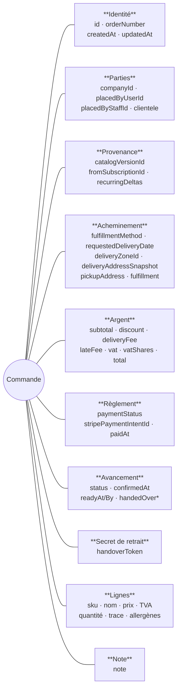
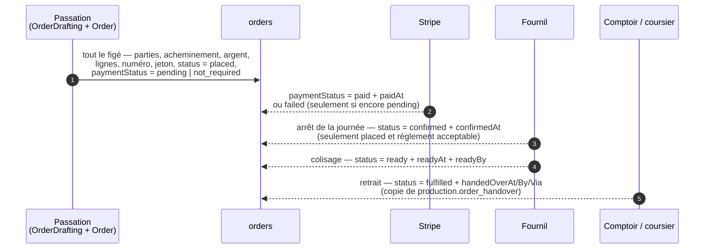
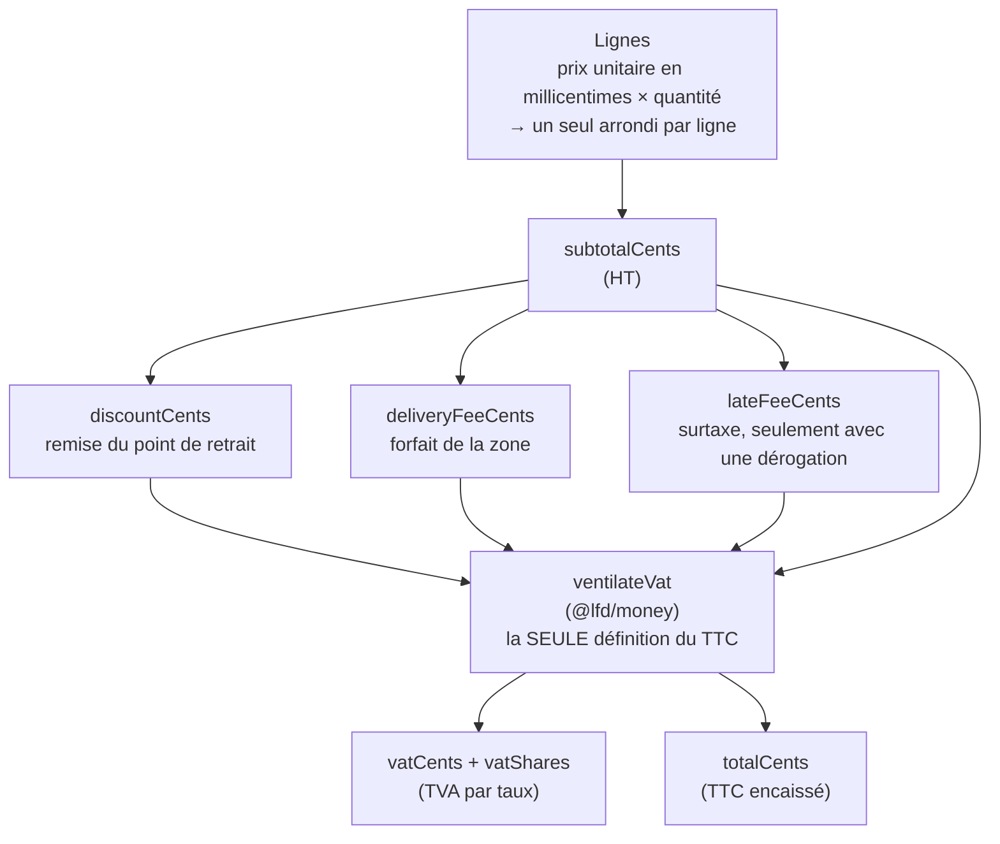
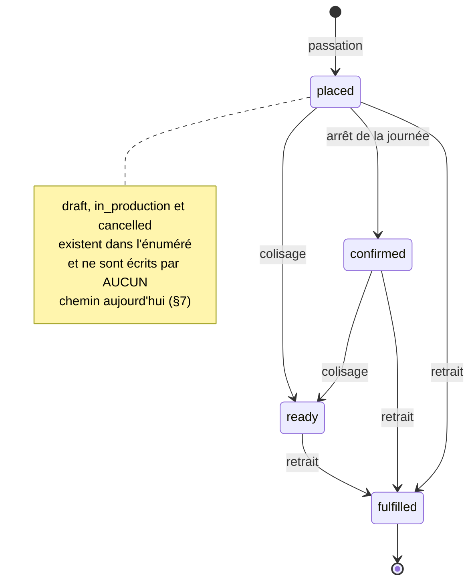
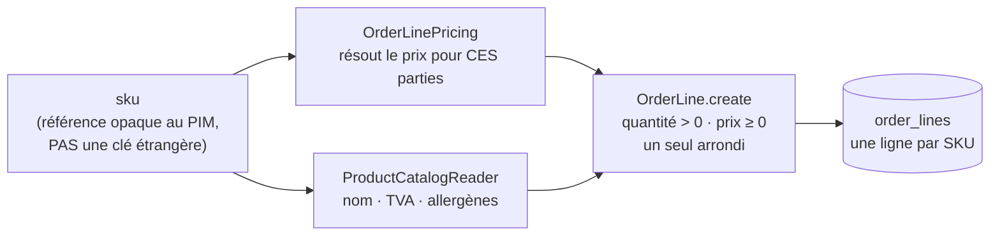

# Ce que porte la commande

**Statut** : ✅ décrit **tel qu'il est**. Chaque ligne a été relue dans le
schéma, l'agrégat et les adaptateurs le 2026-09-17. Les écarts constatés ce
jour-là sont au §7, et ils ne sont pas corrigés ici.
**Portée** : chaque information que la table `orders` et ses lignes portent, et
**comment elle est définie** — qui la calcule, à quel moment, et ce que veut
dire son absence. Ce document ne décrit ni les écrans, ni les transitions (voir
[`architecture-cycle-de-vie-commande.md`](architecture-cycle-de-vie-commande.md)),
ni le calcul d'un prix de ligne (voir [`../pricing/README.md`](../pricing/README.md)).

> **Pourquoi ce document** (Hugo, 2026-09-17) : les informations de la commande
> étaient expliquées à quinze endroits — un commentaire de schéma, un plan, un
> JSDoc d'agrégat. Chacun disait juste sur son champ, aucun ne donnait le tout.
> Ce document est la **carte** ; les documents cités restent la source du
> détail.

Sources lues : [`orders.prisma`](../../apps/lfd-api/prisma/schema/public/orders.prisma),
[`order.ts`](../../apps/lfd-api/src/b2b/orders/domain/entities/order.ts),
[`order-drafting.service.ts`](../../apps/lfd-api/src/b2b/orders/application/services/order-drafting.service.ts),
[`prisma-order.repository.ts`](../../apps/lfd-api/src/b2b/orders/infrastructure/prisma-order.repository.ts).

---

## 1. La carte

Une commande porte **neuf familles** d'informations. Elles ne sont pas écrites
au même moment, et c'est ce qui compte le plus pour les lire.

## 2. Quand chaque information est écrite

Il y a **deux sortes** de colonnes, et on ne les lit pas de la même façon :

- **figées à la passation** — écrites une seule fois, dans la même transaction
  que la commande, et plus jamais modifiées. Ce qui bouge après passe par un
  **avenant** ([`architecture-commande-immuable-avenants.md`](architecture-commande-immuable-avenants.md)) ;
- **projetées après** — écrites par un fait qui arrive plus tard (Stripe, le
  fournil, le comptoir). Chacune de ces écritures est **conditionnée en base**
  (`updateMany` + `where`), ce qui la rend idempotente et tranche les courses.

| Moment              | Qui écrit                                               | Colonnes                                    | Condition en base                               |
| ------------------- | ------------------------------------------------------- | ------------------------------------------- | ----------------------------------------------- |
| passation           | `PrismaOrderRepository.place()`                         | tout le figé                                | `order_number` et `handover_token` uniques      |
| retour Stripe       | `markPaid` / `markPaymentFailed`                        | `paymentStatus`, `paidAt`                   | `paymentStatus = pending`                       |
| arrêt de la journée | `absorbIntoPlan`, appelé par `on-production-day-closed` | `status → confirmed`, `confirmedAt`         | `planWhere()` — cf. le document du règlement §6 |
| colisage            | `markReady`, appelé par `on-order-packed`               | `status → ready`, `readyAt`, `readyBy`      | ni annulée, ni brouillon, ni déjà remise        |
| retrait             | `markFulfilled`, appelé par `on-order-handed-over`      | `status → fulfilled`, `handedOverAt/By/Via` | `handedOverAt IS NULL`                          |

---

## 3. Famille par famille

Convention des tableaux : **Défini par** dit QUI produit la valeur. **`NULL`**
dit ce que l'absence signifie — et elle ne signifie jamais « zéro » ni « vide »
par défaut (règle 4 du [`README.md`](README.md)).

### 3.1 Identité

| Colonne       | Ce qu'elle dit                                | Défini par                                                                                | `NULL` |
| ------------- | --------------------------------------------- | ----------------------------------------------------------------------------------------- | ------ |
| `id`          | le vrai identifiant                           | la base (`cuid`)                                                                          | —      |
| `orderNumber` | la **référence humaine**, imprimée sur le bon | l'adaptateur : `ORD-` + l'instant en base 36 + les 4 derniers caractères d'un identifiant | —      |
| `createdAt`   | **passée le**                                 | la base                                                                                   | —      |
| `updatedAt`   | dernière écriture, quelle qu'elle soit        | Prisma                                                                                    | —      |

⚠️ Le numéro est **public** : il est imprimé en clair. C'est pour ça qu'il ne
sert jamais de preuve au retrait (§3.8), et qu'il suffit au colisage, qui est un
geste interne derrière une session staff.

### 3.2 Les parties — pour qui, par qui

| Colonne           | Ce qu'elle dit                                             | Défini par                                                    | `NULL`                                            |
| ----------------- | ---------------------------------------------------------- | ------------------------------------------------------------- | ------------------------------------------------- |
| `companyId`       | la société pour laquelle on commande — **le mur tenant**   | la porte d'entrée (§4)                                        | commande personnelle, **ou** société supprimée    |
| `placedByUserId`  | **au nom de qui** — toujours un client, jamais le staff    | la porte d'entrée (§4)                                        | —                                                 |
| `placedByStaffId` | **qui l'a saisie** chez nous, quand ce n'est pas le client | la porte staff seule                                          | le client a commandé seul                         |
| `clientele`       | **qui commande** : `pro` ou `public`                       | l'agrégat, déduit de `companyId` — aucun appelant ne la passe | commande d'avant le 2026-09-15, **pour toujours** |

- Sans société, le mur est `placedByUserId` : la commande n'est qu'à son auteur.
- `placedByStaffId` est un identifiant d'annuaire **sans clé étrangère** : une
  pièce comptable ne disparaît pas quand on retire quelqu'un du personnel.
- 🔴 `clientele` dit **QUI commande, pas quel tarif** a été appliqué. Une
  société en attente est `pro` ici, et B2C au tarif. Elle sert au badge du
  comptoir et à la règle de production. Détail et raisons :
  [`plan-nature-du-client-sur-la-commande.md`](plan-nature-du-client-sur-la-commande.md).
- Une société supprimée remet `companyId` à `NULL` (`ON DELETE SET NULL`) sous
  une commande restée `pro`. Les deux colonnes peuvent donc se contredire, et
  c'est `clientele` qui dit le vrai.

La **provenance d'écran** (`self_service`, `back_office`, `recurring`) n'est pas
une colonne : les vues de lecture la déduisent de `placedByStaffId` et
`fromSubscriptionId` (`order-origin.ts`).

### 3.3 La provenance des articles

| Colonne              | Ce qu'elle dit                                               | Défini par                                           | `NULL`                                              |
| -------------------- | ------------------------------------------------------------ | ---------------------------------------------------- | --------------------------------------------------- |
| `catalogVersionId`   | de quelle **version du catalogue** venaient les articles     | `OrderDrafting` : la version courante à la passation | aucune version posée à cet instant — on ne sait pas |
| `fromSubscriptionId` | l'abonnement qui a produit la commande                       | **personne aujourd'hui** (§7)                        | commande non récurrente                             |
| `recurringDeltas`    | l'écart avec le gabarit de l'abonnement (`added`, `removed`) | **personne aujourd'hui** (§7)                        | idem                                                |

⚠️ `catalogVersionId` répond à « d'où venait cet article », **jamais** à « quel
prix » : le prix est figé sur la ligne.

### 3.4 L'acheminement — où, quand, comment

| Colonne                   | Ce qu'elle dit                                                                     | Défini par                                                  | `NULL`                       |
| ------------------------- | ---------------------------------------------------------------------------------- | ----------------------------------------------------------- | ---------------------------- |
| `fulfillmentMethod`       | `delivery` (coursier) ou `pickup` (retrait)                                        | le client ou l'équipe                                       | —                            |
| `requestedDeliveryDate`   | la **journée de service** — une date, pas un instant                               | le client ou l'équipe ; c'est elle que lit tout le fournil  | aucune date demandée         |
| `deliveryZoneId`          | la zone tarifée du coursier                                                        | `CartAdjustments.forDelivery`, depuis le **code postal**    | retrait                      |
| `deliveryAddressSnapshot` | l'adresse de livraison, **recopiée**                                               | le client ou l'équipe                                       | retrait                      |
| `pickupAddress`           | le point de retrait, **recopié** (nom et champs postaux)                           | `CartAdjustments.forPickup`, depuis l'identifiant du point  | coursier                     |
| `fulfillment`             | **ce qui a été convenu** : créneau, contact, signature — chacun avec sa provenance | `agreeFulfillment` : la demande, sinon le défaut du réglage | commande antérieure au champ |
| `deliveryAddressId`       | une adresse du carnet de la société                                                | **plus écrit** — héritage, lu seulement (§7)                | toute commande récente       |

- 🔴 **Coursier XOR retrait, tenu par l'agrégat** (`normalizeFulfillment`) : un
  coursier exige une zone ET une adresse, un retrait exige un point ; le résidu
  de l'autre mode est effacé plutôt que figé.
- **Tout est recopié, rien n'est référencé.** Un point de retrait renommé ou une
  adresse corrigée demain ne doivent pas faire dire autre chose à un bon déjà
  parti en tournée.
- Dans `fulfillment`, chaque valeur porte sa **provenance** : `override` (quelqu'un
  l'a demandée) ou `default` (un réglage l'a fournie). Un retrait ne prend
  **aucun** défaut — les heures d'un point sont une contrainte d'ouverture, pas
  la préférence d'un client. Un créneau demandé hors des heures du point est
  refusé (`PickupClosedAtRequestedTimeError`).
- La date passe aussi l'**heure limite** (`ensureWithinOrderCutoff`) : au-delà,
  la commande est refusée, sauf dérogation (§3.5, surtaxe).

### 3.5 L'argent — en centimes, figé

| Colonne                 | Ce qu'elle dit                                  | Défini par                                                                       | `NULL` / zéro                                               |
| ----------------------- | ----------------------------------------------- | -------------------------------------------------------------------------------- | ----------------------------------------------------------- |
| `subtotalCents`         | la somme HT des lignes                          | l'agrégat                                                                        | —                                                           |
| `discountCents`         | la remise, HT                                   | `CartAdjustments.forPickup`, selon le point et la clientèle tarifée              | `0` = aucune (toujours `0` en coursier)                     |
| `discountAdjustment`    | **ce qui a produit** la remise (% ou montant)   | idem                                                                             | aucune remise                                               |
| `deliveryFeeCents`      | les frais de zone, HT                           | `CartAdjustments.forDelivery`                                                    | `0` en retrait                                              |
| `deliveryFeeAdjustment` | le barème de la zone qui les a produits         | idem                                                                             | retrait, ou commande antérieure au 2026-09-09               |
| `lateFeeCents`          | la surtaxe de commande tardive                  | `OrderDrafting`, **seulement** si une dérogation a servi et qu'un réglage existe | `0` = aucune — l'immense majorité                           |
| `lateFeeAdjustment`     | l'ajustement **et son taux de TVA**             | idem                                                                             | aucune surtaxe                                              |
| `vatCents`              | la TVA totale                                   | `ventilateVat`                                                                   | —                                                           |
| `vatShares`             | la TVA **par taux** — `[{ rate, amountCents }]` | `ventilateVat`                                                                   | commande antérieure au 2026-09-07 : le bon dit « dont TVA » |
| `totalCents`            | le **TTC** à encaisser                          | `ventilateVat`                                                                   | —                                                           |
| `currency`              | la devise                                       | la base (`EUR`)                                                                  | —                                                           |

- 🔴 **Le navigateur n'envoie jamais un montant.** Il envoie des identités — un
  SKU, un point, un code postal — et le serveur résout tout.
- 🔴 **Chaque montant voyage avec ce qui l'a produit.** L'agrégat refuse une
  remise, des frais ou une surtaxe qui ne découlent pas de leur ajustement
  (`ensureDiscountMatches`, `ensureDeliveryFeeMatches`, `ensureLateFeeMatches`) :
  un « −20 % » à côté d'une remise de 12 € serait une facture qui se contredit.
- **La formule du TTC n'est écrite qu'à un endroit**, `ventilateVat`. La
  recopier ici en ferait une deuxième définition — c'est déjà arrivé, et il y
  manquait la surtaxe. Pour ajouter un terme :
  [`../pricing/ajouter-un-terme-au-panier.md`](../pricing/ajouter-un-terme-au-panier.md).
- La **clientèle tarifée** qui décide de la remise et des frais
  (`CustomerAudiences`) n'est **pas** `clientele` (§3.2) et n'est pas figée
  comme telle : seul son effet l'est, dans les ajustements.

### 3.6 Le règlement

| Colonne                 | Ce qu'elle dit                             | Défini par                                                   | `NULL`                    |
| ----------------------- | ------------------------------------------ | ------------------------------------------------------------ | ------------------------- |
| `paymentStatus`         | l'état de l'**argent**                     | la porte d'entrée à la passation, puis le retour Stripe (§2) | —                         |
| `stripePaymentIntentId` | l'intention Stripe — **la clé du webhook** | la porte d'entrée, créée **avant** l'écriture de la commande | rien à encaisser en ligne |
| `paidAt`                | quand l'argent est arrivé                  | `markPaid`                                                   | pas (encore) payé         |

| À la passation | Quand                                                                       |
| -------------- | --------------------------------------------------------------------------- |
| `pending`      | paiement par carte (`payByCard`) — refusé par l'agrégat si le total est nul |
| `not_required` | au compte (`deferPayment`), ou total nul                                    |

- **Qui choisit** : le client pro choisit carte ou compte, et le compte se
  **refuse** sans crédit accordé. L'équipe choisit aussi, et le compte exige une
  société active qui a du crédit. Le public paie **toujours** par carte.
- 🔴 `status` et `paymentStatus` sont **indépendants**. Une commande naît
  `placed` quel que soit son règlement, et un règlement refusé ne l'annule pas.
- `not_required` veut dire « rien à encaisser en ligne », **pas** « payé ».
- L'agrégat refuse d'être écrit tant que le règlement n'est pas décidé : pas de
  commande fantôme.

Tout le détail — les deux situations, les courriels, la carte abandonnée :
[`architecture-reglement-et-compte-de-production.md`](architecture-reglement-et-compte-de-production.md).

### 3.7 L'avancement

| Colonne         | Ce qu'elle dit                                    | Défini par                                    | `NULL`             |
| --------------- | ------------------------------------------------- | --------------------------------------------- | ------------------ |
| `status`        | où en est la **fabrication**                      | `placed` à la passation, puis les faits du §2 | —                  |
| `confirmedAt`   | la journée a été arrêtée, la commande est au plan | l'arrêt de la journée — **sans auteur**       | pas encore au plan |
| `readyAt`       | la fabrication est finie                          | le colisage (scan du QR de la fiche)          | pas encore prête   |
| `readyBy`       | qui a colisé                                      | idem                                          | idem               |
| `handedOverAt`  | la marchandise a changé de mains                  | copie de `production.order_handover`          | pas encore retirée |
| `handedOverBy`  | qui l'a remise — le `sub` staff, **figé**         | idem                                          | idem               |
| `handedOverVia` | `scan` (les deux parties étaient là) ou `manual`  | idem                                          | idem               |

- `confirmedAt` ne porte pas d'auteur, et c'est voulu : personne ne confirme
  une commande à la main, c'est une **journée** qui bascule.
- `readyBy` et `handedOverBy` figent le `sub` staff et non un nom : ce sont des
  **attestations**, et un annuaire réécrit ne doit pas réécrire une preuve.
  `placedByStaffId` fait l'inverse, parce que c'est un affichage.
- 🔴 **Les trois colonnes `handedOver*` sont une COPIE.** L'attestation vit dans
  `production.order_handover` depuis le 2026-09-07 ; le commerce recopie ce que
  le fournil lui annonce. Les lire comme la source rouvrirait deux vérités.
- Le détail des transitions et de leurs droits :
  [`architecture-cycle-de-vie-commande.md`](architecture-cycle-de-vie-commande.md).

### 3.8 Le secret de retrait

| Colonne         | Ce qu'il dit                              | Défini par                                            | `NULL`                                                           |
| --------------- | ----------------------------------------- | ----------------------------------------------------- | ---------------------------------------------------------------- |
| `handoverToken` | **la preuve** qu'on présente pour retirer | l'adaptateur à la passation : un secret **aléatoire** | commande antérieure au jeton, ou livraison d'avant le 2026-09-07 |

- Émis pour **les deux** acheminements depuis le 2026-09-07 : en livraison, le
  destinataire montre le code de son courriel et le coursier le scanne.
- 🔴 **Jamais imprimé sur le colis.** Un coursier pourrait alors scanner son
  propre carton, et `handedOverVia` ne voudrait plus rien dire.
- Ce n'est pas le numéro de commande, justement parce que le numéro est public.

### 3.9 La note

`note` — le texte libre du client, `""` par défaut. Elle figure sur le bon qu'on
coche au comptoir.

### 3.10 Les lignes (`order_lines`)

| Colonne                | Ce qu'elle dit                                                   | `NULL`                                            |
| ---------------------- | ---------------------------------------------------------------- | ------------------------------------------------- |
| `sku`                  | l'article, par sa référence PIM — **une fois par commande**      | —                                                 |
| `productNameSnapshot`  | le nom au moment de commander                                    | —                                                 |
| `unitPriceMillicents`  | le prix unitaire HT en **millicentimes** (10⁻⁵ €)                | —                                                 |
| `vatRate`              | le taux de TVA, en %                                             | —                                                 |
| `quantity`             | entier strictement positif                                       | —                                                 |
| `lineTotalCents`       | prix × quantité, **arrondi une seule fois**, en centimes         | —                                                 |
| `basePriceMillicents`  | le prix de départ avant les étages tarifaires                    | ligne antérieure à la trace                       |
| `pricingSteps`         | les étages qui ont joué                                          | ligne antérieure ; `[]` = aucun étage n'a joué    |
| `pricingRejected`      | les règles regardées et **écartées**, avec la raison             | ligne antérieure ; `[]` = personne n'a été écarté |
| `pricingFloor`         | quel plancher a mordu, sur quelles preuves                       | aucun plancher                                    |
| `pricingFloored`       | le plancher a-t-il relevé le prix ?                              | ligne antérieure                                  |
| `pricingClampedToZero` | la chaîne est-elle passée sous zéro ?                            | ligne antérieure au 2026-09-09                    |
| `pricingCommitment`    | l'engagement de volume qui a décidé du palier, et son cumul      | aucun engagement                                  |
| `allergens`            | **ce qui était déclaré** : codes, libellés, liste amputée ou non | ligne antérieure au champ                         |

- 🔴 **Tout est figé, rien ne se recalcule.** La trace répond à « pourquoi ce
  prix ? » six mois plus tard, quand les règles qui l'ont produit ont disparu.
- 🔴 **Deux niveaux d'absence dans `allergens`**, et les confondre serait le
  pire du dépôt : `NULL` = on ne sait pas ; `codes: null` = aucune fiche
  réglementaire ; `codes: []` = fiche déclarée **sans allergène**.
- `@@unique(orderId, sku)` : le panier fusionne les quantités, et la base le
  garantit. C'est ce qui donne un sens unique à « la quantité commandée ».
- Le calcul d'un prix de ligne : [`../pricing/README.md`](../pricing/README.md).

---

## 4. Les trois portes — ce que chacune pose

Toutes composent la commande par **le même** `OrderDrafting`. Elles ne diffèrent
que par les parties et par le règlement.

| Porte                                          | `companyId`                 | `placedByUserId`                                     | `placedByStaffId` | → `clientele`    | Règlement possible                             |
| ---------------------------------------------- | --------------------------- | ---------------------------------------------------- | ----------------- | ---------------- | ---------------------------------------------- |
| **le client** — `POST /orders`                 | la société choisie, ou rien | le client connecté                                   | `NULL`            | `pro` / `public` | carte, ou compte si crédit                     |
| **l'équipe** — `POST /admin/orders`            | la société servie           | le contact du compte                                 | le staff          | `pro`            | carte, ou compte si société active avec crédit |
| **la boutique publique** — `POST /shop/orders` | `NULL`, toujours            | un client **créé** depuis le nom et l'adresse saisis | `NULL`            | `public`         | carte, toujours (sauf total nul)               |

Sur la boutique publique, `placedByUserId` désigne un client **sans identité de
connexion** (`GuestBuyerRegistrar`) : la commande appartient bien à quelqu'un,
et le mur des commandes personnelles s'applique à elle comme aux autres.

---

## 5. Ce qui n'est PAS sur la commande, mais s'y rattache

| Table                         | Ce qu'elle porte                                                        | Lien                                                |
| ----------------------------- | ----------------------------------------------------------------------- | --------------------------------------------------- |
| `order_idempotency`           | la clé de passation d'un client connecté — un double clic, une commande | `orderId`, sans clé étrangère (la ligne naît avant) |
| `shop_order_idempotency`      | la même chose pour la boutique publique                                 | idem                                                |
| `order_cutoff_waiver`         | la dérogation d'heure limite, **consommée** par la commande             | `usedByOrderId` — c'est d'elle que vient la surtaxe |
| `production.production_order` | la copie du fournil : client, destination, lignes, colisage             | `orderId` + `reference`, **aucune** clé étrangère   |
| `production.order_handover`   | **l'attestation** de retrait — la source des `handedOver*`              | `orderId` et `reference` uniques                    |
| `order_drafts` · `shop_carts` | ce qui existe **avant** la commande : brouillon staff, panier client    | aucun — la commande ne dépend pas d'eux             |

La production ne connaît une commande que par un identifiant opaque et une
copie. Une commande annulée ne fait pas disparaître ce qu'on a fabriqué
(`CLAUDE.md` §3).

---

## 6. Les quatre règles, vues depuis les colonnes

1. **Figé, puis projeté.** Une colonne est soit écrite à la passation et jamais
   touchée, soit écrite par un fait ultérieur sous condition en base. Il n'y a
   pas de troisième sorte.
2. **Un montant ne voyage jamais sans sa cause.** Remise, frais, surtaxe, prix
   de ligne : chacun porte l'ajustement ou la trace qui l'a produit.
3. **Recopier plutôt que référencer.** Adresses, point de retrait, nom, TVA,
   allergènes, convenu : ce qui peut changer demain est recopié aujourd'hui.
   Les deux seules références gardées (`companyId`, `catalogVersionId`) ne
   servent pas à relire un prix.
4. **`NULL` avoue, il n'affirme pas.** Sur la plupart des colonnes nullables,
   `NULL` veut dire « commande écrite avant que ce champ existe ». Un défaut à `0` ou `[]`
   transformerait cette ignorance en affirmation.

---

## 7. Écarts constatés le 2026-09-17

Relevés en écrivant ce document, **non corrigés** — chacun demande une décision.

- **`cancelled` n'est écrit par aucun chemin.** Aucune commande ne peut être
  annulée aujourd'hui, alors que la file du comptoir, le dossier du jour et le
  compte de production savent l'écarter. La proposition d'expiration des
  commandes impayées en aurait besoin
  ([`architecture-reglement-et-compte-de-production.md`](architecture-reglement-et-compte-de-production.md) §4.1).
- **`draft` et `in_production` ne sont écrits par aucun chemin.** Le brouillon
  vit dans `order_drafts`, et rien ne marque le début de la fabrication. Le
  chiffre d'affaires et les alertes comptent pourtant `in_production`.
- **`fromSubscriptionId` et `recurringDeltas` ne sont jamais écrits** : aucun
  code ne produit de commande depuis un abonnement. La provenance `recurring`
  des vues ne peut donc pas apparaître.
- **`deliveryAddressId` n'est plus écrit** par la passation : l'adresse est
  recopiée dans `deliveryAddressSnapshot`. La colonne n'est plus que lue.
