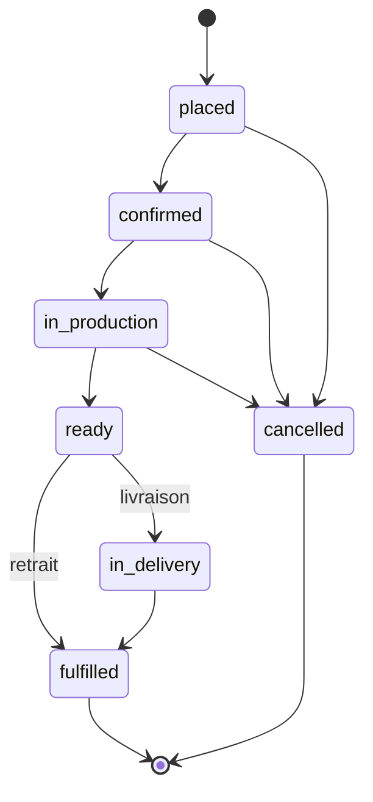
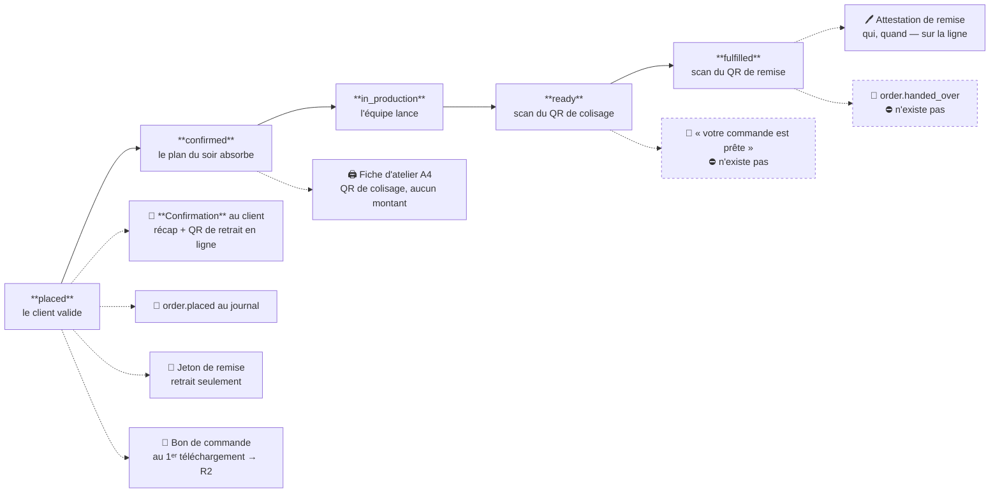

# Le cycle de vie d'une commande — états, transitions, et qui les écrit

**État : 🟡 partiellement livré (2026-09-07).** Ce document tranche l'énuméré et
les droits d'écriture.

**Ce qui existe désormais**, et qui périme le constat ci-dessous :

- **`ready` est dans l'énuméré et s'écrit.** L'atelier le pose en scannant le QR
  de colisage de sa fiche — le geste qu'il faisait déjà au stylo, sans
  contrepartie en base. Route `POST /admin/production/packing/:reference/ready`,
  règle pure dans `packing.ts`, écriture conditionnée en base.
- **`fulfilled` s'écrivait déjà**, au scan du QR de remise du client.
- **La frise n'est plus muette sur ces deux-là.** « Prête au retrait » y était
  affichée SANS rang — « on montre le chemin sans savoir où on en est dessus » —
  et elle est suivie ; la livraison a gagné sa jumelle « Prête au départ ».

**Ce qui reste doc-first** : `confirmed` (automatique, quand le plan du soir
absorbe la commande), `in_delivery`, la chute de `draft`, et la notification
« votre commande est prête ».

---

## Le constat d'origine, vérifié dans le code — ⚠️ périmé sur deux lignes

**Photo du jour où ce document a été écrit.** Elle n'est pas réécrite : ce qu'on
croyait avoir et ce qui manquait explique le reste du document, et l'effacer
rendrait les décisions qui suivent incompréhensibles. Le bandeau ci-dessus dit ce
qui a changé.

| Ce qu'on croit avoir    | Ce qui existe                                                                    |
| ----------------------- | -------------------------------------------------------------------------------- |
| Six états de commande   | Six **valeurs** dans l'énuméré Prisma                                            |
| Une commande qui avance | `status @default(placed)` — et **rien ne l'écrit jamais ensuite**                |
| Un agrégat qui pilote   | `Order` n'expose **aucune** transition : seulement `payByCard` et `deferPayment` |
| `draft`                 | **Jamais produit par aucun chemin**                                              |

~~Une commande naît `placed` et meurt `placed`.~~ Elle passe désormais par
`ready` puis `fulfilled`, tous deux écrits par un scan. `confirmed`, `in_production`,
`fulfilled` sont des valeurs que la base accepte et que personne n'écrit.

Côté client, la frise affiche pourtant cinq étapes. Quatre ne s'allumeront
jamais — et la lib le sait déjà : `order-timeline.ts` marque ces étapes
`tracked: false`. **Le front est honnête, le domaine est vide.**

---

## L'énuméré cible

```
placed → confirmed → in_production → ready → fulfilled
                                       ↘ in_delivery ↗
   (à tout moment avant fulfilled)  → cancelled
```



---

## Ce que chaque étape PRODUIT

Le schéma d'états dit ce qui bouge. Celui-ci dit **ce qui sort** — un courriel,
un papier, un code, une ligne de journal. C'est la lecture qu'on cherche quand
un client demande « je n'ai rien reçu » ou quand on se demande d'où vient un
fichier.



### Le même, en tableau — avec ce qui existe et ce qui n'existe pas

| Étape           | Ce qui sort                          | Pour qui   | État                                                  |
| --------------- | ------------------------------------ | ---------- | ----------------------------------------------------- |
| `placed`        | **📧 courriel de confirmation**      | le client  | ✅ livré le 2026-09-07                                |
| `placed`        | QR de retrait, **dans le courriel**  | le client  | ✅ pièce jointe en ligne (`cid:`)                     |
| `placed`        | jeton de remise                      | — (secret) | ✅ **retrait seulement** — la livraison n'en a pas    |
| `placed`        | `order.placed` au journal            | l'analyse  | ✅                                                    |
| `placed`        | **📄 bon de commande PDF**           | le client  | ✅ au 1ᵉʳ téléchargement, rangé en R2                 |
| `confirmed`     | rien                                 | —          | ⛔ **aucune transition ne l'écrit**                   |
| `in_production` | rien                                 | —          | ⛔ **aucune transition ne l'écrit**                   |
| (à la clôture)  | **🖨️ fiche d'atelier A4**            | le fournil | ✅ tirée à la demande, avec son QR de colisage        |
| `ready`         | attestation de colisage (qui, quand) | l'équipe   | ✅ livré le 2026-09-07                                |
| `ready`         | **📧 « votre commande est prête »**  | le client  | ⛔ **n'existe pas** — c'est le manque le plus visible |
| `fulfilled`     | attestation de remise (qui, quand)   | l'équipe   | ✅ retrait seulement                                  |
| `fulfilled`     | `order.handed_over` au journal       | la preuve  | ⛔ **n'existe pas** — cf. l'audit, T4                 |
| `cancelled`     | rien                                 | —          | ⛔ aucune transition, aucun courriel                  |

### Trois choses que ce tableau met en évidence

**Un seul courriel part, et c'est le premier.** Le client est prévenu que sa
commande est enregistrée, puis plus rien — pas même quand elle est prête, qui
est pourtant le seul moment où il a quelque chose à faire. C'est le manque le
plus visible du parcours, et il est bon marché : l'abonné de `ready` existe déjà
en forme, il n'a pas de gabarit.

**Le QR voyage deux fois, et jamais sur le même papier.** Celui de **retrait**
est un secret : il ne part que dans le courriel, jamais sur un document, parce
qu'un bon de livraison voyage dans le carton — un coursier scannerait son propre
colis. Celui de **colisage** n'encode que le numéro de commande, déjà imprimé en
clair sur la même feuille : il s'imprime sans risque.

**Deux attestations sur trois ne laissent pas de témoin.** Le colisage et la
remise s'écrivent sur la **ligne de commande**, qui s'`UPDATE`. Le journal, lui,
est append-only — et il ne reçoit que la naissance de la commande. Il peut donc
dire « ce client a commandé » et jamais « ce client a reçu ».

---

**Trois changements par rapport à l'énuméré actuel.**

`draft` **disparaît**. Une valeur qu'aucun chemin ne produit est un mensonge dans
un type : elle force chaque lecteur à traiter un cas qui n'arrive pas, et laisse
croire à un brouillon qui n'existe pas. Le panier vit dans le navigateur, pas en
base.

`ready` **apparaît**, et c'est le plus utile des ajouts : c'est l'état où la
production est finie mais la commande n'est pas partie. C'est **le seul moment où
le client a quelque chose à faire** (venir chercher) ou à attendre précisément.
Sans lui, « en préparation » dure jusqu'à la livraison, ce qui n'informe personne.

`in_delivery` **apparaît**, et n'est atteignable que si `fulfillmentMethod =
delivery`. Un retrait ne passe jamais par là : il va de `ready` à `fulfilled`
quand le client repart avec ses cartons. C'est un invariant de l'agrégat, pas une
convention d'écran.

### Ce que l'énuméré ne fait PAS

Il ne décrit **que la production**. Le règlement reste un axe séparé
(`PaymentStatus`), déjà découplé et documenté : une commande peut être `ready` et
impayée, ou `placed` et déjà réglée. Les fusionner produirait une combinatoire de
trente états dont personne ne saurait dessiner la frise.

---

## Qui a le droit d'écrire quoi

C'est la moitié du sujet, et celle qu'on oublie : un énuméré sans droits d'accès
n'est qu'une liste de mots.

| Transition        | Écrite par     | Déclencheur                                  |
| ----------------- | -------------- | -------------------------------------------- |
| → `placed`        | **le client**  | `POST /orders` — existe                      |
| → `confirmed`     | **le système** | la commande entre dans un plan de production |
| → `in_production` | **l'atelier**  | l'équipe lance la fabrication                |
| → `ready`         | **l'atelier**  | la fabrication est finie                     |
| → `in_delivery`   | **l'atelier**  | remise au coursier (livraison seulement)     |
| → `fulfilled`     | **l'atelier**  | remis au client, ou livré                    |
| → `cancelled`     | **le staff**   | décision commerciale                         |

**Le client n'écrit qu'une seule transition** : celle qui crée la commande.
Ensuite il lit. Tout ce qui suit est un fait constaté par ceux qui font le
travail — laisser le client déclarer « je l'ai récupérée » ferait de son confort
une source de vérité comptable.

**`confirmed` est automatique**, pas un clic. Une commande passée avant l'heure
limite est confirmée quand le plan du soir l'absorbe : personne n'a rien décidé,
donc personne ne doit cliquer. Une commande passée **après** l'heure limite est
le seul cas qui demande un humain — et c'est exactement le mécanisme décrit pour
les avenants ([`architecture-commande-immuable-avenants.md`](architecture-commande-immuable-avenants.md)).

**`cancelled` est staff, pas atelier.** Annuler, c'est rembourser, prévenir, et
parfois offrir : une décision commerciale que l'atelier n'a pas à porter.

---

## Deux règles qui protègent l'ensemble

**Les états ne reculent jamais.** Il n'existe aucun chemin de `ready` vers
`in_production`. Une erreur de saisie se corrige par une action _nommée_
(« reprendre la fabrication »), datée et attribuée — pas par un retour en arrière
silencieux qui effacerait le fait qu'on s'est trompé.

**`fulfilled` et `cancelled` sont terminaux.** Après eux, plus rien ne bouge sur
la commande. Ce qui arrive ensuite — un geste commercial, un avoir, un
complément — est un **avenant**, objet distinct avec ses propres règles.

Ces deux règles sont la raison d'être de l'agrégat : elles ne peuvent pas vivre
dans un `UPDATE` de contrôleur.

---

## Ce que ça débloque, dans l'ordre

1. **La frise cliente cesse de mentir** — les cinq étapes s'allument pour de
   bon, et `tracked: false` disparaît de `order-timeline.ts`. C'est ce qui rend
   inutile la coupe prévue pour J1.
2. **L'écran d'atelier a un métier** : trois boutons, un par transition qu'il
   possède. Sans cet énuméré, l'écran n'a rien à écrire.
3. **La notification client** devient possible : « prête au retrait » est un
   e-mail déclenché par une transition, pas par un cron qui devine.
4. **Le suivi de commande entre dans le journal** — le TODO growth note que le
   momentum se calcule aujourd'hui sur `order.placed` seul, faute d'événements de
   cycle de vie.

---

## Ce que ce document ne tranche pas

- **La granularité par ligne.** Une commande partiellement prête (deux articles
  sur cinq) reste `in_production`. Suivre l'avancement ligne par ligne est un
  autre modèle, à ouvrir seulement si l'atelier le réclame.
- **Le retard.** « Aurait dû être prête » est une lecture (date souhaitée vs
  état courant), pas un état. Tant qu'on n'en fait pas une alerte, rien à écrire.
- **Qui est « l'atelier ».** Aujourd'hui n'importe quel compte staff pourra
  écrire ces transitions — cohérent avec la décision « tout le staff est de
  confiance en V1 ». Le jour où l'atelier devient un rôle distinct, ces quatre
  transitions sont exactement le premier périmètre à murer.
- **L'annulation par le client.** Avant `confirmed`, elle serait défendable.
  Elle ouvre la question du remboursement automatique — hors périmètre ici.

---

## Note sur le doc voisin

[`architecture-flux-commande-prod.md`](architecture-flux-commande-prod.md)
décrit encore une topologie à cinq Workers séparés. Elle ne correspond plus à ce
qui est construit : **un seul container** porte la boutique, `/admin` et
demain `/production`, sur une seule base. À reprendre quand l'écran d'atelier
sera écrit — la partie « garde-fous webhook » reste valable.
