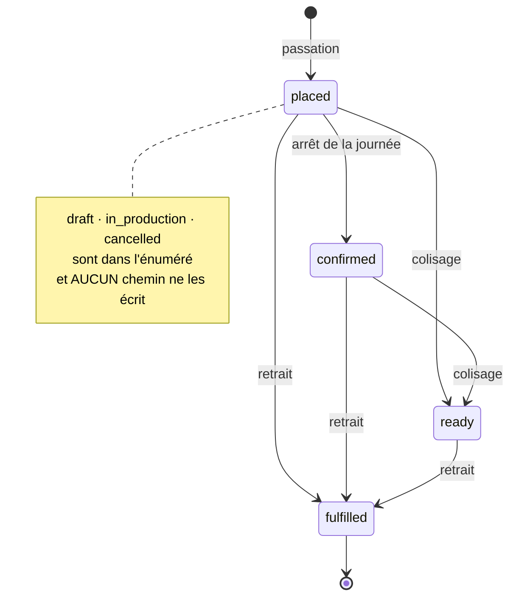
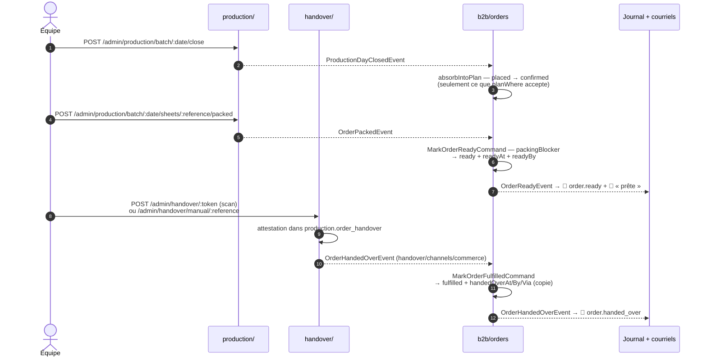
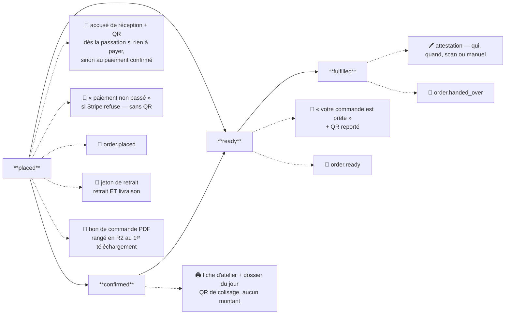
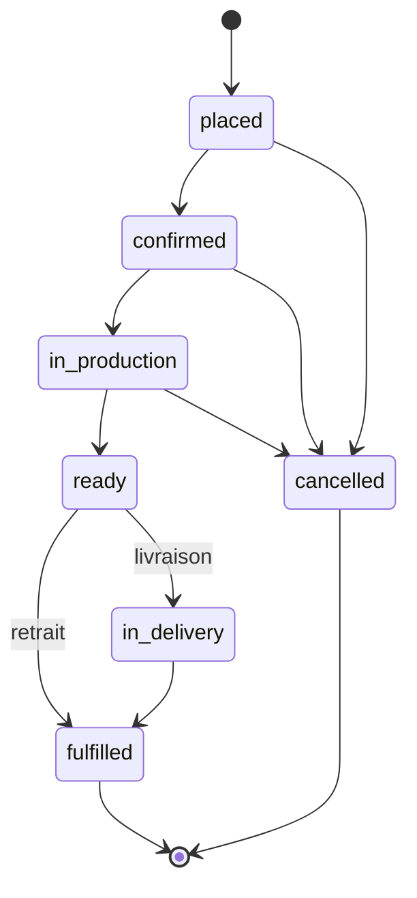

# Le cycle de vie d'une commande — états, transitions, et qui les écrit

**État : 🟡 partiellement livré — relu contre le code le 2026-09-17.** Quatre
états s'écrivent réellement (`placed`, `confirmed`, `ready`, `fulfilled`) ; trois
existent dans l'énuméré sans qu'aucun chemin ne les écrive (`draft`,
`in_production`, `cancelled`) ; un reste à créer (`in_delivery`). Les §1 à §5
décrivent le code, le §6 la cible encore doc-first.

**Portée** : l'axe **fabrication** (`status`). Le règlement (`paymentStatus`)
est un axe indépendant, décrit dans
[`architecture-reglement-et-compte-de-production.md`](architecture-reglement-et-compte-de-production.md) ;
le contenu de chaque colonne, dans
[`architecture-ce-que-porte-la-commande.md`](architecture-ce-que-porte-la-commande.md).

> ⚠️ **Ce document a été réécrit le 2026-09-17**, et ce n'est pas un
> rafraîchissement. La version du 2026-09-07 décrivait un monde où le commerce
> hébergeait le colisage et la remise ; ils vivent depuis dans les blocs
> `production/` et `handover/`, qui **annoncent** un fait que le commerce
> recopie. Elle disait aussi que le courriel « votre commande est prête » et le
> témoin `order.handed_over` n'existaient pas — les deux existent. Ses décisions
> de conception sont conservées au §7.

---

## 1. Ce qui s'écrit vraiment

**Pourquoi autant de flèches.** Le colisage et le retrait sont **volontairement
permissifs sur l'avancement** : ils acceptent tout état sauf `draft`,
`cancelled` et, pour le colisage, `fulfilled`. Exiger `in_production` fermerait
la porte pour de bon — rien n'y mène — et refuser un client physiquement là,
colis prêt, parce qu'un écran n'a pas été cliqué, ferait primer la machine sur
le monde réel (`packingBlocker`, `handoverBlocker`).

Deux conséquences qu'on lit dans ce schéma :

- une commande passée **après** l'arrêt de sa journée n'est dans aucun plan, ne
  sera jamais `confirmed`, et reste pourtant colisable et remettable ;
- un retrait **avant** le colisage est possible, et ferme le colisage ensuite
  (« Cette commande a déjà été retirée »).

## 2. Qui écrit chaque transition

**Le commerce n'écrit plus aucune transition de lui-même après la
passation.** Il réagit à un fait que le fournil ou le comptoir publie,
et passe par sa propre commande applicative, qui garde la règle, arbitre la
course et publie à son tour.

| Transition    | Geste                                     | Route                                                                    | Qui détient le fait                      | Écriture côté commande                       | Condition en base            |
| ------------- | ----------------------------------------- | ------------------------------------------------------------------------ | ---------------------------------------- | -------------------------------------------- | ---------------------------- |
| → `placed`    | le client, l'équipe, ou un visiteur       | `POST /orders` · `POST /admin/orders` · `POST /shop/orders`              | le commerce                              | `PrismaOrderRepository.place()`              | création                     |
| → `confirmed` | **arrêter la journée**                    | `POST /admin/production/batch/:date/close`                               | le fournil (`production_day`)            | `absorbIntoPlan` via `OnProductionDayClosed` | `planWhere()`                |
| → `ready`     | **coliser** (scan du QR de la fiche)      | `POST /admin/production/batch/:date/sheets/:reference/packed`            | le fournil (`production_order`)          | `markReady` via `OnOrderPacked`              | pas annulée/brouillon/remise |
| → `fulfilled` | **remettre** (scan du code, ou à la main) | `POST /admin/handover/:token` · `POST /admin/handover/manual/:reference` | le retrait (`production.order_handover`) | `markFulfilled` via `OnOrderHandedOver`      | `handedOverAt IS NULL`       |

- **Toutes les routes staff portent `@AdminSurface("b2b_orders")`** : tout
  membre du staff qui a ce droit peut arrêter, coliser et remettre. Le retrait
  répond aussi sous l'ancien préfixe `admin/production/handover`, pour ne
  casser aucun écran.
- **`POST /shop/orders` est fermée** tant que l'ouverture de la boutique
  publique n'est pas décidée
  ([`plan-commande-sans-compte.md`](plan-commande-sans-compte.md), §12).
- 🔴 **L'arrêt de la journée n'absorbe pas toutes les `placed`**. Il écarte les
  règlements refusés et le visiteur dont la carte est encore en vol : c'est la
  règle du compte de production, pas celle de l'énuméré.
- **L'arrêt est rejouable, et c'est le rattrapage prévu.** Une seconde clôture
  ne recalcule rien côté fournil mais republie le fait ; le commerce ne trouve
  plus de `placed` absorbable et n'écrit rien. La réponse dit laquelle des deux
  choses vient d'arriver (`alreadyClosed`), et `GET …/batch/:date/status`
  expose les commandes restées en retard (`pendingInCommerce`).
- ⚠️ **Le bus vit en processus.** Si l'abonné du commerce échoue, le fournil a
  basculé et la commande non. C'est ce que `pendingInCommerce` rend visible.

## 3. Ce que chaque étape produit

| Étape       | Ce qui sort                                            | Pour qui   | Où                                                                                                    |
| ----------- | ------------------------------------------------------ | ---------- | ----------------------------------------------------------------------------------------------------- |
| `placed`    | 📧 accusé de réception, QR en ligne                    | le client  | `send-order-placed-mail` / `send-order-settled-mail` — **attend le paiement** carte                   |
| `placed`    | 📧 « votre paiement n'est pas passé »                  | le client  | `send-payment-failed-mail`                                                                            |
| `placed`    | jeton de retrait                                       | — (secret) | à l'écriture, **pour les deux acheminements**                                                         |
| `placed`    | 📓 `order.placed`                                      | l'analyse  | `growth/on-order-placed`                                                                              |
| `placed`    | 📄 bon de commande PDF                                 | le client  | `GET /orders/:id/bon.pdf`, archivé en R2 (`OrderSheetArchive`)                                        |
| `confirmed` | 🖨️ fiche d'atelier, compte à produire, dossier du jour | le fournil | fiche et compte en PDF (`GET /admin/production/batch/:date/…pdf`), dossier imprimé par le back-office |
| `ready`     | 📧 « votre commande est prête », QR reporté            | le client  | `send-order-ready-mail` ; renvoyable par `POST /admin/orders/:id/rappel-retrait`                      |
| `ready`     | 📓 `order.ready`                                       | la preuve  | `growth/on-order-ready`                                                                               |
| `fulfilled` | attestation de retrait                                 | l'équipe   | `production.order_handover` — la **source** ; la commande n'en garde qu'une copie                     |
| `fulfilled` | 📓 `order.handed_over`, avec `via`                     | la preuve  | `growth/on-order-handed-over`                                                                         |
| `cancelled` | rien                                                   | —          | ⛔ aucune transition                                                                                  |

**Le QR voyage deux fois, et jamais sur le même papier.** Celui de **retrait**
est un secret : il ne part que dans un courriel, jamais sur un document — un bon
voyage dans le carton, et un coursier scannerait son propre colis. Celui de
**colisage** n'encode que le numéro de commande, déjà imprimé en clair sur la
même feuille : il s'imprime sans risque.

**Le second courriel est celui qui sert.** « Prête » est le seul moment où le
client a quelque chose à **faire**. Le QR y est reporté parce que personne ne
remonte un fil de courriels, téléphone en main, devant un comptoir.

**Les témoins du journal sont idempotents par commande** (`order.handed_over:<id>`)
et tournent hors de la requête : un fait rejoué n'en fabrique pas un second, et
une panne du journal ne bloque pas le comptoir.

## 4. Les règles tenues par le code

- **Les états ne reculent jamais.** Aucun chemin ne ramène `ready` vers
  `confirmed`, ni `fulfilled` vers `ready`. Une commande remise ne peut plus
  être colisée.
- **Chaque transition est une écriture conditionnée** (`updateMany` + `where`) :
  deux comptoirs qui scannent en même temps, un abonné rappelé, une clôture
  rejouée — la base tranche, une seule écriture gagne.
- **L'instant vient du fait, pas de l'horloge du commerce.** `readyAt` est
  l'heure du colisage au fournil, `handedOverAt` celle du retrait.
- **`confirmedAt` n'a pas d'auteur**, `readyBy` et `handedOverBy` en ont un —
  le `sub` staff, figé. Une journée qui bascule n'est pas un acte constaté ; un
  colisage et une remise le sont.
- **« Reprendre la fabrication » existe, mais au fournil** :
  `POST /admin/production/worksheet/:date/retake` agit sur la fiche de travail,
  pas sur le statut de la commande.
- 🔴 **`fulfilled` n'est pas terminal PAR LE CODE.** Rien dans l'agrégat
  `Order` ne l'interdit ; c'est l'absence de toute transition sortante qui le
  rend terminal aujourd'hui. Le jour où une annulation existera, elle devra le
  refuser explicitement.

## 5. Ce que le client en voit — la frise

`packages/b2b-ui/src/order/order-timeline.ts` dérive la frise de `status` et de
`paymentStatus`.

| Jalon affiché                      | Rang | Allumé quand                                                         |
| ---------------------------------- | ---- | -------------------------------------------------------------------- |
| Commande reçue                     | 1    | `placed`                                                             |
| Confirmée                          | 2    | `confirmed`                                                          |
| En préparation                     | 3    | ⚠️ `in_production` — jamais courant, il passe à « fait » au colisage |
| Prête au retrait · Prête au départ | 4    | `ready`                                                              |
| Confiée au coursier · En livraison | —    | **non suivis** : allumés seulement à la remise                       |
| Retirée · Livrée                   | 5    | `fulfilled`                                                          |
| Commande annulée                   | —    | `cancelled` — jamais atteint aujourd'hui                             |

🔴 **Écart avec le serveur (constaté le 2026-09-17).** La frise considère qu'un
règlement `pending` **bloque** la production, pour tout le monde
(`blocksProduction`). Le compte de production, lui, fabrique un **pro** dont le
paiement est encore en vol. Un pro qui paie par carte voit donc une frise
arrêtée sur une commande que le fournil prépare. À trancher : aligner la frise
sur la clientèle, ou l'assumer le temps d'un webhook.

## 6. La cible — ce qui reste doc-first

| Changement             | Ce qu'il demande                                                                                                                        | État                                                                                                                |
| ---------------------- | --------------------------------------------------------------------------------------------------------------------------------------- | ------------------------------------------------------------------------------------------------------------------- |
| `in_production` écrit  | un geste « je lance » — que l'atelier ne fait pas avant de pétrir                                                                       | ⛔ ; la frise et la permissivité du colisage vivent sans                                                            |
| `in_delivery` ajouté   | une valeur d'énuméré (migration additive) et le geste « remis au coursier », livraison seulement                                        | ⛔                                                                                                                  |
| `cancelled` écrit      | une transition **staff**, qui se propage au fournil — sinon il colise pour rien                                                         | ⛔ — et l'expiration des impayés en a besoin ([règlement, §4.1](architecture-reglement-et-compte-de-production.md)) |
| `draft` retiré         | retirer une valeur d'énuméré : migration en trois temps, et les lecteurs qui la testent (`packingBlocker`, `handoverBlocker`, la frise) | ⛔ — le brouillon vit dans `order_drafts`, le panier dans `shop_carts`                                              |
| terminal par l'agrégat | `fulfilled` et `cancelled` refusés comme point de départ, dans une méthode de l'agrégat                                                 | ⛔                                                                                                                  |

## 7. Les décisions de conception, conservées

**Le client n'écrit qu'une transition** : celle qui crée la commande. Tout ce
qui suit est un fait constaté par ceux qui font le travail — laisser le client
déclarer « je l'ai récupérée » ferait de son confort une source de vérité
comptable.

**`confirmed` est une journée qui bascule, pas une décision par commande.**
L'API n'a aucun planificateur, et une lecture n'écrit jamais : le geste retenu
est celui que l'équipe faisait déjà — arrêter de prendre pour le lendemain. D'où
`confirmed_at` sans `confirmed_by`.

**`cancelled` sera staff, pas atelier.** Annuler, c'est rembourser, prévenir, et
parfois offrir : une décision commerciale.

**L'énuméré ne décrit que la fabrication.** Fusionner le règlement produirait
une trentaine d'états que personne ne saurait dessiner.

**Ce qui bouge après une commande passée est un avenant**
([`architecture-commande-immuable-avenants.md`](architecture-commande-immuable-avenants.md)),
pas un retour en arrière du statut.

## 8. Ce que ce document ne tranche pas

- **La granularité par ligne.** Deux articles prêts sur cinq ne font pas une
  commande prête. Suivre ligne par ligne est un autre modèle — le fournil a
  déjà ses coches par ligne sur la fiche de travail, le commerce non.
- **Le retard.** « Aurait dû être prête » est une lecture, pas un état.
- **Qui est « l'atelier ».** Aujourd'hui, le droit `b2b_orders` suffit pour
  arrêter, coliser et remettre. Le jour où l'atelier devient un rôle, ces trois
  routes sont le premier périmètre à murer.
- **L'annulation par le client.** Avant `confirmed` elle serait défendable, et
  elle ouvre le remboursement automatique.

## 9. Documents voisins périmés (constaté le 2026-09-17)

- [`../production/architecture-contexte-production.md`](../production/architecture-contexte-production.md)
  s'ouvre sur « ⛔ non implémenté » et « `src/` ne porte pas de dossier
  `production` ». Le bloc et le schéma `production` existent.
- [`architecture-flux-commande-prod.md`](architecture-flux-commande-prod.md)
  décrit une topologie à cinq Workers ; un seul container porte l'API.
