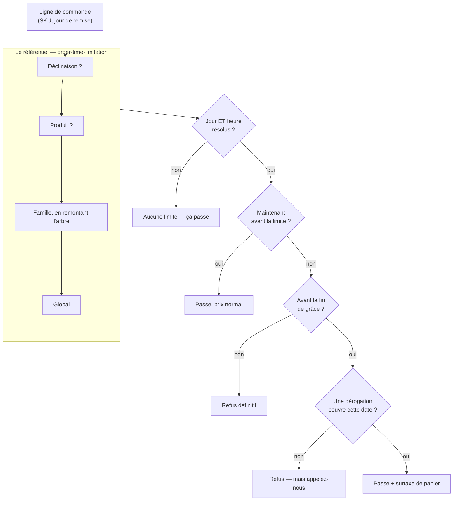

# L'heure limite de commande, la grâce, et la surtaxe de retard

> Écrit le 2026-09-04. Décrit **ce qui existe** (§1) et **ce qui est proposé**
> (§3 et suivantes).
>
> ✅ **Lots 0 à 6 livrés le 2026-09-04.** Le fuseau est explicite, la règle est
> opposée à **tout le monde** — l'exemption du back-office est tombée —, le
> rattrapage existe et la **dérogation** l'ouvre, le contexte
> `order-time-limitation` porte l'échelle avec son héritage champ par champ, le
> fil les raccorde, et l'écran existe.
>
> ✅ **Le lot 7 est livré en entier** : la surtaxe se règle depuis « Réglages →
> Surtaxe de retard », se facture, se taxe au taux choisi, se fige sur la
> commande — et s'y **lit**, avec son ajustement et son taux, sur la même page
> côté client et côté comptoir. Restent la boutique (8) et le démontage de
> l'ancienne règle (9).

## En bref

**Le problème.** Un client ne peut pas commander du pain pour demain à 23 h ce
soir. Il faut une heure limite, réglable globalement puis nuançable par famille
et par produit.

**La surprise.** Cette heure limite **existait déjà** : une table, un écran de
réglages, des tests. Mais **rien ne la faisait respecter** — le code qui décide
« trop tard » n'était appelé nulle part. On pouvait remplir cet écran et croire
que ça bloquait. ✅ **C'est branché depuis le 2026-09-04** : une commande client
arrivée trop tard est refusée, et rien n'est écrit (§1).

**Une seule échelle, dans le référentiel** (§5) :

```
déclinaison → produit → famille (en remontant l'arbre) → global
```

| Rang                          | Ce qu'il dit                                        |
| ----------------------------- | --------------------------------------------------- |
| **global**                    | on ferme toute la production à telle heure          |
| **famille**                   | la viennoiserie et le pain n'ont pas la même charge |
| **produit** / **déclinaison** | le cas particulier, jusqu'au conditionnement        |

🔴 **L'héritage se fait champ par champ.** « Le pain ferme à 16 h » ne recopie pas
le nombre de jours ; « l'entremets demande un jour de plus » ne recopie pas
l'heure. Le jour où le labo passe de 18 h à 16 h, tout ce qui n'a pas d'heure
propre suit — alors qu'une règle recopiée entière serait restée figée, en
silence, sur chaque article qui l'avait dupliquée.

Le point de retrait et la livraison n'y entrent pas : un point de retrait n'est
ni un lieu de production ni un lieu de livraison, et l'ancien modèle qui s'y
accrochait ne pouvait donner **aucune** limite propre aux commandes livrées.

**Trois situations, pas deux** (§4) :

| Quand                      | Ce qui se passe                                            |
| -------------------------- | ---------------------------------------------------------- |
| avant l'heure limite       | ça passe, prix normal                                      |
| juste après — la **grâce** | ça passe **si** quelqu'un l'autorise, **et** c'est surtaxé |
| après la grâce             | c'est non, et personne ne peut ouvrir                      |

La grâce est une durée qu'on règle ; la **dérogation** est le geste du commercial
au téléphone (§7) ; la **surtaxe** est ce que ça coûte, et elle s'ajoute au panier
comme des frais de livraison — **jamais au prix de l'article** (§8).

⚠️ **Aujourd'hui la grâce ne laisse encore passer personne.** Elle est réglable
et opposée, mais dans sa fenêtre le client est refusé par une **autre erreur**
(`orders.cutoff.grace`), celle qui invite à appeler — au lieu du refus sec
(`orders.cutoff.past`), qui ne renvoie vers rien. Elle deviendra un passage au
lot 3, pour qui l'accorde.

**Qui règle quoi** (§3) :

- **le PIM** : une seule chose — les jours de fabrication d'une famille, d'un
  produit, d'une déclinaison ;
- **les réglages B2B** : tout le reste — les heures, les exceptions par comptoir
  et par jour, la grâce, et le montant de la surtaxe avec son taux de TVA ;
- **la commande** : ce qui a été décidé ce jour-là, figé. Changer le tarif demain
  ne réécrit pas ce qui est parti.

**Deux choses à savoir avant de coder :**

- ✅ le calcul lisait l'heure locale du **serveur**, qui tourne en UTC : « 18 h »
  y valait 20 h à Paris en été. Corrigé — la conversion passe explicitement par
  `Europe/Paris`, et les tests des contrats tournent en UTC pour que la panne se
  reproduise ici plutôt qu'en production (§10) ;
- ✅ le **taux de TVA de la surtaxe** était la seule question du dossier qui
  coûte rétroactivement. Elle est tranchée en la sortant du code : le taux est un
  **réglage** pointant un taux existant du référentiel, **sans défaut** — une
  surtaxe sans taux lève plutôt que d'en inventer un (§8).

**Et ce que la limite ne dit pas :** aucune capacité maximale n'existe. Elle
répond « trop tard », **jamais « complet »** — une commande acceptée n'est pas
une commande dont la production est garantie faisable (§5).

**L'ordre des travaux** (§12) : les lots 0 à 7 sont **faits** — le fuseau, la
règle appliquée, la grâce, l'échelle du référentiel, son écran, le fil, la
dérogation, la surtaxe et son réglage. Restent l'affichage de la surtaxe sur la
commande, la boutique et le démontage de l'ancienne règle.

---

## 1. Ce qui existait déjà — et que rien n'appliquait

L'heure limite n'est pas à inventer. Elle est **modélisée, contractualisée,
testée et administrable** depuis le back-office :

| Pièce                                                             | État                                                        |
| ----------------------------------------------------------------- | ----------------------------------------------------------- |
| `model OrderCutoff` (`public/orders.prisma:250`, schéma `public`) | table `order_cutoffs`                                       |
| `packages/contracts/src/order-cutoff.ts`                          | payload Zod, vue, et **deux fonctions pures** de résolution |
| `packages/contracts/src/__tests__/order-cutoff.spec.ts`           | 12 tests                                                    |
| `GET/POST/PATCH/DELETE /admin/order-cutoffs`                      | muré `@AdminSurface("b2b_settings")`                        |
| `reglages/retraits-livraisons/cutoffs-section/`                   | l'écran de saisie                                           |

Une règle dit : « pour tel **point de retrait**, tel **jour d'acheminement**, il
faut avoir commandé `daysBefore` jours avant à telle **heure locale** ».
`resolveOrderCutoff` arbitre en quatre rangs — point+jour, point, défaut+jour,
défaut — et `orderCutoffInstant` en tire l'instant butoir.

### 🔴 Personne ne l'appliquait — corrigé le 2026-09-04

`resolveOrderCutoff` et `orderCutoffInstant` n'étaient appelés **nulle part** hors
de leur propre spec. Vérifié sur `apps/lfd-api/src`, `apps/lfd-api/test`,
`packages/*/src` et les deux fronts, hors client Prisma généré.

`PlaceOrderHandler` ne vérifiait qu'une chose avant de passer commande :
l'appartenance à l'entreprise. Aucune garde temporelle, ni dans le handler, ni
dans `OrderDrafting`, ni sur le devis.

**Ce que ça a changé pour cette demande.** Le travail n'était pas « ajouter une
heure limite » : c'était **la brancher**, et profiter du branchement pour lui
donner l'axe qui lui manque. Un écran de réglages qui ne refuse rien est pire
qu'une absence de règle — quelqu'un le remplit et croit la limite tenue.

**Depuis, la garde existe** : `ensureWithinOrderCutoff`
(`src/b2b/orders/domain/services/order-cutoff-guard.ts`), appelée par
`OrderDrafting` après la résolution de l'acheminement, sur les deux portes
d'entrée. Elle refuse en **409 `orders.cutoff.past`** et n'écrit rien.

⚠️ Le constat reste écrit plutôt qu'effacé : il dit pourquoi le lot 1 passait
avant tout le reste, et c'est la seule chose que le code ne raconte pas.

## 2. L'échelle demandée est déjà écrite ailleurs

`global → famille → produit` existe mot pour mot dans le dépôt, du côté des prix
(`packages/contracts/src/pricing.ts:83`) :

```ts
export const PRICE_SCOPE_LABELS: Readonly<Record<PriceScopeType, string>> = {
  global: "Tout le catalogue",
  category: "Famille",
  product: "Produit",
  variant: "Déclinaison",
};
```

**On réutilise `priceScopeSchema`, on n'invente pas un second vocabulaire de
portée.** Deux échelles nommées différemment pour la même idée finiraient par
diverger, et le back-office montrerait « Famille » d'un côté et « Catégorie » de
l'autre pour la même chose.

Elle apporte un quatrième rang que la demande ne nommait pas et qui est le plus
utile : **la déclinaison**. C'est elle qu'on commande — une `OrderLine` porte un
SKU, et un SKU est une déclinaison. Un produit dont le pot de 200 g se prépare la
veille et le seau de 5 kg trois jours avant n'a pas d'heure limite « du produit ».

## 3. La frontière, en une phrase

> **Le référentiel déclare JUSQU'À QUAND on prend commande.
> La plateforme l'applique.
> La commande fige ce qui a été convenu.**

| Ce qu'on règle                                                              | Où                                        |
| --------------------------------------------------------------------------- | ----------------------------------------- |
| Toute l'échelle — global, famille, produit, déclinaison                     | **PIM**, contexte `order-time-limitation` |
| L'**application** : refuser, distinguer la grâce, nommer le geste de sortie | **B2B**, à la passation                   |
| La **dérogation accordée**, la **surtaxe appliquée**                        | **figées sur la commande**                |

### ⚠️ Deux renversements assumés, et leurs raisons

Ce document a affirmé deux fois le contraire. Les deux inversions sont écrites
plutôt qu'effacées : une consigne qui change sans dire pourquoi se refait dans
l'autre sens six mois plus tard.

**1. « Le défaut reste au B2B » (2026-09-04, matin).** L'argument était que les
quatre rangs de l'heure limite formaient une seule échelle, réglée par une seule
personne, et que la couper en deux applications coûtait un aller-retour. Il était
juste **pour l'échelle d'alors** — celle dimensionnée par point de retrait. Il
tombe avec elle.

**2. « L'axe point de retrait × jour » lui-même.** Un `PickupAddress` n'est ni un
lieu de production ni un lieu de livraison : c'est l'endroit où un client vient
chercher. La conséquence se voyait dans le code — une commande **livrée** ne
pouvait matcher aucune règle de point (`packages/contracts/src/order-cutoff.ts`),
donc toute la moitié livrée du commerce n'avait qu'une seule limite possible.

Ce qui fait varier une limite, c'est **ce qu'on produit** : la viennoiserie et le
pain n'ont pas la même charge, un entremets à inserts gelés démarre la veille du
montage. D'où une échelle de catalogue, et un contexte à elle.

### Pourquoi un contexte à part, et pourquoi dans le PIM

`order-time-limitation` n'est ni un coin du catalogue ni un réglage de
plateforme. Ce qu'il porte n'est pas une propriété de la fiche — un préavis n'est
pas un ingrédient — et n'appartient pas au commerce, qui ne fait que l'appliquer.
C'est une **contrainte de production**.

Il vit dans le référentiel pour une raison assumée, et non pour une raison
théorique : la contrainte est de production, mais le référentiel est le seul
endroit où « toute la production », « la viennoiserie » et « cet entremets » se
nomment déjà, avec leur arbre. La reconstruire ailleurs aurait demandé de
dupliquer cet arbre — et deux arbres d'une même hiérarchie finissent par se
contredire.

### 🔴 Ce qui a fait durer l'erreur : la place de l'écran

L'ancienne règle se réglait dans **Réglages → Retraits & livraisons**, entre les
points de retrait et les zones. Cette place-là n'était pas neutre : elle
**affirmait** que l'heure limite est une affaire d'acheminement. Tout le monde
l'a lue ainsi, moi compris, et j'ai passé deux tours à défendre une échelle
dimensionnée par point de retrait — en argumentant depuis la cohérence de la
page, c'est-à-dire depuis la conséquence d'une erreur pour justifier l'erreur.

**L'emplacement d'un écran est une affirmation sur le modèle.** Mal placé, il
enseigne le mauvais modèle à chaque personne qui l'ouvre, y compris à celles qui
écrivent le code — et il le fait sans jamais rien affirmer par écrit, donc sans
que rien puisse le contredire.

Conséquence pour le lot 4 : le réglage prend **sa propre entrée**, pas une
section dans une page existante. « Jusqu'à quand on prend commande » est un sujet
en soi, à côté de la TVA, des allergènes et des conditionnements — pas un
sous-titre sous les zones de livraison. Le ranger « près de » quelque chose
serait refaire la même faute avec un autre voisin.

### Le jour de la semaine : abandonné, et documenté

L'ancien modèle permettait « le samedi, ce n'est pas la même heure ». C'est un
argument de charge, donc légitime — et il n'est **pas** repris.

La raison est de coût : ajouter le jour ferait un produit cartésien avec les
quatre rangs de portée, et la résolution passerait de quatre à huit chemins,
chacun à tester et à expliquer à qui remplit l'écran. Tant que personne n'a
demandé une limite propre au samedi, c'est de la complexité payée d'avance.

**C'est rajoutable sans rien casser** : une colonne nullable de plus et un rang
dans l'ordre de résolution. La décision est notée ici pour qu'on la retrouve — et
pour qu'on ne la reprenne pas en croyant réparer un oubli.

## 4. Trois états, pas deux

La limite n'est pas un instant, c'en sont **deux** : la limite, et la fin de
grâce. Ce qui donne trois états, et non un binaire passe/refuse.

| Quand                              | Ce qui se passe                       | Qui intervient          |
| ---------------------------------- | ------------------------------------- | ----------------------- |
| avant la limite                    | passe, prix normal                    | personne                |
| entre la limite et la fin de grâce | passe **si** autorisé, **et** surtaxé | un humain, au téléphone |
| après la grâce                     | refus                                 | personne ne peut ouvrir |

🔴 **Après la grâce, aucune dérogation n'ouvre.** Sinon la grâce n'est qu'un
affichage, et la vraie limite devient « quand le commercial a envie ». C'est une
borne dure, pas un défaut surchargeable.

**Les deux bornes sont incluses** : à la seconde de la limite on est encore
`open`, à la seconde de la fin de grâce encore `grace`. Une limite affichée
« 18 h » doit accepter 18 h 00 min 00 s — c'est ce que lit celui qui commande, et
l'exclure ferait refuser quelqu'un qui a cliqué à l'heure dite.

✅ **Livré le 2026-09-04** : `decideOrderCutoff` (contrat) → `ensureWithinOrderCutoff`
(garde). **Deux erreurs distinctes** plutôt qu'un drapeau, parce que ce qui les
sépare n'est pas un détail d'affichage mais **ce que le lecteur doit faire** :
changer de date, ou décrocher.

✅ **Depuis le lot 6, la grâce s'ouvre** — pour qui détient une dérogation, et
pour personne d'autre.

## 5. L'échelle, et l'héritage champ par champ

Une seule échelle, celle du catalogue, la même que celle des prix
(`PriceScopeType`) — deux vocabulaires de portée pour la même idée finiraient par
diverger, et le back-office montrerait « Famille » d'un côté et « Catégorie » de
l'autre.

```
déclinaison → produit → famille la plus proche → … → racine → global
```

| Rang            | Ce qu'il dit                                                                             |
| --------------- | ---------------------------------------------------------------------------------------- |
| **global**      | on ferme toute la production à telle heure                                               |
| **famille**     | la viennoiserie et le pain n'ont pas la même charge                                      |
| **produit**     | le cas particulier                                                                       |
| **déclinaison** | jusqu'au conditionnement — le pot de 200 g et le seau de 5 kg ne se préparent pas pareil |

### 🔴 L'héritage se fait CHAMP PAR CHAMP

C'est la décision qui fait tenir le reste. Chaque champ — `daysBefore`, `time`,
`graceMinutes` — prend la **première valeur non nulle** en descendant l'échelle.
Un rang pose ce qu'il change, et hérite du reste.

| Ce qu'on veut dire                      | Ce qu'on écrit                                       |
| --------------------------------------- | ---------------------------------------------------- |
| « le pain ferme à 16 h »                | une heure sur la famille, **pas** le nombre de jours |
| « l'entremets demande un jour de plus » | des jours sur le produit, **pas** l'heure            |
| « les entremets ne se rattrapent pas »  | `graceMinutes: 0` sur le produit, rien d'autre       |

L'alternative — un rang qui se prononce l'emporte **entièrement** — aurait obligé
chaque article à recopier l'heure du labo pour changer d'un seul jour. Le jour où
cette heure passe de 18 h à 16 h, **chaque copie serait restée figée, en
silence**. C'est la même faute que celle corrigée en §3, à un rang près.

### `null` ne veut pas dire « aucune limite »

Il veut dire **« ce rang ne se prononce pas »**. Confondre les deux empêcherait
de déclarer une famille explicitement libre sous un global contraignant.

Corollaire : une règle dont les trois valeurs sont nulles est **refusée**. Une
ligne muette se lirait, à l'écran, comme « une règle existe ici » alors qu'elle
laisserait tout hériter. Pour ne rien dire, on **supprime** la règle — c'est le
même geste, et il est lisible.

### Ce qui rend « aucune limite »

Une limite n'existe que si **le jour et l'heure** sont tous deux résolus.
Inventer un défaut (« la veille à 18 h ») ferait refuser des commandes au nom
d'une règle que personne n'a écrite. Le rattrapage, lui, a un défaut honnête :
non déclaré = limite ferme = `0`. C'est la seule des trois valeurs dont l'absence
a un sens univoque.



### La limite dit « trop tard », jamais « complet »

Aucune **capacité maximale** n'est écrite nulle part dans le dépôt, et il n'est
pas prévu d'en écrire une ici : le volume se régule au jugement.

Il faut donc que le refus le dise. « Trop tard pour jeudi » et « jeudi est
plein » sont deux phrases différentes, et une commande **acceptée** par l'heure
limite n'est pas une commande dont la production est garantie faisable.

C'est aussi pourquoi la **dérogation** (§7) reste un geste humain : la personne
qui l'accorde est celle qui sait s'il reste de la place. Automatiser l'ouverture
supposerait une capacité écrite, qui n'existe pas.

## 6. ✅ Ce qui traverse le fil — livré le 2026-09-04

Le référentiel **résout**, la plateforme **applique**. Ce qui voyage est donc la
limite résolue d'une déclinaison, jamais l'échelle.

`syncVariantSchema` porte `orderTimeLimit` et le fil passe en **version 6** :

```ts
orderTimeLimit: z
  .object({ daysBefore, time, graceMinutes })
  .nullable(),
```

Trois exigences, chacune pour une raison :

- **Le PIM envoie la valeur RÉSOLUE**, pas les rangs. La plateforme n'a pas à
  connaître l'arbre des familles pour savoir quand un SKU ferme — même
  raisonnement que `vatRatePercent` : un article se vend seul, il doit pouvoir
  dire seul quand il ferme.
- **`null` = aucune limite**, et c'est net : le référentiel a regardé et n'a rien
  trouvé.
- **Les trois valeurs vont ensemble ou pas du tout.** Une limite sans heure ne se
  compare à rien ; un rattrapage sans limite n'a rien à rattraper. L'héritage
  champ par champ a fait son travail avant le fil : ce qui en sort est complet ou
  absent, et les deux lectures du miroir (`prisma-catalog-item`,
  `prisma-catalog.reader`) refusent de recoller un objet partiel.

### 🔴 Ce que la montée de version a failli casser

Une arrivée attend dans l'**inbox de revue** qu'un humain la valide, stockée en
`jsonb`. Cette attente **traverse les déploiements** : une livraison mise en file
un mardi peut être relue le jeudi, sur un code qui a changé entre-temps.

Le dépôt revalidait ce `jsonb` avec le **schéma du fil**. Un champ ajouté rendait
donc illisible toute arrivée en attente — sans rien casser visiblement au moment
du déploiement, et donc sans que personne ne relie la cause à l'effet. Constaté
en écrivant ce lot, par une suite e2e qui a rougi.

Le correctif sépare les deux schémas, et la séparation vaut d'être nommée :

|                               | Ce qu'il garantit                                                                           |
| ----------------------------- | ------------------------------------------------------------------------------------------- |
| `catalogSnapshotSchema`       | ce qu'un **émetteur doit produire** — strict, version courante, champs requis               |
| `storedCatalogSnapshotSchema` | ce qu'un **stockage peut rendre** — versions connues, champs récents éventuellement absents |

Deux assouplissements, et deux seulement : la version est acceptée si elle est
**connue** (jamais « quelconque » — le but est de relire le passé, pas de deviner
l'avenir), et un champ ajouté après coup prend la valeur qui décrit le mieux son
absence. Le schéma du fil, lui, reste strict : un émetteur qui oublie un champ
doit échouer à l'émission, pas produire une arrivée dégradée.

### Ce que la garde en fait

Chaque ligne du panier oppose **sa** limite si l'article en porte une, et retombe
sur la règle du commerce sinon. La décision retenue est la **plus fermée** des
lignes.

🔴 **L'article REMPLACE la règle du commerce, il ne la resserre pas.** Prendre le
plus contraignant des deux aurait rendu impossible de déclarer un article
commandable plus tard que le reste — c'est-à-dire l'usage même du rang `produit`.

Un panier ne se découpe pas : accepter les lignes ouvertes et refuser les autres
demanderait de savoir quoi faire d'une commande amputée, et personne ne l'a
décidé. C'est au lot 8 de le dire ligne par ligne **avant** la validation.

## 7. ✅ La dérogation — livrée le 2026-09-04

Une dérogation n'est **pas** une règle. Elle ne modifie rien dans le référentiel
ni dans les réglages : c'est une **autorisation de passer**, nommée, datée,
bornée et tracée, qui vise **un client** et **une journée d'acheminement**.

### Ce qu'elle porte, et pourquoi chacun compte

|                                |                                                                                                                     |
| ------------------------------ | ------------------------------------------------------------------------------------------------------------------- |
| une **entreprise**             | c'est le mur : une exception accordée par téléphone n'ouvre pas la porte aux autres                                 |
| une **journée d'acheminement** | pas « ce client est dispensé » — une dispense permanente est un réglage, et doit se voir comme tel                  |
| un **motif**, obligatoire      | une exception sans raison écrite devient la règle en trois mois, et personne ne sait dire quand ça a basculé        |
| son **auteur**                 | un `StaffUser.id`, pas une clé étrangère : une décision ne disparaît pas parce qu'on retire quelqu'un de l'annuaire |

### 🔴 Ce qu'elle ne porte pas, et c'est là que tient la garantie

**Ni heure, ni instant d'expiration.** Sa borne est la **grâce**, et la garde ne
la consulte que dans cet état : une dérogation ne peut donc **jamais** ouvrir une
journée close, quoi qu'elle contienne. La borne n'est pas vérifiée, elle est
**inexprimable** — il n'existe pas de branche qui pourrait la franchir.

Une heure propre aurait créé un second moyen de dire la même chose, et le second
aurait fini par dépasser le premier. Un instant d'expiration aurait dû approximer
une fin de grâce qui n'existe pas : depuis que chaque article porte sa limite, un
panier en a autant que de lignes. Une approximation dans un mécanisme d'exception
finit toujours par devenir la règle.

### Elle est consommée, pas supprimée

`usedByOrderId` est renseigné **après** la persistance de la commande. Avant, on
brûlerait l'autorisation d'une commande qui échoue ensuite, et le client devrait
rappeler pour obtenir une seconde fois ce qu'il avait déjà.

**Une décision, une commande** : l'index partiel `order_cutoff_waiver_one_open`
n'autorise qu'une autorisation **ouverte** par client et par jour, et une
consommée ne rouvre rien. Sans cela, une seule décision couvrirait toute la
journée d'un client — ce qui est une dispense, pas une exception.

Une dérogation consommée ne se **retire** pas non plus : elle atteste ce qui
s'est passé, et une commande passée ne se dépasse pas. Le refus vient de la
requête (`where usedByOrderId: null`), pas d'un test qu'un second chemin
d'écriture pourrait oublier.

### ⚠️ L'exemption du back-office est tombée

Elle a existé faute de mécanisme : l'équipe au téléphone était l'autorité qui
déroge, **sans motif, sans auteur et sans trace** — rien ne distinguait une
décision d'un oubli. Elle passe désormais par une dérogation comme tout le monde.

Ce que ça change au-delà de la trace : la dérogation étant un objet, elle
s'accorde **avant** la commande. Le commercial décroche, décide — et le **client
peut finir sa commande lui-même**. C'était impossible avec une exemption, qui ne
valait que pour qui saisissait.

### Le geste, là où le refus tombe

Le bandeau apparaît **dans l'écran de saisie**, au moment exact du refus — pas
dans un écran de réglages qu'il faudrait aller ouvrir. Le commercial a le client
en ligne : lui demander de tout ressaisir ailleurs serait faire payer au client
le prix de notre découpage.

La saisie est **gardée** plutôt que perdue, le motif se tape sur place, et un
seul bouton accorde puis repasse la commande. Deux appels HTTP et non un : la
dérogation est un objet à elle, avec son droit, son motif et son auteur. La
glisser dans la charge de la commande l'aurait rendue invisible — et aurait donné
le pouvoir de déroger à quiconque peut saisir.

Trois détails qui comptent :

- **Le droit est relu avant d'offrir le geste.** Sans `b2b_order_waivers:write`,
  le bandeau dit à qui s'adresser au lieu d'afficher un bouton qui répondrait 403.
- **On teste le CODE du refus, jamais son message.** Celui-ci est écrit pour être
  lu par un humain, et un relecteur a le droit de le reformuler sans casser un
  enchaînement d'écran.
- **`orders.cutoff.past` n'ouvre rien.** Après la grâce personne ne passe, et
  proposer une dérogation là coûterait un appel pour rien — plus la confiance qui
  va avec. Un test le dit explicitement, à côté de la panne réseau : une coupure
  n'a pas de corps de réponse, et sans ce cas elle ferait apparaître un
  rattrapage sur une commande dont on ne sait rien.

### Qui peut l'accorder

Une ressource à elle, `b2b_order_waivers`. Ni `b2b_orders` — prendre une commande
et rouvrir une journée de production close ne sont pas le même geste, et
quelqu'un qui saisit toute la journée n'a pas à pouvoir faire le second. Ni
`b2b_settings`, qui édite **la règle** quand celle-ci accorde **une exception** :
la première décide pour toujours, la seconde pour un client et un jour.

Accordée à `admin` et à `commercial` — c'est lui qui décroche, et lui qui sait
s'il reste de la place (§5 : aucune capacité maximale n'est écrite).

## 8. ✅ La surtaxe est un prix de panier — livrée le 2026-09-04

**C'est un prix**, soumis à la TVA, à un taux qu'on choisit. Ce qu'il faut
distinguer, et c'est la frontière la plus facile à rater, c'est qu'il porte sur
**la commande** et non sur un article : il ne descend pas dans le moteur de prix.

⚠️ Ce titre a dit « la surtaxe n'est pas un prix » jusqu'au 2026-09-04. Il
voulait dire « pas un prix d'article », et la section entière ne parle que de
ça — mais lu seul, il enseignait le contraire de ce qui est vrai. Un titre est
ce qu'on retient d'une section ; celui-là faisait douter qu'un montant qu'on
facture soit un prix.

La formule du total porte son terme :

```
total = max(0, subtotal − discount) + deliveryFee + lateFee + vat
```

L'ordre des termes n'est pas cosmétique : la surtaxe s'ajoute **après** la
remise, sur la ligne des frais. On ne fait pas de geste commercial sur une
pénalité de retard — un test le dit, parce que l'inverse s'écrit en déplaçant
une parenthèse.

Deux modificateurs de panier existent déjà, **hors du moteur de prix** :
`discountCents` (remise de retrait, portée par `PickupAddress`) et
`deliveryFeeCents` (frais de zone, porté par `DeliveryZone`), tous deux en
`CartAdjustmentMode` — `percent | amount`. **La surtaxe de retard est un
troisième terme de la même forme.**

Pourquoi elle ne descend pas dans `PRICE_STAGES` (`mercuriale`, `volume`,
`promotion`, `geste`) :

- ces quatre-là répondent à _« ce que **cet article** vaut pour **ce client** »_.
  La surtaxe répond à _« comment **cette commande** a été passée »_. Sujet
  différent ;
- elle se battrait avec les **planchers**, qui protègent une marge sur l'article.
  Une surtaxe n'est pas de la marge sur le croissant ;
- la boutique ne pourrait pas l'afficher : le même article montrerait deux prix
  pour une raison qui ne le concerne pas ;
- elle est **par commande, pas par ligne**. Un panier où 3 lignes sur 20 sont
  hors limite ne produit pas 3 surtaxes — ce qu'on facture est la reprise d'une
  production close, un coût fixe.

Comme `discountAdjustment`, l'ajustement qui l'a produite est **figé sur la
commande** : changer le tarif demain ne doit pas réécrire ce qu'une commande
partie disait.

### 🔴 Le taux de TVA est un RÉGLAGE, sans défaut

La question était ouverte, et c'était la seule du dossier qui coûte de l'argent
si on se trompe — sur toutes les commandes tardives, rétroactivement. Elle est
tranchée : **le taux se règle**, en pointant un taux existant du référentiel.

C'est plus simple que les deux options qu'on comparait, et pour une raison de
fond : personne ici n'est comptable, et une constante en dur aurait figé dans le
code une réponse que seul un comptable peut donner. Un réglage la met là où elle
se corrige — et à l'endroit où quelqu'un dont c'est le métier peut la changer
sans déploiement.

**Il n'y a pas de défaut**, et c'est le point qui tient tout le reste :

- `computeVatCents` **lève** `MissingLateFeeVatRateError` quand une surtaxe
  arrive sans taux. Retomber sur 20 % ou sur 5,5 % ferait exactement ce qu'on
  cherchait à éviter : facturer un taux inventé, silencieusement, partout ;
- une erreur bruyante coûte **une** commande. Un défaut plausible coûte toutes
  celles qu'on n'a pas regardées ;
- **aucun réglage du tout reste un état valable** — pas de surtaxe, donc pas de
  taux à trouver. Ce n'est pas un trou de configuration, c'est le rattrapage
  gratuit.

Le réglage est **unique** — un `CHECK "id" = 'singleton'` — parce que le coût
couvert est la reprise d'une production close : il ne dépend ni du client, ni du
comptoir, ni de l'article.

Le taux **voyage avec la commande**, comme l'ajustement qui l'a produite : le
changer demain ne réécrit pas ce qu'une commande partie disait.

### ⚠️ Le réglage recopie la VALEUR du taux, pas son identité — assumé le 2026-09-04

`order_late_fee.vat_rate_percent` vaut `20`. Rien ne le relie à « Normal ». On
dit « on mappe sur un taux du référentiel », et l'écran le fait au moment du
choix — mais ce qui est enregistré est un nombre.

Partout ailleurs, le dépôt sépare les deux, et très consistamment :

| Où                           | Ce qui est stocké                                          |
| ---------------------------- | ---------------------------------------------------------- |
| Une famille, une fiche (PIM) | `vat_rate_id` — clé étrangère vers `VatRate`, par contexte |
| Le fil vers le B2B           | la **valeur**, recalculée à chaque projection              |
| Une ligne de commande        | la valeur, **figée**                                       |
| **Le réglage de la surtaxe** | la valeur — et rien ne la recalcule                        |

**Ce que ça coûte :** la comptabilité a `pim_tax:write`. Le jour où elle passe
« Normal » de 20 à 21 %, toutes les fiches suivent — elles pointent le taux — et
la surtaxe reste à 20 %, sans que rien ne le dise. Le bandeau « hors
référentiel » de l'écran ne se voit que si quelqu'un l'ouvre.

**Pourquoi on le garde quand même :** `order_late_fee` est en schéma `public` et
`VatRate` en schéma `pim`. Une clé étrangère y est **interdite** — c'est ce que
`lint:cross-schema-join` tient. Le B2B ne détient jamais l'identité d'un taux ;
il ne reçoit que des valeurs, apportées par le fil. S'aligner voudrait donc dire
stocker l'identifiant opaque **et** ouvrir un port sur
`pim/channels/b2b-platform/`, qui ne publie aujourd'hui que des produits — plus
trancher ce qui se passe si le taux disparaît entre le réglage et la commande.

C'est un chantier, pas une correction, et il ne se déclenche que si la dérive se
produit. Écrit ici pour qu'on la reconnaisse ce jour-là, au lieu de chercher un
bug dans le calcul de TVA.

### L'écran, et pourquoi il est là où il est

Le réglage vit sous **« Réglages → Surtaxe de retard »**
(`/reglages/surtaxe-de-retard`), un onglet à lui.

Les deux autres ajustements de panier vivent pourtant sous « Retraits &
livraisons », et y poser le troisième aurait été le geste facile. Mais ces
deux-là appartiennent à un **objet d'acheminement** — ils sont édités là parce
qu'un point et une zone y sont édités. La surtaxe n'appartient à rien de tel :
c'est une politique de la maison. L'y ranger aurait refait exactement la faute
que ce dossier corrige, l'heure limite globale ayant enseigné pendant des mois,
sans jamais l'écrire, qu'elle était une affaire d'acheminement.

Et dans les **Réglages** plutôt que dans l'espace B2B : on n'y va pas pour
travailler, on y va pour paramétrer une fois. Le prix d'un rattrapage se décide
une fois par an ; la tarification B2B se reprend tous les jours.

Trois choses que l'écran tient, et qui se perdraient sans elles :

- **il n'envoie jamais un montant sans taux.** Le serveur lève ; l'écran refuse
  d'enregistrer et dit ce qui se passerait, plutôt que de laisser découvrir la
  règle en production ;
- **« aucune » n'est pas zéro.** Cocher la case retire le réglage (`DELETE`) au
  lieu d'écrire un montant nul — « 0 € de surtaxe » et « pas de surtaxe » ne se
  relisent pas pareil six mois plus tard ;
- **un taux disparu du référentiel reste proposé**, signalé. Sans ça, ouvrir
  l'écran effacerait silencieusement le taux réglé, faute d'option
  correspondante dans le sélecteur.

Ce qui voyage vers le serveur est un **pourcentage nu**, jamais l'identifiant
d'un taux : le B2B ne dépend d'aucune table du référentiel, et cet écran est la
seule jonction entre les deux.

### Comment la commande la montre

Une ligne de plus au récapitulatif du rail droit, sur `lfd-order-detail` — donc
la **même** des deux côtés : le client la voit, le commercial voit la même
phrase, et une conversation au téléphone se raccroche à quelque chose.

```
Sous-total HT             600,00 €
Retrait — Labo Chambéry  − 60,00 €     ← −10 %
Livraison HT                5,00 €
Surtaxe de retard HT        5,00 €     ← 5,00 € · TVA 20 %
TVA                        31,70 €
Total TTC                 581,70 €
```

(540,00 de marchandises à 5,5 % = 29,70 ; 5,00 de transport et 5,00 de surtaxe
à 20 % = 1,00 chacun. Le total additionne 540 + 5 + 5 + 31,70.)

Trois décisions, et chacune se voit dans l'exemple :

- **la ligne est placée après la remise et la livraison**, dans l'ordre où la
  formule additionne. Remontée d'un cran, elle se lirait comme remisée — ce
  qu'elle n'est pas ;
- **elle ne paraît que si elle existe.** « Surtaxe 0,00 € » ferait chercher un
  retard qui n'a pas eu lieu, sur l'immense majorité des commandes ;
- **son taux de TVA est dit là et nulle part ailleurs.** Les marchandises
  portent le leur ligne à ligne ; la surtaxe est la seule ligne dont on ne
  pourrait pas retrouver le taux, puisque le réglage qui l'a fixé aura changé.

Le second niveau est **facultatif à l'affichage**, et c'est délibéré bien que
l'agrégat interdise déjà le cas : `ensureLateFeeMatches` refuse une surtaxe sans
l'ajustement qui la justifie, donc aucune commande ne devrait porter l'un sans
l'autre. Si l'une y arrive quand même — une écriture hors agrégat, une reprise
de données —, la ligne s'affiche sans sa trace plutôt que de disparaître : un
récapitulatif amputé ne s'additionne plus, et c'est le total qu'on croit.

Le récapitulatif entier est sorti du composant dans `order-pricing.ts` à cette
occasion — c'est de l'arithmétique de lecture, et l'ordre des lignes est
précisément ce qu'on veut pouvoir éprouver sans monter un gabarit.

## 9. Ce que la boutique en montre

Puisque c'est un élément de la boutique B2B, il ne suffit pas de refuser :

- **Sur la fiche et la vignette** : « Commandez avant 18 h pour jeudi ». C'est un
  argument de vente autant qu'une contrainte.
- **Au panier, ligne par ligne.** La résolution étant par SKU, le panier ferme
  quand **sa ligne la plus urgente** ferme. On n'annonce donc pas « trop tard »
  en bloc : on nomme les articles concernés et on laisse commander les autres.
  Un refus global sur un panier de vingt lignes fait perdre les dix-neuf qui
  passaient.
- **Au moment du choix de date** : une date dont l'heure limite est passée se
  grise à la sélection, pas à la validation.
- **La grâce ne s'annonce pas en libre-service.** Un bandeau « encore 40 min pour
  commander en retard, +8 % » ferait de l'exception un mode de commande normal.
  Elle se dit au téléphone, par quelqu'un qui décide.

⚠️ Aujourd'hui la boutique lit client/mock-shop.ts et ne parle à aucune route
catalogue. Tant que le **lot 1** de
[`plan-boutique-sur-api.md`](../pricing/plan-boutique-sur-api.md) n'est pas fait, il n'y a
rien pour porter cet affichage — l'application côté serveur, elle, ne l'attend
pas.

## 10. ✅ Le piège du fuseau — réglé le 2026-09-04

`orderCutoffInstant` construit son instant avec le constructeur `Date` local :

```ts
return new Date(year, month - 1, day - rule.daysBefore, hours, minutes, 0, 0);
```

« Heure locale » signifie **heure locale du process**. Or :

- le `Dockerfile` de `lfd-api` ne pose **aucun `TZ`** (il n'y déclare que
  `NODE_ENV`, `PORT` et `APP_REVISION`) ;
- `wrangler.jsonc` n'a **pas de bloc `vars`** ;
- l'image tourne donc en **UTC**, et `wrangler.jsonc:143` le dit déjà pour les
  crons : « ⚠️ Les crons Cloudflare sont en **UTC** ».

Une limite saisie à `18:00` devient **20 h à Paris en été, 19 h en hiver**. Le
décalage est dormant tant que rien n'applique la règle. Il devient une heure de
commandes acceptées à tort le jour du branchement — et il **change avec la
saison**, ce qui est la pire façon de découvrir un bug.

Les trois gestes, faits, et dans cet ordre :

1. **`ENV TZ=Europe/Paris`** dans le `Dockerfile`, avec sa raison écrite.
2. **Sans s'en contenter** : une variable d'environnement se perd en migrant
   d'image, et la panne serait alors silencieuse. Le calcul convertit désormais
   explicitement par `Europe/Paris` — il ne consulte plus le fuseau du process.
3. **Le runner des contrats tourne en `TZ=UTC`**
   (`packages/contracts/jest.config.cjs`), c'est-à-dire comme la production. Les
   assertions portent sur l'instant absolu (`toISOString`), jamais sur
   `getHours()` — qui aurait passé sur un poste réglé sur Paris et nulle part
   ailleurs. Deux cas couvrent **l'été et l'hiver** : un décalage figé en dur
   passerait l'un et casserait l'autre.

### Ce qui a servi, et qui existait déjà

La conversion n'a pas été réécrite. `paris-time.ts` la portait depuis les
créneaux de rendez-vous — deux passes, les deux bascules DST traitées, sa propre
spec. Il vivait dans `b2b/growth/domain/` ; il est **remonté dans
`@lfd/contracts`**, d'où le contrat des heures limites l'atteint. Une seconde
implémentation aurait divergé sur la bascule d'octobre, et l'écart ne se serait
vu qu'un dimanche par an.

⚠️ `lint:clock-port` ne couvre pas ce code : sa racine de scan est
`apps/lfd-api/src` (`dev-toolbox/gates/clock-port.mjs:36`), et `orderCutoffInstant`
vit dans `packages/contracts`. La porte n'a rien laissé passer — elle ne regarde
pas là.

## 11. Le modèle de données

**Additif, aucune colonne resserrée, aucune valeur de production déplacée.**

### ✅ PIM (schéma `pim`) — l'échelle, et elle seule

Une table, pas des colonnes sur `Product` et `Category` : le rang `variant` en
demanderait une troisième, et un champ nul sur trois tables ne dit pas d'où vient
la valeur.

```prisma
model OrderTimeLimit {
  id String @id

  /// `global` | `category` | `product` | `variant`.
  /// `scopeId` est `NULL` **si et seulement si** `scopeType = 'global'`.
  scopeType String  @map("scope_type")
  scopeId   String? @map("scope_id")

  /// Les trois nullables : `NULL` = **ce rang ne se prononce pas** (§5).
  daysBefore   Int?    @map("days_before")
  time         String? // `HH:MM` en heure de pendule d'Europe/Paris
  graceMinutes Int?    @map("grace_minutes")
}
```

Deux garanties que le modèle Prisma **ne porte pas**, et que la migration
`20260904120000_point_d_arret_de_prise_de_commande` pose en SQL :

- `order_time_limit_one_per_scope` sur `("scope_type", coalesce("scope_id", ''))`
  — un `@@unique` nu laisserait passer **deux règles globales**, Postgres tenant
  chaque `NULL` pour distinct, et la résolution deviendrait dépendante de l'ordre
  de lecture. Même leçon que `price_floors_one_per_scope` ;
- `CHECK (("scope_type" = 'global') = ("scope_id" IS NULL))` — la règle vit déjà
  dans le value object, mais un `UPDATE` manuel ou un futur adaptateur
  passeraient à côté de lui.

L'écriture est **inexprimable sans trace** : le port prend un `WriteTicket`, et
un ticket ne se frappe qu'en journalisant. Une consigne aurait demandé qu'on y
pense ; le type l'exige.

### B2B (schéma `public`) — ce qui reste, et ce qui s'en va

- ✅ `CatalogItem` porte `orderLimitDaysBefore`, `orderLimitTime`,
  `orderLimitGraceMinutes` — la valeur **résolue**, `NULL` = aucune limite pour
  cet article. Migration additive
  `20260904140000_limite_de_commande_au_miroir` : `NULL` partout, donc le
  comportement d'hier jusqu'au premier push.

  ⚠️ **Résolue par la PLATEFORME depuis la v7 du fil**, à l'ingestion. Elle
  l'était par le référentiel en v6, qui n'envoyait que le résultat : une règle
  globale se recopiait alors sur N articles, et son changement était
  indescriptible par un diff qui compare des SKU — l'arrivée s'annonçait « 0
  changement ». Cf. `architecture-catalogue-synchronise.md`.

- ✅ `Order` porte `lateFeeCents` + `lateFeeAdjustment`, calqués sur
  `discountCents` / `discountAdjustment` (§8), et un `order_late_fee` singleton
  porte le réglage — `mode`, `value`, `vat_rate_percent`. Migration additive
  `20260904190000_surtaxe_de_commande_tardive`.
- ✅ Une table `order_cutoff_waiver` pour les dérogations de §7, avec son index
  unique partiel `order_cutoff_waiver_one_open` et son `CHECK`
  `order_cutoff_waiver_used_together`.
- 🔴 **`OrderCutoff` est superseded.** Elle reste en place et servie tant que le
  fil n'apporte pas les limites : la retirer avant serait retirer la seule règle
  appliquée. Son démontage est un lot à part, en trois déploiements — étendre
  (le fil), basculer (la garde lit la limite de l'article et retombe sur
  `OrderCutoff` tant qu'elle est nulle), resserrer (l'écran et la table
  disparaissent).

### Il n'y a pas de commande sans date

`orderPayloadSchema` rend `requestedDeliveryDate` **obligatoire**
(`packages/contracts/src/order.ts`), avec sa raison écrite — « sans date elle
n'entre dans aucune journée de fabrication ». La colonne
`Order.requestedDeliveryDate` est nullable pour les lignes anciennes, pas pour ce
qu'on accepte aujourd'hui.

Toute commande a donc un instant butoir calculable. Il n'y a pas de branche à
écrire pour l'absence de date — il y en a une pour l'absence de **règle**, et
c'est déjà le comportement voulu : aucune règle ⇒ aucune limite.

## 12. Les lots

| #   | Lot                                                                                                                             | Dépend de                               |
| --- | ------------------------------------------------------------------------------------------------------------------------------- | --------------------------------------- |
| ✅0 | **Le fuseau** : `TZ`, conversion explicite, runner en `TZ=UTC`                                                                  | —                                       |
| ✅1 | **Brancher l'existant** : garde dans `OrderDrafting`, erreur métier, e2e sur le refus                                           | 0                                       |
| ✅2 | **La grâce** : trois états, deux codes d'erreur distincts                                                                       | 1                                       |
| ✅3 | **Le contexte `order-time-limitation`** : l'échelle, l'héritage champ par champ, les deux contraintes en base, le journal       | —                                       |
| ✅4 | **L'écran du référentiel** : poser une limite sur une famille, une fiche, une déclinaison                                       | 3                                       |
| ✅5 | **Le fil** : `snapshot` v6 puis **v7** (les règles, plus leur résolution), colonnes miroir, la garde lit la limite de l'article | 1, 3                                    |
| ✅6 | **La dérogation** : table, ressource d'accès, geste depuis la saisie back-office                                                | 2                                       |
| ✅7 | **La surtaxe** : réglage et son écran, terme de panier, gel sur la commande, TVA réglable (§8)                                  | 6                                       |
| 8   | **La boutique** : annonce, grisage des dates, refus ligne à ligne                                                               | 5 + lot 1 de `plan-boutique-sur-api.md` |
| 9   | **Démonter `OrderCutoff`** : trois déploiements, l'écran en dernier                                                             | 5                                       |

### Ce que l'écran fait, et ce qu'il ne fait pas

Il **pose** les rangs `global` et `famille`, et **liste** tout — produits et
déclinaisons compris, avec leur nom et de quoi les retirer. Une règle qu'on ne
voit pas est une règle qu'on ne peut plus corriger.

Il ne **pose** pas de limite sur un produit ni sur une déclinaison, et c'est un
choix : ✅ ça se fait depuis **la fiche du produit**, dans **sa propre carte**.
C'est là qu'on regarde quand on se demande ce que CET article demande, et un
sélecteur de produit dans un écran de réglages ferait chercher au mauvais
endroit — exactement la faute que §3 raconte, avec un autre voisin.

### La carte de la fiche, et pourquoi elle est à elle

Elle a d'abord été posée **sous le tarif**, dans la section « Tarif &
logistique ». Corrigé le jour même : « combien ça coûte » et « jusqu'à quand on
en prend » sont deux sujets — le premier est une décision commerciale, le second
une contrainte de production. Les empiler dans une carte apprend que le second
dépend du premier, et c'est exactement de cette façon que l'ancienne heure limite
a fait croire pendant des mois qu'elle relevait de l'acheminement.

Trois règles que la carte tient :

- **Elle ne montre que ce que la fiche pose elle-même.** Ce dont elle hérite n'y
  est pas : l'afficher ferait croire qu'on le modifie en modifiant ici, et on en
  poserait une seconde copie sur le produit — copie qui ne suivrait pas le jour
  où la famille change. Un renvoi dit où la règle héritée se change.
- **Elle ne participe pas à l'enregistrement de la fiche.** La limite vit dans un
  autre contexte, avec sa propre route ; son panneau écrit seul en se fermant.
  Pas d'indicateur d'état partagé avec « Tout enregistrer », qui affirmerait
  qu'il la sauve — le même raisonnement que la carte Ingrédients, déjà écrit
  dans ce gabarit.
- **C'est le panneau de l'écran général**, étendu pour accepter une portée
  imposée. Un second panneau aurait divergé du premier sur la sémantique de
  l'héritage, et c'est précisément là qu'une divergence ne se verrait pas.

### 🔴 Le rang global est la racine : il n'hérite de rien

Le panneau proposait « **Hériter du rang supérieur** » sur toutes les portées, y
compris `global`. Au-dessus du global il n'y a rien : le mot envoyait chercher
une règle qu'on ne trouverait jamais.

Ce que l'absence veut dire dépend donc du rang, et l'écran le dit :

| Rang                            | Délai / Heure absents        | Rattrapage absent |
| ------------------------------- | ---------------------------- | ----------------- |
| famille · produit · déclinaison | **Hérité du rang supérieur** | **Hérité**        |
| **global**                      | **Non défini**               | **Aucun**         |

Le rattrapage fait exception à l'exception : son absence a une valeur par défaut
honnête — la limite est ferme —, et au rang global cette valeur **est** la
réponse. « Non défini » y serait aussi faux que « Hérité ».

Et la conséquence se dit, parce qu'elle est lourde et contre-intuitive : au rang
global, sans délai **et** sans heure, la règle ne refuse rien du tout. Un bandeau
l'annonce dans le panneau, et le libellé de l'heure aussi.

### La carte montre ce qui S'APPLIQUE, pas ce qui est posé

Une carte qui n'afficherait que la règle propre à la fiche écrirait « Hérité »
sans dire de quoi — c'est-à-dire rien. Elle résout donc **l'échelle entière** et
nomme, **pour chaque valeur**, le rang qui la pose :

> Délai · **La veille** _de sa famille_ — Heure · **16:00** _de la fiche_ —
> Rattrapage · **45 min** _du réglage général_

Trois rangs sur une ligne, ce qui est exactement ce que l'héritage champ par
champ produit. Une mention unique pour l'ensemble aurait menti sur deux tiers de
la ligne.

Elle dit aussi **quand rien ne s'applique** : si le délai ou l'heure manque
partout, aucune limite n'existe. C'est le cas contre-intuitif où l'on croit avoir
réglé quelque chose, et l'afficher vaut mieux que trois valeurs dont une vide.

🔴 **La résolution n'a pas été recopiée.** Elle est remontée dans
`@lfd/pim-contracts` — avec le parcours d'ancêtres et son garde-fou anti-cycle,
qui existait alors en double. Le référentiel réexporte depuis le contrat, donc
aucun de ses imports n'a bougé. C'était le seul choix défendable : l'écran et la
commande ne se lisent pas au même endroit, et leur désaccord n'aurait sauté aux
yeux de personne.

### L'alignement suit l'idiome de la fiche, sans exception

La case ne s'affiche **pas sur la déclinaison par défaut** — c'est elle qui porte
ce que la fiche déclare, elle ne peut pas s'aligner sur elle-même. Sur une autre,
la case « Aligner sur la fiche » ; alignée, la carte dit « Porté par la fiche.
Ouvrir la déclinaison par défaut pour le modifier », exactement comme les autres
cartes portées par le produit. Pas de bouton grisé, qui ferait chercher une
permission qui ne manque pas.

Deux écarts subsistent, et ils sont assumés :

- **L'alignement n'est pas un drapeau stocké**, c'est l'ABSENCE d'une règle sur
  la portée `variant`. Un drapeau en plus aurait pu contredire la règle qu'il
  décrit, et il aurait fallu décider lequel des deux fait foi.
- **La case écrit immédiatement**, quand les autres attendent l'enregistrement de
  la fiche. Rien ici ne participe au « Tout enregistrer », et une case qui
  attendrait un bouton qui ne la sauve pas serait un piège.

### Ce que les lots livrés ont laissé ouvert, volontairement

- ~~Le back-office n'est pas soumis à la limite.~~ **Tombé au lot 6**, comme
  annoncé : le test qui la couvrait a changé de sens plutôt que d'être supprimé.
- **Le devis et le brouillon ne refusent rien.** Une lecture ne mute pas et n'a
  pas à bloquer ; un brouillon n'est pas un engagement. C'est au lot 8 de griser
  une date à la sélection.
- ~~Le référentiel résout, mais personne ne lit encore sa résolution.~~ **Tombé
  au lot 5** : la garde lit la limite de l'article, et `OrderCutoff` n'est plus
  qu'un repli tant que le fil n'a rien apporté.
- ~~La surtaxe n'a pas d'écran.~~ **Tombé au lot 7** : elle se règle sous
  « Réglages → Surtaxe de retard ».
- ~~La surtaxe ne s'affiche pas sur la commande.~~ **Tombé le 2026-09-04** :
  `lfd-order-detail` porte sa ligne, avec son ajustement et son taux. Le lot 7
  n'a plus de reste.

### Deux remarques d'ordre

- **Le lot 1 avait une valeur propre** : il fermait le trou entre un écran qui
  promettait et un serveur qui ne refusait pas. Tout le reste en dépend, parce
  que grâce, dérogation et surtaxe n'ont pas de sens tant que rien n'est refusé.
- **Le lot 3 est indépendant** et l'a été : il n'ajoute qu'une déclaration, sans
  consommateur, jusqu'au lot 5.

## 13. Ce qui a été vérifié, et où

| Affirmation                                                                  | Vérifié                                                                                           |
| ---------------------------------------------------------------------------- | ------------------------------------------------------------------------------------------------- |
| `OrderCutoff` existe, point × jour, heure locale                             | `apps/lfd-api/prisma/schema/public/orders.prisma:250-1092`                                        |
| Résolution en quatre rangs, 12 tests                                         | `packages/contracts/src/order-cutoff.ts`, `__tests__/order-cutoff.spec.ts`                        |
| **Aucun appelant** hors spec                                                 | grep `resolveOrderCutoff\|orderCutoffInstant`, hors client généré                                 |
| `PlaceOrderHandler` ne vérifie que l'appartenance                            | `src/b2b/orders/application/commands/place-order.handler.ts`                                      |
| La page réglages porte déjà retraits + limites + zones                       | `apps/lfc-B2B-admin-frontend/src/app/reglages/retraits-livraisons/`                               |
| `PickupAddress` (public) et `PointOfSale` (pim) sans lien                    | `public/orders.prisma:250` et `:3124` ; grep `PointOfSale` dans `src/b2b` : vide                  |
| `PriceScopeType` = global/category/product/variant                           | `packages/contracts/src/pricing.ts:83`                                                            |
| `Category.parentId` auto-relation                                            | `public/pricing.prisma:118-2845`                                                                  |
| `ProductKind` = daily / made_to_order / resale                               | `public/pricing.prisma:17`                                                                        |
| Snapshot en version 7 — l'échelle traverse, plus sa résolution               | `packages/catalog-sync/src/snapshot.ts` ; `__tests__/snapshot.spec.ts`                            |
| Une arrivée v6 en file garde sa limite résolue à la relecture                | `storedCatalogSnapshotSchema` ; `packages/catalog-sync/src/__tests__/snapshot.spec.ts`            |
| Un changement de limite apparaît au diff d'arrivée                           | `ChangedField` « orderLimit » ; `src/b2b/catalog/domain/__tests__/delivery-diff.spec.ts`          |
| `total = max(0, subtotal − discount) + deliveryFee + lateFee + vat`          | `src/b2b/orders/domain/entities/order.ts`                                                         |
| `CartAdjustmentMode` sert déjà à `DeliveryZone` et `PickupAddress`           | `public/orders.prisma:14, 1040, 1104`                                                             |
| `DELIVERY_VAT_RATE = 20`, terme non-marchandise à son taux                   | `src/b2b/orders/domain/services/vat.ts`                                                           |
| `requestedDeliveryDate` **obligatoire** au contrat, colonne nullable         | `packages/contracts/src/order.ts:114-117` ; `prisma/schema/public/orders.prisma`, section `Order` |
| « c'est la journée de production » — l'identité que §5 nuance                | `packages/contracts/src/order.ts:114`                                                             |
| Aucun plan de production n'existe, seulement une lecture par date            | `src/b2b/orders/application/queries/get-production-batch.handler.ts`                              |
| `placedByStaffId` → origine `back_office`                                    | `src/b2b/orders/domain/services/order-origin.ts`                                                  |
| **Aucun `TZ`** dans le `Dockerfile` ni dans `wrangler.jsonc`                 | `apps/lfd-api/Dockerfile`, `apps/lfd-api/wrangler.jsonc`                                          |
| `lint:clock-port` ne scanne que `apps/lfd-api/src`                           | `dev-toolbox/gates/clock-port.mjs:36`                                                             |
| `graceMinutes` par rang, migration additive à `0`                            | `prisma/migrations/20260904100000_grace_apres_heure_limite/`                                      |
| Les trois états, les deux bornes incluses                                    | `packages/contracts/src/__tests__/order-cutoff.spec.ts`                                           |
| Deux codes distincts (`cutoff.grace` / `cutoff.past`)                        | `src/b2b/orders/domain/errors/order-errors.ts` ; `test/order-cutoffs.e2e-spec.ts`                 |
| Une livraison ne peut matcher aucune règle de point                          | `packages/contracts/src/order-cutoff.ts:131`                                                      |
| L'échelle et l'héritage champ par champ                                      | `src/pim/order-time-limitation/domain/services/__tests__/`                                        |
| Une règle globale unique, tenue par `coalesce(scope_id,'')`                  | `test/pim-order-time-limits.e2e-spec.ts`                                                          |
| Une portée contradictoire refusée par la base                                | idem, `CHECK order_time_limit_scope_id_iff_not_global`                                            |
| Écrire sans journaliser est inexprimable (`WriteTicket`)                     | `src/pim/order-time-limitation/domain/ports/`                                                     |
| Une dérogation n'ouvre que la grâce, jamais une journée close                | `src/b2b/orders/domain/services/__tests__/order-cutoff-guard.spec.ts`                             |
| Une seule autorisation ouverte par client et par jour                        | `order_cutoff_waiver_one_open` ; `test/order-cutoffs.e2e-spec.ts`                                 |
| Une consommée ne rouvre rien et ne se retire pas                             | idem                                                                                              |
| L'écran a sa propre entrée, section « Général »                              | `src/app/shared/workspace-rail/workspaces.ts` ; `pim.routes.ts`                                   |
| `Hérité` distinct d'un rattrapage nul explicite                              | `src/app/pim/order-time-limits/__tests__/limit-format.spec.ts`                                    |
| La boutique lit un mock, pas une route catalogue — **plus vrai depuis `P7`** | apps/lfc-B2B-platform-frontend/src/app/client/mock-shop.ts (supprimé)                             |
| La surtaxe s'ajoute APRÈS la remise, et n'est pas remisée                    | `src/b2b/orders/domain/entities/__tests__/order.spec.ts`                                          |
| Une surtaxe sans taux **lève** au lieu de retomber sur un défaut             | `MissingLateFeeVatRateError` ; `src/b2b/orders/domain/services/__tests__/vat.spec.ts`             |
| Un seul réglage de surtaxe, tenu par la base                                 | `CHECK "id" = 'singleton'` ; `20260904190000_surtaxe_de_commande_tardive`                         |
| Le réglage n'est lu que si une dérogation a servi                            | `OrderDrafting.lateFeeFor` ; `test/order-cutoffs.e2e-spec.ts`                                     |
| Le rang global ne se retire pas sous les règles qui en dépendent             | `GlobalOrderTimeLimitStillNeededError` ; `test/pim-order-time-limits.e2e-spec.ts`                 |
| Retirer une limite verse ses trois valeurs au journal                        | `RemoveOrderTimeLimitHandler` ; `order-time-limit.handlers.spec.ts`                               |
| La surtaxe et sa trace remontent jusqu'à la **vue** de la commande           | `GET /orders/:id` ; `test/order-cutoffs.e2e-spec.ts`                                              |
| Elle s'affiche APRÈS la remise et la livraison, jamais avant                 | `orderTotalRows` ; `packages/b2b-ui/src/order/__tests__/order-totals.spec.ts`                     |
| Aucune ligne quand il n'y a pas de surtaxe                                   | même spec — trois lignes seulement : sous-total, TVA, total                                       |
| Le taux est rendu en pourcentage, pas en fraction                            | `formatLateFeeTerms` ; même spec (« 0,2 % » se lit comme un montant plausible)                    |
| L'écran n'envoie jamais un montant sans taux                                 | `reglages/order-late-fee/__tests__/order-late-fee-page.spec.ts` (admin front)                     |
| « Aucune » retire le réglage au lieu d'écrire un montant nul                 | même spec — `clear()` appelé, `save()` non                                                        |
| Un taux disparu du référentiel reste proposé, et signalé                     | même spec — `orphanRate`, et le choix reste dans la liste                                         |
| L'écran survit à des taux qui ne répondent pas                               | même spec — `state` reste `ready`, `orphanRate` reste faux                                        |
