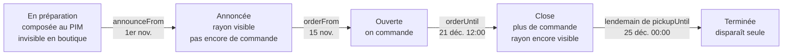
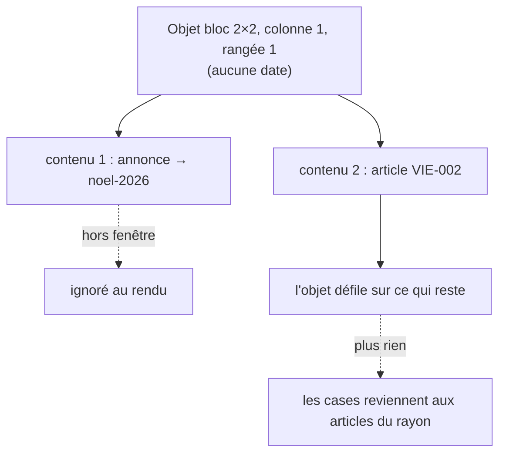

# Les opérations datées — Noël, Pâques, la galette

> **État : plan, rien n'est construit (2026-09-24).** Conception arrêtée avec
> Hugo le même jour :
>
> - l'opération **vit dans le catalogue** (le PIM), « pour des raisons de
>   préparation », et se **surcharge côté commerce à la réception** ;
> - une annonce de vitrine liée à une opération **se remplit seule**, avec une
>   surcharge locale au pire ;
> - dater l'objet ou le contenu : **documenté, schémas compris** (D11) ;
> - exclusivité **au choix, par article** (D3) ; délai : **le plus tôt des
>   deux** (D6) ; public : **au choix, par opération** (D7) ; filtres : **en
>   tête pendant la fenêtre** (D8) ; la dérogation de l'équipe **ne couvre
>   pas** la clôture (D6).
>
> **Contredit par `vitruve` le 2026-09-24** : trois objections bloquantes et dix
> sérieuses, toutes reprises ci-dessous — la section « Ce que la contradiction a
> changé » les liste une par une.
>
> Suite de [`boutique-rayon-layout.md`](boutique-rayon-layout.md), section
> « Ce que fait une annonce au clic », ligne **Opération**.

## Ce qu'est une opération, en une phrase

Une **sélection d'articles** du catalogue, **bornée dans le temps**, qui a un
nom et une image, qu'on annonce avant de la vendre, dont la commande ferme à une
date, et qu'on retire sur des jours donnés.

Ce n'est **pas** une famille : une bûche de Noël reste une pâtisserie. Elle
garde sa famille, son rayon d'origine, ses prix et ses règles de prix (indexés
sur la famille — `b2b/catalog/domain/shelf-of-category.ts`). L'opération
**ajoute** un rayon où l'article paraît ; elle ne l'enlève de nulle part — sauf
l'article **exclusif**, qui n'est vendu que pendant une opération (D3).

## Ce qui existe (vérifié le 2026-09-24)

| Pièce                  | Où                                                                                                                                   | Ce qu'elle impose                                                                                                                                                                                                                                                   |
| ---------------------- | ------------------------------------------------------------------------------------------------------------------------------------ | ------------------------------------------------------------------------------------------------------------------------------------------------------------------------------------------------------------------------------------------------------------------- |
| Rayons de la boutique  | `b2b/catalog/application/shop-catalogue-view.ts:43` (`shelfId = item.categoryId`), `shelf-of-category.ts:33`                         | un rayon **est** une famille du PIM, liste fermée en dur. Un rayon d'opération ne peut pas en naître : il lui faut sa propre clé, `op:<key>`.                                                                                                                       |
| L'envoi PIM → commerce | `packages/catalog-sync/src/snapshot.ts:24` (`CATALOG_SNAPSHOT_VERSION = 10`), `:400`                                                 | un instantané **entier**, de version **exacte** : le récepteur refuse une version inconnue. Ajouter un champ est une rupture de format → **v11**.                                                                                                                   |
| La relecture différée  | `storedCatalogSnapshotSchema` (même fichier, `:442`)                                                                                 | un envoi en attente traverse les déploiements ; il accepte les versions **connues** et laisse **manquer** les champs récents, sans valeur de remplacement.                                                                                                          |
| « À la réception »     | `accept-delivery.handler.ts:90-120`, `prisma-catalog-delivery.repository.ts:138`                                                     | un envoi attend, un humain l'accepte ; **un seul** attend à la fois, le suivant le remplace (`superseded`). L'acceptation photographie ensuite le miroir (`photograph`).                                                                                            |
| Le miroir des articles | `prisma/schema/public/catalog.prisma` (`CatalogItem`)                                                                                | un article disparu d'un envoi reçoit `withdrawnAt` ; il n'est **pas** supprimé.                                                                                                                                                                                     |
| Surcharge d'un article | `CatalogItemOverride`                                                                                                                | le modèle à copier : `NULL` = on garde le PIM ; `decidedBy` / `decidedAt`.                                                                                                                                                                                          |
| Lecteur du catalogue   | `b2b/catalog/domain/ports/catalog.reader.ts:109` ; `hiddenFrom` (`prisma-catalog.reader.ts:191`)                                     | **six appelants**, et pas tous des vendeurs (D5). Quatre fichiers seuls lisent le miroir (`lint:withdrawn-filter`), dont le semis de dev.                                                                                                                           |
| Passation de commande  | `b2b/orders/application/services/order-drafting.service.ts`                                                                          | **un** point d'entrée pour les trois handlers (`place-order`, `place-shop-order`, `place-order-for-customer`). Il lit le catalogue en `"pro"` quelle que soit la clientèle (`:276`), ne garde rien sans date (`:269`), et le devis (`:213`) n'appelle pas le garde. |
| Délai de commande      | `b2b/orders/domain/services/order-cutoff-guard.ts:82`                                                                                | un garde pur ; le panier ferme sur sa ligne la plus urgente ; une dérogation n'ouvre que la **grâce** (`:98-103`).                                                                                                                                                  |
| Abonnements            | `create-subscription.handler.ts:51`                                                                                                  | ne consulte pas le catalogue. Aucun générateur n'écrit encore de commande depuis un abonnement.                                                                                                                                                                     |
| Fuseau                 | `packages/contracts/src/paris-time.ts:98` (`localToInstant`), porte `lint:business-day`                                              | la porte ne scanne que la tarification (`SCAN_ROOTS`, `business-day.mjs:57`).                                                                                                                                                                                       |
| Images                 | le PIM porte ses images par **URL** et répond déjà à la médiathèque (`pim/catalogue/shared/infrastructure/prisma-media-carriers.ts`) | l'image d'une opération s'ajoute à ce compte, **dans** le PIM.                                                                                                                                                                                                      |
| Écriture au PIM        | `@AdminSurface("pim_catalog")`, `pim/journal/pim-journal.ts`, porte `lint:journal-tracked`                                           | toute écriture journalise dans la même unité de travail.                                                                                                                                                                                                            |

## Les décisions

### D1 — L'opération naît au PIM, et le commerce la reçoit

Préparer Noël, c'est choisir des articles, fixer des dates et préparer la
production : c'est le travail du catalogue. Le commerce **reçoit** l'opération
dans l'instantané et peut la **restreindre** à la réception (D9) ; il ne la crée
pas et n'y ajoute rien.

Tout passe par la réception : une date avancée au PIM ne change la boutique
qu'**une fois l'envoi accepté**. D'ici là, la boutique garde les dates reçues.

### D2 — Cinq dates, et l'état se calcule

Une commande porte un **jour de retrait** (`fulfillmentDate`), pas un instant :
une opération a donc besoin de ses jours de retrait, pas seulement d'une fin.

| Date           | Type              | Sens                                                        | Obligatoire                |
| -------------- | ----------------- | ----------------------------------------------------------- | -------------------------- |
| `announceFrom` | instant           | le rayon et ses annonces apparaissent                       | oui                        |
| `orderFrom`    | instant           | on peut commander                                           | non — sinon `announceFrom` |
| `orderUntil`   | instant           | dernière commande                                           | oui                        |
| `pickupFrom`   | jour `AAAA-MM-JJ` | premier jour de retrait ou de livraison                     | oui                        |
| `pickupUntil`  | jour `AAAA-MM-JJ` | dernier jour ; le lendemain à minuit (Paris), tout s'éteint | oui                        |

Invariants, portés par l'agrégat `Operation` :
`announceFrom ≤ orderFrom < orderUntil`, `pickupFrom ≤ pickupUntil`,
`orderUntil ≤ fin(pickupUntil)`.

**Le fuseau a une seule traduction.** `fin(jour)` = `localToInstant(jour + 1,
"00:00")` (`paris-time.ts`), et l'écran du PIM saisit les instants en heure de
Paris par la même fonction. Aucun `T00:00Z` interpolé : `lint:business-day`
étend ses `SCAN_ROOTS` à `src/pim/operations`, `src/b2b/catalog` et à l'écran
du PIM, au lot 1.

L'état n'est **jamais stocké** : il se calcule à l'horloge du serveur (`Clock`).



### D3 — « Exclusif » est un fait de l'ARTICLE, pas de son opération

🔴 Première version, contredite : l'exclusivité se lisait dans la ligne
d'opération, et un article « n'appartenant à aucune opération » était libre. Or
retirer la bûche de la sélection, masquer l'opération à la réception ou
l'archiver au PIM la faisaient **toutes les trois** sortir de toute opération —
donc vendue toute l'année.

**Désormais** : la fiche produit du PIM porte `operationOnly: boolean`
(« vendu seulement pendant une opération »), et le fil le transporte avec
l'article. La règle se lit dans ce sens-là :

|                                        | Aucune opération ne le montre                       | Une opération le montre (fenêtre, clientèle, pas masquée, pas retiré de la sélection)   |
| -------------------------------------- | --------------------------------------------------- | --------------------------------------------------------------------------------------- |
| **Article courant** (le croissant)     | vendu normalement                                   | vendu normalement, **et** montré dans le rayon de l'opération                           |
| **Article `operationOnly`** (la bûche) | **n'est pas vendu** : ni rayon, ni fiche, ni panier | montré dans son rayon d'origine **et** dans celui de l'opération ; commandable selon D6 |

Tout ce qui retire une opération ou un article d'une opération fait tomber la
bûche du **bon** côté : invisible, jamais libre.

Les dates d'une opération ne contraignent **pas** l'article courant : une
commande ne se souvient pas du rayon d'où vient la ligne, et la clôture de Noël
empêcherait sinon de commander un croissant pour le 26 décembre.

Un article `operationOnly` dans plusieurs opérations (la galette, deux
week-ends) est vendable dès que **l'une** l'autorise.

### D4 — Une fonction dit « vendable maintenant ? »

```
operationAccess(item, operations, audience, now, fulfillmentDate?)
  → "free"        l'article n'est pas operationOnly
  → "shown"       operationOnly, et une opération le montre à cette clientèle
  → "orderable"   "shown" ET commande ouverte ET fulfillmentDate ∈ [pickupFrom, pickupUntil]
  → "closed"      operationOnly, montré, mais hors de la commande ou des jours de retrait
                  — avec la raison et les dates, pour le message (D6)
  → "absent"      operationOnly, et aucune opération ne le montre
```

Fonction pure, au domaine du catalogue du commerce, testée seule.

### D5 — Qui l'applique : ceux qui VENDENT, pas le lecteur

🔴 Première version, contredite : brancher le filtre dans le lecteur du
catalogue. Il a six appelants, et deux ne vendent pas :

| Appelant                                                                 | Vend ?  | Opérations                                                                                       |
| ------------------------------------------------------------------------ | ------- | ------------------------------------------------------------------------------------------------ |
| rayon de la boutique (`shop-catalogue-pricing.service.ts:98`)            | oui     | filtre `absent` ; marque `shown` / `closed` sur la carte                                         |
| fiche et lot de la boutique (`catalog-backed-product-catalog.ts:40/48`)  | oui     | idem                                                                                             |
| passation et devis (`order-drafting.service.ts`, via `resolveMany`)      | oui     | garde D6                                                                                         |
| paniers et brouillons (`save-shop-cart`, `save-order-draft`)             | oui     | acceptés, mais la ligne dit pourquoi elle ne passera pas                                         |
| fiche atelier du fournil (`catalog-workshop-shelves.reader.ts:41`)       | **non** | **aucun filtre** : la bûche du 24 reste lisible le 26                                            |
| écrans de tarification (`catalog-backed-product-catalog.ts:63`, `all()`) | **non** | **aucun filtre** : on négocie le prix d'une bûche avant son annonce — c'est la préparation de D1 |

Le lecteur reste donc tel qu'il est ; les vendeurs appellent `operationAccess`
après lui. Pas de paramètre `now` sur `listSellable`.

### D6 — Le délai : le plus tôt des deux, et jamais sans date

Pour un article `operationOnly`, deux gardes s'appliquent l'un après l'autre
dans `OrderDrafting` — **un** point d'insertion pour les trois handlers de
passation : celui qui existe (le délai de fabrication) et
`ensureWithinOperation`, qui refuse :

- avant `orderFrom` : « Les commandes de Noël ouvrent le 15 novembre. »
- après `orderUntil` : « Les commandes de Noël sont closes depuis le 21 décembre à 12 h. »
- un jour de retrait hors `[pickupFrom, pickupUntil]` : « La bûche se retire du 20 au 24 décembre. »
- **sans jour de retrait** : « Choisissez un jour de retrait entre le 20 et le 24 décembre. »
  Le garde actuel laisse passer une commande sans date (`order-drafting.service.ts:269`) ;
  pour un article `operationOnly`, l'absence de date **refuse**.

C'est **le plus tôt** qui ferme ; aucun ne se relâche. La dérogation de l'équipe
n'ouvre que la grâce du délai de fabrication (`order-cutoff-guard.ts:98`) : elle
**ne couvre pas** la clôture d'une opération (décidé par Hugo).

**La clientèle vient de la commande**, pas de la lecture du catalogue :
`OrderDrafting` lit aujourd'hui en `"pro"` pour tout le monde (`:276`) ; le garde
reçoit l'audience de la commande (société ou non), corrigée au même lot.

**Le devis et les jours proposés** appliquent la même règle : un panier qui
contient une bûche ne se voit proposer que des jours de
`[pickupFrom, pickupUntil]`, et le devis dit la raison — le refus n'attend pas
le paiement.

**Un panier déjà rempli** quand la fenêtre se ferme : la ligne n'est pas
« inconnue », elle est `closed` ou `absent` par opération, et le message le dit
(§0 de `CLAUDE.md` : un refus nomme le cas réel).

**Un abonnement ne peut pas contenir d'article `operationOnly`** : refusé à la
création. Aucun générateur n'écrit encore de commande depuis un abonnement ;
la règle est posée pour qu'il n'ait pas à la découvrir.

### D7 — Une clientèle par opération

`audience : pro | public | both`, décidé au PIM. La réception peut
**restreindre** (`both` → `pro`), jamais élargir.

### D8 — En boutique : un rayon de plus, en tête

- Pendant sa fenêtre, le rayon `op:<key>` apparaît **juste après « Tout »**,
  avec le nom de l'opération. Plusieurs opérations en même temps : par
  `announceFrom`, la plus récente d'abord.
- Il liste les articles de l'opération, moins ceux retirés à la réception, dans
  l'ordre du PIM ; chacun garde son prix et sa fiche.
- Les cartes d'un article `operationOnly` disent l'état : « Ouvre le 15 nov. »,
  « Commandes closes » — le bouton « + » est alors remplacé.
- La vitrine du rayon `op:<key>` se compose comme les autres.

### D9 — La réception : restreindre, jamais étendre

`CatalogOperationOverride`, clé `operationKey` :

| Champ          | Ce qu'il permet                    |
| -------------- | ---------------------------------- |
| `isHidden`     | ne pas tenir l'opération du tout   |
| `orderUntil?`  | fermer la commande plus tôt        |
| `audience?`    | restreindre la clientèle           |
| `hiddenSkus[]` | retirer un article de la sélection |
| `decidedBy/At` | comme pour les articles            |

- **La surcharge se lit, elle ne se vérifie pas à l'écriture** : la clôture
  appliquée est `min(PIM, surcharge)`, la clientèle l'intersection. Un envoi
  qui avance la date du PIM ne rend jamais la surcharge « plus tardive ».
- **Une clé ne se réemploie jamais.** Le PIM n'efface pas une opération, il
  l'archive (`archived_at`), et la clé est sa clé primaire : `noel-2026` ne
  peut pas renaître. Côté commerce, le miroir **ne supprime pas** une opération
  disparue d'un envoi, il la marque retirée (`withdrawnAt`), comme un article —
  la surcharge garde ainsi son parent, et l'écran de réception la montre
  « opération retirée ».
- Masquer une opération, en retirer un article ou l'archiver rend ses
  articles `operationOnly` **invisibles** (D3), jamais libres.

### D10 — Le fil passe en v11

`catalogSnapshotSchema` gagne `operations[]` et, sur chaque article,
`operationOnly`. Tous deux sont obligatoires sur le fil : un émetteur qui les
oublie échoue à l'émission.

`storedCatalogSnapshotSchema` ajoute `z.literal(11)` et laisse `operations` et
`operationOnly` **manquer**, sans valeur de remplacement (doctrine du fichier,
`:539-549`) ; c'est la **version** qui dit comment lire. Un envoi v10 se lit :
pas d'opération, aucun article `operationOnly` — ce qui était vrai.

⚠️ Un envoi v10 encore en attente au déploiement, accepté après, vide le miroir
des opérations jusqu'à l'envoi suivant. Ce n'est pas dangereux : aucun article
n'y est `operationOnly`, donc rien d'exclusif n'est vendu. À dire à l'équipe
dans le runbook du lot 2 : accepter l'envoi v10 en attente **avant** le
déploiement, ou en demander un neuf juste après.

```
SyncOperation
  key            "noel-2026"
  name           { fr, en?, it? }      localisé : l'annonce l'est
  lede           { fr, en?, it? } | null
  image          { url, alt } | null
  announceFrom · orderFrom · orderUntil       instants ISO
  pickupFrom · pickupUntil                    jours AAAA-MM-JJ
  audience       pro | public | both
  skus           string[]  ordonné, filtré sur ceux que l'envoi porte
```

⚠️ Le fil était **monolingue** (le nom d'une famille y voyage en français
seul). L'opération y fait exception : ses textes s'affichent tels quels dans
l'annonce, qui est en trois langues.

**L'acceptation photographie aussi les opérations** : « qu'était-il possible
de commander le 20 décembre ? » doit avoir une réponse, comme pour les
articles.

### D11 — La vitrine : l'annonce liée, et le contenu qui s'éteint

Une annonce (contenu info) gagne une cible `operation` à côté de `shelf` :

```
StorefrontContent (info)
  action          none | shelf | operation   (formula, page : plus tard)
  operationKey?   "noel-2026"
  badge · title · lede · image   → NULL = hérités de l'opération
```

Chaque champ vide prend la valeur de l'opération ; le badge se **calcule** :
« Dès le 15 nov. » (annoncée), « J‑18 » (ouverte, jours avant la clôture),
« Commandes closes » (close). Un champ rempli dans l'éditeur **surcharge** ; il
s'affiche en gris quand il hérite, et une croix remet l'héritage. Au clic,
l'annonce ouvre le rayon `op:<key>`.

**Le contenu s'éteint avec son opération ; l'objet ne porte pas de date.**



- La date n'est écrite **qu'à un endroit** : l'opération. Avancer Noël au PIM
  déplace la vitrine avec — **une fois l'envoi accepté** (D1).
- Un objet dont tous les contenus sont éteints se comporte comme un objet vide
  aujourd'hui (`isRenderable` de `@lfd/storefront-layout`).
- Écarté : une fenêtre de dates sur l'objet. Deux sources de dates pour Noël
  divergeraient. Si « Fermé le 25 décembre » devient un vrai besoin, des dates
  s'ajouteront **au contenu**, refusées sur une annonce liée à une opération.

## Les données

**Au PIM** (schéma `pim`, contexte neuf `pim/operations/`) :

```
operations          key (PK), name jsonb, lede jsonb?, image_url?, image_alt?,
                    announce_from, order_from?, order_until timestamptz,
                    pickup_from, pickup_until date, audience, archived_at?
operation_items     operation_key, sku, position       (PK operation_key + sku)
+ sur la fiche produit : operation_only boolean NOT NULL DEFAULT false
```

**Au commerce** (schéma `public`) :

```
catalog_operations           forme de SyncOperation + withdrawn_at?
catalog_operation_items      operation_key, sku, position
+ sur CatalogItem : operation_only boolean NOT NULL DEFAULT false
catalog_operation_overrides  operation_key (PK, FK → catalog_operations), is_hidden,
                             order_until?, audience?, hidden_skus text[],
                             decided_by, decided_at
```

Tout est additif : deux colonnes à défaut `false` sur deux tables existantes,
et des tables neuves.

## Le découpage

🔴 Première version, contredite : « le garde part avant que la boutique montre
un article exclusif ». Faux — la boutique montre **déjà** tout article publié,
dans son rayon d'origine. Publier la bûche pour la mettre dans Noël la mettait
en vente un 3 mars.

**Désormais, c'est inexprimable avant d'être gardé** : le drapeau
`operationOnly` n'est **proposé** dans l'écran du PIM qu'à partir du lot 2, et
les lots 2 et 3 partent **dans le même merge**. Tant qu'ils ne sont pas en
ligne, une bûche publiée est un article courant — c'est la règle d'aujourd'hui,
et le lot 1 l'écrit dans l'écran de préparation (« la sélection ne restreint pas
encore la vente »).

| Lot   | Contenu                                                                                                                                                                                                              | Garde-fous                                                                                      |
| ----- | -------------------------------------------------------------------------------------------------------------------------------------------------------------------------------------------------------------------- | ----------------------------------------------------------------------------------------------- |
| 1     | PIM : agrégat `Operation` (D2, D7), cas d'écriture journalisés, écran de préparation (nom, dates, articles), image comptée par la médiathèque ; `lint:business-day` étendue                                          | migration additive ; `lint:journal-tracked`                                                     |
| 2 + 3 | **Ensemble.** Fil v11 et `operationOnly` (D3, D10) ; miroir, acceptation, photographie, surcharge et son écran (D9) ; `operationAccess` (D4) chez les vendeurs (D5) ; garde, devis, jours, paniers, abonnements (D6) | lecteur de migrations ; `vitruve` sur le plan de lot ; relecture d'un envoi v10 ; runbook (D10) |
| 4     | Boutique : rayon `op:<key>` en tête, états des cartes (D8)                                                                                                                                                           |                                                                                                 |
| 5     | Vitrine : action `operation`, héritage, extinction (D11)                                                                                                                                                             |                                                                                                 |

✅ **Lot 1, côté serveur : bâti le 2026-09-24** (non commité à cette date). Le
contexte `apps/lfd-api/src/pim/operations/`, la migration
`20260924120000_les_operations_datees`, les routes `/pim/operations`, six faits
`operation.*` au journal, l'image comptée par la médiathèque, et
`lint:business-day` étendue à `src/pim/operations`. Restent au lot 1 : l'écran
de préparation, et l'extension de `SCAN_ROOTS` à `src/b2b/catalog` et à cet
écran.

✅ **Lot 2, côté serveur : bâti le 2026-09-24** (non commité à cette date).
La migration `20260924180000_les_operations_traversent_le_fil` ; la case
`operationOnly` de la fiche (`PUT /pim/catalogue/products/:id/operation-only`,
fait `product.operation_only_changed`) ; le fil **v11** (`operations[]`,
`operationOnly` sur le produit ; le schéma stocké relit la v10 sans valeur de
remplacement) ; la projection (opérations non archivées, SKU filtrés sur
l'envoi, motif `operation_article_absent`, empreinte) ; le miroir
`catalog_operations` / `catalog_operation_items` et `CatalogItem.operationOnly`,
écrits à l'acceptation, **marqués** retirés et jamais supprimés ; la
photographie des opérations dans `catalog_versions.operations` (colonne
`jsonb` nullable — que « Les données » ne listait pas : `NULL` = version d'avant
la v11) ; la surcharge `catalog_operation_overrides` sous `b2b_catalog`
(`GET /admin/catalog/operations`, `PUT /admin/catalog/operations/:key/override`,
fait `catalog_operation.override_set`) ; le lecteur `CatalogOperationsReader`
pour le lot 3, **lu par personne encore** ; `SCAN_ROOTS` étendus à
`src/b2b/catalog` ; le runbook « Avant de déployer le fil v11 ». Restent au
lot 2 : la case de la fiche et l'écran de réception, côté back-office. Le
lot 3 n'est pas commencé — tant qu'il ne l'est pas, `operationOnly` ne restreint
aucune vente, et le lot 2 ne part pas seul.

✅ **Lot 3, côté serveur : bâti le 2026-09-24** (non commité à cette date).
`operationAccess` (D4) est une fonction pure de `b2b/catalog/domain/operation-access.ts` ;
le service `SaleOperations` fait le passage SKU produit → SKU du catalogue
(l'opération porte la déclinaison, la commande le produit). Le rayon de la
boutique écarte `absent`, marque la carte (`ShopItemView.operation`) et sert
la liste `ShopCatalogueView.operations` pour le lot 4 ; la passation et les
deux devis opposent `ensureWithinOperation` (D6) après le délai, à la clientèle
de la commande ; `GET /fulfillment-days?skus=…&audience=…` ne propose que les
jours de l'opération ; l'abonnement refuse un article `operationOnly`. La
fiche atelier, la tarification et la parité ne sont pas filtrées (D5). Écart
avec D5 : le filtre n'est pas posé dans `catalog-backed-product-catalog.ts:40/48`,
que la tarification appelle aussi — il vit chez les vendeurs qui les
appellent. Les paniers et brouillons ne sont toujours pas relus à
l'enregistrement : c'est leur devis qui nomme la raison.

**Sans retour après le premier merge du lot 2 + 3** : le fil v11 (revenir au
code v10 laisserait des envois v11 que personne ne relit — un seul processus
porte l'émetteur et le récepteur, ils partent ensemble) ; les clés `op:<key>`
servies à la boutique et enregistrées dans des vitrines.

## Ce que la contradiction a changé

| Objection de `vitruve`                                       | Réponse                                         |
| ------------------------------------------------------------ | ----------------------------------------------- |
| B1 — l'exclusif devenait libre en quittant son opération     | D3 : `operationOnly` sur l'article              |
| B2 — l'ordre des lots ne protégeait rien                     | lots 2 + 3 ensemble, drapeau proposé au lot 2   |
| B3 — le filtre au lecteur cassait la fiche atelier           | D5 : filtre chez les vendeurs seulement         |
| S4 — la commande lit en `"pro"` pour tous                    | D6 : audience de la commande                    |
| S5 — pas de garde sans date, devis et jours non gardés       | D6                                              |
| S6 — fuseau hors de toute porte                              | D2 : `localToInstant`, `SCAN_ROOTS` étendus     |
| S7 — « déplace tout » faux ; surcharge vérifiée à l'écriture | D1, D9 : lu à l'acceptation, `min` à la lecture |
| S8 — surcharge orpheline, clé réemployée                     | D9 : clé = PK archivée, miroir `withdrawnAt`    |
| S9 — panier fermé → « SKU inconnu »                          | D6 : `closed` / `absent` nommés                 |
| S10 — abonnement à une bûche                                 | D6 : refusé à la création                       |
| S11 — tarification aveugle hors fenêtre                      | D5 : la tarification voit tout                  |
| S12 — historique sans opérations                             | D10 : photographiées                            |
| S13 — l'irréversible non signalé                             | « Sans retour » ci-dessus                       |

## Pas encore décidé

- **Des créneaux propres à l'opération** (le 24 au matin seulement) :
  `[pickupFrom, pickupUntil]` borne les jours ; les heures restent celles de la
  maison. Voir `plan-creneaux-de-retrait.md`.
- **La production** : le fournil voit les bûches comme les autres articles,
  par article (D5). Une vue « par opération » viendrait en plus.
