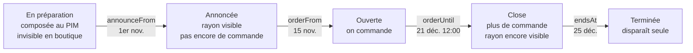
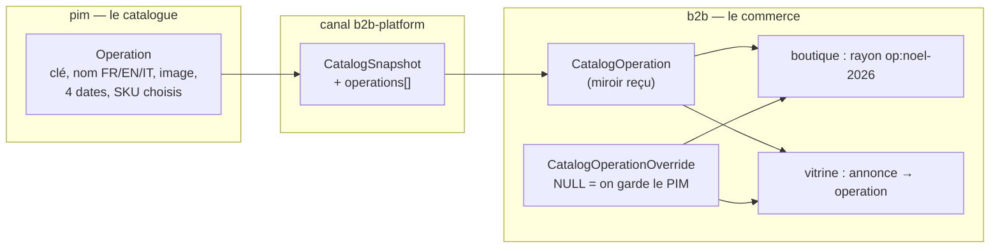
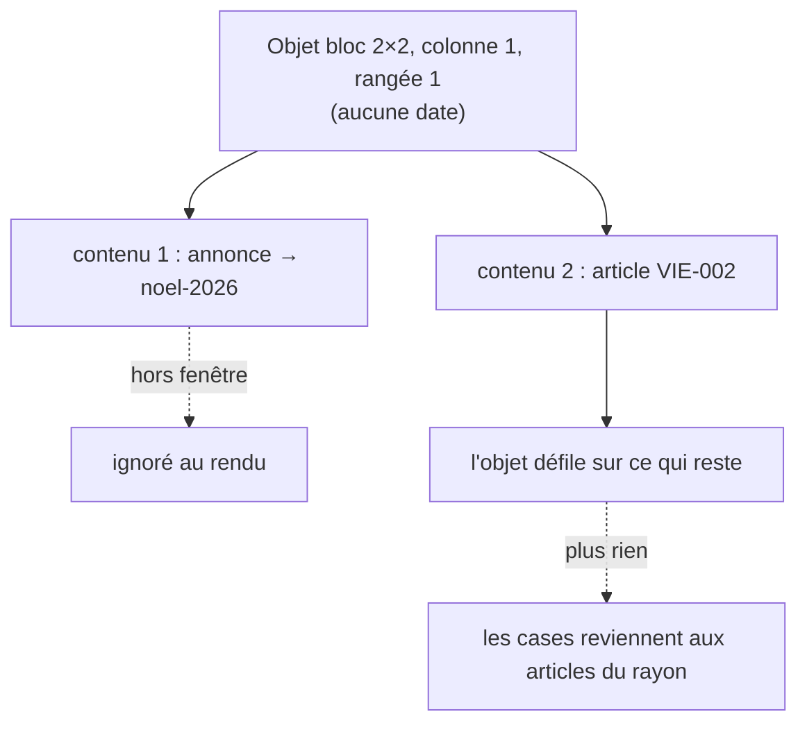

# Les opérations datées — Noël, Pâques, la galette

> **État : proposé, rien n'est construit (2026-09-24).** Trois décisions de
> Hugo le même jour :
>
> 1. l'opération **vit dans le catalogue** (le PIM), « pour des raisons de
>    préparation », et se **surcharge côté commerce à la réception** ;
> 2. une annonce de vitrine liée à une opération **se remplit seule**, avec une
>    surcharge locale au pire ;
> 3. dater l'objet ou le contenu : **à documenter, schémas compris** — c'est
>    l'objet de la dernière section.
>
> Suite de [`boutique-rayon-layout.md`](boutique-rayon-layout.md), section
> « Ce que fait une annonce au clic », ligne **Opération**.

## Ce qu'est une opération, en une phrase

Une **sélection d'articles** du catalogue, **bornée dans le temps**, qui a un
nom et une image, qu'on annonce avant de la vendre, et dont la commande ferme
avant le retrait.

Ce n'est **pas** une famille : une bûche de Noël reste une pâtisserie. Elle
garde son rayon d'origine, ses prix et ses règles de prix (qui sont indexés
sur la famille — `b2b/catalog/domain/shelf-of-category.ts`). L'opération
**ajoute** un rayon de plus où l'article paraît ; elle ne l'enlève de nulle
part.

## Ce qui existe (vérifié le 2026-09-24)

| Pièce                    | Où                                                                                                                                | Ce qu'elle dit pour nous                                                                                                                |
| ------------------------ | --------------------------------------------------------------------------------------------------------------------------------- | --------------------------------------------------------------------------------------------------------------------------------------- |
| Rayons de la boutique    | `b2b/catalog/domain/shelf-of-category.ts:33`                                                                                      | **liste fermée en dur**, catégorie PIM → rayon (`cat_vien` → `viennoiserie`…). Un rayon d'opération ne peut PAS naître d'une catégorie. |
| Passage PIM → commerce   | `pim/channels/b2b-platform/products/feed-projection.service.ts` → `CatalogSnapshot` (`packages/catalog-sync/src/snapshot.ts:400`) | un **instantané entier** projeté, relu, puis poussé ; le commerce le reçoit tel quel. C'est là qu'une opération traverserait.           |
| Surcharge à la réception | `CatalogItemOverride` (`prisma/schema/public/catalog.prisma`)                                                                     | le modèle à copier : `NULL` = on garde le PIM ; `decidedBy`/`decidedAt`. Aucune date.                                                   |
| Délai de commande        | `pim/order-time-limitation/`                                                                                                      | « N jours avant, à HH:MM » — un délai RELATIF, pas une fenêtre. Une opération a une date de fin de commande ABSOLUE.                    |
| Fenêtres datées          | règles de prix (`validFrom`/`validTo`, `Timestamptz`)                                                                             | la forme à reprendre, et la porte `lint:dated-decisions` qui l'exige déjà pour le prix.                                                 |
| Vitrine                  | `StorefrontObject`, `StorefrontContent` (`storefront.prisma`)                                                                     | aucune date ; une info porte `linkShelfKey`.                                                                                            |

## Le cycle de vie — quatre dates, cinq états



| Date           | Sens                                                                         | Obligatoire |
| -------------- | ---------------------------------------------------------------------------- | ----------- |
| `announceFrom` | le rayon et ses annonces apparaissent                                        | oui         |
| `orderFrom`    | on peut commander (= `announceFrom` si non précisée)                         | non         |
| `orderUntil`   | dernière commande — **absolue**, remplace le délai relatif pour ces articles | oui         |
| `endsAt`       | fin des retraits ; après, tout s'éteint                                      | oui         |

Invariant, porté par l'agrégat : `announceFrom ≤ orderFrom < orderUntil ≤ endsAt`.
L'état n'est **jamais stocké** : il se calcule à l'horloge du serveur
(`Clock`), comme tout le reste du temps métier.

⚠️ **À trancher avec la commande** (`plan-heure-limite-par-clientele.md`) :
quand un article d'opération a aussi son délai relatif, lequel gagne ? Proposé :
le plus tôt des deux. C'est une règle de commande, pas de vitrine — elle
touche au bon de commande, donc `vitruve` avant de la bâtir.

## Où chaque chose vit



**Au PIM** (`pim/operations/`, contexte neuf — agrégat, il a un invariant) :

```
Operation
  key            "noel-2026"        stable, sert de clé de rayon : op:noel-2026
  name           { fr, en?, it? }
  lede           { fr, en?, it? }?  la phrase d'annonce
  imageId        médiathèque?
  announceFrom · orderFrom? · orderUntil · endsAt
  skus           string[] ordonné   l'ordre du rayon
  archivedAt?
```

**Dans l'instantané** : `operations[]`, même forme, SKU filtrés sur ceux que
l'instantané porte (un SKU non publié sur le canal ne traverse pas — la
projection l'écarte et le dit dans `excluded`, comme pour un produit).

**Au commerce, à la réception** — `CatalogOperationOverride`, clé `operationKey` :

| Champ          | Ce qu'il permet                                             |
| -------------- | ----------------------------------------------------------- |
| `isHidden`     | ne pas la tenir du tout dans cette boutique                 |
| `orderUntil?`  | fermer la commande plus tôt (jamais plus tard que `endsAt`) |
| `hiddenSkus[]` | retirer un article de la sélection sans toucher au PIM      |
| `decidedBy/At` | comme pour les articles                                     |

Proposé : **pas** de surcharge du nom ni de l'image au commerce — c'est le
travail de l'annonce (niveau suivant). Et **pas** d'ajout d'article : une
sélection qui s'étend se prépare au PIM, là où se prépare la production.

## En boutique : un rayon de plus

- Entre `announceFrom` et `endsAt`, le rayon `op:<key>` apparaît dans les
  filtres, **après** les rayons permanents (proposé), avec son nom.
- Il liste les SKU de l'opération moins `hiddenSkus`, dans l'ordre du PIM ;
  chaque article garde son prix et sa fiche.
- Entre `announceFrom` et `orderFrom`, les cartes sont visibles mais le bouton
  « + » est remplacé par « Ouvre le 15 nov. ».
- Après `orderUntil` : « Commandes closes ».
- La vitrine du rayon `op:<key>` se compose comme les autres (`StorefrontPage`
  a sa ligne), et « aucune case n'est jamais vide » tient toujours.

## Dans la vitrine : l'annonce liée

Une annonce (contenu info) gagne une cible `operation` à côté de `shelf` :

```
StorefrontContent (info)
  action          none | shelf | operation   (formula, page : plus tard)
  operationKey?   "noel-2026"
  badge · title · lede · image   → NULL = hérités de l'opération
```

**Se remplit seule** (décision 2) : chaque champ vide prend la valeur de
l'opération, et le badge se **calcule** selon l'état :

| État     | Badge proposé                       |
| -------- | ----------------------------------- |
| annoncée | « Dès le 15 nov. »                  |
| ouverte  | « J‑18 » (jours avant `orderUntil`) |
| close    | « Commandes closes »                |

Un champ rempli dans l'éditeur **surcharge** — c'est l'« override local ».
Dans l'éditeur, le champ hérité s'affiche en gris avec sa valeur réelle, et
une croix remet l'héritage.

Au clic, l'annonce ouvre le rayon `op:<key>`.

## Dater l'objet ou le contenu ? (question 3)

C'est la seule question ouverte. Deux façons de faire disparaître le bloc Noël
le 26 décembre :

### A — Le contenu s'éteint avec son opération (proposé)



- La date n'est écrite **qu'à un endroit** : l'opération. Avancer Noël d'une
  semaine au PIM déplace tout, vitrine comprise.
- Un objet dont tous les contenus sont éteints se comporte comme un objet
  vide aujourd'hui : ses cases reviennent aux articles (règle existante,
  `isRenderable` de `@lfd/storefront-layout`).
- Ce qui ne se fait **pas** : une annonce datée sans opération (« Fermé le 25
  décembre »). Il faudrait alors une opération sans article, ou B.

### B — L'objet porte sa propre fenêtre

```
StorefrontObject
  visibleFrom?  visibleUntil?
```

- Permet n'importe quelle annonce datée, avec ou sans opération.
- Mais deux sources de dates pour Noël, qui divergeront : l'opération finit
  le 25, l'objet le 31 — la vitrine annonce une opération close.

### Proposé : A d'abord, B plus tard et seulement pour ce que A ne fait pas

A couvre Noël, Pâques et la galette sans une date de plus dans la vitrine.
Si « Fermé le 25 décembre » devient un vrai besoin, B s'ajoutera **sur le
contenu** (pas sur l'objet) et sera **refusé** sur une annonce liée à une
opération — une seule source de dates par contenu. La table est prête à le
recevoir sans migration de données (colonnes nullables).

## Le découpage proposé

| Lot | Contenu                                                                                | Garde-fous                                   |
| --- | -------------------------------------------------------------------------------------- | -------------------------------------------- |
| 1   | PIM : agrégat `Operation`, écran de préparation (nom, dates, sélection d'articles)     | migration additive                           |
| 2   | Canal : `operations[]` dans l'instantané, miroir au commerce, surcharge à la réception | contrat de l'instantané étendu, jamais cassé |
| 3   | Boutique : rayon `op:<key>` et ses trois états sur les cartes                          |                                              |
| 4   | Vitrine : action `operation` sur l'annonce, héritage et surcharge des champs           |                                              |
| 5   | Commande : `orderUntil` fait foi pour ces articles                                     | 🔴 touche la commande : `vitruve`            |

## Pas encore décidé

- La place du rayon d'opération dans les filtres (après les permanents ?
  en tête pendant la fenêtre ?).
- Public visé : pro, particulier, les deux — la même question que la vitrine.
- Une opération peut-elle avoir ses **propres** créneaux de retrait (le 24
  au matin seulement) ? Probablement, mais c'est `plan-creneaux-de-retrait.md`.
