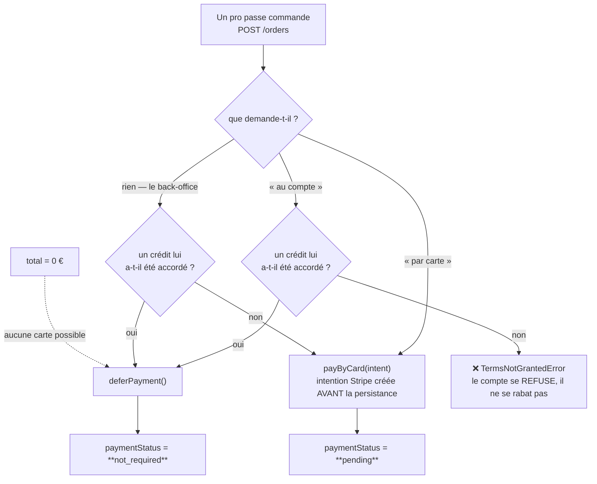
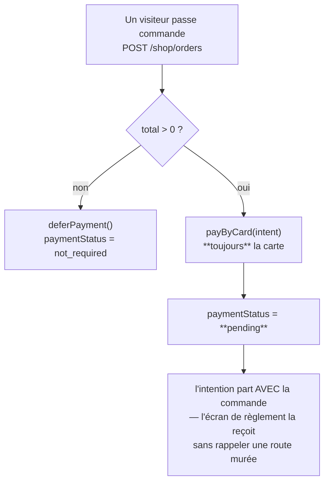
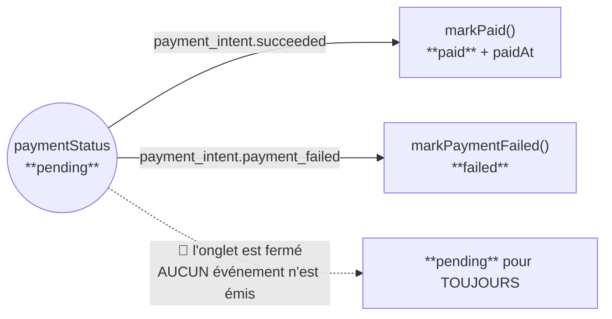
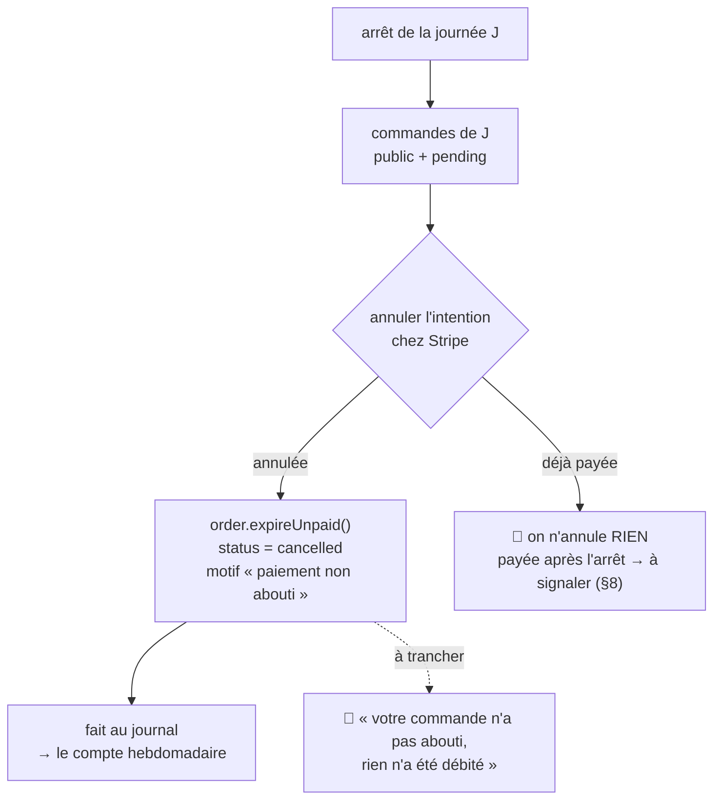
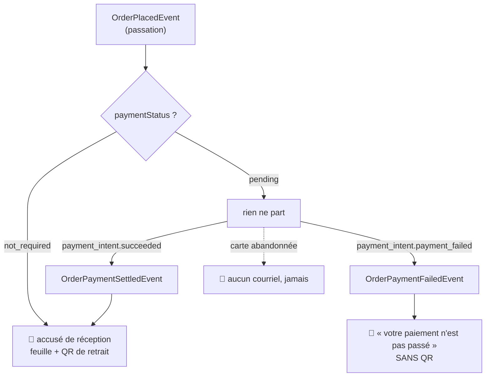
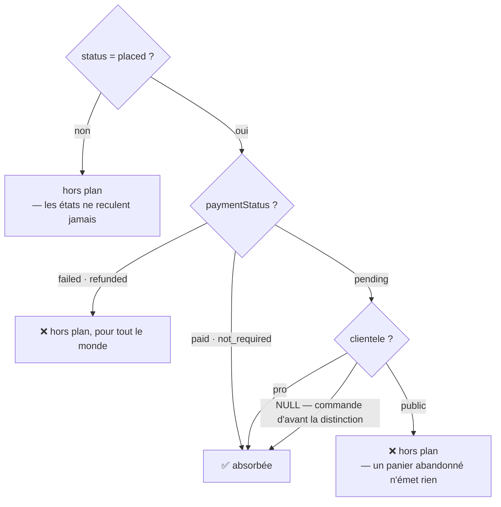

# Le règlement, et ce que le fournil fabrique

**Statut** : ✅ décrit **tel qu'il est**, relu dans le code le 2026-09-17 en fin
de journée — la règle d'entrée au compte de production, les deux courriels du
règlement et le dossier du jour. 🟠 **Une proposition non implémentée** : le
sort de la carte abandonnée (§4.1), avec trois points à trancher. Le reste
ouvert est au §8.
**Portée** : qui paie, quand, ce que le client en apprend, et quelles commandes
le fournil fabrique ou imprime. Ni le tarif, ni l'heure limite — ils ont leurs
documents.

> 🔴 **Ce document existe parce que deux colonnes indépendantes se sont mises à
> diverger.** `status` dit où en est la FABRICATION, `paymentStatus` dit où en
> est l'ARGENT. Le compte de production ne lisait que la première. Tant que le
> tunnel était pro, c'était sans conséquence ; la boutique publique en fait un
> cas courant, parce que tout le monde y paie par carte.

## 0. La demande

> « est-ce qu'on est certain, vu qu'on stocke en amont, que si commande pas
> successful mais order stockée, elle ne soit pas prise en compte dans le compte
> de production à la clôture ? » — Hugo, 2026-09-17.

La réponse, avant correction, était **non** : elle l'était.

## 1. Deux colonnes, et c'est tout le sujet

[`orders.prisma`](../../apps/lfd-api/prisma/schema/public/orders.prisma) les
sépare volontairement — « une commande peut être `placed` et déjà `paid`, ou
`placed` et `not_required` ».

| Colonne         | Ce qu'elle dit                 | Valeurs                                                                                  |
| --------------- | ------------------------------ | ---------------------------------------------------------------------------------------- |
| `status`        | l'avancement de la FABRICATION | `draft` · `placed` · `confirmed` · `in_production` · `ready` · `fulfilled` · `cancelled` |
| `paymentStatus` | l'état de l'ARGENT             | `not_required` · `pending` · `paid` · `failed` · `refunded`                              |

Une commande naît **toujours** `placed`. Ce qui change d'une clientèle à
l'autre, c'est la seconde colonne.

## 2. Situation A — le client PRO

La décision vit dans `requiresCard`
([`place-order.handler.ts`](../../apps/lfd-api/src/b2b/orders/application/commands/place-order.handler.ts)),
et elle écoute le client avant d'appliquer la règle.

**Deux faits qui comptent pour la suite** : payer comptant reste **toujours**
possible, même pour une société au mensuel — d'où des commandes pro en
`pending` ; et un crédit accordé donne `not_required`, c'est-à-dire « rien à
encaisser en ligne », pas « payé ».

## 3. Situation B — le client PUBLIC

Aucune décision à prendre : `settle`
([`place-shop-order.handler.ts`](../../apps/lfd-api/src/b2b/orders/application/commands/place-shop-order.handler.ts))
n'a pas de branche « au compte », et son JSDoc dit pourquoi — « offrir depuis
une surface anonyme reviendrait à accorder un crédit à quiconque tape une
adresse ».

🔴 **Une commande publique est donc `pending` dans tous les cas utiles.** C'est
la différence structurelle avec le pro, et c'est elle qui a rendu le trou
visible.

## 4. Le retour de Stripe — et le cas qui ne revient jamais

[`stripe-payment-gateway.ts`](../../apps/lfd-api/src/b2b/payments/infrastructure/stripe-payment-gateway.ts)
ne retient que **deux** événements ; tout le reste est `ignored`.

Les deux écritures sont **idempotentes** : un `updateMany` filtré sur `pending`,
donc un webhook rejoué ou un intent inconnu ne fait rien
([`prisma-order.repository.ts`](../../apps/lfd-api/src/b2b/orders/infrastructure/prisma-order.repository.ts)).

⚠️ **Le troisième chemin est le plus important, et il n'a pas d'événement.** Une
carte simplement abandonnée — l'onglet qu'on ferme devant le formulaire — ne
produit rien du tout chez Stripe. La commande reste `pending` indéfiniment. Ce
n'est pas un incident : c'est le comportement normal d'un panier public qu'on
n'a pas fini de payer.

### 4.1 🟠 Ce qu'on en fait — l'expiration à l'arrêt de la journée

> **Proposé, PAS implémenté** (2026-09-17). Trois points restent à trancher par
> Hugo, en fin de section ; le plan détaillé passera par `vitruve` avant de lui
> revenir, parce qu'il touche à l'argent (`CLAUDE.md` §9 bis).

**Ni effacer, ni seulement compter : annuler.**

- **Effacer est exclu.** `CLAUDE.md` §3 interdit le `DELETE` physique sur un
  agrégat métier. Surtout, l'intention Stripe resterait ouverte : le client
  pourrait encore payer une commande qui n'existe plus — de l'argent encaissé
  sans rien derrière. Et l'équipe ne retrouverait rien le jour où il appelle.
- **Un compteur seul ne suffit pas.** Il mesure, il ne règle rien : la commande
  resterait `pending`, visible au comptoir, et payable après coup alors qu'elle
  ne sera jamais fabriquée. Le compteur vient **en plus**, pour suivre le taux
  d'abandon.

**Le moment : l'arrêt de la journée.** Passé ce point, une commande publique en
attente ne peut plus être fabriquée (§6) — l'attendre davantage ne sert à rien.
L'action existe déjà, alors que l'API n'a aucun planificateur (vérifié le
2026-09-17 : ni `@Cron`, ni `ScheduleModule`).

🔴 **L'ordre compte : Stripe d'abord.** Annuler l'intention est ce qui ferme la
course avec un paiement en cours. Si la commande était annulée en premier, un
paiement validé dans la même seconde encaisserait une commande morte.

**Ce qui manque dans le code** (vérifié le 2026-09-17) : aucune méthode
d'annulation sur l'agrégat `Order`, aucune annulation d'intention dans la
passerelle Stripe. `payment_intent.canceled` reste ignoré par le webhook, et
c'est juste : c'est nous qui annulons.

**À trancher par Hugo :**

1. **Prévenir le client ?** Proposition : oui, un court courriel « rien n'a été
   débité ». Il a donné son adresse, et c'est le seul moment où il apprend ce qui
   s'est passé.
2. **Expirer aussi plus tôt** (au bout d'une heure, par exemple) pour ne pas
   encombrer la file du comptoir jusqu'à l'arrêt ? Il faudrait alors un
   déclencheur externe — une tâche planifiée Cloudflare qui appelle une route.
   L'arrêt seul suffit pour commencer.
3. **Le pro qui abandonne sa carte** est fabriqué aujourd'hui (§6). Le laisser
   ainsi — il a un compte, on peut l'appeler — ou lui appliquer la même
   expiration ?

## 5. Ce que le client en apprend — deux courriels, une seule clé

Jusqu'au 2026-09-17, l'accusé de réception partait **à la passation**, quel que
soit le règlement : un client dont la carte était refusée trente secondes plus
tard avait reçu « votre commande entre dans la fournée », et c'était le seul
message qu'il recevait jamais. Hugo : « je ne veux pas que pour un paiement
carte, order placed parte à la passation ».

Les deux retours de Stripe sont désormais **publiés** par
[`confirm-order-payment.handler.ts`](../../apps/lfd-api/src/b2b/orders/application/commands/confirm-order-payment.handler.ts)
— et seulement au franchissement : le dépôt ne bascule que ce qui était encore
`pending`, donc un webhook rejoué ne publie rien.

| Abonné                                                                                                                   | Écoute                     | Envoie                                        |
| ------------------------------------------------------------------------------------------------------------------------ | -------------------------- | --------------------------------------------- |
| [`send-order-placed-mail`](../../apps/lfd-api/src/b2b/orders/application/handlers/send-order-placed-mail.handler.ts)     | `OrderPlacedEvent`         | l'accusé, **sauf** si le règlement est en vol |
| [`send-order-settled-mail`](../../apps/lfd-api/src/b2b/orders/application/handlers/send-order-settled-mail.handler.ts)   | `OrderPaymentSettledEvent` | le même accusé                                |
| [`send-payment-failed-mail`](../../apps/lfd-api/src/b2b/orders/application/handlers/send-payment-failed-mail.handler.ts) | `OrderPaymentFailedEvent`  | le refus                                      |

- **Les deux chemins de l'accusé partagent un service**
  ([`order-placed-mail.service.ts`](../../apps/lfd-api/src/b2b/orders/application/services/order-placed-mail.service.ts))
  : même feuille, même QR, **même clé d'idempotence** par commande. Une commande
  ne peut pas produire deux accusés, quel que soit le chemin qui l'annonce.
- **Le refus ne porte pas de QR** : une commande impayée ne se retire pas, et
  joindre un code à présenter ferait venir quelqu'un pour rien.
- **Aucun des trois ne fait échouer quoi que ce soit.** Ils tournent hors de la
  requête (`BackgroundWork`) : la commande est écrite, le webhook a répondu, et
  un fournisseur de courrier indisponible ne peut défaire ni l'un ni l'autre.

## 6. Le compte de production — ce qui entre, et ce qui n'entre pas

🔴 **La règle est décidée** (Hugo, 2026-09-17 : « on restreint au public pour le
moment ») : on ne produit que ce qui est payé, ce qui n'a pas à l'être, et le
règlement en vol **d'un client qui a un compte**.

**Pourquoi la clientèle, et pas « `pending` exclu pour tous »** — mesuré avant
de trancher : 48 tests de bout en bout sur 89 tombaient et la clôture rendait
`409`, parce qu'un pro qui **paie à la commande** est `pending` lui aussi (§2).
Le priver de fabrication parce que son webhook a quelques secondes de retard
coûte une commande payée non servie. Un pro a un compte et quelqu'un à appeler ;
un visiteur qui ferme l'onglet n'a ni l'un ni l'autre.

⚠️ **`NULL` vaut « pas public », et c'est délibéré.** `orders.clientele` est
nullable pour toujours sur les commandes antérieures à la distinction
([`plan-nature-du-client-sur-la-commande.md`](plan-nature-du-client-sur-la-commande.md)).
En SQL, `clientele <> 'public'` est **faux** sur `NULL` : le fragment porte donc
une branche `clientele IS NULL` explicite, sans quoi ces commandes sortiraient
du plan au premier règlement en vol.

⚠️ **Le prix de la règle** : un visiteur dont le webhook `succeeded` arrive
APRÈS la clôture a payé et n'est pas produit. Le risque est assumé — produire
pour rien coûterait de la marchandise chaque nuit, un webhook en retard est un
incident rare — mais personne ne le signale encore (§8).

### Où la règle est écrite, et qui la lit

Le domaine décide, l'infrastructure traduit, les lecteurs épandent :

- [`production-plan.ts`](../../apps/lfd-api/src/b2b/orders/domain/services/production-plan.ts)
  — `absorbedByPlan` (statut **et** argent) et `settlementAllowsProduction`
  (l'argent **seul**), avec les constantes `STATUS_IN_PLAN`, `PAYMENTS_REFUSED`,
  `PAYMENTS_AWAITING`. Testé sans base.
- [`plan-filter.ts`](../../apps/lfd-api/src/b2b/orders/infrastructure/plan-filter.ts)
  — leur traduction Prisma : `planWhere()` et `settlementWhere()`. Aucun lecteur
  ne réécrit plus la condition à la main.

| Surface                                     | Fichier                                                                                                                         | Fragment               |
| ------------------------------------------- | ------------------------------------------------------------------------------------------------------------------------------- | ---------------------- |
| la **clôture** (`placed → confirmed`)       | [`prisma-order.repository.ts`](../../apps/lfd-api/src/b2b/orders/infrastructure/prisma-order.repository.ts)                     | `planWhere`            |
| la **fiche du fournil**                     | [`prisma-day-orders.reader.ts`](../../apps/lfd-api/src/b2b/orders/infrastructure/prisma-day-orders.reader.ts)                   | `planWhere`            |
| le **prévisionnel**                         | [`prisma-expected-production.reader.ts`](../../apps/lfd-api/src/b2b/orders/infrastructure/prisma-expected-production.reader.ts) | `planWhere`            |
| le **compteur de contrôle** (retards)       | [`prisma-pending-orders.reader.ts`](../../apps/lfd-api/src/b2b/orders/infrastructure/prisma-pending-orders.reader.ts)           | `planWhere`            |
| le **dossier du jour** (la liasse imprimée) | [`prisma-order.reader.ts`](../../apps/lfd-api/src/b2b/orders/infrastructure/prisma-order.reader.ts) — `listForProduction`       | `settlementWhere` seul |

Avant ce jour, les quatre premières posaient chacune leur `where`, et le
compteur l'écrivait noir sur blanc : « si les deux divergeaient, le compteur
mentirait dans le sens rassurant ». Elles ont divergé le jour où la clôture a
gagné le règlement.

La clôture reste **idempotente par sa règle** : une seconde passe ne trouve plus
aucune `placed`, donc n'absorbe rien, sans verrou.

## 7. 🔴 Le dossier du jour — la cinquième surface, oubliée

Le dossier est la liasse de bons qu'on tire une fois la journée arrêtée. Il
écartait **les seules annulées** : un règlement mort ou un visiteur resté en vol
recevait son bon au fournil, pendant que la fournée et le colisage n'en savaient
rien. Hugo, 2026-09-17 : « juste sur l'impression du dossier à arrêt de
production, sur fournée colisage c'est bon ».

**Pourquoi il ne prend pas `planWhere` entier** : il garde délibérément les
commandes déjà prêtes ou remises — sa pile numérotée (« fiche 3/14 ») est la
preuve qu'il ne manque pas une feuille entre deux tirages. `status = placed` le
viderait à la seconde où la journée bascule en `confirmed`, c'est-à-dire au
moment précis où on l'imprime. Il partage donc la moitié **argent**, et garde
son propre statut : tout sauf `cancelled` et `draft`.

Un test tient cette coupe dans
[`production-plan.spec.ts`](../../apps/lfd-api/src/b2b/orders/domain/services/__tests__/production-plan.spec.ts)
: `settlementAllowsProduction` ne porte **aucune** condition de statut, et elle
dit exactement la même chose qu'`absorbedByPlan` sur une commande `placed`.

Mesuré sur la base de développement, le même jour :

| Journée    | Bons avant | Bons après | Commandes au plan | Lecture                                            |
| ---------- | ---------: | ---------: | ----------------: | -------------------------------------------------- |
| 2026-09-17 |          7 |          7 |                 2 | les 5 autres sont déjà prêtes ou remises — voulu   |
| 2026-09-18 |          9 |          1 |                 0 | le bon restant est une commande payée déjà `ready` |
| 2026-09-19 |          4 |          4 |                 4 | inchangé                                           |
| 2026-09-20 |          3 |          0 |                 0 |                                                    |

⚠️ **La file du comptoir ne suit PAS la règle**, et c'est un choix : une
commande refusée y reste visible, parce que c'est la seule façon de dire à
quelqu'un qui se présente pourquoi on ne lui donne rien.

## 8. Ce qui reste ouvert

- **L'expiration des commandes impayées** — proposée au §4.1, pas
  implémentée. Sans elle, ces commandes restent `pending` indéfiniment, et leur
  client ne reçoit ni accusé ni refus (§5).
- **La surveillance des webhooks en retard.** Une commande `paid` restée
  `placed` après une clôture est une anomalie à rattraper à la main ; personne ne
  la signale aujourd'hui.
- **Le remboursement.** `refunded` existe dans l'énuméré et aucun chemin du code
  ne l'écrit (vérifié le 2026-09-17).
- **Les variables d'environnement des courriels** (`ADMIN_BASE_URL`,
  `CLIENT_BASE_URL`, `RESEND_MAILER_B2B_API_KEY`) doivent être posées avant que
  ce lot n'atteigne `main`.
