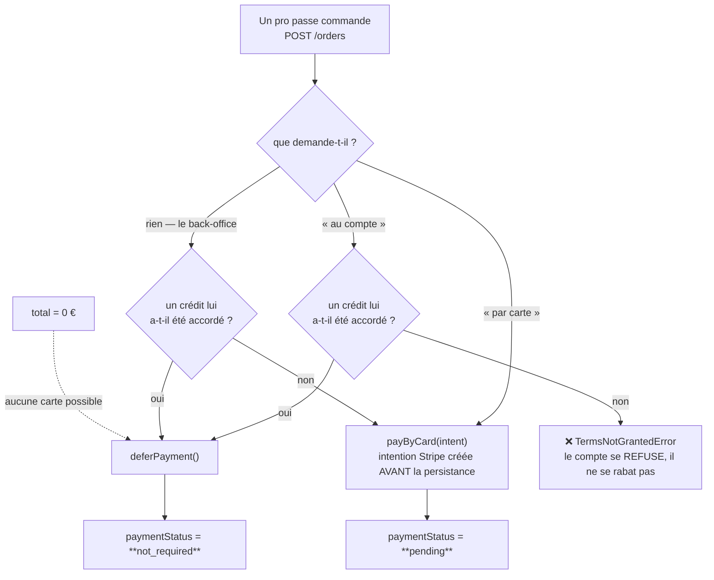
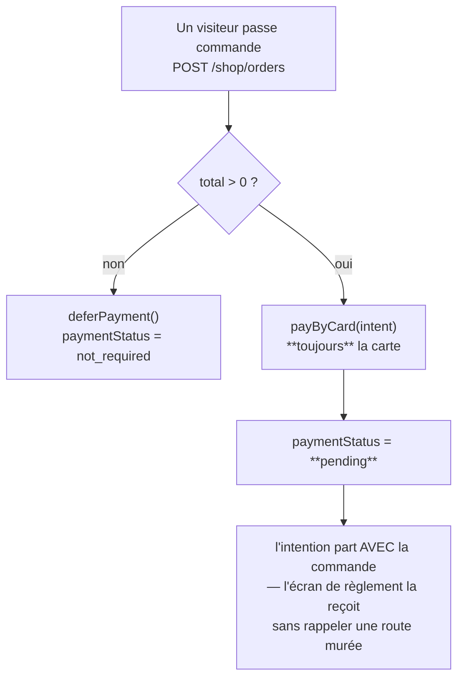
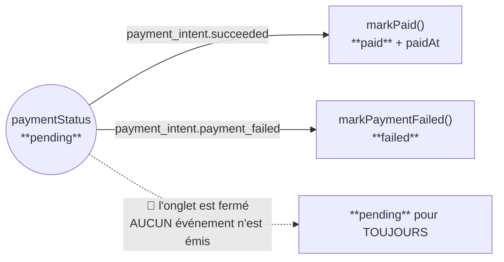
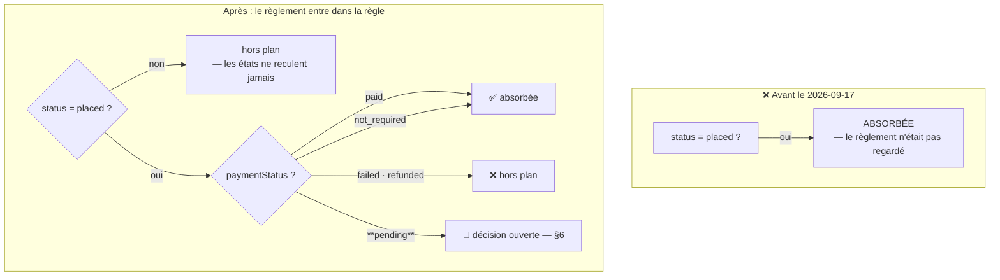

# Le règlement, et ce que le fournil fabrique

**Statut** : 🟡 le règlement est décrit **tel qu'il est** (lu dans le code le
2026-09-17) ; la règle d'entrée au compte de production a changé le même jour et
**une décision reste ouverte** (§6).
**Portée** : qui paie, quand, et quelles commandes entrent dans le compte à
produire. Ni le tarif, ni l'heure limite — ils ont leurs documents.

> 🔴 **Ce document existe parce que deux colonnes indépendantes se sont mises à
> diverger.** `status` dit où en est la FABRICATION, `paymentStatus` dit où en
> est l'ARGENT. Le compte de production ne lisait que la première. Tant que le
> tunnel était pro, c'était sans conséquence ; la boutique publique en fait un
> cas courant, parce que tout le monde y paie par carte.

## 0. La demande

> « est-ce qu'on est certain, vu qu'on stocke en amont, que si commande pas
> successful mais order stockée, elle ne soit pas prise en compte dans le compte
> de production à la clôture ? » — Hugo, 2026-09-17.

La réponse, avant correction, était **non** : elle l'était.

## 1. Deux colonnes, et c'est tout le sujet

[`orders.prisma`](../../apps/lfd-api/prisma/schema/public/orders.prisma) les
sépare volontairement — « une commande peut être `placed` et déjà `paid`, ou
`placed` et `not_required` ».

| Colonne         | Ce qu'elle dit                 | Valeurs                                                                                  |
| --------------- | ------------------------------ | ---------------------------------------------------------------------------------------- |
| `status`        | l'avancement de la FABRICATION | `draft` · `placed` · `confirmed` · `in_production` · `ready` · `fulfilled` · `cancelled` |
| `paymentStatus` | l'état de l'ARGENT             | `not_required` · `pending` · `paid` · `failed` · `refunded`                              |

Une commande naît **toujours** `placed`. Ce qui change d'une clientèle à
l'autre, c'est la seconde colonne.

## 2. Situation A — le client PRO

La décision vit dans `requiresCard`
([`place-order.handler.ts`](../../apps/lfd-api/src/b2b/orders/application/commands/place-order.handler.ts)),
et elle écoute le client avant d'appliquer la règle.

**Deux faits qui comptent pour la suite** : payer comptant reste **toujours**
possible, même pour une société au mensuel — d'où des commandes pro en
`pending` ; et un crédit accordé donne `not_required`, c'est-à-dire « rien à
encaisser en ligne », pas « payé ».

## 3. Situation B — le client PUBLIC

Aucune décision à prendre : `settle`
([`place-shop-order.handler.ts`](../../apps/lfd-api/src/b2b/orders/application/commands/place-shop-order.handler.ts))
n'a pas de branche « au compte », et son JSDoc dit pourquoi — « offrir depuis
une surface anonyme reviendrait à accorder un crédit à quiconque tape une
adresse ».

🔴 **Une commande publique est donc `pending` dans tous les cas utiles.** C'est
la différence structurelle avec le pro, et c'est elle qui a rendu le trou
visible.

## 4. Le retour de Stripe — et le cas qui ne revient jamais

[`stripe-payment-gateway.ts`](../../apps/lfd-api/src/b2b/payments/infrastructure/stripe-payment-gateway.ts)
ne retient que **deux** événements ; tout le reste est `ignored`.

Les deux écritures sont **idempotentes** : un `updateMany` filtré sur `pending`,
donc un webhook rejoué ou un intent inconnu ne fait rien
([`prisma-order.repository.ts`](../../apps/lfd-api/src/b2b/orders/infrastructure/prisma-order.repository.ts)).

⚠️ **Le troisième chemin est le plus important, et il n'a pas d'événement.** Une
carte simplement abandonnée — l'onglet qu'on ferme devant le formulaire — ne
produit rien du tout chez Stripe. La commande reste `pending` indéfiniment. Ce
n'est pas un incident : c'est le comportement normal d'un panier public qu'on
n'a pas fini de payer.

## 5. Le compte de production — ce qui entre, et ce qui n'entre pas

Deux surfaces lisent la même règle, et elles doivent dire la même chose : la
**clôture** qui bascule `placed → confirmed`
([`prisma-order.repository.ts`](../../apps/lfd-api/src/b2b/orders/infrastructure/prisma-order.repository.ts))
et la **fiche du fournil**
([`prisma-day-orders.reader.ts`](../../apps/lfd-api/src/b2b/orders/infrastructure/prisma-day-orders.reader.ts)).
La règle est nommée une fois, dans
[`production-plan.ts`](../../apps/lfd-api/src/b2b/orders/domain/services/production-plan.ts).

**Ce que la clôture fait, une fois la commande absorbée** : elle passe
`confirmed`, et le compte à produire est **figé**. La règle rend la clôture
idempotente d'elle-même — une seconde passe ne trouve plus aucune `placed`,
donc n'absorbe rien, sans qu'aucun verrou n'ait été posé.

## 6. 🔴 La décision qui reste ouverte : le sort de `pending`

Hugo a tranché le 2026-09-17 : **« pas pending »** — on ne produit que ce qui
est payé ou ce qui n'a pas à l'être. La raison est solide : une carte abandonnée
ne revient jamais (§4), et sa commande serait fabriquée **toutes les nuits**
sans que rien ne la démente.

⚠️ **Appliquée telle quelle, cette règle dépasse sa cible**, et c'est mesuré :
48 tests de bout en bout sur 89 tombent, et la clôture rend `409` parce qu'elle
n'absorbe plus rien. La cause n'est pas une fixture : un pro qui **paie à la
commande** est `pending` lui aussi (§2), donc il sort du plan tant que le
webhook n'est pas revenu.

| Option                             | Ce qu'elle ferme           | Ce qu'elle casse                                               |
| ---------------------------------- | -------------------------- | -------------------------------------------------------------- |
| `pending` absorbé (avant)          | rien                       | le panier public abandonné est produit chaque nuit             |
| `pending` exclu pour **tous**      | le panier public abandonné | le pro qui paie par carte n'est plus produit avant son webhook |
| `pending` exclu pour le **public** | le panier public abandonné | rien de ce qui existe — le pro garde son comportement          |

**La troisième est praticable** : `orders.clientele` porte déjà `public` ou
`pro`, figée à la passation
([`plan-nature-du-client-sur-la-commande.md`](plan-nature-du-client-sur-la-commande.md)),
et `clienteleOf` la déduit d'une seule chose — l'absence de société.

⚠️ La colonne est **nullable pour toujours** pour les commandes d'avant la
distinction. Une règle qui vise le public doit donc traiter `NULL` comme « pas
public », jamais l'inverse : une commande ancienne ne doit pas sortir du plan
parce qu'on ne sait pas d'où elle vient.

## 7. Ce que ce document n'a PAS ouvert

- **L'expiration des commandes impayées.** C'est le seul geste qui fermerait
  vraiment le cas de la carte abandonnée, quelle que soit l'option retenue au
  §6 : sans elle, ces commandes s'accumulent en `pending` indéfiniment.
- **La surveillance des webhooks en retard.** Si `pending` est exclu, une
  commande `paid` restée `placed` après une clôture est une anomalie à
  rattraper — personne ne la signale aujourd'hui.
- **Le remboursement.** `refunded` existe dans l'énuméré et aucun chemin du code
  ne l'écrit (vérifié le 2026-09-17).
- **Ce que le client VOIT.** L'écran de confirmation dit l'état réel du
  règlement ; ce document ne décrit que le serveur.
