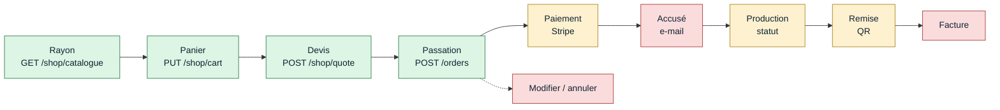

# Audit — le flux de commande, de bout en bout

> **Écrit le 2026-09-07.** Méthode : lecture du **code**, pas des documents.
> Chaque constat porte sa preuve — un fichier, une ligne, ou l'absence d'un
> fichier. Périmètre : tout ce qu'une commande traverse, du rayon à la remise.
> Le **prix** est hors périmètre : il a son propre dossier et son propre audit
> ([`../pricing/audit-fable.md`](../pricing/audit-fable.md)).
>
> Ce que cet audit cherche : les endroits où **un écran affirme quelque chose
> que le système ne fait pas**. Pas les imperfections — les promesses non
> tenues.
>
> ⚠️ **Les §1 à §5 sont la photo du matin, et elles ne sont pas réécrites.** Le
> **§6** dit ce qui a été fait l'après-midi même : quatre défauts fermés, un à
> moitié, deux requalifiés. Les titres portent leur état ; le corps garde le
> constat d'origine, parce que c'est lui qui explique pourquoi le remède est
> celui-là. **Lire le §6 avant d'agir sur un T.**

---

## 1. La chaîne, et où elle s'arrête

| Maillon                 | État | Ce qui existe vraiment                                                              |
| ----------------------- | ---- | ----------------------------------------------------------------------------------- |
| Rayon → panier → devis  | ✅   | Panier en base, devis serveur, prix résolus à la quantité. Solide.                  |
| Passation               | ✅   | `POST /orders` et `POST /admin/orders`, agrégat qui possède son argent, 28 cas e2e. |
| **Paiement**            | ✅   | ~~Le front ne la présente jamais~~ — écran de règlement livré le 2026-09-07 (§6).   |
| **Accusé de réception** | 🔴   | Aucun. Pas de template, pas d'abonné.                                               |
| **Avancement**          | 🟡   | 6 états déclarés, **2 écrits**. Le coursier ne quitte jamais `placed`.              |
| Remise (retrait)        | ✅   | Jeton, scan, course arbitrée par la base, attestation. Complet côté staff.          |
| **QR côté client**      | ✅   | ~~Aucun écran ne l'affiche~~ — écran livré le 2026-09-07 (§6).                      |
| **Facture**             | 🔴   | Aucune. `b2b/accounting` ne contient que des objets-valeur.                         |
| **Modifier / annuler**  | 🔴   | Aucune route. `cancelled` n'est jamais écrit.                                       |

---

## 2. Les défauts, par ce que se tromper coûte

### T1 — ✅ FERMÉ · L'écran de confirmation faisait **cinq** promesses, et le système n'en tenait aucune

C'est le défaut le plus grave du dossier, parce qu'il n'est pas un manque : il
est une **affirmation fausse faite au client**, sur l'écran qu'il regarde juste
après avoir commandé.

Le dictionnaire, dans
[`copy/fr.ts:248`](../../apps/lfc-B2B-platform-frontend/src/app/client/copy/fr.ts) :

| Ce que l'écran dit                                       | Ce que le code fait                                     |
| -------------------------------------------------------- | ------------------------------------------------------- |
| « C'est réglé. » / « Réglé en ligne »                    | Rien n'est encaissé (T2).                               |
| « Reçu envoyé par e-mail »                               | Aucun e-mail de commande n'existe (T3).                 |
| « la **facture** … est dedans »                          | Aucune facture n'existe (T8).                           |
| « le **QR de retrait** est dedans »                      | Le jeton existe, aucun écran ne le rend (T6).           |
| « **Modifiable** jusqu'à 22 h — remboursement immédiat » | Aucune route ne modifie, n'annule ni ne rembourse (T7). |

Un écran de confirmation est le seul endroit du parcours que **tout le monde**
lit. Cinq phrases fausses y valent plus cher que cinq fonctions manquantes
ailleurs : elles transforment un produit incomplet en produit **qui ment**, et
c'est le service client qui découvre la différence.

**Le remède immédiat, avant tout développement** : le dictionnaire dit ce qui
est vrai. « Commande enregistrée », pas « c'est réglé ». Rien sur le reçu, rien
sur la facture, rien sur l'annulation. Une phrase retirée ne coûte rien ; une
phrase fausse coûte un appel.

### T2 — ✅ FERMÉ · Une commande client était créée `pending`, et **personne ne la payait**

Le chemin, en trois fichiers :

1. [`place-order.handler.ts:138`](../../apps/lfd-api/src/b2b/orders/application/commands/place-order.handler.ts) —
   `requiresCard` rend `true` dès que `companyId === null`.
2. [`client-orders.service.ts:193`](../../apps/lfc-B2B-platform-frontend/src/app/client/client-orders.service.ts) —
   `payloadOf` pose `companyId: null` **en dur**. Donc _toute_ commande du
   parcours client exige une carte.
3. Le serveur crée l'intention, la commande tombe en `paymentStatus: pending`,
   et rend `payment.clientSecret`.
   [`client-orders.service.ts:115`](../../apps/lfc-B2B-platform-frontend/src/app/client/client-orders.service.ts) —
   `place()` ne lit que `placed.orderNumber`. **`placed.payment` n'est lu nulle
   part.**

Le seul composant qui monte un Payment Element du dépôt est
`legacy/orders/stripe-payment/` — il n'est importé que par des écrans `legacy/`.

**Conséquence.** Chaque commande client laisse derrière elle une intention
Stripe ouverte et une commande `pending` qui ne basculera jamais `paid` : le
webhook attend un `succeeded` que personne ne déclenchera. Rien ne rentre en
caisse, et le tableau de bord compte le chiffre d'affaires d'une commande non
encaissée (`OrderPlacedEvent` porte `totalCents` et part **avant** tout
règlement).

### T3 — ✅ FERMÉ le 2026-09-07 · Rien n'accuse réception d'une commande

`OrderPlacedEvent` a exactement deux abonnés — la croissance
([`growth/…/on-order-placed.handler.ts`](../../apps/lfd-api/src/b2b/growth/application/handlers/on-order-placed.handler.ts))
et les alertes
([`alerts/…/on-order-placed.handler.ts`](../../apps/lfd-api/src/b2b/alerts/application/handlers/on-order-placed.handler.ts)).
Aucun des deux n'écrit à qui que ce soit.

Le mailer existe et fonctionne (Resend, journal, webhook signé). Ses dix
gabarits sont dans
[`mail-templates.ts:24`](../../apps/lfd-api/src/platform/mailer/mail-templates.ts) :
rendez-vous, alerte de compte, accès ouvert, société rattachée, invitation
staff, contrôle de déploiement, mot de passe, suspension, rétablissement,
demande de support. **Aucun `customer.order-*`.**

Le client ne reçoit donc rien, ni le fournil : personne chez LFC n'est prévenu
qu'une commande vient d'entrer, sauf à regarder un écran.

> ✅ **Fermé le 2026-09-07.** Un abonné d'`OrderPlacedEvent` envoie la
> confirmation, **après persistance et hors de la requête** : un courriel ne doit
> jamais faire échouer une commande, qui est écrite et peut-être payée. La clé
> d'idempotence est déterministe par commande (`order.placed:<id>`), donc un
> événement rejoué ne fait pas partir deux fois le même message.
>
> Le courriel emporte la feuille **projetée** — ni SKU, ni tarif d'entrée, ni nom
> d'étage — et le QR de retrait **en pièce jointe en ligne**, référencé par
> `cid:`. Ni `data:` URI (Gmail les supprime) ni URL distante (dont le proxy de
> Google verrait passer le jeton). Le repli compte autant : `alt` et légende
> portent le numéro en clair, pour un client qui bloque les images.
>
> Textes en **trois langues**, côté API, sous un `Record` exhaustif — mais **rien
> ne choisit encore la langue d'un client** : `User` ne porte pas de préférence,
> l'appelant passe `fr`.

### T4 — 🟡 EN PARTIE FERMÉ · Le cycle de vie déclare six états et n'en écrit que deux

[`schema.prisma:149`](../../apps/lfd-api/prisma/schema.prisma) déclare
`draft · placed · confirmed · in_production · fulfilled · cancelled`.

Écritures réelles, dans tout le dépôt :

- `placed` — le `@default` de la colonne ;
- `fulfilled` — [`prisma-order.repository.ts:146`](../../apps/lfd-api/src/b2b/orders/infrastructure/prisma-order.repository.ts), au scan du QR.

`draft`, `confirmed`, `in_production` et `cancelled` ne sont **jamais** écrits.
Le code le sait et le dit lui-même, dans
[`handover.ts:28`](../../apps/lfd-api/src/b2b/orders/domain/services/handover.ts) :
« il n'existe aujourd'hui **aucune** transition automatique vers `confirmed` ».

**Ce que ça coûte.** Le jeton de remise n'est émis que pour le retrait
(`issuesHandoverToken`). Une commande **en coursier** n'a donc aucun chemin vers
`fulfilled` : elle reste `placed` pour toujours, livrée ou non. La liste de
production ne peut pas distinguer ce qui est fait de ce qui reste, et
l'historique client affiche indéfiniment « en cours ».

> 🟡 **Le 2026-09-07, une troisième écriture est arrivée : `ready`.** L'atelier
> la pose en scannant le QR de colisage de sa fiche — le geste qu'il faisait
> déjà au stylo, sans contrepartie en base. La liste de production distingue
> donc désormais ce qui est prêt de ce qui reste, **y compris en coursier** :
> le colisage se lit par le NUMÉRO de commande, pas par un jeton, et il n'était
> donc pas bloqué par l'absence de jeton en livraison.
>
> **Ce qui reste du T4 :** `confirmed` et `in_production` ne sont toujours
> écrits par personne, `draft` n'est produit par aucun chemin, et une commande
> **en coursier** n'a toujours aucun chemin vers `fulfilled` — c'est le jeton de
> remise en livraison, prévu au lot 6 du bon de commande.

### T5 — ⛔ OUVERT, ET REQUALIFIÉ · Un client qui a une entreprise commande **hors de sa société**

`payloadOf` pose `companyId: null` sans condition, et `POST /shop/quote` est la
route publique (sans société). Or `ClientOrderHistory` sait parfaitement lire
`account.companies()[0]?.id` pour aller chercher les commandes de la société.

Un client rattaché à une entreprise, avec sa mercuriale négociée et son
règlement au compte, **paie le tarif public par carte** dès qu'il commande
depuis la boutique. Tout le back sait faire l'autre chemin — le mur membre, la
mercuriale, `settlesOnAccount` — mais le front ne lui donne jamais l'occasion.

C'est le défaut le plus coûteux commercialement : la remise négociée avec un
client existe en base, et l'écran ne la lui applique pas.

### T6 — ✅ FERMÉ · Le QR descendait au navigateur, et aucun écran ne l'affichait

`OrderView.handoverToken` est bien exposé
([`contracts/src/order.ts:503`](../../packages/contracts/src/order.ts)), et
[`order-rows.ts:140`](../../apps/lfc-B2B-platform-frontend/src/app/client/mes-commandes/order-rows.ts)
s'en sert pour afficher « QR prêt ». Mais le bouton « Voir mon QR de retrait »
de la confirmation lève un simple drapeau
([`confirmation-page.ts:107`](../../apps/lfc-B2B-platform-frontend/src/app/client/nouvelle-commande/confirmation-page/confirmation-page.ts))
qui affiche « Cet écran arrive au prochain lot ».

Le staff, lui, a sa route (`/retrait/:token`) et elle est complète. Il manque
**un seul écran**, du côté client — c'est le trou le moins cher à combler de
tout l'audit, et il débloque la moitié des promesses de T1.

### T7 — Une commande ne se modifie ni ne s'annule

Aucune route ne l'écrit, aucun avenant n'existe.
[`architecture-commande-immuable-avenants.md`](architecture-commande-immuable-avenants.md)
tranche la conception ; rien n'en est codé, et le document le dit.

`refunded` figure dans `PaymentStatus` et n'est jamais écrit non plus. La
promesse « remboursement immédiat » de la confirmation n'a donc ni route, ni
état, ni appel Stripe derrière elle.

### T8 — La facture n'existe pas, et l'écran « mes factures » est une maquette

`b2b/accounting` ne contient que des objets-valeur — SIREN, IBAN, adresse
légale, identifiant créancier. Aucune entité facture, aucun numéro, aucune
émission.

Côté client, l'écran des factures lit un fichier écrit à la main :
[`factures-page.ts:10`](../../apps/lfc-B2B-platform-frontend/src/app/client/mes-factures/factures-page/factures-page.ts)
importe `MOCK_LEDGER` et `MOCK_STATEMENT_SUM`. Le client voit donc **les
factures de personne**, avec des montants inventés, à côté d'un panier qui, lui,
part réellement au serveur.

Deux autres maquettes du même genre restent branchées : `mock-event.ts`
(l'opération datée de l'accueil) et `mock-shelf-stories.ts` (les récits du
rayon). Elles sont moins graves — elles n'affichent pas d'argent.

### T9 — 🟡 AUX DEUX TIERS · L'historique du client existe en **deux** exemplaires qui divergent

- `ClientOrders` — écrit dans `localStorage` à la passation, alimente la
  **confirmation**, **« mon espace »** et le **badge de la nav**.
- `ClientOrderHistory` — lit le serveur (`GET /orders/mine` +
  `GET /companies/:id/orders`), alimente **« mes commandes »**.

Deux sources pour la même question. Vider le stockage du navigateur (ou changer
d'appareil) vide « mon espace » alors que les commandes existent ; à l'inverse,
le stockage local garde des commandes qu'un refus serveur ultérieur ne corrigera
jamais. Le commentaire de `ClientOrders` annonce d'ailleurs la sortie : « Un
jour, `GET /orders/mine` remplacera cette liste ».

### T10 — L'abonnement ne produit aucune commande

Le modèle est complet : `Subscription`, ses lignes, ses occurrences, ses
dérogations par échéance, ses écrans admin. Les colonnes `fromSubscriptionId` et
`recurringDeltas` sont **lues** partout — l'origine d'une commande
([`order-origin.ts:29`](../../apps/lfd-api/src/b2b/orders/domain/services/order-origin.ts)),
la répartition récurrent/unique du tableau de bord
([`order-metrics.ts:16`](../../apps/lfd-api/src/b2b/growth/domain/order-metrics.ts)) —
et **écrites nulle part**. Il n'y a ni `@Cron`, ni `ScheduleModule`, ni aucun
planificateur dans l'API.

Conséquence mesurable : la part « récurrent » du tableau de bord croissance vaut
structurellement **0 €**, et l'affiche comme un fait.

### T11 — 🟡 À MOITIÉ · Aucun stock, et (plus) aucune borne sur les quantités

Il n'existe pas de module d'inventaire. Rien ne dit qu'un article est
disponible, rien ne décrémente quoi que ce soit à la passation.

Et [`contracts/src/order.ts:68`](../../packages/contracts/src/order.ts) borne la
quantité par `positive()` **sans `max`**. Une commande de 2 000 000 de baguettes
passe les portes, entre en base, part au plan de production et compte au chiffre
d'affaires. C'est le même trou que `P1` de
[`../pricing/audit-fable.md`](../pricing/audit-fable.md), vu depuis la commande.

### T12 — ✅ FERMÉ · `POST /orders` n'était pas idempotent

Pas d'`Idempotency-Key`, pas de clé naturelle, pas de déduplication. Un double
clic, un rejeu réseau ou un retour arrière du navigateur crée **deux commandes
et deux intentions Stripe**. Le panier n'est vidé qu'après la réponse — donc la
fenêtre est exactement la durée de l'appel.

Relevé aussi comme `P2` dans l'audit du prix ; il est répété ici parce que c'est
la commande qui le paie.

---

## 3. Ce qui est solide, et qu'il ne faut pas toucher

Cet audit serait mensonger s'il ne disait que ce qui manque. Ce qui suit a été
lu et tient.

- **L'agrégat `Order` possède son argent.** Sous-total, TVA et total ne sont
  calculés qu'à un endroit (`ventilateVat`), et `ensureDiscountMatches` /
  `ensureLateFeeMatches` refusent une commande dont le libellé contredirait le
  montant. Le commentaire de `schema.prisma` qui recopiait la formule a été
  **retiré** plutôt que corrigé — c'est le bon geste.
- **Une seule façon de composer un panier.** `OrderDrafting` est partagé par le
  client et le back-office : la remise de retrait, la zone déduite du code
  postal et l'heure limite ne peuvent pas diverger entre les deux portes.
- **Ce qui est figé l'est pour la bonne raison.** L'acheminement convenu porte
  sa **provenance** champ par champ ; les allergènes distinguent `Prisma.DbNull`
  (« on ne sait pas ») d'un `[]` (« aucun ») ; la trace de prix ne se relit
  jamais. Ce sont des décisions d'archivage, pas des snapshots par réflexe.
- **La remise en main propre est arbitrée par la base.** `markHandedOver` filtre
  sur `handedOverAt: null` : deux scans simultanés du même QR produisent
  exactement une remise, et le perdant reçoit l'attestation du gagnant.
- **Le webhook Stripe est idempotent.** `updateMany` filtré sur `pending` : un
  rejeu ou un intent inconnu est un no-op, et un `paid` ne redescend jamais en
  `failed`.
- **L'e2e de passation est sérieux** — 28 cas dans `orders.e2e-spec.ts` : le mur
  non-membre, le coursier vers un code postal non desservi, le retrait sans
  point configuré, la fusion de deux lignes du même SKU, l'estampille de version
  du catalogue, le gel de la déclaration d'allergènes.

---

## 4. Le chemin

Ordonné par **ce que ça débloque**, pas par difficulté.

> ✅ Les lots **1, 3, 4** sont livrés, le **2** à moitié, le **6** aux deux
> tiers — cf. §6. Le lot **5** a changé de camp : il demande une conception.

| Lot  | Ce qu'on fait                                                                                                                                | Conception ? |
| ---- | -------------------------------------------------------------------------------------------------------------------------------------------- | ------------ |
| ✅ 1 | **Le dictionnaire dit la vérité** (T1). Cinq phrases à retirer ou réécrire.                                                                  | fait         |
| 🟡 2 | **Borner la quantité** (T11) — fait. **Idempotence** (T12) — reportée : elle veut une table, donc une migration.                             | migration    |
| ✅ 3 | **Monter le Payment Element** sur le retour de `POST /orders` (T2).                                                                          | fait         |
| ✅ 4 | **L'écran QR client** (T6) — le jeton descend déjà.                                                                                          | fait         |
| ⛔ 5 | **Envoyer la société** quand le client en a une (T5) — exige de revoir le devis de la boutique ET de trancher le cas « plusieurs sociétés ». | **oui**      |
| 🟡 6 | **Une source pour l'historique** (T9) — accueil et menu faits ; la confirmation attend que `OrderView` porte la ventilation de TVA.          | non          |
| 7    | **L'accusé de réception** (T3) — un gabarit, un abonné à `OrderPlacedEvent`.                                                                 | légère       |
| 8    | **Les transitions de statut** (T4) — qui écrit quoi, et le coursier.                                                                         | **oui**      |
| 9    | **Modifier / annuler** (T7) — les avenants.                                                                                                  | **oui**      |
| 10   | **La facture** (T8) — et l'écran des factures cesse d'être une maquette.                                                                     | **oui**      |
| 11   | **Le planificateur d'abonnements** (T10).                                                                                                    | **oui**      |
| 12   | **Le stock** (T11, seconde moitié).                                                                                                          | **oui**      |

> ⚠️ **Ce paragraphe disait que les lots 1 à 6 se font « sans rien demander à
> personne ».** C'était vrai de quatre d'entre eux, et faux de deux : le lot 5
> touche au prix facturé, le lot 2 à une table. La leçon est celle qu'un audit
> écrit trop vite répète — **on ne classe pas un lot avant d'avoir ouvert le
> code qu'il touche**.

Les lots 8 à 12 touchent à l'argent ou au modèle : ils passent par un document
que `vitruve` contredit d'abord. Le lot 5 les a rejoints.

---

## 5. Ce qui a été ouvert, et ce que ce document n'affirme pas

**Lu** : l'agrégat `Order` et sa ligne, `OrderDrafting`, les deux handlers de
passation, `confirm-order-payment`, `confirm-handover`, `handover.ts`,
`prisma-order.repository`, `prisma-order.reader`, les cinq contrôleurs HTTP de
`orders/`, `schema.prisma` (modèles `Order`, `OrderLine`, énumérés), les
gabarits du mailer, les abonnés d'`OrderPlacedEvent`, l'arbre complet de
`b2b/accounting`, `b2b/subscriptions`, `orders.e2e-spec.ts`, et côté fronts :
`client-orders.service`, `client-order-history.service`, `espace.service`,
`panier-page`, `confirmation-page`, `shop-quote.service`, `order-rows`,
`factures-page`, `copy/fr.ts`, `app.routes.ts` du back-office.

**Ce que ce document n'affirme pas :**

- **Aucun test n'a été lancé pour cet audit.** Rien ici ne dit « c'est vert ».
  Les constats sont des lectures de code, et une lecture peut manquer un chemin
  d'appel — pas une absence de fichier, mais un branchement.
- **La topologie de `architecture-flux-commande-prod.md` n'a pas été
  revérifiée** ; l'index la dit obsolète depuis longtemps et cet audit n'a pas
  rouvert le sujet.
- **`vitruve` n'a pas été consulté** — c'est un audit, pas un plan, et rien n'y
  est encore une conception à contredire. Les lots 8 à 12 devront y passer.
- **Le prix n'a pas été réaudité.** T11 et T12 recoupent
  [`../pricing/audit-fable.md`](../pricing/audit-fable.md) ; les trois défauts
  du prix (B1, B2, B3) restent ouverts et ne sont pas repris ici.

---

## 6. Le chantier du 2026-09-07 — ce qui a été fait

> Écrit **après** les §1 à §5, le même jour. Les sections ci-dessus décrivent
> l'état constaté le matin ; celle-ci dit ce qui a changé l'après-midi, et ce qui
> n'a pas changé. Les défauts sont désignés par leur numéro d'audit.

### Le tableau de bord

| Lot                    | Défaut  | État              |
| ---------------------- | ------- | ----------------- |
| 0 · La porte rouge     | —       | ✅ fermée         |
| 1 · Le dictionnaire    | T1      | ✅ fait           |
| 2 · Borner             | T11 (a) | ✅ fait           |
| 2 · Idempotence        | T12     | ⏸️ reportée       |
| 3 · Payment Element    | T2      | ✅ fait           |
| 4 · L'écran QR         | T6      | ✅ fait           |
| 5 · Envoyer la société | T5      | ⛔ requalifié     |
| 6 · Une seule source   | T9      | 🟡 aux deux tiers |

**Quatre défauts fermés, un partiellement, deux rendus à leur vraie taille.**

---

### Lot 0 — La porte `clock-port` était rouge, et depuis six commits

Ce n'était pas dans le chemin de l'audit ; c'était devant. Trois lectures du mur
dans les semis, refusées par la porte depuis qu'elle existe :
`client.seed.ts` (deux contextes de requête) et `orders.seed.ts` (l'ancre de tout
l'historique posé).

**Le remède n'est pas une dérogation, c'est une descente.** Le `now` est devenu
un champ de `ClientContext` et de `SeedContext`. `DevSeedService` injecte le
`Clock` et le prend **une fois** pour tout le rechargement ; les deux scripts CLI
(`prisma/seed.ts`, `prisma/seed-orders.ts`) lisent le mur chez eux — une ligne de
commande **est** l'adaptateur de son propre instant, et elle est hors du
périmètre de la porte, qui ne scanne que `apps/lfd-api/src`.

Effet de bord gagné au passage : un rechargement de jeu de données a désormais un
seul instant, là où chaque module lisait le sien. Un semis qui date des commandes
par décalage ne pouvait pas être rejoué tant que ce n'était pas vrai.

> 🔴 **Une affirmation de l'audit du prix était fausse.**
> [`../pricing/audit-fable.md`](../pricing/audit-fable.md) écrivait que
> `DevSeedService` avait déjà son `Clock` et que le lot tenait en « un commit ».
> Il ne l'avait pas — il ne prenait que `PrismaService`, `CommandBus` et
> `AppConfig`. Le document porte la correction datée.

### Lot 1 — Les cinq promesses de l'écran de confirmation

Il en reste **zéro**, et pas parce qu'on a tout construit : deux ont été tenues,
trois ont été retirées.

| La promesse                                          | Ce qui a été fait                                                             |
| ---------------------------------------------------- | ----------------------------------------------------------------------------- |
| « C'est réglé »                                      | **Tenue** — le paiement existe (lot 3), et l'écran dit lequel des trois états |
| « le QR de retrait »                                 | **Tenue** — l'écran existe (lot 4)                                            |
| « Reçu envoyé par e-mail »                           | **Retirée** — remplacée par « Gardée dans votre espace »                      |
| « la facture est dedans »                            | **Retirée** — aucune facture n'existe (T8)                                    |
| « Modifiable jusqu'à 22 h — remboursement immédiat » | **Retirée** avec ses deux boutons                                             |

Les boutons « Modifier » et « Annuler » répondaient « cet écran arrive au
prochain lot ». Ils sont partis ; à leur place une phrase vraie : _« Un
changement ? Appelez le fournil — une commande passée entre en fabrication. »_
C'est exactement ce que le modèle dit
([`architecture-commande-immuable-avenants.md`](architecture-commande-immuable-avenants.md)),
et ça le restera jusqu'au lot 9.

Le dictionnaire est traduit dans les **trois langues**, et le CSS des boutons
disparus a été retiré avec eux.

### Lot 2 — La quantité est bornée ; l'idempotence ne l'est pas

**Bornée, et au contrat.** `orderQuantitySchema` est la seule définition d'une
quantité de ligne — `MAX_LINE_QUANTITY = 10 000` — et `shop-quote.ts` la
**réutilise** au lieu d'en redéfinir une. Elle vaut donc d'un coup sur les quatre
portes : `POST /orders`, `POST /admin/orders`, `POST /orders/quote`,
`POST /shop/quote` et `PUT /shop/cart`.

La valeur est large exprès. Le plus gros client prend quelques centaines de
pièces par ligne : la borne ne refusera jamais une commande réelle, elle refuse
une faute de frappe à la frontière plutôt qu'au four.

**Le nombre de lignes aussi** (`MAX_ORDER_LINES = 100`) — et c'est le constat le
plus gênant du lot : la boutique se bornait déjà à 100, la **commande** ne se
bornait pas. La porte protégée était l'estimation, la porte ouverte était
l'écriture.

⏸️ **L'idempotence est reportée, et voici pourquoi.** Un `Idempotency-Key` exige
de mémoriser les clés déjà vues, donc une table, donc une **migration**. Les
règles du dépôt veulent qu'une migration passe par `vitruve` puis par
`lecteur-de-migrations` avant d'être poussée. La faire en solo aurait été la
seule chose de la journée qui échappe à ses propres garde-fous. Elle reste **le
lot suivant**, et le plus urgent des lots restants : un double clic crée
aujourd'hui deux commandes et deux intentions Stripe.

### Lot 3 — Le paiement (déjà rendu compte, résumé ici)

Une route `/nouvelle-commande/reglement/:id`, un `Settlement` à trois états sur
la commande locale, et le chargement de Stripe isolé derrière `StripeLoader`
pour qu'un test puisse le doubler.

Un défaut attrapé en chemin : `panier-page.ts` comparait `place() !== null` sur
une méthode **asynchrone** — une promesse n'est jamais `null`. Un refus du
serveur menait donc quand même à l'écran « c'est réglé », pour une commande qui
n'existait pas. Corrigé là et dans `shop-page`.

### Lot 4 — Le QR a son écran

Route `mes-commandes/retrait/:id`, composant `RetraitPage`, qui **relit la
commande au serveur** (`GET /orders/:id`) plutôt que de reprendre le décompte
local : ce code se rouvre le lendemain matin, depuis un signet, et il doit valoir
à ce moment-là. Le carré vient de `<lfd-qr-code>`, le composant partagé de
`@lfd/b2b-ui` que le back-office utilise déjà.

Il encode une **URL de l'app admin** (`/retrait/:token`), pas le jeton nu : c'est
le staff qui scanne, avec l'appareil photo natif de son téléphone. Un code qui
n'encoderait que le jeton l'obligerait à ouvrir une application avant de scanner
— au comptoir, c'est le geste qu'on ne fait pas.

Trois raisons de n'avoir aucun code, et l'écran **dit laquelle** : commande en
coursier (pas de comptoir), jeton absent (déjà remise, ou commande ancienne),
origine admin non configurée. Un carré manquant sans raison se lit comme une
panne, et le client rappelle.

> 🔴 Trouvé en branchant : la carte de suivi émettait déjà `qrAsked`, et **rien
> ne l'écoutait**. Le bouton « Voir mon QR » de `/mes-commandes` ne faisait rien
> du tout, sans même le dire. Il mène maintenant à l'écran.

### Lot 5 — Requalifié : ce n'est **pas** un lot sans conception

L'audit du matin le rangeait parmi les six lots « non ». C'était faux, et la
lecture du code le montre :

Envoyer le `companyId` sur `POST /orders` change **deux** choses, pas une. Le
prix passe du tarif public à la mercuriale négociée, et le règlement passe de la
carte au compte (`settlesOnAccount`). Or le panier du client est chiffré par
`POST /shop/quote`, qui est **publique par décision** et ne connaît aucune
société. Envoyer la société à la caisse sans changer le devis produirait donc
exactement le défaut que tout le dossier prix existe pour empêcher : **le prix vu
n'est pas le prix facturé**.

La route authentifiée `POST /orders/quote` existe, mais elle rend des prix de
ligne (`CustomerOrderQuoteView`) — pas les totaux de panier (`ShopQuoteView`)
dont le résumé a besoin : remise de retrait, frais de zone, ventilation de TVA.

**Ce lot demande donc une décision** : que devient le devis de la boutique pour
un client identifié ? Et une seconde, que l'audit du matin n'avait pas vue non
plus : **quelle** société, quand la personne est membre de plusieurs ? Choisir
`companies()[0]` en silence, c'est porter une commande au compte de la mauvaise
maison. Il passe donc du côté « conception », entre les lots 7 et 8.

Le défaut, lui, **reste entier** : un client qui a une entreprise paie
aujourd'hui le tarif public, par carte, au lieu de sa mercuriale au compte.

### Lot 6 — Deux consommateurs sur trois ont changé de source

`ClientEspace` (l'accueil connecté) et `ClientNav` (la pastille du menu) lisaient
le `localStorage` pendant que « Mes commandes » lisait le serveur. Le badge
pouvait annoncer « 0 » devant une liste pleine, et changer d'appareil faisait
disparaître de l'accueil une commande bien réelle.

Les deux lisent désormais `ClientOrderHistory`, la même source que l'écran
qu'ils annoncent. L'accueil ne montre plus « la dernière commande » mais **la
commande vivante** (`isLive`), ce qui est la question à laquelle un accueil
répond, et sa carte mène au **vrai QR** au lieu du récapitulatif qui servait de
pis-aller.

Deux dérivations — `placeOf` et `windowOf` — sont passées de privées à
partagées : l'accueil et le suivi nomment le même lieu et la même tranche, et
deux mises en forme du même fait finissent toujours par diverger sur l'écran qui
les lit le moins.

🟡 **Le troisième consommateur reste local**, et c'est délibéré. L'écran de
confirmation lit le décompte que le client **vient de voir** — ventilation de
TVA par taux, libellé de la remise sous la forme qu'elle avait. `OrderView` ne
porte pas la ventilation par taux (`vatCents` est un total). Basculer la
confirmation sur le serveur **perdrait** de l'information affichée. C'est le même
trou que celui de la facture non relisible (§2, `P3` de l'audit du prix) : il se
refermera avec elle, pas avant.

---

### Ce que ces lots ont laissé intact

`T3` (aucun accusé de réception), `T4` (six états, deux écrits), `T7` (ni
modification ni annulation), `T8` (aucune facture, `mes-factures` en maquette),
`T10` (l'abonnement ne produit rien), `T11` seconde moitié (aucun stock). Le
chemin du §4 reste valable pour eux.

> `T12` a été fermé plus tard le même jour — cf. le §7.

### Ce qui a été vérifié, et comment

- `pnpm test` à la **racine** : **23/23 tâches**, dont 3 réellement exécutées
  (les 20 autres en cache) — `lfd-api` **924 tests**, et les deux frontends.
  Ce n'est **pas** un rejeu de cache intégral.
- `pnpm build` à la racine : **12/12**, AOT des trois applications comprise.
- Les **25 portes** : vertes, `clock-port` incluse pour la première fois depuis
  qu'elle existe.
- Front plateforme : **302 tests**, dont **30 écrits aujourd'hui** — 12 sur le
  règlement dans le service, 7 sur l'écran de paiement, 4 sur l'écran QR, 7 sur
  les bornes de quantité (côté contrats), plus les cas d'accueil et de menu
  réécrits sur la source serveur.
- `prettier` passé sur tout ce qui a bougé.

### Ce que ce chantier n'affirme pas

- **Aucun paiement réel n'a été passé.** Il n'y a ni clés Stripe ni API locale
  dans cette session : la logique est éprouvée contre un Stripe doublé
  (`StripeLoader`), le tunnel carte en _test mode_ reste à faire une fois.
- **Aucun QR n'a été scanné.** L'écran rend le carré et l'URL qu'il encode est
  vérifiée par le test ; le trajet complet — client montre, staff scanne,
  `POST /admin/handover/:token` — n'a pas été joué de bout en bout.
- **Rien n'a été poussé, rien n'a été commité.** Tout est dans l'arbre de
  travail.
- **`vitruve` n'a été appelé sur rien.** Aucun de ces lots n'était une
  conception ; le premier qui en sera une est l'idempotence (lot 2, reporté), et
  il y passera.

---

## 7. T12 fermé — l'idempotence de passation

> Écrit le 2026-09-07, après le §6. Le plan et sa contradiction :
> [`plan-idempotence-de-passation.md`](plan-idempotence-de-passation.md).

**Ce qui existe.** `POST /orders` porte une clé d'idempotence **au contrat** —
`placeOrderPayloadSchema.idempotencyKey`, un UUID. Une table
`order_idempotency` avec un index unique `(user_id, key)` arbitre : la clé se
réclame par `INSERT` avant tout travail, se résout **dans la transaction qui
écrit la commande**, et se rend quand rien n'a été écrit. Une clé rejouée avec un
panier différent est **refusée** (422/409 nommé), pas honorée. Une clé réclamée
et abandonnée depuis plus de deux minutes est **reprise** par la tentative
suivante.

**Ce que la contradiction a changé, et c'est beaucoup.** `vitruve` a rendu cinq
bloquants sur le premier plan. Trois ont changé le dessin :

- la clé devait être un **en-tête facultatif** ; elle est devenue un champ du
  contrat, donc un appel sans clé est **inexprimable** plutôt que toléré. Le coût
  invoqué pour la garder facultative — « casserait tous les appelants » — s'est
  révélé être 52 appels dans nos propres e2e ;
- la résolution devait suivre l'écriture ; elle est **dans la même transaction**.
  Sans ça, un crash entre les deux laissait une clé qu'on ne pouvait ni rendre
  (la commande existe) ni reprendre (on en passerait une seconde), et le client
  recevait « il est trop tard » pour une commande bien partie ;
- rien ne gardait d'**empreinte du panier**. Une clé rejouée après correction
  rendait l'ancienne commande, le front vidait le panier corrigé, et l'écran
  affichait les lignes de l'un sur la commande de l'autre — sans qu'aucune erreur
  ne se lève.

**Ce qui est sorti du périmètre, et pourquoi.** `POST /admin/orders` garde son
défaut. Sa réponse porte `settlement` (`account` | `link`), que **rien en base ne
stocke** : un rejeu ne le re-dériverait pas seulement mal, il le dériverait
**faux** — un règlement par lien sur un total nul tombe en `not_required`, et
toute dérivation dirait « account ». Le champ qui décide de l'écran serait celui
que le rejeu invente. C'est une décision de modèle, pas un branchement.

**Vérifié.** 7 cas e2e sur un vrai Postgres, dont la **course** — deux appels
simultanés, exactement une commande — qu'aucun double en mémoire n'aurait montré.
Suite complète : 931 e2e, 2 347 unitaires, 23/23 tâches racine, 12/12 builds,
25 portes.

**Ce qui reste ouvert :** la purge des clés (les lignes n'ont pas de fin, et
l'API n'a aucun planificateur), et le second onglet — deux onglets fabriquent
deux clés, donc deux commandes, ce qui est correct au sens strict et
probablement faux au sens du client.
