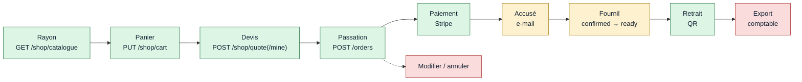

# Audit — le flux de commande, de bout en bout

> **Écrit le 2026-09-07, nettoyé le 2026-09-18 contre le code.** Méthode : lecture
> du **code**, pas des documents. Chaque constat porte sa preuve — un fichier, une
> ligne, ou l'absence d'un fichier. Périmètre : tout ce qu'une commande
> traverse, du rayon au retrait. Le **prix** est hors périmètre : il a son propre
> dossier et son propre audit ([`../pricing/ce-qui-reste-a-faire.md`](../pricing/ce-qui-reste-a-faire.md)).
>
> Ce que cet audit cherche : les endroits où **un écran affirme quelque chose
> que le système ne fait pas**. Pas les imperfections — les promesses non
> tenues.
>
> ⚠️ **Le nettoyage du 2026-09-18.** La version du 2026-09-07 empilait la photo
> du matin, le journal du chantier de l'après-midi (§6) et la fermeture de T12
> (§7) : pour savoir si un défaut était ouvert, il fallait lire trois sections et
> faire la soustraction. Chaque T a été **rouvert dans le code** et réécrit dans
> son état du jour ; ceux qui sont fermés tiennent en une ligne avec l'endroit où
> vit le remède. Le texte d'origine reste dans l'historique :
> `git show d285e715:documentation/order/audit-flux-de-commande.md`.
>
> La numérotation **T1–T12 est conservée** — d'autres documents la citent
> (`plan-idempotence-de-passation.md` renvoie à T12). Deux défauts nouveaux
> portent les numéros suivants.

---

## 1. La chaîne, et où elle s'arrête

| Maillon                | État | Ce qui existe vraiment (vérifié le 2026-09-18)                                                                                                       |
| ---------------------- | ---- | ---------------------------------------------------------------------------------------------------------------------------------------------------- |
| Rayon → panier → devis | ✅   | Panier en base, devis serveur. Un client reconnu est chiffré par `POST /shop/quote/mine`, à sa mercuriale.                                           |
| Passation              | ✅   | `POST /orders`, `POST /admin/orders`, la commande boutique. Société résolue **au serveur**. Idempotente côté client.                                 |
| Paiement               | ✅   | Payment Element monté sur le retour de passation, écran de règlement, webhook idempotent.                                                            |
| Accusé de réception    | 🟡   | Cinq courriels abonnés aux faits de commande. Mais **un compte sans adresse ne reçoit rien, en silence** (T14), et tout part en `fr`.                |
| Avancement             | 🟡   | 7 états déclarés, **4 écrits** (`placed`, `confirmed`, `ready`, `fulfilled`). Et `ready` sort du chiffre d'affaires (T13).                           |
| Retrait                | ✅   | Jeton émis pour les deux acheminements, scan ou saisie à la main, course arbitrée par la base, attestation au fournil.                               |
| QR côté client         | ✅   | Écran `mes-commandes/retrait/:id`, qui relit la commande au serveur.                                                                                 |
| Export comptable       | 🔴   | Nous n'émettons pas de facture (décision du 2026-09-10) ; l'export dont le comptable facture **n'existe pas**, et « Mes factures » est une maquette. |
| Modifier / annuler     | 🔴   | Aucune route. `cancelled` et `refunded` ne sont jamais écrits. Plan contredit, en attente de décisions.                                              |

---

## 2. Ce qui reste ouvert, par ce que se tromper coûte

### T7 — Une commande ne se modifie ni ne s'annule

Aucune route n'écrit `cancelled`, aucune n'écrit `refunded` (vérifié le
2026-09-18 : les seules écritures de statut du dépôt sont `confirmed`, `ready` et
`fulfilled` dans `prisma-order.repository.ts`, plus le `@default` `placed`).
Aucun avenant n'est codé ;
[`architecture-commande-immuable-avenants.md`](architecture-commande-immuable-avenants.md)
en tranche la conception.

Le plan existe et a été **contredit par `vitruve` le 2026-09-17 : 4 BLOQUANT,
7 SÉRIEUX**. Rien ne se bâtit avant qu'il soit refondu sur quatre décisions de
Hugo — l'état, les décisions et les directions sont dans
[`todo-annulation-de-commande.md`](todo-annulation-de-commande.md). Un de ses
constats concerne déjà le code en place : `markFulfilled` ne filtre que sur
`handedOverAt: null`, pas sur le statut — le jour où `cancelled` s'écrira, un
retrait au comptoir pourra l'écraser (S1 du TODO).

L'écran de confirmation ne promet plus rien de ce côté : il dit « appelez le
fournil ». C'est vrai, et ça le restera jusqu'à l'annulation.

### T8 — Requalifié : pas de facture à émettre, mais pas d'export non plus

**La moitié du constat d'origine est tombée par décision, pas par construction.**
Nous n'émettons pas de facture : le comptable importe nos commandes et sort la
facture mensuelle (2026-09-10, [`../comptabilite/prelevement-sepa.md`](../comptabilite/prelevement-sepa.md)).
Il n'y aura donc pas d'agrégat facture dans `b2b/accounting`.

Ce qui reste vrai, et qui coûte :

- **l'export dont il facture n'existe pas** — c'est le seul maillon manquant
  entre notre commande et la facture du client. Bloqué sur une question non
  technique (le format que son logiciel importe) :
  [`todo-export-des-commandes-pour-le-comptable.md`](todo-export-des-commandes-pour-le-comptable.md) ;
- **« Mes factures » affiche toujours les factures de personne.**
  [`factures-page.ts:10`](../../apps/lfc-ecommerce-frontend/src/app/client/mes-factures/factures-page/factures-page.ts)
  importe `MOCK_LEDGER` et `MOCK_STATEMENT_SUM`, et la route est servie
  (`app.routes.ts`, `mes-factures`). Des montants inventés, à côté de commandes
  réelles. Tant que l'export n'existe pas, l'écran n'a rien de vrai à lire : le
  retirer du menu coûte moins que le laisser mentir.

Deux autres maquettes restent branchées, sans argent : `mock-event.ts`
(l'opération datée de l'accueil public et de l'espace) et
`shop/mock-shelf-stories.ts` (les récits du rayon).

### T13 — NOUVEAU · Une commande prête sort du chiffre d'affaires

`ready` s'écrit depuis le 2026-09-07 (le scan de colisage). Les deux listes qui
disent quelles commandes « comptent » ne l'ont jamais appris (vérifié le
2026-09-18) :

- `REVENUE_ORDER_STATUSES`
  ([`revenue-scope.ts`](../../apps/lfd-api/src/b2b/growth/domain/revenue-scope.ts)) —
  `placed, confirmed, in_production, fulfilled`. Lue par **quatre** lecteurs de
  la croissance : métriques de commande, portefeuille, chiffre par secteur,
  volume de marché ;
- `COUNTED_STATUSES`
  ([`prisma-order-history.reader.ts:19`](../../apps/lfd-api/src/b2b/alerts/infrastructure/prisma-order-history.reader.ts)) —
  la même liste, recopiée, pour les alertes.

**Ce que ça coûte.** Une commande colisée et pas encore retirée disparaît des
graphes de chiffre d'affaires pendant l'intervalle, puis y revient au retrait.
Le matin d'une journée de service, quand tout est prêt et rien n'est parti, le
chiffre de la veille chute. Et une alerte « ce client n'a pas commandé » peut
se déclencher sur un client dont la commande est sur l'étagère.

**Le remède a deux temps.** Ajouter `ready` aux deux listes ; puis faire lire la
seconde à la première — deux copies d'une même règle ont déjà divergé une fois,
c'est comme ça que celle-ci est née.

### T14 — NOUVEAU · Un compte sans adresse commande, et ne reçoit rien

Relevé le 2026-09-17 en préparant la connexion Facebook
([`../auth-inscription/plan-connexion-sociale.md`](../auth-inscription/plan-connexion-sociale.md) §12), et
c'est un trou d'aujourd'hui, pas de demain.

Rien n'empêche un compte dont l'adresse est vide de passer commande. Le lecteur
de destinataire
([`prisma-order-recipient.reader.ts:23`](../../apps/lfd-api/src/b2b/orders/infrastructure/prisma-order-recipient.reader.ts))
rend alors `null` — à juste titre, un envoi voué au refus compterait comme parti —
et l'accusé ne part pas, **sans erreur ni trace**. Or c'est ce courriel qui porte
le QR de retrait. Le client n'a plus que l'écran de son espace.

La direction (demander l'adresse au panier, la même règle côté API) est au §12
du plan. Rien n'est construit.

🔴 **Et il manquait une moitié** (Hugo, 2026-09-22) : demander l'adresse ne
suffit pas, la commande doit la **porter**. Elle se lit aujourd'hui dans
l'annuaire au moment de l'envoi — changer son adresse réécrit donc le
destinataire d'une commande passée. Détail, et ce qu'il reste à trancher :
[`todo-adresse-de-la-commande.md`](todo-adresse-de-la-commande.md).

### T4 — 🟡 Quatre états écrits sur sept

[`public/orders.prisma`](../../apps/lfd-api/prisma/schema/public/orders.prisma)
déclare `draft · placed · confirmed · in_production · ready · fulfilled · cancelled`.

| État            | Qui l'écrit (vérifié le 2026-09-18)                                            |
| --------------- | ------------------------------------------------------------------------------ |
| `placed`        | le `@default` de la colonne                                                    |
| `confirmed`     | la clôture du plan du soir, pour toute une journée (`status: placed` en WHERE) |
| `ready`         | le scan du QR de colisage, à l'atelier                                         |
| `fulfilled`     | le retrait — scan du jeton, ou saisie à la main tracée `handedOverVia`         |
| `in_production` | **personne**                                                                   |
| `draft`         | **personne** — le brouillon de saisie vit dans sa table, `order_drafts`        |
| `cancelled`     | **personne** (T7)                                                              |

La livraison a son chemin vers `fulfilled` : le jeton est émis pour les deux
acheminements. `order.ready` et `order.handed_over` entrent au journal, en
best-effort par décision.

**Ce qui reste :** `in_production` n'a ni geste ni écrivain, et `draft` n'en
aura sans doute jamais — c'est une valeur d'enum qu'aucun chemin ne produit. Les
retirer serait une migration (valeur d'enum Postgres) ; les garder coûte que
chaque lecteur continue de les nommer.

### T9 — 🟡 La confirmation lit encore le navigateur, et plus rien ne l'y oblige

`ClientOrders` garde une liste locale, lue par la **confirmation**. « Mon
espace » et le menu lisent le serveur (`ClientOrderHistory`) depuis le
2026-09-07.

La raison de l'exception était écrite ici : `OrderView` ne portait pas la
ventilation de TVA, et basculer la confirmation sur le serveur aurait perdu de
l'information affichée. **Elle ne tient plus** :
`OrderView.vatShares` existe
([`contracts/src/order.ts`](../../packages/contracts/src/order.ts), interface
`OrderView`). Le JSDoc de `ClientOrders` dit toujours « Un jour,
`GET /orders/mine` remplacera cette liste » — rien ne l'en empêche désormais.

### T10 — L'abonnement ne produit aucune commande

Inchangé. `fromSubscriptionId` et `recurringDeltas` sont **lus** — l'origine
d'une commande
([`order-origin.ts`](../../apps/lfd-api/src/b2b/orders/domain/services/order-origin.ts)),
la part récurrente du tableau de bord
([`order-metrics.ts`](../../apps/lfd-api/src/b2b/growth/domain/order-metrics.ts)) —
et **écrits nulle part**. Il n'y a ni `@Cron`, ni `ScheduleModule`, ni aucun
planificateur dans l'API (vérifié le 2026-09-18).

La part « récurrent » du tableau de bord croissance vaut donc structurellement
**0 €**, et l'affiche comme un fait.

### T11 — 🟡 Les quantités sont bornées, le stock n'existe pas

Borné au contrat : `MAX_LINE_QUANTITY = 10 000` et `MAX_ORDER_LINES = 100`
([`contracts/src/order.ts`](../../packages/contracts/src/order.ts)), une seule
définition réutilisée par toutes les portes d'écriture et d'estimation.

Aucun module d'inventaire : rien ne dit qu'un article est disponible, rien ne
décrémente à la passation. La limite de la boutique publique est en conception
(`../b2b/`, commits du 2026-09-17 : « pas de limite à J+N, le stock à J ») —
rien n'est codé.

### T12 — 🟡 Fermé pour le client, ouvert à ses bords

`POST /orders` et la commande boutique sont idempotents — clé au contrat,
table `order_idempotency`, résolution dans la transaction qui écrit la commande.
Plan et contradiction : [`plan-idempotence-de-passation.md`](plan-idempotence-de-passation.md).

Trois bords restent ouverts :

- **`POST /admin/orders` ne l'est pas**, par décision : sa réponse porte un
  `settlement` que rien en base ne stocke, et un rejeu le dériverait faux ;
- **les clés n'ont pas de fin** : seules les réclamations abandonnées sont
  rendues (`deleteMany … orderId: null`), et l'API n'a pas de planificateur ;
- **deux onglets font deux clés**, donc deux commandes — correct au sens strict,
  probablement faux au sens du client.

### T3 — reste · La langue du client n'est choisie par personne

L'accusé existe (§3), dans trois langues côté API — mais `User` ne porte aucune
préférence, et l'envoi passe `DEFAULT_MAIL_LOCALE`. Un client anglophone reçoit
du français.

---

## 3. Ce qui a été fermé, et où vit le remède

| #   | Le défaut d'origine                                          | Fermé le   | Où le vérifier                                                                                                         |
| --- | ------------------------------------------------------------ | ---------- | ---------------------------------------------------------------------------------------------------------------------- |
| T1  | La confirmation faisait cinq promesses fausses               | 2026-09-07 | `copy/fr.ts` : deux tenues (paiement, QR), trois retirées (reçu, facture, « modifiable jusqu'à 22 h »)                 |
| T2  | Une commande client restait `pending`, personne ne la payait | 2026-09-07 | `client-orders.service.ts` lit `placed.payment` ; route `nouvelle-commande/reglement/:id`                              |
| T3  | Rien n'accusait réception                                    | 2026-09-07 | `send-order-placed-mail.handler.ts`, puis réglé, prêt, paiement refusé, avis invité — voir la note ci-dessous          |
| T5  | Un client rattaché commandait au tarif public, par carte     | 2026-09-08 | `companyId` a quitté le contrat : `resolveCompany` (`platform/auth/resolve-company.ts`), devis `POST /shop/quote/mine` |
| T6  | Le QR descendait au navigateur, aucun écran ne l'affichait   | 2026-09-07 | route `mes-commandes/retrait/:id`, `RetraitPage`                                                                       |
| T11 | Quantités non bornées (première moitié)                      | 2026-09-07 | `orderQuantitySchema`, `MAX_LINE_QUANTITY`, `MAX_ORDER_LINES`                                                          |
| T12 | `POST /orders` n'était pas idempotent (pour le client)       | 2026-09-07 | `prisma-order-idempotency.store.ts`, `prisma-shop-order-idempotency.store.ts`                                          |

**T5, parce qu'il a coûté une requalification.** Il avait été rangé parmi les
lots « sans conception », et ne l'était pas : envoyer la société change le prix
**et** le règlement, alors que le devis de la boutique était public. La sortie a
fermé les deux questions qu'il ouvrait — le devis d'un client reconnu passe par
`POST /shop/quote/mine`, et quand une personne est membre de **plusieurs**
sociétés, la requête doit déclarer laquelle : sans déclaration, `null`, jamais
« la première ». L'espace perso déclaré est ouvert sans condition (Hugo,
2026-09-15).

**T3, parce que sa forme a bougé depuis.** L'accusé ne part plus à la passation
quand le règlement est par carte : rien ne part tant que le règlement n'est pas
**décidé** (Hugo, 2026-09-17). ⚠️ Deux des courriels de la chaîne —
`send-order-settled-mail.handler.ts` et `send-payment-failed-mail.handler.ts` —
ne sont **pas encore commités** au 2026-09-18 : ils existent dans l'arbre de
travail, pas sur `dev`.

---

## 4. Ce qui est solide, et qu'il ne faut pas toucher

Relu le 2026-09-18.

- **L'agrégat `Order` possède son argent.** Sous-total, TVA et total ne sont
  calculés qu'à un endroit (`ventilateVat`), et la ventilation par taux est
  **figée** (`vat_shares`). Le commentaire du schéma qui recopiait la formule a
  été retiré plutôt que corrigé.
- **La société se résout au serveur.** Le navigateur ne peut plus choisir le
  tenant d'une commande : le champ n'existe plus au contrat.
- **Une seule façon de composer un panier.** `OrderDrafting` est partagé par le
  client et le back-office : remise de retrait, zone et heure limite ne
  divergent pas entre les deux portes.
- **Ce qui est figé l'est pour la bonne raison.** L'acheminement convenu porte
  sa provenance champ par champ, et la fiche ne relit plus le carnet d'adresses ;
  les allergènes distinguent « on ne sait pas » de « aucun » ; la trace de prix ne
  se relit jamais.
- **Le retrait est arbitré par la base, deux fois.** L'attestation vit au fournil
  (`production.order_handover`, contrainte d'unicité) ; le commerce en recopie
  l'instantané par `markFulfilled`, filtré sur `handedOverAt: null`, pour qu'un
  abonné rappelé ne réécrive pas l'attestation.
- **Le webhook Stripe est idempotent.** `updateMany` filtré sur
  `paymentStatus: pending` : un rejeu ou un intent inconnu est un no-op, et un
  `paid` ne redescend jamais.
- **L'e2e de passation** : `orders.e2e-spec.ts` porte **27** `it` au
  2026-09-18 — le mur non-membre, le coursier hors zone, le retrait sans point,
  la fusion de deux lignes du même SKU, l'estampille de version du catalogue, le
  gel des allergènes. L'idempotence a sa suite, course comprise.

---

## 5. Ce que ce document n'affirme pas

- **Aucun test n'a été lancé pour ce nettoyage.** Les constats sont des lectures
  de code ; une lecture peut manquer un branchement.
- **L'arbre de travail est compté, pas seulement `dev`.** Ce qui n'est pas
  commité est signalé là où ça compte (§3, T3).
- **Le prix n'a pas été réaudité** : les défauts de
  [`../pricing/ce-qui-reste-a-faire.md`](../pricing/ce-qui-reste-a-faire.md) ne sont pas repris ici.
- **La topologie de `architecture-flux-commande-prod.md` n'a pas été
  revérifiée.**
- **Le « chemin » par lots de la version d'origine est retiré.** Ses lots 1 à 7
  sont faits ; ce qui reste (annulation, export, planificateur, stock) a chacun
  son document ou sa TODO, et un ordre de marche recopié ici divergerait de
  ceux-là.
