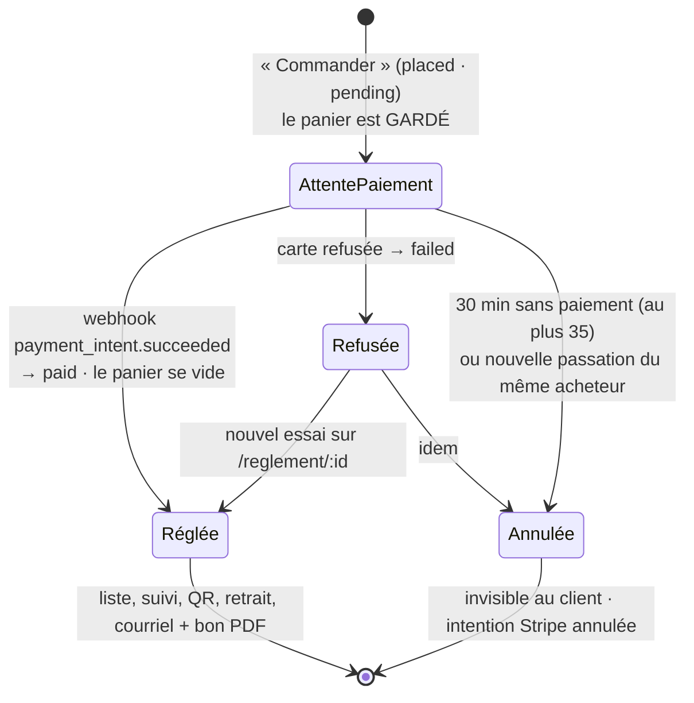

# Une commande carte n'existe qu'une fois réglée

> ✅ **Bâti le 2026-10-09**, après un constat de production d'Hugo (quatre
> commandes pour une seule payée ; une commande « à régler » en carte de suivi
> avec son QR ; le comptoir qui ne vérifiait pas le règlement). Ce document
> décrit l'état du code ; il remplace les plans « commandes non réglées » et
> « carte réglée avant tout », relus par `vitruve` et supprimés.

## 1. La règle

Une commande dont le règlement est dû **par carte** et n'est pas `paid` n'a,
pour le client et pour le comptoir, **ni liste, ni suivi, ni QR, ni retrait, ni
courriel de confirmation**. Elle n'existe que le temps d'être payée, sur la page
de règlement où mène la passation.

« Réglée » = `paymentStatus ∈ { paid, not_required }` — `isSettled`
(`packages/contracts/src/order-settlement.values.ts`), une seule définition lue
par le serveur, la vue client et la boutique. Une commande au compte ou
gratuite naît `not_required` : elle est réglée en naissant.

## 2. La vie d'une commande carte

| Ce qui se passe                      | Où                                                                                                                                                       |
| ------------------------------------ | -------------------------------------------------------------------------------------------------------------------------------------------------------- |
| Le panier n'est vidé qu'au paiement  | `client-orders.service.ts` (`CART_AWAITING_KEY`, `markPaid`)                                                                                             |
| Expiration à 30 min                  | `UnsettledShopOrderExpiry` (`b2b/orders/application/services/`), cron `*/5` de `container/worker.ts` → `POST /admin/orders/unsettled-shop-orders/expire` |
| Remplacement à la nouvelle passation | `replace-unsettled-shop-orders.handler.ts` (abonné à `OrderPlacedEvent`, ne refuse jamais la passation)                                                  |
| Causes `expired` / `replaced`        | `order-payment-failed.event.ts` — **aucun courriel** pour elles                                                                                          |
| Ni liste ni suivi au client          | `CUSTOMER_VISIBLE` (`prisma-order.reader.ts`) : `paymentStatus` ∉ { pending, failed }                                                                    |
| Pas de jeton de retrait exposé       | `exposedHandoverToken` — vue client, bons PDF client et admin, courriels                                                                                 |
| Bon PDF sans QR jamais archivé       | `order-sheet-archive.service.ts` : rendu à la demande tant qu'il n'y a pas de jeton                                                                      |
| Refus au comptoir, absent de la file | `handoverBlocker` (`handover/domain/services/handover.ts`) ; `HandoverSubject.settled` par le canal `handover/channels/commerce/`                        |
| Courriel de confirmation + bon       | au paiement (`send-order-settled-mail.handler.ts`), jamais à la passation d'une carte                                                                    |
| Chiffre d'affaires du cockpit        | `REVENUE_PAYMENT_STATUSES` (`b2b/growth/domain/revenue-scope.ts`) : `not_required`, `paid`                                                               |

## 3. Le périmètre de l'expiration et du remplacement

Seulement les commandes qu'un **particulier passe lui-même** à la boutique
(passation boutique, PaymentIntent direct, sans société, sans staff) —
`unsettled-shop-order.where.ts`. Hors périmètre, elles gardent le balayage de
clôture du jour : une commande saisie par le staff pour un client (il paie le
lien quand il le lit), une commande réglée par lien Checkout, une commande de
société.

Si l'annulation de l'intention Stripe répond « en cours » ou « déjà payée »,
la commande est **gardée** — elle est en train d'être payée. Stripe
injoignable : rien n'est écrit, le passage suivant réessaie.

## 4. Ce qui reste

- **L'accusé au paiement n'est pas durable** : il écoute un fait en mémoire ;
  un redémarrage au mauvais moment le perd —
  [`todo-accuse-au-paiement-durable.md`](todo-accuse-au-paiement-durable.md).
- **Une commande saisie par le staff et payée en caisse** n'a aucun geste
  « payé sur place » : le comptoir la refuse. Décision d'Hugo attendue.
- Un remboursement partiel reste compté en entier dans le chiffre d'affaires.
