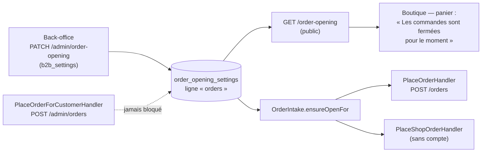

# L'ouverture de la boutique à la commande

> État au 2026-10-09 — **implémenté** (non commité à l'écriture). Demande de
> Hugo du 2026-10-09 ; remplace la clé `shop` de l'accès aux fonctionnalités,
> retirée le même jour (`63fde9aac`).

## Ce que c'est

Un réglage global, **une case par clientèle** : la boutique prend-elle les
commandes des **pros** ? des **particuliers** ? Il se pose dans le back-office,
« E-commerce LFC → Réglages → Ouverture de la boutique ».

**Fermée = le catalogue et les prix restent visibles, les commandes sont
refusées.** Rien d'autre ne change : une commande déjà passée garde son suivi,
son règlement et son QR de retrait.

| Clientèle   | Qui c'est (règle `audienceOf`, la même que la remise et la livraison) |
| ----------- | --------------------------------------------------------------------- |
| pros        | une personne qui agit pour une société **active**                     |
| particulier | l'espace perso, une société non validée, une commande sans compte     |

## Où c'est appliqué

- **Le serveur refuse** en **409** `orders.closed_for_audience`, avec « La
  boutique ne prend pas de commandes des pros / des particuliers pour le
  moment. Le catalogue reste consultable : réessayez plus tard. » Le refus a
  lieu **avant** toute composition : la clé d'idempotence est rendue, et la
  commande sans compte n'inscrit pas de porteur. Un **rejeu** d'une commande
  déjà passée sous la même clé passe toujours.
- **Le staff n'est jamais bloqué** : `OrderIntake` n'est appelé que par les
  deux passations client, et pas par `OrderDrafting`, que la saisie de
  l'équipe partage. Une commande prise au téléphone se saisit boutique fermée.
- **Le devis et le panier ne sont pas gardés** : ils calculent des prix, ce
  que la fermeture laisse voir ; la commande se décide à la passation.
- **La boutique** lit `GET /order-opening` (`OrderOpeningStore`) et remplace,
  dans le pied du panier, le bouton de commande par la phrase. Tant que le
  réglage n'est pas lu, ou si sa lecture échoue, ou tant que la clientèle de
  la personne n'est pas connue, le bouton reste : le serveur garde la porte.

## Le modèle

Un réglage sans transition ni invariant : un CRUD honnête (CLAUDE.md §3.1),
calqué sur « Livraison » (`delivery_settings`). Sa **propre table**,
`order_opening_settings`, et non deux colonnes de `delivery_settings` : celle-ci
est le réglage de la livraison, et y loger la commande aurait fait de chaque
geste de l'un une réécriture de l'autre.

| Colonne                                                     | Sens                            |
| ----------------------------------------------------------- | ------------------------------- |
| `key`                                                       | toujours `orders`               |
| `orders_open_to_b2b`, `orders_open_to_b2c`                  | `BOOLEAN NOT NULL DEFAULT true` |
| `updated_at`                                                | instant du geste, lu du `Clock` |
| `updated_by_staff_id`, `updated_by_name`, `updated_by_role` | l'auteur, figé au geste         |

**Ligne absente = ouverte aux deux** : rien ne se ferme au déploiement
(migration `20261009120000_l_ouverture_de_la_boutique`, additive). Le droit
est celui de « Livraison », `b2b_settings` ; la migration n'en accorde aucun.

Chaque bascule écrit `order_opening.updated` au journal — l'état posé et
l'état remplacé de chaque clientèle —, rangé sous « commandes », et le
back-office le dit : « Colette Martin a fermé les commandes aux particuliers ;
elles restent ouvertes aux professionnels ».

## Code

- `apps/lfd-api/src/b2b/order-opening/` — le réglage (domaine, ports, routes).
- `apps/lfd-api/src/b2b/orders/application/services/order-intake.service.ts`
  — la garde ; l'erreur dans `domain/errors/orders-closed-for-audience.error.ts`.
- `packages/contracts/src/order-opening{,.values}.ts` — vues, défaut,
  `ordersOpenTo`, code du refus (sans zod pour la boutique, par `shop-values`).
- Back-office : `b2b/reglages/order-opening-page/`.
- Boutique : `client/shop/order-opening.store.ts`, pied de `cart-dialog`.

## Ce qui reste

- `POST /shop/orders` n'est pas servie (contrôleur non enregistré) : la
  commande sans compte est gardée au handler, éprouvée par l'e2e
  `order-opening.e2e-spec.ts` sans passer par HTTP.
- La boutique ne relit pas le réglage pendant la session : une fermeture se
  voit au prochain chargement ; entre-temps, le serveur refuse.
