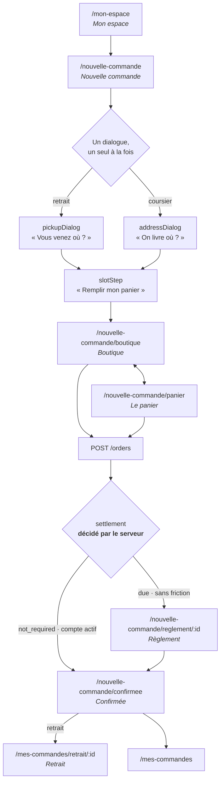

# Le parcours client — écrans et textes

**Écrit le 2026-09-07.** L'état **réel** du code au 2026-09-07, pas une cible.
Chaque texte cité est une clé de `apps/lfc-B2B-platform-frontend/src/app/client/copy/`
et chaque route existe dans `app.routes.ts`.

Il couvre la route **sans friction** (aucune société — la carte) et la route
**compte actif** (société avec terme — le compte). Les deux partagent huit
écrans sur neuf : elles ne divergent qu'à la passation, et c'est le serveur qui
tranche.

> **À quoi ça sert.** Le bon de commande ([`architecture-bon-de-commande.md`](architecture-bon-de-commande.md))
> se rend au bout de ce parcours, et le courriel de confirmation en reprend le
> récap **mot pour mot**. Écrire le gabarit sans cette carte, c'est réécrire les
> phrases — et deux formulations de la même commande font douter qu'il s'agisse
> de la même commande.

---

## 1. La chaîne



**Le seul embranchement du parcours est `settlement`, et l'écran ne le calcule
pas.** Il arrive dans la réponse de passation. Un front qui déduirait « cette
société a un terme, donc pas de carte » réinventerait une règle que le serveur
tient déjà — et se tromperait le jour où un terme change entre deux écrans.

---

## 2. Écran par écran

Chrome = le `kicker` posé sur l'en-tête (`ClientChrome`). « ← » = la flèche de
retour ; `null` signifie qu'il n'y en a pas.

### `/mon-espace` — le point d'atterrissage

`client/mon-espace/espace-page/` · chrome `kickerWelcome` « Bienvenue » · ←`null`

L'écran répond à **une** question : qu'est-ce qui m'attend aujourd'hui ?

| Rôle    | Clé                             | Texte                                                                 |
| ------- | ------------------------------- | --------------------------------------------------------------------- |
| titre   | `espace.today[n]`               | « Une chose aujourd'hui. » / « Deux… » / « Trois… »                   |
| vide    | `espace.todayNone`              | « Rien ne vous attend. »                                              |
| chapeau | `espace.lead`                   | « Ce qui appelle une action, et rien d'autre. »                       |
| vide    | `espace.leadNone`               | « Tout est réglé. On remet ça quand vous voulez. »                    |
| puits   | `espace.wellTitle` / `wellNote` | « Prêt pour vous » — « — ce qui attend une action, et rien d'autre. » |
| entrée  | `nav.newOrder` / `newOrderSub`  | « Nouvelle commande » — « Retrait ou coursier, vous choisissez »      |

Les tuiles du puits sont les **reprises** : `pickupTitle` (« Retirer ma
commande » → `pickupAction` « Mon QR »), `cartTitle` (« Panier en attente » →
`cartAction` « Finir »), `invoiceTitle` (« Facture de mars » → `invoiceAction`
« Régler »). Une seule des trois est une entrée de commande ; les deux autres
sont des sorties de commandes précédentes.

⚠️ `espace.proDiscount` / `proMonth` / `proKbis` composent la carte « Votre
compte pro ». C'est le **seul endroit du parcours** où la distinction sans
friction / compte actif est visible avant la passation.

### `/nouvelle-commande` — la première question

`client/nouvelle-commande/commande-page/` · chrome `kickerCommande` « Nouvelle commande »

| Rôle    | Clé                                                         | Texte                                                                                                     |
| ------- | ----------------------------------------------------------- | --------------------------------------------------------------------------------------------------------- |
| titre   | `commande.title`                                            | « Bonjour {name}.\nOn vous sert comment ? »                                                               |
| anonyme | `commande.titleAnonymous`                                   | « Bonjour.\nOn vous sert comment ? »                                                                      |
| chapeau | `commande.intro`                                            | « Vous choisissez, nous préparons. »                                                                      |
| carte 1 | `commande.pickupTitle` / `pickupDetail` / `pickupCta`       | « Je passe\nle prendre » · « Au Labo ou dans une boutique de station. » · « Choisir un point de retrait » |
| carte 2 | `commande.deliveryTitle` / `deliveryDetail` / `deliveryCta` | « On vous\nl'apporte » · « Demain, au créneau que vous choisissez. » · « Choisir une adresse »            |
| sortie  | `commande.browseTitle` / `browseSub`                        | « Je visite la boutique » — « Pour voir les produits et décider ensuite »                                 |

**Le mode de service précède le catalogue, et ce n'est pas un ordre d'écran** :
le prix et l'heure en dépendent. `commande.browseTitle` est la seule porte qui
le contourne, et elle ramène à cette question au moment de régler
(`shop.pickService` — « Où êtes-vous servi ? · Le prix et l'heure en dépendent —
dites-le avant de régler. »).

### Les dialogues — un seul ouvert à la fois

`dialog = signal<'pickup' | 'address' | null>` : l'exclusion est portée par le
type, pas par une garde.

| Dialogue        | Titre               | Chapeau                                                                            | Sortie                                  |
| --------------- | ------------------- | ---------------------------------------------------------------------------------- | --------------------------------------- |
| `pickupDialog`  | « Vous venez où ? » | « On aime vous recevoir : retirez sur place et profitez d'une remise de {value}… » | `cta` « Choisir mon heure »             |
| `addressDialog` | « On livre où ? »   | champs Rue / CP / Ville, « Qui reçoit », `whyPhone`                                | `cta` « Choisir mon créneau · {fee} € » |
| `slotStep`      | —                   | `pickupIntro` « À retirer {place}. Le créneau vous garde la fournée. »             | `cta` « **Remplir mon panier** »        |

Deux textes à ne pas perdre, parce qu'ils disent **pourquoi** au lieu de
seulement quoi : `addressDialog.whyPhone` (« le coursier appelle ce numéro s'il
ne trouve pas la porte ») et `addressDialog.outOfZoneNote` (« On ne descend pas
encore jusque-là. Le retrait, lui, reste ouvert. ») — un refus qui nomme la
sortie.

### `/nouvelle-commande/boutique` — la vitrine

`client/shop/shop-page/` · chrome `kickerShop` « Boutique » · ← ramène à la question

Grille, pas liste. Le panier est un **tiroir** : trois nombres au bandeau
(`shop.cartBar` « {count} pièces au panier »), le détail à un geste.

| Rôle       | Clé                             | Texte                                                                                        |
| ---------- | ------------------------------- | -------------------------------------------------------------------------------------------- |
| recherche  | `shop.searchPlaceholder`        | « Chercher une baguette, un éclair… »                                                        |
| chargement | `shop.loading`                  | « Le rayon arrive… »                                                                         |
| échec      | `shop.loadFailedHint`           | « Le réseau n'a pas répondu. Rien n'est perdu : votre panier vous attend. »                  |
| vide       | `shop.emptyTitle` / `emptyHint` | « Rien sous ce nom. » — « Essayez « pain », « tarte », ou touchez un rayon. »                |
| panier nu  | `shop.cartEmpty`                | « Panier vide. La fournée du matin part vite — le ski praliné ne fait jamais l'après-midi. » |
| régler     | `cart.pay`                      | « Régler ma commande · {total} »                                                             |

On peut **régler depuis le rayon** : le panier est sous les yeux en permanence,
et en sortir pour y revenir serait une étape inventée. Se connecter n'est pas un
échec du parcours mais son étape suivante — `auth.login('/nouvelle-commande/boutique')`
et le panier survit à l'aller-retour.

### `/nouvelle-commande/panier` — relire

`client/cart/panier-page/` · chrome `kickerCart` « Le panier »

| Rôle     | Clé                                                    | Texte                                                                                                |
| -------- | ------------------------------------------------------ | ---------------------------------------------------------------------------------------------------- |
| titre    | `cart.title`                                           | « Votre commande »                                                                                   |
| chapeau  | `cart.intro`                                           | « Relisez, ajustez, réglez. La fournée se cale sur votre créneau. »                                  |
| décompte | `cart.subtotal` / `discount` / `fee` / `vat` / `total` | « Sous-total HT » · « Remise retrait {at} −{value} » · « Coursier » · « TVA {rate} » · « Total TTC » |
| bouton   | `cart.pay`                                             | « Régler ma commande · {total} »                                                                     |
| note     | `cart.payHint`                                         | « Paiement en ligne. Vous présentez votre QR au comptoir, rien à régler sur place. »                 |

🔴 **`cart.payHint` n'est vrai que sur la route sans friction.** Sur un compte à
terme, rien n'est réglé en ligne : la commande part au compte. Le texte est
posé sans condition dans le dictionnaire. C'est le même défaut que celui corrigé
sur la confirmation — voir §4.

### `/nouvelle-commande/reglement/:id` — **route sans friction seulement**

`client/nouvelle-commande/reglement-page/` · chrome `kickerPay` « Règlement »

L'écran porte l'**identifiant de la commande** : elle existe déjà quand on
arrive ici. L'adresse survit donc à un rechargement et se rouvre plus tard sur
une commande restée à payer — ce qu'un panneau dans le panier n'aurait tenu ni
l'un ni l'autre.

| Rôle     | Clé                      | Texte                                                                                                                              |
| -------- | ------------------------ | ---------------------------------------------------------------------------------------------------------------------------------- |
| titre    | `pay.title`              | « Il reste à régler. »                                                                                                             |
| chapeau  | `pay.lead`               | « Votre commande {ref} est enregistrée. Elle part en fabrication une fois réglée. »                                                |
| montant  | `pay.amount`             | « Montant à régler »                                                                                                               |
| bouton   | `pay.submit`             | « Payer {total} »                                                                                                                  |
| sortie   | `pay.later`              | « Régler plus tard »                                                                                                               |
| indispo. | `pay.unavailable`        | « Le paiement est indisponible pour l'instant. Votre commande est enregistrée : vous pourrez la régler depuis « Mes commandes ». » |
| refus    | `pay.refused` / `failed` | « Le paiement a été refusé. » / « Le paiement n'a pas pu être finalisé. »                                                          |

**Une porte de sortie existe** (`pay.later`) et c'est délibéré : la commande est
déjà écrite, la retenir derrière un paiement ne la ferait pas exister davantage.

### `/nouvelle-commande/confirmee` — les trois régimes

`client/nouvelle-commande/confirmation-page/` · chrome `kickerDone` « Confirmée » · ←`null`

**Trois `settlement`, trois titres, trois libellés de total** — et l'écran nomme
l'état, il ne l'invente pas :

| `settlement`   | Route            | Titre (`done.*`)                                                      | Ligne de total                       |
| -------------- | ---------------- | --------------------------------------------------------------------- | ------------------------------------ |
| `paid`         | sans friction    | `title` « C'est réglé.\nOn s'y met à 4 h 15. »                        | `paidOnline` « Réglé en ligne »      |
| `due`          | sans friction    | `titleDue` « Commande enregistrée.\nIl reste à la régler. »           | `toSettle` « Reste à régler »        |
| `not_required` | **compte actif** | `titleAccount` « Commande enregistrée.\nElle part sur votre compte. » | `onAccount` « Porté à votre compte » |

Le récap, dans l'ordre exact du gabarit — **c'est lui que le courriel doit
reprendre** :

```
Retrait | Livraison       {place} · {slot}      done.recapPickup / recapDelivery
Contenu                   {count} pièces        done.recapContent / recapPieces
[Remise retrait {at} −{value}]  −{montant}      cart.discount        si ≠ 0
[TVA {rate}]                     {montant}      cart.vat             une ligne par taux
─────────────────────────────────────────────
{libellé selon settlement}       {total TTC}    done.paidOnline|toSettle|onAccount
```

Actions, dans l'ordre : « Régler maintenant » (`settleAction`, si `due`), « Voir
mon QR de retrait » (`qr`, **si retrait seulement** — une livraison n'a pas de
comptoir), puis `changeNote` : « Un changement ? Appelez le fournil — une
commande passée entre en fabrication. »

L'encart annonce ce qui est vrai — `keptTitle` « Gardée dans votre espace » /
`keptLine` « Retrouvez-la, avec son QR de retrait, dans « Mes commandes ». »

🔴 **Le courriel ne reprendra pas ce bouton, il portera le QR lui-même.** Un
bouton demande d'ouvrir l'app, d'être encore connecté et de retrouver la
commande — exactement ce qu'on n'a pas le temps de faire debout devant un
comptoir. Le courriel est déjà ouvert. Et il vaut pour les **deux**
acheminements : en livraison, le destinataire montre le même code et c'est le
coursier qui scanne. Le mécanisme, ce qu'il atteste et ce qui le rend
infalsifiable sont au §3 de
[`architecture-bon-de-commande.md`](architecture-bon-de-commande.md) — avec
l'avertissement que le jeton de livraison **n'existe pas encore**.

### `/mes-commandes/retrait/:id` — le code

`client/mes-commandes/retrait-page/` · chrome `kickerQr` « Retrait »

| Rôle        | Clé              | Texte                                                                  |
| ----------- | ---------------- | ---------------------------------------------------------------------- |
| titre       | `qr.title`       | « Votre QR de retrait »                                                |
| chapeau     | `qr.lead`        | « Présentez ce code au comptoir. C'est nous qui le scannons. »         |
| livraison   | `qr.delivery`    | « Cette commande vous est livrée : il n'y a pas de code à présenter. » |
| sans code   | `qr.unavailable` | « Aucun code à présenter pour cette commande. »                        |
| introuvable | `qr.unknown`     | « Cette commande est introuvable. »                                    |

Quatre états, quatre phrases : l'écran dit **pourquoi** il n'y a pas de code au
lieu d'afficher un cadre vide. Il vit sous `mes-commandes/` et non sous
`nouvelle-commande/` parce qu'on le rouvre le lendemain matin.

---

## 3. Les deux routes, côte à côte

|                       | Sans friction                           | Compte actif                |
| --------------------- | --------------------------------------- | --------------------------- |
| `companyId` envoyé    | `null`                                  | l'identifiant de la société |
| Le mur porte sur      | l'auteur                                | l'appartenance à la société |
| `settlement` rendu    | `due` puis `paid`                       | `not_required`              |
| Écran de règlement    | **oui**                                 | jamais atteint              |
| Titre de confirmation | `title` / `titleDue`                    | `titleAccount`              |
| Ligne de total        | « Réglé en ligne » / « Reste à régler » | « Porté à votre compte »    |
| Écrans traversés      | 9                                       | 8                           |

**Un seul écran diffère.** Tout le reste — vitrine, panier, décompte, récap, QR —
est identique, et doit le rester : c'est ce qui permet à un client de passer
d'un régime à l'autre le jour où sa société est validée sans réapprendre le
parcours.

---

## 4. Ce que ce parcours dit encore de travers

| #   | Où                                        | Le problème                                                                                                                                                                                                       |
| --- | ----------------------------------------- | ----------------------------------------------------------------------------------------------------------------------------------------------------------------------------------------------------------------- |
| 1   | `cart.payHint`                            | « Paiement en ligne… rien à régler sur place » s'affiche **aussi** sur un compte à terme, où rien n'est payé en ligne. Il faut la variante.                                                                       |
| 2   | Aucun courriel                            | `done.keptLine` ne promet plus de reçu — c'est honnête, mais **rien ne part**. Aucun gabarit `customer.order-placed` n'existe (T3 de l'audit). Quand il partira, il portera le QR **dans le corps**, pas un lien. |
| 2b  | Livraison, aucun code                     | `qr.delivery` dit « il n'y a pas de code à présenter » — vrai aujourd'hui, et c'est le défaut : rien n'atteste qu'une livraison a changé de mains. `issuesHandoverToken()` n'émet que pour le retrait.            |
| 3   | `done.title` « On s'y met à 4 h 15 »      | Une heure **en dur** dans le dictionnaire, quel que soit le créneau choisi.                                                                                                                                       |
| 4   | `espace.invoiceTitle` « Facture de mars » | Une donnée de maquette dans le dictionnaire de production. Même famille que 3.                                                                                                                                    |

Le 1 et le 2 se corrigent dans le même geste que le bon de commande : le premier
est une variante de texte, le second consomme le rendu `mail-html`.

Les 3 et 4 sont d'une autre nature — **une valeur métier logée dans un
dictionnaire de langue**. Une phrase à trous (`« On s'y met à {time}. »`) coûte
trois traductions ; une heure en dur coûte un appel au fournil le jour où un
client se présente à 4 h 15.

---

## 5. La règle du dictionnaire, et pourquoi elle tient

Les trois langues sont un **`Record` exhaustif** sur `ClientCopy` : ajouter une
phrase casse la compilation tant que `fr`, `en` et `it` ne l'ont pas. C'est ce
qui fait qu'aucun écran ne s'affiche à moitié traduit.

🔴 **Ce garde-fou doit valoir pour le courriel aussi.** Un gabarit qui écrit ses
propres phrases sort du `Record`, donc du filet : il partira en français à un
client italien, et personne ne le saura avant qu'il le dise. Le gabarit prend
ses textes du même dictionnaire — c'est la seule forme qui tienne.
