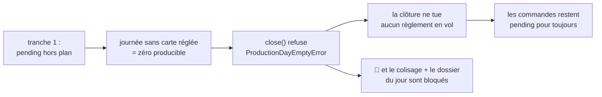
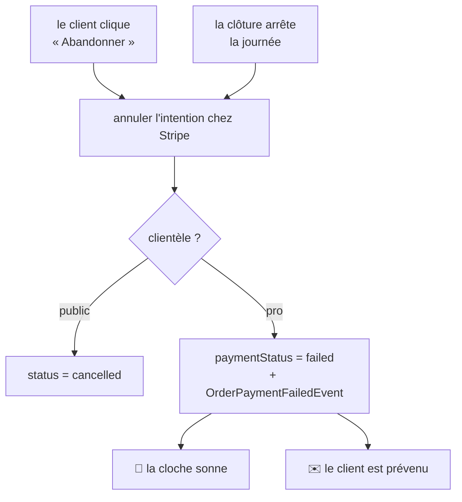

# Plan — l'abandon du règlement

> **Ouvert le 2026-09-22**, à un constat de Hugo : « en perso il y avait un "je
> règle depuis mes commandes" qui m'a envoyé sur la confirmation de commande
> alors que je n'avais pas réglé, ce n'est pas possible ».
>
> 🔴 Touche **l'argent** et **le compte de production** → `vitruve` obligatoire
> (CLAUDE.md §9 bis). **Passé une première fois le 2026-09-22 : 5 BLOQUANT,
> 9 SÉRIEUX, 5 MINEUR.** Ce document est la version d'après ; le §9 dit ce que
> chaque objection est devenue. **Il doit repasser à `vitruve` avant d'être
> bâti** — sa forme a changé sur trois décisions prises après l'audit.

---

## 1. Le constat

L'écran `/reglement/:id` porte « Payer {total} » et une sortie nommée **« Je
règle depuis "Mes commandes" »** ([`fr.ts:295`](../../apps/lfc-ecommerce-frontend/src/app/client/copy/fr.ts)).
La sortie appelle `later()`, qui **ne marque rien** et mène à la confirmation.

Trois choses fausses (ouvertes et vérifiées le 2026-09-22) :

| #   | Ce qui est faux                                                                                                                                                            |
| --- | -------------------------------------------------------------------------------------------------------------------------------------------------------------------------- |
| 1   | Le libellé se lit comme une action de paiement ; c'est un abandon.                                                                                                         |
| 2   | Il nomme un lieu où l'on ne peut pas régler : **rien dans `/mes-commandes` ne mène à `/reglement/:id`**.                                                                   |
| 3   | La ligne d'historique affiche « Carte » pour une commande `pending` ([`order-rows.ts:249`](../../apps/lfc-ecommerce-frontend/src/app/client/mes-commandes/order-rows.ts)). |

⚠️ **Correction d'une affirmation que ce plan a portée le 2026-09-22** : « la
destination promise n'existe pas » était **à moitié faux**. La page de
confirmation porte bien « Régler maintenant » → `/reglement/:id`
([`confirmation-page.ts:165`](../../apps/lfc-ecommerce-frontend/src/app/client/commande/confirmation-page/confirmation-page.ts)).
Un chemin de retour existe ; il n'est pas là où le bouton l'annonce. Le bouton
est **mal nommé**, pas menteur sur l'existence du chemin.

⚠️ **Le libellé avait déjà été corrigé une fois**, le 2026-09-21, de « Régler
plus tard ». La leçon n'est pas dans le mot : on a deux fois écrit une phrase
sans ouvrir la destination qu'elle nomme.

### Pourquoi on ne corrige pas en affichant « à régler »

`OrderPayment` n'a que deux valeurs, et son commentaire assume : « un troisième
état "à régler" décrirait une commande livrée que personne n'a payée — ça
n'existe pas dans ce commerce ». **Vrai comme intention, faux comme fait** : la
sortie fabrique exactement cet état.

🔴 **Hugo, 2026-09-22** : « on ne peut pas avoir une due, soit on paye public,
soit c'est au compte en pro ». Afficher l'état l'installerait au lieu de le
fermer.

---

## 2. Les quatre décisions de Hugo (2026-09-22)

| #      | La décision                                                                                                                                     | Ce qu'elle remplace                                                |
| ------ | ----------------------------------------------------------------------------------------------------------------------------------------------- | ------------------------------------------------------------------ |
| **D1** | Sortir de l'écran de règlement **annule** la commande.                                                                                          | une sortie qui ne marquait rien                                    |
| **D2** | Un règlement en vol **ne produit plus, pour personne** — l'exception « pro » tombe.                                                             | la règle du 2026-09-17 (« on restreint au public pour le moment ») |
| **D3** | Le cas « payé après la clôture » est **interdit**, pas surveillé : la clôture **tue les règlements en vol** de la journée.                      | un écran d'anomalie à surveiller                                   |
| **D4** | Pour un **pro**, on ne l'annule pas : la commande passe `failed` et **la cloche sonne**. Règle générale : _tout règlement pro qui meurt sonne_. | un traitement uniforme par clientèle                               |

---

## 3. L'état des lieux vérifié

Tout ce qui suit a été ouvert le 2026-09-22.

### Ce qui joue en notre faveur

| Fait                                                                           | Où                                      |
| ------------------------------------------------------------------------------ | --------------------------------------- |
| `cancelled` est dans l'énuméré et **personne ne l'écrit**                      | `prisma/schema/public/orders.prisma:31` |
| `failed` existe et est dans `PAYMENTS_REFUSED` → **jamais produit**            | `production-plan.ts`                    |
| Le fait « règlement mort » **existe déjà**, publié au seul franchissement      | `OrderPaymentFailedEvent`               |
| La règle de production est **rassemblée** : 5 surfaces lisent un seul fragment | `plan-filter.ts`                        |
| Le journal route `order.` vers le module **commandes**                         | `activity-module.ts:68`                 |
| Le comptoir **refuse déjà** une commande annulée                               | `handover.ts:55`                        |

### Ce qui joue contre nous

| Fait                                                                                                                    | Où                                    |
| ----------------------------------------------------------------------------------------------------------------------- | ------------------------------------- |
| 🔴 Une journée sans producible **ne peut pas être arrêtée** (`ProductionDayEmptyError`)                                 | `production-errors.ts:33`             |
| 🔴 Et une journée non arrêtée **bloque le colisage et le dossier du jour** (`ProductionDayNotClosedError`)              | `production-errors.ts:50`             |
| 🔴 Le mur d'une commande d'entreprise laisse passer **tout membre**, pas l'auteur                                       | `order-access.ts:45-53`               |
| `Order` est un agrégat de **passation** : `draft`, `payByCard`, `deferPayment`, `toPersistence`. Il ne se recharge pas. | `domain/entities/order.ts`            |
| Le port de paiement n'a **pas** de `cancelIntent`                                                                       | `payments/domain/payment-gateway.ts`  |
| « Le commercial » n'existe pas comme personne : c'est un **rôle**, et la cloche n'a **pas de destinataire**             | `staff.prisma:6`, `staff-notifier.ts` |

### 🔴 Ce que Stripe autorise vraiment

Lu dans le SDK **épinglé** — paquet `stripe` en 22.4.0, déclaration de
`paymentIntents.cancel` — et non de mémoire :

> You can cancel a PaymentIntent object when it's in one of these statuses:
> `requires_payment_method`, `requires_capture`, `requires_confirmation`,
> `requires_action` or, in rare cases, `processing`.
> After it's canceled, any operations on the PaymentIntent fail with an error.

| Statut                                             | `cancel`             | Ce que ça veut dire pour nous                              |
| -------------------------------------------------- | -------------------- | ---------------------------------------------------------- |
| `requires_payment_method`, `requires_confirmation` | ✅ réussit           | personne n'est en train de payer — annulation sans dommage |
| `requires_action`                                  | ✅ **réussit**       | 🔴 **on TUE une authentification 3-D Secure en cours**     |
| `processing`                                       | ⚠️ « rare cases »    | à traiter comme **peut échouer**                           |
| `succeeded`                                        | ❌ échoue            | notre protection : on ne peut pas annuler ce qui est payé  |
| `canceled`                                         | ❌ échoue            | 🔴 **le second clic lève**                                 |
| `requires_capture`                                 | — ne se présente pas | capture automatique (`automatic_payment_methods`)          |

⚠️ **Ceci invalide la justification écrite dans la version précédente de ce
plan** — « un paiement en vol est en `processing` ou `succeeded`, Stripe refuse
de l'annuler ». C'est faux sur l'exemple même qui l'illustrait.

---

## 4. La tranche 1 — un règlement en vol ne produit plus (D2)

### Le code

[`production-plan.ts`](../../apps/lfd-api/src/b2b/orders/domain/services/production-plan.ts) :

```ts
// avant
return payment !== "pending" || clientele !== "public";
// après
return payment !== "pending";
```

`clientele` disparaît de `settlementAllowsProduction` et d'`absorbedByPlan`, et
[`plan-filter.ts`](../../apps/lfd-api/src/b2b/orders/infrastructure/plan-filter.ts)
perd son `OR` à trois branches — **avec toute la subtilité du `NULL`**, qui
n'existait que pour rattraper la sémantique SQL de `clientele <> 'public'`.

⚠️ **`absorbedByPlan` n'a aucun appelant de production** — seulement son spec.
La bascule réelle est dans `plan-filter.ts` ; présenter le changement comme
« une ligne de domaine » serait inexact.

**Cinq lecteurs** épandent le fragment sans connaître la règle et ne bougent
pas : `prisma-day-orders.reader`, `prisma-order.repository`,
`prisma-pending-orders.reader`, `prisma-expected-production.reader` (via
`planWhere()`), et `prisma-order.reader` (via `settlementWhere()`).

### 🔴 Le blocage circulaire, et sa sortie

C'est la découverte la plus importante de l'audit.



**La clôture devait nettoyer les règlements en vol (D3) — et ce sont eux qui
l'empêchent de tourner.** Pire : une journée non arrêtée bloque le colisage et
le tirage du dossier, donc **le fournil s'arrête ce jour-là**.

🔵 **La sortie proposée — l'ordre des gestes.** La clôture **tue d'abord,
compte ensuite** :

1. annuler les intentions en vol des commandes de la journée ;
2. les marquer selon la clientèle (§5) ;
3. **puis** compter le producible, et refuser si c'est encore zéro.

Le refus « journée vide » garde alors tout son sens — il dit une vérité :
personne n'a payé.

⚠️ **À valider par Hugo.** C'est un changement du cycle de la clôture, pas un
détail d'ordonnancement.

### Le coût, et un chiffre qu'il ne faut PAS reprendre

Le §6 du document de règlement porte « 48 tests de bout en bout sur 89 »,
mesurés **avant** de trancher en septembre.

🔴 **Ce chiffre est périmé et ne doit pas être cité comme engagement.** Il a été
mesuré le 2026-09-17 ; `test/card-payments.ts` est arrivé le **2026-09-18**
(« les suites de production règlent leurs cartes »), et plusieurs suites règlent
désormais explicitement. Le dépôt compte 122 fichiers e2e.

**Le lot 2 commence donc par une mesure, pas par une correction.** Et le triage
distingue deux familles qu'il ne faut pas confondre :

- les tests qui **constatent** l'ancien comportement → à réécrire, ils disent
  l'inverse maintenant ;
- ceux qui **reposent dessus par commodité de fixture** → à corriger **au
  semis**, pas à l'assertion.

⚠️ Corriger un test de la première famille au semis masquerait la régression
qu'il existe pour attraper.

---

## 5. La tranche 2 — ce qui arrive à une commande non réglée

### Deux déclencheurs, un seul mécanisme



🔴 **La cloche s'accroche à l'ÉVÉNEMENT, pas à l'appelant.** Un abonné
`@EventsHandler(OrderPaymentFailedEvent)` qui sonne si la commande est pro — et
alors _tout_ ce qui écrit `failed` sonne, par construction : la carte refusée en
pleine journée comme le règlement coupé à la clôture. C'est ce qui rend la règle
de D4 structurelle plutôt que répétée à chaque appelant.

L'événement doit donc **gagner une cause** — `refused` (Stripe) ou
`day_closed` (la clôture) — sans quoi l'abonné ne peut pas dire au commercial ce
qui s'est passé.

⚠️ **Conséquence sur le client, à trancher** : le courriel dépend du **même**
événement. « Votre carte a été refusée » n'est pas « le paiement n'a pas abouti
à temps pour la fournée ». Le gabarit devra probablement suivre la cause.

⚠️ **« Le commercial » se bâtit comme « la cloche sonne »**, visible de tout le
back-office — comme les mandats et les alertes. Un vrai destinataire demanderait
un propriétaire de compte sur `Company`, qui n'existe pas : c'est une décision
de modélisation à part entière, hors de ce chantier.

### 🔴 L'ordre des écritures, et ses vraies branches

La version précédente promettait « Stripe refuse, et son refus devient notre
refus ». Le §3 montre que c'est faux. La forme correcte énumère les issues :

| Issue de `cancel`              | Ce qu'on fait                                                                     |
| ------------------------------ | --------------------------------------------------------------------------------- |
| réussit                        | on écrit (`cancelled` ou `failed`), on rend 204                                   |
| échoue car `succeeded`         | **on ne touche à rien** et on réconcilie : la commande est payée, le webhook suit |
| échoue car `processing`        | 409 — le paiement est en cours, on ne se prononce pas                             |
| échoue car **déjà `canceled`** | 🔴 **succès**, pas erreur : c'est le second clic, l'état voulu est déjà atteint   |
| réseau injoignable             | 409 franc — voir ci-dessous                                                       |

⚠️ **`requires_action` réussit**, donc l'abandon **tue une authentification
3-D Secure en cours dans un autre onglet**. C'est acceptable pour un clic
délibéré du client ; à la clôture, c'est une décision — on coupe quelqu'un qui
était peut-être en train de valider.

### 🔴 Le trou que l'ordre ne ferme pas

**Stripe réussit, puis notre base échoue** (timeout, process tué) : intention
morte chez Stripe, commande `placed` + `pending` chez nous. Elle devient
**impayable** — `GetOrderPaymentHandler` relit l'intention et sert le
`clientSecret` d'une intention canceled — et elle reste dans la file du
comptoir.

La version précédente affirmait que l'ordre « ferme le trou sans filet ». **Il
le déplace.** Ce qui le ferme réellement :

- la clôture de la journée le balaie (D3) — mais tardivement ;
- `GetOrderPaymentHandler` doit **refuser une intention non payable** au lieu de
  servir son secret ;
- 🔵 un état persisté « à régulariser » reste la réponse du plan général (B2) si
  on veut mieux que « ça se rattrape à la clôture ».

### 🔴 Sortir quand Stripe est injoignable

Le bouton de sortie est affiché **aussi** en phase `unavailable`
(`reglement-page.html:26-33`), c'est-à-dire quand Stripe ne s'est pas chargé. En
faire un appel qui doit **atteindre Stripe** rend la seule sortie impossible
pendant un incident — exactement ce que le JSDoc de l'écran interdit :

> Bloquer la sortie retiendrait quelqu'un devant un formulaire de carte pour une
> commande déjà écrite.

**La sortie doit donc rester praticable sans serveur** : le bouton navigue
toujours, et l'annulation est ce qu'on **tente**. Si elle échoue, la commande
reste `pending` et la clôture la balaiera.

### Ce qu'il faut ajouter

| Où                                        | Quoi                                                              |
| ----------------------------------------- | ----------------------------------------------------------------- |
| `payments/domain/payment-gateway.ts`      | `cancelIntent(id)` **et la traduction de ses issues** (§5)        |
| l'adaptateur Stripe                       | l'implémentation                                                  |
| `orders/domain/ports/order.repository.ts` | `markAbandoned(orderId)` et `failAtClosing(orderId)`              |
| l'adaptateur Prisma                       | `updateMany` conditionné `status: placed, paymentStatus: pending` |
| `application/commands/`                   | `AbandonOrderCommand` + handler                                   |
| `http/orders.controller.ts`               | `POST :id/abandon`                                                |
| la clôture                                | le balayage, **avant** le comptage (§4)                           |
| le front                                  | libellé, confirmation, appel tenté, navigation inconditionnelle   |

🔴 **Les écritures nues sont justifiées ici**, au même titre que `markPaid` /
`markPaymentFailed` dont le `CLAUDE.md` §3.1 dit « ne pas les corriger : les
lire ». La condition est **en base**, donc idempotente et atomique. `Order` est
un agrégat de passation et ne sait pas se recharger. ⚠️ Cette justification doit
être écrite **au-dessus des méthodes**, pas seulement ici.

### 🔵 `paymentStatus` d'une commande abandonnée — à trancher

Le plan ne l'avait pas dit, et ça décide trois choses :

- **le rejeu de passation** : `PlaceOrderHandler.replay` ne regarde que
  `paymentStatus !== "pending"`. Si l'abandon ne touche que `status`, un client
  qui repasse le même panier sous la même clé reçoit **la commande annulée** et
  un secret mort ;
- **l'affichage** : `order-rows.ts:249` calcule la colonne sur `paymentStatus` ;
- **la réconciliation** : un webhook tardif ne doit pas payer une annulée.

**Proposition** : l'abandon écrit `status = cancelled` **et**
`paymentStatus = failed`. Une commande abandonnée est un règlement mort — c'est
déjà ce que `PAYMENTS_REFUSED` veut dire, et ça rend le rejeu correct sans
condition de plus.

⚠️ Mais ça fait sonner la cloche pour un **pro** qui abandonne lui-même, ce qui
est peut-être voulu (D4 dit « tout règlement pro qui meurt sonne ») — **à
confirmer**.

---

## 6. 🔵 Les questions ouvertes

| #      | La question                                                                                                                                                                                  | Pourquoi elle ne peut pas être tranchée ici                                          |
| ------ | -------------------------------------------------------------------------------------------------------------------------------------------------------------------------------------------- | ------------------------------------------------------------------------------------ |
| **Q1** | **La clôture tue-t-elle avant de compter ?** (§4)                                                                                                                                            | change le cycle de la clôture                                                        |
| **Q2** | **Qui peut abandonner la commande d'une société ?** Tout membre (comme la lecture) ou l'auteur seul ?                                                                                        | `ensureOrderVisible` laisse passer tout membre — c'est la question 2 du TODO général |
| **Q3** | `paymentStatus` d'une abandonnée = `failed` ? (§5)                                                                                                                                           | fait sonner la cloche sur un abandon pro                                             |
| **Q4** | Le **courriel** au client suit-il la cause ?                                                                                                                                                 | change un gabarit déjà parti à des humains                                           |
| **Q5** | Une commande **sans journée de service** n'est prise par aucune clôture. Borne-t-on sur la journée de passation ?                                                                            | sinon D3 laisse un reste                                                             |
| **Q6** | La **commande saisie par l'équipe** (`settlement: 'link'`) : le client ne clique jamais le lien, elle sort du plan en silence. Le commercial doit-il l'apprendre autrement qu'à la clôture ? | c'est le cas pro le plus courant, et le plan ne le couvre qu'indirectement           |

---

## 7. Ce que ce plan ne fait pas

- **Il ne débloque pas le chantier d'annulation général**
  ([`plan-annulation-de-commande.md`](plan-annulation-de-commande.md) +
  [`todo-annulation-de-commande.md`](todo-annulation-de-commande.md)) : annuler
  une commande **payée** demande un remboursement, et rien ici n'en parle.
- **Aucune annulation de masse** des commandes déjà orphelines — c'est le geste
  que le §0 du `CLAUDE.md` interdit d'exécuter d'autorité. Elles seront balayées
  à la première clôture de leur journée.
- **Il ne crée pas de propriétaire de compte** (§5).
- ⚠️ **Il reste un trou de transition à l'affichage** : une commande `pending`
  ni payée ni abandonnée affiche toujours « Carte » jusqu'à la clôture qui la
  balaie.

---

## 8. Les lots

| Lot   | Contenu                                                                           | Bloque par |
| ----- | --------------------------------------------------------------------------------- | ---------- |
| **0** | **Mesurer** ce que la tranche 1 casse réellement (§4) — aucun code                | —          |
| **1** | La règle : `plan-filter.ts`, les signatures, les JSDoc datés                      | 0          |
| **2** | Le triage des e2e tombées, famille par famille                                    | 1          |
| **3** | `cancelIntent` + les **six issues** traduites (§5)                                | —          |
| **4** | `markAbandoned` / `failAtClosing`, la commande, le handler, la route, le mur (Q2) | 3          |
| **5** | La cause sur `OrderPaymentFailedEvent` + l'abonné cloche + le catalogue des faits | 4          |
| **6** | La clôture : balayer avant de compter (Q1)                                        | 3, 4       |
| **7** | `GetOrderPaymentHandler` refuse une intention non payable (§5)                    | 3          |
| **8** | Le front : libellé, confirmation, appel **tenté**, navigation inconditionnelle    | 4          |
| **9** | Les docs et les justifications datées (§10)                                       | 1–8        |

⚠️ **Le lot 5 touche `packages/contracts`** — catalogue des faits, spec de
fermeture, **et** la phrase du back-office. La règle « la racine dès que
`packages` bouge » s'applique : `pnpm test` à la racine, pas le filtre.

⚠️ **Le lot 2 est le moins prévisible.** S'il révèle que la règle coûte plus
cher qu'attendu, c'est une information pour Hugo, pas un obstacle à contourner.

---

## 9. Ce que l'audit `vitruve` du 2026-09-22 est devenu

| Objection                                                                                       | Verdict                              | Où                                       |
| ----------------------------------------------------------------------------------------------- | ------------------------------------ | ---------------------------------------- |
| **B1** — Stripe a plus de deux issues                                                           | ✅ **retenue**, et elle avait raison | §3 et §5, énumérés depuis le SDK épinglé |
| **B2** — le trou se déplace                                                                     | ✅ **retenue**                       | §5, dit comme tel                        |
| **B3** — la journée inarrêtable                                                                 | ✅ **retenue**, la plus grave        | §4, avec sa sortie proposée              |
| **B4** — le mur laisse tout membre                                                              | ✅ **retenue**                       | Q2                                       |
| **B5** — le rejeu / `paymentStatus`                                                             | ✅ **retenue**                       | §5, Q3                                   |
| **S6** — `markFulfilled`                                                                        | ⏸️ **écartée du chantier**           | voir ci-dessous                          |
| **S7** — la surveillance a un domicile                                                          | ➖ **caduque** (D3 l'interdit)       | §4                                       |
| **S8** — la destination existe                                                                  | ✅ **retenue**                       | §1, correction explicite                 |
| **S9** — sortir sans Stripe                                                                     | ✅ **retenue**                       | §5                                       |
| **S10** — le journal coûte plus                                                                 | ✅ **retenue**                       | lot 5                                    |
| **S11** — la croissance compte encore                                                           | 🔵 **ouverte**                       | voir ci-dessous                          |
| **S12** — une justification à réécrire                                                          | ✅ **retenue**                       | §10                                      |
| **S13** — la commande saisie par l'équipe                                                       | ✅ **retenue**                       | Q6                                       |
| **S14** — le 48/89 est périmé                                                                   | ✅ **retenue**                       | §4, lot 0                                |
| Mineurs (5 lecteurs, 48 tests, S4 absent, `absorbedByPlan` sans appelant, `ensureOrderVisible`) | ✅ toutes corrigées                  | §3, §4                                   |

**S6 — `markFulfilled` : écartée, et pourquoi.** L'audit propose de le
conditionner sur `status <> cancelled`. C'est en conflit avec une décision
écrite : ce handler est délibérément **une recopie d'un fait du fournil** — « il
ne rejoue **aucune** règle de remise […] la rejouer ici ferait exactement le mal
qu'on veut éviter — un commerce qui refuse d'enregistrer une remise qui a
physiquement eu lieu ». Et le comptoir **refuse déjà** en amont
(`handover.ts:55`). Le risque résiduel est une course, sur une commande qui
n'est jamais entrée en production. **À traiter dans le chantier d'annulation
général, pas ici.**

**S11 — la croissance : ouverte.** `order.placed` reste inscrit après un
abandon, donc le client compte comme ayant commandé, pour toujours
(`on-order-placed.handler.ts`), et `order.cancelled` n'est pas dans
`ACTIVITY_TYPES`. 🔵 **À trancher** : le momentum d'un lead doit-il reculer
quand sa commande meurt ?

---

## 10. Les justifications datées que ce chantier périme

Le `CLAUDE.md` §8 en fait le commentaire le plus dangereux — « il fait garder un
mécanisme pour une raison qui n'existe pas ». Quatre, à réécrire dans le lot 9 :

1. **§6 d'[`architecture-reglement-et-compte-de-production.md`](architecture-reglement-et-compte-de-production.md)**
   — la règle « on restreint au public », son diagramme et sa mesure.
2. **Le JSDoc de `PAYMENTS_AWAITING`** — il annonce que le cas se fermera par
   « l'expiration des commandes impayées » ; D3 le ferme **ici**, par la
   condition. L'expiration reste utile (Q5), mais la phrase est fausse telle
   qu'écrite.
3. **Le JSDoc d'`OrderPaymentFailedEvent`** — « ce fait ne dit PAS qu'une carte
   a été abandonnée […] fermer ce cas demande d'expirer les commandes impayées,
   ce qui est un autre chantier ». Ce chantier **est** celui-là.
4. **`production-day.ts:132`** — « rien n'annule une commande dans ce système […]
   le jour où l'annulation existera, elle devra se propager jusqu'ici ». Ce jour
   est arrivé.
