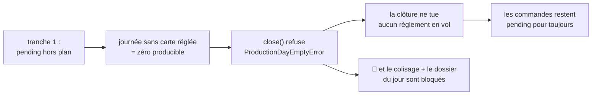
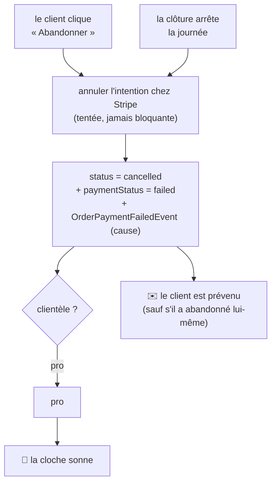

# Plan — l'abandon du règlement

> **Ouvert le 2026-09-22**, à un constat de Hugo : « en perso il y avait un "je
> règle depuis mes commandes" qui m'a envoyé sur la confirmation de commande
> alors que je n'avais pas réglé, ce n'est pas possible ».
>
> 🔴 Touche **l'argent** et **le compte de production** → `vitruve` obligatoire
> (CLAUDE.md §9 bis). **Passé une première fois le 2026-09-22 : 5 BLOQUANT,
> 9 SÉRIEUX, 5 MINEUR.** Ce document est la version d'après ; le §9 dit ce que
> chaque objection est devenue. **Il doit repasser à `vitruve` avant d'être
> bâti** — sa forme a changé sur trois décisions prises après l'audit.

## 0. Repris le 2026-09-26 — ce qui a changé depuis le 22

Le plan a été rouvert contre le code de `dev` (`c10fee286`). **Ce qu'il affirme
de l'existant tient**, à trois nuances près et deux faits nouveaux.

**Toujours vrai (vérifié le 2026-09-26)** :

- la sortie de `/reglement/:id` (`later()`, `fr.ts:310`) ne marque rien, et
  elle est affichée même quand Stripe ne s'est pas chargé ;
- `order-rows.ts:249` affiche « Carte » pour une commande `pending` ;
- personne n'écrit `cancelled` ;
- la règle de production porte encore l'exception pro
  (`production-plan.ts:98-106`) ;
- les deux refus de la clôture existent (`production-errors.ts:33`, `:50`) ;
- il n'y a pas de `cancelIntent` sur le port de paiement ;
- `OrderPaymentFailedEvent` ne porte pas de cause ;
- le rejeu de passation ne regarde que `pending` (`place-order.handler.ts:196`) ;
- la commande saisie par l'équipe en lien reste `pending` ;
- l'architecture du règlement dit toujours « on restreint au public » (§6).

**Nuances** :

- `GetOrderPaymentHandler` vérifie bien `paymentStatus = pending` avant de
  servir le secret, mais **en base, pas chez Stripe**. Le trou du §5 (Stripe
  annulé, base toujours `pending`) tient donc tel quel.
- Le mail au client sur un refus **existe** désormais
  (`send-payment-failed-mail.handler.ts`, gabarit `customer.payment-failed`).
  Q4 porte donc sur un gabarit déjà en service.
- `stripe` est en `^22.4.0` dans `apps/lfd-api/package.json`, et non « épinglé ».
  La lecture du SDK du §3 reste valable pour cette version.

**🔴 Fait nouveau 1 — corrigé le 2026-09-26 (`3b8598fdf`).** `settle` ne
basculait à `paid` que depuis `pending`. Or un refus de carte rend l'intention
à `requires_payment_method` : le client peut saisir une autre carte sur la
même page. Si elle passait, **il était débité, et la commande restait
`failed`**, exclue de la production. Un encaissement part désormais d'une
attente ou d'un refus. Le test est `test/order-payment-retry.e2e-spec.ts`.
⚠️ **À lire en production par Hugo** : les commandes `failed` dont
l'intention Stripe est `succeeded`. Ce sont des clients débités d'une commande
jamais produite.

**🔴 Fait nouveau 2 — une contradiction sur `failed`.** La refonte des liens
de paiement (2026-09-25) traite `failed` comme « refusé et à reprendre »
(`payment-link.ts`, `AWAITING_CARD`), et renvoie un lien vers
`/commandes/:id/regler`. Mais `GET /orders/:id/payment` **refuse** une commande
`failed` (`OrderNotPayableError`). Un lien envoyé pour une commande refusée
mène donc à un refus. Or D4 fait justement passer un pro à `failed` avant de
lui renvoyer un lien. **Il faut que la page de règlement accepte `failed`**, ce
que Stripe permet, puisque l'intention est revenue à
`requires_payment_method`. C'est le nouveau lot 3 bis (§8).

**Fait nouveau 3 — la fidélité en dépend.** Le lot C des points de fidélité
réservera un bon à la passation, et seule l'annulation le libérera
(`documentation/comptabilite/plan-points-de-fidelite.md`, D7). L'abandon
public (`cancelled`, §5) doit donc **libérer le bon réservé**, dans sa propre
transaction. Tant que le lot C n'est pas bâti, il n'y a rien à libérer : ce
plan peut être bâti avant lui.

**Il est repassé par `vitruve`** le 2026-09-26 (§9 bis), et les questions du §6
sont toutes tranchées (2026-09-26).

---

## 1. Le constat

L'écran `/reglement/:id` porte « Payer {total} » et une sortie nommée **« Je
règle depuis "Mes commandes" »** ([`fr.ts:295`](../../apps/lfc-ecommerce-frontend/src/app/client/copy/fr.ts)).
La sortie appelle `later()`, qui **ne marque rien** et mène à la confirmation.

Trois choses fausses (ouvertes et vérifiées le 2026-09-22) :

| #   | Ce qui est faux                                                                                                                                                            |
| --- | -------------------------------------------------------------------------------------------------------------------------------------------------------------------------- |
| 1   | Le libellé se lit comme une action de paiement ; c'est un abandon.                                                                                                         |
| 2   | Il nomme un lieu où l'on ne peut pas régler : **rien dans `/mes-commandes` ne mène à `/reglement/:id`**.                                                                   |
| 3   | La ligne d'historique affiche « Carte » pour une commande `pending` ([`order-rows.ts:249`](../../apps/lfc-ecommerce-frontend/src/app/client/mes-commandes/order-rows.ts)). |

⚠️ **Correction d'une affirmation que ce plan a portée le 2026-09-22** : « la
destination promise n'existe pas » était **à moitié faux**. La page de
confirmation porte bien « Régler maintenant » → `/reglement/:id`
([`confirmation-page.ts:165`](../../apps/lfc-ecommerce-frontend/src/app/client/commande/confirmation-page/confirmation-page.ts)).
Un chemin de retour existe ; il n'est pas là où le bouton l'annonce. Le bouton
est **mal nommé**, pas menteur sur l'existence du chemin.

⚠️ **Le libellé avait déjà été corrigé une fois**, le 2026-09-21, de « Régler
plus tard ». La leçon n'est pas dans le mot : on a deux fois écrit une phrase
sans ouvrir la destination qu'elle nomme.

### Pourquoi on ne corrige pas en affichant « à régler »

`OrderPayment` n'a que deux valeurs, et son commentaire assume : « un troisième
état "à régler" décrirait une commande livrée que personne n'a payée — ça
n'existe pas dans ce commerce ». **Vrai comme intention, faux comme fait** : la
sortie fabrique exactement cet état.

🔴 **Hugo, 2026-09-22** : « on ne peut pas avoir une due, soit on paye public,
soit c'est au compte en pro ». Afficher l'état l'installerait au lieu de le
fermer.

---

## 2. Les quatre décisions de Hugo (2026-09-22)

| #      | La décision                                                                                                                                     | Ce qu'elle remplace                                                |
| ------ | ----------------------------------------------------------------------------------------------------------------------------------------------- | ------------------------------------------------------------------ |
| **D1** | Sortir de l'écran de règlement **annule** la commande.                                                                                          | une sortie qui ne marquait rien                                    |
| **D2** | Un règlement en vol **ne produit plus, pour personne** — l'exception « pro » tombe.                                                             | la règle du 2026-09-17 (« on restreint au public pour le moment ») |
| **D3** | Le cas « payé après la clôture » est **interdit**, pas surveillé : la clôture **tue les règlements en vol** de la journée.                      | un écran d'anomalie à surveiller                                   |
| **D4** | Pour un **pro**, on ne l'annule pas : la commande passe `failed` et **la cloche sonne**. Règle générale : _tout règlement pro qui meurt sonne_. | un traitement uniforme par clientèle                               |

---

## 3. L'état des lieux vérifié

Tout ce qui suit a été ouvert le 2026-09-22.

### Ce qui joue en notre faveur

| Fait                                                                           | Où                                      |
| ------------------------------------------------------------------------------ | --------------------------------------- |
| `cancelled` est dans l'énuméré et **personne ne l'écrit**                      | `prisma/schema/public/orders.prisma:31` |
| `failed` existe et est dans `PAYMENTS_REFUSED` → **jamais produit**            | `production-plan.ts`                    |
| Le fait « règlement mort » **existe déjà**, publié au seul franchissement      | `OrderPaymentFailedEvent`               |
| La règle de production est **rassemblée** : 5 surfaces lisent un seul fragment | `plan-filter.ts`                        |
| Le journal route `order.` vers le module **commandes**                         | `activity-module.ts:68`                 |
| Le comptoir **refuse déjà** une commande annulée                               | `handover.ts:55`                        |

### Ce qui joue contre nous

| Fait                                                                                                                    | Où                                    |
| ----------------------------------------------------------------------------------------------------------------------- | ------------------------------------- |
| 🔴 Une journée sans producible **ne peut pas être arrêtée** (`ProductionDayEmptyError`)                                 | `production-errors.ts:33`             |
| 🔴 Et une journée non arrêtée **bloque le colisage et le dossier du jour** (`ProductionDayNotClosedError`)              | `production-errors.ts:50`             |
| 🔴 Le mur d'une commande d'entreprise laisse passer **tout membre**, pas l'auteur                                       | `order-access.ts:45-53`               |
| `Order` est un agrégat de **passation** : `draft`, `payByCard`, `deferPayment`, `toPersistence`. Il ne se recharge pas. | `domain/entities/order.ts`            |
| Le port de paiement n'a **pas** de `cancelIntent`                                                                       | `payments/domain/payment-gateway.ts`  |
| « Le commercial » n'existe pas comme personne : c'est un **rôle**, et la cloche n'a **pas de destinataire**             | `staff.prisma:6`, `staff-notifier.ts` |

### 🔴 Ce que Stripe autorise vraiment

Lu dans le SDK installé — paquet `stripe` en 22.4.0 (`^22.4.0`, non épinglé), déclaration de
`paymentIntents.cancel` — et non de mémoire :

> You can cancel a PaymentIntent object when it's in one of these statuses:
> `requires_payment_method`, `requires_capture`, `requires_confirmation`,
> `requires_action` or, in rare cases, `processing`.
> After it's canceled, any operations on the PaymentIntent fail with an error.

| Statut                                             | `cancel`             | Ce que ça veut dire pour nous                              |
| -------------------------------------------------- | -------------------- | ---------------------------------------------------------- |
| `requires_payment_method`, `requires_confirmation` | ✅ réussit           | personne n'est en train de payer — annulation sans dommage |
| `requires_action`                                  | ✅ **réussit**       | 🔴 **on TUE une authentification 3-D Secure en cours**     |
| `processing`                                       | ⚠️ « rare cases »    | à traiter comme **peut échouer**                           |
| `succeeded`                                        | ❌ échoue            | notre protection : on ne peut pas annuler ce qui est payé  |
| `canceled`                                         | ❌ échoue            | 🔴 **le second clic lève**                                 |
| `requires_capture`                                 | — ne se présente pas | capture automatique (`automatic_payment_methods`)          |

⚠️ **Ceci invalide la justification écrite dans la version précédente de ce
plan** — « un paiement en vol est en `processing` ou `succeeded`, Stripe refuse
de l'annuler ». C'est faux sur l'exemple même qui l'illustrait.

---

## 4. La tranche 1 — un règlement en vol ne produit plus (D2)

### Le code

[`production-plan.ts`](../../apps/lfd-api/src/b2b/orders/domain/services/production-plan.ts) :

```ts
// avant
return payment !== "pending" || clientele !== "public";
// après
return payment !== "pending";
```

`clientele` disparaît de `settlementAllowsProduction` et d'`absorbedByPlan`, et
[`plan-filter.ts`](../../apps/lfd-api/src/b2b/orders/infrastructure/plan-filter.ts)
perd son `OR` à trois branches — **avec toute la subtilité du `NULL`**, qui
n'existait que pour rattraper la sémantique SQL de `clientele <> 'public'`.

⚠️ **`absorbedByPlan` n'a aucun appelant de production** — seulement son spec.
La bascule réelle est dans `plan-filter.ts` ; présenter le changement comme
« une ligne de domaine » serait inexact.

**Cinq lecteurs** épandent le fragment sans connaître la règle et ne bougent
pas : `prisma-day-orders.reader`, `prisma-order.repository`,
`prisma-pending-orders.reader`, `prisma-expected-production.reader` (via
`planWhere()`), et `prisma-order.reader` (via `settlementWhere()`).

### 🔴 Le blocage circulaire, et sa sortie

C'est la découverte la plus importante de l'audit.


```mermaid
flowchart LR
    A["tranche 1 :<br/>pending hors plan"] --> B["journée sans carte réglée<br/>= zéro producible"]
    B --> C["close() refuse<br/>ProductionDayEmptyError"]
    C --> D["la clôture ne tue<br/>aucun règlement en vol"]
    D --> E["les commandes restent<br/>pending pour toujours"]
    C --> F["🔴 et le colisage + le dossier<br/>du jour sont bloqués"]
```

**La clôture devait nettoyer les règlements en vol (D3) — et ce sont eux qui
l'empêchent de tourner.** Pire : une journée non arrêtée bloque le colisage et
le tirage du dossier, donc **le fournil s'arrête ce jour-là**.

🔵 **La sortie proposée — l'ordre des gestes.** La clôture **tue d'abord,
compte ensuite** :

1. annuler les intentions en vol des commandes de la journée ;
2. les marquer selon la clientèle (§5) ;
3. **puis** compter le producible, et refuser si c'est encore zéro.

Le refus « journée vide » garde alors tout son sens — il dit une vérité :
personne n'a payé.

✅ **Validé par Hugo le 2026-09-26** (Q1). Le comment est au §9 bis, B1.

### Le coût, et un chiffre qu'il ne faut PAS reprendre

Le §6 du document de règlement porte « 48 tests de bout en bout sur 89 »,
mesurés **avant** de trancher en septembre.

🔴 **Ce chiffre est périmé et ne doit pas être cité comme engagement.** Il a été
mesuré le 2026-09-17 ; `test/card-payments.ts` est arrivé le **2026-09-18**
(« les suites de production règlent leurs cartes »), et plusieurs suites règlent
désormais explicitement. Le dépôt compte 122 fichiers e2e.

**Le lot 2 commence donc par une mesure, pas par une correction.** Et le triage
distingue deux familles qu'il ne faut pas confondre :

- les tests qui **constatent** l'ancien comportement → à réécrire, ils disent
  l'inverse maintenant ;
- ceux qui **reposent dessus par commodité de fixture** → à corriger **au
  semis**, pas à l'assertion.

⚠️ Corriger un test de la première famille au semis masquerait la régression
qu'il existe pour attraper.

---

### 4 bis. Ce que la mesure a donné (lot 0, 2026-09-26)

La règle a été appliquée dans une copie isolée, puis retirée. Tous les tests de
l'API ont tourné contre la base jetable : **507 suites unitaires (4 796 tests),
150 fichiers e2e (2 054 tests)**. Le « 48 sur 89 » du §4 est donc bien périmé.

**8 échecs, tous attendus, aucun vrai bug :**

| Fichier                                                            | Tests | Famille            | Correction                                                                       |
| ------------------------------------------------------------------ | ----- | ------------------ | -------------------------------------------------------------------------------- |
| `src/b2b/orders/domain/services/__tests__/production-plan.spec.ts` | 3     | A — ancienne règle | réécrire : un pro `pending` et une clientèle nulle ne sont plus produits         |
| `test/day-supervision.e2e-spec.ts`                                 | 1     | A — ancienne règle | réécrire : « garde le pro en attente » devient « l'écarte aussi »                |
| `test/production-forecast.e2e-spec.ts`                             | 4     | B — fixture        | **une** correction au semis : `placeOrder` règle la carte (`settleCardPayments`) |

Le lot 2 est donc court : environ une heure, sans code produit.

## 5. La tranche 2 — ce qui arrive à une commande non réglée

### Deux déclencheurs, un seul mécanisme


```mermaid
flowchart TD
    T1["le client clique<br/>« Abandonner »"] --> M
    T2["la clôture arrête<br/>la journée"] --> M
    M["annuler l'intention chez Stripe<br/>(tentée, jamais bloquante)"] --> CAN["status = cancelled<br/>+ paymentStatus = failed<br/>+ OrderPaymentFailedEvent (cause)"]
    CAN --> Q{"clientèle ?"}
    Q -->|pro| FAIL["pro"]
    FAIL --> BELL["🔔 la cloche sonne"]
    CAN --> MAIL["✉️ le client est prévenu<br/>(sauf s'il a abandonné lui-même)"]
```

🔴 **La cloche s'accroche à l'ÉVÉNEMENT, pas à l'appelant.** Un abonné
`@EventsHandler(OrderPaymentFailedEvent)` qui sonne si la commande est pro — et
alors _tout_ ce qui écrit `failed` sonne, par construction : la carte refusée en
pleine journée comme le règlement coupé à la clôture. C'est ce qui rend la règle
de D4 structurelle plutôt que répétée à chaque appelant.

L'événement doit donc **gagner une cause** — `refused` (Stripe) ou
`day_closed` (la clôture) — sans quoi l'abonné ne peut pas dire au commercial ce
qui s'est passé.

⚠️ **Conséquence sur le client, à trancher** : le courriel dépend du **même**
événement. « Votre carte a été refusée » n'est pas « le paiement n'a pas abouti
à temps pour la fournée ». Le gabarit devra probablement suivre la cause.

⚠️ **« Le commercial » se bâtit comme « la cloche sonne »**, visible de tout le
back-office — comme les mandats et les alertes. Un vrai destinataire demanderait
un propriétaire de compte sur `Company`, qui n'existe pas : c'est une décision
de modélisation à part entière, hors de ce chantier.

### 🔴 L'ordre des écritures, et ses vraies branches

La version précédente promettait « Stripe refuse, et son refus devient notre
refus ». Le §3 montre que c'est faux. La forme correcte énumère les issues :

| Issue de `cancel`              | Ce qu'on fait                                                                     |
| ------------------------------ | --------------------------------------------------------------------------------- |
| réussit                        | on écrit (`cancelled` ou `failed`), on rend 204                                   |
| échoue car `succeeded`         | **on ne touche à rien** et on réconcilie : la commande est payée, le webhook suit |
| échoue car `processing`        | 409 — le paiement est en cours, on ne se prononce pas                             |
| échoue car **déjà `canceled`** | 🔴 **succès**, pas erreur : c'est le second clic, l'état voulu est déjà atteint   |
| réseau injoignable             | 409 franc — voir ci-dessous                                                       |

⚠️ **`requires_action` réussit**, donc l'abandon **tue une authentification
3-D Secure en cours dans un autre onglet**. C'est acceptable pour un clic
délibéré du client ; à la clôture, c'est une décision — on coupe quelqu'un qui
était peut-être en train de valider.

### 🔴 Le trou que l'ordre ne ferme pas

**Stripe réussit, puis notre base échoue** (timeout, process tué) : intention
morte chez Stripe, commande `placed` + `pending` chez nous. Elle devient
**impayable** — `GetOrderPaymentHandler` relit l'intention et sert le
`clientSecret` d'une intention canceled — et elle reste dans la file du
comptoir.

La version précédente affirmait que l'ordre « ferme le trou sans filet ». **Il
le déplace.** Ce qui le ferme réellement :

- la clôture de la journée le balaie (D3) — mais tardivement ;
- `GetOrderPaymentHandler` doit **refuser une intention non payable** au lieu de
  servir son secret ;
- 🔵 un état persisté « à régulariser » reste la réponse du plan général (B2) si
  on veut mieux que « ça se rattrape à la clôture ».

### 🔴 Sortir quand Stripe est injoignable

Le bouton de sortie est affiché **aussi** en phase `unavailable`
(`reglement-page.html:26-33`), c'est-à-dire quand Stripe ne s'est pas chargé. En
faire un appel qui doit **atteindre Stripe** rend la seule sortie impossible
pendant un incident — exactement ce que le JSDoc de l'écran interdit :

> Bloquer la sortie retiendrait quelqu'un devant un formulaire de carte pour une
> commande déjà écrite.

**La sortie doit donc rester praticable sans serveur** : le bouton navigue
toujours, et l'annulation est ce qu'on **tente**. Si elle échoue, la commande
reste `pending` et la clôture la balaiera.

### Ce qu'il faut ajouter

| Où                                        | Quoi                                                              |
| ----------------------------------------- | ----------------------------------------------------------------- |
| `payments/domain/payment-gateway.ts`      | `cancelIntent(id)` **et la traduction de ses issues** (§5)        |
| l'adaptateur Stripe                       | l'implémentation                                                  |
| `orders/domain/ports/order.repository.ts` | `markAbandoned(orderId)` et `failAtClosing(orderId)`              |
| l'adaptateur Prisma                       | `updateMany` conditionné `status: placed, paymentStatus: pending` |
| `application/commands/`                   | `AbandonOrderCommand` + handler                                   |
| `http/orders.controller.ts`               | `POST :id/abandon`                                                |
| la clôture                                | le balayage, **avant** le comptage (§4)                           |
| le front                                  | libellé, confirmation, appel tenté, navigation inconditionnelle   |

🔴 **Les écritures nues sont justifiées ici**, au même titre que `markPaid` /
`markPaymentFailed` dont le `CLAUDE.md` §3.1 dit « ne pas les corriger : les
lire ». La condition est **en base**, donc idempotente et atomique. `Order` est
un agrégat de passation et ne sait pas se recharger. ⚠️ Cette justification doit
être écrite **au-dessus des méthodes**, pas seulement ici.

### 🔵 `paymentStatus` d'une commande abandonnée — à trancher

Le plan ne l'avait pas dit, et ça décide trois choses :

- **le rejeu de passation** : `PlaceOrderHandler.replay` ne regarde que
  `paymentStatus !== "pending"`. Si l'abandon ne touche que `status`, un client
  qui repasse le même panier sous la même clé reçoit **la commande annulée** et
  un secret mort ;
- **l'affichage** : `order-rows.ts:249` calcule la colonne sur `paymentStatus` ;
- **la réconciliation** : un webhook tardif ne doit pas payer une annulée.

**Proposition** : l'abandon écrit `status = cancelled` **et**
`paymentStatus = failed`. Une commande abandonnée est un règlement mort — c'est
déjà ce que `PAYMENTS_REFUSED` veut dire, et ça rend le rejeu correct sans
condition de plus.

⚠️ Mais ça fait sonner la cloche pour un **pro** qui abandonne lui-même, ce qui
est peut-être voulu (D4 dit « tout règlement pro qui meurt sonne ») — **à
confirmer**.

---

## 5 bis. Les réponses de Hugo (2026-09-26)

> « ok pour tes avis, Q6 on prévient le commercial » — Hugo.

| #      | Décision                                                                                                                                                                                                                                                                                                                                                            |
| ------ | ------------------------------------------------------------------------------------------------------------------------------------------------------------------------------------------------------------------------------------------------------------------------------------------------------------------------------------------------------------------- |
| **Q1** | **La clôture annule d'abord, compte ensuite.** Elle annule les intentions en vol de la journée et les marque selon la clientèle (§5), **puis** compte le producible. Le refus « journée vide » ne dit plus que la vérité : personne n'a payé.                                                                                                                       |
| **Q2** | **Seul l'auteur** abandonne la commande d'une société. La lecture reste ouverte à tout membre ; abandonner est une destruction, et elle revient à qui a passé la commande.                                                                                                                                                                                          |
| **Q3** | **Une commande abandonnée passe aussi `paymentStatus = failed`.** Le rejeu de passation devient correct sans condition de plus, et l'affichage suit. Un pro qui abandonne lui-même fait sonner la cloche : l'équipe veut le savoir.                                                                                                                                 |
| **Q4** | **Le mail suit la cause** : deux gabarits, `refused` (carte refusée, celui déjà en service) et `day_closed` (le paiement n'a pas abouti à temps pour la fournée).                                                                                                                                                                                                   |
| **Q5** | **Une commande sans jour de retrait est rattachée à son jour de passation** pour la clôture : aucune commande n'échappe au balayage.                                                                                                                                                                                                                                |
| **Q6** | **On prévient le commercial** qu'une commande saisie par l'équipe, avec lien de paiement, n'est toujours pas réglée. ⚠️ **Quand**, ce n'est pas dit : proposé **à l'heure limite de commande de la journée** (`architecture-heure-limite-de-commande.md`), assez tôt pour relancer le client avant la fournée. La cloche du back-office, visible de tous, comme D4. |

## 6. Les questions — toutes tranchées

Q1 à Q6 le sont au §5 bis. La dernière est née de la seconde contradiction
(§9 bis, B3) :

| #      | Décision (Hugo, 2026-09-26 : « Q7 je pense tu as raison »)                                                                                                                                                                                                                                                        |
| ------ | ----------------------------------------------------------------------------------------------------------------------------------------------------------------------------------------------------------------------------------------------------------------------------------------------------------------- |
| **Q7** | **À la clôture, une commande pro non réglée devient `cancelled` + `failed`, comme une commande publique, et la cloche sonne** (cause `day_closed`) : le commercial la ressaisit s'il le faut. D4 garde son sens **en journée** : une carte pro refusée reste `placed` + `failed`, reprenable, jusqu'à la clôture. |

## 7. Ce que ce plan ne fait pas

- **Il ne débloque pas le chantier d'annulation général**
  ([`plan-annulation-de-commande.md`](plan-annulation-de-commande.md) +
  [`todo-annulation-de-commande.md`](todo-annulation-de-commande.md)) : annuler
  une commande **payée** demande un remboursement, et rien ici n'en parle.
- **Aucune annulation de masse** des commandes déjà orphelines — c'est le geste
  que le §0 du `CLAUDE.md` interdit d'exécuter d'autorité. Elles seront balayées
  à la première clôture de leur journée.
- **Il ne crée pas de propriétaire de compte** (§5).
- ⚠️ **Il reste un trou de transition à l'affichage** : une commande `pending`
  ni payée ni abandonnée affiche toujours « Carte » jusqu'à la clôture qui la
  balaie.

---

## 8. Les lots

| Lot       | Contenu                                                                                                                                                                                 | Bloque par |
| --------- | --------------------------------------------------------------------------------------------------------------------------------------------------------------------------------------- | ---------- |
| **0**     | ✅ **mesuré le 2026-09-26** (§4 bis) — **Mesurer** ce que la tranche 1 casse réellement (§4) — aucun code                                                                               | —          |
| **1**     | ✅ bâti le 2026-09-26 — La règle : `plan-filter.ts`, les signatures, les JSDoc datés                                                                                                    | 0          |
| **2**     | ✅ bâti le 2026-09-26 — Le triage des e2e tombées, famille par famille                                                                                                                  | 1          |
| **3**     | ✅ bâti le 2026-09-26 — `cancelIntent` + les **cinq issues** traduites (§5)                                                                                                             | —          |
| **7**     | ✅ bâti le 2026-09-26 — `GetOrderPaymentHandler` relit l'intention chez Stripe et refuse une intention non payable, et toute commande `cancelled` — **avant** 3 bis (§9 bis, B3)        | 3          |
| **3 bis** | ✅ bâti le 2026-09-26 — la page de règlement accepte `failed` **tant que son intention est vivante** (§9 bis, B3)                                                                       | 7          |
| **4**     | ✅ bâti le 2026-09-26 — `markAbandoned` / `failAtClosing`, la commande, le handler, la route, le mur : l'auteur `placedByUserId` (Q2)                                                   | 3          |
| **5**     | ✅ bâti le 2026-09-26 — La cause sur `OrderPaymentFailedEvent` (`refused`, `day_closed`, `abandoned`), l'abonné cloche, le mail qui suit la cause (Q4, §9 bis S9)                       | 4          |
| **6**     | ✅ bâti le 2026-09-26 — La clôture : le port synchrone de balayage, appelé **avant** de compter, à chaque appel de clôture (§9 bis, B1, B2, S4), rattachement au jour de passation (Q5) | 3, 4       |
| **6 bis** | ✅ bâti le 2026-09-26 — Un encaissement sur une commande `cancelled` : ne jamais la rouvrir, sonner « à rembourser » (§9 bis, B1)                                                       | 6          |
| **8**     | ✅ bâti le 2026-09-26 — Le front : libellé, confirmation, appel **tenté**, navigation inconditionnelle                                                                                  | 4          |
| **10**    | Prévenir le commercial à l'heure limite (Q6) : une passe horaire idempotente, un cron de plus                                                                                           | 5          |
| **9**     | Les docs et les justifications datées (§10)                                                                                                                                             | 1–8        |

⚠️ **Le lot 5 touche `packages/contracts`** — catalogue des faits, spec de
fermeture, **et** la phrase du back-office. La règle « la racine dès que
`packages` bouge » s'applique : `pnpm test` à la racine, pas le filtre.

⚠️ **Le lot 2 est le moins prévisible.** S'il révèle que la règle coûte plus
cher qu'attendu, c'est une information pour Hugo, pas un obstacle à contourner.

---

## 9. Ce que l'audit `vitruve` du 2026-09-22 est devenu

| Objection                                                                                       | Verdict                              | Où                                       |
| ----------------------------------------------------------------------------------------------- | ------------------------------------ | ---------------------------------------- |
| **B1** — Stripe a plus de deux issues                                                           | ✅ **retenue**, et elle avait raison | §3 et §5, énumérés depuis le SDK épinglé |
| **B2** — le trou se déplace                                                                     | ✅ **retenue**                       | §5, dit comme tel                        |
| **B3** — la journée inarrêtable                                                                 | ✅ **retenue**, la plus grave        | §4, avec sa sortie proposée              |
| **B4** — le mur laisse tout membre                                                              | ✅ **retenue**                       | Q2                                       |
| **B5** — le rejeu / `paymentStatus`                                                             | ✅ **retenue**                       | §5, Q3                                   |
| **S6** — `markFulfilled`                                                                        | ⏸️ **écartée du chantier**           | voir ci-dessous                          |
| **S7** — la surveillance a un domicile                                                          | ➖ **caduque** (D3 l'interdit)       | §4                                       |
| **S8** — la destination existe                                                                  | ✅ **retenue**                       | §1, correction explicite                 |
| **S9** — sortir sans Stripe                                                                     | ✅ **retenue**                       | §5                                       |
| **S10** — le journal coûte plus                                                                 | ✅ **retenue**                       | lot 5                                    |
| **S11** — la croissance compte encore                                                           | 🔵 **ouverte**                       | voir ci-dessous                          |
| **S12** — une justification à réécrire                                                          | ✅ **retenue**                       | §10                                      |
| **S13** — la commande saisie par l'équipe                                                       | ✅ **retenue**                       | Q6                                       |
| **S14** — le 48/89 est périmé                                                                   | ✅ **retenue**                       | §4, lot 0                                |
| Mineurs (5 lecteurs, 48 tests, S4 absent, `absorbedByPlan` sans appelant, `ensureOrderVisible`) | ✅ toutes corrigées                  | §3, §4                                   |

**S6 — `markFulfilled` : écartée, et pourquoi.** L'audit propose de le
conditionner sur `status <> cancelled`. C'est en conflit avec une décision
écrite : ce handler est délibérément **une recopie d'un fait du fournil** — « il
ne rejoue **aucune** règle de remise […] la rejouer ici ferait exactement le mal
qu'on veut éviter — un commerce qui refuse d'enregistrer une remise qui a
physiquement eu lieu ». Et le comptoir **refuse déjà** en amont
(`handover.ts:55`). Le risque résiduel est une course, sur une commande qui
n'est jamais entrée en production. **À traiter dans le chantier d'annulation
général, pas ici.**

**S11 — la croissance : ouverte.** `order.placed` reste inscrit après un
abandon, donc le client compte comme ayant commandé, pour toujours
(`on-order-placed.handler.ts`), et `order.cancelled` n'est pas dans
`ACTIVITY_TYPES`. 🔵 **À trancher** : le momentum d'un lead doit-il reculer
quand sa commande meurt ?

---

## 9 bis. Ce que la seconde contradiction (2026-09-26) a changé

`vitruve`, sur la version reprise : **3 BLOQUANT, 6 SÉRIEUX, 5 MINEUR**.

**B1 — la clôture n'a pas d'endroit où annuler.** `CloseProductionDayHandler`
compte puis ferme ; le commerce n'agit qu'après, par un abonné hors
transaction. Et `production → b2b` est interdit. **Réponse** :

- `production/channels/commerce/` gagne un **port synchrone**,
  `PendingSettlementSweeper.sweep(day)`, que `b2b` implémente et
  qu'`appBootstrap` relie ;
- la clôture l'appelle **avant** `producibleFor` ;
- **Stripe injoignable ne bloque jamais la clôture.** Pour chaque commande, on
  tente `cancelIntent`, puis on écrit la base **quelle que soit l'issue**.
  L'échec est journalisé. Le fournil ne s'arrête pas à cause d'une panne
  Stripe ;
- le prix : une intention restée vivante peut encore être payée. D'où le
  **lot 6 bis** : un encaissement sur une commande `cancelled` ne la rouvre
  jamais, et la cloche sonne « encaissé sur une commande annulée — à
  rembourser ». `PAID_FROM` (`3b8598fdf`) accepte `pending` et `failed`, mais
  le `where` doit exclure `status = cancelled`.

**B2 — le balayage ne voyait pas les cartes refusées en journée.** Une
commande `failed` a une intention vivante (`requires_payment_method`), et
depuis `3b8598fdf`, elle peut encore passer `paid`. **Réponse** : le balayage
vise tout règlement **non encaissé**, `pending` **ou** `failed`, et pas
seulement `pending`. C'est aussi ce qui libère le bon de fidélité réservé
d'une commande refusée et jamais reprise.

**B3 — le lot 3 bis servait des intentions mortes.** **Réponse** : le lot 7
passe avant. `GetOrderPaymentHandler` relit l'intention **chez Stripe** et
refuse une intention `canceled` ou `succeeded`, ainsi que toute commande
`cancelled`. Une commande `failed` n'est donc payable que **tant que sa
journée n'est pas close**, et aucune nouvelle intention n'est jamais créée.
Après la clôture, elle n'est plus payable (D3). Elle est annulée, et la cloche
sonne : c'est **Q7** (§6).

**Sérieux** :

- **S4, la clôture rejouée** : le balayage tourne à **chaque** appel de
  clôture, réannonce comprise. Il est idempotent par ses conditions, et il
  prend les commandes passées après la première clôture.
- **S5, Q6 sans déclencheur** : c'est le lot 10, une passe horaire
  idempotente qui compare l'heure de Paris à l'heure limite du jour. C'est un
  cron de plus, et le §9 bis ne tranche pas l'architecture des crons.
- **S6, le jour de passation** : c'est le jour ouvré Europe/Paris de
  `createdAt`, par l'outil que `lint:business-day` impose. La clôture du jour
  D balaie `requestedDeliveryDate = D`, ou bien une date nulle dont le jour de
  passation vaut D.
- **S7, la 3-D Secure tuée à la clôture** : **assumé**. À l'heure de la
  clôture, une authentification en cours paierait une commande qui ne sera
  pas produite.
- **S8, la fidélité** : le chemin `failed → paid` publie le même
  `OrderPaymentSettledEvent` que `pending → paid` (même `settle`, même
  handler). Le crédit de points le voit donc sans changement, mais c'est à
  vérifier par un test au lot 6 bis. B2 couvre la libération du bon.
- **S9, le mail d'un abandon** : il y a une troisième cause, `abandoned`. Le
  client qui vient de cliquer ne reçoit **pas** « carte refusée ». La cloche
  sonne pour un pro (Q3).

**Mineurs** :

- les §4 et §6 disaient encore « à valider » : corrigé ;
- les « six issues » sont cinq ;
- le SDK n'est pas épinglé ;
- l'auteur est `placedByUserId`. Pour une commande saisie par l'équipe, c'est
  le client pour qui elle a été saisie ; l'équipe annule, elle, depuis le
  back-office (hors de ce plan) ;
- `failAtClosing` publie son événement lui-même : `FAILED_FROM = [pending]`
  ne franchirait pas une commande déjà `failed`.

## 9 ter. Ce que les lots 3 et 7 ont tranché en bâtissant (2026-09-26)

- **`cancelIntent` ne lève jamais.** L'issue `unavailable` regroupe tout ce qui
  ne dit rien de l'intention : réseau, 5xx, canal non configuré,
  authentification refusée, intention inconnue. Son `reason` part au journal.
  C'est ce que la clôture exige (B1) : une panne Stripe ne l'arrête pas.
- **« Déjà annulée » se lit dans `error.payment_intent.status`**, que le SDK
  déclare **facultatif**. S'il manque, l'intention est **relue** avant de
  conclure (`refusedWithoutState`). Sinon, un second clic passerait pour une
  panne. ⚠️ Non éprouvé contre le mode test de Stripe.
- **`processing` reste servi** par `GET /orders/:id/payment` : un paiement en
  cours n'est pas refusé au client qui recharge la page.

## 9 quater. Ce que les lots 4 et 5 ont révélé (2026-09-26)

- 🔴 **Q8 — un pro qui abandonne n'est plus reprenable par carte.** D4 dit
  qu'un pro reste `placed` + `failed`, reprenable jusqu'à la clôture. Mais
  l'abandon annule l'intention chez Stripe, le lot 7 refuse une intention
  `canceled`, et B3 interdit d'en créer une nouvelle. Seule une carte
  **refusée** (intention vivante) reste reprenable. Bâti tel quel ; la cloche
  dit « paiement par carte annulé, à relancer ».
  ✅ **Tranché par Hugo le 2026-09-26 : (a).** Pour un **pro**, abandonner
  **n'annule pas** l'intention chez Stripe : la commande passe `failed`, reste
  `placed` et **payable jusqu'à la clôture**, qui l'annulera (Q7). D4 tient
  telle quelle. Pour un particulier, rien ne change : l'intention est annulée,
  la commande aussi.
- **Clientèle `NULL`** : traitée comme un pro à l'écriture (`failed` seul, rien
  de détruit), et la cloche ne sonne pas, faute de savoir qui relancer.
- Le 409 « Stripe injoignable » annonce une annulation à la fournée : elle
  n'est vraie qu'avec le lot 6.

## 9 quinquies. Ce que le lot 6 a tranché en bâtissant (2026-09-26)

- **À la clôture, de l'argent pris ou en route épargne la commande.** B1 disait
  « écrire quelle que soit l'issue » ; appliqué à la lettre, il annulait une
  commande dont Stripe répondait `already_paid` ou `in_progress`, c'est-à-dire
  une vente réelle, et écrivait au client « rien n'a été débité ». Corrigé avant
  tout déploiement : ces deux issues épargnent la commande, et le webhook la
  soldera, **hors du plan arrêté** (l'équipe décide). Seule une panne
  (`unavailable`) annule quand même, et un encaissement tardif sonne « à
  rembourser » (6 bis).
- **Une journée où personne n'a payé** est balayée (annulations, mails), puis
  toujours refusée « vide » : elle reste non arrêtée, et le colisage et le
  dossier du jour restent bloqués ce jour-là s'il n'y a rien d'autre. Conforme
  au §4 ; signalé à Hugo.

## 9 sexies. Ce que le lot 8 a laissé ouvert (2026-09-26)

- **La colonne « Carte » de Mes commandes n'a pas changé**, conformément au §1
  (Hugo, 2026-09-22 : pas d'état « à régler »). Une commande `cancelled` le dit
  déjà par son statut ; ce que la colonne de règlement affiche pour elle n'est
  pas tranché.
- **La clientèle n'est pas dans le contrat du règlement** : l'écran la déduit de
  l'espace courant (une société = pro). Rouvert depuis un autre espace, le texte
  serait faux. Exposer `clientele` dans `GET /orders/:id/payment` le fermerait.
- 🔴 **Une boucle confirmation ↔ règlement** : quand `GET /orders/:id/payment`
  refuse (commande annulée ou intention close, depuis le lot 7), l'écran de
  règlement renvoie à la confirmation, qui propose « Régler maintenant » à
  partir d'un `settlement: 'due'` gardé en local. À fermer avant de pousser.

## 10. Les justifications datées que ce chantier périme

Le `CLAUDE.md` §8 en fait le commentaire le plus dangereux — « il fait garder un
mécanisme pour une raison qui n'existe pas ». Quatre, à réécrire dans le lot 9 :

1. **§6 d'[`architecture-reglement-et-compte-de-production.md`](architecture-reglement-et-compte-de-production.md)**
   — la règle « on restreint au public », son diagramme et sa mesure.
2. **Le JSDoc de `PAYMENTS_AWAITING`** — il annonce que le cas se fermera par
   « l'expiration des commandes impayées » ; D3 le ferme **ici**, par la
   condition. L'expiration reste utile (Q5), mais la phrase est fausse telle
   qu'écrite.
3. **Le JSDoc d'`OrderPaymentFailedEvent`** — « ce fait ne dit PAS qu'une carte
   a été abandonnée […] fermer ce cas demande d'expirer les commandes impayées,
   ce qui est un autre chantier ». Ce chantier **est** celui-là.
4. **`production-day.ts:132`** — « rien n'annule une commande dans ce système […]
   le jour où l'annulation existera, elle devra se propager jusqu'ici ». Ce jour
   est arrivé.
