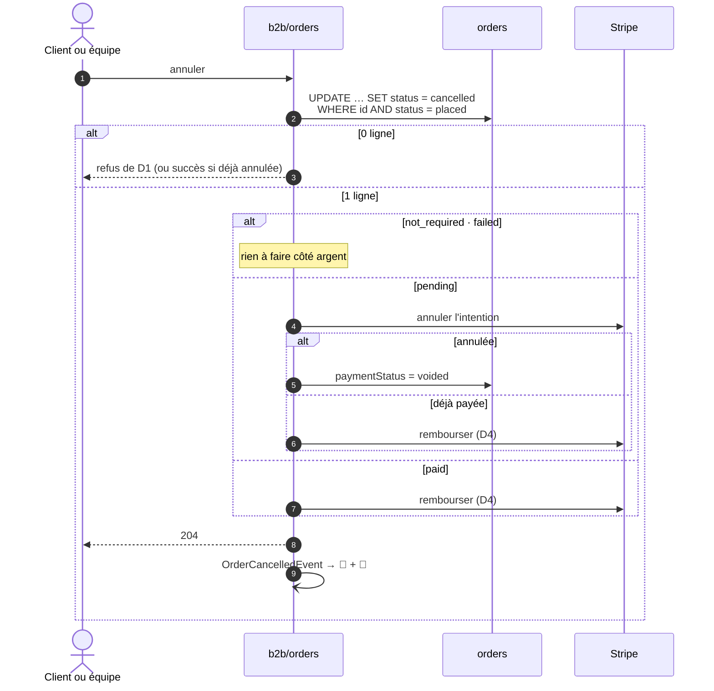

# Plan — annuler une commande

**Statut** : 📐 plan, 2026-09-17. **Rien n'est bâti.** Touche **l'argent**
(annulation d'une intention Stripe, remboursement). 🔴 **Contredit par
`vitruve` le même jour : 4 BLOQUANT, 7 SÉRIEUX.** Les décisions D1, D2, D3, D5
et D6 ne tiennent pas en l'état — le §9 dit pourquoi et dans quelle direction
les reprendre. **Ne pas bâtir avant la refonte** — l'état et les décisions attendues sont
suivis dans [`todo-annulation-de-commande.md`](todo-annulation-de-commande.md).
**Portée** : la transition `placed → cancelled`, ce qu'elle fait de l'argent, et
ce qu'elle dit au client. Ni l'avenant (modifier une commande), ni l'annulation
d'une commande déjà dans le plan.

## 0. La demande

> « c'est vrai que `cancelled` n'existe pas, on devrait peut-être le faire,
> règle : tant qu'on n'est pas `confirmed` on peut cancel » — Hugo, 2026-09-17.
>
> « envoi d'un mail de confirmation d'annulation, n'ira pas dans le plan de prod
> du jour » — Hugo, même jour.

## 1. L'existant (ouvert et vérifié le 2026-09-17)

- **`cancelled` est dans l'énuméré `OrderStatus`, et aucun chemin ne l'écrit.**
  `production-day.ts` et `orders.seed.ts` le disent en toutes lettres.
- **Tous les lecteurs savent déjà l'écarter** — c'est ce qui rend le lot court :

  | Lecteur                                                 | Fichier                                                           | Effet d'une commande annulée |
  | ------------------------------------------------------- | ----------------------------------------------------------------- | ---------------------------- |
  | le plan du soir, la fiche, le prévisionnel, le compteur | `planWhere()` — `status = placed`                                 | exclue                       |
  | le dossier du jour                                      | `prisma-order.reader.ts` `listForProduction`                      | exclue                       |
  | le colisage                                             | `packingBlocker`                                                  | refusé, avec sa phrase       |
  | le retrait                                              | `handoverBlocker`                                                 | refusé, avec sa phrase       |
  | la file du comptoir                                     | `get-handover-queue.handler.ts`                                   | **gardée**, marquée annulée  |
  | le chiffre d'affaires                                   | `REVENUE_ORDER_STATUSES`                                          | exclue                       |
  | les volumes du tarif                                    | `prisma-sku-volume.reader.ts`, `prisma-customer-volume.reader.ts` | exclue                       |
  | l'assiette de prélèvement                               | `prisma-billable-orders.reader.ts`                                | exclue                       |
  | les normes et l'historique des alertes                  | `prisma-product-norm.store.ts`, `prisma-order-history.reader.ts`  | exclue                       |
  | la frise client                                         | `order-timeline.ts`                                               | « Commande annulée »         |

- **Le fournil ne détient aucune copie d'une commande `placed`.** Il s'inscrit
  les commandes à l'arrêt de la journée, par `DayOrdersReader.producibleFor`,
  qui lit `planWhere()`. Une commande annulée avant l'arrêt n'y entrera jamais ;
  une commande restée `placed` après l'arrêt (passée trop tard, ou visiteur en
  attente de paiement) n'y est pas non plus. **Il n'y a rien à propager au
  fournil**, et c'est la règle de Hugo qui le garantit.
- **Le règlement** : `paymentStatus` vaut `not_required`, `pending`, `paid`,
  `failed` ou `refunded` ; `refunded` n'est écrit par aucun chemin.
  `PaymentGateway` sait créer et relire une intention, et lire un webhook
  `succeeded` / `failed`. Il ne sait **ni annuler une intention, ni rembourser**.
- **Le webhook** `markPaid` bascule sous la seule condition
  `paymentStatus = pending` — il ne regarde pas `status`. Une commande annulée
  dont l'intention serait encore vivante deviendrait `paid` si le client payait.
- **Reprendre un paiement** (`GET /orders/:id/payment`) ne vérifie que
  `paymentStatus = pending` : une commande annulée resterait payable.
- **Précédent de forme** : le colisage — une règle pure qui rend une phrase
  (`packingBlocker`), puis une écriture conditionnée en base (`markReady`).

## 2. Décisions

**D1 — Seule une commande `placed` s'annule** (Hugo). `confirmed`, `ready`,
`fulfilled` et `cancelled` refusent. Règle pure `cancellationBlocker(status)`,
sur le modèle de `packingBlocker`, qui rend une phrase :

| État        | Refus                                                           |
| ----------- | --------------------------------------------------------------- |
| `confirmed` | « Cette commande est déjà dans le plan de production. »         |
| `ready`     | « Cette commande est déjà prête. »                              |
| `fulfilled` | « Cette commande a déjà été retirée. »                          |
| `cancelled` | aucun — **l'annulation répétée réussit sans rien refaire** (D6) |
| `draft`     | « Cette commande n'est pas encore passée. »                     |

⚠️ Une commande `placed` **après** l'arrêt de sa journée s'annule aussi. C'est
voulu : elle n'est dans aucun plan, et c'est exactement le cas de la carte
abandonnée ([règlement, §4.1](architecture-reglement-et-compte-de-production.md)).

**D2 — La base tranche la course avec l'arrêt de la journée.** L'écriture est
`updateMany where { id, status: placed }`, comme `absorbIntoPlan` l'est de son
côté. Si l'arrêt gagne, l'annulation rend `0` ligne et le refus de D1 ; si
l'annulation gagne, l'arrêt ne la voit plus. **Aucun état intermédiaire.**
Écriture nue justifiée au sens de `CLAUDE.md` §3.1 : une `load → save` perdrait
l'atomicité face à la clôture pour zéro invariant de plus.

**D3 — L'ordre des gestes : la base d'abord, Stripe ensuite.**

Pourquoi la base d'abord : c'est elle qui tranche contre l'arrêt (D2). Annuler
l'intention avant, puis perdre la course, laisserait une commande **pro**
`confirmed` et `pending` — donc fabriquée — dont plus personne ne peut payer
l'intention.

Le prix de cet ordre : entre les deux gestes, une commande annulée a une
intention vivante. D5 ferme ce trou.

**D4 — Une commande payée est remboursée, en entier, automatiquement.** Avant
l'arrêt de la journée, rien n'a été fabriqué ni réservé : il n'y a rien à
retenir. `PaymentGateway` gagne `refund(paymentIntentId, amountCents)` ; le
webhook `charge.refunded` n'est pas nécessaire — l'appel synchrone suffit, et
`paymentStatus = refunded` s'écrit sous condition `paymentStatus = paid`.
Montant = `totalCents`, le TTC encaissé.

**D5 — Aucune annulation ne laisse d'intention payable.**

- `PaymentGateway` gagne `cancelIntent(paymentIntentId)`, qui rend `voided` ou
  `already_succeeded` (Stripe refuse d'annuler une intention réussie).
- **Nouvelle valeur `PaymentStatus.voided`** — « intention annulée, rien
  encaissé ». Migration **additive** (`ALTER TYPE … ADD VALUE`). Ni `failed`
  (le client n'a rien raté) ni `not_required` (il y avait bien quelque chose à
  payer) ne disent le vrai.
- **Le webhook `succeeded` sur une commande annulée rembourse.** Filet pour le
  trou de D3 et pour une annulation d'intention qui aurait échoué (Stripe
  indisponible) : `markPaid` bascule toujours, puis un abonné voit
  `status = cancelled` et appelle D4.
- **`GET /orders/:id/payment` refuse une commande annulée**, avant de regarder
  le règlement.

**D6 — Idempotente.** Annuler une commande déjà annulée rend `204` et ne
refait rien — ni Stripe, ni courriel. Le courriel ne part qu'au franchissement
(D2 rend `1` ligne).

**D7 — Qui peut annuler** — une route client et une route admin, journalisées
(Hugo, 2026-09-17).

- **le client**, sur ses propres commandes, sous le mur habituel
  (`ensureOrderVisible`) — `POST /orders/:id/cancel` ;
- **l'équipe**, sur toute commande — `POST /admin/orders/:id/cancel`, surface
  `b2b_orders`, avec un **motif obligatoire** (une annulation staff sans raison
  écrite devient un geste que personne n'explique) ;
- **le système**, pour l'expiration des impayés
  ([règlement, §4.1](architecture-reglement-et-compte-de-production.md)) — même
  commande applicative, motif fixe.

**D8 — Trois colonnes, additives et nullables.** `cancelledAt`,
`cancelledBy` (le `sub` qui a annulé, **figé** — une attestation, comme
`handedOverBy`), `cancellationReason` (texte, vide pour le client).
`cancelledByKind` (`customer` · `staff` · `system`) évite de deviner à quelle
population appartient l'identifiant — même raison qu'`order_idempotency` pour
refuser une colonne à deux populations.

**D9 — Le courriel de confirmation d'annulation** (Hugo). Il part sur
`OrderCancelledEvent`, hors de la requête (`BackgroundWork`), clé
d'idempotence déterministe par commande. Il dit :

- le numéro et le jour qui était prévu ;
- **ce qui arrive à l'argent**, et c'est la phrase qui compte :

  | Règlement à l'annulation | Phrase                                                         |
  | ------------------------ | -------------------------------------------------------------- |
  | `not_required`           | « Rien ne vous sera facturé pour cette commande. »             |
  | `pending` → `voided`     | « Aucun paiement n'a été prélevé. »                            |
  | `paid` → `refunded`      | « Nous vous remboursons X € ; comptez quelques jours ouvrés. » |
  | `failed`                 | « Aucun paiement n'a été prélevé. »                            |

- **aucun QR** — une commande annulée ne se retire pas.

⚠️ L'expiration automatique (D7, système) passe par le même courriel : un
visiteur dont la carte a été abandonnée apprend enfin ce qu'il est advenu de sa
commande. C'est le point 1 que Hugo avait à trancher au §4.1 du règlement.

**D10 — Le journal.** `order.cancelled`, sujet = le client, charge = qui, par
quel canal, motif, règlement résultant. Idempotent par commande.

**D11 — La dérogation d'heure limite consommée n'est pas rendue.** Elle visait
une journée ; la rendre rouvrirait une porte que l'équipe a accordée pour UNE
commande. Si le client recommande, l'équipe en accorde une autre.

## 3. Ce que ce plan ne fait pas

- Annuler après `confirmed` — la commande est dans le plan, le fournil la
  fabrique ; c'est un geste avec propagation, hors périmètre.
- Un remboursement **partiel**, ou retenir des frais.
- Rendre `fulfilled` terminal par l'agrégat (le cycle de vie, §6).
- Libérer un créneau de retrait public : aucune réservation n'existe encore
  ([`plan-creneaux-de-retrait.md`](plan-creneaux-de-retrait.md) est doc-first).
  Le jour où elle existera, l'annulation devra la rendre.

## 4. Les lots

**A — le domaine et l'écriture** : `cancellationBlocker` (pure, testée sur
chaque état) ; `OrderRepository.cancel(id, at, by, kind, reason)` conditionnée
sur `placed` ; migration `cancelled_at`, `cancelled_by`, `cancelled_by_kind`,
`cancellation_reason` ; `CancelOrderCommand` + handler ; `OrderCancelledEvent`.

**B — l'argent** : `PaymentGateway.cancelIntent` et `refund` (Stripe + double
de test) ; valeur `voided` (migration additive, `@lfd/contracts`, libellé de la
frise) ; écritures `markVoided` / `markRefunded` conditionnées ; abonné
« payé alors qu'annulée → rembourser » ; refus dans `GetOrderPaymentHandler`.

**C — les portes** : `POST /orders/:id/cancel`, `POST /admin/orders/:id/cancel`
(motif obligatoire) ; e2e : mur tenant, course avec l'arrêt de la journée, les
quatre règlements, la répétition.

**D — ce que le client apprend** : gabarit du courriel (fr, en, it), abonné,
`order.cancelled` au journal.

**E — les écrans** : bouton « Annuler » sur le détail client tant que
`placed` ; bouton + motif au back-office ; file du comptoir déjà prête.

`packages/contracts` change : `pnpm test` à la RACINE avant de conclure.

## 5. À trancher par Hugo

~~Le client peut-il annuler seul ?~~ **Oui** — tranché (D7).

1. **Le remboursement automatique** (D4) — ou un remboursement déclenché à la
   main par l'équipe, la commande restant `paid` jusque-là ?
2. **Une borne horaire en plus de `placed`** ? Aujourd'hui, une commande pour
   demain s'annule jusqu'à l'arrêt de la journée, quelle que soit l'heure.

## 9. La contradiction de `vitruve` (2026-09-17)

Chaque objection a été rouverte dans le code avant d'être reportée ici. Le plan
ci-dessus n'est **pas encore corrigé** : les BLOQUANTS changent sa forme, et deux
d'entre eux demandent une décision de Hugo (§9.3).

### 9.1 Les bloquants

**B1 — « `placed` » ne veut pas dire « pas encore au fournil ».** Le §1 et D2
sont faux. La clôture se fait en DEUX temps : `CloseProductionDayHandler` lit
`producibleFor` puis enregistre l'instantané du fournil ; la commande ne passe
`confirmed` qu'ensuite, dans un abonné de fond (`OnProductionDayClosed`).
Entre les deux, une commande est au fournil et encore `placed`. Le **retirage**
(`RetakeProductionDayHandler`) inscrit aussi des `placed` sans rien publier —
vérifié : « un retirage n'inscrit aucune commande NOUVELLE au commerce ». Et un
abonné tombé laisse des `placed` sur une journée close (`pendingInCommerce`).

→ **Direction** : le critère vrai est « **le fournil ne l'a pas inscrite** »,
lu chez lui par un port (`b2b → production`, permis par la matrice), et tenu
contre la clôture et le retirage par un **verrou de journée** partagé — sans
quoi la course lecture/instantané reste ouverte. `production-day.ts` le disait
déjà : « le jour où l'annulation existera, elle devra se propager jusqu'ici ».

**B2 — Un échec Stripe après l'écriture en base n'a pas de reprise.** Commande
`cancelled`, intention vivante ou argent non rendu ; le rejeu rend `204` (D6) ;
l'événement n'est publié qu'après Stripe, donc ni courriel ni journal.

**B3 — Le filet de D5 n'en est pas un.** Il tourne en `BackgroundWork`, dont
les échecs sont journalisés puis avalés ; le webhook a déjà répondu 200 et
`markPaid` ne rejouera plus (la ligne n'est plus `pending`). Un seul échec de
remboursement, et la commande reste `cancelled` + `paid` pour toujours.

→ **Direction commune à B2 et B3** : l'argent à rendre devient un **état
persisté** — écrit dans la même transaction que l'annulation — et pas un effet
de bord. L'annulation publie son fait tout de suite ; le règlement est une tâche
qu'on peut reprendre, avec un écran « à régulariser ». L'API n'a pas de
planificateur : la reprise se déclenche par un geste staff, ou au prochain
webhook de la commande.

**B4 — « Déjà payée » : double remboursement et état final faux.** Webhook
encore en vol, `cancelIntent` dit `already_succeeded`, on rembourse ;
`markRefunded` (conditionné sur `paid`) n'écrit rien ; le webhook passe la
ligne à `paid`, le filet rembourse une seconde fois. État final
`cancelled` + `paid` sur de l'argent rendu — et `OrderPaymentSettledEvent`
envoie l'accusé « votre commande entre dans la fournée », QR compris, à une
commande annulée (`OrderPlacedMail` ne regarde pas le statut).

→ **Direction** : croire Stripe, pas la base. Sur `already_succeeded`, écrire
d'abord `pending → paid` nous-mêmes, puis rembourser sous `paid → refunded` ; le
webhook tardif ne trouve plus de `pending` et ne publie rien. Et **tout
courriel d'accusé refuse une commande annulée**.

### 9.2 Les sérieux

| Objection                                                                                                                                                                                                                                                                                     | Vérifié                    | Sort proposé                                                                                                                                                                                                             |
| --------------------------------------------------------------------------------------------------------------------------------------------------------------------------------------------------------------------------------------------------------------------------------------------- | -------------------------- | ------------------------------------------------------------------------------------------------------------------------------------------------------------------------------------------------------------------------ |
| **S1** un retrait écrase une annulation : `handoverBlocker` laisse passer `placed`, `markFulfilled` n'a pas de condition de statut                                                                                                                                                            | oui                        | `markFulfilled` conditionné sur `status <> cancelled` ; test de course                                                                                                                                                   |
| **S2** le mur client laisse **tout membre** de la société annuler — et se faire rembourser — la commande d'un collègue                                                                                                                                                                        | oui (`ensureOrderVisible`) | à trancher (§9.3)                                                                                                                                                                                                        |
| **S3** Stripe a plus de deux issues (`processing`, intention déjà annulée) ; pas de clé d'idempotence sur le remboursement ; `totalCents` au lieu du montant encaissé                                                                                                                         | —                          | `cancelIntent` rend aussi `processing` (refus d'annuler, « réessayez ») ; clé d'idempotence `refund:<orderId>` ; rembourser le montant encaissé lu chez Stripe                                                           |
| **S4** contredit le §4.1 du règlement (« Stripe d'abord ») ; aucun lot ne bâtit le déclencheur système                                                                                                                                                                                        | oui                        | l'expiration sort de ce plan ; le §4.1 sera réaligné sur la forme retenue                                                                                                                                                |
| **S5** lecteurs oubliés : la croissance lit `order.placed` au journal ; le prélèvement ne garde pas le fichier déposé ; aucun `refundedAt` ni identifiant de remboursement ; `PAYMENT: Record<PaymentStatus,…>` dans `order-format.ts` casse un onglet ouvert avant le déploiement des fronts | —                          | `order.cancelled` soustrait côté croissance ; `refundedAt` + `stripeRefundId` ; déployer les fronts **avant** la valeur `voided` ; l'annulation d'une commande au compte **déjà prélevée** est refusée ou traitée à part |
| **S6** un invité (sans identité de connexion) ne peut pas annuler ; `order.cancel` existe déjà comme sujet de demande                                                                                                                                                                         | —                          | assumé en V1 : l'invité écrit par le formulaire de demande, l'équipe annule                                                                                                                                              |
| **S7** `ALTER TYPE … ADD VALUE` ne se retire pas                                                                                                                                                                                                                                              | —                          | le dire ; `IF NOT EXISTS` ; aucune utilisation de `voided` dans la même migration                                                                                                                                        |

**Mineurs** — `in_production` manque au tableau de D1 ; clé d'idempotence du
courriel à nommer (`order.cancelled:<id>`) ; le motif staff ne doit pas
remonter dans la vue client ; `voided` à classer dans `production-plan.ts`.

### 9.3 Ce que Hugo doit trancher avant la refonte

1. **Le critère d'annulation** : « le fournil ne l'a pas inscrite » (B1) — ce
   qui interdit d'annuler une commande qu'un retirage a prise, même `placed`.
2. **Qui, dans une société, peut annuler** (S2) : tout membre, l'auteur seul,
   ou les rôles qui peuvent passer commande au nom de la société ?
3. **Le remboursement automatique** (§5.1) reste ouvert ; B2/B3 rendent
   l'alternative « l'équipe rembourse depuis l'écran à régulariser » moins
   coûteuse qu'elle n'en avait l'air.
